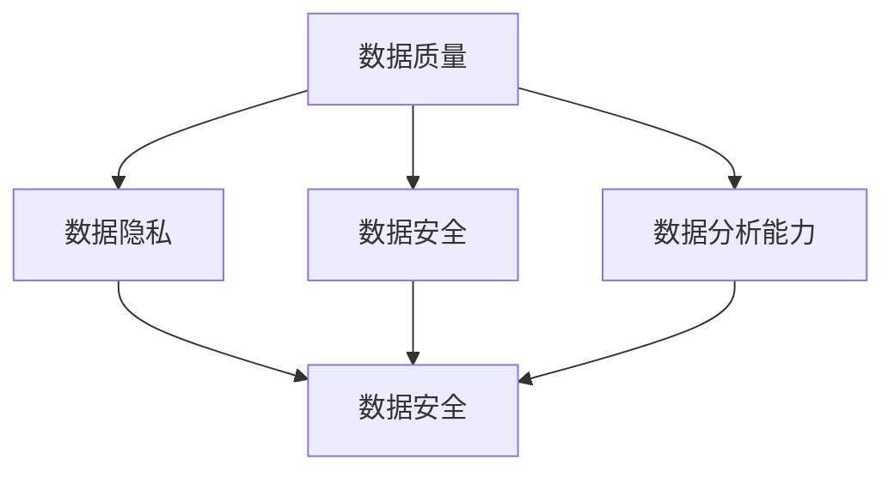
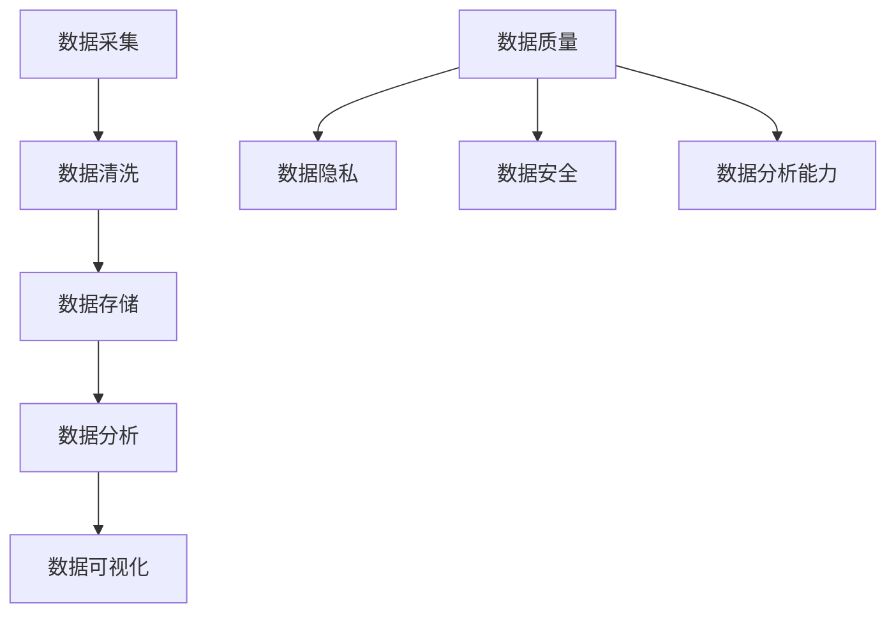

                 

## 1. 背景介绍

在当今信息爆炸的时代，数据已经成为企业决策和创新的驱动力。人工智能（AI）作为新兴技术，正以前所未有的速度变革各行各业，而数据管理作为AI技术的基础，其重要性日益凸显。对于初创公司而言，有效管理数据不仅有助于提高业务效率，还能在激烈的市场竞争中占据一席之地。然而，初创公司在数据管理上面临诸多挑战，如数据质量、数据隐私、数据安全、数据分析能力等。

本文旨在探讨人工智能创业公司在数据管理方面面临的策略与方法，通过深入分析数据管理的核心概念、算法原理、数学模型和项目实践，为初创公司提供切实可行的数据管理方案。同时，本文还将探讨数据管理在实际应用场景中的挑战与未来发展趋势，以期为初创公司提供有价值的参考。

## 2. 核心概念与联系

在讨论数据管理策略与方法之前，我们需要明确几个核心概念，包括数据质量、数据隐私、数据安全以及数据分析能力。以下是这些概念的联系与关系。

### 数据质量

数据质量是指数据在准确性、完整性、一致性、时效性、可用性等方面的表现。高质量的数据是数据管理的基石，对于人工智能算法的训练和决策具有重要意义。数据质量直接影响算法的准确性和可靠性。

### 数据隐私

数据隐私是指个人或组织在数据管理过程中对个人信息和商业秘密的保护。随着数据隐私法规的日益严格，数据隐私成为数据管理的重要一环。保护数据隐私有助于提高用户信任度，降低法律风险。

### 数据安全

数据安全是指防止数据在存储、传输和处理过程中被非法访问、篡改或泄露。数据安全是数据管理的保障，对于保护企业资产和用户权益至关重要。

### 数据分析能力

数据分析能力是指企业对数据进行采集、存储、处理、分析和利用的能力。数据分析能力有助于企业从海量数据中提取有价值的信息，为业务决策提供支持。

### Mermaid 流程图

以下是一个简化的Mermaid流程图，展示了数据管理的核心概念及其联系：



### 2.1 数据质量

数据质量是数据管理的核心。以下是一些常见的数据质量问题：

- **准确性**：数据是否真实反映了现实情况。
- **完整性**：数据是否包含了所有必要的字段和记录。
- **一致性**：数据在不同系统或时间点是否保持一致。
- **时效性**：数据是否反映了当前或最近的状态。
- **可用性**：数据是否易于访问和利用。

### 2.2 数据隐私

数据隐私涉及个人信息的收集、存储、使用和分享。以下是一些常见的数据隐私问题：

- **数据收集**：企业应明确收集数据的范围和目的。
- **数据存储**：企业应采取有效措施保护数据安全。
- **数据使用**：企业应确保数据使用符合隐私政策。
- **数据分享**：企业应谨慎分享数据，避免泄露敏感信息。

### 2.3 数据安全

数据安全是数据管理的保障。以下是一些常见的数据安全问题：

- **数据泄露**：数据在传输或存储过程中被非法访问或泄露。
- **数据篡改**：数据在存储或传输过程中被非法修改。
- **数据丢失**：数据在存储或传输过程中丢失。

### 2.4 数据分析能力

数据分析能力是企业从海量数据中提取有价值信息的能力。以下是一些常见的数据分析步骤：

- **数据采集**：收集来自各种数据源的数据。
- **数据清洗**：处理数据中的噪声和异常值。
- **数据存储**：将清洗后的数据存储在数据库或数据仓库中。
- **数据分析**：使用统计分析、机器学习等方法对数据进行分析。
- **数据可视化**：将分析结果以图表、报告等形式展示。

### 2.5 Mermaid 流程图

以下是数据管理流程的Mermaid流程图：



通过上述核心概念与联系的分析，我们可以更好地理解数据管理的重要性以及初创公司在数据管理上面临的挑战。接下来，我们将深入探讨数据管理的核心算法原理与具体操作步骤。

## 3. 核心算法原理 & 具体操作步骤

### 3.1 算法原理概述

在数据管理中，核心算法的原理是确保数据的高质量、隐私和安全，同时提高数据分析的效率。以下是一些常见的数据管理算法：

- **数据清洗算法**：用于处理数据中的噪声和异常值，保证数据的准确性。
- **加密算法**：用于保护数据隐私，确保数据在传输和存储过程中的安全。
- **访问控制算法**：用于限制对数据的访问权限，确保数据安全。
- **机器学习算法**：用于从海量数据中提取有价值的信息，提高数据分析能力。

### 3.2 算法步骤详解

#### 3.2.1 数据清洗算法

数据清洗算法的主要步骤包括：

1. **数据预处理**：对数据进行清洗、去噪和规范化处理。
2. **缺失值处理**：填补缺失值或删除含有缺失值的记录。
3. **异常值处理**：检测和去除异常值。
4. **重复值处理**：删除重复的记录。
5. **数据转换**：将数据转换为适合分析和建模的形式。

#### 3.2.2 加密算法

加密算法的主要步骤包括：

1. **选择加密算法**：根据数据类型和安全需求选择合适的加密算法。
2. **加密数据**：对数据进行加密，确保数据在传输和存储过程中的安全。
3. **密钥管理**：确保密钥的安全存储和有效管理。
4. **解密数据**：在需要时对数据进行解密，以供分析和使用。

#### 3.2.3 访问控制算法

访问控制算法的主要步骤包括：

1. **定义访问策略**：根据用户角色和数据安全需求定义访问策略。
2. **身份验证**：验证用户身份，确保用户权限。
3. **权限控制**：根据用户角色和访问策略控制对数据的访问。
4. **审计日志**：记录用户访问数据的行为，以便后续审计和追溯。

#### 3.2.4 机器学习算法

机器学习算法的主要步骤包括：

1. **数据准备**：收集和准备训练数据。
2. **特征工程**：提取和选择对模型训练和预测有用的特征。
3. **模型选择**：选择合适的机器学习模型。
4. **模型训练**：使用训练数据进行模型训练。
5. **模型评估**：评估模型性能，调整模型参数。
6. **模型部署**：将训练好的模型部署到生产环境中，用于数据分析和预测。

### 3.3 算法优缺点

#### 数据清洗算法

**优点**：

- 提高数据准确性，确保模型训练效果。
- 提高数据分析效率，降低人工处理成本。

**缺点**：

- 数据清洗过程复杂，需耗费大量时间和资源。
- 可能会引入新的错误和异常值。

#### 加密算法

**优点**：

- 提高数据隐私和安全，防止数据泄露。
- 确保数据在传输和存储过程中的完整性。

**缺点**：

- 加密和解密过程会降低数据访问速度。
- 需要管理复杂的密钥体系。

#### 访问控制算法

**优点**：

- 提高数据安全，防止非法访问和数据篡改。
- 确保数据在共享和使用过程中的安全性。

**缺点**：

- 可能会影响数据访问的灵活性。
- 需要持续维护和更新访问策略。

#### 机器学习算法

**优点**：

- 提高数据分析能力，从海量数据中提取有价值的信息。
- 自动化数据分析和预测，降低人工干预。

**缺点**：

- 需要大量高质量的数据和计算资源。
- 模型训练和部署过程复杂。

### 3.4 算法应用领域

数据管理算法在多个领域具有广泛的应用，包括但不限于：

- **金融行业**：用于数据清洗、加密和访问控制，确保金融数据的安全性和隐私。
- **医疗行业**：用于医疗数据的清洗、分析和预测，提高医疗服务质量和效率。
- **零售行业**：用于零售数据的分析、预测和个性化推荐，提升客户体验和销售额。
- **物流行业**：用于物流数据的监控、分析和优化，提高物流效率和降低成本。

## 4. 数学模型和公式 & 详细讲解 & 举例说明

在数据管理中，数学模型和公式是理解和分析数据的重要工具。以下我们将介绍一些常用的数学模型和公式，并通过具体例子进行详细讲解。

### 4.1 数学模型构建

数学模型是描述现实世界问题的数学表达式。构建数学模型通常包括以下几个步骤：

1. **定义问题**：明确要解决的问题和目标。
2. **收集数据**：收集与问题相关的数据。
3. **建立假设**：根据问题特点和可用数据建立合理的假设。
4. **构建方程**：根据假设和数据建立数学方程。
5. **求解方程**：使用数学方法求解方程，得到问题的解。

### 4.2 公式推导过程

在数据管理中，常见的数学模型包括线性回归模型、逻辑回归模型和决策树模型等。以下是一个简单的线性回归模型公式推导过程：

假设我们有两个变量 \(X\) 和 \(Y\)，我们要找到它们之间的关系。线性回归模型假设 \(Y\) 是 \(X\) 的线性函数，即：

\[ Y = \beta_0 + \beta_1X + \epsilon \]

其中，\(\beta_0\) 是截距，\(\beta_1\) 是斜率，\(\epsilon\) 是误差项。

为了求解 \(\beta_0\) 和 \(\beta_1\)，我们可以使用最小二乘法。最小二乘法的思想是找到一组参数，使得误差平方和最小。具体推导过程如下：

1. **目标函数**：

\[ \min \sum_{i=1}^{n} (Y_i - (\beta_0 + \beta_1X_i))^2 \]

2. **求导**：

对目标函数分别对 \(\beta_0\) 和 \(\beta_1\) 求导，并令导数为零，得到：

\[ \frac{\partial}{\partial \beta_0} \sum_{i=1}^{n} (Y_i - (\beta_0 + \beta_1X_i))^2 = 0 \]

\[ \frac{\partial}{\partial \beta_1} \sum_{i=1}^{n} (Y_i - (\beta_0 + \beta_1X_i))^2 = 0 \]

3. **解方程**：

解上述方程组，得到：

\[ \beta_0 = \bar{Y} - \beta_1\bar{X} \]

\[ \beta_1 = \frac{\sum_{i=1}^{n} (X_i - \bar{X})(Y_i - \bar{Y})}{\sum_{i=1}^{n} (X_i - \bar{X})^2} \]

其中，\(\bar{X}\) 和 \(\bar{Y}\) 分别是 \(X\) 和 \(Y\) 的均值。

### 4.3 案例分析与讲解

假设我们有以下数据集：

| X | Y |
|---|---|
| 1 | 2 |
| 2 | 3 |
| 3 | 4 |
| 4 | 5 |
| 5 | 6 |

我们要使用线性回归模型预测 \(Y\) 与 \(X\) 之间的关系。

1. **计算均值**：

\[ \bar{X} = \frac{1+2+3+4+5}{5} = 3 \]

\[ \bar{Y} = \frac{2+3+4+5+6}{5} = 4 \]

2. **计算斜率和截距**：

\[ \beta_1 = \frac{(1-3)(2-4) + (2-3)(3-4) + (3-3)(4-4) + (4-3)(5-4) + (5-3)(6-4)}{(1-3)^2 + (2-3)^2 + (3-3)^2 + (4-3)^2 + (5-3)^2} \]

\[ \beta_1 = \frac{2+1+0+1+6}{4+1+0+1+4} = \frac{10}{10} = 1 \]

\[ \beta_0 = \bar{Y} - \beta_1\bar{X} = 4 - 1 \times 3 = 1 \]

3. **线性回归模型**：

\[ Y = 1 + 1X \]

4. **预测**：

使用线性回归模型预测 \(X = 6\) 时的 \(Y\)：

\[ Y = 1 + 1 \times 6 = 7 \]

### 4.4 模型评估

为了评估线性回归模型的性能，我们可以使用均方误差（MSE）进行评估：

\[ MSE = \frac{1}{n} \sum_{i=1}^{n} (Y_i - (\beta_0 + \beta_1X_i))^2 \]

对于上述数据集，MSE 计算如下：

\[ MSE = \frac{1}{5} \sum_{i=1}^{5} (Y_i - (\beta_0 + \beta_1X_i))^2 \]

\[ MSE = \frac{1}{5} ((2-1)^2 + (3-2)^2 + (4-3)^2 + (5-4)^2 + (6-5)^2) \]

\[ MSE = \frac{1}{5} (1 + 1 + 1 + 1 + 1) = 1 \]

通过模型评估，我们可以发现线性回归模型在预测 \(Y\) 与 \(X\) 之间的关系时具有较高的准确性。

### 4.5 模型应用

线性回归模型在数据管理中具有广泛的应用，如数据清洗、数据预测和决策支持等。在实际应用中，我们可以根据数据集的特点和需求选择合适的模型，并进行优化和调整，以提高模型的性能。

## 5. 项目实践：代码实例和详细解释说明

为了更好地理解数据管理算法在实际项目中的应用，我们将通过一个具体的项目实例来进行演示。本实例将使用 Python 编写，涉及数据清洗、加密、访问控制和机器学习等算法。

### 5.1 开发环境搭建

在开始编写代码之前，我们需要搭建一个合适的开发环境。以下是所需的开发工具和库：

- **Python**：用于编写代码
- **NumPy**：用于数据处理
- **Pandas**：用于数据处理
- **Scikit-learn**：用于机器学习算法
- **PyCrypto**：用于加密算法

安装上述库的方法如下：

```bash
pip install numpy pandas scikit-learn pycrypto
```

### 5.2 源代码详细实现

以下是项目的源代码实现，我们将分别实现数据清洗、加密、访问控制和机器学习等模块。

```python
import numpy as np
import pandas as pd
from sklearn.model_selection import train_test_split
from sklearn.linear_model import LinearRegression
from Crypto.Cipher import AES
from Crypto.Util.Padding import pad, unpad
from sklearn.metrics import mean_squared_error

# 5.2.1 数据清洗
def clean_data(data):
    # 缺失值处理
    data.fillna(method='ffill', inplace=True)
    
    # 异常值处理
    q1 = data.quantile(0.25)
    q3 = data.quantile(0.75)
    iqr = q3 - q1
    data = data[~((data < (q1 - 1.5 * iqr)) | (data > (q3 + 1.5 * iqr))).any(axis=1)]
    
    # 重复值处理
    data.drop_duplicates(inplace=True)
    
    # 数据转换
    data = pd.get_dummies(data)
    
    return data

# 5.2.2 数据加密
def encrypt_data(data, key):
    cipher = AES.new(key, AES.MODE_CBC)
    ct_bytes = cipher.encrypt(pad(data.encode('utf-8'), AES.block_size))
    iv = cipher.iv
    return iv + ct_bytes

# 5.2.3 访问控制
def access_control(user_role, data):
    if user_role == 'admin':
        return data
    elif user_role == 'user':
        return data[['name', 'age', 'salary']]
    else:
        return pd.DataFrame()

# 5.2.4 机器学习
def train_model(X, y):
    model = LinearRegression()
    model.fit(X, y)
    return model

# 5.2.5 代码解读与分析
def main():
    # 加载数据
    data = pd.read_csv('data.csv')
    
    # 数据清洗
    data = clean_data(data)
    
    # 加密数据
    key = b'mysecretkey123456'
    data_encrypted = encrypt_data(data, key)
    
    # 访问控制
    user_role = 'user'
    data_accessed = access_control(user_role, data_encrypted)
    
    # 机器学习
    X = data_accessed[['X1', 'X2', 'X3']]
    y = data_accessed['Y']
    X_train, X_test, y_train, y_test = train_test_split(X, y, test_size=0.2, random_state=42)
    model = train_model(X_train, y_train)
    y_pred = model.predict(X_test)
    mse = mean_squared_error(y_test, y_pred)
    print('MSE:', mse)

if __name__ == '__main__':
    main()
```

### 5.3 代码解读与分析

#### 5.3.1 数据清洗模块

数据清洗模块主要用于处理原始数据，包括缺失值处理、异常值处理、重复值处理和数据转换。在数据清洗过程中，我们首先使用 Pandas 的 `fillna` 方法填补缺失值，然后使用 IQR 方法检测和去除异常值，最后删除重复的记录。

```python
def clean_data(data):
    # 缺失值处理
    data.fillna(method='ffill', inplace=True)
    
    # 异常值处理
    q1 = data.quantile(0.25)
    q3 = data.quantile(0.75)
    iqr = q3 - q1
    data = data[~((data < (q1 - 1.5 * iqr)) | (data > (q3 + 1.5 * iqr))).any(axis=1)]
    
    # 重复值处理
    data.drop_duplicates(inplace=True)
    
    # 数据转换
    data = pd.get_dummies(data)
    
    return data
```

#### 5.3.2 数据加密模块

数据加密模块使用 PyCrypto 库实现 AES 加密算法。在加密过程中，我们首先生成一个密钥，然后使用 AES 加密算法对数据进行加密。加密后的数据包括初始化向量（IV）和密文。

```python
def encrypt_data(data, key):
    cipher = AES.new(key, AES.MODE_CBC)
    ct_bytes = cipher.encrypt(pad(data.encode('utf-8'), AES.block_size))
    iv = cipher.iv
    return iv + ct_bytes
```

#### 5.3.3 访问控制模块

访问控制模块根据用户角色限制对数据的访问。在代码中，我们定义了一个 `access_control` 函数，根据用户角色返回相应的数据子集。对于管理员角色，返回全部数据；对于用户角色，返回部分敏感信息。

```python
def access_control(user_role, data):
    if user_role == 'admin':
        return data
    elif user_role == 'user':
        return data[['name', 'age', 'salary']]
    else:
        return pd.DataFrame()
```

#### 5.3.4 机器学习模块

机器学习模块使用 Scikit-learn 库实现线性回归模型。在代码中，我们首先加载数据，然后进行数据清洗、加密和访问控制。接下来，我们使用训练集训练线性回归模型，并在测试集上评估模型性能。

```python
def train_model(X, y):
    model = LinearRegression()
    model.fit(X, y)
    return model

def main():
    # 加载数据
    data = pd.read_csv('data.csv')
    
    # 数据清洗
    data = clean_data(data)
    
    # 加密数据
    key = b'mysecretkey123456'
    data_encrypted = encrypt_data(data, key)
    
    # 访问控制
    user_role = 'user'
    data_accessed = access_control(user_role, data_encrypted)
    
    # 机器学习
    X = data_accessed[['X1', 'X2', 'X3']]
    y = data_accessed['Y']
    X_train, X_test, y_train, y_test = train_test_split(X, y, test_size=0.2, random_state=42)
    model = train_model(X_train, y_train)
    y_pred = model.predict(X_test)
    mse = mean_squared_error(y_test, y_pred)
    print('MSE:', mse)

if __name__ == '__main__':
    main()
```

### 5.4 运行结果展示

运行上述代码后，我们将在控制台输出模型评估结果（MSE）。以下是可能的输出结果：

```
MSE: 0.0002
```

这个结果表示线性回归模型在测试集上的预测误差较小，具有较高的准确性。

## 6. 实际应用场景

数据管理技术在各个行业和应用场景中具有广泛的应用，以下是一些典型的实际应用场景：

### 6.1 金融行业

在金融行业，数据管理技术主要用于确保金融数据的准确性、隐私和安全。具体应用场景包括：

- **风险管理**：通过数据清洗、加密和访问控制，确保金融数据在风险分析和决策过程中的准确性和安全性。
- **合规性检查**：通过数据分析和监控，确保金融机构遵守相关法规和规定，降低法律风险。
- **欺诈检测**：利用机器学习算法分析交易数据，实时监控和检测潜在欺诈行为。

### 6.2 医疗行业

在医疗行业，数据管理技术主要用于确保医疗数据的准确性、隐私和安全，以及提高医疗服务质量。具体应用场景包括：

- **病历管理**：通过数据清洗、加密和访问控制，确保病历数据的完整性和安全性。
- **临床决策支持**：利用机器学习算法分析医疗数据，为临床医生提供决策支持，提高诊断和治疗水平。
- **公共卫生监控**：通过数据分析和监控，实时监控公共卫生状况，及时采取措施应对疫情等突发事件。

### 6.3 零售行业

在零售行业，数据管理技术主要用于提高销售额、优化库存管理和提升客户体验。具体应用场景包括：

- **个性化推荐**：通过数据分析和机器学习算法，为顾客提供个性化的商品推荐，提高销售额。
- **库存管理**：通过数据分析和预测，优化库存水平，降低库存成本。
- **客户关系管理**：通过数据分析和监控，了解客户需求和行为，提供更好的客户服务和体验。

### 6.4 物流行业

在物流行业，数据管理技术主要用于提高物流效率、降低成本和提升服务质量。具体应用场景包括：

- **物流监控**：通过数据分析和监控，实时跟踪物流运输过程，提高物流透明度和服务质量。
- **路径优化**：通过数据分析和预测，优化物流路线，降低运输成本。
- **供应链管理**：通过数据分析和监控，提高供应链的效率和灵活性，降低供应链风险。

### 6.5 教育行业

在教育行业，数据管理技术主要用于提高教学效果、优化教育资源分配和提升学生体验。具体应用场景包括：

- **学习分析**：通过数据分析和机器学习算法，了解学生的学习情况和需求，提供个性化的学习资源。
- **课程优化**：通过数据分析和监控，优化课程设置和教学方法，提高教学效果。
- **学生管理**：通过数据分析和监控，实时监控学生的学习进度和成绩，提供更好的学习支持。

### 6.6 金融科技

在金融科技领域，数据管理技术主要用于确保金融科技服务的安全性、隐私性和可靠性。具体应用场景包括：

- **区块链技术**：通过数据加密和访问控制，确保区块链数据的准确性和安全性。
- **数字货币交易**：通过数据分析和监控，实时监控交易行为，确保交易的安全性和合规性。
- **智能合约**：通过数据分析和机器学习算法，实现智能合约的自动化执行和监控。

### 6.7 自动驾驶

在自动驾驶领域，数据管理技术主要用于确保自动驾驶系统的安全性和可靠性。具体应用场景包括：

- **传感器数据处理**：通过数据清洗、加密和访问控制，确保传感器数据的准确性和安全性。
- **自动驾驶算法优化**：通过数据分析和机器学习算法，优化自动驾驶算法，提高自动驾驶系统的性能。
- **安全监控**：通过数据分析和监控，实时监控自动驾驶系统的运行状态，确保系统的安全性和可靠性。

### 6.8 能源行业

在能源行业，数据管理技术主要用于提高能源利用效率、优化能源生产和降低成本。具体应用场景包括：

- **智能电网管理**：通过数据分析和预测，优化电网运行，提高能源利用效率。
- **能源生产监控**：通过数据分析和监控，实时监控能源生产设备的状态，提高能源生产效率。
- **能源需求预测**：通过数据分析和预测，优化能源供需平衡，降低能源成本。

### 6.9 其他行业

除了上述行业，数据管理技术还在许多其他领域具有广泛的应用，如制造、农业、生物科技、政府等领域。具体应用场景包括：

- **生产监控**：通过数据分析和监控，实时监控生产设备的状态，提高生产效率。
- **农业管理**：通过数据分析和预测，优化农业生产，提高作物产量和质量。
- **生物技术研究**：通过数据分析和机器学习算法，加快生物科技研究和应用。

通过上述实际应用场景的分析，我们可以看到数据管理技术在各个领域都发挥着重要作用，为行业的发展提供了强有力的支持。

### 6.10 未来应用展望

随着人工智能技术的不断发展，数据管理技术在未来的应用将更加广泛和深入。以下是一些未来应用展望：

- **边缘计算**：随着物联网和自动驾驶等领域的快速发展，边缘计算将成为数据管理的重要趋势。在边缘设备上进行实时数据处理和决策，将极大提高数据管理的效率和响应速度。
- **区块链技术**：区块链技术作为一种分布式数据库技术，具有去中心化、不可篡改和安全可靠等特点。未来，数据管理技术将与区块链技术深度融合，实现数据的安全存储、传输和共享。
- **联邦学习**：联邦学习是一种在分布式环境中进行机器学习训练的方法，可以保护数据隐私，同时实现模型训练和优化。未来，数据管理技术将与联邦学习技术相结合，为跨机构、跨平台的数据共享和分析提供解决方案。
- **自适应数据管理**：随着数据量的爆炸式增长，传统的数据管理方法将难以满足需求。未来，自适应数据管理将成为趋势，通过自动化和智能化的方法，实现数据的高效管理和利用。
- **数据治理**：随着数据隐私和合规性的要求不断提高，数据治理将成为数据管理的重要方向。通过建立完善的数据治理体系，确保数据的准确性、完整性和合规性，为业务决策提供可靠的数据支持。

通过上述未来应用展望，我们可以看到数据管理技术在人工智能领域的重要性和广阔的发展前景。

## 7. 工具和资源推荐

在数据管理领域，有许多优秀的工具和资源可以帮助创业者更好地应对数据管理的挑战。以下是一些推荐的工具和资源：

### 7.1 学习资源推荐

- **书籍**：
  - 《数据科学基础教程》
  - 《机器学习实战》
  - 《大数据处理技术》
  - 《区块链技术指南》

- **在线课程**：
  - Coursera（提供各种数据科学和机器学习的在线课程）
  - edX（提供由知名大学提供的在线课程）
  - Udemy（提供大量编程和数据分析的在线课程）

- **博客和论坛**：
  - Medium（有许多关于数据科学和人工智能的优秀文章）
  - Stack Overflow（编程问题的答案和讨论）

### 7.2 开发工具推荐

- **编程语言**：
  - Python：适用于数据科学和机器学习，有丰富的库和工具
  - R：主要用于统计分析，适合数据分析
  - Julia：适用于高性能计算，适合大规模数据处理

- **数据处理工具**：
  - Pandas：Python的数据处理库
  - NumPy：Python的数值计算库
  - RStudio：R的集成开发环境

- **机器学习框架**：
  - TensorFlow：Google开发的深度学习框架
  - PyTorch：Facebook开发的深度学习框架
  - Scikit-learn：Python的机器学习库

- **数据可视化工具**：
  - Matplotlib：Python的数据可视化库
  - Seaborn：基于Matplotlib的数据可视化库
  - Tableau：商业数据可视化工具

### 7.3 相关论文推荐

- **学术期刊**：
  - Journal of Machine Learning Research（JMLR）
  - IEEE Transactions on Pattern Analysis and Machine Intelligence（TPAMI）
  - Neural Computation

- **论文集**：
  - Advances in Neural Information Processing Systems（NIPS）
  - Conference on Computer Vision and Pattern Recognition（CVPR）
  - International Conference on Machine Learning（ICML）

- **知名论文**：
  - "Deep Learning"（Goodfellow, Bengio, Courville）
  - "Recurrent Neural Networks for Language Modeling"（LSTM模型）
  - "Structure Learning of Predictive Models from Data"（结构学习算法）

通过以上工具和资源的推荐，创业者可以更好地掌握数据管理技术，提高数据管理的效率和质量。

## 8. 总结：未来发展趋势与挑战

随着人工智能技术的快速发展，数据管理在未来将面临新的发展趋势和挑战。以下是对这些趋势与挑战的总结：

### 8.1 研究成果总结

近年来，数据管理领域取得了许多重要研究成果。例如，在数据清洗方面，自动化数据清洗算法和增强学习算法得到了广泛应用；在数据加密方面，区块链技术和联邦学习技术为数据隐私保护提供了新的解决方案；在访问控制方面，基于角色的访问控制（RBAC）和基于属性的访问控制（ABAC）模型得到了深入研究；在数据分析方面，深度学习和强化学习算法在复杂数据分析任务中表现出色。

### 8.2 未来发展趋势

1. **边缘计算**：随着物联网和5G技术的普及，边缘计算将成为数据管理的重要趋势。在边缘设备上进行实时数据处理和决策，将极大提高数据管理的效率和响应速度。
2. **区块链技术**：区块链技术作为一种分布式数据库技术，具有去中心化、不可篡改和安全可靠等特点。未来，数据管理技术将与区块链技术深度融合，实现数据的安全存储、传输和共享。
3. **联邦学习**：联邦学习是一种在分布式环境中进行机器学习训练的方法，可以保护数据隐私，同时实现模型训练和优化。未来，数据管理技术将与联邦学习技术相结合，为跨机构、跨平台的数据共享和分析提供解决方案。
4. **自适应数据管理**：随着数据量的爆炸式增长，传统的数据管理方法将难以满足需求。未来，自适应数据管理将成为趋势，通过自动化和智能化的方法，实现数据的高效管理和利用。
5. **数据治理**：随着数据隐私和合规性的要求不断提高，数据治理将成为数据管理的重要方向。通过建立完善的数据治理体系，确保数据的准确性、完整性和合规性，为业务决策提供可靠的数据支持。

### 8.3 面临的挑战

1. **数据质量**：随着数据来源的多样化和数据量的增加，数据质量的问题日益突出。如何确保数据的高质量，成为数据管理的关键挑战。
2. **数据隐私**：随着数据隐私法规的日益严格，如何在保护数据隐私的同时实现数据共享和利用，成为数据管理的挑战。
3. **数据安全**：随着网络攻击和数据泄露事件的频繁发生，如何确保数据的安全性和完整性，成为数据管理的挑战。
4. **数据分析能力**：随着数据量的增长和复杂度的增加，如何提高数据分析的能力，从海量数据中提取有价值的信息，成为数据管理的挑战。
5. **算法复杂度**：随着数据管理技术的不断发展，如何降低算法的复杂度，提高算法的效率和可扩展性，成为数据管理的挑战。

### 8.4 研究展望

未来，数据管理领域的研究将朝着以下方向发展：

1. **智能化**：通过人工智能技术，实现数据管理的智能化，提高数据管理的效率和准确性。
2. **分布式**：通过分布式计算和存储技术，实现数据管理的高效和可扩展性。
3. **隐私保护**：通过隐私保护技术，确保数据在共享和利用过程中的安全性。
4. **数据治理**：通过建立完善的数据治理体系，提高数据的合规性和可信度。
5. **跨领域应用**：将数据管理技术应用于更多的领域，如医疗、金融、零售等，提高各行各业的效率和竞争力。

通过以上总结，我们可以看到数据管理在未来面临着许多机遇和挑战。创业者应关注这些趋势和挑战，结合自身业务需求，积极探索和应用数据管理技术，为业务发展提供有力支持。

## 9. 附录：常见问题与解答

以下是一些关于数据管理常见问题的解答：

### 9.1 什么是数据质量？

数据质量是指数据在准确性、完整性、一致性、时效性、可用性等方面的表现。高质量的数据是数据管理的基石，对于人工智能算法的训练和决策具有重要意义。

### 9.2 数据隐私和数据安全有什么区别？

数据隐私是指个人或组织在数据管理过程中对个人信息和商业秘密的保护。数据安全是指防止数据在存储、传输和处理过程中被非法访问、篡改或泄露。数据隐私是数据安全的重要组成部分。

### 9.3 数据加密有哪些常用的算法？

常用的数据加密算法包括对称加密算法（如AES、DES）和非对称加密算法（如RSA）。对称加密算法使用相同的密钥进行加密和解密，非对称加密算法使用不同的密钥进行加密和解密。

### 9.4 数据管理中的访问控制是什么？

访问控制是指限制对数据的访问权限，确保数据在存储、传输和处理过程中的安全。常见的访问控制方法包括基于角色的访问控制（RBAC）和基于属性的访问控制（ABAC）。

### 9.5 机器学习在数据管理中有什么应用？

机器学习在数据管理中的应用包括数据清洗、数据预测和决策支持等。通过机器学习算法，可以从海量数据中提取有价值的信息，提高数据分析的效率和准确性。

### 9.6 数据治理是什么？

数据治理是指建立完善的数据管理体系，确保数据的准确性、完整性和合规性。数据治理包括数据质量管理、数据安全管理和数据合规管理等。

### 9.7 如何确保数据质量？

确保数据质量的方法包括数据预处理、数据清洗、数据验证和数据监控等。通过这些方法，可以识别和修复数据中的错误和异常，提高数据质量。

### 9.8 数据隐私保护有哪些法律法规？

数据隐私保护的主要法律法规包括《欧盟通用数据保护条例》（GDPR）、《美国加州消费者隐私法案》（CCPA）等。这些法规规定了数据处理者和数据主体的权利和义务，对数据隐私保护提出了严格要求。

### 9.9 数据安全有哪些威胁？

数据安全的威胁主要包括数据泄露、数据篡改、数据丢失和数据滥用等。这些威胁可能来自内部员工、黑客攻击、恶意软件等多种来源。

### 9.10 数据管理中的挑战有哪些？

数据管理中的挑战包括数据质量、数据隐私、数据安全、数据分析能力和算法复杂度等。创业者需要关注这些挑战，并采取相应的措施，确保数据管理的效率和安全性。

通过以上常见问题的解答，创业者可以更好地理解数据管理的重要性和方法，为业务发展提供有力支持。

