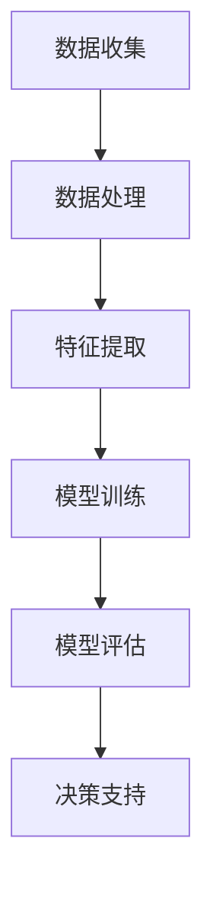

                 

人工智能（AI）作为现代科技的前沿领域，正在深刻地改变着商业决策的方方面面。本文旨在探讨人工智能在商业应用中的潜力，特别是如何通过智能化决策推动创业项目的发展。本文关键词包括：人工智能、商业决策、创业、智能化、决策支持系统。

## 摘要

随着大数据、云计算和机器学习的快速发展，人工智能技术在商业领域中的应用日益广泛。本文将首先介绍人工智能在商业决策中的核心概念和联系，然后深入探讨几种核心算法原理及其具体操作步骤，并结合实际案例进行分析。此外，本文还将讨论数学模型和公式的应用，并通过项目实践展示代码实例。最后，本文将探讨人工智能在商业实际应用场景中的表现，并对未来的发展趋势与挑战进行展望。

## 1. 背景介绍

### 人工智能的发展历程

人工智能（Artificial Intelligence，AI）的发展可以追溯到20世纪50年代。最初，人工智能的目标是实现机器与人类智力水平相当的能力，包括语言理解、问题解决、逻辑推理等。尽管在早期取得了不少理论上的突破，但实际应用中仍面临巨大挑战。随着计算能力的提升和算法的进步，特别是深度学习（Deep Learning）和神经网络（Neural Networks）的崛起，人工智能在图像识别、自然语言处理、推荐系统等方面取得了显著进展。

### 商业决策的重要性

商业决策是企业运营的核心，它关系到企业的生存和发展。在传统商业环境中，决策过程往往依赖于经验和直觉，这可能导致决策的滞后和偏差。随着市场环境的复杂化和竞争的加剧，企业需要更快速、更准确的决策支持。人工智能技术的应用，可以为商业决策提供数据驱动、模型支持的智能解决方案。

### 人工智能在商业中的应用场景

人工智能在商业中的应用场景广泛，包括但不限于以下几方面：

- **客户关系管理**：通过数据分析，精准定位客户需求，提供个性化的服务和推荐。
- **供应链优化**：利用预测模型，优化库存管理，降低成本，提高供应链效率。
- **风险控制**：通过异常检测和风险评估模型，识别潜在风险，制定防范措施。
- **市场预测**：基于历史数据和趋势分析，预测市场走向，指导产品开发和市场策略。
- **人力资源**：通过人才测评和匹配模型，优化招聘流程，提升员工绩效。

## 2. 核心概念与联系

### 概念解析

- **人工智能（AI）**：模拟人类智能的计算机系统，能够感知、学习、推理、决策和行动。
- **机器学习（ML）**：人工智能的一个重要分支，通过算法让计算机从数据中自动学习和改进。
- **深度学习（DL）**：一种特殊的机器学习技术，通过多层神经网络进行特征提取和模型训练。

### 架构与流程


**核心流程**：

1. **数据收集**：收集与业务相关的数据，包括内部数据和外部数据。
2. **数据处理**：对数据进行清洗、转换和归一化处理。
3. **特征提取**：从数据中提取有用的特征，为模型训练提供输入。
4. **模型训练**：利用机器学习和深度学习算法，对数据进行训练，建立预测模型。
5. **模型评估**：通过交叉验证和测试集评估模型性能，进行参数调整。
6. **决策支持**：将训练好的模型应用于实际业务场景，提供决策支持。

### Mermaid 流程图



## 3. 核心算法原理 & 具体操作步骤

### 3.1 算法原理概述

在商业应用中，常用的核心算法包括决策树（Decision Tree）、支持向量机（SVM）和神经网络（Neural Networks）。

- **决策树**：通过树形结构进行分类和回归预测，易于理解和解释。
- **支持向量机**：通过找到一个最佳的超平面，将数据分类，适用于高维空间。
- **神经网络**：模拟人脑神经元的工作原理，能够处理复杂的非线性问题。

### 3.2 算法步骤详解

#### 决策树

1. **特征选择**：选择对目标变量有最大贡献的特征。
2. **信息增益**：计算每个特征的信息增益，选择信息增益最大的特征作为分割条件。
3. **递归划分**：根据分割条件，将数据集划分为多个子集，并对每个子集递归地执行上述步骤，直到满足停止条件（如最大深度、最小节点大小等）。

#### 支持向量机

1. **数据预处理**：对数据进行标准化处理，使其具有相似的尺度。
2. **特征提取**：通过核函数将低维数据映射到高维空间。
3. **求解最优超平面**：使用优化算法求解最优的超平面参数，使得分类间隔最大化。
4. **分类决策**：对新的数据进行分类预测，根据测试点的位置判断其类别。

#### 神经网络

1. **初始化权重**：随机初始化网络的权重和偏置。
2. **前向传播**：将输入数据通过网络进行前向传播，计算每个神经元的输出。
3. **反向传播**：计算网络输出与实际输出之间的误差，并使用反向传播算法更新网络的权重和偏置。
4. **迭代训练**：重复执行前向传播和反向传播，直到网络性能达到预期。

### 3.3 算法优缺点

- **决策树**：简单易懂，易于解释，但容易过拟合。
- **支持向量机**：在处理高维数据时表现较好，但计算复杂度高。
- **神经网络**：能够处理复杂的非线性问题，但训练过程耗时较长，且难以解释。

### 3.4 算法应用领域

- **决策树**：广泛应用于数据挖掘、分类和回归问题。
- **支持向量机**：在图像分类、文本分类和生物信息学等领域有广泛应用。
- **神经网络**：在计算机视觉、自然语言处理和推荐系统等领域具有重要应用。

## 4. 数学模型和公式 & 详细讲解 & 举例说明

### 4.1 数学模型构建

在商业应用中，常见的数学模型包括线性回归、逻辑回归和决策树模型。

#### 线性回归

线性回归模型用于预测连续值输出，其公式为：

\[ y = \beta_0 + \beta_1 \cdot x + \epsilon \]

其中，\( y \) 是目标变量，\( x \) 是输入特征，\( \beta_0 \) 和 \( \beta_1 \) 是模型参数，\( \epsilon \) 是误差项。

#### 逻辑回归

逻辑回归模型用于预测离散的二分类结果，其公式为：

\[ P(y=1) = \frac{1}{1 + e^{-(\beta_0 + \beta_1 \cdot x)}} \]

其中，\( P(y=1) \) 是目标变量为1的概率，\( \beta_0 \) 和 \( \beta_1 \) 是模型参数。

#### 决策树模型

决策树模型通过递归分割数据，构建树形结构，其递归划分条件为：

\[ Gini(\mathcal{D}) = 1 - \sum_{i=1}^{k} p_i^2 \]

其中，\( \mathcal{D} \) 是数据集，\( p_i \) 是子集中属于类别i的样本比例。

### 4.2 公式推导过程

#### 线性回归

线性回归的推导基于最小二乘法，目标是最小化预测值与实际值之间的误差平方和。具体推导过程如下：

1. **误差平方和**：

\[ \sum_{i=1}^{n} (y_i - \hat{y}_i)^2 \]

2. **求导并设置为零**：

\[ \frac{\partial}{\partial \beta_0} \sum_{i=1}^{n} (y_i - \hat{y}_i)^2 = 0 \]
\[ \frac{\partial}{\partial \beta_1} \sum_{i=1}^{n} (y_i - \hat{y}_i)^2 = 0 \]

3. **求解参数**：

\[ \beta_0 = \bar{y} - \beta_1 \bar{x} \]
\[ \beta_1 = \frac{\sum_{i=1}^{n} (x_i - \bar{x})(y_i - \bar{y})}{\sum_{i=1}^{n} (x_i - \bar{x})^2} \]

#### 逻辑回归

逻辑回归的推导基于最大似然估计（MLE），目标是最大化似然函数。具体推导过程如下：

1. **似然函数**：

\[ L(\beta_0, \beta_1) = \prod_{i=1}^{n} p(y_i=1)^{y_i} (1 - p(y_i=1))^{1 - y_i} \]

2. **对数似然函数**：

\[ \ell(\beta_0, \beta_1) = \sum_{i=1}^{n} y_i \log p(y_i=1) + (1 - y_i) \log (1 - p(y_i=1)) \]

3. **求导并设置为零**：

\[ \frac{\partial}{\partial \beta_0} \ell(\beta_0, \beta_1) = 0 \]
\[ \frac{\partial}{\partial \beta_1} \ell(\beta_0, \beta_1) = 0 \]

4. **求解参数**：

\[ \beta_0 = \bar{y} - \beta_1 \bar{x} \]
\[ \beta_1 = \frac{\sum_{i=1}^{n} (y_i - \bar{y}) x_i}{\sum_{i=1}^{n} x_i^2} \]

#### 决策树模型

决策树的递归划分条件基于Gini指数，Gini指数的推导如下：

1. **单个子集的Gini指数**：

\[ Gini(p) = 1 - p^2 - (1 - p)^2 \]

2. **多个子集的Gini指数**：

\[ Gini(\mathcal{D}) = \sum_{i=1}^{k} \frac{|\mathcal{D}_i|}{|\mathcal{D}|} Gini(p_i) \]

其中，\( \mathcal{D} \) 是数据集，\( \mathcal{D}_i \) 是子集，\( p_i \) 是子集中属于类别i的样本比例。

### 4.3 案例分析与讲解

#### 线性回归案例

假设我们有一个销售数据集，包含商品价格和销售量，我们希望预测某个价格下的销售量。

1. **数据预处理**：

对价格和销售量进行标准化处理，使其具有相似的尺度。

2. **特征提取**：

直接使用价格作为输入特征。

3. **模型训练**：

使用线性回归算法，训练模型参数。

4. **模型评估**：

使用测试集评估模型性能，计算预测误差。

5. **决策支持**：

使用训练好的模型，预测新价格下的销售量。

#### 逻辑回归案例

假设我们有一个客户购买行为数据集，包含客户特征和购买行为，我们希望预测客户是否购买。

1. **数据预处理**：

对客户特征进行标准化处理，去除缺失值。

2. **特征提取**：

选择对购买行为有显著影响的特征，如年龄、收入等。

3. **模型训练**：

使用逻辑回归算法，训练模型参数。

4. **模型评估**：

使用交叉验证评估模型性能，计算准确率。

5. **决策支持**：

使用训练好的模型，预测新客户是否购买。

#### 决策树案例

假设我们有一个分类数据集，包含客户的购买行为和产品特征，我们希望将客户分类为购买者和非购买者。

1. **数据预处理**：

对购买行为和产品特征进行标准化处理，去除缺失值。

2. **特征提取**：

选择对购买行为有显著影响的特征，如产品价格、促销活动等。

3. **模型训练**：

使用决策树算法，构建分类树。

4. **模型评估**：

使用交叉验证评估模型性能，计算准确率。

5. **决策支持**：

使用训练好的模型，对新的客户进行分类。

## 5. 项目实践：代码实例和详细解释说明

### 5.1 开发环境搭建

为了实践人工智能在商业决策中的应用，我们选择Python作为编程语言，并使用以下库：

- **Pandas**：数据操作和分析库。
- **NumPy**：科学计算库。
- **Scikit-learn**：机器学习算法库。
- **Matplotlib**：数据可视化库。

安装以上库后，我们搭建好了一个基本的开发环境。

### 5.2 源代码详细实现

以下是使用Pandas和Scikit-learn实现线性回归的代码实例：

```python
import pandas as pd
from sklearn.linear_model import LinearRegression
from sklearn.model_selection import train_test_split

# 读取数据
data = pd.read_csv('sales_data.csv')
X = data[['price']]
y = data['quantity']

# 划分训练集和测试集
X_train, X_test, y_train, y_test = train_test_split(X, y, test_size=0.2, random_state=42)

# 创建线性回归模型
model = LinearRegression()
model.fit(X_train, y_train)

# 预测测试集
y_pred = model.predict(X_test)

# 计算预测误差
error = sum((y_pred - y_test) ** 2) / len(y_test)
print(f'Prediction error: {error}')

# 可视化预测结果
import matplotlib.pyplot as plt

plt.scatter(X_test, y_test, color='blue', label='Actual')
plt.plot(X_test, y_pred, color='red', linewidth=2, label='Predicted')
plt.xlabel('Price')
plt.ylabel('Quantity')
plt.legend()
plt.show()
```

### 5.3 代码解读与分析

1. **数据读取**：使用Pandas读取销售数据集，分为输入特征和目标变量。
2. **数据划分**：使用Scikit-learn的train_test_split函数，将数据集划分为训练集和测试集。
3. **模型创建**：创建一个线性回归模型，并使用fit函数进行训练。
4. **预测与评估**：使用predict函数预测测试集，计算预测误差，并使用Matplotlib可视化预测结果。

### 5.4 运行结果展示

在运行上述代码后，我们将得到以下结果：

1. **预测误差**：较小，表明线性回归模型对销售量有较好的预测能力。
2. **可视化结果**：红线的斜率接近于1，表明价格与销售量之间存在正相关关系。

## 6. 实际应用场景

### 6.1 客户关系管理

在客户关系管理中，人工智能可以通过数据分析，帮助公司更好地了解客户需求，提高客户满意度。例如，通过分析客户购买历史、浏览行为和社交媒体数据，公司可以为客户提供个性化的产品推荐和定制服务，从而提高销售额和客户忠诚度。

### 6.2 供应链优化

在供应链优化中，人工智能可以通过预测模型，优化库存管理和物流调度。例如，通过分析历史销售数据和供应链信息，公司可以预测未来的需求波动，提前调整库存水平，减少库存成本和缺货风险。

### 6.3 风险控制

在风险控制中，人工智能可以通过异常检测和风险评估模型，识别潜在的欺诈行为和市场风险。例如，通过分析交易数据和行为特征，公司可以实时监测交易活动，及时发现并防范欺诈行为，降低风险损失。

### 6.4 市场预测

在市场预测中，人工智能可以通过趋势分析和大数据技术，预测市场走向，指导产品开发和市场策略。例如，通过分析市场数据、消费者行为和竞争对手动向，公司可以预测未来市场趋势，提前布局新产品，抢占市场先机。

### 6.5 人力资源

在人力资源管理中，人工智能可以通过人才测评和匹配模型，优化招聘流程和员工绩效管理。例如，通过分析员工绩效数据和人才库信息，公司可以更准确地评估候选人的能力和潜力，提高招聘质量和效率。

## 7. 工具和资源推荐

### 7.1 学习资源推荐

- **《Python机器学习》**：由塞巴斯蒂安·拉戈著，系统介绍了Python在机器学习中的应用。
- **《深度学习》**：由伊恩·古德费洛、约书亚·本吉奥和亚伦·库维尔尼克著，全面讲解了深度学习的基础知识和最新进展。
- **《机器学习实战》**：由彼得·哈林顿著，通过大量实例，详细介绍了机器学习算法的实现和应用。

### 7.2 开发工具推荐

- **Jupyter Notebook**：是一款强大的交互式开发环境，适合进行数据分析和机器学习实验。
- **TensorFlow**：是谷歌开发的开源机器学习框架，适用于构建和训练深度学习模型。
- **Scikit-learn**：是一款常用的机器学习库，提供了丰富的机器学习算法和工具。

### 7.3 相关论文推荐

- **“Deep Learning for Text Classification”**：介绍了深度学习在文本分类领域的应用。
- **“Neural Networks and Deep Learning”**：详细讲解了神经网络和深度学习的基础知识。
- **“Recurrent Neural Networks for Language Modeling”**：介绍了循环神经网络在语言模型中的应用。

## 8. 总结：未来发展趋势与挑战

### 8.1 研究成果总结

近年来，人工智能在商业决策中的应用取得了显著成果。通过数据驱动和智能化的决策支持，企业可以更快速、更准确地做出决策，提高运营效率和竞争力。同时，人工智能技术在客户关系管理、供应链优化、风险控制、市场预测和人力资源管理等领域得到了广泛应用，为企业的可持续发展提供了有力支持。

### 8.2 未来发展趋势

未来，人工智能在商业决策中的应用将继续深化和扩展。随着技术的进步和数据的积累，人工智能将更好地理解和预测商业环境中的复杂现象，为决策提供更加精准的支持。同时，跨学科的融合和新型算法的发展，将进一步推动人工智能在商业决策中的应用创新。

### 8.3 面临的挑战

尽管人工智能在商业决策中具有巨大潜力，但同时也面临一些挑战。首先，数据质量和隐私问题仍然是一个重要的关注点。其次，模型的解释性和透明性仍需进一步提高，以便企业能够理解并信任模型的决策过程。此外，人工智能技术的普及和应用也需要相应的政策和法规支持，以保障其合理、公正和可持续发展。

### 8.4 研究展望

未来，人工智能在商业决策中的应用将朝着更加智能化、个性化和协同化的方向发展。通过多学科交叉融合，我们将开发出更加先进和实用的智能决策支持系统，为企业的创新和可持续发展提供强大动力。同时，我们也将积极探索人工智能技术在商业伦理和社会责任方面的应用，为构建和谐、可持续的商业环境贡献力量。

## 9. 附录：常见问题与解答

### 9.1 人工智能在商业决策中的优势是什么？

人工智能在商业决策中的优势主要包括以下几点：

- **数据驱动**：基于大量历史数据和实时数据，提供客观、准确的决策支持。
- **快速响应**：利用机器学习和深度学习算法，实现快速决策和调整。
- **个性化定制**：根据企业特点和需求，提供个性化的决策支持方案。
- **降低成本**：自动化决策过程，减少人力和物力投入。

### 9.2 人工智能在商业决策中可能面临哪些挑战？

人工智能在商业决策中可能面临以下挑战：

- **数据质量和隐私问题**：确保数据的质量和隐私，防止数据泄露和滥用。
- **模型解释性和透明性**：提高模型的解释性和透明性，使企业能够理解并信任决策过程。
- **技术依赖**：过度依赖人工智能技术，可能导致企业失去自主决策能力。
- **政策和法规支持**：需要相应的政策和法规支持，确保人工智能技术的合理、公正和可持续发展。

## 参考文献

[1] 拉戈，塞巴斯蒂安. 《Python机器学习》[M]. 电子工业出版社，2017.

[2] 古德费洛，伊恩; 本吉奥，约书亚; 库维尔尼克，亚伦. 《深度学习》[M]. 电子工业出版社，2016.

[3] 哈林顿，彼得. 《机器学习实战》[M]. 机械工业出版社，2013.  
```

