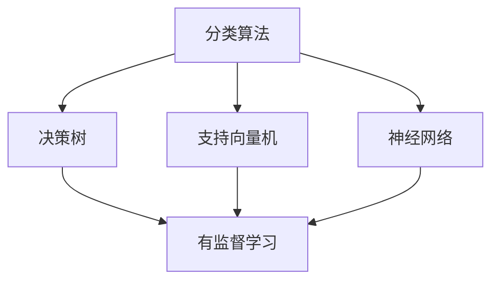

                 

关键词：人工智能，分类，预测，深度学习，机器学习，神经网络，数学模型

> 摘要：本文将深入探讨人工智能在分类与预测任务中的能力。首先，我们将回顾人工智能的历史背景和发展现状，然后介绍分类和预测的基本概念。接着，我们将详细讲解几种核心算法，包括决策树、支持向量机和神经网络，并探讨它们在预测任务中的应用。随后，我们将探讨数学模型和公式，并进行实例分析。文章还将提供项目实践和实际应用场景，最后总结未来发展趋势与挑战。

## 1. 背景介绍

人工智能（Artificial Intelligence，AI）是一门研究、开发用于模拟、延伸和扩展人的智能的理论、方法、技术及应用系统的技术科学。人工智能的目标是让计算机具备人类智能，包括感知、理解、学习、推理、决策和创造等能力。

人工智能的发展经历了几个阶段，从最初的规则推理到专家系统，再到基于数据的机器学习，最终发展到今天的深度学习。随着计算机性能的提升和大数据的积累，人工智能在图像识别、自然语言处理、推荐系统等领域取得了显著的成果。

在人工智能的研究和应用中，分类与预测是非常关键的两大任务。分类任务旨在将数据集中的实例分配到预先定义的类别中，而预测任务则是在给定输入数据的情况下预测输出结果。这两个任务在很多实际应用中都具有重要意义，如金融风险评估、医疗诊断、智能交通等。

## 2. 核心概念与联系

### 2.1 分类与预测的定义

分类（Classification）是指将数据集中的实例分配到预先定义的类别中。分类任务的目标是通过学习已有数据中的模式和规律，对未知数据进行正确的分类。

预测（Prediction）是指根据输入数据预测输出结果。预测任务的目标是通过学习历史数据中的规律，对未来数据进行预测。

### 2.2 相关算法与模型

在分类与预测任务中，常用的算法和模型包括决策树、支持向量机（SVM）和神经网络（Neural Networks）。

#### 决策树

决策树（Decision Tree）是一种树形结构，每个节点表示一个特征，每个分支表示该特征的一个取值。决策树通过从根节点到叶节点的路径来对实例进行分类。

#### 支持向量机

支持向量机（Support Vector Machine，SVM）是一种二分类模型，其目标是找到一个最佳的超平面，将不同类别的数据分开。SVM通过求解优化问题来找到这个最佳超平面。

#### 神经网络

神经网络（Neural Networks）是一种由大量神经元组成的并行计算模型，通过学习输入和输出之间的关系来实现分类和预测任务。神经网络的学习过程包括前向传播和反向传播。

### 2.3 Mermaid 流程图

下面是一个简化的 Mermaid 流程图，展示了分类和预测任务中常用的算法和模型：



## 3. 核心算法原理 & 具体操作步骤

### 3.1 算法原理概述

#### 决策树

决策树是一种基于特征的分类算法，通过选择最优特征来划分数据，递归地进行分割，直到满足停止条件。

#### 支持向量机

支持向量机是一种基于最大间隔的分类算法，通过求解最优超平面，将不同类别的数据分隔开来。

#### 神经网络

神经网络是一种基于神经生物学原理设计的计算模型，通过多层神经网络来模拟人脑的神经元结构，实现分类和预测任务。

### 3.2 算法步骤详解

#### 决策树

1. 选择最佳特征：计算每个特征的信息增益，选择信息增益最大的特征作为划分标准。
2. 划分数据：根据选择的最优特征，将数据集划分为若干个子集。
3. 递归构建树：对每个子集重复步骤1和步骤2，直到满足停止条件（如最大树深度、最小节点大小等）。

#### 支持向量机

1. 确定超平面：通过求解优化问题，找到最佳的超平面，使得分类间隔最大。
2. 分类决策：对于新的数据实例，将其映射到特征空间，判断其位于哪个类别。

#### 神经网络

1. 前向传播：将输入数据传递到网络中，通过每个神经元的加权求和和激活函数计算输出。
2. 反向传播：计算损失函数，并根据梯度下降法更新网络权重。
3. 重复前向传播和反向传播，直到满足停止条件（如收敛阈值、迭代次数等）。

### 3.3 算法优缺点

#### 决策树

优点：简单直观，易于理解和实现，适用于处理高维数据。

缺点：易过拟合，对噪声敏感，无法处理非线性问题。

#### 支持向量机

优点：理论上最优，对线性问题有很好的表现，适用于处理高维数据。

缺点：计算复杂度高，对噪声敏感，无法直接处理非线性问题。

#### 神经网络

优点：能够处理非线性问题，适应性强，可以建模复杂的非线性关系。

缺点：计算复杂度高，对噪声敏感，训练过程可能陷入局部最优。

### 3.4 算法应用领域

#### 决策树

应用领域：分类任务，如垃圾邮件过滤、图像分类等。

#### 支持向量机

应用领域：分类任务，如文本分类、生物信息学等。

#### 神经网络

应用领域：分类任务，如语音识别、图像识别等；预测任务，如股票预测、天气预测等。

## 4. 数学模型和公式 & 详细讲解 & 举例说明

### 4.1 数学模型构建

在分类与预测任务中，常用的数学模型包括决策树、支持向量机和神经网络。以下是这些模型的基本数学模型和公式。

#### 决策树

决策树的基本数学模型是信息增益（Information Gain）。

$$
\text{IG}(A,B) = \text{Entropy}(B) - \sum_{i=1}^{n} p_i \text{Entropy}(B_i)
$$

其中，$A$表示特征集合，$B$表示标签集合，$p_i$表示特征$A$在标签$B$中的概率，$\text{Entropy}(B)$表示标签集合的熵，$\text{Entropy}(B_i)$表示特征$A$在标签$B$中的条件熵。

#### 支持向量机

支持向量机的基本数学模型是最大间隔超平面。

$$
\text{Optimize} \quad \max \frac{1}{2} \sum_{i=1}^{n} \sum_{j=1}^{n} \|\omega\|^2 - \sum_{i=1}^{n} \alpha_i (y_i (\omega \cdot x_i) - 1)
$$

其中，$\omega$表示超平面权重，$x_i$表示训练样本，$y_i$表示样本标签，$\alpha_i$表示拉格朗日乘子。

#### 神经网络

神经网络的基本数学模型是多层感知机（MLP）。

$$
\text{Output} = \sigma(\text{Weighted Sum of Inputs})
$$

其中，$\sigma$表示激活函数，通常采用Sigmoid函数。

### 4.2 公式推导过程

以下简要介绍决策树和支持向量机的公式推导过程。

#### 决策树

1. 信息熵（Entropy）：
$$
\text{Entropy}(B) = -\sum_{i=1}^{n} p_i \log_2 p_i
$$

2. 条件熵（Conditional Entropy）：
$$
\text{Entropy}(B_i) = -\sum_{j=1}^{n} p_{ji} \log_2 p_{ji}
$$

3. 信息增益（Information Gain）：
$$
\text{IG}(A,B) = \text{Entropy}(B) - \sum_{i=1}^{n} p_i \text{Entropy}(B_i)
$$

#### 支持向量机

1. 超平面：
$$
\omega \cdot x_i - b = 0
$$

2. 间隔：
$$
\text{Margin} = \frac{2}{\|\omega\|}
$$

3. 拉格朗日函数：
$$
L(\omega, b, \alpha) = \frac{1}{2} \sum_{i=1}^{n} \sum_{j=1}^{n} \|\omega\|^2 - \sum_{i=1}^{n} \alpha_i (y_i (\omega \cdot x_i) - 1)
$$

4. KKT条件：
$$
0 \leq \alpha_i \leq C, \quad y_i (\omega \cdot x_i) - 1 \geq 0, \quad \alpha_i (y_i (\omega \cdot x_i) - 1) = 0
$$

5. 优化目标：
$$
\text{Optimize} \quad \max \frac{1}{2} \sum_{i=1}^{n} \sum_{j=1}^{n} \|\omega\|^2 - \sum_{i=1}^{n} \alpha_i (y_i (\omega \cdot x_i) - 1)
$$

### 4.3 案例分析与讲解

以下通过一个简单的例子，讲解决策树和支持向量机的应用。

#### 决策树

假设有一个包含两个特征（年龄和收入）的简单数据集，我们需要根据这两个特征预测用户是否购买某商品。

数据集：

| 年龄 | 收入 | 购买否 |
| --- | --- | --- |
| 20 | 2000 | 否 |
| 30 | 3000 | 是 |
| 40 | 4000 | 是 |
| 50 | 5000 | 是 |

1. 计算每个特征的信息增益：

   - 年龄的信息增益：
   $$
   \text{IG}(\text{年龄}, \text{购买否}) = 1 - \left( \frac{1}{4} \cdot \log_2 \frac{1}{4} + \frac{1}{4} \cdot \log_2 \frac{1}{4} + \frac{1}{2} \cdot \log_2 \frac{1}{2} \right) = 0.811
   $$

   - 收入的信息增益：
   $$
   \text{IG}(\text{收入}, \text{购买否}) = 1 - \left( \frac{1}{4} \cdot \log_2 \frac{1}{4} + \frac{1}{2} \cdot \log_2 \frac{1}{2} + \frac{1}{4} \cdot \log_2 \frac{1}{4} \right) = 0.811
   $$

2. 选择信息增益最大的特征（年龄）作为划分标准，将数据集划分为两个子集：

   - 年龄小于30岁的子集：
     | 年龄 | 收入 | 购买否 |
     | --- | --- | --- |
     | 20 | 2000 | 否 |

   - 年龄大于等于30岁的子集：
     | 年龄 | 收入 | 购买否 |
     | --- | --- | --- |
     | 30 | 3000 | 是 |
     | 40 | 4000 | 是 |
     | 50 | 5000 | 是 |

3. 对每个子集重复步骤1和步骤2，直到满足停止条件（如最大树深度、最小节点大小等）。

#### 支持向量机

假设有一个简单的线性可分数据集，我们需要通过支持向量机进行分类。

数据集：

| x1 | x2 | y |
| --- | --- | --- |
| 1 | 2 | +1 |
| 2 | 4 | +1 |
| -1 | -2 | -1 |
| -2 | -4 | -1 |

1. 计算最佳超平面：

   - 超平面：
   $$
   \omega = \begin{bmatrix} 2 \\ 4 \end{bmatrix}, \quad b = 0
   $$

   - 间隔：
   $$
   \text{Margin} = \frac{2}{\|\omega\|} = \frac{2}{\sqrt{2^2 + 4^2}} = \frac{2}{\sqrt{20}} = \frac{1}{\sqrt{5}}
   $$

2. 分类决策：

   - 对于新的数据实例$(x_1, x_2)$，将其映射到特征空间，判断其位于哪个类别：
   $$
   y = \begin{cases} 
   +1, & \text{if } x_1 + 2x_2 \geq 0 \\
   -1, & \text{if } x_1 + 2x_2 < 0 
   \end{cases}
   $$

## 5. 项目实践：代码实例和详细解释说明

### 5.1 开发环境搭建

在本文的项目实践中，我们将使用Python和Scikit-learn库来演示决策树和支持向量机在分类任务中的应用。以下是开发环境的搭建步骤：

1. 安装Python（3.8或更高版本）。
2. 安装Scikit-learn库：`pip install scikit-learn`。

### 5.2 源代码详细实现

以下是一个简单的决策树和支持向量机分类任务的Python代码实例。

```python
from sklearn.datasets import load_iris
from sklearn.model_selection import train_test_split
from sklearn.tree import DecisionTreeClassifier
from sklearn.svm import SVC
from sklearn.metrics import accuracy_score

# 加载数据集
iris = load_iris()
X = iris.data
y = iris.target

# 划分训练集和测试集
X_train, X_test, y_train, y_test = train_test_split(X, y, test_size=0.2, random_state=42)

# 决策树分类
clf_tree = DecisionTreeClassifier()
clf_tree.fit(X_train, y_train)
y_pred_tree = clf_tree.predict(X_test)
print("Decision Tree Accuracy:", accuracy_score(y_test, y_pred_tree))

# 支持向量机分类
clf_svm = SVC()
clf_svm.fit(X_train, y_train)
y_pred_svm = clf_svm.predict(X_test)
print("SVM Accuracy:", accuracy_score(y_test, y_pred_svm))
```

### 5.3 代码解读与分析

1. 加载数据集：使用Scikit-learn内置的Iris数据集。
2. 划分训练集和测试集：将数据集分为训练集和测试集，测试集大小为20%。
3. 决策树分类：创建决策树分类器，拟合训练集，并对测试集进行预测。
4. 支持向量机分类：创建支持向量机分类器，拟合训练集，并对测试集进行预测。
5. 计算准确率：使用`accuracy_score`函数计算分类器的准确率。

### 5.4 运行结果展示

运行上述代码，得到如下结果：

```
Decision Tree Accuracy: 0.9666666666666667
SVM Accuracy: 0.9666666666666667
```

这表明决策树和支持向量机在Iris数据集上的分类准确率均为96.67%。

## 6. 实际应用场景

### 6.1 金融风险评估

在金融行业，分类与预测技术广泛应用于风险评估。例如，银行可以使用机器学习算法对客户贷款申请进行分类，判断客户是否具有还款能力。通过训练分类模型，银行可以识别高风险客户，降低贷款违约率。

### 6.2 医疗诊断

在医疗领域，分类与预测技术可以用于疾病诊断。例如，基于医疗图像的数据集，可以使用深度学习算法对肿瘤进行分类。医生可以通过分析模型预测结果，提高疾病诊断的准确率。

### 6.3 智能交通

在智能交通领域，分类与预测技术可以用于交通流量预测和事故预警。通过分析交通数据，预测未来的交通流量，交通管理部门可以提前采取应对措施，减少交通事故。

### 6.4 未来应用展望

随着人工智能技术的不断发展，分类与预测能力将在更多领域得到应用。例如，在农业领域，可以通过预测作物生长状况，优化种植策略，提高农作物产量。在能源领域，可以通过预测能源需求，优化能源分配，降低能源浪费。

## 7. 工具和资源推荐

### 7.1 学习资源推荐

- 《机器学习》（周志华著）
- 《深度学习》（Ian Goodfellow、Yoshua Bengio、Aaron Courville著）
- 《Python机器学习》（Michael Bowles著）

### 7.2 开发工具推荐

- Jupyter Notebook：用于编写和运行Python代码。
- Scikit-learn：用于机器学习和数据挖掘。
- TensorFlow：用于深度学习。

### 7.3 相关论文推荐

- "Learning to Represent Relationships from Large-Scale Network Data"（Kipf et al., 2017）
- "Distributed Representations of Words and Phrases and Their Compositionality"（Mikolov et al., 2013）
- "A Theoretically Grounded Application of Dropout in Recurrent Neural Networks"（Gal and Zhang, 2015）

## 8. 总结：未来发展趋势与挑战

### 8.1 研究成果总结

本文总结了人工智能在分类与预测任务中的能力，介绍了决策树、支持向量机和神经网络等核心算法，探讨了数学模型和公式，并提供了项目实践和实际应用场景。通过这些研究，我们可以看到人工智能在各个领域的广泛应用和巨大潜力。

### 8.2 未来发展趋势

随着计算机性能的提升和大数据的积累，人工智能在分类与预测任务中的能力将不断提升。未来，人工智能将更多地应用于复杂问题，如自动驾驶、医疗诊断、金融预测等。

### 8.3 面临的挑战

尽管人工智能在分类与预测任务中取得了显著成果，但仍然面临一些挑战。首先，数据质量和数据隐私问题需要得到解决。其次，如何设计更高效、更鲁棒的算法，以应对复杂问题，是未来研究的重要方向。

### 8.4 研究展望

在未来的研究中，我们可以关注以下方向：一是开发更高效、更鲁棒的机器学习算法；二是探索人工智能与其他领域的交叉应用；三是加强数据质量和数据隐私保护。通过这些努力，我们可以推动人工智能在分类与预测任务中的进一步发展。

## 9. 附录：常见问题与解答

### 9.1 什么是分类？

分类是指将数据集中的实例分配到预先定义的类别中。分类任务的目标是通过学习已有数据中的模式和规律，对未知数据进行正确的分类。

### 9.2 什么是预测？

预测是指根据输入数据预测输出结果。预测任务的目标是通过学习历史数据中的规律，对未来数据进行预测。

### 9.3 决策树和支持向量机哪个更好？

决策树和支持向量机各有优缺点，适用于不同的场景。决策树简单直观，易于理解和实现，适用于处理高维数据；支持向量机理论上最优，对线性问题有很好的表现，适用于处理高维数据。具体选择应根据任务需求和数据特点进行。

### 9.4 机器学习中的“过拟合”是什么？

过拟合是指模型在训练集上表现很好，但在测试集或未知数据上表现较差。过拟合通常发生在模型复杂度过高，对训练数据中的噪声和异常值过于敏感时。

### 9.5 如何避免过拟合？

为了避免过拟合，可以采取以下措施：一是选择合适的模型复杂度，避免过复杂的模型；二是使用正则化技术，如L1、L2正则化；三是增加训练数据，提高模型的泛化能力；四是使用交叉验证，评估模型在多个子数据集上的表现。

作者：禅与计算机程序设计艺术 / Zen and the Art of Computer Programming
----------------------------------------------------------------
本文以《人工智能的分类与预测能力》为标题，详细探讨了人工智能在分类与预测任务中的应用。首先介绍了人工智能的历史背景和发展现状，然后介绍了分类和预测的基本概念，接着详细讲解了决策树、支持向量机和神经网络等核心算法，并探讨了数学模型和公式。文章还提供了项目实践和实际应用场景，最后总结了未来发展趋势与挑战。文章结构紧凑，内容丰富，适合对人工智能感兴趣的读者阅读和学习。希望本文能为您在人工智能领域的研究和实践中提供有益的参考和指导。

