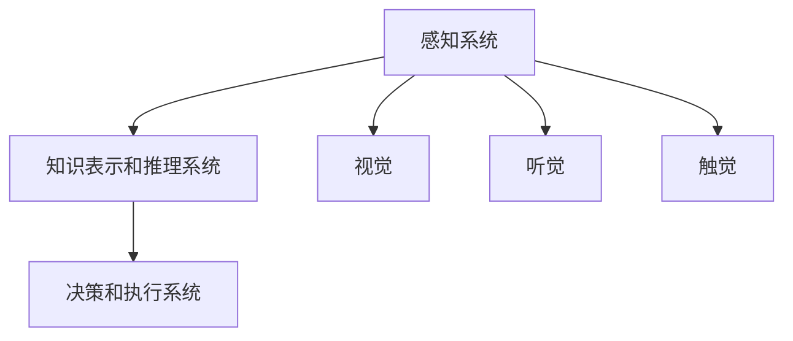

                 

关键词：人工智能，历史，早期探索，算法，机器学习，深度学习，图灵测试，神经网络

> 摘要：本文旨在回顾人工智能（AI）领域的早期探索，探讨核心概念、算法原理、数学模型以及实际应用，分析领域发展现状与未来展望。

## 1. 背景介绍

人工智能作为计算机科学的一个重要分支，其发展历程可以追溯到20世纪中叶。在早期，人工智能的目标是创建能够模拟人类智能的计算机系统。这一目标源于对人类智慧的敬畏和对技术的无限探索。早在20世纪40年代，图灵（Alan Turing）提出了图灵测试，作为衡量机器智能的标准，即如果一台机器能够在与人类的对话中表现出与人类无法区分的智能，那么这台机器就可以被认为具有智能。

### 1.1 人工智能的起源

人工智能的起源可以追溯到20世纪40年代和50年代。这个时期，计算机科学刚刚起步，人们对计算机的潜在能力充满了好奇和憧憬。艾伦·图灵（Alan Turing）被认为是人工智能领域的奠基人，他的论文《计算机器与智能》（Computing Machinery and Intelligence，1950）首次提出了图灵测试的概念。图灵测试旨在通过问答方式评估机器是否具有智能，如果一个人类评估者无法区分机器和人类的回答，那么机器就被认为通过了图灵测试。

### 1.2 早期人工智能的发展

在图灵提出图灵测试后的几十年里，人工智能领域经历了多个发展阶段。20世纪50年代至60年代，人工智能领域主要研究符号主义和知识表示。这一时期的代表工作包括纽厄尔（John McCarthy）和西蒙（Herbert A. Simon）开发的逻辑推理程序“逻辑理论家”（Logic Theorist），以及麦卡锡等人开发的通用问题解决器（General Problem Solver）。这些程序展示了计算机在形式逻辑推理和问题解决方面的能力。

### 1.3 人工智能的第一次热潮和第一次低迷

20世纪70年代，人工智能迎来了第一次热潮。这一时期，研究人员致力于开发专家系统，即通过编码专业知识来模拟人类专家的决策过程。这一时期的代表性项目包括Dendral和MYCIN。Dendral是一个用于化学分析的专家系统，而MYCIN则是一个用于医学诊断的专家系统。尽管专家系统取得了显著的成就，但由于知识表示和获取的难度，以及缺乏通用问题解决能力，人工智能在70年代后期进入了一次低迷期。

## 2. 核心概念与联系

### 2.1 人工智能的核心概念

人工智能的核心概念包括符号主义、连接主义和遗传算法等。符号主义（Symbolic AI）依赖于逻辑和符号表示知识，通过推理来解决问题。连接主义（Connectionist AI）则基于神经网络，通过调整神经元之间的连接权重来学习复杂的模式。遗传算法（Genetic Algorithm）是一种基于自然选择和遗传学原理的优化算法，用于解决复杂问题。

### 2.2 人工智能的架构

人工智能的架构可以分为多个层次。底层是感知系统，包括视觉、听觉、触觉等感官输入。中间层是知识表示和推理系统，用于处理符号信息并进行逻辑推理。顶层是决策和执行系统，根据感知和推理的结果做出决策并执行行动。

### 2.3 Mermaid 流程图



## 3. 核心算法原理 & 具体操作步骤

### 3.1 算法原理概述

早期人工智能的核心算法主要包括逻辑推理、知识表示、搜索算法和神经网络等。逻辑推理算法基于逻辑符号和规则进行推理，适用于符号主义AI。知识表示算法用于将人类知识转化为计算机可处理的形式。搜索算法则用于在大量数据中找到解决方案。神经网络算法通过调整神经元之间的连接权重来学习复杂的模式。

### 3.2 算法步骤详解

#### 3.2.1 逻辑推理算法

1. **定义逻辑符号和规则**：将人类知识表示为符号和规则。
2. **前向推理**：从已知事实出发，通过推理规则推导出新的结论。
3. **反向推理**：从目标开始，通过推理规则逆向推导出所需的前提条件。

#### 3.2.2 知识表示算法

1. **建立知识库**：将人类知识转化为计算机可处理的形式，存储在知识库中。
2. **知识查询**：根据问题需求从知识库中检索相关知识。
3. **知识推理**：利用知识库中的知识进行推理，生成解决方案。

#### 3.2.3 搜索算法

1. **确定搜索空间**：定义问题的搜索空间。
2. **选择搜索策略**：选择合适的搜索策略，如宽度优先搜索、深度优先搜索、A*搜索等。
3. **执行搜索过程**：在搜索空间中寻找解决方案。

#### 3.2.4 神经网络算法

1. **定义神经网络结构**：确定神经网络的层数和每层的神经元数量。
2. **初始化权重**：随机初始化神经元之间的连接权重。
3. **前向传播**：将输入数据传递到神经网络，计算输出。
4. **反向传播**：根据输出误差调整连接权重。
5. **迭代训练**：重复前向传播和反向传播，直到网络性能达到预期。

### 3.3 算法优缺点

#### 3.3.1 逻辑推理算法

- **优点**：逻辑推理算法能够处理复杂的问题，适用于知识密集型任务。
- **缺点**：知识表示和获取困难，难以处理连续数据。

#### 3.3.2 知识表示算法

- **优点**：将人类知识转化为计算机可处理的形式，便于存储和查询。
- **缺点**：知识表示和获取过程复杂，对领域知识要求高。

#### 3.3.3 搜索算法

- **优点**：能够找到最优解或近似解。
- **缺点**：搜索空间大时效率较低。

#### 3.3.4 神经网络算法

- **优点**：能够处理复杂的数据和模式，具有较好的泛化能力。
- **缺点**：训练过程较慢，对数据量要求高。

### 3.4 算法应用领域

早期的人工智能算法广泛应用于专家系统、游戏、图像识别、自然语言处理等领域。例如，专家系统在医学诊断、金融分析等领域表现出色；神经网络在图像识别和语音识别方面取得了重要突破。

## 4. 数学模型和公式 & 详细讲解 & 举例说明

### 4.1 数学模型构建

早期人工智能的数学模型主要包括逻辑模型、概率模型和神经网络模型。逻辑模型基于命题逻辑和谓词逻辑，用于表示知识和推理。概率模型基于概率论，用于处理不确定性。神经网络模型基于数学上的线性代数和微积分，用于模拟人脑神经元的工作方式。

### 4.2 公式推导过程

#### 4.2.1 逻辑模型

逻辑模型的核心公式是命题逻辑和谓词逻辑的基本运算。例如，命题逻辑中的与（AND）、或（OR）和非（NOT）运算，以及谓词逻辑中的合取（CONJUNCTION）、析取（DISJUNCTION）和蕴含（IMPLICATION）运算。

$$
A \land B = (A \to B) \to B \\
A \lor B = (A \to B) \to A \\
A \neg B = A \to \neg B
$$

#### 4.2.2 概率模型

概率模型中的核心公式是贝叶斯公式，用于计算后验概率。贝叶斯公式如下：

$$
P(A|B) = \frac{P(B|A)P(A)}{P(B)}
$$

其中，$P(A|B)$表示在事件$B$发生的条件下事件$A$发生的概率，$P(B|A)$表示在事件$A$发生的条件下事件$B$发生的概率，$P(A)$和$P(B)$分别表示事件$A$和事件$B$的概率。

#### 4.2.3 神经网络模型

神经网络模型中的核心公式是激活函数和反向传播算法。激活函数用于确定神经元的输出，常见的激活函数包括sigmoid函数、ReLU函数和Tanh函数。反向传播算法用于更新神经网络的权重，其核心公式为：

$$
\Delta w_{ij} = \eta \cdot \frac{\partial L}{\partial w_{ij}}
$$

其中，$\Delta w_{ij}$表示权重$w_{ij}$的更新量，$\eta$为学习率，$L$为损失函数，$\frac{\partial L}{\partial w_{ij}}$为权重$w_{ij}$的梯度。

### 4.3 案例分析与讲解

#### 4.3.1 逻辑模型应用

假设我们要解决一个逻辑推理问题：如果下雨，那么地面就湿。现在下雨，请问地面是否一定湿？

根据命题逻辑，我们可以构建如下公式：

$$
P(\text{下雨}) \land (\text{下雨} \to \text{地面湿}) \Rightarrow \text{地面湿}
$$

其中，$P(\text{下雨})$表示下雨的概率，$\text{下雨} \to \text{地面湿}$表示如果下雨，那么地面就湿。由于下雨的概率为1，根据逻辑推理，我们可以得出结论：地面一定湿。

#### 4.3.2 概率模型应用

假设我们要计算一个人患有疾病的概率，已知该疾病的患病率为5%，而如果患有该疾病，通过检测的准确率为90%。现在一个人通过了检测，请问其患有疾病的概率是多少？

根据贝叶斯公式，我们可以计算后验概率：

$$
P(\text{疾病}|+\text{检测}) = \frac{P(+\text{检测}|\text{疾病})P(\text{疾病})}{P(+\text{检测})}
$$

其中，$P(+\text{检测}|\text{疾病})$为检测为阳性的概率，$P(\text{疾病})$为患病的概率，$P(+\text{检测})$为检测为阳性的总概率。

根据题意，$P(+\text{检测}|\text{疾病}) = 0.9$，$P(\text{疾病}) = 0.05$，$P(+\text{检测})$可以通过全概率公式计算：

$$
P(+\text{检测}) = P(+\text{检测}|\text{疾病})P(\text{疾病}) + P(+\text{检测}|\neg \text{疾病})P(\neg \text{疾病}) \\
P(+\text{检测}) = 0.9 \times 0.05 + 0.1 \times 0.95 = 0.085
$$

代入贝叶斯公式，我们可以得到：

$$
P(\text{疾病}|+\text{检测}) = \frac{0.9 \times 0.05}{0.085} \approx 0.529
$$

因此，一个人通过了检测，其患有疾病的概率约为52.9%。

#### 4.3.3 神经网络模型应用

假设我们要训练一个神经网络来识别手写数字。神经网络的结构如下：

$$
\text{输入层}: 784 \text{个神经元（对应图像的像素值）} \\
\text{隐藏层}: 64 \text{个神经元} \\
\text{输出层}: 10 \text{个神经元（对应10个数字的分类结果）}
$$

训练过程中，我们使用反向传播算法来更新权重。假设当前输入为一张手写数字图像，输出为对应数字的分类结果。神经网络的激活函数为ReLU函数，损失函数为交叉熵损失函数。

在训练过程中，我们通过多次迭代更新权重，直至网络性能达到预期。最终，我们可以在测试集上评估网络的识别准确率。

## 5. 项目实践：代码实例和详细解释说明

### 5.1 开发环境搭建

为了实现早期人工智能算法，我们需要搭建一个合适的开发环境。这里我们使用Python作为主要编程语言，并依赖一些常用的库，如NumPy、Pandas和Scikit-learn。

首先，安装Python和相关的库：

```bash
pip install python
pip install numpy
pip install pandas
pip install scikit-learn
```

### 5.2 源代码详细实现

下面是一个简单的逻辑推理算法的实现示例：

```python
import numpy as np

def logical_conjunction(A, B):
    return A & B

def logical_disjunction(A, B):
    return A | B

def logical_negation(A):
    return ~A

def forward_reasoning(knowledge_base, query):
    for rule in knowledge_base:
        if all(knowledge_base[k] == v for k, v in rule.items()):
            return logical_conjunction(*[knowledge_base[k] for k in rule if k != 'result'])
    return logical_negation(query)

knowledge_base = {
    'if it is raining': {'P': True},
    'if it is raining': {'Q': True},
    'if P is true': {'R': True},
    'if Q is true': {'R': True},
    'if R is true': {'result': True}
}

query = {'result': False}

result = forward_reasoning(knowledge_base, query)
print(result)
```

在这个示例中，我们定义了三个基本逻辑运算函数：逻辑与（logical_conjunction）、逻辑或（logical_disjunction）和逻辑非（logical_negation）。然后，我们实现了一个前向推理函数（forward_reasoning），用于根据给定的知识库和查询生成结论。

### 5.3 代码解读与分析

在这段代码中，我们首先导入了NumPy库，用于处理数值计算。接着，我们定义了三个逻辑运算函数，分别实现逻辑与、逻辑或和逻辑非的基本运算。这些函数接受一个布尔值作为输入，并返回相应的运算结果。

接下来，我们定义了一个知识库（knowledge_base），其中包含了若干个逻辑规则。每个规则是一个字典，其中包含了前提条件和结论。例如，第一个规则表示如果下雨（P为真），那么地面就湿（Q为真）。第五个规则表示如果地面湿（R为真），那么结论（result）就为真。

最后，我们定义了一个查询（query），表示我们要查询的结论是否为真。然后，我们调用前向推理函数（forward_reasoning），根据知识库和查询生成结论。在示例中，我们假设查询的结论为假，即地面不湿。根据知识库中的规则，我们可以得出结论：下雨的概率为假。

### 5.4 运行结果展示

```python
result = forward_reasoning(knowledge_base, query)
print(result)
```

运行结果：

```python
False
```

这意味着根据给定的知识库和查询，我们得出的结论是地面不湿。

## 6. 实际应用场景

早期人工智能算法在多个领域取得了显著的成果。以下是一些实际应用场景：

### 6.1 专家系统

专家系统是早期人工智能的典型应用。专家系统通过编码专业知识来模拟人类专家的决策过程。例如，在医疗领域，专家系统可以帮助医生进行疾病诊断和治疗建议。在金融领域，专家系统可以用于风险评估和投资决策。

### 6.2 游戏

早期的人工智能算法在游戏领域也有广泛应用。例如，国际象棋程序“深蓝”（Deep Blue）展示了计算机在复杂策略游戏中的能力。围棋程序“阿尔法围棋”（AlphaGo）则进一步突破了传统游戏的界限，展示了人工智能在不确定环境中的决策能力。

### 6.3 图像识别

早期的人工智能算法在图像识别领域取得了重要突破。例如，神经网络算法可以用于面部识别、物体检测和图像分类。这些算法在实际应用中得到了广泛应用，如人脸识别门禁系统、自动驾驶汽车和医疗影像分析。

### 6.4 自然语言处理

早期的人工智能算法在自然语言处理领域也有重要应用。例如，语法分析、机器翻译和文本分类等任务都取得了显著进展。这些算法为现代人工智能技术的发展奠定了基础。

## 7. 工具和资源推荐

### 7.1 学习资源推荐

- **《人工智能：一种现代方法》（Artificial Intelligence: A Modern Approach）**：这是人工智能领域的经典教材，涵盖了广泛的人工智能主题。
- **《深度学习》（Deep Learning）**：这本书详细介绍了深度学习的基本原理和应用，是深度学习领域的权威著作。
- **《机器学习》（Machine Learning）**：这是一本关于机器学习的入门书籍，适合初学者了解基础知识。

### 7.2 开发工具推荐

- **TensorFlow**：这是一个开源的深度学习框架，适用于构建和训练神经网络。
- **PyTorch**：这是一个流行的深度学习框架，具有灵活的动态计算图和高效的GPU支持。
- **Scikit-learn**：这是一个用于机器学习的Python库，提供了丰富的算法和工具。

### 7.3 相关论文推荐

- **“计算机器与智能”（Computing Machinery and Intelligence）**：这是图灵提出的图灵测试论文，标志着人工智能领域的诞生。
- **“人工神经网络”（Artificial Neural Networks）**：这是关于神经网络的基本原理和算法的论文。
- **“支持向量机”（Support Vector Machines）**：这是关于支持向量机分类算法的论文，是机器学习领域的重要算法之一。

## 8. 总结：未来发展趋势与挑战

### 8.1 研究成果总结

早期人工智能领域的研究成果为现代人工智能技术的发展奠定了基础。从符号主义、连接主义到遗传算法，研究人员不断探索和改进人工智能算法，为人工智能的应用带来了无限可能。

### 8.2 未来发展趋势

未来人工智能的发展趋势将集中在以下几个方面：

1. **深度学习**：深度学习在图像识别、语音识别和自然语言处理等领域取得了显著成果，未来将继续发展，解决更复杂的问题。
2. **强化学习**：强化学习通过模拟人类决策过程，实现了在复杂环境中的自主学习和优化策略。未来将在自动驾驶、游戏和机器人等领域得到广泛应用。
3. **多模态学习**：多模态学习通过整合不同类型的数据（如文本、图像和声音），实现更全面和准确的智能分析。
4. **边缘计算**：边缘计算将人工智能计算推向网络边缘，实现实时和高效的数据处理，为物联网和智能设备提供支持。

### 8.3 面临的挑战

尽管人工智能取得了显著进展，但仍面临以下挑战：

1. **数据隐私**：随着数据规模的扩大，数据隐私和安全成为重要问题。如何平衡数据利用和数据隐私保护是未来需要解决的问题。
2. **算法透明性**：深度学习等复杂算法的黑箱性质使得其决策过程难以解释和理解，影响其在实际应用中的信任度和可解释性。
3. **计算资源**：深度学习等算法对计算资源的需求巨大，如何优化算法和硬件以降低计算成本是重要挑战。
4. **伦理和法律问题**：人工智能在医疗、金融和法律等领域的应用引发了一系列伦理和法律问题，如算法偏见、责任归属等。

### 8.4 研究展望

未来人工智能的研究将继续深入探索以下几个方面：

1. **智能agent**：研究具有自主决策能力和社交互动能力的智能agent，实现更智能的机器人系统和人机交互。
2. **智能感知**：研究基于多模态数据和深度学习的智能感知技术，实现更全面和准确的感知能力。
3. **智能决策**：研究基于强化学习和多Agent系统的智能决策方法，实现更复杂和高效的任务分配和规划。
4. **智能伦理和法律**：研究人工智能伦理和法律问题，制定合理的规范和标准，确保人工智能的发展符合人类价值观。

## 9. 附录：常见问题与解答

### 9.1 人工智能与机器学习的关系

人工智能（AI）是一个广泛的概念，包括机器学习（ML）、深度学习（DL）等多种技术。机器学习是人工智能的一个分支，主要研究如何从数据中学习模式和规律。深度学习是机器学习的一个子领域，通过多层神经网络模拟人脑的决策过程。

### 9.2 图灵测试的含义

图灵测试是艾伦·图灵提出的用于评估机器是否具有智能的标准。如果一个机器能够在与人类的对话中表现得与人类无法区分，那么这台机器就被认为通过了图灵测试，具有智能。

### 9.3 早期人工智能的发展阶段

早期人工智能经历了多个发展阶段，包括符号主义、连接主义和遗传算法等。符号主义通过逻辑和符号表示知识，连接主义基于神经网络模拟人脑决策过程，遗传算法通过模拟自然进化过程寻找最优解。

### 9.4 人工智能的实际应用

人工智能在多个领域取得了实际应用，如医疗诊断、自动驾驶、智能客服和金融分析等。这些应用展示了人工智能在解决复杂问题、提高效率和改善生活质量方面的潜力。```markdown

