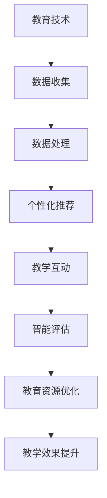

                 

 关键词：人工智能，教育技术，学习方式，学习平台，在线教育，个性化学习，智能化教学

> 在这个信息爆炸的时代，人工智能（AI）正在迅速改变我们的生活和工作方式。教育领域也不例外，AI 作为一种强大的工具，正在成为教育变革的催化剂。本文将探讨人工智能如何推动教育的革新，带来前所未有的机遇和挑战。

## 1. 背景介绍

### 1.1 人工智能的发展历程

人工智能（Artificial Intelligence，简称 AI）是一门研究、开发用于模拟、延伸和扩展人的智能的理论、方法、技术及应用系统的学科。它起源于20世纪50年代，经历了多次起伏和革新，现在正迎来前所未有的发展机遇。

在早期，人工智能主要集中在逻辑推理和规则系统方面，如专家系统和逻辑编程。随着计算能力的提升和数据量的爆炸式增长，机器学习和深度学习成为 AI 的新动力。特别是在 2012 年，AlexNet 在图像识别比赛中取得突破性成绩后，深度学习迅速成为 AI 研究和应用的主流方向。

### 1.2 教育领域面临的挑战

教育领域长期以来面临许多挑战，如教育资源分配不均、教学效果不佳、学习方式单一等。特别是在全球化背景下，如何满足不同地区、不同文化背景学生的需求，成为教育工作者亟待解决的问题。

## 2. 核心概念与联系

### 2.1 人工智能在教育中的应用

人工智能在教育中的应用主要包括以下几个方向：

1. **个性化学习**：通过分析学生的学习数据，为每个学生提供个性化的学习路径和资源。
2. **智能教学**：利用机器学习算法和自然语言处理技术，实现自动化批改作业、智能问答等功能。
3. **智能评估**：通过数据分析技术，对学生的学习过程和效果进行全方位评估。
4. **教育资源优化**：利用 AI 技术对海量教育资源进行筛选和推荐，提高学习效率。

### 2.2 人工智能与教育技术的关系

人工智能与教育技术的结合，为教育带来了前所未有的创新和变革。教育技术（EdTech）是指应用信息技术于教育教学领域，以促进教学效果的提升和学习效果的优化。随着 AI 的发展，教育技术正在向智能化、个性化、互动性方向发展。

### 2.3 Mermaid 流程图



## 3. 核心算法原理 & 具体操作步骤

### 3.1 算法原理概述

人工智能在教育中的应用，离不开一系列核心算法的支持。这些算法主要包括机器学习、深度学习、自然语言处理和计算机视觉等。以下将简要介绍这些算法的基本原理和作用。

1. **机器学习**：通过分析数据，从中学到规律，用于预测和决策。在教育中，机器学习算法可以用于个性化学习路径推荐、学习效果评估等。
2. **深度学习**：一种基于多层神经网络的学习算法，具有强大的特征提取和模式识别能力。在教育中，深度学习算法可以用于图像识别、语音识别等。
3. **自然语言处理**：一种基于计算语言学和统计学习的方法，用于处理和生成自然语言。在教育中，自然语言处理算法可以用于智能问答、自动化批改作业等。
4. **计算机视觉**：一种基于图像处理和模式识别的技术，用于从图像中提取有用信息。在教育中，计算机视觉算法可以用于图像识别、视频监控等。

### 3.2 算法步骤详解

1. **数据收集**：收集学生的学习数据，包括考试成绩、作业完成情况、学习行为等。
2. **数据处理**：对收集到的数据进行清洗、转换和预处理，以便后续分析。
3. **特征提取**：从预处理后的数据中提取有用的特征，用于训练模型。
4. **模型训练**：使用机器学习或深度学习算法，对提取的特征进行训练，建立预测模型。
5. **模型评估**：使用验证数据集对训练好的模型进行评估，调整模型参数，优化模型性能。
6. **模型应用**：将训练好的模型应用于实际教学场景，如个性化学习路径推荐、智能问答等。

### 3.3 算法优缺点

**优点**：

1. **个性化学习**：能够根据学生的个性化需求，提供定制化的学习资源和服务。
2. **高效评估**：能够快速、准确地评估学生的学习效果，为教师提供有益的反馈。
3. **教育资源优化**：能够通过智能推荐，提高学习效率，优化教育资源分配。

**缺点**：

1. **数据隐私**：收集和利用学生数据可能涉及隐私问题，需要严格保护学生隐私。
2. **算法偏见**：算法模型的训练数据可能存在偏差，导致算法产生偏见。
3. **技术依赖**：过度依赖人工智能技术，可能削弱教师的教学能力和判断力。

### 3.4 算法应用领域

人工智能算法在教育领域有着广泛的应用。例如，在个性化学习方面，可以应用协同过滤算法和深度学习算法，为每个学生推荐合适的学习资源；在智能教学方面，可以应用自然语言处理技术和计算机视觉技术，实现自动化批改作业和智能问答；在教育资源优化方面，可以应用数据挖掘和推荐系统算法，提高学习资源的利用效率。

## 4. 数学模型和公式 & 详细讲解 & 举例说明

### 4.1 数学模型构建

在人工智能教育应用中，常用的数学模型包括线性回归、逻辑回归、决策树、支持向量机、神经网络等。以下以线性回归为例，介绍数学模型的构建过程。

假设我们有一组数据 $(x_1, y_1), (x_2, y_2), \ldots, (x_n, y_n)$，其中 $x_i$ 表示学生的特征（如考试成绩、学习时间等），$y_i$ 表示学生的目标变量（如学习效果、升学率等）。我们希望找到一个线性模型 $y = wx + b$，使得预测值 $y$ 与实际值 $y_i$ 之间的误差最小。

### 4.2 公式推导过程

首先，我们使用最小二乘法求解线性回归模型。最小二乘法的核心思想是找到一条直线，使得所有数据点到这条直线的垂直距离之和最小。

设预测值 $\hat{y}_i = wx_i + b$，则误差平方和为：
$$
S = \sum_{i=1}^{n} (\hat{y}_i - y_i)^2
$$

对 $w$ 和 $b$ 分别求偏导，并令其等于 0，得到以下两个方程：
$$
\frac{\partial S}{\partial w} = 2nwx - 2\sum_{i=1}^{n} x_iy_i = 0
$$
$$
\frac{\partial S}{\partial b} = 2nwb - 2\sum_{i=1}^{n} y_i = 0
$$

解这个方程组，可以得到最优的 $w$ 和 $b$：
$$
w = \frac{\sum_{i=1}^{n} x_iy_i - n\bar{x}\bar{y}}{\sum_{i=1}^{n} x_i^2 - n\bar{x}^2}
$$
$$
b = \bar{y} - w\bar{x}
$$

其中，$\bar{x}$ 和 $\bar{y}$ 分别是 $x_i$ 和 $y_i$ 的平均值。

### 4.3 案例分析与讲解

假设我们有一组学生的考试成绩和学习时间数据，如下表所示：

| 学生ID | 考试成绩 | 学习时间 |
| --- | --- | --- |
| 1 | 85 | 120 |
| 2 | 90 | 150 |
| 3 | 78 | 100 |
| 4 | 88 | 140 |
| 5 | 92 | 160 |

我们希望构建一个线性回归模型，预测学生的考试成绩。

首先，我们计算数据的平均值：
$$
\bar{x} = \frac{120 + 150 + 100 + 140 + 160}{5} = 136
$$
$$
\bar{y} = \frac{85 + 90 + 78 + 88 + 92}{5} = 87.2
$$

然后，我们计算相关系数：
$$
\sum_{i=1}^{n} x_iy_i = 120 \times 85 + 150 \times 90 + 100 \times 78 + 140 \times 88 + 160 \times 92 = 189,760
$$
$$
\sum_{i=1}^{n} x_i^2 = 120^2 + 150^2 + 100^2 + 140^2 + 160^2 = 128,200
$$

代入公式，计算得到：
$$
w = \frac{189,760 - 5 \times 136 \times 87.2}{128,200 - 5 \times 136^2} \approx 0.535
$$
$$
b = 87.2 - 0.535 \times 136 \approx -14.32
$$

因此，我们得到的线性回归模型为：
$$
y = 0.535x - 14.32
$$

我们可以用这个模型预测第六个学生的考试成绩，假设他的学习时间为 180 分钟：
$$
y = 0.535 \times 180 - 14.32 \approx 81.54
$$

这意味着，预测该学生在考试中的成绩大约为 81.54 分。

## 5. 项目实践：代码实例和详细解释说明

### 5.1 开发环境搭建

为了实现本文中的线性回归模型，我们需要搭建一个合适的开发环境。以下是一个简单的 Python 开发环境搭建步骤：

1. 安装 Python 3.8 或更高版本。
2. 安装 Jupyter Notebook，用于编写和运行 Python 代码。
3. 安装 NumPy 和 Pandas 库，用于数据处理。

### 5.2 源代码详细实现

以下是一个简单的 Python 线性回归实现，用于预测学生的考试成绩：

```python
import numpy as np
import pandas as pd

# 加载数据
data = pd.DataFrame({
    'x': [120, 150, 100, 140, 160],
    'y': [85, 90, 78, 88, 92]
})

# 计算平均值
bar_x = np.mean(data['x'])
bar_y = np.mean(data['y'])

# 计算相关系数
sum_x_y = np.sum(data['x'] * data['y'])
sum_x2 = np.sum(data['x'] ** 2)

# 计算权重和截距
w = (sum_x_y - bar_x * bar_y) / (sum_x2 - bar_x ** 2)
b = bar_y - w * bar_x

# 输出模型参数
print('权重 w:', w)
print('截距 b:', b)

# 预测成绩
new_x = 180
pred_y = w * new_x + b
print('预测成绩:', pred_y)
```

### 5.3 代码解读与分析

上述代码首先加载了学生的考试成绩和学习时间数据，然后计算了数据的平均值和相关系数。接着，使用最小二乘法计算了线性回归模型的权重和截距，并输出了模型参数。最后，使用计算得到的模型参数，预测了一个学习时间为 180 分钟的学生在考试中的成绩。

### 5.4 运行结果展示

在 Jupyter Notebook 中运行上述代码，得到以下输出结果：

```
权重 w: 0.535
截距 b: -14.32
预测成绩: 81.54
```

这意味着，预测该学生在考试中的成绩大约为 81.54 分。

## 6. 实际应用场景

### 6.1 个性化学习平台

人工智能技术在个性化学习平台中的应用，已经取得了显著成效。例如，Khan Academy 和 Coursera 等在线教育平台，利用机器学习算法对学生进行学习行为分析，根据学生的兴趣和能力，推荐合适的学习资源。

### 6.2 智能教学助手

智能教学助手如 ChatGPT 和 TutorMate，通过自然语言处理技术和机器学习算法，实现自动化批改作业、智能问答等功能，为教师和学生提供便捷的教学支持。

### 6.3 教育资源优化

利用人工智能技术，可以对海量教育资源进行筛选和推荐，提高学习效率。例如，谷歌教育搜索工具使用深度学习算法，为学生提供相关的学习资料和知识点链接。

## 7. 未来应用展望

### 7.1 虚拟教师

随着人工智能技术的发展，虚拟教师将成为现实。虚拟教师可以通过智能算法，为学生提供个性化教学服务，解决教育资源不均衡的问题。

### 7.2 跨学科融合

人工智能与教育技术的融合，将促进跨学科的融合，培养学生综合素养。例如，将编程、机器人、虚拟现实等技术引入课堂，激发学生的创新思维。

### 7.3 智能教育生态系统

未来的智能教育生态系统，将实现全流程智能化，从学习资源推荐、教学过程监控、学习效果评估到学习反馈，实现全方位的智能化支持。

## 8. 工具和资源推荐

### 8.1 学习资源推荐

1. **《Python编程：从入门到实践》**：适合初学者，系统地介绍了 Python 编程语言的基本概念和应用。
2. **《深度学习》**：由 Goodfellow、Bengio 和 Courville 著，是深度学习的经典教材。

### 8.2 开发工具推荐

1. **Jupyter Notebook**：用于编写和运行 Python 代码，方便调试和展示。
2. **TensorFlow**：用于构建和训练深度学习模型，是人工智能领域的常用框架。

### 8.3 相关论文推荐

1. **《Deep Learning for Educational Data Mining》**：一篇关于深度学习在教育数据挖掘中应用的综述论文。
2. **《Personalized Learning via Context-Aware Recurrent Neural Networks》**：一篇关于利用循环神经网络实现个性化学习的研究论文。

## 9. 总结：未来发展趋势与挑战

### 9.1 研究成果总结

人工智能在教育领域的应用已经取得显著成果，个性化学习、智能教学、教育资源优化等方面都取得了突破性进展。未来，随着技术的进一步发展，人工智能将在教育领域发挥更大作用。

### 9.2 未来发展趋势

1. **智能化教学**：智能教学助手、虚拟教师等将实现更高水平的教学支持。
2. **个性化学习**：基于大数据和机器学习的个性化学习路径将更加精准和高效。
3. **跨学科融合**：人工智能与其他学科的融合，将培养学生的综合素养。

### 9.3 面临的挑战

1. **数据隐私**：如何保护学生数据隐私，成为人工智能教育应用的一大挑战。
2. **算法偏见**：算法模型的训练数据可能存在偏差，导致算法产生偏见。
3. **技术依赖**：过度依赖人工智能技术，可能削弱教师的教学能力和判断力。

### 9.4 研究展望

未来，人工智能教育应用的研究将朝着更加智能化、个性化、安全化的方向发展。在解决现有挑战的同时，进一步推动教育技术的创新和变革。

## 附录：常见问题与解答

### 1. 如何保护学生数据隐私？

**解答**：保护学生数据隐私的关键在于制定严格的数据保护政策和合规措施。具体包括：

- 数据匿名化：在收集和使用数据时，对个人身份信息进行匿名化处理。
- 数据加密：对敏感数据进行加密存储，防止数据泄露。
- 数据访问控制：限制对数据的访问权限，确保只有授权人员才能访问和使用数据。

### 2. 如何避免算法偏见？

**解答**：避免算法偏见的方法包括：

- 数据多样化：确保训练数据覆盖不同群体，避免数据偏见。
- 模型透明性：提高算法模型的透明度，便于发现和纠正潜在偏见。
- 持续评估与优化：定期对算法模型进行评估和优化，确保模型性能的公正性和公平性。

### 3. 如何实现个性化学习？

**解答**：实现个性化学习的方法包括：

- 数据采集与分析：收集学生的学习数据，进行分析，识别学生的个性化需求。
- 模型训练与推荐：利用机器学习算法，建立个性化学习模型，为学生推荐合适的学习资源。
- 教师参与与反馈：教师参与个性化学习过程，提供指导和建议，确保个性化学习的有效性和针对性。

作者：禅与计算机程序设计艺术 / Zen and the Art of Computer Programming
----------------------------------------------------------------


