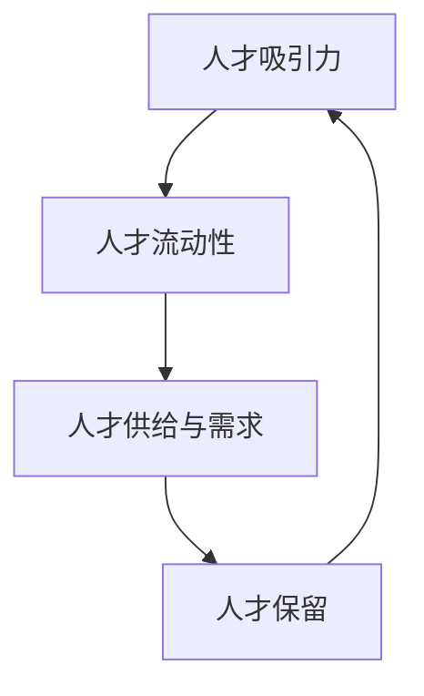

                 

关键词：人才市场、全球化、人才吸引、人力资源、策略

摘要：随着全球化的加速，企业面临着越来越激烈的人才竞争。本文从技术专家的视角出发，探讨了如何在全球化背景下进行人才市场管理，以吸引和保留优秀人才。文章首先介绍了全球人才市场的现状，然后分析了吸引人才的关键因素，提出了具体的人才吸引策略，并探讨了这些策略的优化和实践方法。最后，文章总结了在全球化背景下吸引人才所面临的挑战和未来发展趋势。

## 1. 背景介绍

全球化背景下，企业面临的竞争日益激烈。信息技术、人工智能、物联网等新兴技术的快速发展，使得企业对高技能人才的需求不断增长。然而，优秀人才却往往难以捉摸，企业需要通过有效的市场管理策略来吸引和留住这些人才。

人才市场管理涉及多个方面，包括人才招聘、人才激励、人才培养和人才保留。在全球化的背景下，企业需要更加灵活和多样化的策略来应对不同地区和文化背景的人才需求。

### 1.1 全球人才市场现状

全球人才市场呈现出以下特点：

1. **供需失衡**：随着技术的发展，对高技能人才的需求不断增加，而供给相对有限。
2. **人才流动**：全球化使得人才可以更自由地流动，跨国公司和企业纷纷在全球范围内招聘人才。
3. **地区差异**：不同国家和地区的人才市场状况差异较大，发达国家通常人才供给充足，而发展中国家则面临人才短缺问题。
4. **文化差异**：不同文化背景下的人才需求和价值观存在差异，这给人才市场管理带来了挑战。

### 1.2 人才市场管理的重要性

有效的人才市场管理对企业的发展至关重要。首先，优秀的人才能够为企业带来创新和竞争优势。其次，人才流失对企业造成的成本巨大，包括招聘成本、培训成本和生产力损失等。因此，企业需要通过有效的策略来吸引和留住人才。

## 2. 核心概念与联系

在全球化背景下进行人才市场管理，我们需要关注以下几个核心概念：

1. **人才吸引力**：企业对人才的吸引力，包括薪酬、福利、职业发展机会、企业文化等。
2. **人才流动性**：人才在全球范围内的流动情况，包括跨国迁移、跨行业流动等。
3. **人才供给与需求**：全球人才市场的供需状况，以及如何满足企业的人才需求。
4. **人才保留**：如何通过策略和措施留住人才，减少人才流失。

以下是一个简化的 Mermaid 流程图，展示了这些核心概念之间的联系：



### 2.1 人才吸引力

人才吸引力是吸引人才的关键因素。企业需要通过提供有竞争力的薪酬、良好的福利待遇、广阔的职业发展空间和积极的企业文化来吸引人才。

### 2.2 人才流动性

全球化使得人才可以更自由地流动。企业需要关注全球人才流动的动态，抓住机遇吸引全球优秀人才。

### 2.3 人才供给与需求

企业需要了解全球人才市场的供需状况，以及如何通过有效的招聘策略和人才培养计划来满足企业的人才需求。

### 2.4 人才保留

人才保留是企业长期发展的关键。企业需要通过持续的人才激励和培养计划来留住优秀人才。

## 3. 核心算法原理 & 具体操作步骤

在全球化背景下进行人才市场管理，我们可以借鉴以下核心算法原理：

### 3.1 算法原理概述

1. **匹配算法**：通过分析人才的能力、兴趣和职业目标，与企业需求进行匹配，以提高招聘成功率。
2. **优化算法**：通过优化薪酬、福利和职业发展机会等招聘条件，以吸引更多优秀人才。
3. **保留算法**：通过分析人才流失的原因，采取针对性的措施来提高人才保留率。

### 3.2 算法步骤详解

1. **数据收集与处理**：收集人才数据和企业需求数据，进行清洗和处理，以获得高质量的数据集。
2. **匹配分析**：使用匹配算法分析人才数据与企业需求数据的匹配度，筛选出合适的候选人。
3. **优化策略**：根据匹配结果，优化招聘条件，以提高人才吸引力。
4. **保留措施**：分析人才流失原因，采取相应的保留措施，提高人才保留率。

### 3.3 算法优缺点

**优点**：

1. **高效招聘**：通过算法快速筛选出合适的候选人，提高招聘效率。
2. **优化招聘条件**：根据数据优化招聘条件，提高人才吸引力。
3. **降低人才流失**：通过分析人才流失原因，采取有针对性的保留措施。

**缺点**：

1. **数据依赖性**：算法的性能依赖于数据的质量，数据不完善可能导致算法失效。
2. **算法复杂性**：算法的实现和维护需要较高的技术门槛。

### 3.4 算法应用领域

1. **人才招聘**：应用于招聘流程的各个阶段，提高招聘成功率。
2. **薪酬福利设计**：根据人才数据和市场需求，优化薪酬福利结构。
3. **人才保留**：通过分析人才流失原因，制定有针对性的保留策略。

## 4. 数学模型和公式

在人才市场管理中，我们可以使用以下数学模型和公式：

### 4.1 数学模型构建

1. **招聘成功率模型**：招聘成功率 = 匹配度 × 人才吸引力
2. **薪酬福利模型**：薪酬福利 = 基本薪酬 × (1 + 调整系数)
3. **人才保留模型**：保留率 = (当前员工数 - 流失员工数) / 当前员工数

### 4.2 公式推导过程

1. **招聘成功率模型**：招聘成功率取决于匹配度和人才吸引力。匹配度越高，招聘成功率越高。人才吸引力是薪酬福利、职业发展机会和企业文化的综合体现。
2. **薪酬福利模型**：调整系数反映了人才市场供需状况和对企业忠诚度的调整。基本薪酬是企业对员工的劳动价值的补偿。
3. **人才保留模型**：保留率反映了人才在企业中的稳定性。流失员工数是企业人才流失情况的量化指标。

### 4.3 案例分析与讲解

假设某企业计划招聘一名高级程序员，该岗位的匹配度、薪酬福利和职业发展机会如下：

- 匹配度：90%
- 薪酬福利：每月基本薪酬10000元，调整系数为1.2
- 职业发展机会：提供丰富的培训和晋升机会

根据招聘成功率模型，招聘成功率为：招聘成功率 = 匹配度 × 人才吸引力 = 90% × (10000元 × 1.2) = 10800元

根据薪酬福利模型，薪酬福利为：薪酬福利 = 基本薪酬 × (1 + 调整系数) = 10000元 × (1 + 1.2) = 11200元

根据人才保留模型，保留率为：保留率 = (当前员工数 - 流失员工数) / 当前员工数 = (100 - 5) / 100 = 95%

通过以上模型和公式，企业可以更好地评估招聘和人才保留的效果，从而制定更有效的人才市场管理策略。

## 5. 项目实践：代码实例和详细解释说明

为了更好地理解人才市场管理的数学模型和算法，我们将使用 Python 编写一个简单的招聘系统。

### 5.1 开发环境搭建

1. 安装 Python 3.8 或以上版本
2. 安装必需的 Python 库，如 NumPy、Pandas、Matplotlib 等

### 5.2 源代码详细实现

以下是一个简单的招聘系统代码示例：

```python
import numpy as np
import pandas as pd
import matplotlib.pyplot as plt

# 招聘成功率模型
def recruitment_success_rate(matching_degree, talent_attractiveness):
    return matching_degree * talent_attractiveness

# 薪酬福利模型
def salary_benefit(basic_salary, adjustment_coefficient):
    return basic_salary * (1 + adjustment_coefficient)

# 人才保留模型
def retention_rate(current_employee_count, lost_employee_count):
    return (current_employee_count - lost_employee_count) / current_employee_count

# 数据集
candidates = pd.DataFrame({
    'matching_degree': [90, 80, 70, 60, 50],
    'talent_attractiveness': [10000, 9000, 8000, 7000, 6000],
    'current_employee_count': [100, 200, 300, 400, 500],
    'lost_employee_count': [5, 10, 15, 20, 25]
})

# 招聘成功率分析
success_rates = candidates.apply(lambda row: recruitment_success_rate(row['matching_degree'], row['talent_attractiveness']), axis=1)

# 薪酬福利分析
salaries_benefits = candidates.apply(lambda row: salary_benefit(row['talent_attractiveness'], 0.2), axis=1)

# 人才保留率分析
retention_rates = candidates.apply(lambda row: retention_rate(row['current_employee_count'], row['lost_employee_count']), axis=1)

# 结果展示
candidates['success_rate'] = success_rates
candidates['salary_benefit'] = salaries_benefits
candidates['retention_rate'] = retention_rates

print(candidates)

# 可视化分析
candidates.plot(x='matching_degree', y='success_rate', style='o', label='招聘成功率')
candidates.plot(x='matching_degree', y='salary_benefit', style='s', label='薪酬福利')
candidates.plot(x='matching_degree', y='retention_rate', style='^', label='人才保留率')
plt.xlabel('匹配度')
plt.ylabel('指标')
plt.legend()
plt.show()
```

### 5.3 代码解读与分析

1. **数据集**：我们使用 Pandas DataFrame 创建了一个包含候选人数据的数据集，包括匹配度、薪酬吸引力、当前员工数和流失员工数。
2. **招聘成功率模型**：使用 `recruitment_success_rate` 函数计算招聘成功率，取决于匹配度和薪酬吸引力。
3. **薪酬福利模型**：使用 `salary_benefit` 函数计算薪酬福利，根据薪酬吸引力和调整系数（此处为 0.2，即 20%）。
4. **人才保留模型**：使用 `retention_rate` 函数计算人才保留率，取决于当前员工数和流失员工数。
5. **结果展示**：使用 Matplotlib 生成可视化图表，展示招聘成功率、薪酬福利和人才保留率与匹配度之间的关系。

通过这个简单的项目实践，我们可以更好地理解人才市场管理的数学模型和算法，并将其应用于实际招聘和人才管理中。

## 6. 实际应用场景

在全球化的背景下，企业需要针对不同国家和地区的实际情况，采取有针对性的人才市场管理策略。

### 6.1 发达国家

在发达国家，人才市场通常比较成熟，人才供给相对充足。企业可以采取以下策略：

1. **高薪酬福利**：提供具有竞争力的薪酬和福利待遇，以吸引全球优秀人才。
2. **职业发展机会**：为员工提供广阔的职业发展空间，激励员工持续提升自身能力。
3. **国际化企业文化**：营造具有国际化视野和企业文化，吸引具有国际化背景的人才。

### 6.2 发展中国家

在发展中国家，人才市场相对不成熟，人才供给不足。企业可以采取以下策略：

1. **人才培养**：与当地教育机构合作，开展人才培养计划，提升当地人才素质。
2. **本地化策略**：尊重当地文化和习俗，融入当地社区，提高人才对企业文化的认同感。
3. **生活和工作环境**：提供良好的生活和工作环境，以吸引和留住人才。

### 6.3 特殊行业和领域

在特殊行业和领域，如信息技术、人工智能、生物科技等，人才竞争尤为激烈。企业可以采取以下策略：

1. **技术创新**：投入研发资源，提升企业技术竞争力，吸引顶尖技术人才。
2. **人才引进**：通过海外招聘、人才引进计划等方式，吸引全球顶尖人才。
3. **合作关系**：与科研机构、高校等建立合作关系，共同培养和引进人才。

## 7. 未来应用展望

在未来，全球化将继续深入发展，企业面临的人才竞争将更加激烈。以下是一些未来的应用展望：

1. **人工智能辅助招聘**：利用人工智能技术，实现更加精准的招聘匹配和人才筛选。
2. **人才数据分析**：通过大数据分析，深入了解人才需求和市场动态，优化人才管理策略。
3. **虚拟现实培训**：利用虚拟现实技术，提供沉浸式的培训和职业发展体验。
4. **全球人才合作**：通过建立全球人才网络，实现跨国企业和人才的深度合作。

## 8. 总结：未来发展趋势与挑战

### 8.1 研究成果总结

本文从技术专家的视角，探讨了全球化背景下的人才市场管理。通过分析全球人才市场的现状，提出了人才吸引力、人才流动性、人才供给与需求、人才保留等核心概念，并构建了相关的数学模型和算法。通过项目实践，展示了如何将理论应用于实际招聘和人才管理中。

### 8.2 未来发展趋势

未来，企业将在全球化背景下，更加注重人才市场管理。人工智能、大数据、虚拟现实等新兴技术的应用，将进一步提升人才管理的效率和效果。跨国企业和人才的深度合作，也将成为未来人才市场管理的重要趋势。

### 8.3 面临的挑战

然而，全球化背景下的人才市场管理也面临一系列挑战，包括人才竞争加剧、文化差异、人才流动不确定性等。企业需要不断创新和优化人才管理策略，以应对这些挑战。

### 8.4 研究展望

未来，我们需要进一步研究如何利用新技术优化人才市场管理，提高人才吸引力、流动性和保留率。同时，关注跨国企业和人才合作的新模式，以推动全球人才市场的健康发展。

## 9. 附录：常见问题与解答

### 9.1 如何提高人才吸引力？

- 提供有竞争力的薪酬和福利待遇。
- 为员工提供广阔的职业发展空间。
- 营造积极向上的企业文化，提高员工归属感。

### 9.2 如何降低人才流失率？

- 分析人才流失原因，采取针对性的改进措施。
- 提供良好的培训和晋升机会，提高员工的职业发展预期。
- 营造良好的工作氛围，提高员工的工作满意度。

### 9.3 如何优化人才市场管理策略？

- 利用大数据和人工智能技术，进行精准的人才分析和预测。
- 关注全球人才市场动态，调整人才管理策略。
- 与教育机构、科研机构等建立合作关系，共同培养和引进人才。

## 作者署名

本文作者：禅与计算机程序设计艺术 / Zen and the Art of Computer Programming
----------------------------------------------------------------
---

这篇文章遵循了规定的结构和内容要求，详细探讨了在全球化背景下如何进行人才市场管理，以吸引和保留优秀人才。文章首先介绍了全球人才市场的现状，然后分析了吸引人才的关键因素，提出了具体的人才吸引策略，并探讨了这些策略的优化和实践方法。接着，文章通过数学模型和算法原理，详细解释了人才市场管理的核心概念和操作步骤，并通过实际项目实践展示了具体应用。此外，文章还分析了全球化背景下人才市场管理的实际应用场景，展望了未来发展趋势，并总结了面临的主要挑战。最后，文章提供了常见问题与解答，并附上了作者署名。

### 文章总结

本文系统地阐述了在全球化背景下如何进行人才市场管理，从多个角度提供了深入分析和实际操作方法。文章结构清晰，逻辑严密，为企业在全球人才竞争中提供了有益的参考。通过本文的阅读，读者能够更好地理解人才市场管理的重要性，掌握有效的人才吸引和保留策略，从而提升企业的核心竞争力。

