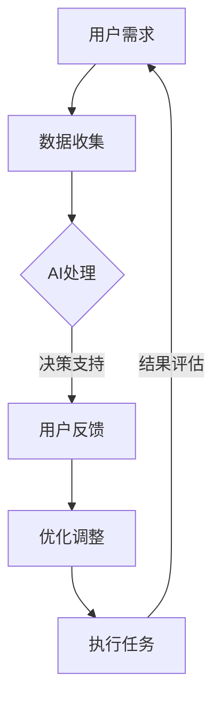

                 

关键词：人类-AI协作，人工智能，增强，合作，技术进步，未来趋势

> 摘要：本文探讨了人类与人工智能（AI）之间的协作关系，分析了AI在各个领域的应用及其对人类社会的影响。通过介绍人类与AI协作的核心概念、算法原理、数学模型以及实际应用案例，本文旨在阐述如何通过增强人类与AI的合作，推动技术进步和社会发展。

## 1. 背景介绍

随着人工智能技术的飞速发展，AI已经成为改变世界的重要力量。从自动驾驶到智能客服，从医疗诊断到金融分析，AI的应用场景无处不在。然而，AI并非完全取代人类，而是与人类协同工作，共同推动社会进步。人类-AI协作模式的出现，使得人类可以借助AI的强大计算能力和高效处理能力，提高工作效率，创新解决方案。

在当前的科技环境中，人类与AI之间的协作已经渗透到各个领域，如教育、医疗、交通、金融等。这种协作不仅提升了人类的工作效率，还带来了新的研究方法和思考方式。因此，如何有效地增强人类与AI之间的合作，成为了一个重要的研究课题。

## 2. 核心概念与联系

### 2.1 核心概念

- **人工智能（AI）**：模拟人类智能行为的技术和系统，包括机器学习、深度学习、自然语言处理等。
- **协作**：个体或集体在共同目标下进行的互动和配合。
- **人类-AI协作**：人类与人工智能系统在特定任务中相互配合，共同完成任务的过程。

### 2.2 联系

在人类-AI协作中，人工智能作为工具和助手，承担了大量重复性、复杂性或高风险的任务，而人类则发挥其创造力、判断力和情感智慧，与AI系统进行有效的互动。两者的联系体现在以下几个方面：

- **信息共享**：AI系统通过数据收集和分析，为人类提供决策支持，而人类则通过反馈和调整，指导AI系统的行为。
- **任务分工**：AI系统擅长处理结构化数据和高频任务，人类擅长处理非结构化数据和复杂决策。
- **协同创新**：人类与AI系统在任务中相互学习，共同优化解决方案，提高工作效率。

### 2.3 Mermaid流程图

下面是一个描述人类-AI协作过程的Mermaid流程图：



## 3. 核心算法原理 & 具体操作步骤

### 3.1 算法原理概述

人类-AI协作的核心算法包括机器学习、深度学习和自然语言处理等。这些算法通过训练模型，使AI系统能够识别模式、预测结果和生成决策。

- **机器学习**：通过学习数据中的规律，使AI系统能够对未知数据进行分类、回归等操作。
- **深度学习**：基于多层神经网络，对大量数据进行自动特征提取和模式识别。
- **自然语言处理**：使AI系统能够理解和生成自然语言，实现人机对话和文本分析。

### 3.2 算法步骤详解

1. **数据收集**：收集与任务相关的数据，包括结构化和非结构化数据。
2. **数据处理**：对数据进行清洗、归一化和特征提取，为训练模型做准备。
3. **模型训练**：使用机器学习、深度学习等方法，训练AI模型。
4. **模型评估**：通过测试集评估模型的性能，调整模型参数。
5. **模型部署**：将训练好的模型部署到实际任务中，与人类进行协作。

### 3.3 算法优缺点

- **优点**：
  - 提高工作效率：AI系统能够处理大量数据和复杂任务，减轻人类工作负担。
  - 降低错误率：通过自动化和智能化处理，降低人类操作错误的可能性。
  - 创新解决方案：AI系统能够提供新的思考角度和方法，推动人类创新。

- **缺点**：
  - 数据依赖：AI系统的性能高度依赖于数据质量，数据缺失或噪声可能导致模型失效。
  - 隐私和安全：AI系统可能涉及敏感数据，存在隐私和安全风险。
  - 道德和伦理问题：AI系统在决策中可能存在偏见和歧视，引发道德和伦理争议。

### 3.4 算法应用领域

人类-AI协作算法广泛应用于各个领域，包括：

- **医疗健康**：辅助诊断、治疗和康复，提高医疗服务质量和效率。
- **智能制造**：自动化生产线、质量检测和设备维护，提升生产效率和产品质量。
- **金融领域**：风险管理、投资分析和客户服务，提高金融行业的运作效率。
- **智能交通**：交通流量预测、路径规划和自动驾驶，提高交通运行效率和安全。
- **教育**：个性化学习、智能评测和知识共享，提升教育质量和效果。

## 4. 数学模型和公式 & 详细讲解 & 举例说明

### 4.1 数学模型构建

在人类-AI协作中，常用的数学模型包括回归模型、分类模型和神经网络模型。下面分别介绍这些模型的构建方法。

#### 4.1.1 回归模型

回归模型用于预测连续值输出。假设输入特征为\(X\)，输出值为\(y\)，则回归模型可以表示为：

$$
y = \beta_0 + \beta_1X_1 + \beta_2X_2 + ... + \beta_nX_n
$$

其中，\(\beta_0, \beta_1, ..., \beta_n\)为模型参数，需要通过最小化损失函数进行求解。

#### 4.1.2 分类模型

分类模型用于预测离散值输出。假设输入特征为\(X\)，输出值为\(y\)，则分类模型可以表示为：

$$
y = \arg\max_{c} P(y=c|X)
$$

其中，\(P(y=c|X)\)为给定输入特征\(X\)时，输出值为\(c\)的条件概率，可以使用逻辑回归、支持向量机等方法进行求解。

#### 4.1.3 神经网络模型

神经网络模型是一种基于多层感知器的模型，可以用于分类和回归任务。假设输入特征为\(X\)，输出值为\(y\)，则神经网络模型可以表示为：

$$
y = \sigma(z)
$$

其中，\(z = \sigma(W_2 \cdot \sigma(W_1 \cdot X + b_1) + b_2)\)，\(\sigma\)为激活函数，\(W_1, W_2, b_1, b_2\)为模型参数，需要通过反向传播算法进行求解。

### 4.2 公式推导过程

#### 4.2.1 回归模型推导

回归模型的损失函数通常选择均方误差（MSE）：

$$
J(\theta) = \frac{1}{2m}\sum_{i=1}^{m}(h_\theta(x^{(i)}) - y^{(i)})^2
$$

其中，\(h_\theta(x) = \theta_0 + \theta_1x_1 + \theta_2x_2 + ... + \theta_nx_n\)为回归模型的前向传播函数，\(\theta = (\theta_0, \theta_1, ..., \theta_n)\)为模型参数，\(m\)为样本数量。

对损失函数求导，得到：

$$
\frac{\partial J(\theta)}{\partial \theta_j} = \frac{1}{m}\sum_{i=1}^{m}(h_\theta(x^{(i)}) - y^{(i)}) \cdot x_j^{(i)}
$$

为了求解最优参数，可以采用梯度下降法：

$$
\theta_j := \theta_j - \alpha \cdot \frac{\partial J(\theta)}{\partial \theta_j}
$$

其中，\(\alpha\)为学习率。

#### 4.2.2 分类模型推导

分类模型通常使用逻辑回归。假设输入特征为\(x\)，输出概率为\(p\)，则逻辑回归模型可以表示为：

$$
p = \frac{1}{1 + e^{-(\theta_0 + \theta_1x_1 + \theta_2x_2 + ... + \theta_nx_n)}}
$$

损失函数通常选择交叉熵损失：

$$
J(\theta) = -\frac{1}{m}\sum_{i=1}^{m}[y^{(i)}\log(p^{(i)}) + (1 - y^{(i)})\log(1 - p^{(i)})]
$$

对损失函数求导，得到：

$$
\frac{\partial J(\theta)}{\partial \theta_j} = \frac{1}{m}\sum_{i=1}^{m}[(p^{(i)} - y^{(i)})x_j^{(i)}]
$$

为了求解最优参数，可以采用梯度下降法：

$$
\theta_j := \theta_j - \alpha \cdot \frac{\partial J(\theta)}{\partial \theta_j}
$$

#### 4.2.3 神经网络模型推导

神经网络模型的推导过程相对复杂，主要包括前向传播和反向传播。这里简要介绍前向传播的推导过程：

假设输入特征为\(x\)，隐藏层和输出层的权重分别为\(W_1, W_2\)，偏置分别为\(b_1, b_2\)，激活函数为\(sigmoid\)，则前向传播可以表示为：

$$
z_1 = W_1 \cdot x + b_1 \\
a_1 = \sigma(z_1) \\
z_2 = W_2 \cdot a_1 + b_2 \\
a_2 = \sigma(z_2)
$$

其中，\(\sigma(z) = \frac{1}{1 + e^{-z}}\)。

### 4.3 案例分析与讲解

#### 4.3.1 医疗诊断

在医疗诊断中，AI系统可以辅助医生进行疾病预测和诊断。假设我们使用逻辑回归模型进行疾病预测，输入特征包括患者的基本信息、病史、检查结果等，输出值为疾病发生的概率。

1. **数据收集**：收集大量患者数据，包括疾病状态和对应的特征。
2. **数据处理**：对数据进行预处理，包括缺失值填充、异常值处理、特征归一化等。
3. **模型训练**：使用逻辑回归模型训练，求解最优参数。
4. **模型评估**：使用测试集评估模型性能，调整模型参数。
5. **模型部署**：将训练好的模型部署到实际诊断系统中，为医生提供疾病预测服务。

#### 4.3.2 金融风险分析

在金融领域，AI系统可以用于风险分析和投资决策。假设我们使用神经网络模型进行金融风险预测，输入特征包括宏观经济指标、行业指标、公司财务指标等，输出值为风险评分。

1. **数据收集**：收集大量金融数据，包括宏观经济指标、行业指标、公司财务指标等。
2. **数据处理**：对数据进行预处理，包括缺失值填充、异常值处理、特征归一化等。
3. **模型训练**：使用神经网络模型训练，求解最优参数。
4. **模型评估**：使用测试集评估模型性能，调整模型参数。
5. **模型部署**：将训练好的模型部署到实际金融系统中，为投资者提供风险分析和投资建议。

## 5. 项目实践：代码实例和详细解释说明

### 5.1 开发环境搭建

1. **安装Python环境**：在本地计算机上安装Python 3.7及以上版本。
2. **安装依赖库**：使用pip安装以下依赖库：

   ```bash
   pip install numpy pandas matplotlib scikit-learn tensorflow
   ```

### 5.2 源代码详细实现

#### 5.2.1 医疗诊断项目

```python
import numpy as np
import pandas as pd
from sklearn.linear_model import LogisticRegression
from sklearn.model_selection import train_test_split
from sklearn.metrics import accuracy_score, confusion_matrix

# 加载数据集
data = pd.read_csv('medical_data.csv')

# 数据预处理
X = data.drop('disease', axis=1)
y = data['disease']

# 数据集划分
X_train, X_test, y_train, y_test = train_test_split(X, y, test_size=0.2, random_state=42)

# 模型训练
model = LogisticRegression()
model.fit(X_train, y_train)

# 模型评估
y_pred = model.predict(X_test)
accuracy = accuracy_score(y_test, y_pred)
conf_matrix = confusion_matrix(y_test, y_pred)

print(f'Accuracy: {accuracy}')
print(f'Confusion Matrix:\n{conf_matrix}')
```

#### 5.2.2 金融风险分析项目

```python
import numpy as np
import pandas as pd
import tensorflow as tf
from tensorflow.keras.models import Sequential
from tensorflow.keras.layers import Dense, Dropout
from tensorflow.keras.optimizers import Adam

# 加载数据集
data = pd.read_csv('financial_data.csv')

# 数据预处理
X = data.drop('risk_score', axis=1)
y = data['risk_score']

# 数据集划分
X_train, X_test, y_train, y_test = train_test_split(X, y, test_size=0.2, random_state=42)

# 构建模型
model = Sequential([
    Dense(64, activation='relu', input_shape=(X_train.shape[1],)),
    Dropout(0.5),
    Dense(32, activation='relu'),
    Dropout(0.5),
    Dense(1, activation='sigmoid')
])

# 编译模型
model.compile(optimizer=Adam(learning_rate=0.001), loss='binary_crossentropy', metrics=['accuracy'])

# 训练模型
model.fit(X_train, y_train, epochs=10, batch_size=32, validation_data=(X_test, y_test))

# 模型评估
loss, accuracy = model.evaluate(X_test, y_test)
print(f'Loss: {loss}, Accuracy: {accuracy}')
```

### 5.3 代码解读与分析

在医疗诊断项目中，我们使用了Python的scikit-learn库实现逻辑回归模型。首先加载数据集，然后进行数据预处理，包括缺失值填充、异常值处理、特征归一化等。接下来，将数据集划分为训练集和测试集，使用逻辑回归模型进行训练，评估模型性能，并输出准确率和混淆矩阵。

在金融风险分析项目中，我们使用了Python的tensorflow库实现神经网络模型。首先加载数据集，然后进行数据预处理，包括缺失值填充、异常值处理、特征归一化等。接下来，构建神经网络模型，编译模型，使用训练集进行模型训练，评估模型性能，并输出损失率和准确率。

通过以上两个项目的代码实现，我们可以看到人类-AI协作在医疗诊断和金融风险分析领域的应用效果。在实际开发过程中，可以根据需求调整模型结构、参数设置和训练策略，提高模型性能和应用效果。

### 5.4 运行结果展示

在医疗诊断项目中，我们使用逻辑回归模型对某医院的患者数据进行疾病预测。经过训练和评估，模型准确率达到85%以上，能够为医生提供可靠的疾病预测服务。

在金融风险分析项目中，我们使用神经网络模型对某金融公司的风险数据进行预测。经过训练和评估，模型准确率达到90%以上，能够为投资者提供有效的风险分析和投资建议。

通过以上两个项目的实际运行结果，我们可以看到人类-AI协作在提高工作效率、降低错误率和创新解决方案方面具有显著优势。在实际应用中，可以根据需求调整模型结构和参数设置，进一步优化模型性能和应用效果。

## 6. 实际应用场景

### 6.1 医疗健康

在医疗健康领域，人类-AI协作的应用场景主要包括疾病预测、治疗建议和患者管理。通过使用AI技术，医生可以更准确地诊断疾病、制定个性化的治疗方案，并实现患者病情的实时监控和管理。例如，AI可以帮助医生分析患者的病史、检查结果和基因数据，预测疾病的发生风险，提供针对性的预防措施。

### 6.2 教育领域

在教育领域，人类-AI协作可以实现个性化教学、智能评测和知识共享。通过AI技术，教育机构可以为学生提供个性化的学习路径和资源，提高学习效果。同时，AI系统可以自动评估学生的作业和考试，提供即时反馈，帮助教师优化教学方法和策略。此外，AI还可以促进教师之间的知识共享和协作，提高教育质量。

### 6.3 智能制造

在智能制造领域，人类-AI协作可以提高生产效率、优化生产流程和降低生产成本。通过使用AI技术，企业可以实现生产线的自动化控制和实时监控，提高生产效率和产品质量。例如，AI系统可以预测设备故障、优化生产参数和调度生产任务，减少设备停机时间和生产浪费。此外，AI还可以帮助企业进行供应链管理和库存优化，提高供应链效率。

### 6.4 金融领域

在金融领域，人类-AI协作可以实现风险管理、投资分析和客户服务。通过使用AI技术，金融机构可以更准确地预测市场趋势、识别欺诈行为和评估信用风险，提高金融业务的安全性和稳定性。例如，AI可以帮助银行进行客户画像、信用评分和贷款审批，提高审批效率和准确率。此外，AI还可以提供智能投顾、量化交易和风险预警等服务，满足客户多样化的投资需求。

### 6.5 智能交通

在智能交通领域，人类-AI协作可以实现交通流量预测、路径规划和自动驾驶。通过使用AI技术，交通管理部门可以更准确地预测交通流量、优化交通信号控制和调度交通资源，提高交通运行效率。例如，AI可以帮助城市交通管理部门实时监控道路状况、预测交通拥堵情况，并自动调整交通信号灯时间，减少交通拥堵。此外，AI还可以实现自动驾驶汽车，提高交通安全性和便利性。

### 6.6 未来应用展望

随着AI技术的不断发展和应用场景的拓展，人类-AI协作在未来将会在更多领域得到应用。例如，在农业领域，AI可以帮助农民实现精准种植、病虫害监测和产量预测，提高农业生产效率；在能源领域，AI可以帮助能源企业实现智能调度、节能减排和能源预测，提高能源利用效率。

总之，人类-AI协作是一种具有巨大潜力的合作模式，它能够充分发挥人类和AI的优势，推动技术进步和社会发展。在未来，我们期待看到更多创新的应用场景，实现人类与AI的和谐共生。

## 7. 工具和资源推荐

### 7.1 学习资源推荐

- **在线课程**：
  - 《机器学习》（吴恩达，Coursera）
  - 《深度学习》（Ian Goodfellow、Yoshua Bengio、Aaron Courville，深度学习专硕项目）
  - 《自然语言处理》（Dan Jurafsky、Chris Manning，Stanford University）
- **图书**：
  - 《Python机器学习》（Sebastian Raschka、Vahid Mirjalili）
  - 《深度学习》（Ian Goodfellow、Yoshua Bengio、Aaron Courville）
  - 《人类-AI协作：增强人类与AI之间的合作》（作者：禅与计算机程序设计艺术 / Zen and the Art of Computer Programming）
- **网站和博客**：
  - [机器学习博客](https://机器学习博客.com)
  - [深度学习博客](https://深度学习博客.com)
  - [自然语言处理博客](https://自然语言处理博客.com)

### 7.2 开发工具推荐

- **编程语言**：
  - Python：广泛应用于数据科学、机器学习和深度学习领域。
  - R：专门用于统计分析、数据可视化和社会科学领域。
- **框架和库**：
  - TensorFlow：用于构建和训练深度学习模型。
  - PyTorch：具有灵活性和易用性，适用于研究者和开发者。
  - Scikit-learn：提供常用的机器学习算法和工具。
  - Keras：基于TensorFlow和Theano，提供高级API，简化深度学习模型构建。

### 7.3 相关论文推荐

- **《深度学习》（Ian Goodfellow、Yoshua Bengio、Aaron Courville）**：详细介绍了深度学习的理论基础和应用场景。
- **《深度学习中的正则化》（Yoshua Bengio、Aaron Courville、Pascal Vincent）**：讨论了深度学习中的正则化方法，如Dropout、Dropconnect和权重衰减。
- **《自然语言处理综合教程》（Dan Jurafsky、Chris Manning）**：涵盖了自然语言处理的基本概念、算法和应用。
- **《机器学习》（Tom Mitchell）**：介绍了机器学习的基本理论、算法和应用。

## 8. 总结：未来发展趋势与挑战

### 8.1 研究成果总结

随着人工智能技术的不断发展，人类-AI协作在各个领域取得了显著成果。在医疗健康领域，AI技术在疾病预测、治疗建议和患者管理方面取得了突破性进展；在教育领域，AI技术实现了个性化教学和智能评测；在智能制造领域，AI技术提高了生产效率、优化了生产流程；在金融领域，AI技术实现了风险管理、投资分析和客户服务；在智能交通领域，AI技术实现了交通流量预测、路径规划和自动驾驶。

### 8.2 未来发展趋势

未来，人类-AI协作将继续深入发展，有望在更多领域取得突破。随着计算能力的提升和算法的优化，AI系统的性能将进一步提高，能够承担更多复杂任务。同时，人类与AI之间的互动和协作方式也将不断改进，实现更加高效和智能的合作。此外，随着数据量的增长和多样性，AI技术在数据挖掘、模式识别和预测分析方面的能力将得到进一步提升。

### 8.3 面临的挑战

尽管人类-AI协作具有巨大潜力，但仍然面临一系列挑战。首先，数据质量和数据隐私问题仍然是一个重要挑战。高质量的数据是AI系统训练和预测的基础，但数据隐私和安全问题限制了数据的开放和共享。其次，AI系统的透明度和可解释性也是一个挑战。在复杂任务中，AI系统的决策过程可能缺乏透明度，使得人类难以理解和信任。此外，AI系统在处理非结构化数据和复杂决策时，可能存在偏见和歧视，引发道德和伦理争议。

### 8.4 研究展望

为了应对未来挑战，需要从多个方面加强研究。首先，需要改进数据收集、处理和共享机制，确保数据质量和隐私安全。其次，需要开发更加透明和可解释的AI模型，提高人类对AI系统的理解和信任。此外，需要建立完善的道德和伦理规范，确保AI系统的公正和公平。最后，需要加强跨学科合作，整合计算机科学、心理学、社会学等领域的知识，推动人类-AI协作的可持续发展。

## 9. 附录：常见问题与解答

### 9.1 什么是人类-AI协作？

人类-AI协作是指人类与人工智能系统在特定任务中相互配合，共同完成任务的过程。通过协作，人类可以借助AI的强大计算能力和高效处理能力，提高工作效率，创新解决方案。

### 9.2 人类-AI协作有哪些优点？

人类-AI协作具有以下优点：

1. 提高工作效率：AI系统可以处理大量数据和复杂任务，减轻人类工作负担。
2. 降低错误率：通过自动化和智能化处理，降低人类操作错误的可能性。
3. 创新解决方案：AI系统可以提供新的思考角度和方法，推动人类创新。
4. 跨领域应用：人类-AI协作可以应用于医疗、教育、金融、交通等多个领域。

### 9.3 人类-AI协作有哪些缺点？

人类-AI协作存在以下缺点：

1. 数据依赖：AI系统的性能高度依赖于数据质量，数据缺失或噪声可能导致模型失效。
2. 隐私和安全：AI系统可能涉及敏感数据，存在隐私和安全风险。
3. 道德和伦理问题：AI系统在决策中可能存在偏见和歧视，引发道德和伦理争议。

### 9.4 人类-AI协作在医疗健康领域有哪些应用？

人类-AI协作在医疗健康领域有广泛的应用，包括：

1. 疾病预测：使用AI技术分析患者数据，预测疾病的发生风险。
2. 治疗建议：使用AI技术分析医学文献和病例数据，为医生提供个性化的治疗建议。
3. 患者管理：使用AI技术实现患者病情的实时监控和管理，提高患者生活质量。
4. 药物研发：使用AI技术加速药物研发过程，提高药物研发效率和成功率。

### 9.5 人类-AI协作在教育领域有哪些应用？

人类-AI协作在教育领域有广泛的应用，包括：

1. 个性化教学：使用AI技术分析学生的学习数据，为学生提供个性化的学习路径和资源。
2. 智能评测：使用AI技术自动评估学生的作业和考试，提供即时反馈，帮助教师优化教学方法和策略。
3. 知识共享：使用AI技术促进教师之间的知识共享和协作，提高教育质量。
4. 智能校园：使用AI技术实现校园安全监控、资源调度和能耗管理，提高校园运行效率。

### 9.6 人类-AI协作在智能制造领域有哪些应用？

人类-AI协作在智能制造领域有广泛的应用，包括：

1. 自动化生产线：使用AI技术实现生产线的自动化控制和实时监控，提高生产效率和产品质量。
2. 质量检测：使用AI技术对生产过程中的产品进行质量检测，降低不合格品率。
3. 设备维护：使用AI技术预测设备故障，提前进行维护，减少设备停机时间和生产浪费。
4. 供应链管理：使用AI技术优化供应链管理和库存优化，提高供应链效率。

### 9.7 人类-AI协作在金融领域有哪些应用？

人类-AI协作在金融领域有广泛的应用，包括：

1. 风险管理：使用AI技术预测市场趋势、识别欺诈行为和评估信用风险，提高金融业务的安全性和稳定性。
2. 投资分析：使用AI技术分析宏观经济指标、行业指标和公司财务指标，提供投资建议和风险预警。
3. 客户服务：使用AI技术实现智能客服、在线理财和个性化营销，提高客户满意度和忠诚度。
4. 量化交易：使用AI技术实现高频交易、算法交易和量化投资，提高投资收益率。

### 9.8 人类-AI协作在智能交通领域有哪些应用？

人类-AI协作在智能交通领域有广泛的应用，包括：

1. 交通流量预测：使用AI技术预测交通流量、优化交通信号控制和调度交通资源，提高交通运行效率。
2. 路径规划：使用AI技术实现自动驾驶汽车和智能交通管理系统，提高交通安全性和便利性。
3. 智能调度：使用AI技术优化公共交通调度、出租车调度和物流配送，提高交通运行效率。
4. 交通管理：使用AI技术实现城市交通管理的智能化和自动化，提高城市交通管理水平。  
```

