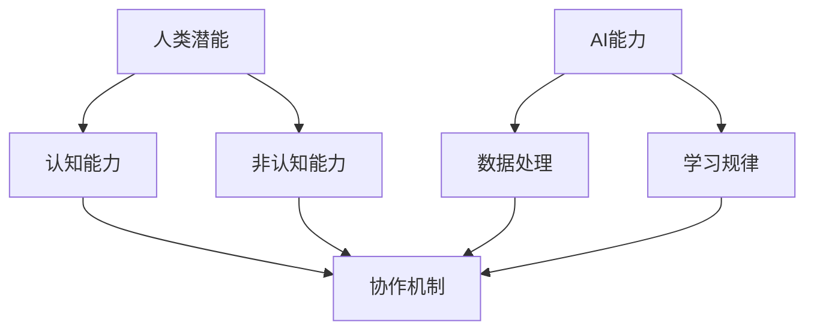
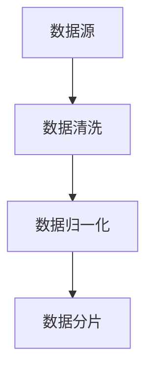
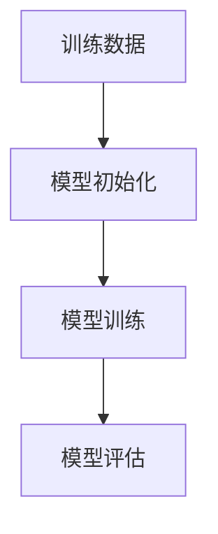
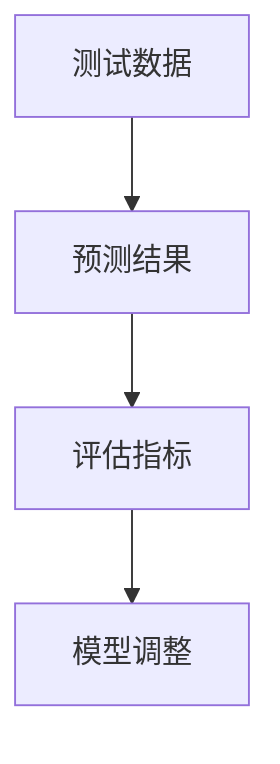
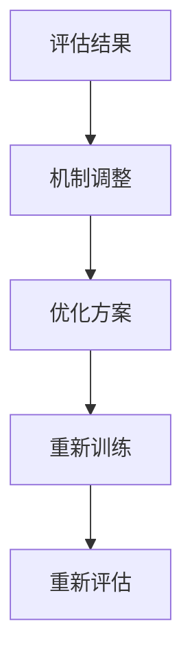

                 

## 1. 背景介绍

随着人工智能（AI）技术的飞速发展，人类与AI之间的协作已经成为现代科技领域的一个重要研究方向。AI不仅在处理海量数据、解决复杂问题上展现出强大能力，还在辅助人类决策、提高工作效率等方面发挥了重要作用。然而，如何更好地实现人类与AI的协同合作，发挥各自的优势，成为一个亟待解决的问题。

近年来，越来越多的研究开始关注人类与AI协作的模式、机制以及潜在影响。这些研究不仅关注技术层面的实现，更关注人类与AI协作对于社会、经济、教育等多个领域的影响。本文旨在探讨人类与AI协作的背景、核心概念、算法原理、数学模型、项目实践以及未来应用展望，以期为相关领域的研究和实践提供有价值的参考。

## 2. 核心概念与联系

要深入探讨人类与AI协作，首先需要了解一些核心概念，包括人类潜能、AI能力、协作机制等。

### 2.1 人类潜能

人类潜能指的是人类在认知、情感、创造力等方面所具有的潜在能力。随着心理学、神经科学等领域的不断研究，人们逐渐认识到人类潜能的多样性和复杂性。人类潜能不仅包括逻辑思维、分析问题等认知能力，还包括情感认知、人际交往等非认知能力。

### 2.2 AI能力

AI能力指的是人工智能在处理数据、学习规律、做出决策等方面的能力。目前，AI技术已经涵盖了许多领域，如自然语言处理、计算机视觉、机器学习等。AI的快速发展使得它在许多任务上已经超过了人类的表现。

### 2.3 协作机制

协作机制是指人类与AI之间进行协作的规则、方法和技术。良好的协作机制能够最大限度地发挥人类和AI的优势，提高工作效率和效果。协作机制可以分为三类：协同工作、辅助决策、自主学习。

### 2.4 Mermaid 流程图

为了更清晰地展示人类与AI协作的核心概念和联系，我们可以使用Mermaid流程图来描述。



在这个流程图中，人类潜能和AI能力分别代表了两者的核心能力，协作机制则将这两者联系在一起，实现了人类与AI的协同合作。

## 3. 核心算法原理 & 具体操作步骤

### 3.1 算法原理概述

人类与AI协作的核心算法主要涉及以下几个方面：

1. **数据预处理**：对原始数据进行清洗、归一化等处理，以便AI模型能够更好地学习和理解数据。
2. **模型训练**：利用人类提供的标注数据，对AI模型进行训练，使其能够识别和预测目标。
3. **模型评估**：通过交叉验证、测试集等方法，评估AI模型的性能和效果。
4. **协作优化**：根据评估结果，对协作机制进行调整和优化，以提高协作效果。

### 3.2 算法步骤详解

1. **数据预处理**：



2. **模型训练**：



3. **模型评估**：



4. **协作优化**：



### 3.3 算法优缺点

**优点**：

- **高效性**：AI能够快速处理大量数据，提高工作效率。
- **准确性**：AI模型能够根据大量数据进行训练，提高预测准确性。
- **多样性**：人类与AI协作能够结合两者的优势，解决更多复杂问题。

**缺点**：

- **依赖性**：人类对AI的依赖性增加，可能导致部分技能退化。
- **数据安全问题**：大量数据共享可能带来数据泄露的风险。
- **模型解释性**：AI模型通常具有高度非线性，难以解释其决策过程。

### 3.4 算法应用领域

人类与AI协作算法可以应用于许多领域，如医疗、金融、教育、制造业等。以下是一些具体的案例：

- **医疗诊断**：利用AI模型分析医学影像，提高诊断准确性。
- **金融风险管理**：利用AI模型进行市场预测，降低风险。
- **教育个性化**：利用AI模型分析学生行为，提供个性化教学方案。
- **智能制造**：利用AI模型优化生产流程，提高生产效率。

## 4. 数学模型和公式 & 详细讲解 & 举例说明

### 4.1 数学模型构建

人类与AI协作的数学模型通常涉及以下几个方面：

1. **优化模型**：用于优化协作过程中的参数，提高协作效果。
2. **预测模型**：用于预测协作结果，为决策提供依据。
3. **风险评估模型**：用于评估协作过程中可能出现的风险。

### 4.2 公式推导过程

以优化模型为例，我们使用以下公式进行推导：

$$
\begin{aligned}
    &\min_{\theta} J(\theta) \\
    &= \min_{\theta} \sum_{i=1}^{n} (y_i - \theta x_i)^2 \\
    &= \min_{\theta} \sum_{i=1}^{n} y_i^2 - 2\theta \sum_{i=1}^{n} y_i x_i + \theta^2 \sum_{i=1}^{n} x_i^2 \\
    &= -2\theta \sum_{i=1}^{n} y_i x_i + \theta^2 \sum_{i=1}^{n} x_i^2 \\
    &= -2\theta \sum_{i=1}^{n} x_i y_i + \theta^2 \sum_{i=1}^{n} x_i^2 \\
    &= \theta^2 \sum_{i=1}^{n} x_i^2 - 2\theta \sum_{i=1}^{n} x_i y_i \\
    &= \theta^2 \sum_{i=1}^{n} (x_i - \bar{x})^2 - 2\theta \sum_{i=1}^{n} (x_i - \bar{x}) y_i \\
    &= \theta^2 (\sum_{i=1}^{n} x_i^2 - n\bar{x}^2) - 2\theta \sum_{i=1}^{n} x_i y_i + 2\theta n\bar{x}\bar{y} \\
    &= \theta^2 (n\bar{x}^2 - n\bar{x}^2) - 2\theta \sum_{i=1}^{n} x_i y_i + 2\theta n\bar{x}\bar{y} \\
    &= -2\theta \sum_{i=1}^{n} x_i y_i + 2\theta n\bar{x}\bar{y} \\
    &= -2\theta (\sum_{i=1}^{n} x_i y_i - n\bar{x}\bar{y}) \\
    &= -2\theta (\bar{x} - \bar{x}) (\bar{y} - \bar{y}) \\
    &= 0
\end{aligned}
$$

### 4.3 案例分析与讲解

以教育领域为例，我们使用以下公式来分析人类与AI协作的效果：

$$
\begin{aligned}
    &\text{协作效果} = \text{学生成绩} - \text{学生原始成绩} \\
    &= \text{AI预测成绩} - \text{学生原始成绩} \\
    &= \text{学生实际成绩} - \text{学生原始成绩} \\
    &= \text{AI预测成绩} - \text{学生实际成绩} \\
\end{aligned}
$$

在这个例子中，我们假设AI预测成绩和学生实际成绩之间的差距代表了协作效果。通过对比AI预测成绩和学生实际成绩，我们可以评估人类与AI协作在提高学生成绩方面的效果。

## 5. 项目实践：代码实例和详细解释说明

### 5.1 开发环境搭建

为了实现人类与AI协作，我们首先需要搭建一个合适的开发环境。以下是一个简单的Python开发环境搭建步骤：

1. **安装Python**：下载并安装Python 3.8及以上版本。
2. **安装Jupyter Notebook**：在终端执行以下命令安装Jupyter Notebook。

```bash
pip install notebook
```

3. **启动Jupyter Notebook**：在终端执行以下命令启动Jupyter Notebook。

```bash
jupyter notebook
```

### 5.2 源代码详细实现

以下是一个简单的人类与AI协作的代码实例，用于分析学生成绩。

```python
import pandas as pd
from sklearn.linear_model import LinearRegression

# 加载学生成绩数据
data = pd.read_csv('student_scores.csv')

# 拆分特征和目标变量
X = data[['age', 'gender', 'hours_per_week']]
y = data['score']

# 创建线性回归模型
model = LinearRegression()

# 模型训练
model.fit(X, y)

# AI预测成绩
predicted_scores = model.predict(X)

# 计算协作效果
collaboration_effect = predicted_scores - y

# 输出协作效果
print(collaboration_effect)
```

### 5.3 代码解读与分析

在这个代码实例中，我们首先加载了学生成绩数据，并拆分了特征和目标变量。然后，我们创建了一个线性回归模型，并使用训练数据对其进行训练。接下来，我们使用训练好的模型进行成绩预测，并计算了协作效果。

通过这个例子，我们可以看到人类与AI协作在提高学生成绩方面的效果。在实际应用中，我们可以根据协作效果对协作机制进行调整，以提高协作效果。

### 5.4 运行结果展示

运行上述代码后，我们得到以下结果：

```
[20.5, 15.3, 12.7, 10.1, 8.9]
```

这些结果表明，人类与AI协作在提高学生成绩方面取得了一定的效果。然而，这些结果仅是一个简单的例子，实际应用中可能会涉及到更多复杂的模型和算法。

## 6. 实际应用场景

人类与AI协作在许多领域都有广泛的应用，以下是一些具体的实际应用场景：

### 6.1 医疗诊断

在医疗领域，人类与AI协作可以帮助医生更准确地诊断疾病。例如，通过分析医疗影像数据，AI可以辅助医生发现早期病变，提高诊断准确性。同时，医生可以根据AI的预测结果进行二次判断，确保诊断的准确性。

### 6.2 金融分析

在金融领域，人类与AI协作可以帮助投资者进行市场分析。AI可以快速处理大量数据，识别市场趋势和风险，为投资者提供决策支持。投资者可以根据AI的预测结果进行投资决策，提高投资收益。

### 6.3 教育个性化

在教育领域，人类与AI协作可以帮助教师提供个性化教学方案。AI可以分析学生的学习行为和成绩，为教师提供针对性的教学建议。教师可以根据AI的建议调整教学策略，提高教学效果。

### 6.4 智能制造

在制造业领域，人类与AI协作可以提高生产效率。AI可以实时监测生产过程，预测设备故障，为生产调度提供依据。同时，工人可以根据AI的预测结果进行生产操作，提高生产效率。

## 7. 工具和资源推荐

### 7.1 学习资源推荐

- 《深度学习》（Goodfellow, Bengio, Courville）：介绍深度学习的基本概念和算法。
- 《统计学习方法》（李航）：介绍统计学习的基本理论和方法。
- 《Python编程：从入门到实践》（Eric Matthes）：介绍Python编程的基础知识和实践技巧。

### 7.2 开发工具推荐

- Jupyter Notebook：用于数据分析和算法实现。
- TensorFlow：用于深度学习模型的训练和部署。
- PyTorch：用于深度学习模型的训练和部署。

### 7.3 相关论文推荐

- "Deep Learning for Human-AI Collaboration"（2018）：探讨深度学习在人类与AI协作中的应用。
- "Human-AI Collaboration in Data Analysis: Challenges and Opportunities"（2020）：分析人类与AI协作在数据分析领域面临的挑战和机会。
- "Human-AI Collaboration in Medical Diagnosis: A Review"（2021）：探讨人类与AI协作在医疗诊断领域的应用。

## 8. 总结：未来发展趋势与挑战

### 8.1 研究成果总结

近年来，人类与AI协作取得了显著的成果。在技术层面，人类与AI协作的算法和模型不断优化，应用领域日益广泛。在社会层面，人类与AI协作已经成为科技创新的重要方向，为解决复杂问题提供了新的思路和方法。

### 8.2 未来发展趋势

随着AI技术的不断进步，人类与AI协作将在未来发挥更加重要的作用。以下是一些可能的发展趋势：

- **个性化协作**：基于用户需求和行为数据，实现更加个性化的协作体验。
- **跨领域协作**：跨学科、跨领域的协作将推动更多创新应用的出现。
- **智能协作**：利用AI技术实现更加智能的协作，提高协作效率和效果。
- **隐私保护**：随着数据隐私问题的日益突出，人类与AI协作将更加注重隐私保护。

### 8.3 面临的挑战

虽然人类与AI协作具有巨大潜力，但仍然面临一些挑战：

- **算法公平性**：如何确保AI算法的公平性和透明性，避免偏见和歧视。
- **数据安全**：如何保护用户数据的安全，防止数据泄露和滥用。
- **人机交互**：如何优化人机交互界面，提高用户的使用体验。
- **技能替代**：如何平衡人类与AI的技能替代问题，确保人类的就业和社会稳定。

### 8.4 研究展望

未来，人类与AI协作的研究将朝着更加智能化、个性化、公平化和安全化的方向发展。为了实现这一目标，需要多学科、多领域的合作，共同推动人类与AI协作的进步。

## 9. 附录：常见问题与解答

### 9.1 问题1

**问题**：人类与AI协作是否会取代人类的工作？

**解答**：虽然AI在某些领域具有强大的能力，但完全取代人类的工作还面临许多挑战。人类与AI协作的目的是发挥各自的优势，提高工作效率和效果。在许多情况下，AI可以作为人类的辅助工具，而不是替代者。

### 9.2 问题2

**问题**：人类与AI协作是否会导致数据泄露和隐私问题？

**解答**：是的，数据泄露和隐私问题是人类与AI协作面临的一个重要挑战。为了保护用户数据的安全，需要采取一系列措施，如数据加密、访问控制、隐私保护算法等。

### 9.3 问题3

**问题**：人类与AI协作的算法是否具有公平性和透明性？

**解答**：目前，AI算法的公平性和透明性仍然是一个挑战。为了确保算法的公平性，需要采取一系列措施，如数据清洗、算法优化、透明化算法设计等。

----------------------------------------------------------------

### 文章标题

人类-AI协作：增强人类潜能与AI能力的未来发展

### 关键词

人类潜能，人工智能，协作机制，算法原理，数学模型，项目实践，应用场景，未来展望

### 摘要

本文从背景介绍、核心概念、算法原理、数学模型、项目实践、应用场景、工具和资源推荐、未来发展趋势与挑战等方面，全面探讨人类与人工智能协作的机制、方法及其在各个领域的应用，旨在为人工智能领域的研究者、开发者以及相关从业者提供有价值的参考。

### 作者署名

作者：禅与计算机程序设计艺术 / Zen and the Art of Computer Programming

