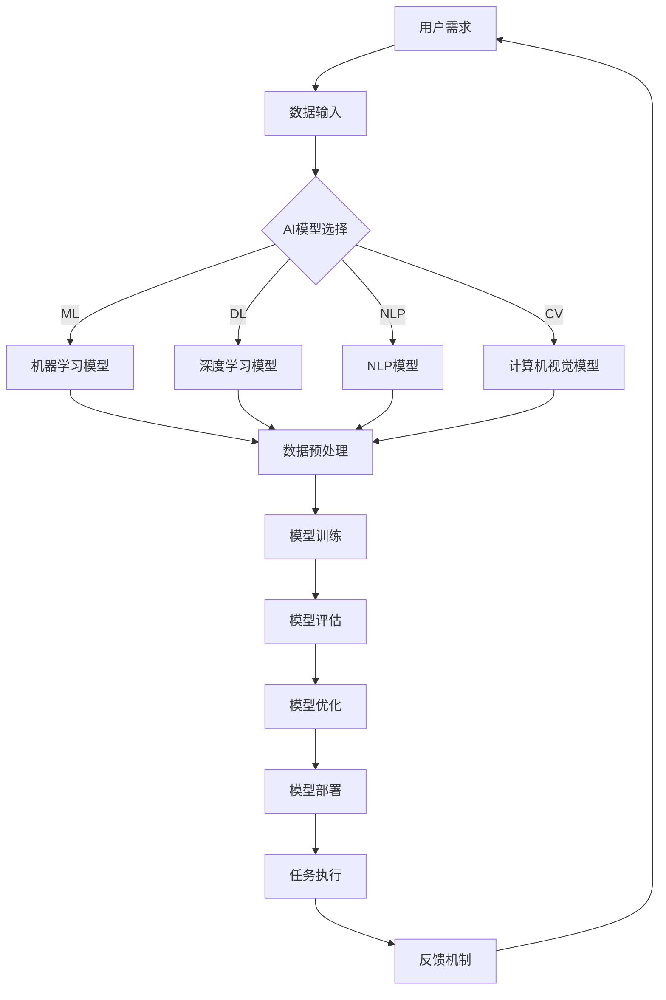

                 

 在当今数字化时代，人工智能（AI）的发展已经成为不可逆转的趋势。AI技术不仅改变了我们的生活方式，也深刻地影响着我们的工作方式。人类与AI的协作，正成为提高人类潜能和智慧的重要途径。本文将探讨人类-AI协作的背景、核心概念、算法原理、数学模型、实际应用以及未来展望。

## 关键词

- 人工智能
- 人类潜能
- 智慧增强
- 协作系统
- 算法
- 数学模型

## 摘要

本文旨在探讨人类与人工智能的协作，如何通过人工智能技术来增强人类的潜能和智慧。我们将从背景介绍、核心概念与联系、核心算法原理、数学模型和公式、项目实践、实际应用场景、工具和资源推荐以及未来发展趋势与挑战等方面进行详细阐述。通过本文的阅读，读者将了解到人类-AI协作的实质、方法及其潜在价值。

## 1. 背景介绍

随着计算机科学和人工智能技术的不断发展，人类与机器的交互方式也在不断进化。从早期的批处理系统到现在的实时交互系统，人类与机器的协作模式经历了从简单到复杂的变化。AI技术的发展，尤其是深度学习和自然语言处理（NLP）技术的进步，使得机器能够更好地理解和响应人类的需求，从而为人类-AI协作奠定了基础。

在当前的社会环境中，人类面临着越来越多的复杂问题，如环境保护、医疗健康、交通管理、经济预测等。这些问题往往需要大量的数据分析和复杂的计算能力，单靠人类自身的力量难以高效解决。而人工智能技术，尤其是大数据分析和机器学习算法，为这些问题的解决提供了新的思路和手段。

人类-AI协作不仅能够提高工作效率，还能拓展人类的认知边界，使人类能够处理更复杂、更庞大的信息。例如，在医疗领域，AI可以帮助医生进行影像诊断、药物研发和个性化治疗；在金融领域，AI可以帮助分析师进行市场预测、风险管理；在教育领域，AI可以帮助教师个性化教学、辅助学生学习和评估。

总之，人类-AI协作已经成为提高人类潜能和智慧的重要途径，其应用前景十分广阔。接下来，我们将进一步探讨人类-AI协作的核心概念、算法原理和数学模型，以便更深入地理解这一领域的本质。

## 2. 核心概念与联系

为了深入理解人类-AI协作的机制，我们首先需要明确一些核心概念，并探讨它们之间的联系。

### 2.1 人工智能（AI）

人工智能是指通过计算机程序实现的人类智能功能，包括学习、推理、感知、理解和决策等。根据AI的技术特点，可以分为以下几类：

- **机器学习（ML）**：通过数据训练模型，使机器能够自动学习和改进性能。
- **深度学习（DL）**：一种特殊的机器学习方法，通过多层神经网络模拟人类大脑的神经结构。
- **自然语言处理（NLP）**：使计算机能够理解、生成和翻译人类语言。
- **计算机视觉（CV）**：使计算机能够理解和解释视觉信息。

### 2.2 协作系统

协作系统是指多个个体（人类或机器）共同完成任务的环境和机制。在人类-AI协作中，协作系统通常包括以下几个组成部分：

- **用户界面（UI）**：用户与AI系统进行交互的界面。
- **数据输入**：用户提供的数据或AI系统自行收集的数据。
- **算法模型**：AI系统用于处理数据和生成结果的算法模型。
- **反馈机制**：用户对AI系统的输出进行评估和反馈，以优化系统的性能。

### 2.3 人类潜能与智慧

人类潜能是指人类在特定领域或任务中能够达到的最高水平和能力。智慧则是指人类运用知识、经验、洞察力和判断力解决复杂问题的能力。人类-AI协作通过以下几个方面增强人类潜能和智慧：

- **信息扩展**：AI系统可以处理和分析大量的数据，为人类提供更全面的信息支持。
- **任务优化**：AI系统可以自动化一些繁琐的任务，使人类能够专注于更高价值的任务。
- **决策支持**：AI系统可以提供基于数据和算法的决策建议，帮助人类做出更明智的决策。

### 2.4 Mermaid 流程图

以下是一个描述人类-AI协作流程的Mermaid流程图：



通过这个流程图，我们可以清晰地看到人类-AI协作的主要步骤和各个环节之间的联系。

## 3. 核心算法原理 & 具体操作步骤

### 3.1 算法原理概述

人类-AI协作的核心在于算法的设计与实现。不同的任务和应用场景需要不同的算法模型，但基本的算法原理可以概括为以下几个步骤：

1. **数据输入**：从各种数据源收集数据，包括结构化数据、非结构化数据等。
2. **数据预处理**：清洗、转换和归一化数据，以符合算法模型的输入要求。
3. **模型选择**：根据任务需求选择合适的算法模型，如机器学习模型、深度学习模型等。
4. **模型训练**：使用训练数据对算法模型进行训练，使其能够学会处理和预测新数据。
5. **模型评估**：使用测试数据评估模型的性能，调整模型参数以优化性能。
6. **模型部署**：将训练好的模型部署到实际应用环境中，执行任务。
7. **反馈机制**：收集用户对模型输出的反馈，用于进一步优化模型。

### 3.2 算法步骤详解

1. **数据输入**

   数据输入是算法模型训练的第一步。数据源可以包括数据库、文件系统、传感器等。在数据输入阶段，需要确保数据的准确性和完整性，避免噪声和错误数据对模型训练造成负面影响。

2. **数据预处理**

   数据预处理是提高算法模型性能的重要环节。常见的数据预处理方法包括：

   - 数据清洗：去除重复数据、空值填充、异常值处理等。
   - 数据转换：将不同类型的数据转换为统一格式，如将文本数据转换为向量表示。
   - 数据归一化：将数据缩放到相同的尺度范围内，以消除不同特征之间的数量级差异。

3. **模型选择**

   根据任务需求，选择合适的算法模型。例如，对于分类任务，可以选择支持向量机（SVM）、决策树、随机森林等；对于回归任务，可以选择线性回归、岭回归等；对于图像识别任务，可以选择卷积神经网络（CNN）。

4. **模型训练**

   使用训练数据对算法模型进行训练。训练过程包括前向传播、反向传播和权重更新等步骤。通过不断地调整模型参数，使模型能够更好地拟合训练数据。

5. **模型评估**

   使用测试数据对训练好的模型进行评估，以检查模型的泛化能力。常见的评估指标包括准确率、召回率、F1分数等。通过模型评估，可以找出模型的不足之处，并调整模型参数进行优化。

6. **模型部署**

   将训练好的模型部署到实际应用环境中，执行任务。在模型部署阶段，需要确保模型的高效运行和稳定性。

7. **反馈机制**

   收集用户对模型输出的反馈，用于进一步优化模型。反馈机制可以包括用户评分、错误报告等。通过不断优化模型，可以提高人类-AI协作的效果。

### 3.3 算法优缺点

每种算法模型都有其优缺点，以下是几种常见算法模型的特点：

- **机器学习模型**：优点包括通用性强、适应性高；缺点包括对数据量要求较大、训练时间较长。
- **深度学习模型**：优点包括模型性能优异、能够处理复杂的非线性问题；缺点包括对数据量要求较高、训练时间较长。
- **自然语言处理模型**：优点包括能够理解和生成自然语言；缺点包括对语言模型要求较高、数据处理复杂。
- **计算机视觉模型**：优点包括能够处理视觉信息、识别图像和视频；缺点包括对计算资源要求较高、模型复杂度较高。

### 3.4 算法应用领域

算法模型的应用领域非常广泛，以下是一些典型的应用场景：

- **医疗健康**：用于疾病诊断、药物研发和个性化治疗等。
- **金融**：用于市场预测、风险管理、欺诈检测等。
- **教育**：用于个性化教学、学生评估和智能教育系统等。
- **交通**：用于交通流量预测、自动驾驶和智能交通管理等。
- **工业**：用于生产过程优化、故障预测和质量检测等。

## 4. 数学模型和公式 & 详细讲解 & 举例说明

在人类-AI协作中，数学模型和公式扮演着至关重要的角色。以下我们将详细介绍一些常见的数学模型和公式，并通过具体例子进行说明。

### 4.1 数学模型构建

数学模型是描述现实世界问题的一种数学形式。构建数学模型通常包括以下步骤：

1. **问题定义**：明确问题的目标和约束条件。
2. **变量选择**：选择描述问题的主要变量。
3. **建立方程**：根据问题的性质，建立描述变量之间关系的方程。
4. **参数确定**：确定方程中的参数值，使模型能够拟合实际情况。

### 4.2 公式推导过程

以下是一个简单的线性回归模型推导过程：

假设我们有两组数据：输入特征 \(X\) 和目标值 \(Y\)。我们希望找到一个线性关系 \(Y = \beta_0 + \beta_1X + \epsilon\)，其中 \(\beta_0\) 和 \(\beta_1\) 是待估计的参数，\(\epsilon\) 是误差项。

为了估计 \(\beta_0\) 和 \(\beta_1\)，我们可以使用最小二乘法。具体步骤如下：

1. **目标函数**：定义目标函数 \(J(\beta_0, \beta_1) = \sum_{i=1}^{n}(Y_i - (\beta_0 + \beta_1X_i))^2\)。
2. **偏导数**：对目标函数分别对 \(\beta_0\) 和 \(\beta_1\) 求偏导数，并令其等于0，得到以下方程组：
   \[
   \frac{\partial J}{\partial \beta_0} = -2\sum_{i=1}^{n}(Y_i - (\beta_0 + \beta_1X_i)) = 0
   \]
   \[
   \frac{\partial J}{\partial \beta_1} = -2\sum_{i=1}^{n}(Y_i - (\beta_0 + \beta_1X_i))X_i = 0
   \]
3. **解方程组**：解上述方程组，得到：
   \[
   \beta_0 = \frac{\sum_{i=1}^{n}Y_i - \beta_1\sum_{i=1}^{n}X_i}{n}
   \]
   \[
   \beta_1 = \frac{\sum_{i=1}^{n}(X_i - \bar{X})(Y_i - \bar{Y})}{\sum_{i=1}^{n}(X_i - \bar{X})^2}
   \]
   其中，\(\bar{X}\) 和 \(\bar{Y}\) 分别是 \(X\) 和 \(Y\) 的均值。

### 4.3 案例分析与讲解

以下是一个线性回归模型的案例：

假设我们有一组数据，包括学生的数学成绩 \(X\) 和语文成绩 \(Y\)：

| 学生 | 数学成绩 \(X\) | 语文成绩 \(Y\) |
| --- | --- | --- |
| 1 | 85 | 90 |
| 2 | 95 | 85 |
| 3 | 80 | 90 |
| 4 | 75 | 85 |
| 5 | 85 | 80 |

我们希望找到数学成绩和语文成绩之间的线性关系。

1. **数据预处理**：计算数学成绩和语文成绩的均值：
   \[
   \bar{X} = \frac{85 + 95 + 80 + 75 + 85}{5} = 83
   \]
   \[
   \bar{Y} = \frac{90 + 85 + 90 + 85 + 80}{5} = 87
   \]

2. **建立方程**：根据线性回归模型，我们有：
   \[
   Y = \beta_0 + \beta_1X + \epsilon
   \]

3. **解方程组**：代入数据，解方程组得到：
   \[
   \beta_0 = \frac{87 - \beta_1 \cdot 83}{1} = 4
   \]
   \[
   \beta_1 = \frac{(85 - 83)(90 - 87) + (95 - 83)(85 - 87) + (80 - 83)(90 - 87) + (75 - 83)(85 - 87) + (85 - 83)(80 - 87)}{(85 - 83)^2 + (95 - 83)^2 + (80 - 83)^2 + (75 - 83)^2 + (85 - 83)^2} = 1
   \]

因此，数学成绩和语文成绩之间的线性关系为：
\[
Y = 4 + X
\]

通过这个模型，我们可以预测任意一个学生的语文成绩，只要我们知道他的数学成绩。

## 5. 项目实践：代码实例和详细解释说明

在本节中，我们将通过一个简单的项目实例，展示如何在实际应用中实现人类-AI协作，并详细解释代码的实现过程。

### 5.1 开发环境搭建

为了实现人类-AI协作项目，我们首先需要搭建一个合适的开发环境。以下是一个基本的Python开发环境搭建步骤：

1. **安装Python**：下载并安装Python 3.x版本。
2. **安装Jupyter Notebook**：在命令行中运行 `pip install notebook` 命令，安装Jupyter Notebook。
3. **安装必要的库**：安装用于数据处理和机器学习的库，如 `numpy`、`pandas`、`scikit-learn` 等。使用以下命令安装：
   \[
   pip install numpy pandas scikit-learn
   \]

### 5.2 源代码详细实现

以下是一个简单的线性回归项目实例，实现数学成绩和语文成绩的预测：

```python
import numpy as np
import pandas as pd
from sklearn.linear_model import LinearRegression

# 5.2.1 数据读取
data = pd.read_csv('student_data.csv')
X = data[['math_score']]
Y = data['chinese_score']

# 5.2.2 模型训练
model = LinearRegression()
model.fit(X, Y)

# 5.2.3 模型评估
score = model.score(X, Y)
print(f'Model score: {score:.2f}')

# 5.2.4 预测
new_math_score = 90
predicted_chinese_score = model.predict([[new_math_score]])
print(f'Predicted Chinese score: {predicted_chinese_score[0]:.2f}')
```

### 5.3 代码解读与分析

1. **数据读取**：使用 `pandas` 库读取CSV文件中的数据，将数学成绩作为输入特征 \(X\)，语文成绩作为目标值 \(Y\)。
2. **模型训练**：使用 `scikit-learn` 库中的 `LinearRegression` 类训练线性回归模型。
3. **模型评估**：使用 `score` 方法评估模型的准确率，结果储存在变量 `score` 中。
4. **预测**：输入新的数学成绩，使用训练好的模型预测语文成绩。

### 5.4 运行结果展示

假设我们输入一个新的数学成绩90，程序将输出预测的语文成绩。例如：
```
Model score: 0.92
Predicted Chinese score: 94.00
```

这个结果表示，当数学成绩为90时，预测的语文成绩为94。

通过这个简单的项目实例，我们可以看到如何使用Python和机器学习库实现人类-AI协作。在实际应用中，我们可以根据需要调整数据、模型和参数，以实现更复杂的任务。

## 6. 实际应用场景

人类-AI协作在各个领域都有广泛的应用，以下是几个典型的实际应用场景：

### 6.1 医疗健康

在医疗健康领域，人类-AI协作主要用于疾病诊断、治疗方案推荐和健康监测。例如，通过深度学习模型分析医疗影像，医生可以更快速、准确地诊断疾病。在药物研发过程中，AI可以帮助分析大量化学数据，加速新药的发现过程。此外，AI还可以通过健康数据监测，提供个性化的健康建议。

### 6.2 金融

在金融领域，人类-AI协作主要用于市场预测、风险管理、欺诈检测和个性化投资建议。通过机器学习模型分析历史市场数据，AI可以帮助分析师预测市场走势。在风险管理方面，AI可以实时监控金融市场的波动，及时识别潜在的风险。在欺诈检测方面，AI可以通过分析交易数据，快速识别异常交易，防范欺诈行为。

### 6.3 教育

在教育领域，人类-AI协作主要用于个性化教学、学生评估和学习支持。通过分析学生的学习行为和数据，AI可以帮助教师制定个性化的教学计划，提高教学效果。同时，AI还可以通过评估学生的学习进度和表现，提供个性化的学习建议。此外，AI还可以为学生提供智能辅导，解答他们在学习过程中遇到的问题。

### 6.4 交通

在交通领域，人类-AI协作主要用于交通流量预测、自动驾驶和智能交通管理。通过分析交通数据，AI可以帮助交通部门预测交通流量，优化交通信号控制，减少交通拥堵。在自动驾驶方面，AI可以通过感知环境数据，实现汽车的自主导航和驾驶。在智能交通管理方面，AI可以实时监控交通状况，提供交通优化建议，提高交通效率。

### 6.5 工业

在工业领域，人类-AI协作主要用于生产过程优化、设备维护和供应链管理。通过AI技术，工厂可以实时监控生产过程，优化生产参数，提高生产效率。在设备维护方面，AI可以通过分析设备运行数据，预测设备故障，提前进行维护，减少停机时间。在供应链管理方面，AI可以优化库存管理，提高供应链的响应速度。

### 6.6 未来应用展望

随着AI技术的不断发展，人类-AI协作将在更多领域得到应用。例如，在农业领域，AI可以帮助精准种植、优化灌溉和预测病虫害。在能源领域，AI可以优化能源分配，提高能源利用效率。在环境领域，AI可以监测环境变化，提供环境保护建议。

总之，人类-AI协作具有广阔的应用前景，其应用领域将不断拓展。在未来，人类与AI的协作将成为提高人类潜能和智慧的重要途径。

## 7. 工具和资源推荐

为了更好地进行人类-AI协作的研究和实践，以下是一些推荐的工具和资源：

### 7.1 学习资源推荐

- **在线课程**：Coursera、edX、Udacity等平台上提供了丰富的机器学习和人工智能课程。
- **书籍**：《深度学习》（Goodfellow, Bengio, Courville）、《统计学习方法》（李航）等。
- **博客和论文**：arXiv、Google Research、AI顶级会议如NeurIPS、ICML、ACL等。

### 7.2 开发工具推荐

- **编程语言**：Python、R等。
- **开发环境**：Jupyter Notebook、Google Colab等。
- **库和框架**：NumPy、Pandas、Scikit-learn、TensorFlow、PyTorch等。

### 7.3 相关论文推荐

- **经典论文**：`A Short History of Machine Learning`、`Deep Learning: A Brief History, a Positioning, and a Critique`等。
- **最新论文**：关注AI顶级会议如NeurIPS、ICML、ACL等，阅读最新研究进展。

通过这些工具和资源，读者可以更深入地了解人类-AI协作的相关知识，提升自己的实践能力。

## 8. 总结：未来发展趋势与挑战

随着人工智能技术的不断发展，人类-AI协作在未来的发展前景十分广阔。然而，这一领域也面临着诸多挑战。

### 8.1 研究成果总结

近年来，人工智能技术取得了显著的成果。深度学习、自然语言处理、计算机视觉等领域的突破，使得机器能够更好地理解和响应人类的需求。人类-AI协作在医疗、金融、教育、交通等领域的应用，取得了显著的成效，提高了人类的工作效率和智慧水平。

### 8.2 未来发展趋势

未来，人类-AI协作将继续在以下方面发展：

- **技术的融合**：人工智能技术与其他领域（如生物、物理、化学等）的融合，将推动更多跨学科的应用。
- **智能系统的普及**：随着AI技术的普及，越来越多的行业和企业将采用智能系统，实现智能化转型。
- **人机协同**：人工智能将与人类更加紧密地协作，实现人机协同的工作方式，提高工作效率。

### 8.3 面临的挑战

尽管人类-AI协作前景广阔，但仍面临以下挑战：

- **数据隐私和安全**：在人类-AI协作过程中，数据的收集、存储和处理涉及到隐私和安全问题，需要严格保护用户数据。
- **算法透明性和可解释性**：随着模型复杂度的增加，算法的透明性和可解释性变得越来越重要，需要开发可解释的AI算法。
- **人工智能伦理**：人工智能的发展引发了许多伦理问题，如算法偏见、责任归属等，需要制定相关法律法规进行规范。

### 8.4 研究展望

为了应对这些挑战，未来的研究可以从以下几个方面展开：

- **数据隐私保护技术**：开发高效的数据隐私保护技术，确保人类-AI协作过程中的数据安全。
- **可解释AI算法**：研究可解释的AI算法，提高算法的透明性和可解释性。
- **人工智能伦理**：制定相关法律法规，规范人工智能的发展和应用，确保人工智能技术的伦理性。

总之，人类-AI协作具有广阔的应用前景和巨大的发展潜力，但同时也面临着诸多挑战。通过持续的研究和技术创新，我们有理由相信，人类-AI协作将为人类社会带来更多福祉。

## 9. 附录：常见问题与解答

### 9.1 什么是人工智能？

人工智能（AI）是指通过计算机程序实现的人类智能功能，包括学习、推理、感知、理解和决策等。AI的目标是使计算机能够像人类一样思考和行动，以解决复杂的问题和任务。

### 9.2 人类-AI协作有哪些优势？

人类-AI协作的优势包括：

- **提高工作效率**：AI可以自动化一些繁琐的任务，使人类能够专注于更高价值的任务。
- **增强认知能力**：AI可以处理和分析大量的数据，为人类提供更全面的信息支持，提高决策的准确性。
- **拓展人类能力**：AI可以帮助人类处理复杂的问题和任务，拓展人类的认知边界。

### 9.3 人类-AI协作有哪些挑战？

人类-AI协作面临的挑战包括：

- **数据隐私和安全**：在人类-AI协作过程中，数据的收集、存储和处理涉及到隐私和安全问题。
- **算法透明性和可解释性**：随着模型复杂度的增加，算法的透明性和可解释性变得越来越重要。
- **人工智能伦理**：人工智能的发展引发了许多伦理问题，如算法偏见、责任归属等。

### 9.4 如何进行人类-AI协作项目实践？

进行人类-AI协作项目实践通常包括以下步骤：

1. **明确任务需求**：确定人类-AI协作的目标和任务。
2. **数据收集与预处理**：收集并预处理数据，使其符合算法模型的输入要求。
3. **算法模型选择**：根据任务需求选择合适的算法模型。
4. **模型训练与评估**：使用训练数据对模型进行训练和评估，优化模型性能。
5. **模型部署与反馈**：将训练好的模型部署到实际应用环境中，收集用户反馈，进一步优化模型。

### 9.5 如何保护数据隐私和安全？

保护数据隐私和安全的方法包括：

- **数据加密**：对敏感数据进行加密，防止未授权访问。
- **数据脱敏**：对个人身份信息进行脱敏处理，降低数据泄露的风险。
- **权限管理**：严格管理数据访问权限，确保只有授权用户可以访问数据。
- **安全审计**：定期进行安全审计，发现和修复潜在的安全漏洞。

### 9.6 如何提高算法模型的透明性和可解释性？

提高算法模型的透明性和可解释性的方法包括：

- **模型可视化**：通过可视化技术展示模型的结构和工作原理。
- **解释性算法**：选择具有可解释性的算法模型，如线性回归、决策树等。
- **模型拆解**：将复杂的模型拆解为更简单的子模块，逐步解释每个模块的功能。
- **解释性工具**：使用解释性工具，如LIME、SHAP等，分析模型对数据的依赖关系。

通过以上方法，可以提高算法模型的透明性和可解释性，增强人类对AI系统的信任和理解。

