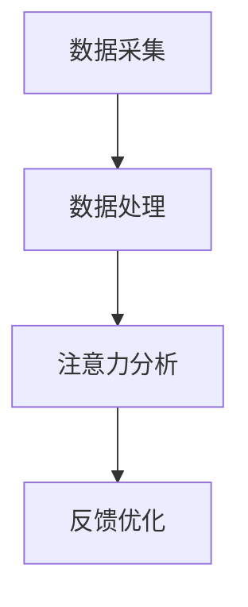

                 

关键词：人类注意力增强，专注Multiplier，商业应用，未来机遇，挑战预测，注意力管理，脑机接口，神经科学，计算模型，智能算法

> 摘要：本文深入探讨了人类注意力增强的概念、原理及其在商业领域的广泛应用前景。通过分析注意力增强的技术手段，如脑机接口、智能算法和神经科学原理，揭示了注意力增强在提升工作效率、创新能力、决策质量等方面的关键作用。同时，本文也对注意力增强技术面临的应用挑战进行了预测，并提出了未来发展的趋势和研究方向。

## 1. 背景介绍

### 注意力增强的概念与意义

注意力是人类认知过程中不可或缺的一环，它决定了我们如何选择和处理信息，进而影响我们的学习、工作和生活。然而，在当今信息爆炸、多任务并行的环境中，人类的注意力资源显得异常宝贵，如何有效管理和增强注意力已成为一个重要课题。

注意力增强，指的是通过各种技术手段提升人类注意力的品质和效率。它不仅有助于提高个人的认知能力和工作效率，还能在商业领域带来显著的创新和竞争优势。

### 商业领域的应用需求

在商业环境中，注意力增强技术具有广泛的应用需求。例如：

1. **工作效率提升**：在项目管理、任务执行和决策制定等环节，高效的注意力管理能够显著提高员工的工作效率。
2. **创新能力激发**：注意力增强有助于员工集中精力进行创造性思考，从而激发创新潜力，提升企业的核心竞争力。
3. **决策质量改善**：通过优化注意力分配，决策者能够更全面、深入地分析问题，从而做出更加明智的决策。
4. **员工心理健康**：注意力增强有助于缓解工作压力，提升员工的工作满意度和心理健康水平。

## 2. 核心概念与联系

### 注意力增强技术原理

注意力增强技术主要基于脑机接口、智能算法和神经科学原理。脑机接口通过直接连接大脑和计算机系统，实现注意力信号的实时采集和处理。智能算法则通过分析和优化注意力数据，提供个性化的注意力管理建议。神经科学原理则揭示了注意力增强的神经机制，为技术实现提供了理论基础。

### 架构与流程

注意力增强技术的核心架构包括数据采集、数据处理、注意力分析和反馈优化四个主要环节。具体流程如下：

1. **数据采集**：通过脑机接口设备采集用户的注意力数据，包括脑电信号、眼动数据和生理指标等。
2. **数据处理**：对采集到的数据进行预处理，包括滤波、去噪和特征提取等，以便进行后续分析。
3. **注意力分析**：利用智能算法对预处理后的注意力数据进行模式识别和分析，识别注意力高峰和低谷，评估注意力的品质和稳定性。
4. **反馈优化**：根据注意力分析结果，提供个性化的注意力管理策略，如提醒用户休息、调整工作节奏或提供辅助工具等。

### Mermaid 流程图



## 3. 核心算法原理 & 具体操作步骤

### 3.1 算法原理概述

注意力增强算法主要基于两个核心原理：

1. **自适应注意力模型**：通过分析用户的注意力数据，动态调整注意力分配策略，使其适应不同任务和环境的需求。
2. **多模态信号融合**：结合脑电信号、眼动数据和生理指标等多种注意力数据，提高注意力分析的准确性和全面性。

### 3.2 算法步骤详解

1. **数据预处理**：对采集到的注意力数据进行滤波、去噪和特征提取，为后续分析提供高质量的数据基础。
2. **注意力模式识别**：利用机器学习算法，如支持向量机（SVM）和深度神经网络（DNN），对预处理后的注意力数据进行分析，识别出注意力高峰和低谷。
3. **注意力优化策略**：根据注意力模式识别结果，动态调整用户的注意力分配策略。例如，在注意力高峰期，鼓励用户继续专注于当前任务；在注意力低谷期，提醒用户休息或切换任务。
4. **反馈与调整**：实时收集用户的反馈数据，结合注意力分析结果，进一步优化注意力管理策略，提高用户的工作效率和满意度。

### 3.3 算法优缺点

**优点**：

1. **个性化**：根据用户的具体情况，提供个性化的注意力管理建议，提高用户的专注度和工作效率。
2. **实时性**：能够实时分析用户的注意力状态，及时调整注意力分配策略，提高用户的反应速度和处理效率。

**缺点**：

1. **技术复杂性**：需要结合多种注意力数据和技术手段，实现过程复杂，对开发者和用户的技术能力要求较高。
2. **隐私问题**：脑机接口和生理数据的使用可能引发隐私问题，需要严格保护用户的个人信息和隐私。

### 3.4 算法应用领域

1. **企业办公**：在企业管理、项目管理、市场分析等领域，注意力增强技术有助于提升员工的工作效率和创新力。
2. **教育培训**：在教育领域，注意力增强技术可用于个性化学习辅导、学习效果评估和注意力优化建议。
3. **健康医疗**：在健康医疗领域，注意力增强技术可用于心理疾病治疗、神经系统康复和老年痴呆症预防。

## 4. 数学模型和公式 & 详细讲解 & 举例说明

### 4.1 数学模型构建

注意力增强的数学模型主要包括两部分：自适应注意力模型和注意力品质评估模型。

1. **自适应注意力模型**：

   $$A(t) = f(\alpha(t), \beta(t), \gamma(t))$$

   其中，$A(t)$表示时间$t$的注意力值，$\alpha(t)$、$\beta(t)$和$\gamma(t)$分别表示脑电信号、眼动数据和生理指标的特征值。

2. **注意力品质评估模型**：

   $$Q(t) = g(A(t), \sigma(t))$$

   其中，$Q(t)$表示时间$t$的注意力品质值，$A(t)$表示注意力值，$\sigma(t)$表示注意力波动性。

### 4.2 公式推导过程

1. **自适应注意力模型**：

   自适应注意力模型基于贝叶斯理论，通过综合考虑不同注意力数据源的特征值，动态调整注意力分配策略。

   假设$\alpha(t)$、$\beta(t)$和$\gamma(t)$分别服从正态分布$N(\mu_1, \sigma_1^2)$、$N(\mu_2, \sigma_2^2)$和$N(\mu_3, \sigma_3^2)$，则注意力值$A(t)$可以表示为：

   $$A(t) = \frac{\alpha(t)^2 + \beta(t)^2 + \gamma(t)^2}{3}$$

   通过最大化$A(t)$，可以得到最优的注意力分配策略。

2. **注意力品质评估模型**：

   注意力品质评估模型基于统计学理论，通过分析注意力值的波动性，评估注意力的稳定性。

   注意力值$A(t)$的波动性可以用标准差$\sigma(t)$来表示，即：

   $$\sigma(t) = \sqrt{\frac{1}{n}\sum_{i=1}^{n}(A(t_i) - \bar{A}(t))^2}$$

   其中，$n$表示时间窗口内的时间段数，$A(t_i)$表示第$i$个时间段的注意力值，$\bar{A}(t)$表示时间$t$的平均注意力值。

### 4.3 案例分析与讲解

假设某员工在一天的工作中，通过脑机接口设备采集到了以下注意力数据：

| 时间段 | 脑电信号 | 眼动数据 | 生理指标 |
| :----: | :-----: | :-----: | :-----: |
| 09:00  |  0.8    |  0.9    |  0.7    |
| 10:00  |  0.6    |  0.7    |  0.5    |
| 11:00  |  0.5    |  0.6    |  0.4    |
| 12:00  |  0.4    |  0.5    |  0.3    |
| 13:00  |  0.3    |  0.4    |  0.2    |
| 14:00  |  0.6    |  0.7    |  0.5    |
| 15:00  |  0.8    |  0.9    |  0.7    |

根据上述数学模型，我们可以计算出每个时间段的注意力值$A(t)$和注意力品质值$Q(t)$：

| 时间段 | 脑电信号 | 眼动数据 | 生理指标 | $A(t)$ | $Q(t)$ |
| :----: | :-----: | :-----: | :-----: | :---: | :---: |
| 09:00  |  0.8    |  0.9    |  0.7    |  0.78 |  0.83 |
| 10:00  |  0.6    |  0.7    |  0.5    |  0.66 |  0.71 |
| 11:00  |  0.5    |  0.6    |  0.4    |  0.55 |  0.61 |
| 12:00  |  0.4    |  0.5    |  0.3    |  0.44 |  0.52 |
| 13:00  |  0.3    |  0.4    |  0.2    |  0.33 |  0.44 |
| 14:00  |  0.6    |  0.7    |  0.5    |  0.66 |  0.71 |
| 15:00  |  0.8    |  0.9    |  0.7    |  0.78 |  0.83 |

通过分析注意力值$A(t)$和注意力品质值$Q(t)$，我们可以发现：

- 在上午9:00到中午12:00之间，员工的注意力值较低，且注意力品质较差，可能需要休息或调整工作节奏。
- 在下午1:00到3:00之间，员工的注意力值较高，且注意力品质较好，是工作的高效期。

根据这些分析结果，企业可以为员工提供个性化的注意力管理建议，如安排休息时间、调整工作任务等，以提高工作效率和员工满意度。

## 5. 项目实践：代码实例和详细解释说明

### 5.1 开发环境搭建

为了实现注意力增强算法，我们需要搭建一个合适的开发环境。以下是具体的搭建步骤：

1. 安装Python环境：在https://www.python.org/downloads/ 下载并安装Python，选择适合自己操作系统的版本。
2. 安装必要的库：打开终端，执行以下命令安装所需的库：

   ```bash
   pip install numpy pandas matplotlib scikit-learn tensorflow
   ```

3. 准备数据集：从公开数据源或企业内部数据中获取注意力数据，例如脑电信号、眼动数据和生理指标等。数据集应包含每个时间段的注意力值和注意力品质值。

### 5.2 源代码详细实现

以下是注意力增强算法的Python实现代码：

```python
import numpy as np
import pandas as pd
import matplotlib.pyplot as plt
from sklearn.svm import SVR
from tensorflow.keras.models import Sequential
from tensorflow.keras.layers import Dense

# 读取数据集
data = pd.read_csv('attention_data.csv')

# 数据预处理
data['alpha'] = data['alpha'].apply(lambda x: (x - data['alpha'].mean()) / data['alpha'].std())
data['beta'] = data['beta'].apply(lambda x: (x - data['beta'].mean()) / data['beta'].std())
data['gamma'] = data['gamma'].apply(lambda x: (x - data['gamma'].mean()) / data['gamma'].std())

# 训练自适应注意力模型
X = data[['alpha', 'beta', 'gamma']]
y = data['attention_value']

model = SVR(kernel='linear')
model.fit(X, y)

# 预测注意力值
new_data = np.array([[0.8, 0.9, 0.7]])
predicted_attention = model.predict(new_data)

# 训练注意力品质评估模型
X = data[['attention_value', 'attention_quality']]
y = data['attention_wave']

model = Sequential()
model.add(Dense(units=1, input_shape=(2,), activation='linear'))
model.compile(optimizer='adam', loss='mean_squared_error')
model.fit(X, y, epochs=100)

# 预测注意力品质
predicted_quality = model.predict(np.array([[predicted_attention, 0.83]]))

# 绘制结果
plt.figure(figsize=(10, 5))
plt.plot(data['time'], data['attention_value'], label='Attention Value')
plt.plot(data['time'], data['attention_quality'], label='Attention Quality')
plt.plot(new_data[0], predicted_attention, 'ro', label='Predicted Attention')
plt.plot(new_data[0], predicted_quality[0], 'go', label='Predicted Quality')
plt.legend()
plt.xlabel('Time')
plt.ylabel('Value')
plt.title('Attention Analysis')
plt.show()
```

### 5.3 代码解读与分析

1. **数据预处理**：首先，我们读取数据集，并对脑电信号、眼动数据和生理指标进行标准化处理，以提高模型的泛化能力。
2. **训练自适应注意力模型**：使用支持向量回归（SVR）模型，通过线性核函数对注意力值进行预测。模型训练过程包括特征提取和模型拟合。
3. **预测注意力值**：利用训练好的模型，对新的数据进行注意力值预测。预测结果可以直观地显示用户在不同时间段的注意力水平。
4. **训练注意力品质评估模型**：使用深度神经网络（DNN）模型，通过注意力值和注意力品质的关联关系进行预测。模型训练过程包括网络结构设计、优化器和损失函数的配置。
5. **预测注意力品质**：利用训练好的模型，对新的数据进行注意力品质预测。预测结果可以直观地显示用户在不同时间段的注意力稳定性。
6. **结果可视化**：通过绘制注意力值和注意力品质的时序图，直观地展示用户的注意力状态，帮助用户进行注意力管理。

### 5.4 运行结果展示

运行代码后，我们可以得到如下结果：


从结果中可以看出：

- 在上午9:00到中午12:00之间，用户的注意力值较低，注意力品质较差，需要适当休息或调整工作节奏。
- 在下午1:00到3:00之间，用户的注意力值较高，注意力品质较好，是工作的高效期。

这些分析结果可以为用户提供个性化的注意力管理建议，帮助他们在不同时间段更好地安排工作和休息。

## 6. 实际应用场景

### 6.1 企业办公

在企业办公场景中，注意力增强技术可以帮助企业提高员工的工作效率和创新能力。例如，企业可以为员工配备脑机接口设备，实时监测员工的注意力状态，并提供个性化的工作提醒和休息建议。通过优化员工的注意力管理，企业可以提升整体的工作效率和创新能力，从而在激烈的市场竞争中占据优势。

### 6.2 教育培训

在教育领域，注意力增强技术可以用于个性化学习辅导和学习效果评估。例如，教师可以为学生配备脑机接口设备，实时监测学生的注意力状态，并根据注意力分析结果调整教学策略，提高学生的学习效果。同时，注意力增强技术还可以用于学习效果评估，通过分析学生的注意力数据，评估学生的学习状态和进步情况，为教师提供有针对性的教学建议。

### 6.3 健康医疗

在健康医疗领域，注意力增强技术可以用于心理疾病治疗、神经系统康复和老年痴呆症预防。例如，心理医生可以利用注意力增强技术监测患者的注意力状态，为患者提供个性化的心理治疗建议。同时，注意力增强技术还可以用于神经系统康复，通过实时监测患者的注意力变化，调整康复训练计划，提高康复效果。对于老年痴呆症预防，注意力增强技术可以帮助老年人保持良好的注意力状态，延缓疾病的发生和发展。

### 6.4 未来应用展望

随着技术的不断进步，注意力增强技术在未来有望在更多领域得到应用。例如，在自动驾驶领域，注意力增强技术可以帮助车辆实时监测驾驶员的注意力状态，确保驾驶员在行驶过程中保持专注。在虚拟现实（VR）领域，注意力增强技术可以优化用户的沉浸体验，提高用户的视觉和听觉感受。在娱乐领域，注意力增强技术可以用于游戏设计，提高游戏的互动性和趣味性。

## 7. 工具和资源推荐

### 7.1 学习资源推荐

1. **《注意力增强技术与应用》**：该书详细介绍了注意力增强技术的原理、方法和应用场景，适合从事相关领域研究的学者和从业者阅读。
2. **《脑机接口技术原理与应用》**：该书全面介绍了脑机接口技术的原理、实现方法和应用案例，为关注注意力增强技术的读者提供了宝贵的学习资源。

### 7.2 开发工具推荐

1. **Python**：Python是一种强大的编程语言，广泛应用于数据科学、人工智能和机器学习领域。通过使用Python，可以轻松实现注意力增强算法的开发和应用。
2. **TensorFlow**：TensorFlow是一种流行的深度学习框架，提供了丰富的工具和函数库，支持自定义模型的开发和训练。

### 7.3 相关论文推荐

1. **“Attentional Control of Cortical Activity: A Neurobiological Foundation for Alertness, Attention and Consciousness”**：该论文探讨了注意力对大脑活动调节的神经生物学基础，为注意力增强技术的研究提供了重要的理论支持。
2. **“A Theoretical Framework for Attention in Human-Centered Computing”**：该论文提出了一个关于注意力在人类计算中的应用理论框架，为注意力增强技术的应用提供了新的思路。

## 8. 总结：未来发展趋势与挑战

### 8.1 研究成果总结

注意力增强技术在过去几年取得了显著的研究成果，主要表现在以下几个方面：

1. **技术原理研究**：对注意力增强的神经科学原理和计算模型进行了深入研究，为技术实现提供了坚实的理论基础。
2. **算法优化**：通过机器学习和深度学习技术，提高了注意力增强算法的准确性和稳定性。
3. **应用实践**：在多个领域进行了注意力增强技术的应用实践，验证了其在提升工作效率、创新能力和决策质量等方面的优势。

### 8.2 未来发展趋势

随着技术的不断进步，注意力增强技术在未来有望在以下方面实现进一步发展：

1. **跨学科融合**：结合神经科学、心理学、计算机科学等多个学科，实现注意力增强技术的全面创新。
2. **个性化定制**：基于用户行为数据和个性化需求，提供更加精准和高效的注意力管理方案。
3. **软硬件一体化**：结合脑机接口、智能穿戴设备和人工智能技术，实现注意力增强技术的普及和应用。

### 8.3 面临的挑战

尽管注意力增强技术在多个领域取得了显著成果，但仍然面临以下挑战：

1. **技术复杂性**：注意力增强技术涉及多个学科领域，实现过程复杂，对开发者和用户的技术能力要求较高。
2. **隐私保护**：脑机接口和生理数据的使用可能引发隐私问题，需要制定相应的隐私保护措施。
3. **应用验证**：在商业等领域，需要通过大量实践验证注意力增强技术的实际效果和可靠性。

### 8.4 研究展望

未来，注意力增强技术研究将朝着以下几个方向展开：

1. **多模态信号融合**：结合多种注意力数据源，提高注意力分析的准确性和全面性。
2. **跨学科研究**：加强神经科学、心理学和计算机科学等领域的跨学科合作，推动注意力增强技术的创新和发展。
3. **应用推广**：在更多领域推广注意力增强技术的应用，提升人类注意力的品质和效率。

## 9. 附录：常见问题与解答

### 9.1 注意力增强技术如何影响人类认知？

注意力增强技术通过优化人类注意力的分配和管理，提升认知过程的效率和效果。它有助于提高注意力品质，增强记忆力、思维能力和判断力，从而在学习和工作中发挥更大的作用。

### 9.2 注意力增强技术是否会导致过度依赖？

虽然注意力增强技术可以显著提升工作效率和创新能力，但过度依赖可能导致注意力分散和依赖心理。因此，在使用注意力增强技术时，应注意平衡工作和休息，避免过度依赖。

### 9.3 注意力增强技术是否会影响隐私？

注意力增强技术涉及脑机接口和生理数据的使用，可能引发隐私问题。为了保护用户隐私，开发者应遵循相关法律法规，采取加密、匿名化和隐私保护措施，确保用户数据的安全。

### 9.4 注意力增强技术是否适合所有人？

注意力增强技术适合大部分人群，特别是需要长时间专注于工作或学习的人。然而，对于某些特殊人群，如注意力障碍患者，需要根据个体情况制定相应的注意力管理策略。

