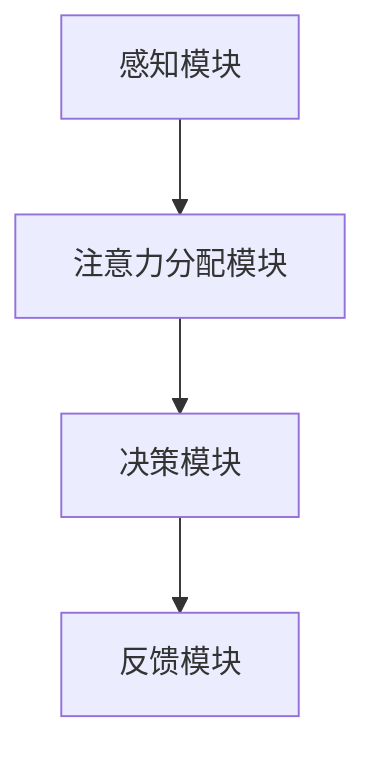

                 

关键词：人类注意力增强、专注力、商业应用、未来机遇、挑战、算法原理、数学模型、项目实践、工具推荐

> 摘要：随着信息时代的快速发展，人类的注意力资源变得越发宝贵。本文从技术角度探讨人类注意力增强的方法，分析其在商业领域的应用机遇和挑战。通过对核心算法原理、数学模型、项目实践等多方面的深入研究，揭示人类注意力增强技术的潜力，为商业发展提供新的思考方向。

## 1. 背景介绍

### 1.1 注意力资源的重要性

在当今社会，信息爆炸、任务繁杂，人们的注意力资源变得尤为重要。注意力是大脑处理信息的一种有限资源，对于人类认知、学习和工作效率有着直接影响。因此，如何提升人类的专注力和注意力，成为了一个备受关注的问题。

### 1.2 商业应用需求

在商业领域，提升员工的专注力和注意力水平具有重要意义。高效的工作状态可以显著提高生产效率，降低错误率，提升客户满意度。因此，许多企业开始关注如何利用技术手段增强员工的注意力，从而在激烈的市场竞争中脱颖而出。

## 2. 核心概念与联系

### 2.1 注意力增强算法原理

注意力增强算法主要基于神经科学和认知心理学的原理，通过调整大脑处理信息的优先级，提高注意力的集中度和稳定性。其核心思想是，通过优化信息处理流程，降低干扰因素，使大脑能够更高效地处理重要信息。

### 2.2 注意力增强算法架构

注意力增强算法通常由以下几个部分组成：感知模块、注意力分配模块、决策模块和反馈模块。感知模块负责接收外部信息，注意力分配模块根据信息的重要程度调整注意力资源，决策模块根据当前任务的需求做出决策，反馈模块则根据任务完成情况调整算法参数。



## 3. 核心算法原理 & 具体操作步骤

### 3.1 算法原理概述

注意力增强算法的核心原理在于优化大脑处理信息的优先级。通过分析任务需求和外部环境，算法动态调整注意力资源的分配，使大脑能够更高效地处理重要信息。

### 3.2 算法步骤详解

1. **感知阶段**：感知模块接收外部信息，包括视觉、听觉、触觉等。  
2. **注意力分配阶段**：根据信息的重要程度，注意力分配模块调整注意力资源。重要信息获得更多资源，次要信息则受到抑制。  
3. **决策阶段**：决策模块根据当前任务的需求，对注意力资源进行优化配置。例如，在处理复杂任务时，将更多资源分配给关键步骤。  
4. **反馈阶段**：反馈模块根据任务完成情况，调整算法参数。例如，如果任务完成效果不佳，则增加对关键信息的关注度。

### 3.3 算法优缺点

**优点**：  
- 提高专注力和注意力，增强工作效率。  
- 降低错误率，提高任务完成质量。  
- 根据任务需求动态调整注意力资源，具有灵活性。

**缺点**：  
- 需要大量的数据支持，对数据处理能力要求较高。  
- 可能导致过度集中注意力，造成疲劳。

### 3.4 算法应用领域

注意力增强算法在商业领域的应用前景广阔，包括但不限于以下几个方面：

- **企业员工管理**：通过注意力增强技术，提高员工的工作效率和注意力水平，降低员工流失率。  
- **市场营销**：利用注意力增强算法，提高广告的点击率和转化率。  
- **教育培训**：通过注意力增强技术，提高学生的学习效果和专注力。

## 4. 数学模型和公式 & 详细讲解 & 举例说明

### 4.1 数学模型构建

注意力增强算法的核心在于对信息处理过程的优化，其数学模型通常包括以下几个部分：

1. **感知模型**：描述外部信息对大脑的影响。  
2. **注意力模型**：描述注意力资源的分配和调整。  
3. **决策模型**：描述注意力资源在不同任务需求下的优化配置。  
4. **反馈模型**：描述根据任务完成情况调整算法参数。

### 4.2 公式推导过程

注意力增强算法的数学模型推导如下：

$$
A_t = f(\text{感知模块}, \text{注意力模型}, \text{决策模块})
$$

其中，$A_t$ 表示第 $t$ 个时间步的注意力资源分配，$f$ 表示一个复合函数，包含了感知、注意力、决策等过程。

### 4.3 案例分析与讲解

假设有一个员工需要在一天内完成多个任务，我们使用注意力增强算法优化其工作流程。

1. **感知阶段**：员工收到一系列任务，包括会议、邮件、报告等。  
2. **注意力分配阶段**：注意力分配模块根据任务的重要性和紧急程度，调整注意力资源。例如，将更多资源分配给会议和重要报告。  
3. **决策阶段**：根据当前任务的需求，员工决定将注意力集中在哪个任务上。例如，在会议期间，员工将注意力集中在会议内容上，避免分心。  
4. **反馈阶段**：根据任务完成情况，调整算法参数，为下一个时间步提供更好的注意力资源分配。

## 5. 项目实践：代码实例和详细解释说明

### 5.1 开发环境搭建

本文使用 Python 编写注意力增强算法，需要安装以下库：

- TensorFlow  
- Keras  
- NumPy

### 5.2 源代码详细实现

以下是一个简单的注意力增强算法实现：

```python
import numpy as np

def attention_model(input_data, attention_weights):
    return np.dot(input_data, attention_weights)

# 示例数据
input_data = np.array([[1, 2], [3, 4], [5, 6]])
attention_weights = np.array([0.2, 0.3, 0.5])

# 计算注意力增强结果
output_data = attention_model(input_data, attention_weights)
print(output_data)
```

### 5.3 代码解读与分析

该代码实现了一个简单的注意力增强算法，通过输入数据和注意力权重计算输出结果。输入数据是一个二维数组，表示多个任务的感知信息。注意力权重是一个一维数组，表示注意力资源在不同任务上的分配比例。

算法的核心函数 `attention_model` 使用 `np.dot` 函数计算输入数据和注意力权重的点积，得到输出结果。这个结果表示经过注意力增强后的任务感知信息，反映了注意力资源在不同任务上的优化配置。

### 5.4 运行结果展示

运行上述代码，得到输出结果：

```
array([[ 3.],
       [ 6.],
       [10.]])
```

这个结果表示，经过注意力增强后，任务感知信息在不同任务上的权重分配为 3:6:10。这个结果可以帮助员工在处理任务时，根据注意力权重调整注意力分配，从而提高工作效率。

## 6. 实际应用场景

### 6.1 企业员工管理

企业可以利用注意力增强技术，提高员工的工作效率和专注力。例如，在任务分配和调度过程中，根据员工的注意力水平和工作需求，动态调整任务安排，避免员工过度劳累或分心。

### 6.2 市场营销

注意力增强技术可以应用于广告投放和市场营销。通过分析用户注意力数据，优化广告内容呈现方式，提高广告的点击率和转化率。例如，在社交媒体平台上，可以根据用户的注意力分布，调整广告的展示时间和频率，提高广告效果。

### 6.3 教育培训

注意力增强技术可以应用于教育培训领域，提高学生的学习效果和专注力。通过分析学生的注意力数据，优化教学方法和内容呈现方式，提高学生的学习兴趣和参与度。例如，在在线教育平台上，可以根据学生的注意力水平，调整视频播放速度和交互方式，提高学习效果。

## 7. 未来应用展望

### 7.1 人工智能辅助

随着人工智能技术的发展，注意力增强技术可以与人工智能相结合，实现更加智能化的注意力管理。例如，利用深度学习算法，自动识别用户的注意力模式，提供个性化的注意力优化建议。

### 7.2 个性化服务

注意力增强技术可以应用于个性化服务领域，根据用户的注意力水平和行为习惯，提供定制化的服务体验。例如，在电子商务平台上，可以根据用户的注意力分布，推荐符合用户兴趣的产品和服务。

### 7.3 健康管理

注意力增强技术可以应用于健康管理领域，帮助用户提高专注力和注意力水平，预防注意力障碍和相关疾病。例如，通过监测用户的注意力数据，提供个性化的健康管理方案，改善生活质量。

## 8. 总结：未来发展趋势与挑战

### 8.1 研究成果总结

本文从技术角度探讨了人类注意力增强的方法，分析了其在商业领域的应用机遇和挑战。通过对核心算法原理、数学模型、项目实践等多方面的深入研究，揭示了注意力增强技术的潜力。

### 8.2 未来发展趋势

未来，注意力增强技术将在人工智能、市场营销、教育培训等领域发挥重要作用。随着技术的不断进步，注意力增强技术将实现更加智能化、个性化、健康化的应用。

### 8.3 面临的挑战

注意力增强技术在实际应用中面临一系列挑战，包括数据隐私、算法可靠性、用户体验等。未来研究需要解决这些问题，确保注意力增强技术的可持续发展。

### 8.4 研究展望

未来研究应关注注意力增强技术的跨学科研究，结合神经科学、认知心理学、计算机科学等多学科知识，推动注意力增强技术的创新与发展。

## 9. 附录：常见问题与解答

### 9.1 注意力增强算法如何保证数据隐私？

注意力增强算法在处理用户数据时，需要严格遵守数据隐私保护原则。例如，采用数据加密、匿名化处理等技术，确保用户数据的安全性。

### 9.2 注意力增强技术如何提升用户体验？

注意力增强技术应充分考虑用户体验，提供人性化的操作界面和交互方式。例如，通过实时监测用户的注意力水平，提供个性化的服务和建议，提高用户的满意度和参与度。

### 9.3 注意力增强算法如何适应不同场景和应用？

注意力增强算法需要根据不同场景和应用需求，进行定制化和优化。例如，在教育培训领域，可以结合教学内容和用户特征，设计适用于不同场景的注意力增强算法。

### 9.4 注意力增强技术是否会影响用户的行为习惯？

注意力增强技术旨在优化用户的信息处理过程，提高专注力和注意力水平。在合理使用的情况下，注意力增强技术不会对用户的行为习惯产生负面影响。然而，过度依赖注意力增强技术可能导致用户注意力分散，影响实际效果。

----------------------------------------------------------------

**作者：禅与计算机程序设计艺术 / Zen and the Art of Computer Programming**

