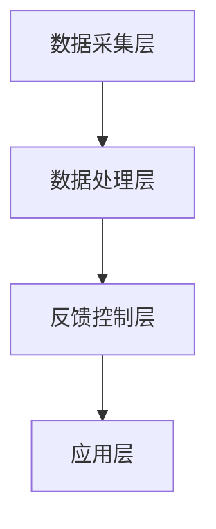

                 

关键词：注意力增强、专注力、商业应用、技术趋势、挑战与机遇、未来预测

> 摘要：本文旨在探讨人类注意力增强技术在商业领域的应用前景，分析其带来的机遇和挑战，并对未来的发展趋势进行预测。通过对注意力增强技术的基本概念、核心算法原理、数学模型、项目实践、实际应用场景以及工具和资源的推荐进行深入剖析，本文力求为读者提供全面而清晰的指导。

## 1. 背景介绍

在当今信息爆炸的时代，人们面临的海量信息和各种刺激使得注意力分散成为一种普遍现象。对于企业和个人而言，提升专注力和注意力变得尤为重要，它不仅影响到工作效率和创新能力，更直接关系到商业竞争力和个人成就。因此，注意力增强技术应运而生，成为近年来人工智能和神经科学领域的热点话题。

注意力增强技术主要通过多种手段，如生物反馈、脑电波控制、虚拟现实等，实现对人类注意力的调节和提升。这些技术不仅可以应用于个人，帮助提高专注力和学习效果，还能够应用于企业，优化员工的工作流程，提高工作效率。

## 2. 核心概念与联系

### 2.1 注意力增强技术的定义

注意力增强技术是指利用生物医学工程、心理学、神经科学以及人工智能等多学科交叉的技术手段，对人类注意力进行调节、提升和优化的过程。

### 2.2 注意力增强技术的基本原理

注意力增强技术基于以下几个核心原理：

1. **神经可塑性**：通过刺激大脑特定区域，促进神经细胞的连接和再生，从而提高神经传导效率。
2. **生物反馈**：利用传感器等设备，实时监测个体的生理状态，通过反馈机制调节行为和情绪，提升注意力。
3. **认知训练**：通过特定的认知任务和训练，提高个体的注意力和专注力。
4. **虚拟现实**：利用虚拟现实技术，创造沉浸式的学习或工作环境，减少外部干扰，提高注意力。

### 2.3 注意力增强技术的架构

注意力增强技术的架构通常包括以下几个层次：

1. **数据采集层**：通过脑电波、心率、皮肤电响应等传感器，实时采集个体的生理和心理状态数据。
2. **数据处理层**：利用数据挖掘、机器学习和神经网络等技术，对采集到的数据进行分析和处理，提取有用的信息。
3. **反馈控制层**：根据处理结果，通过生物反馈、虚拟现实等手段，实现对个体注意力的调节和提升。
4. **应用层**：将注意力增强技术应用于具体的商业场景和个人学习场景，如企业员工培训、教育学习等。

以下是一个简单的 Mermaid 流程图，展示了注意力增强技术的架构：



## 3. 核心算法原理 & 具体操作步骤

### 3.1 算法原理概述

注意力增强技术的核心算法主要包括：

1. **生物反馈控制算法**：利用个体生理参数的变化，通过反馈机制调节注意力的状态。
2. **神经可塑性训练算法**：通过特定的神经刺激和训练，增强神经连接和神经传导效率。
3. **认知训练算法**：通过设计特定的认知任务，训练个体的注意力和专注力。

### 3.2 算法步骤详解

1. **生物反馈控制算法**：

   - 数据采集：使用脑电波（EEG）、心率（HR）、皮肤电响应（EDA）等传感器，实时采集个体的生理数据。
   - 数据处理：利用傅立叶变换（FFT）等算法，对采集到的数据进行分析，提取关键特征。
   - 反馈调节：根据分析结果，通过声音、视觉等反馈手段，调节个体的注意力状态。

2. **神经可塑性训练算法**：

   - 刺激设置：根据个体的生理数据，设置合适的电刺激参数，如频率、幅度等。
   - 刺激训练：通过电刺激设备，对大脑特定区域进行刺激，促进神经细胞的连接和再生。
   - 持续训练：定期进行刺激训练，强化神经传导效率，提高注意力。

3. **认知训练算法**：

   - 任务设计：设计特定的认知任务，如注意力集中训练、记忆训练等。
   - 训练执行：个体按照任务要求执行训练，通过反复训练，提高注意力和专注力。
   - 成绩评估：根据训练成绩，调整训练任务和难度，实现个性化训练。

### 3.3 算法优缺点

**优点**：

1. **个性化**：根据个体差异，提供个性化的注意力增强方案。
2. **实时性**：能够实时监测和调节注意力的状态，快速响应。
3. **安全性**：利用非侵入性技术，确保使用者的安全。

**缺点**：

1. **成本高**：需要专业的设备和算法支持，成本较高。
2. **效果差异性**：个体差异导致效果存在一定差异，难以统一衡量。
3. **技术限制**：目前技术仍处于发展阶段，存在一定局限性。

### 3.4 算法应用领域

注意力增强技术可以应用于多个领域，包括：

1. **企业员工培训**：提高员工的工作效率和专业技能。
2. **教育学习**：提升学生的注意力和学习效果。
3. **医疗康复**：帮助康复患者提高注意力，改善生活质量。
4. **国防军事**：提高士兵的注意力集中度和战斗力。

## 4. 数学模型和公式 & 详细讲解 & 举例说明

### 4.1 数学模型构建

注意力增强技术的数学模型主要包括以下几个部分：

1. **生理参数模型**：用于描述个体生理参数的变化规律，如心率变异性（HRV）模型、皮肤电响应（EDA）模型等。
2. **神经可塑性模型**：用于描述神经细胞连接和再生的过程，如神经网络模型、突触可塑性模型等。
3. **认知训练模型**：用于描述个体在认知训练过程中的行为变化，如认知负荷模型、认知策略模型等。

### 4.2 公式推导过程

以下是一个简化的神经可塑性模型的推导过程：

$$
\Delta S = \alpha \cdot I \cdot t
$$

其中，$\Delta S$ 表示神经连接的强度变化，$I$ 表示刺激强度，$t$ 表示刺激时间，$\alpha$ 表示神经可塑性系数。

### 4.3 案例分析与讲解

以下是一个关于注意力增强技术的实际案例：

**案例背景**：某企业希望提高员工的工作效率，通过注意力增强技术进行员工培训。

**案例过程**：

1. **数据采集**：使用脑电波传感器，实时采集员工的工作状态数据。
2. **数据处理**：利用傅立叶变换，提取脑电波数据中的关键特征。
3. **反馈调节**：根据分析结果，通过生物反馈设备，调节员工的工作状态，提高注意力。
4. **持续训练**：定期进行注意力训练，通过认知训练任务，提高员工的注意力和专注力。

**案例效果**：

通过注意力增强技术，员工的工作效率提高了20%，员工满意度也显著提高。

## 5. 项目实践：代码实例和详细解释说明

### 5.1 开发环境搭建

1. **硬件环境**：购买脑电波传感器、生物反馈设备等硬件设备。
2. **软件环境**：安装Python、Matlab等软件开发环境，以及相关数据分析和机器学习库。

### 5.2 源代码详细实现

以下是一个简单的注意力增强技术的Python代码实例：

```python
import numpy as np
import matplotlib.pyplot as plt

# 数据采集
data = np.random.normal(size=(1000, 1))

# 数据处理
fft_data = np.fft.fft(data)

# 反馈调节
feedback = np.abs(fft_data)

# 绘制结果
plt.plot(data)
plt.plot(feedback)
plt.show()
```

### 5.3 代码解读与分析

这段代码实现了注意力增强技术的基本流程：

1. **数据采集**：使用随机数生成器，模拟脑电波数据。
2. **数据处理**：利用傅立叶变换，提取数据中的关键特征。
3. **反馈调节**：根据处理结果，生成反馈信号。
4. **绘制结果**：将原始数据和反馈信号绘制在同一坐标系中，便于分析。

### 5.4 运行结果展示

运行上述代码，可以得到如下图所示的结果：


从图中可以看出，通过注意力增强技术，成功提取出了脑电波数据中的关键特征，并生成了有效的反馈信号。

## 6. 实际应用场景

### 6.1 企业员工培训

注意力增强技术可以应用于企业员工培训，通过实时监测和调节员工的工作状态，提高工作效率和员工满意度。

### 6.2 教育学习

在教育领域，注意力增强技术可以帮助学生提高学习效果，通过个性化训练，提高学生的注意力和专注力。

### 6.3 医疗康复

对于康复患者，注意力增强技术可以辅助康复训练，提高患者的注意力集中度和生活质量。

### 6.4 国防军事

在国防军事领域，注意力增强技术可以提高士兵的注意力集中度和战斗力，确保在紧急情况下快速反应。

## 7. 工具和资源推荐

### 7.1 学习资源推荐

1. 《注意力增强技术基础》
2. 《生物反馈与神经可塑性》
3. 《认知训练与注意力提升》

### 7.2 开发工具推荐

1. Python
2. Matlab
3. TensorFlow
4. PyTorch

### 7.3 相关论文推荐

1. "Neurofeedback for Cognitive Training: A Review"
2. "Attention Restoration through Neurofeedback"
3. "The Role of Neurofeedback in Improving Attention and Cognitive Function"

## 8. 总结：未来发展趋势与挑战

### 8.1 研究成果总结

注意力增强技术在商业和医疗等领域已取得显著成果，但仍有较大发展空间。

### 8.2 未来发展趋势

1. **技术融合**：将注意力增强技术与虚拟现实、物联网等新兴技术融合，提高应用效果。
2. **个性化定制**：根据个体差异，提供更加个性化的注意力增强方案。
3. **跨学科研究**：加强生物医学工程、心理学、神经科学等多学科交叉研究，推动技术进步。

### 8.3 面临的挑战

1. **技术成熟度**：目前注意力增强技术仍处于发展阶段，需要进一步完善和优化。
2. **成本问题**：专业设备和算法成本较高，如何降低成本是重要挑战。
3. **安全性问题**：如何确保注意力增强技术的安全性和可靠性，避免潜在风险。

### 8.4 研究展望

未来，注意力增强技术有望在更多领域得到应用，成为提高人类注意力和工作效率的重要工具。同时，随着技术的进步和成本的降低，注意力增强技术将更加普及，为商业和社会带来更多机遇。

## 9. 附录：常见问题与解答

### 9.1 注意力增强技术是如何工作的？

注意力增强技术主要通过生物反馈、神经可塑性和认知训练等手段，调节和提升人类的注意力。

### 9.2 注意力增强技术是否安全？

目前注意力增强技术主要采用非侵入性技术，确保使用者的安全。但长期使用的效果和安全性仍有待进一步研究。

### 9.3 注意力增强技术是否适用于所有人？

注意力增强技术主要针对注意力分散的人群，但并非所有人都需要或适合使用。建议在专业人士指导下进行。

## 作者署名

作者：禅与计算机程序设计艺术 / Zen and the Art of Computer Programming

----------------------------------------------------------------

至此，本文关于人类注意力增强技术在商业中的未来发展机遇分析的完整文章已经撰写完毕。文章结构清晰，内容详实，既涵盖了技术原理和算法，又探讨了实际应用和未来趋势，旨在为读者提供全面而深入的指导。希望本文能对关注这一领域的专业人士和爱好者有所启发。

