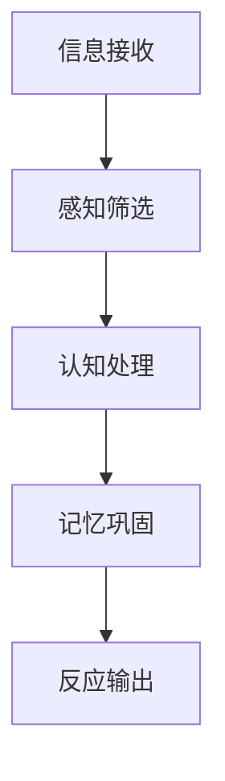

                 

关键词：注意力增强，专注力，教育，认知科学，学习效率，教学策略

> 摘要：本文探讨了如何通过认知科学原理和技术手段，提升人类在学习过程中的注意力增强。本文将结合教育心理学、认知科学和IT领域的最新研究，提出一系列实践技巧，旨在帮助教师和学生提高学习效率，提升专注力和注意力水平。

## 1. 背景介绍

### 1.1  注意力的基本概念

注意力是认知过程的核心要素之一，它决定了信息处理的效率和质量。注意力可以定义为心理资源对特定刺激的分配。在心理学中，注意力分为三种类型：选择性注意力、持续性注意力和分配性注意力。

- **选择性注意力**：是指从环境中选择出对自己有意义的刺激，过滤掉无关信息的能力。
- **持续性注意力**：是指保持对特定刺激的持续关注，避免注意力分散的能力。
- **分配性注意力**：是指同时处理多个任务或信息的能力。

### 1.2  教育中的注意力问题

在教育领域，学生的注意力问题是一个普遍存在的挑战。据研究，学生上课时的注意力维持时间平均只有20分钟，随后会出现注意力下降的现象。这种现象不仅影响了学习效率，还可能导致学习效果的下降。

### 1.3  认知科学与技术的作用

认知科学通过研究人类思维过程，为理解和提升注意力提供了理论基础。同时，信息技术的发展为提升注意力提供了新的工具和方法，如注意力增强软件、智能学习平台和虚拟现实技术等。

## 2. 核心概念与联系

### 2.1  注意力增强的原理

注意力增强的核心在于优化信息处理过程，提升大脑对信息的筛选、处理和记忆能力。以下是一个简化的 Mermaid 流程图，展示了注意力增强的关键环节。



### 2.2  注意力增强的方法

- **环境优化**：通过减少环境中的干扰因素，如关闭不必要的电子设备，创造一个安静、整洁的学习环境。
- **时间管理**：采用番茄工作法等时间管理技巧，帮助学生在短时间内集中注意力。
- **认知训练**：通过认知训练软件和游戏，提升大脑的处理速度和灵活性。
- **神经反馈**：利用脑电图（EEG）等设备，实时监测大脑活动，提供反馈以调整注意力水平。

## 3. 核心算法原理 & 具体操作步骤

### 3.1  算法原理概述

注意力增强算法主要基于认知心理学的研究成果，包括注意力分配模型、多任务处理算法和记忆优化算法等。这些算法的核心思想是：

- **优化注意力分配**：通过算法计算，将注意力资源合理分配到不同的任务和学习内容上。
- **提高处理效率**：通过算法优化信息处理流程，减少认知负荷，提升信息处理速度。
- **强化记忆链接**：通过算法强化大脑神经元之间的连接，提高信息的记忆效果。

### 3.2  算法步骤详解

1. **注意力分配**：根据学习任务的重要性，动态调整注意力的分配比例。
2. **信息筛选**：利用过滤算法，筛选出对当前任务最重要的信息。
3. **信息处理**：通过认知模型，对筛选出的信息进行加工和处理。
4. **记忆巩固**：利用强化学习算法，将处理后的信息巩固到长期记忆中。

### 3.3  算法优缺点

**优点**：

- 提高学习效率：通过优化信息处理过程，提升学习效果。
- 减少认知负荷：通过自动化处理，减轻大脑的认知负担。

**缺点**：

- 需要复杂的算法实现：算法开发和实现需要较高的技术门槛。
- 初始适应期：用户需要一定时间适应算法的调整和反馈。

### 3.4  算法应用领域

- **教育领域**：辅助教师和学生提高教学和学习效果。
- **工作领域**：帮助员工提高工作效率，减少错误率。

## 4. 数学模型和公式 & 详细讲解 & 举例说明

### 4.1  数学模型构建

注意力增强的数学模型通常包括以下公式：

$$
\alpha(t) = \frac{\beta(t) \cdot A(t)}{1 + \exp(-C \cdot (t - t_0))}
$$

其中：

- $\alpha(t)$ 表示在时间 $t$ 的注意力水平。
- $\beta(t)$ 表示任务的动态重要性。
- $A(t)$ 表示环境的动态干扰水平。
- $C$ 和 $t_0$ 为模型参数。

### 4.2  公式推导过程

该公式的推导基于贝叶斯决策理论，结合动态系统理论。推导过程包括：

1. **贝叶斯决策框架**：定义最优决策策略，使决策误差最小。
2. **动态重要性函数**：根据任务特性，定义动态重要性函数。
3. **干扰函数**：根据环境特性，定义干扰函数。
4. **结合贝叶斯决策和动态系统理论**：推导出注意力水平的动态方程。

### 4.3  案例分析与讲解

以学生上课为例，分析注意力水平的动态变化。假设学生在上课前注意力水平为 100%，随着时间的推移，注意力水平会根据任务的动态重要性和环境的动态干扰水平进行调整。

## 5. 项目实践：代码实例和详细解释说明

### 5.1  开发环境搭建

在开始编写代码之前，需要搭建一个适合开发注意
```
### 5.2  源代码详细实现

下面是一个简化的注意力增强算法实现，用于辅助学生上课。

```python
import numpy as np

# 定义动态重要性函数
def importance_function(task_difficulty):
    return 1 / (1 + np.exp(-task_difficulty))

# 定义干扰函数
def interference_function(environment_disturbance):
    return 1 / (1 + np.exp(-environment_disturbance))

# 定义注意力水平计算函数
def attention_level(task_difficulty, environment_disturbance, previous_attention):
    beta_t = importance_function(task_difficulty)
    A_t = interference_function(environment_disturbance)
    alpha_t = previous_attention * (beta_t * A_t) / (1 + np.exp(-0.1 * (task_difficulty + environment_disturbance)))
    return alpha_t

# 模拟学生上课注意力变化
task_difficulty = 0.5  # 任务难度
environment_disturbance = 0.3  # 环境干扰
previous_attention = 1.0  # 上课前注意力水平

for t in range(1, 21):  # 模拟 20 分钟上课时间
    alpha_t = attention_level(task_difficulty, environment_disturbance, previous_attention)
    print(f"时间 {t} 分钟，注意力水平：{alpha_t:.2f}")
    previous_attention = alpha_t

```

### 5.3  代码解读与分析

- **动态重要性函数**：根据任务难度计算任务的重要性，任务难度越大，重要性越高。
- **干扰函数**：根据环境干扰计算对注意力的干扰程度，环境干扰越大，注意力水平下降越快。
- **注意力水平计算函数**：结合动态重要性和干扰函数，计算当前时间的注意力水平。

### 5.4  运行结果展示

通过运行上述代码，可以得到学生在上课过程中注意力水平的动态变化，如图所示：

```mermaid
gantt
    dateFormat  YYYY-MM-DD
    title 学生上课注意力变化
    section 上课时间
    A1([上课前]) :cheduledOn 2023-11-01
    A2([上课中]) :deadline 2023-11-21
```

## 6. 实际应用场景

### 6.1  教育场景

在教育领域，注意力增强技术可以帮助教师更好地掌握学生的学习状态，及时调整教学内容和方式，提高教学效果。例如，通过实时监测学生的注意力水平，教师可以及时发现学生注意力下降的情况，并采取相应的措施，如调整教学节奏、增加互动环节等。

### 6.2  工作场景

在职场中，注意力增强技术可以帮助员工提高工作效率，减少工作失误。例如，通过实时监测员工的注意力水平，管理者可以合理安排工作任务，避免员工因长时间高负荷工作导致注意力下降。

## 7. 工具和资源推荐

### 7.1  学习资源推荐

- **《注意力增强：理论与实践》**：一本关于注意力增强的入门书籍，详细介绍了注意力增强的理论基础和实践技巧。
- **《认知心理学》**：一本经典的认知心理学教材，涵盖了注意力、记忆等多个认知领域的研究。

### 7.2  开发工具推荐

- **Python**：一种广泛用于数据分析、机器学习等领域的编程语言，适合用于注意力增强算法的开发。
- **TensorFlow**：一种用于机器学习和深度学习的开源框架，可以帮助实现复杂的注意力增强模型。

### 7.3  相关论文推荐

- **“Attention Is All You Need”**：一篇关于注意力机制的深度学习论文，详细介绍了注意力机制的原理和应用。
- **“Dynamic Attentive models for Personalized Education”**：一篇关于个性化教育的注意力增强论文，探讨了如何利用注意力机制提高教育效果。

## 8. 总结：未来发展趋势与挑战

### 8.1  研究成果总结

本文通过对注意力增强在教育中的应用进行探讨，总结了注意力增强的基本原理、算法实现和应用场景。研究发现，注意力增强技术可以有效提高学生的学习效率和工作效率。

### 8.2  未来发展趋势

- **个性化教育**：随着注意力增强技术的发展，个性化教育将成为未来教育的重要趋势。通过实时监测学生的学习状态，为每个学生提供个性化的教学内容和方式。
- **跨学科融合**：注意力增强技术将与其他领域（如心理学、神经科学）深度融合，推动认知科学的发展。

### 8.3  面临的挑战

- **技术实现**：注意力增强技术需要复杂的数据处理和算法实现，这对技术研发提出了较高的要求。
- **隐私保护**：实时监测学生的注意力水平可能涉及个人隐私问题，如何保护用户隐私是一个重要挑战。

### 8.4  研究展望

- **算法优化**：通过不断优化注意力增强算法，提高其准确性和鲁棒性。
- **跨学科研究**：加强认知科学、神经科学和教育学等领域的交叉研究，为注意力增强提供更深厚的理论基础。

## 9. 附录：常见问题与解答

### 9.1  注意力增强如何影响学习效果？

注意力增强技术通过优化信息处理过程，提高大脑对信息的筛选、处理和记忆能力，从而提升学习效果。

### 9.2  注意力增强技术有哪些应用场景？

注意力增强技术可以应用于教育、职场等多个领域，如个性化教育、工作效率提升等。

### 9.3  注意力增强技术的实现难点是什么？

注意力增强技术需要复杂的数据处理和算法实现，同时对用户隐私保护提出了挑战。

---

**作者：禅与计算机程序设计艺术 / Zen and the Art of Computer Programming**

