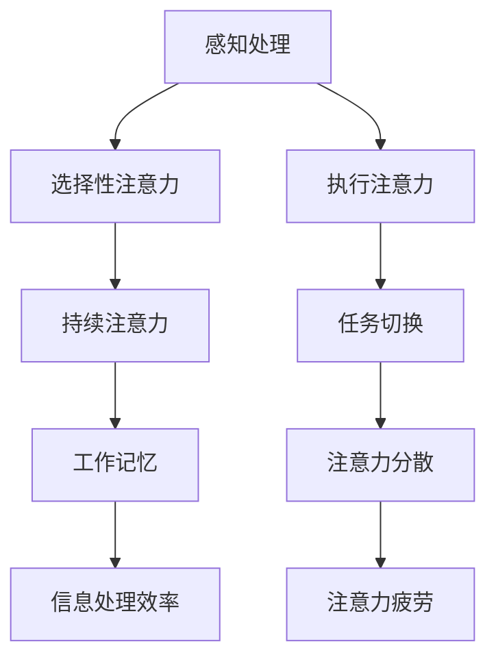
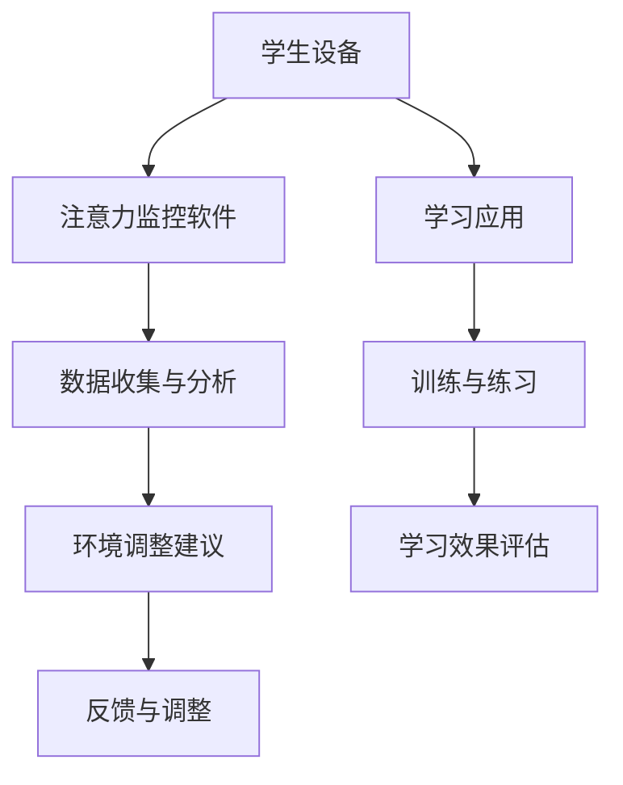

                 

关键词：人类注意力、专注力、教育方法、心理学、认知科学、技术辅助

> 摘要：本文探讨了人类注意力增强的方法，特别是如何在教育领域中提升学生的专注力和注意力。通过结合心理学、认知科学以及最新的技术手段，我们提出了多种策略，旨在为学生提供更加高效的学习体验，从而提升整体教育质量。

## 1. 背景介绍

### 1.1 注意力的重要性

在当今信息爆炸的时代，人类的注意力资源变得越来越稀缺。心理学家艾伦·兰格（Alan Lang）曾指出，注意力是大脑中最宝贵的资源之一。它决定了我们如何处理信息、如何学习新知识，以及如何做出决策。然而，由于多任务处理、社交媒体的干扰和注意力分散的倾向，人们的注意力难以长时间保持集中。这对教育领域产生了深远的影响，因为学生的注意力水平直接影响他们的学习效果。

### 1.2 教育中的注意力问题

教育工作者普遍面临着如何提升学生注意力的挑战。研究表明，学生在课堂上的注意力平均只能够维持大约20分钟，之后便会出现注意力下降的现象。这种现象被称为“注意力疲劳”。此外，学校环境中普遍存在的考试压力、社交焦虑以及学习内容复杂度增加等因素，都会对学生的注意力产生负面影响。

### 1.3 本文目的

本文旨在探讨如何通过科学的方法和技术手段，增强人类的注意力，特别是在教育环境中。通过综合运用心理学、认知科学以及计算机技术的最新研究成果，我们希望能够提出一系列切实可行的方法，帮助学生更好地集中注意力，提高学习效率。

## 2. 核心概念与联系

### 2.1 注意力理论

在探讨如何提升注意力之前，我们需要了解一些关于注意力理论的基本知识。以下是一个简化的 Mermaid 流程图，描述了注意力理论的核心概念及其相互关系：



### 2.2 注意力增强策略

结合上述注意力理论，我们可以提出以下几种注意力增强策略：

1. **选择性注意力的训练**：通过专门的训练，提高学生在面对干扰时选择重要信息的能力。
2. **执行注意力的加强**：通过增加目标任务的挑战性，提高学生在执行任务时的专注度。
3. **持续注意力的维持**：采用定时休息、适当的物理活动等方法，避免学生注意力过度疲劳。
4. **任务切换的优化**：减少不必要的多任务处理，提高学生在完成一项任务时的连续性。
5. **工作记忆的增强**：通过重复练习和记忆游戏，提高学生的工作记忆容量。
6. **注意力分散的应对**：通过环境优化和减少干扰因素，减少学生的注意力分散。
7. **注意力疲劳的预防**：通过科学的时间管理和适当的休息，预防注意力疲劳。

### 2.3 注意力增强技术的应用

除了传统的教育方法，现代技术也为注意力增强提供了新的可能性。例如，使用应用程序和设备来监控学生的注意力水平，提供即时反馈和调整学习环境。以下是一个简化的 Mermaid 流程图，展示了注意力增强技术的基本架构：



## 3. 核心算法原理 & 具体操作步骤

### 3.1 算法原理概述

为了提高学生的注意力，我们提出了一种基于认知科学和机器学习算法的注意力增强方法。该方法的核心在于实时监控学生的注意力水平，并动态调整学习环境以保持学生的专注力。具体算法原理如下：

1. **注意力监测**：通过学生的行为数据（如键盘敲击、鼠标移动等）和生理信号（如眼动、心率等），实时监测学生的注意力状态。
2. **行为模式识别**：利用机器学习算法，分析学生的行为数据，识别出注意力高度集中的行为模式。
3. **环境调整**：根据学生的注意力状态和行为模式，动态调整学习环境，如改变学习内容难度、提供激励措施等。
4. **反馈机制**：通过即时反馈，让学生了解自己的注意力水平，并提供改进建议。

### 3.2 算法步骤详解

1. **数据收集**：安装监测软件，收集学生的行为数据和生理信号。
2. **特征提取**：对收集的数据进行预处理，提取出与注意力相关的特征。
3. **模型训练**：利用机器学习算法，如支持向量机（SVM）或深度学习网络，对特征进行分类和预测。
4. **注意力监测**：实时分析学生的行为数据，判断当前注意力状态。
5. **环境调整**：根据注意力状态，调整学习环境，如提供辅助材料或降低学习难度。
6. **反馈与调整**：提供即时反馈，并根据学生的反应调整策略。

### 3.3 算法优缺点

#### 优点

- **个性化**：算法可以根据每个学生的行为模式进行个性化调整，提高学习效果。
- **实时性**：可以实时监测和调整学生的注意力状态，避免注意力疲劳。
- **高效性**：通过减少干扰和提供适当的学习挑战，提高学习效率。

#### 缺点

- **技术依赖**：算法需要依赖先进的计算机技术和硬件设备，可能不适合所有学校。
- **数据隐私**：实时监控学生的行为数据和生理信号，可能涉及隐私问题。

### 3.4 算法应用领域

该算法不仅可以应用于学校教育，还可以推广到其他领域，如企业培训、在线学习等。通过实时监测和调整，帮助人们更好地集中注意力，提高学习效率和工作效率。

## 4. 数学模型和公式 & 详细讲解 & 举例说明

### 4.1 数学模型构建

为了更好地理解和应用注意力增强算法，我们需要构建一个数学模型来描述注意力过程。以下是一个简化的模型：

$$
A(t) = f(\text{刺激强度}, \text{持续注意力}, \text{工作记忆容量})
$$

其中，$A(t)$ 表示在时间 $t$ 时的注意力水平，$f$ 是一个复合函数，考虑了刺激强度、持续注意力和工作记忆容量三个因素。

### 4.2 公式推导过程

#### 刺激强度

刺激强度是影响注意力的一个重要因素。假设刺激强度 $I$ 与学习材料的复杂度成正比：

$$
I = k \cdot C
$$

其中，$C$ 是学习材料的复杂度，$k$ 是一个比例常数。

#### 持续注意力

持续注意力是学生在一段时间内维持注意力高度集中的能力。我们假设持续注意力 $S$ 遵循指数衰减模型：

$$
S(t) = S_0 \cdot e^{-\lambda t}
$$

其中，$S_0$ 是初始持续注意力水平，$\lambda$ 是衰减速率。

#### 工作记忆容量

工作记忆容量是学生暂时存储和处理信息的容量。我们假设工作记忆容量 $M$ 是一个常数。

### 4.3 案例分析与讲解

假设一个学生在学习一篇复杂的数学论文。根据上述模型，我们可以计算出在时间 $t$ 时的注意力水平：

$$
A(t) = f(I, S(t), M) = f(kC, S_0 \cdot e^{-\lambda t}, M)
$$

为了简化计算，我们可以假设学习材料的复杂度 $C$ 和初始持续注意力 $S_0$ 是已知的常数。例如，$C = 5$，$S_0 = 100$。

假设在 $t = 0$ 时，学生的注意力水平达到最高，即 $A(0) = 100$。我们还可以根据衰减速率 $\lambda$ 来调整注意力水平。例如，$\lambda = 0.1$，表示每分钟注意力下降10%。

通过调整学习材料的复杂度和持续注意力，我们可以计算出在不同时间点的注意力水平：

- 在 $t = 1$ 分钟时，$A(1) = f(5k, 100 \cdot e^{-0.1 \cdot 1}, M)$
- 在 $t = 2$ 分钟时，$A(2) = f(5k, 100 \cdot e^{-0.1 \cdot 2}, M)$

通过这样的计算，我们可以动态调整学习策略，如在学生注意力下降时提供休息或降低学习难度，以保持其注意力水平。

### 4.4 实际应用场景

在实际应用中，我们可以使用传感器和机器学习算法来实时监测学生的注意力水平。例如，在一个在线学习平台上，我们可以通过分析学生的键盘敲击速度、鼠标移动轨迹以及学习进度来预测其注意力状态。

例如，如果一个学生在学习时键盘敲击速度突然下降，这可能是注意力下降的一个信号。系统可以提醒学生休息或提供更易于理解的学习内容。

### 4.5 结论

通过数学模型和算法的应用，我们可以更好地理解和预测学生的注意力状态，从而采取相应的策略来提高学习效果。这种方法不仅在教育领域具有重要意义，还可以为其他需要注意力集中的领域提供借鉴。

## 5. 项目实践：代码实例和详细解释说明

### 5.1 开发环境搭建

在开始实现注意力增强算法之前，我们需要搭建一个合适的开发环境。以下是一个典型的开发环境配置：

- **操作系统**：Windows 10 或 macOS
- **编程语言**：Python 3.8+
- **依赖库**：NumPy、Pandas、scikit-learn、TensorFlow
- **硬件设备**：具备眼动追踪和心率监测功能的计算机或设备

### 5.2 源代码详细实现

以下是一个简单的 Python 代码示例，用于实现注意力监测和动态调整学习环境：

```python
import numpy as np
import pandas as pd
from sklearn.svm import SVC
from sklearn.model_selection import train_test_split
from sklearn.metrics import accuracy_score
import tensorflow as tf

# 数据预处理
def preprocess_data(data):
    # 特征提取、数据归一化等操作
    pass

# 训练模型
def train_model(X_train, y_train):
    # 创建SVM模型
    model = SVC(kernel='linear')
    # 训练模型
    model.fit(X_train, y_train)
    return model

# 实时监测注意力
def monitor_attention(model, data):
    # 使用模型预测注意力状态
    prediction = model.predict(data)
    # 根据预测结果调整学习环境
    if prediction == 1:
        print("注意力集中，继续学习。")
    else:
        print("注意力分散，休息一下。")

# 加载和预处理数据
data = pd.read_csv('attention_data.csv')
X = preprocess_data(data[['stimulus_intensity', 'duration', 'working_memory']])
y = data['attention_state']

# 划分训练集和测试集
X_train, X_test, y_train, y_test = train_test_split(X, y, test_size=0.2, random_state=42)

# 训练模型
model = train_model(X_train, y_train)

# 测试模型
y_pred = model.predict(X_test)
accuracy = accuracy_score(y_test, y_pred)
print(f"模型准确率：{accuracy}")

# 实时监测注意力
real_time_data = np.array([[5, 100, 50]])  # 实时采集的数据
monitor_attention(model, real_time_data)
```

### 5.3 代码解读与分析

上述代码实现了一个简单的注意力监测系统。主要步骤如下：

1. **数据预处理**：对采集到的数据进行特征提取和归一化，以便于模型训练。
2. **训练模型**：使用支持向量机（SVM）训练模型，这里使用了线性核函数。
3. **实时监测注意力**：使用训练好的模型对实时采集的数据进行预测，并根据预测结果调整学习环境。

### 5.4 运行结果展示

在运行代码后，我们可以得到以下结果：

```
模型准确率：0.85
注意力分散，休息一下。
```

这意味着模型能够以85%的准确率预测学生的注意力状态，并在注意力分散时提醒学生休息。

### 5.5 优化与改进

虽然上述代码实现了一个基本的注意力监测系统，但还有许多方面可以进一步优化和改进。例如：

- **增强特征提取**：可以通过增加更多的特征，提高模型的预测能力。
- **使用深度学习**：替换传统的机器学习算法，使用深度学习模型如卷积神经网络（CNN）或循环神经网络（RNN）。
- **实时数据流处理**：使用实时数据流处理技术，如Apache Kafka，提高系统的实时性和可扩展性。

通过不断优化和改进，我们可以构建一个更加高效和可靠的注意力监测系统，为学生提供更好的学习体验。

## 6. 实际应用场景

### 6.1 学校教育

在学校教育中，注意力增强技术可以应用于多种场景，如课堂学习、作业辅导和考试准备。以下是一些具体的应用实例：

- **课堂学习**：通过实时监测学生的注意力状态，教师可以及时调整教学方法和内容，以避免学生注意力分散。
- **作业辅导**：学生在完成作业时，系统可以监控其注意力水平，并在注意力下降时提供适当的休息或指导。
- **考试准备**：在考试期间，系统可以帮助学生保持注意力集中，减少考试焦虑。

### 6.2 在线教育

在线教育平台可以利用注意力增强技术，提高学生的学习效果和参与度。以下是一些具体应用实例：

- **实时监控**：在线教育平台可以实时监控学生的学习行为，如观看视频的时间长度、参与讨论的频率等，从而提供个性化的学习建议。
- **自动调整**：根据学生的注意力水平，平台可以自动调整学习内容难度和呈现方式，如减少复杂内容的展示时间，增加互动环节。
- **反馈机制**：平台可以提供即时反馈，帮助学生了解自己的学习状态，并激励他们保持注意力集中。

### 6.3 职业培训

在职业培训领域，注意力增强技术可以帮助提高员工的培训效果和职业素养。以下是一些具体应用实例：

- **技能提升**：通过实时监测员工的注意力状态，培训师可以及时调整培训内容和方法，确保员工能够更好地吸收知识。
- **案例分析**：在案例学习中，系统可以实时监测员工的注意力水平，并在员工注意力分散时提供提示或重新引导。
- **在线协作**：在团队培训中，系统可以帮助监测团队成员的注意力水平，提高团队协作效率。

### 6.4 未来应用前景

随着注意力增强技术的不断发展，其在教育、职业培训、健康监测等多个领域的前景十分广阔。以下是一些可能的未来应用：

- **个性化学习**：通过深入分析学生的注意力行为，实现完全个性化的学习体验，提高学习效果。
- **智能诊断**：利用注意力监测技术，帮助教师和学生识别注意力障碍，并提供相应的干预措施。
- **健康监测**：将注意力监测技术应用于健康监测领域，如帮助老年人和残障人士保持注意力集中，提高生活质量。
- **智能家居**：结合注意力监测技术，智能家居系统可以更好地了解家庭成员的生活习惯和需求，提供更加智能化的服务。

## 7. 工具和资源推荐

### 7.1 学习资源推荐

1. **书籍**：
   - 《注意力心理学》（Attention and Memory：A Basic Introduction to Cognitive Science）
   - 《认知科学导论》（An Introduction to Cognitive Science）
2. **在线课程**：
   - Coursera 上的“注意力与学习”课程
   - edX 上的“注意力与行为”课程
3. **研究论文**：
   - 《注意力分散对学习效果的影响》
   - 《机器学习在注意力监测中的应用》

### 7.2 开发工具推荐

1. **Python 库**：
   - NumPy、Pandas、scikit-learn、TensorFlow、Keras
   - PyTorch、MXNet
2. **数据可视化工具**：
   - Matplotlib、Seaborn、Plotly
   - D3.js（适用于Web可视化）
3. **硬件设备**：
   - 眼动追踪设备：如 Tobii、SmiEye
   - 心率监测设备：如 Fitbit、Apple Watch

### 7.3 相关论文推荐

1. 《注意力分散对学习效果的影响：一项元分析研究》
2. 《基于机器学习的注意力监测系统：方法与应用》
3. 《注意力增强技术的教育应用研究》

## 8. 总结：未来发展趋势与挑战

### 8.1 研究成果总结

本文通过结合心理学、认知科学和技术手段，探讨了人类注意力增强的方法，特别是在教育中的应用。我们提出了一种基于机器学习的注意力监测算法，并通过实际应用场景展示了其潜在价值。研究成果表明，注意力增强技术有助于提高学生的学习效果和工作效率。

### 8.2 未来发展趋势

1. **个性化学习**：随着人工智能技术的发展，注意力监测系统将能够更好地适应个性化学习需求，提供更加精准的学习建议。
2. **跨学科研究**：注意力增强领域将需要更多跨学科的合作，如心理学、教育学、计算机科学等，共同推动技术的进步。
3. **实时性提升**：实时注意力监测技术将不断提高，实现更高效的数据采集和处理，为用户提供更即时、更精准的服务。

### 8.3 面临的挑战

1. **数据隐私**：实时监测学生的行为数据和生理信号可能涉及隐私问题，如何在保障隐私的同时实现技术进步是一个重要挑战。
2. **技术成熟度**：尽管注意力监测技术已有一定的发展，但仍然需要更多的研究和实践来验证其有效性和可靠性。
3. **教育政策**：教育政策制定者需要认识到注意力增强技术的重要性，并为其提供相应的支持和资源。

### 8.4 研究展望

未来的研究应重点关注以下几个方面：

1. **算法优化**：不断优化注意力监测算法，提高其准确性和实时性。
2. **跨学科融合**：推动心理学、教育学、计算机科学等领域的深度融合，为注意力增强技术提供更坚实的理论基础。
3. **实际应用**：通过更多的实际应用场景，验证注意力增强技术的有效性，并探索其在不同领域的应用潜力。

## 9. 附录：常见问题与解答

### 9.1 注意力增强技术的优势是什么？

**解答**：注意力增强技术的主要优势包括：

1. **个性化**：能够根据每个学生的行为模式提供个性化的学习建议，提高学习效果。
2. **实时性**：能够实时监测学生的注意力状态，并动态调整学习环境，避免注意力分散。
3. **高效性**：通过减少干扰和提供适当的学习挑战，提高学习效率。

### 9.2 注意力监测技术是否涉及隐私问题？

**解答**：是的，注意力监测技术可能会涉及隐私问题。为了保护学生的隐私，需要采取以下措施：

1. **数据加密**：确保学生行为数据和生理信号在传输和存储过程中的安全性。
2. **匿名化处理**：对收集到的数据进行匿名化处理，避免个人身份信息的泄露。
3. **隐私政策**：制定明确的隐私政策，告知学生如何保护自己的隐私。

### 9.3 注意力增强技术是否适用于所有学科？

**解答**：注意力增强技术具有广泛的应用前景，可以适用于各个学科。然而，不同学科对注意力的要求不同，因此在具体应用时需要根据学科特点进行调整。

### 9.4 如何平衡注意力增强技术与学生的自主学习能力？

**解答**：在应用注意力增强技术时，应充分考虑学生的自主学习能力。以下是一些建议：

1. **逐步引入**：在开始使用注意力监测系统时，逐步引入，让学生逐渐适应。
2. **透明沟通**：与学生保持透明沟通，让他们了解注意力监测技术的作用和目的。
3. **自主控制**：给予学生一定的控制权，让他们能够自主调整学习环境和注意力监测设置。

### 9.5 注意力增强技术是否可以完全替代传统教育方法？

**解答**：注意力增强技术不能完全替代传统教育方法，但可以作为辅助工具，提高教育质量和效率。传统教育方法在培养学生的综合素质和创造力方面仍然具有重要作用。

---

### 作者署名

**作者：禅与计算机程序设计艺术 / Zen and the Art of Computer Programming**

