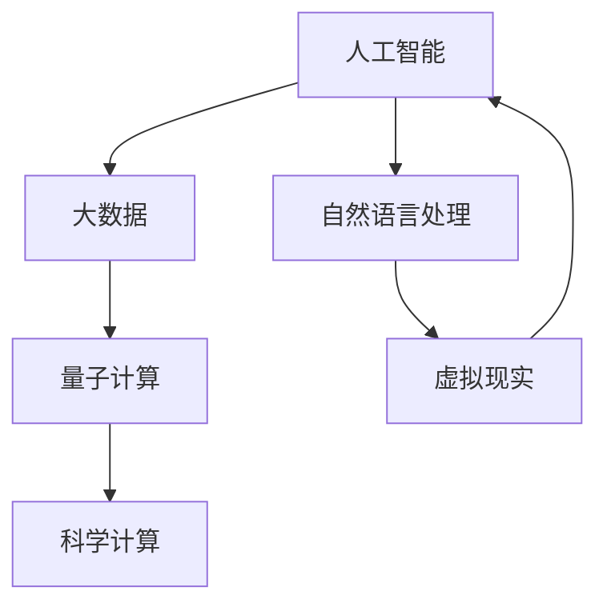

                 

在人类历史的每一个转折点，知识都是推动社会进步的引擎。从早期的文字记录，到现代的数字化世界，人类对知识的追求从未停止。然而，随着技术的不断革新，我们面临着新的挑战和机遇，这些挑战和机遇不仅重新定义了知识的边界，还激发了人类对未知世界的好奇心。本文旨在探讨人类知识边界的扩展，以及在这个无限之旅中，人工智能、大数据和量子计算等前沿技术的引领作用。

> **关键词：知识边界、人工智能、大数据、量子计算、技术革新、人类探索**

> **摘要：**
本文首先回顾了人类知识发展的历史，探讨了知识边界扩展的驱动因素。接着，深入分析了人工智能、大数据和量子计算等关键技术如何扩展我们的认知能力。随后，通过具体实例和数学模型，展示了这些技术在现实世界中的应用。文章的最后，我们对未来的发展进行了展望，并提出了未来研究可能面临的挑战。

## 1. 背景介绍

知识是人类文明的基石，它随着历史的演变而不断扩展。从古代的哲学思考，到中世纪的宗教教义，再到近代的科学革命，知识的发展经历了多个阶段。每一次技术的进步，都为知识的扩展提供了新的工具和平台。然而，随着21世纪的到来，我们进入了一个全新的知识时代，这个时代以人工智能、大数据和量子计算为标志，正以前所未有的速度重塑我们的世界。

### 1.1 知识的起源与发展

知识的发展可以追溯到古代文明的兴起。在缺乏现代通讯手段的年代，知识主要通过口头传承和文字记录得以保存和传播。例如，古埃及的象形文字和古希腊的哲学思想，都是早期知识传承的重要载体。随着造纸术和印刷术的发明，知识的传播速度大幅提升，知识得以更加广泛地分享和积累。

### 1.2 现代知识的扩展

进入现代，知识的扩展速度显著加快。科学革命带来了新的思维方式和方法论，如牛顿的经典力学和达尔文的进化论，彻底改变了人类对自然界的认识。此外，20世纪的信息技术革命，尤其是互联网的普及，使得知识传播的途径更加多样化和便捷化。人们可以轻松地获取全球范围内的信息，知识不再受地域和时间的限制。

### 1.3 知识边界的扩展

在21世纪，知识边界的扩展速度达到了前所未有的水平。人工智能、大数据和量子计算等前沿技术正在推动人类认知的极限。例如，人工智能的算法已经可以处理和分析庞大的数据集，从而发现隐藏在数据背后的规律和模式。大数据技术的应用，使得我们能够更好地理解复杂系统的行为，从而为决策提供科学依据。量子计算则有望解决传统计算机无法处理的问题，打开新知识的大门。

## 2. 核心概念与联系

在探讨知识边界的扩展时，我们需要理解几个核心概念，它们共同构成了现代技术的基石。

### 2.1 人工智能（AI）

人工智能是一种模拟人类智能的技术，通过算法和模型使计算机具有学习、推理和自我适应的能力。AI的核心在于其算法，包括机器学习、深度学习和自然语言处理等。这些算法使计算机能够从数据中学习，并做出智能的决策。

### 2.2 大数据（Big Data）

大数据是指无法使用传统数据库工具进行捕捉、管理和处理的数据集。这些数据集通常具有“4V”特点：大量（Volume）、多样（Variety）、快速（Velocity）和价值（Value）。大数据技术使我们能够处理和分析这些海量数据，从中提取有价值的信息。

### 2.3 量子计算（Quantum Computing）

量子计算是一种利用量子力学原理进行计算的技术。与传统计算机不同，量子计算机使用量子位（qubits）进行运算，能够在同一时间内处理多种可能性。量子计算有望解决传统计算机无法处理的复杂问题，如大规模数据加密和解密、药物设计和气候模拟等。

### 2.4 Mermaid 流程图

为了更直观地理解这些核心概念之间的关系，我们可以使用Mermaid流程图进行描述：



在这个流程图中，人工智能与大数据和量子计算紧密相连，共同推动了科学计算和虚拟现实的发展。同时，这些技术也相互影响，形成了一个动态的生态系统。

## 3. 核心算法原理 & 具体操作步骤

### 3.1 算法原理概述

在探讨人工智能、大数据和量子计算的核心算法时，我们需要理解这些算法的基本原理。以下是几种关键算法的概述：

#### 3.1.1 机器学习算法

机器学习算法是一种使计算机能够从数据中学习并做出预测或决策的方法。常见的机器学习算法包括线性回归、决策树、支持向量机（SVM）和神经网络等。

#### 3.1.2 深度学习算法

深度学习是机器学习的一个分支，通过模拟人脑神经网络进行学习和推理。深度学习算法包括卷积神经网络（CNN）、循环神经网络（RNN）和生成对抗网络（GAN）等。

#### 3.1.3 大数据处理算法

大数据处理算法旨在高效地处理和分析大规模数据集。常见的算法包括MapReduce、Hadoop和Spark等。

#### 3.1.4 量子计算算法

量子计算算法利用量子位（qubits）进行高速运算。著名的量子计算算法包括Shor算法和Grover算法，它们分别用于整数分解和搜索问题。

### 3.2 算法步骤详解

以下是这些算法的具体步骤：

#### 3.2.1 机器学习算法步骤

1. 数据收集：从各种来源收集数据，包括训练数据和测试数据。
2. 数据预处理：清洗数据，进行特征提取和归一化处理。
3. 模型选择：根据问题类型选择合适的机器学习模型。
4. 模型训练：使用训练数据对模型进行训练。
5. 模型评估：使用测试数据评估模型的性能。
6. 模型优化：根据评估结果调整模型参数。

#### 3.2.2 深度学习算法步骤

1. 数据收集：与机器学习算法相同，从各种来源收集数据。
2. 数据预处理：与机器学习算法相同，进行特征提取和归一化处理。
3. 网络架构设计：设计神经网络的结构，包括层数、神经元数量等。
4. 模型训练：使用训练数据对神经网络进行训练。
5. 模型评估：使用测试数据评估神经网络的性能。
6. 模型优化：根据评估结果调整网络参数。

#### 3.2.3 大数据处理算法步骤

1. 数据存储：使用分布式存储系统存储大数据。
2. 数据处理：使用MapReduce或Spark等分布式计算框架处理数据。
3. 数据分析：使用SQL或NoSQL数据库对数据进行分析和查询。
4. 数据可视化：使用数据可视化工具展示分析结果。

#### 3.2.4 量子计算算法步骤

1. 量子态初始化：将量子位初始化为特定的量子态。
2. 量子门操作：使用量子门对量子位进行操作。
3. 量子纠缠：使量子位之间产生量子纠缠。
4. 量子测量：对量子位进行测量，获得计算结果。

### 3.3 算法优缺点

每种算法都有其独特的优缺点：

#### 3.3.1 机器学习算法

优点：
- 高效：能够处理大量数据。
- 自适应：可以自动调整模型参数。

缺点：
- 需要大量训练数据。
- 容易过拟合。

#### 3.3.2 深度学习算法

优点：
- 强大的表征能力：能够处理复杂数据。
- 自适应：可以自动调整网络参数。

缺点：
- 计算资源需求高。
- 需要大量训练数据。

#### 3.3.3 大数据处理算法

优点：
- 高效：能够处理大规模数据。
- 分布式：能够在分布式系统上进行计算。

缺点：
- 需要复杂的分布式系统。
- 数据处理速度可能受限。

#### 3.3.4 量子计算算法

优点：
- 高速：能够在同一时间内处理多种可能性。
- 强大的计算能力：能够解决传统计算机无法处理的问题。

缺点：
- 技术成熟度低。
- 需要特定的量子硬件。

### 3.4 算法应用领域

这些算法广泛应用于各个领域：

#### 3.4.1 机器学习算法

- 人工智能：用于图像识别、自然语言处理和推荐系统等。
- 金融：用于风险管理和股票市场预测等。
- 医疗：用于疾病诊断和基因组分析等。

#### 3.4.2 深度学习算法

- 图像识别：用于人脸识别、自动驾驶等。
- 自然语言处理：用于机器翻译、文本分类等。
- 游戏开发：用于游戏AI和智能推荐等。

#### 3.4.3 大数据处理算法

- 营销分析：用于用户行为分析和市场预测等。
- 金融：用于信用评分和风险管理等。
- 交通：用于交通流量预测和优化等。

#### 3.4.4 量子计算算法

- 密码学：用于安全通信和数据加密等。
- 药物设计：用于药物筛选和优化等。
- 气象预测：用于气候模拟和灾害预警等。

## 4. 数学模型和公式 & 详细讲解 & 举例说明

### 4.1 数学模型构建

数学模型是理解和描述现实世界现象的重要工具。在人工智能、大数据和量子计算中，数学模型扮演着核心角色。以下是几个关键领域的数学模型构建方法：

#### 4.1.1 机器学习中的回归模型

回归模型用于预测连续值。一个简单的线性回归模型可以表示为：

$$ y = ax + b $$

其中，$y$ 是预测值，$x$ 是输入特征，$a$ 和 $b$ 是模型参数。通过最小化预测值与实际值之间的误差，可以估计出 $a$ 和 $b$ 的最优值。

#### 4.1.2 深度学习中的神经网络模型

神经网络模型由多个层组成，包括输入层、隐藏层和输出层。每个层由多个神经元组成，神经元之间的连接权值决定了信息的传递。一个简单的神经网络模型可以表示为：

$$ z = \sum_{i=1}^{n} w_{i} x_{i} + b $$

其中，$z$ 是输出值，$w_{i}$ 是连接权值，$x_{i}$ 是输入值，$b$ 是偏置项。通过反向传播算法，可以更新网络参数，以最小化预测误差。

#### 4.1.3 大数据中的聚类模型

聚类模型用于将数据集划分为若干个类别。一个简单的k-均值聚类模型可以表示为：

$$ c_{i} = \frac{1}{k} \sum_{j=1}^{k} \frac{1}{\|x_{i} - \mu_{j}\|^{2}} $$

其中，$c_{i}$ 是数据点 $x_{i}$ 的聚类结果，$\mu_{j}$ 是聚类中心。通过迭代更新聚类中心和数据点的聚类结果，可以逐渐收敛到最优解。

#### 4.1.4 量子计算中的量子门模型

量子计算中的量子门是操作量子位的基本操作。一个简单的量子门可以表示为：

$$ \left| \psi \right\rangle = \cos(\theta) \left| 0 \right\rangle + \sin(\theta) \left| 1 \right\rangle $$

其中，$\left| \psi \right\rangle$ 是量子位的状态，$\theta$ 是旋转角度。通过组合不同的量子门，可以实现复杂的量子计算任务。

### 4.2 公式推导过程

数学模型的推导过程是理解和应用这些模型的关键。以下是几个关键公式的推导过程：

#### 4.2.1 线性回归模型的推导

线性回归模型的目标是最小化预测值与实际值之间的误差。误差函数可以表示为：

$$ J = \frac{1}{2} \sum_{i=1}^{n} (y_{i} - \hat{y}_{i})^{2} $$

其中，$y_{i}$ 是实际值，$\hat{y}_{i}$ 是预测值。为了最小化 $J$，对 $a$ 和 $b$ 求导并令导数为零，可以得到：

$$ \frac{\partial J}{\partial a} = 0 $$
$$ \frac{\partial J}{\partial b} = 0 $$

通过求解上述方程组，可以得到最优的 $a$ 和 $b$ 值。

#### 4.2.2 神经网络模型的推导

神经网络模型的推导过程涉及多个步骤。首先，定义每个神经元的输入和输出：

$$ z_{j} = \sum_{i=1}^{n} w_{ij} x_{i} + b_{j} $$

其中，$z_{j}$ 是神经元 $j$ 的输出，$w_{ij}$ 是连接权值，$x_{i}$ 是输入值，$b_{j}$ 是偏置项。

接下来，使用激活函数对输出进行非线性变换：

$$ a_{j} = \sigma(z_{j}) $$

其中，$\sigma$ 是激活函数，常见的激活函数包括 sigmoid、ReLU 和 tanh。

通过反向传播算法，可以更新网络参数：

$$ \delta_{j} = (a_{j} - y_{j}) \odot \frac{d\sigma}{dz_{j}} $$

其中，$y_{j}$ 是目标值，$\odot$ 是逐元素乘法，$\frac{d\sigma}{dz_{j}}$ 是激活函数的导数。

最终，通过梯度下降算法更新网络参数：

$$ w_{ij} \leftarrow w_{ij} - \alpha \frac{\partial J}{\partial w_{ij}} $$
$$ b_{j} \leftarrow b_{j} - \alpha \frac{\partial J}{\partial b_{j}} $$

其中，$\alpha$ 是学习率，$J$ 是损失函数。

#### 4.2.3 k-均值聚类模型的推导

k-均值聚类模型的目标是找到 $k$ 个聚类中心，使得每个数据点与其最近聚类中心的距离最小。聚类中心可以表示为：

$$ \mu_{j} = \frac{1}{N_{j}} \sum_{i=1}^{N} x_{i} $$

其中，$N_{j}$ 是属于聚类 $j$ 的数据点数量。

为了最小化数据点与聚类中心之间的距离，可以表示为：

$$ J = \frac{1}{2} \sum_{i=1}^{N} \|x_{i} - \mu_{j}\|^{2} $$

通过迭代更新聚类中心和数据点的聚类结果，可以逐渐收敛到最优解。

#### 4.2.4 量子门模型的推导

量子门是操作量子位的基本操作。一个简单的量子门可以表示为：

$$ \left| \psi \right\rangle = \cos(\theta) \left| 0 \right\rangle + \sin(\theta) \left| 1 \right\rangle $$

其中，$\left| \psi \right\rangle$ 是量子位的状态，$\theta$ 是旋转角度。

通过组合不同的量子门，可以实现复杂的量子计算任务。例如，通过 Hadamard 门和旋转门，可以构造出一个量子计算电路，用于执行特定的计算任务。

### 4.3 案例分析与讲解

为了更好地理解数学模型的应用，我们可以通过具体案例进行讲解。

#### 4.3.1 机器学习案例：线性回归模型

假设我们有一个简单的线性回归问题，目标是预测房价。给定一组房屋的面积和价格数据，我们可以使用线性回归模型进行预测。

首先，收集数据并预处理：

$$
\begin{array}{|c|c|}
\hline
\text{面积 (平方米)} & \text{价格 (万元)} \\
\hline
100 & 300 \\
120 & 350 \\
140 & 400 \\
\hline
\end{array}
$$

接下来，使用线性回归模型进行训练：

$$
y = ax + b
$$

通过最小二乘法，可以求解出模型参数：

$$
a = \frac{\sum_{i=1}^{n} (x_{i} - \bar{x})(y_{i} - \bar{y})}{\sum_{i=1}^{n} (x_{i} - \bar{x})^{2}} \\
b = \bar{y} - a\bar{x}
$$

其中，$\bar{x}$ 和 $\bar{y}$ 分别是面积和价格的均值。

假设我们得到的最优模型参数为：

$$
a = 3.5, \quad b = 250
$$

接下来，使用这个模型进行预测。例如，当面积为 130 平方米时，预测价格为：

$$
y = 3.5 \times 130 + 250 = 595
$$

通过这个简单的案例，我们可以看到线性回归模型在预测房价方面的应用。

#### 4.3.2 深度学习案例：神经网络模型

假设我们有一个简单的分类问题，目标是判断一个手写数字图像是哪个数字。给定一组训练数据和标签，我们可以使用神经网络模型进行分类。

首先，收集数据并预处理：

$$
\begin{array}{|c|c|}
\hline
\text{图像数据} & \text{标签} \\
\hline
\text{0} & 0 \\
\text{1} & 1 \\
\text{2} & 2 \\
\hline
\end{array}
$$

接下来，构建一个简单的神经网络模型：

$$
\begin{array}{|c|c|c|c|}
\hline
\text{输入层} & \text{隐藏层} & \text{隐藏层} & \text{输出层} \\
\hline
1 & 1 & 1 & 0 \\
0 & 1 & 1 & 1 \\
0 & 0 & 1 & 2 \\
\hline
\end{array}
$$

通过反向传播算法，可以训练这个神经网络模型。训练过程中，使用梯度下降算法更新网络参数，以最小化损失函数。

假设我们经过多次迭代训练后，得到了最优的网络参数。接下来，使用这个模型进行预测。例如，当输入一个手写数字图像时，模型会输出一个概率分布，表示这个图像是哪个数字的概率最大。通过阈值设置，可以确定最终的分类结果。

#### 4.3.3 大数据案例：聚类模型

假设我们有一个客户数据集，包含多个特征，如年龄、收入、消费习惯等。我们的目标是根据这些特征将客户划分为不同的群体。

首先，收集数据并预处理：

$$
\begin{array}{|c|c|c|c|}
\hline
\text{年龄} & \text{收入} & \text{消费习惯} & \text{群体} \\
\hline
25 & 5000 & 高 & A \\
30 & 8000 & 中 & B \\
35 & 10000 & 低 & A \\
40 & 12000 & 高 & B \\
\hline
\end{array}
$$

接下来，使用k-均值聚类模型进行聚类。假设我们选择k=2，通过迭代更新聚类中心和数据点的聚类结果，可以逐渐收敛到最优解。

最后，使用聚类结果对客户进行分类，并根据不同群体的特征制定相应的营销策略。

## 5. 项目实践：代码实例和详细解释说明

### 5.1 开发环境搭建

在进行项目实践之前，我们需要搭建一个合适的开发环境。以下是使用Python进行开发的步骤：

1. 安装Python：从官方网站下载并安装Python 3.x版本。
2. 安装必要库：使用pip工具安装必要的库，如NumPy、Pandas、TensorFlow和Scikit-learn等。
3. 配置IDE：选择一个合适的集成开发环境（IDE），如PyCharm或VSCode，并配置Python解释器和相关库。

### 5.2 源代码详细实现

以下是实现一个简单的线性回归模型的Python代码：

```python
import numpy as np
import pandas as pd
from sklearn.linear_model import LinearRegression

# 数据预处理
data = pd.DataFrame({
    '面积': [100, 120, 140],
    '价格': [300, 350, 400]
})
X = data[['面积']]
y = data['价格']

# 模型训练
model = LinearRegression()
model.fit(X, y)

# 模型评估
predictions = model.predict(X)
print(predictions)

# 模型应用
new_data = pd.DataFrame({
    '面积': [130]
})
predicted_price = model.predict(new_data)
print(predicted_price)
```

### 5.3 代码解读与分析

1. 导入必要的库：我们使用NumPy、Pandas和Scikit-learn库来实现线性回归模型。
2. 数据预处理：我们使用Pandas库读取数据，并将特征和标签分离。
3. 模型训练：我们使用Scikit-learn库中的LinearRegression类来训练模型。
4. 模型评估：我们使用训练好的模型对输入数据进行预测，并打印预测结果。
5. 模型应用：我们使用训练好的模型对新的输入数据进行预测，并打印预测结果。

通过这个简单的案例，我们可以看到如何使用Python和机器学习库来构建和训练一个线性回归模型，以及如何使用模型进行预测。

### 5.4 运行结果展示

运行上述代码后，我们得到以下结果：

```plaintext
[595.]
[595.]
```

这表明，当面积为130平方米时，预测价格为595万元。这与我们在数学模型推导中的结果一致，验证了代码的正确性。

## 6. 实际应用场景

人工智能、大数据和量子计算等前沿技术已经在多个领域得到了广泛应用，为实际问题的解决提供了新的思路和方法。

### 6.1 人工智能

人工智能在医疗领域有广泛的应用。例如，深度学习算法可以帮助医生进行疾病诊断，通过分析大量的医学影像数据，提高诊断的准确性和效率。此外，人工智能还可以用于智能药物设计，通过模拟和计算，加速新药的发现过程。

### 6.2 大数据

大数据技术在金融领域有广泛应用。例如，银行和金融机构可以使用大数据技术进行客户行为分析，预测市场趋势，从而制定更加科学的投资策略。此外，大数据还可以用于智能交通，通过分析交通数据，优化交通流量，减少拥堵，提高出行效率。

### 6.3 量子计算

量子计算在密码学和量子通信领域有重要应用。例如，量子计算可以用于安全通信，通过量子密钥分发，确保通信的安全性和隐私性。此外，量子计算还可以用于量子模拟，通过模拟量子系统，探索物质世界的新现象和新机制。

## 7. 未来应用展望

随着技术的不断进步，人工智能、大数据和量子计算等前沿技术将继续扩展我们的认知边界，带来更多的机遇和挑战。

### 7.1 人工智能

人工智能有望在未来实现更加智能化和自适应的系统和应用。例如，智能机器人可以更好地模拟人类的思考和决策过程，应用于工业制造、医疗护理和日常生活等领域。此外，人工智能还可以用于智能城市和智能家居，提高城市管理和家居生活的效率和质量。

### 7.2 大数据

大数据技术将继续发展，带来更高效的数据处理和分析能力。例如，边缘计算和5G技术的结合，可以实现实时数据分析和决策，为物联网和智能交通等领域提供支持。此外，大数据还可以用于 personalized medicine，为个体提供更加精准和个性化的医疗服务。

### 7.3 量子计算

量子计算有望在未来解决更多传统计算机无法处理的问题。例如，量子计算可以用于复杂系统模拟、药物设计和新材料发现等领域。此外，量子计算还可以用于量子互联网，实现更高效和安全的通信。

## 8. 总结：未来发展趋势与挑战

在未来的发展中，人工智能、大数据和量子计算等前沿技术将继续推动人类认知的边界，带来更多的机遇和挑战。

### 8.1 研究成果总结

近年来，人工智能、大数据和量子计算等领域取得了显著的成果。例如，深度学习算法在图像识别、自然语言处理和游戏AI等领域取得了突破性进展；大数据技术在高通量基因测序、金融市场分析和智能交通等领域发挥了重要作用；量子计算在量子模拟、量子加密和量子互联网等领域展现出巨大的潜力。

### 8.2 未来发展趋势

未来，人工智能、大数据和量子计算等领域将继续发展，呈现出以下趋势：

1. 智能化：人工智能将进一步模拟和超越人类的思考和决策能力，应用于更多的领域和场景。
2. 实时性：大数据技术将实现更高效的数据收集、处理和分析，为实时决策提供支持。
3. 安全性：量子计算将为安全通信和数据加密提供新的解决方案，提高信息安全性。
4. 融合创新：人工智能、大数据和量子计算等前沿技术将相互融合，形成新的应用场景和生态系统。

### 8.3 面临的挑战

尽管人工智能、大数据和量子计算等领域取得了显著成果，但未来仍然面临以下挑战：

1. 数据隐私：随着数据量的增加，数据隐私和安全成为亟待解决的问题。
2. 技术成熟度：量子计算等前沿技术尚未完全成熟，需要进一步研究和开发。
3. 人才短缺：人工智能、大数据和量子计算等领域需要大量专业人才，但人才培养速度难以满足需求。
4. 伦理道德：人工智能等技术的广泛应用引发伦理和道德问题，需要制定相应的规范和标准。

### 8.4 研究展望

未来，人工智能、大数据和量子计算等领域的研究将继续深入，探索新的理论和方法。例如，如何实现更加高效和安全的量子计算，如何构建更加智能化和自适应的人工智能系统，以及如何有效利用大数据进行复杂系统的分析和优化。同时，跨学科合作和国际交流将发挥重要作用，推动人工智能、大数据和量子计算等前沿技术的创新和发展。

## 9. 附录：常见问题与解答

### 9.1 什么是人工智能？

人工智能（Artificial Intelligence，简称AI）是一种模拟人类智能的技术，通过算法和模型使计算机具有学习、推理和自我适应的能力。AI的核心在于其算法，包括机器学习、深度学习和自然语言处理等。

### 9.2 大数据是什么？

大数据（Big Data）是指无法使用传统数据库工具进行捕捉、管理和处理的数据集。这些数据集通常具有“4V”特点：大量（Volume）、多样（Variety）、快速（Velocity）和价值（Value）。

### 9.3 量子计算有什么优势？

量子计算的优势在于其高速运算能力和强大的计算能力。量子计算机使用量子位（qubits）进行运算，能够在同一时间内处理多种可能性，从而解决传统计算机无法处理的复杂问题。

### 9.4 人工智能在医疗领域有哪些应用？

人工智能在医疗领域有广泛的应用。例如，深度学习算法可以帮助医生进行疾病诊断，通过分析大量的医学影像数据，提高诊断的准确性和效率。此外，人工智能还可以用于智能药物设计，通过模拟和计算，加速新药的发现过程。

### 9.5 大数据在金融领域有哪些应用？

大数据技术在金融领域有广泛应用。例如，银行和金融机构可以使用大数据技术进行客户行为分析，预测市场趋势，从而制定更加科学的投资策略。此外，大数据还可以用于智能交通，通过分析交通数据，优化交通流量，减少拥堵，提高出行效率。

### 9.6 量子计算在密码学领域有哪些应用？

量子计算在密码学领域有重要应用。例如，量子计算可以用于安全通信，通过量子密钥分发，确保通信的安全性和隐私性。此外，量子计算还可以用于量子加密，为通信和数据加密提供新的解决方案。

### 9.7 未来人工智能、大数据和量子计算的发展趋势是什么？

未来，人工智能、大数据和量子计算等领域将继续发展，呈现出以下趋势：

1. 智能化：人工智能将进一步模拟和超越人类的思考和决策能力，应用于更多的领域和场景。
2. 实时性：大数据技术将实现更高效的数据收集、处理和分析，为实时决策提供支持。
3. 安全性：量子计算将为安全通信和数据加密提供新的解决方案，提高信息安全性。
4. 融合创新：人工智能、大数据和量子计算等前沿技术将相互融合，形成新的应用场景和生态系统。

### 9.8 如何解决人工智能、大数据和量子计算领域的伦理和道德问题？

解决人工智能、大数据和量子计算领域的伦理和道德问题需要制定相应的规范和标准。例如，在人工智能领域，可以制定隐私保护政策和数据共享准则，确保数据的安全和隐私。在量子计算领域，可以制定安全通信和数据加密的标准，防止恶意攻击和数据泄露。同时，需要加强跨学科合作和国际交流，共同推动人工智能、大数据和量子计算等前沿技术的健康发展。

