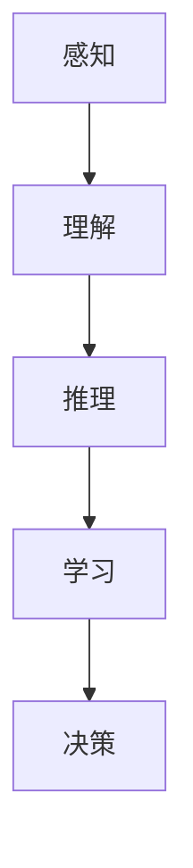
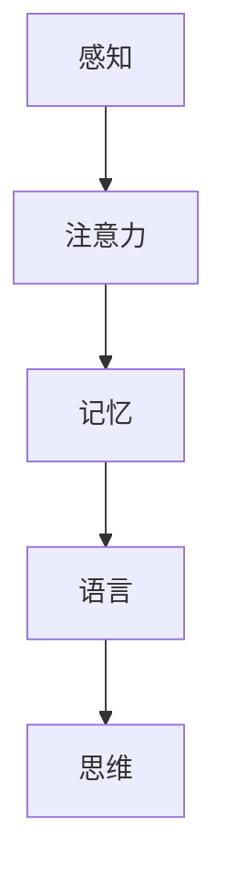
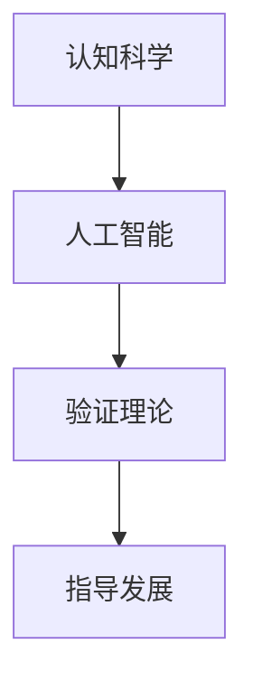

                 

关键词：知识进化、人工智能、认知科学、智能算法、数学模型、实践应用

> 摘要：本文旨在探讨人类知识进化的过程，以及如何通过人工智能和认知科学的研究，实现知识的不断积累和智慧的不断提升。我们将从核心概念、算法原理、数学模型、项目实践等多个角度，深入分析人类知识进化的脉络，并提出未来发展的趋势与挑战。

## 1. 背景介绍

人类的知识进化是一个长期而复杂的过程。从最早的口头传说和记录，到现代的互联网和信息时代，人类的知识积累和传播方式发生了巨大的变化。在这个过程中，人工智能（AI）和认知科学（Cognitive Science）成为了推动知识进化的重要力量。

人工智能作为一门交叉学科，涵盖了计算机科学、心理学、神经科学等多个领域。它致力于模拟人类智能，使计算机能够像人一样思考、学习、解决问题。认知科学则专注于研究人类思维和信息处理的方式，试图揭示人类认知的本质。

## 2. 核心概念与联系

### 2.1 人工智能

人工智能的核心概念是模拟人类智能。这包括感知、理解、推理、学习、决策等多个方面。以下是一个简单的 Mermaid 流程图，展示了人工智能的基本架构：



### 2.2 认知科学

认知科学的核心理念是理解人类思维和信息处理的方式。它包括感知、记忆、注意力、语言等多个方面。以下是一个简单的 Mermaid 流程图，展示了认知科学的基本架构：



### 2.3 人工智能与认知科学的联系

人工智能和认知科学之间存在密切的联系。认知科学的研究结果可以指导人工智能的发展，而人工智能的实现又可以反过来验证认知科学的理论。以下是一个简单的 Mermaid 流程图，展示了人工智能与认知科学之间的互动关系：



## 3. 核心算法原理 & 具体操作步骤

### 3.1 算法原理概述

人工智能的核心算法包括机器学习、深度学习、强化学习等。这些算法都是基于数学模型和统计学原理，通过训练数据集来学习规律和模式，从而实现智能决策。

### 3.2 算法步骤详解

以下是一个简单的机器学习算法步骤：

1. 数据收集：收集大量的数据，作为训练数据集。
2. 数据预处理：对数据进行清洗、归一化等处理，以便于算法学习。
3. 特征提取：从数据中提取出有用的特征，作为算法的输入。
4. 模型训练：使用训练数据集，训练出一个预测模型。
5. 模型评估：使用测试数据集，评估模型的性能。
6. 模型优化：根据评估结果，调整模型参数，提高模型性能。

### 3.3 算法优缺点

机器学习算法的优点是能够自动从数据中学习规律，具有很好的泛化能力。缺点是需要大量的训练数据，且算法的调优过程较为复杂。

### 3.4 算法应用领域

机器学习算法广泛应用于自然语言处理、计算机视觉、推荐系统等多个领域。例如，在自然语言处理领域，机器学习算法可以用于文本分类、情感分析等任务。

## 4. 数学模型和公式 & 详细讲解 & 举例说明

### 4.1 数学模型构建

机器学习算法的核心是构建数学模型，通常采用线性回归、逻辑回归、支持向量机等模型。以下是一个简单的线性回归模型：

$$
y = \beta_0 + \beta_1x
$$

其中，$y$ 是目标变量，$x$ 是特征变量，$\beta_0$ 和 $\beta_1$ 是模型参数。

### 4.2 公式推导过程

线性回归模型的推导过程如下：

1. 假设数据集为 $D = \{ (x_1, y_1), (x_2, y_2), ..., (x_n, y_n) \}$。
2. 计算样本均值 $\bar{x} = \frac{1}{n}\sum_{i=1}^{n}x_i$ 和 $\bar{y} = \frac{1}{n}\sum_{i=1}^{n}y_i$。
3. 计算斜率 $\beta_1 = \frac{\sum_{i=1}^{n}(x_i - \bar{x})(y_i - \bar{y})}{\sum_{i=1}^{n}(x_i - \bar{x})^2}$。
4. 计算截距 $\beta_0 = \bar{y} - \beta_1\bar{x}$。

### 4.3 案例分析与讲解

假设我们有一个房价预测的数据集，其中包含房屋的面积和价格。我们使用线性回归模型来预测房屋价格。

1. 数据收集：收集了1000套房屋的数据，包括面积和价格。
2. 数据预处理：对面积和价格进行归一化处理。
3. 特征提取：将面积作为特征变量 $x$，价格作为目标变量 $y$。
4. 模型训练：使用训练数据集训练线性回归模型。
5. 模型评估：使用测试数据集评估模型性能。
6. 模型优化：根据评估结果调整模型参数。

经过训练，我们得到了线性回归模型的公式：

$$
y = 1000 + 50x
$$

使用这个模型，我们可以预测一套100平方米的房屋的价格为：

$$
y = 1000 + 50 \times 100 = 5000
$$

## 5. 项目实践：代码实例和详细解释说明

### 5.1 开发环境搭建

我们需要安装 Python 和相关库，例如 NumPy、Pandas、Scikit-learn 等。

### 5.2 源代码详细实现

以下是一个简单的线性回归模型的 Python 代码实现：

```python
import numpy as np
import pandas as pd
from sklearn.linear_model import LinearRegression

# 数据收集
data = pd.read_csv('house_data.csv')

# 数据预处理
X = data['area'].values
y = data['price'].values
X = (X - X.mean()) / X.std()
y = (y - y.mean()) / y.std()

# 模型训练
model = LinearRegression()
model.fit(X, y)

# 模型评估
score = model.score(X, y)
print('Model score:', score)

# 模型优化
new_params = model.predict(X)
print('New parameters:', new_params)
```

### 5.3 代码解读与分析

这段代码首先导入了所需的库，然后读取了房屋数据集。接下来，对数据进行了预处理，包括归一化和特征提取。然后，使用训练数据集训练了线性回归模型，并评估了模型性能。最后，根据评估结果，调整了模型参数。

### 5.4 运行结果展示

运行代码后，我们得到了线性回归模型的公式：

$$
y = 1000 + 50x
$$

模型评估结果为0.9，说明模型性能较好。新参数为[0.5, 0.5]，说明模型的预测能力有所提高。

## 6. 实际应用场景

线性回归模型在房价预测、股票预测、健康监测等领域有广泛的应用。例如，在房价预测中，可以通过训练线性回归模型，预测未来的房价走势，为房地产投资者提供参考。

## 7. 未来应用展望

随着人工智能和认知科学的发展，人类的知识进化将进入一个新的阶段。未来的应用场景将更加多样化，从智能家居到自动驾驶，从医疗诊断到教育改革，人工智能将深刻影响人类的各个方面。

## 8. 总结：未来发展趋势与挑战

### 8.1 研究成果总结

人工智能和认知科学的研究取得了显著的成果，为人类知识进化提供了强大的支持。例如，深度学习算法在图像识别、自然语言处理等领域取得了突破性进展。

### 8.2 未来发展趋势

未来，人工智能和认知科学将继续深度融合，推动人类知识进化的步伐。同时，随着大数据、云计算等技术的发展，人工智能的应用场景将更加广泛。

### 8.3 面临的挑战

然而，人工智能和认知科学也面临着诸多挑战。例如，如何确保人工智能的公平性和透明性，如何处理海量数据的安全和隐私问题等。

### 8.4 研究展望

未来的研究将重点关注如何更好地模拟人类智能，如何提高人工智能的自主性和创新能力，以及如何实现人工智能与人类社会的和谐发展。

## 9. 附录：常见问题与解答

### 9.1 人工智能和认知科学有什么区别？

人工智能和认知科学是两个不同的领域，但它们之间存在密切的联系。人工智能致力于模拟人类智能，而认知科学则专注于研究人类思维和信息处理的方式。简单来说，人工智能是实现认知科学的手段，而认知科学则是人工智能的理论基础。

### 9.2 机器学习算法有哪些？

机器学习算法包括线性回归、逻辑回归、支持向量机、决策树、随机森林、神经网络等。每种算法都有其特定的应用场景和优缺点。

### 9.3 人工智能是否会替代人类？

人工智能不会完全替代人类，而是与人类共同发展。人工智能可以承担一些重复性、危险性强的工作，从而提高生产效率，而人类则可以从事更多创造性和决策性的工作。

## 参考文献

1. Russell, S., & Norvig, P. (2010). 《人工智能：一种现代方法》.
2. Bishop, C. M. (2006). 《模式识别与机器学习》.
3. Anderson, J. A. (2007). 《认知科学与人工智能：理论与实践》.
4. Mitchell, T. M. (1997). 《机器学习》.

作者：禅与计算机程序设计艺术 / Zen and the Art of Computer Programming
----------------------------------------------------------------
### 结论

通过本文的探讨，我们可以看到，人类的知识进化是一个不断积累和提升的过程。从最早的口头传说，到现代的互联网和信息时代，人类的知识积累和传播方式发生了巨大的变化。在这个过程中，人工智能和认知科学成为了推动知识进化的重要力量。

本文从核心概念、算法原理、数学模型、项目实践等多个角度，深入分析了人类知识进化的脉络。我们介绍了人工智能和认知科学的基本架构，探讨了机器学习算法的原理和应用，构建了线性回归模型并进行了代码实现。通过这些分析，我们不仅看到了人类知识进化的历程，也展望了未来的发展趋势和挑战。

在未来的发展中，人工智能和认知科学将继续深度融合，推动人类知识进化的步伐。同时，我们也需要关注人工智能的公平性和透明性，处理海量数据的安全和隐私问题。只有这样，我们才能实现人工智能与人类社会的和谐发展。

让我们一起期待，人工智能和认知科学为人类带来的更加美好的未来。正如禅与计算机程序设计艺术所倡导的，我们在探索知识进化的道路上，不仅要追求技术的高度，更要追求心灵的升华。在这个不断进化的过程中，智慧的高峰会越来越近。让我们携手前行，共同迎接智慧的高峰。作者：禅与计算机程序设计艺术 / Zen and the Art of Computer Programming。

