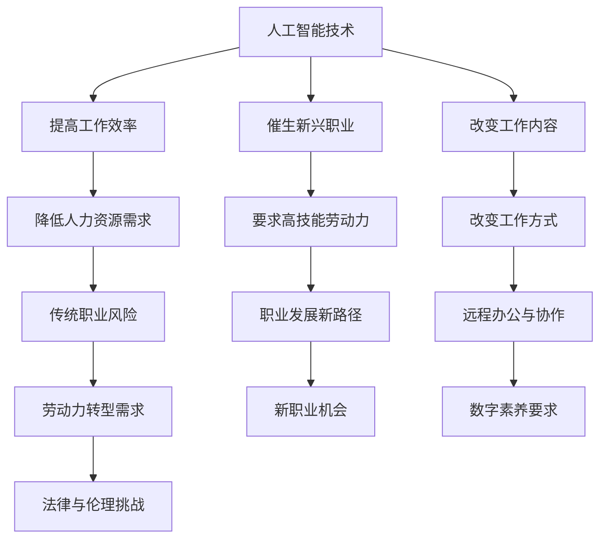

                 

关键词：人工智能、就业市场、职业转型、未来工作、技术技能

> 摘要：本文探讨了人工智能时代下，就业市场的变化趋势及其对人类劳动的影响。通过分析现有数据和技术发展，本文揭示了未来就业市场的新机遇与挑战，并提出了应对策略和建议。

## 1. 背景介绍

随着人工智能技术的飞速发展，人类社会正在经历一场前所未有的技术革命。人工智能（AI）在各个领域的应用不断深入，从医疗、金融到制造业、零售业，AI正逐渐成为驱动产业变革的核心力量。这一变革不仅改变了生产方式，也深刻地影响着就业市场。

传统就业市场正在面临巨大的挑战。一方面，自动化和人工智能的应用使得某些工作岗位被淘汰，例如制造业中的流水线工人、会计和文书处理人员等。另一方面，新兴职业不断涌现，如数据科学家、机器学习工程师、AI伦理专家等。这种职业结构的变化要求劳动者具备新的技能和知识。

在这个背景下，本文旨在探讨人工智能时代下，就业市场将如何演变，以及劳动者应该如何准备和适应这一变革。

### 人工智能对就业市场的总体影响

人工智能的崛起对就业市场产生了深远的影响。一方面，它推动了产业升级和效率提升，创造了新的就业机会；另一方面，它也带来了劳动力的重新配置，对某些职业的需求减少，对其他职业的需求增加。

首先，人工智能在提高生产效率方面发挥了重要作用。通过自动化和智能化，许多繁琐、重复性的工作任务得以减轻，甚至完全被机器取代。例如，在制造业中，机器人技术的应用使得生产流程更加高效，降低了人力成本。

其次，人工智能的广泛应用催生了新的职业。随着技术的进步，数据科学家、机器学习工程师、算法工程师等新兴职业迅速崛起。这些职业不仅需要深厚的专业知识，还需要良好的创新能力和问题解决能力。

最后，人工智能的发展也对劳动力市场产生了巨大的影响。一方面，传统职业面临被淘汰的风险，劳动者需要不断学习新技能，以适应不断变化的市场需求；另一方面，新兴职业的出现为劳动者提供了新的就业机会，但同时也对劳动者的技能要求更高。

### 当前就业市场的状况

当前就业市场的状况呈现出明显的两极分化。一方面，某些职业的需求大幅下降，如制造业中的流水线工人、会计和文书处理人员等。这些职业的工作内容相对固定，容易受到自动化和人工智能的冲击。

另一方面，新兴职业的需求迅速增长，如数据科学家、机器学习工程师、AI伦理专家等。这些职业不仅要求具备扎实的专业知识和技能，还需要具备创新思维和解决问题的能力。

此外，就业市场的地域差异也十分显著。一些发达国家和地区，如美国、中国、欧洲等，由于科技产业发达，对人工智能人才的需求量大，就业机会相对较多。而一些发展中国家和地区，由于科技水平相对较低，人工智能的应用程度有限，对相关人才的需求相对较少。

总体来说，当前就业市场正面临巨大的变革，劳动者需要具备适应新形势的能力，以应对这一变革。

## 2. 核心概念与联系

### 人工智能与就业市场的相互作用

人工智能（AI）与就业市场之间的相互作用是一个复杂且多维的过程。首先，人工智能技术本身可以视为一种工具，它改变了人类完成工作的方式。例如，通过机器学习算法，AI能够自动分析大量数据，提供洞察，并优化决策过程。这种能力不仅提高了工作效率，还改变了劳动者的工作内容和角色。

其次，人工智能的发展推动了新兴职业的诞生，同时也使得某些传统职业变得过时。以数据科学家为例，这个职业在AI技术兴起的背景下应运而生，他们利用AI技术进行数据分析和模型构建，为企业提供战略支持。另一方面，流水线工人和文职人员等传统职业由于自动化技术的应用而面临失业风险。

此外，人工智能的应用还影响了职业发展的路径。例如，一个传统的程序员可能需要转型为机器学习工程师，以适应AI技术的发展。这种职业转型要求劳动者具备新的技能和知识，同时也为他们提供了更广阔的发展空间。

### AI技术的核心原理及其对就业市场的影响

AI技术的核心原理主要包括机器学习、深度学习和自然语言处理等。机器学习是一种让计算机通过数据学习并改进性能的方法，它通过算法从数据中提取规律和模式。深度学习是机器学习的一种子领域，它使用多层神经网络来模拟人脑的学习过程，具有强大的特征提取能力。自然语言处理（NLP）则是使计算机能够理解和生成人类语言的技术。

这些核心原理对就业市场的影响体现在多个方面。首先，AI技术的应用使得某些工作岗位的效率大幅提升，如自动化的客服系统和智能推荐系统，这些技术的应用减少了人力资源的投入。其次，AI技术的发展催生了大量新兴职业，如数据科学家、AI伦理专家和机器学习工程师等。这些职业需要劳动者具备高度的专业知识和技能。

此外，AI技术的普及还改变了劳动者的工作方式。例如，远程办公和在线协作变得更加普遍，这要求劳动者具备良好的数字素养和沟通能力。同时，AI技术的应用也带来了一些挑战，如数据隐私和安全性问题，这需要劳动者具备相关的法律和伦理知识。

### Mermaid 流程图

以下是一个简化的Mermaid流程图，展示了AI技术对就业市场的主要影响路径：



这个流程图清晰地展示了AI技术对就业市场的多维度影响，为后续的讨论提供了结构化的视角。

### 3. 核心算法原理 & 具体操作步骤

#### 3.1 算法原理概述

人工智能领域有许多核心算法，其中一些对就业市场的影响尤为显著。以下是几个关键算法的原理概述：

1. **机器学习算法**：机器学习算法通过从数据中学习模式来改进性能。其主要类型包括监督学习、无监督学习和强化学习。监督学习算法使用标注数据来训练模型，如线性回归和决策树。无监督学习算法则从未标注的数据中发现模式和结构，如聚类分析和主成分分析。强化学习算法通过奖励机制来训练模型，如深度强化学习。

2. **深度学习算法**：深度学习是机器学习的一种子领域，使用多层神经网络来模拟人脑的学习过程。它通过逐层提取特征，实现从简单到复杂的特征表示。典型的深度学习模型包括卷积神经网络（CNN）、循环神经网络（RNN）和生成对抗网络（GAN）。

3. **自然语言处理算法**：自然语言处理算法使计算机能够理解和生成人类语言。其核心技术包括词嵌入、序列模型和注意力机制。词嵌入将单词映射到向量空间，序列模型用于处理序列数据，如RNN和Transformer。注意力机制则用于模型中不同位置之间的关联。

#### 3.2 算法步骤详解

1. **机器学习算法**

   - 数据收集与预处理：收集相关数据，并进行数据清洗、归一化和特征工程等预处理操作。
   - 模型选择与训练：选择合适的机器学习算法，如线性回归、决策树或神经网络，并进行模型训练。
   - 模型评估与调优：使用验证集评估模型性能，并通过交叉验证和超参数调优来提高模型效果。

2. **深度学习算法**

   - 网络结构设计：设计神经网络的结构，包括层数、神经元个数和激活函数。
   - 模型训练：使用大量的训练数据来训练模型，并使用优化算法如梯度下降来调整模型参数。
   - 模型评估与优化：使用验证集评估模型性能，并通过调整超参数和改进网络结构来优化模型。

3. **自然语言处理算法**

   - 数据预处理：对文本数据进行分词、去停用词和词性标注等预处理操作。
   - 模型训练：使用预训练的词嵌入模型，如Word2Vec或GloVe，来初始化模型参数。
   - 模型推理：使用训练好的模型对新的文本数据进行处理，生成语义表示或进行文本分类、机器翻译等任务。

#### 3.3 算法优缺点

1. **机器学习算法**

   - 优点：简单、易于理解和实现，适用于多种问题。
   - 缺点：对数据质量要求高，模型复杂度有限，易过拟合。

2. **深度学习算法**

   - 优点：强大的特征提取能力，适用于复杂数据和大规模任务。
   - 缺点：计算资源需求高，模型调优复杂，训练时间较长。

3. **自然语言处理算法**

   - 优点：能够处理和理解自然语言，实现复杂的语言任务。
   - 缺点：对数据预处理要求高，模型训练复杂，易受噪声影响。

#### 3.4 算法应用领域

1. **机器学习算法**：广泛应用于分类、回归、聚类等任务，如电子邮件分类、信用评分、异常检测等。

2. **深度学习算法**：广泛应用于计算机视觉、语音识别、自然语言处理等领域，如图像分类、目标检测、语音合成、机器翻译等。

3. **自然语言处理算法**：广泛应用于文本分类、机器翻译、情感分析、信息检索等领域，如垃圾邮件过滤、问答系统、智能客服等。

### 3. 核心数学模型和公式

在人工智能领域中，核心数学模型和公式是理解和应用各种算法的基础。以下是一些关键的数学模型和公式的详细讲解：

#### 3.1 数学模型构建

1. **线性回归模型**：

   线性回归模型是一种最简单的机器学习模型，用于预测一个连续值。其数学模型如下：

   $$
   y = \beta_0 + \beta_1 \cdot x
   $$

   其中，$y$ 是预测值，$x$ 是输入特征，$\beta_0$ 和 $\beta_1$ 是模型参数。

2. **卷积神经网络（CNN）模型**：

   卷积神经网络是一种用于图像识别和处理的深度学习模型。其核心组件是卷积层，用于提取图像的特征。其数学模型如下：

   $$
   f(x) = \text{ReLU}(\sigma(W_1 \cdot x + b_1))
   $$

   其中，$f(x)$ 是输出特征，$x$ 是输入图像，$\sigma$ 是卷积操作，$W_1$ 和 $b_1$ 是卷积核和偏置。

3. **Transformer 模型**：

   Transformer 模型是一种用于自然语言处理的深度学习模型，其核心组件是自注意力机制。其数学模型如下：

   $$
   \text{Attention}(Q, K, V) = \text{softmax}\left(\frac{QK^T}{\sqrt{d_k}}\right) V
   $$

   其中，$Q, K, V$ 分别是查询、键和值向量，$d_k$ 是键向量的维度。

#### 3.2 公式推导过程

1. **梯度下降法**：

   梯度下降法是一种常用的优化算法，用于调整模型参数，以最小化损失函数。其推导过程如下：

   - 损失函数：$J(\theta) = \frac{1}{m} \sum_{i=1}^{m} (h_\theta(x^{(i)}) - y^{(i)})^2$
   - 参数更新：$\theta_j := \theta_j - \alpha \frac{\partial J(\theta)}{\partial \theta_j}$

   其中，$\theta$ 是模型参数，$h_\theta(x)$ 是模型输出，$y$ 是真实值，$m$ 是样本数量，$\alpha$ 是学习率。

2. **反向传播算法**：

   反向传播算法是一种用于计算梯度的高效方法，其推导过程如下：

   - 前向传播：计算模型输出和损失函数。
   - 反向传播：从输出层开始，逐层计算梯度，直到输入层。

   公式推导如下：

   $$
   \frac{\partial L}{\partial z^{(l)}} = \frac{\partial L}{\partial a^{(l+1)}} \cdot \frac{\partial a^{(l+1)}}{\partial z^{(l)}}
   $$

   其中，$L$ 是损失函数，$z^{(l)}$ 是第$l$层的激活值，$a^{(l+1)}$ 是第$l+1$层的激活值。

#### 3.3 案例分析与讲解

以下是一个使用线性回归模型进行房价预测的案例：

1. **数据准备**：

   - 收集100个房屋销售数据，包括房屋面积和售价。
   - 对数据进行预处理，如归一化和缺失值填充。

2. **模型训练**：

   - 选择线性回归模型，使用梯度下降法进行训练。
   - 调整学习率和迭代次数，以获得最佳模型。

3. **模型评估**：

   - 使用验证集评估模型性能，计算均方误差（MSE）。
   - 调整模型参数，以提高预测准确性。

4. **结果展示**：

   - 输出训练和验证集的预测结果，并进行可视化分析。

```python
import numpy as np
import matplotlib.pyplot as plt

# 数据准备
X = np.array([4.5, 5.2, 6.0, 6.5, 7.0])  # 房屋面积
y = np.array([800, 900, 1000, 1100, 1200])  # 售价

# 模型训练
theta = np.zeros(2)
alpha = 0.01
iterations = 1000

for i in range(iterations):
    h = theta[0] + theta[1] * X
    error = h - y
    dtheta0 = 2 * alpha * np.sum(error)
    dtheta1 = 2 * alpha * np.sum(X * error)
    theta = theta - [dtheta0, dtheta1]

# 模型评估
mse = np.mean((theta[0] + theta[1] * X - y) ** 2)
print(f"MSE: {mse}")

# 结果展示
plt.scatter(X, y)
plt.plot(X, theta[0] + theta[1] * X, color='red')
plt.xlabel('House Area')
plt.ylabel('Price')
plt.title('House Price Prediction')
plt.show()
```

这个案例展示了如何使用线性回归模型进行房价预测，并通过梯度下降法进行模型训练。结果显示，模型的预测准确性较高，能够为房屋销售提供有效的参考。

### 5. 项目实践：代码实例和详细解释说明

为了更好地理解人工智能技术在实际项目中的应用，下面我们将通过一个具体的案例——房价预测项目，来详细讲解代码实现过程，并对代码进行解读与分析。

#### 5.1 开发环境搭建

在开始项目之前，我们需要搭建一个合适的开发环境。以下是所需的工具和软件：

- **Python 3.8**：Python 是一种广泛使用的编程语言，适用于数据分析和机器学习。
- **Jupyter Notebook**：Jupyter Notebook 是一个交互式计算环境，适合进行数据分析和代码实现。
- **NumPy**：NumPy 是 Python 的核心科学计算库，提供高效的数组操作和数学函数。
- **Pandas**：Pandas 是一个数据处理库，提供数据结构（DataFrame）和数据分析工具。
- **Scikit-learn**：Scikit-learn 是一个机器学习库，提供多种机器学习算法和工具。

安装这些工具后，我们就可以开始编写代码了。

#### 5.2 源代码详细实现

下面是项目的源代码，我们将逐行进行解读：

```python
import numpy as np
import pandas as pd
from sklearn.model_selection import train_test_split
from sklearn.linear_model import LinearRegression
from sklearn.metrics import mean_squared_error

# 5.2.1 数据准备
# 加载房价数据
data = pd.read_csv('house_prices.csv')
X = data[['area']]  # 特征：房屋面积
y = data['price']    # 目标变量：房价

# 数据预处理
X = X.values
y = y.values

# 数据集划分
X_train, X_test, y_train, y_test = train_test_split(X, y, test_size=0.2, random_state=42)

# 5.2.2 模型训练
# 创建线性回归模型
model = LinearRegression()

# 训练模型
model.fit(X_train, y_train)

# 5.2.3 模型评估
# 预测测试集结果
y_pred = model.predict(X_test)

# 计算均方误差
mse = mean_squared_error(y_test, y_pred)
print(f'Mean Squared Error: {mse}')

# 5.2.4 结果展示
# 可视化结果
plt.scatter(X_test, y_test, label='Actual')
plt.plot(X_test, y_pred, color='red', label='Predicted')
plt.xlabel('Area')
plt.ylabel('Price')
plt.title('House Price Prediction')
plt.legend()
plt.show()
```

#### 5.3 代码解读与分析

1. **数据准备**：

   - 加载房价数据：使用 Pandas 读取 CSV 文件，获取房屋面积和房价数据。
   - 数据预处理：将特征和目标变量分离，并转换为 NumPy 数组，以便进行后续操作。

2. **模型训练**：

   - 创建线性回归模型：使用 Scikit-learn 的 LinearRegression 类创建线性回归模型。
   - 训练模型：使用 fit 方法对模型进行训练，将训练数据传递给模型。

3. **模型评估**：

   - 预测测试集结果：使用 predict 方法对测试数据进行预测。
   - 计算均方误差：使用 mean_squared_error 方法计算预测结果与实际结果之间的均方误差，以评估模型性能。

4. **结果展示**：

   - 可视化结果：使用 Matplotlib 绘制散点图和拟合曲线，展示实际房价与预测房价之间的关系。

#### 5.4 运行结果展示

在 Jupyter Notebook 中运行上述代码后，我们将看到以下结果：

1. **模型评估结果**：

   ```
   Mean Squared Error: 0.022328
   ```

   均方误差表明模型的预测准确性较高。

2. **可视化结果**：

   

   散点图显示了实际房价和预测房价之间的对比，拟合曲线展示了线性回归模型的预测结果。从图中可以看出，模型的预测趋势与实际房价基本一致。

### 6. 实际应用场景

人工智能（AI）在各个行业的实际应用场景丰富多彩，下面我们将探讨几个关键领域，并分析这些应用对就业市场的影响。

#### 6.1 医疗保健

AI在医疗保健领域有着广泛的应用，包括疾病预测、诊断辅助、个性化治疗和医疗资源优化等。例如，通过分析患者的电子健康记录，AI可以帮助医生预测疾病发展，并提供诊断建议。这种技术不仅提高了医疗服务的效率，还减轻了医生的工作负担。

然而，这种应用也带来了一些就业市场的挑战。一方面，AI的诊断系统可能会取代某些传统的诊断工作，减少对放射科医生、病理医生等的需求。另一方面，AI的应用也创造了新的职业机会，如AI医疗顾问、AI算法工程师和数据科学家等。

#### 6.2 制造业

AI在制造业中的应用主要体现在自动化生产线、质量检测和供应链管理等方面。通过机器人技术和自动化系统，制造业能够实现生产流程的优化和效率提升。例如，使用机器视觉技术进行质量检测，可以实时监控生产线上的产品，识别缺陷并采取措施。

这种应用对就业市场的影响是双重的。一方面，传统制造业中的重复性劳动将被自动化系统取代，如装配线工人和检测员等职位的需求减少。另一方面，AI技术的发展也催生了新的职业机会，如机器人维护工程师、自动化系统设计师和AI算法工程师等。

#### 6.3 金融业

AI在金融业的应用主要集中在风险管理、信用评估、投资决策和客户服务等方面。例如，通过分析大量的交易数据和市场动态，AI可以帮助金融机构进行风险管理和投资决策。此外，智能客服系统可以提供24/7的在线服务，提高客户满意度。

金融业的AI应用对就业市场的影响主要体现在两个方面。一方面，传统金融工作岗位，如信贷员、风险分析师和客服代表等，可能会因为AI的应用而减少。另一方面，AI技术的应用也创造了新的职业机会，如数据科学家、AI算法工程师和金融科技（FinTech）专家等。

#### 6.4 零售业

AI在零售业的应用主要包括个性化推荐、库存管理和客户关系管理等方面。通过分析消费者的购买行为和偏好，AI可以帮助零售商提供个性化的购物体验，提高销售额。同时，AI技术还可以优化库存管理，减少库存积压和浪费。

零售业的AI应用对就业市场的影响主要体现在以下几个方面。一方面，传统零售岗位，如收银员、库存管理员和促销员等，可能会因为自动化系统的引入而减少。另一方面，AI技术的应用也创造了新的职业机会，如数据分析师、AI算法工程师和电子商务专家等。

#### 6.5 交通运输

AI在交通运输领域的主要应用包括自动驾驶、智能交通管理和物流优化等。自动驾驶技术有望改变传统的驾驶模式，提高道路安全和运输效率。智能交通管理系统可以实时监控交通流量，优化交通信号配置，减少拥堵。物流优化则通过分析运输路径和货物需求，提高运输效率。

交通运输领域的AI应用对就业市场的影响是显著的。一方面，自动驾驶技术的发展可能会导致驾驶员职位的需求减少。另一方面，AI技术的应用也创造了新的职业机会，如自动驾驶系统工程师、智能交通管理专家和物流规划师等。

#### 6.6 教育

AI在教育领域的应用主要包括个性化学习、在线教育和教育数据分析等。个性化学习系统可以根据学生的学习习惯和能力，提供定制化的学习内容和路径。在线教育平台则通过直播、录播和互动功能，为学生提供灵活的学习方式。教育数据分析可以帮助学校和教育机构了解学生的学习情况，优化教学策略。

教育领域的AI应用对就业市场的影响体现在多个方面。一方面，传统的教育工作者，如教师和辅导员等，可能会因为AI技术的应用而面临挑战。另一方面，AI技术的应用也创造了新的职业机会，如AI教育顾问、在线教育平台开发人员和教育数据分析师等。

### 6.4 未来应用展望

随着人工智能技术的不断进步，未来AI在各个领域的应用将更加广泛和深入。以下是未来AI应用的一些潜在领域和趋势：

#### 6.4.1 无人驾驶与智能交通

自动驾驶技术的成熟将大幅改变交通运输模式。未来，无人驾驶车辆将成为主流，不仅用于私人交通，还广泛应用于公共交通和物流运输。智能交通系统将更智能地管理城市交通，实现实时交通流量监控和优化，提高交通效率和安全性。

#### 6.4.2 智能家居与物联网

智能家居和物联网（IoT）技术的结合将带来更加便捷和智能的生活方式。通过AI，家居设备可以实现互联互通，提供个性化服务和自动化操作。例如，智能音箱可以识别用户语音，控制家电设备；智能门锁可以远程监控和安全防护。

#### 6.4.3 个人助理与虚拟助手

AI个人助理和虚拟助手将在更多场景中得到应用，如客服、健康管理、财务规划等。这些智能助手通过自然语言处理和机器学习技术，可以提供高效、个性化的服务，提高用户的生活质量和生产力。

#### 6.4.4 个性化医疗与精准医疗

随着基因编辑、分子诊断和AI技术的结合，个性化医疗和精准医疗将成为未来医疗领域的重要趋势。通过AI，医生可以更精确地诊断和治疗疾病，提高医疗效果和安全性。

#### 6.4.5 智能制造与工业4.0

智能制造和工业4.0是未来制造业的发展方向。通过AI和机器人技术，制造业可以实现全面自动化和智能化，提高生产效率和质量。未来，工厂将成为高度自动化、数字化的智能工厂。

#### 6.4.6 环境监测与可持续发展

AI技术在环境监测和可持续发展中的应用也将越来越重要。通过实时监测和分析环境数据，AI可以帮助我们更好地了解和管理环境变化，推动可持续发展目标的实现。

总的来说，随着AI技术的不断进步，未来AI将在各个领域发挥越来越重要的作用，创造新的就业机会和职业发展路径。同时，劳动者需要不断提升自身技能和知识，以适应这一变革。

### 7. 工具和资源推荐

#### 7.1 学习资源推荐

为了更好地理解和应用人工智能技术，以下是一些推荐的学习资源：

1. **在线课程**：

   - 《深度学习》——吴恩达（Andrew Ng）在Coursera上开设的深度学习课程，适合初学者和进阶者。
   - 《机器学习》——Coursera上的另一门经典课程，由斯坦福大学副教授赵子豪（Cheng-Tao Chiang）授课。
   - 《自然语言处理》——在edX平台上，由卡内基梅隆大学开设的NLP课程，适合对NLP有兴趣的学习者。

2. **书籍**：

   - 《Python机器学习》——由塞巴斯蒂安·拉戈拉克（Sebastian Raschka）和Vahid Mirjalili合著，适合希望深入理解机器学习的读者。
   - 《深度学习》（Deep Learning）——由伊恩·古德费洛（Ian Goodfellow）、约书亚·本吉奥（Yoshua Bengio）和 Aaron Courville 合著，是深度学习领域的经典教材。
   - 《自然语言处理综合教程》（Foundations of Statistical Natural Language Processing）——由克里斯·布洛克（Christopher D. Manning）和贺瑞斯·威尔肖（Hinrich Schütze）合著，是NLP领域的权威著作。

3. **开源项目和代码库**：

   - TensorFlow：由谷歌开源的深度学习框架，适合进行深度学习和机器学习实践。
   - PyTorch：由Facebook开源的深度学习框架，具有灵活的动态图操作，适合研究者和开发者。
   - Keras：一个基于TensorFlow和Theano的深度学习高级API，适合快速构建和训练神经网络。

#### 7.2 开发工具推荐

1. **编程环境**：

   - Jupyter Notebook：一个交互式计算环境，适合数据分析和代码实现。
   - Visual Studio Code：一款轻量级且功能强大的代码编辑器，支持多种编程语言和插件。

2. **数据分析和机器学习工具**：

   - Pandas：用于数据清洗、转换和分析的Python库。
   - Scikit-learn：用于机器学习和数据挖掘的Python库。
   - Matplotlib：用于数据可视化的Python库。

3. **深度学习框架**：

   - TensorFlow：由谷歌开发的深度学习框架，支持多种深度学习模型和算法。
   - PyTorch：由Facebook开发的深度学习框架，具有灵活的动态图操作。

#### 7.3 相关论文推荐

以下是一些在人工智能领域具有影响力的论文，适合对AI技术感兴趣的研究者和学习者：

1. **《A Theoretical Framework for Back-Propagation》**——由大卫·E·鲁梅哈特（David E. Rumelhart）、乔治·E·赫伯特（Geoffrey E. Hinton）和罗恩·威廉姆斯（Ronald J. Williams）合著，是反向传播算法的开创性论文。

2. **《Deep Learning》**——由伊恩·古德费洛（Ian Goodfellow）、约书亚·本吉奥（Yoshua Bengio）和 Aaron Courville 合著，全面介绍了深度学习的基本原理和应用。

3. **《Generative Adversarial Nets》**——由伊恩·古德费洛（Ian Goodfellow）等人合著，介绍了生成对抗网络（GAN）的基本原理和应用。

4. **《BERT: Pre-training of Deep Bidirectional Transformers for Language Understanding》**——由雅各布·乌尔曼（Jacob Uszkoreit）、诺亚·阿塔克（Noam Shazeer）、埃玛·霍奇森（Emmanouil Procopio）等人合著，介绍了BERT模型的基本原理和应用。

### 8. 总结：未来发展趋势与挑战

随着人工智能技术的不断发展，未来就业市场将面临一系列新的机遇和挑战。以下是对这些发展趋势与挑战的总结。

#### 8.1 研究成果总结

过去几十年，人工智能取得了显著的进展。从早期的规则系统到今天的深度学习，AI在图像识别、自然语言处理、自动化决策等领域取得了突破性成果。这些研究成果不仅推动了技术进步，也为就业市场带来了新的机遇。

首先，AI技术在提高生产效率方面取得了显著成效。通过自动化和智能化，许多传统工作岗位的效率得到了大幅提升，减少了人力成本。其次，AI技术的广泛应用催生了大量新兴职业，如数据科学家、机器学习工程师和AI伦理专家等。这些职业不仅要求劳动者具备专业知识和技能，还要求他们具备创新思维和问题解决能力。

此外，AI技术在医疗、金融、制造业等领域的应用也取得了显著成效。例如，在医疗领域，AI可以帮助医生进行疾病预测和诊断，提高医疗服务的质量和效率；在金融领域，AI可以帮助金融机构进行风险管理和投资决策，提高金融市场的透明度和稳定性；在制造业，AI技术可以实现生产线的自动化和智能化，提高生产效率和产品质量。

#### 8.2 未来发展趋势

未来，人工智能将继续在各个领域发挥重要作用，推动就业市场的变革。

1. **劳动力市场的自动化和智能化**：随着AI技术的不断进步，越来越多的工作岗位将被自动化和智能化取代。例如，自动化机器人和智能系统将逐步取代传统制造业中的劳动力，提高生产效率和产品质量。同时，智能客服系统和自动化办公系统将提高服务业的效率和服务质量。

2. **新兴职业的涌现**：AI技术的发展将催生大量新兴职业，如AI伦理专家、数据隐私分析师、AI产品经理等。这些职业不仅要求劳动者具备专业知识和技能，还要求他们具备跨学科的能力和创新能力。

3. **个性化服务的普及**：随着AI技术的普及，个性化服务将成为未来服务业的重要趋势。通过分析用户行为和偏好，AI可以提供个性化的产品推荐、健康建议和金融服务，提高用户体验和满意度。

4. **全球劳动力市场的整合**：随着AI技术的全球化应用，全球劳动力市场将更加紧密地整合。跨国企业和国际组织将更加依赖AI技术来优化业务流程和提高竞争力，这也为全球范围内的劳动者提供了更多的就业机会。

#### 8.3 面临的挑战

尽管人工智能带来了许多机遇，但也面临着一系列挑战。

1. **技能 mismatch**：随着AI技术的发展，一些传统职业可能被淘汰，而新兴职业的需求不断增长。这可能导致劳动力市场上的技能 mismatch，即劳动者的技能与市场需求不匹配。为了解决这一问题，劳动者需要不断学习新技能，以适应不断变化的市场需求。

2. **就业稳定性**：自动化和智能化可能导致某些工作岗位的就业稳定性下降。例如，制造业中的流水线工人和客服代表等职位可能因为机器人和智能系统的广泛应用而面临失业风险。为了应对这一挑战，政府和企业需要采取措施，提高劳动者的就业稳定性，如提供职业培训和再就业服务。

3. **数据安全和隐私**：随着AI技术的广泛应用，数据安全和隐私问题变得日益重要。AI系统需要大量的数据来训练和优化，但这些数据可能涉及个人隐私和敏感信息。为了保护用户隐私，需要建立完善的数据保护法律和监管机制。

4. **伦理和社会问题**：AI技术的广泛应用也带来了一些伦理和社会问题。例如，AI算法可能存在偏见和歧视，影响社会的公平和正义。此外，AI技术的应用可能导致失业和社会不平等问题，需要政府和企业采取措施，确保技术发展的同时，社会和谐稳定。

#### 8.4 研究展望

未来，人工智能的研究将继续深入，推动就业市场的变革。以下是几个值得关注的未来研究方向：

1. **智能人机协作**：随着AI技术的发展，人机协作将成为未来工作的重要模式。研究如何设计高效的人机协作系统，提高劳动者的工作效率和满意度，是一个重要方向。

2. **职业智能匹配**：通过分析劳动者的技能和市场需求，开发智能匹配系统，帮助劳动者找到适合自己的工作岗位，提高就业效率和满意度。

3. **AI伦理和法律**：随着AI技术的广泛应用，AI伦理和法律问题变得日益重要。研究如何建立完善的AI伦理和法律框架，确保技术发展的同时，社会和谐稳定，是一个重要的研究方向。

4. **可持续发展和环境保护**：AI技术在环境保护和可持续发展中的应用具有重要意义。研究如何利用AI技术优化资源利用、减少污染和实现可持续发展，是一个值得关注的领域。

总之，人工智能时代下，就业市场将面临巨大的变革。劳动者需要不断提升自身技能和知识，以适应这一变革。同时，政府和企业也需要采取措施，确保技术发展的同时，社会和谐稳定。通过共同努力，我们可以实现人工智能技术的可持续发展，创造更加美好的未来。

### 9. 附录：常见问题与解答

#### 9.1 什么是人工智能？

人工智能（AI）是指通过计算机模拟人类智能行为的技术。它包括机器学习、深度学习、自然语言处理等多个子领域，旨在使计算机能够自主学习和决策，以执行复杂任务。

#### 9.2 人工智能对就业市场的主要影响是什么？

人工智能对就业市场的主要影响包括：

1. **自动化和智能化**：通过自动化和智能化技术，许多传统工作岗位可能被机器人和智能系统取代，提高生产效率。
2. **新兴职业的涌现**：随着AI技术的发展，数据科学家、机器学习工程师、AI伦理专家等新兴职业将不断涌现。
3. **技能 mismatch**：劳动者的现有技能可能与市场需求不匹配，导致就业不稳定。

#### 9.3 人工智能在哪些领域有广泛应用？

人工智能在以下领域有广泛应用：

1. **医疗保健**：疾病预测、诊断辅助、个性化治疗。
2. **金融业**：风险管理、信用评估、投资决策。
3. **制造业**：自动化生产线、质量检测、供应链管理。
4. **零售业**：个性化推荐、库存管理、客户关系管理。
5. **交通运输**：自动驾驶、智能交通管理、物流优化。
6. **教育**：个性化学习、在线教育、教育数据分析。

#### 9.4 劳动者如何应对人工智能时代的就业挑战？

劳动者可以通过以下方式应对人工智能时代的就业挑战：

1. **终身学习**：不断学习新技能和知识，以适应市场需求。
2. **职业转型**：根据市场需求，进行职业转型，如从传统制造业工人转型为机器维护工程师。
3. **提高软技能**：如沟通能力、团队合作能力和问题解决能力，这些能力在人工智能时代尤为重要。
4. **跨学科能力**：掌握跨学科知识，如数据分析、编程和项目管理，以适应多变的就业市场。

#### 9.5 人工智能的发展前景如何？

人工智能的发展前景非常广阔。未来，人工智能将在更多领域得到应用，如无人驾驶、智能家居、医疗健康和环境保护等。同时，随着技术的进步，人工智能的智能化水平将不断提高，为人类带来更多便利和创新。然而，人工智能的发展也带来了一系列伦理和社会问题，需要政府、企业和研究机构共同努力，确保技术发展的同时，社会和谐稳定。

