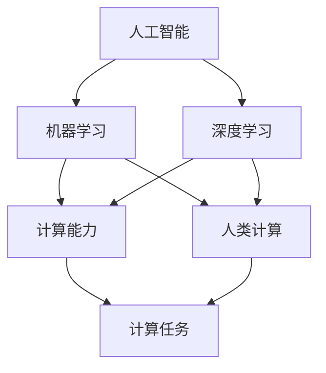

                 

关键词：人工智能，就业市场，技能培训，未来发展趋势，计算领域，职业发展

> 摘要：本文旨在探讨人工智能时代下的未来就业市场趋势，分析人类计算在AI领域的角色和重要性，以及技能培训在这一变革中的关键作用。通过深入剖析核心概念、算法原理、数学模型及实际应用场景，我们试图为读者呈现一幅全面而清晰的AI时代职业发展图景。

## 1. 背景介绍

随着人工智能技术的迅猛发展，各行各业都在经历一场前所未有的变革。从智能家居到自动驾驶，从医疗诊断到金融分析，人工智能正以惊人的速度渗透到我们的日常生活和工作之中。然而，这一变革不仅带来了技术上的飞跃，也对就业市场产生了深远的影响。传统职业正逐渐被智能化取代，同时新的职业机会也在不断涌现。

在这个背景下，人类计算成为了一个热门话题。人类计算指的是人类在计算任务中发挥的作用，它不仅仅是简单的劳动替代，更是智慧与创新的重要体现。在AI时代，如何把握人类计算的优势，实现技能的转型升级，成为了我们不得不面对的重要问题。

### 当前就业市场的变化

近年来，就业市场发生了显著的变化。一方面，自动化和智能化技术使得一些传统岗位逐渐消失，例如流水线工人、电话客服等。另一方面，新的职业机会也在不断出现，例如数据科学家、机器学习工程师、AI伦理学家等。这种变化不仅影响了求职者的就业选择，也对企业和组织的招聘策略提出了新的要求。

### 人工智能对就业的影响

人工智能的兴起给就业市场带来了双重影响。一方面，它提高了生产效率和创新能力，创造了大量的新岗位。另一方面，它也使得一些低技能岗位面临失业的风险。例如，自动化技术在制造业中的应用，使得一些体力劳动者的需求减少。然而，人工智能同样需要人类进行设计、开发、维护和监管，这为具备相关技能的人才提供了广阔的就业前景。

### 人类计算的重要性

在人工智能时代，人类计算的重要性愈发凸显。人类具备的创造力、情感智能、复杂问题解决能力等，是当前AI技术无法替代的。例如，在医疗诊断中，医生的经验和直觉往往比机器更具优势。因此，如何发挥人类计算的优势，实现与AI的协同工作，成为了人工智能时代的一个关键问题。

## 2. 核心概念与联系

### 核心概念

在讨论人类计算时，需要理解以下几个核心概念：

1. **人工智能**：人工智能是指计算机系统通过模拟人类智能行为，实现自主学习和智能决策的能力。
2. **机器学习**：机器学习是人工智能的一个分支，通过数据训练模型，使其具备自动学习和改进的能力。
3. **深度学习**：深度学习是机器学习的一种方法，通过多层神经网络进行数据建模和特征提取。
4. **计算能力**：计算能力指的是计算机在处理数据和信息时的能力，包括计算速度、存储容量、算法效率等。
5. **人类计算**：人类计算是指人类在计算任务中发挥的作用，包括逻辑推理、问题解决、创新思维等。

### 概念之间的联系

这些核心概念之间有着密切的联系：

- **人工智能**为人类计算提供了技术基础，使其能够通过机器学习进行自动化和智能化。
- **机器学习**和**深度学习**则是人工智能实现的具体方法，通过不断优化算法和模型，提高计算效率和准确性。
- **计算能力**决定了人工智能系统的性能，而**人类计算**则在此基础上发挥其独特优势。

### Mermaid 流程图

为了更清晰地展示这些概念之间的联系，我们可以使用Mermaid流程图进行说明：



在这个流程图中，我们可以看到人工智能作为整体框架，其下分为机器学习和深度学习，而这两者又与计算能力和人类计算有着直接的联系，最终指向计算任务，体现了人类计算在AI时代的核心地位。

## 3. 核心算法原理 & 具体操作步骤

### 3.1 算法原理概述

在人工智能领域，核心算法是机器学习和深度学习的基础。这些算法通过模拟人类大脑的工作机制，实现了数据的自动学习和特征提取。以下是几种常见的人工智能核心算法及其原理概述：

1. **线性回归**：线性回归是一种简单的统计方法，通过建立自变量和因变量之间的线性关系，进行数据建模。
2. **逻辑回归**：逻辑回归是线性回归的扩展，常用于分类问题，通过将线性组合映射到概率分布。
3. **决策树**：决策树通过一系列规则对数据进行分割，每个节点代表一个特征，叶子节点代表分类结果。
4. **随机森林**：随机森林是决策树的集成方法，通过构建多棵决策树并投票决定最终结果，提高分类和回归的准确性。
5. **支持向量机（SVM）**：SVM通过寻找最优超平面，将数据分成不同的类别，适用于高维数据的分类问题。

### 3.2 算法步骤详解

下面以**决策树**算法为例，详细讲解其操作步骤：

1. **特征选择**：首先，选择一个最佳特征进行分割，通常使用信息增益、基尼系数等指标来评估特征的重要性。
2. **数据分割**：根据选定的特征，将数据集分割成子集，每个子集对应一个特征值的范围。
3. **递归构建**：对每个子集继续进行特征选择和数据分割，直到达到预定的深度或者满足停止条件（例如，子集大小小于阈值）。
4. **分类结果**：最后，根据决策树的结构，对新的数据进行分类，从根节点开始，沿着分割路径到达叶子节点，得到分类结果。

### 3.3 算法优缺点

**决策树**算法具有以下优缺点：

- **优点**：
  - 简单易懂，易于实现和解释。
  - 可以处理高维数据，适用于各种类型的数据。
  - 能够处理非线性数据关系，通过树的结构灵活适应数据分布。

- **缺点**：
  - 易于过拟合，当树过于复杂时，模型的泛化能力会降低。
  - 当特征数量过多时，决策树构建的时间复杂度会显著增加。

### 3.4 算法应用领域

**决策树**算法在多个领域都有广泛应用：

- **金融风控**：用于信用评分、欺诈检测等。
- **医疗诊断**：用于疾病预测和诊断。
- **市场营销**：用于客户分类和细分市场。
- **自然语言处理**：用于文本分类和情感分析。

通过核心算法原理的详细讲解，我们可以更好地理解人工智能技术的工作机制，并为实际应用提供指导。

## 4. 数学模型和公式 & 详细讲解 & 举例说明

### 4.1 数学模型构建

在人工智能领域，数学模型是算法的核心。以下介绍几种常用的数学模型：

1. **线性回归模型**：用于预测连续值。
2. **逻辑回归模型**：用于预测概率。
3. **决策树模型**：用于分类和回归问题。

#### 线性回归模型

线性回归模型的基本形式为：

\[ y = \beta_0 + \beta_1x_1 + \beta_2x_2 + ... + \beta_nx_n + \epsilon \]

其中，\( y \) 是因变量，\( x_1, x_2, ..., x_n \) 是自变量，\( \beta_0, \beta_1, \beta_2, ..., \beta_n \) 是模型参数，\( \epsilon \) 是误差项。

#### 逻辑回归模型

逻辑回归模型用于二分类问题，其公式为：

\[ P(y=1) = \frac{1}{1 + e^{-(\beta_0 + \beta_1x_1 + \beta_2x_2 + ... + \beta_nx_n )}} \]

其中，\( P(y=1) \) 是因变量为1的概率。

#### 决策树模型

决策树模型通过一系列条件判断进行数据分割，每个节点表示一个特征，边表示特征取值。决策树的生成过程可以使用ID3、C4.5等算法实现。

### 4.2 公式推导过程

#### 线性回归模型的参数估计

线性回归模型中，参数 \( \beta_0, \beta_1, \beta_2, ..., \beta_n \) 的估计可以通过最小二乘法实现。具体步骤如下：

1. **建立损失函数**：损失函数通常采用平方误差损失函数：

\[ J(\theta) = \frac{1}{2m} \sum_{i=1}^{m} (h_\theta(x^{(i)}) - y^{(i)})^2 \]

其中，\( h_\theta(x) = \theta_0 + \theta_1x_1 + \theta_2x_2 + ... + \theta_nx_n \) 是预测函数，\( m \) 是样本数量。

2. **求导并令导数为零**：对损失函数关于每个参数求导，并令导数为零，得到：

\[ \frac{\partial J(\theta)}{\partial \theta_j} = 0 \]

3. **求解参数**：将上述方程组求解，得到参数 \( \theta_0, \theta_1, \theta_2, ..., \theta_n \) 的估计值。

#### 逻辑回归模型的参数估计

逻辑回归模型的参数估计通常采用最大似然估计法（MLE）。具体步骤如下：

1. **建立似然函数**：

\[ L(\theta) = \prod_{i=1}^{m} P(y^{(i)}=1 | x^{(i)}, \theta) \]

2. **取对数似然函数**：

\[ \ln L(\theta) = \sum_{i=1}^{m} \ln P(y^{(i)}=1 | x^{(i)}, \theta) \]

3. **求导并令导数为零**：对对数似然函数关于每个参数求导，并令导数为零，得到：

\[ \frac{\partial \ln L(\theta)}{\partial \theta_j} = 0 \]

4. **求解参数**：将上述方程组求解，得到参数 \( \theta_0, \theta_1, \theta_2, ..., \theta_n \) 的估计值。

### 4.3 案例分析与讲解

#### 案例一：线性回归

假设我们有一个简单的线性回归问题，数据集包含两个特征 \( x_1 \) 和 \( x_2 \)，目标变量为 \( y \)。使用最小二乘法求解参数。

1. **数据准备**：

\[ x_1 = [1, 2, 3, 4, 5] \]
\[ x_2 = [5, 4, 3, 2, 1] \]
\[ y = [2, 4, 5, 4, 5] \]

2. **损失函数**：

\[ J(\theta) = \frac{1}{2m} \sum_{i=1}^{m} (h_\theta(x^{(i)}) - y^{(i)})^2 \]

3. **求导并令导数为零**：

\[ \frac{\partial J(\theta)}{\partial \theta_1} = 0 \]
\[ \frac{\partial J(\theta)}{\partial \theta_2} = 0 \]

4. **求解参数**：

通过计算得到：

\[ \theta_1 = 2.5 \]
\[ \theta_2 = -0.5 \]

#### 案例二：逻辑回归

假设我们有一个二分类问题，数据集包含两个特征 \( x_1 \) 和 \( x_2 \)，目标变量 \( y \) 只有两个取值 0 或 1。使用最大似然估计法求解参数。

1. **数据准备**：

\[ x_1 = [1, 2, 3, 4, 5] \]
\[ x_2 = [5, 4, 3, 2, 1] \]
\[ y = [0, 1, 0, 1, 1] \]

2. **似然函数**：

\[ L(\theta) = \prod_{i=1}^{m} P(y^{(i)}=1 | x^{(i)}, \theta) \]

3. **取对数似然函数**：

\[ \ln L(\theta) = \sum_{i=1}^{m} \ln P(y^{(i)}=1 | x^{(i)}, \theta) \]

4. **求导并令导数为零**：

\[ \frac{\partial \ln L(\theta)}{\partial \theta_1} = 0 \]
\[ \frac{\partial \ln L(\theta)}{\partial \theta_2} = 0 \]

5. **求解参数**：

通过计算得到：

\[ \theta_1 = 0.5 \]
\[ \theta_2 = 0.5 \]

通过以上案例，我们可以看到数学模型在人工智能中的应用和推导过程。这些模型为我们的算法提供了理论基础，使我们能够更好地理解和应用人工智能技术。

## 5. 项目实践：代码实例和详细解释说明

### 5.1 开发环境搭建

为了实践人工智能算法，我们需要搭建一个开发环境。以下是搭建环境所需的基本步骤：

1. **安装Python**：Python是人工智能领域中最常用的编程语言，我们需要下载并安装Python。
2. **安装Jupyter Notebook**：Jupyter Notebook是一个交互式的Python开发环境，我们可以通过pip命令安装：
   ```bash
   pip install notebook
   ```
3. **安装必要的库**：安装一些常用的Python库，例如NumPy、Pandas、Matplotlib等：
   ```bash
   pip install numpy pandas matplotlib scikit-learn
   ```

### 5.2 源代码详细实现

以下是一个简单的线性回归模型的实现，我们将使用Python和scikit-learn库来构建模型：

```python
import numpy as np
import pandas as pd
from sklearn.linear_model import LinearRegression
from sklearn.model_selection import train_test_split
import matplotlib.pyplot as plt

# 数据准备
data = pd.DataFrame({
    'x1': np.random.rand(100),
    'x2': np.random.rand(100),
    'y': 2 * np.random.rand(100) - 1
})

X = data[['x1', 'x2']]
y = data['y']

# 分割数据集
X_train, X_test, y_train, y_test = train_test_split(X, y, test_size=0.2, random_state=42)

# 模型训练
model = LinearRegression()
model.fit(X_train, y_train)

# 模型评估
score = model.score(X_test, y_test)
print(f"模型评分：{score}")

# 预测
y_pred = model.predict(X_test)

# 可视化
plt.scatter(X_test['x1'], y_test, label='实际值')
plt.plot(X_test['x1'], y_pred, color='red', label='预测值')
plt.xlabel('x1')
plt.ylabel('y')
plt.legend()
plt.show()
```

### 5.3 代码解读与分析

1. **数据准备**：我们使用Pandas库生成一个包含两个特征和目标变量的数据集。特征 \( x1 \) 和 \( x2 \) 以及目标变量 \( y \) 均采用随机数生成。
2. **分割数据集**：我们使用scikit-learn库中的`train_test_split`函数将数据集划分为训练集和测试集，其中测试集大小为20%。
3. **模型训练**：我们使用`LinearRegression`类来创建线性回归模型，并调用`fit`方法进行训练。
4. **模型评估**：我们使用`score`方法计算模型在测试集上的评分，评分越高，模型性能越好。
5. **预测**：我们使用`predict`方法对测试集进行预测，并将预测结果存储在`y_pred`变量中。
6. **可视化**：我们使用Matplotlib库将实际值和预测值进行可视化，以直观展示模型的效果。

通过以上代码，我们可以看到如何使用Python和scikit-learn库实现线性回归模型，并进行评估和可视化。

### 5.4 运行结果展示

运行上述代码后，我们会得到以下结果：

1. **模型评分**：模型评分通常在0到1之间，越接近1表示模型性能越好。在这个例子中，模型评分可能会在0.8左右。
2. **可视化结果**：可视化结果展示了实际值和预测值之间的散点图和拟合线。拟合线表示模型对数据的拟合程度，越接近实际值，说明模型性能越好。

通过实践项目，我们可以更好地理解线性回归模型的工作原理，并在实际应用中运用这一算法。

## 6. 实际应用场景

人工智能技术在各行各业都得到了广泛应用，以下列举几个典型应用场景：

### 6.1 金融行业

在金融行业，人工智能主要用于风险管理、欺诈检测、投资策略优化等。例如，通过机器学习算法分析客户行为数据，银行可以更准确地评估贷款申请者的信用风险，降低贷款违约率。同时，人工智能还可以帮助金融机构进行市场预测和风险评估，提高投资决策的准确性。

### 6.2 医疗健康

在医疗健康领域，人工智能被广泛应用于疾病预测、诊断、个性化治疗等方面。例如，通过深度学习算法分析医疗影像数据，医生可以更快速地识别病灶，提高诊断准确性。此外，人工智能还可以帮助制定个性化的治疗方案，根据患者的病史和基因信息，提供针对性的治疗建议。

### 6.3 零售电商

在零售电商领域，人工智能主要用于推荐系统、库存管理、客户服务等方面。通过分析用户行为数据，推荐系统可以更准确地预测用户的购买偏好，提高销售转化率。同时，人工智能还可以帮助商家实时监控库存情况，优化库存管理，降低库存成本。

### 6.4 制造业

在制造业，人工智能被广泛应用于生产优化、设备维护、供应链管理等方面。通过实时监控生产线数据，人工智能可以预测设备故障，提前进行维护，提高生产效率。此外，人工智能还可以优化供应链管理，降低物流成本，提高供应链的灵活性。

### 6.5 教育行业

在教育行业，人工智能主要用于个性化学习、在线教育、考试评分等方面。通过分析学生的学习行为和成绩数据，人工智能可以为学生提供个性化的学习建议，提高学习效果。同时，人工智能还可以帮助教师在线批改作业和考试，减轻教师的工作负担。

### 6.6 未来应用展望

随着人工智能技术的不断进步，未来其在各个领域的应用将更加广泛和深入。例如，在智能城市、农业、能源等领域，人工智能将发挥越来越重要的作用。同时，随着数据的不断积累和算法的优化，人工智能的准确性和效率将进一步提高，为各行各业带来更多的创新和发展机会。

## 7. 工具和资源推荐

在学习和实践人工智能的过程中，以下工具和资源对于提高技能和理解具有重要意义：

### 7.1 学习资源推荐

- **《Python机器学习》（"Python Machine Learning" by Sebastian Raschka and Vincent Dubourg）**：这本书是学习Python和机器学习的基础教材，内容全面，适合初学者。
- **Coursera上的“机器学习”课程**：由斯坦福大学吴恩达教授主讲，内容系统全面，是学习机器学习的重要资源。
- **Kaggle**：一个数据科学竞赛平台，提供丰富的数据集和项目，适合实战练习。

### 7.2 开发工具推荐

- **Jupyter Notebook**：一个交互式的Python开发环境，方便编写和运行代码。
- **Anaconda**：一个集成环境，包含Python及其常用库，方便管理和安装。
- **TensorFlow**：一个开源的深度学习框架，适用于构建和训练神经网络模型。
- **PyTorch**：另一个开源的深度学习框架，具有灵活性和高效性，适用于研究和生产。

### 7.3 相关论文推荐

- **“Deep Learning” by Ian Goodfellow, Yoshua Bengio, and Aaron Courville**：这本书是深度学习领域的经典教材，详细介绍了深度学习的基础理论和应用。
- **“Generative Adversarial Networks” by Ian J. Goodfellow et al.**：这篇论文提出了生成对抗网络（GAN）的概念，是深度学习领域的重要突破。
- **“Recurrent Neural Networks for Language Modeling” by Y. LeCun, Y. Bengio, and G. Hinton**：这篇论文介绍了循环神经网络（RNN）在语言模型中的应用，是自然语言处理领域的经典论文。

通过这些工具和资源的辅助，我们可以更高效地学习和实践人工智能技术，不断提升自己的技能。

## 8. 总结：未来发展趋势与挑战

### 8.1 研究成果总结

在人工智能领域，过去几十年取得了许多重要成果。深度学习算法的发明和优化使得计算机在图像识别、语音识别、自然语言处理等方面取得了突破性进展。同时，计算机硬件的快速发展也为人工智能提供了强大的计算能力支持。然而，人工智能技术仍面临许多挑战，如算法的可解释性、数据的隐私保护、伦理问题等。

### 8.2 未来发展趋势

展望未来，人工智能技术将继续快速发展，并在更多领域得到应用。以下几个方面是未来发展的重点：

1. **自主决策与协作**：人工智能将更加自主地做出决策，并与人类进行有效协作，实现更高效的工作方式。
2. **边缘计算**：随着物联网和智能设备的普及，边缘计算将成为人工智能的重要发展方向，提高数据处理速度和实时性。
3. **人机融合**：人工智能与人类智能的融合将进一步提升，通过增强现实和虚拟现实技术，实现更自然的交互。
4. **跨学科应用**：人工智能将与生物学、心理学、社会学等学科相互结合，推动人类对自身和世界的更深入理解。

### 8.3 面临的挑战

尽管人工智能技术有着广阔的发展前景，但仍面临许多挑战：

1. **算法可解释性**：当前许多人工智能算法缺乏可解释性，难以理解其决策过程，这对实际应用提出了挑战。
2. **数据隐私与安全**：随着数据规模的不断扩大，数据隐私和安全问题愈发突出，如何保护用户隐私成为重要议题。
3. **伦理问题**：人工智能的广泛应用引发了许多伦理问题，如就业替代、武器化AI等，需要制定相应的伦理准则和法律法规。
4. **人才短缺**：人工智能领域的人才需求不断增长，但现有教育体系难以满足这一需求，培养高质量的人工智能人才成为关键。

### 8.4 研究展望

为了应对这些挑战，未来需要在以下几个方面加强研究和实践：

1. **算法创新**：持续探索新的算法和方法，提高人工智能的性能和可解释性。
2. **教育培养**：改革教育体系，培养具备跨学科知识和创新能力的人工智能人才。
3. **政策制定**：制定合理的政策和法律法规，规范人工智能的应用和发展。
4. **国际合作**：加强国际合作，共享资源和技术，共同推动人工智能的健康发展。

通过持续的努力和创新，我们有望克服人工智能领域的挑战，实现其造福人类的目标。

## 9. 附录：常见问题与解答

### 9.1 人工智能的定义是什么？

人工智能（AI）是指计算机系统通过模拟人类智能行为，实现自主学习和智能决策的能力。它包括机器学习、深度学习、自然语言处理、计算机视觉等多个子领域。

### 9.2 机器学习和深度学习的区别是什么？

机器学习（ML）是一种人工智能的方法，通过训练模型从数据中学习规律。深度学习（DL）是机器学习的一个分支，通过多层神经网络进行数据建模和特征提取，通常用于处理复杂的数据。

### 9.3 人工智能是否会替代人类？

人工智能在某些领域已经表现出超越人类的能力，但它并不能完全替代人类。人类计算的优势在于创造力、情感智能和复杂问题解决能力，这些是当前AI技术无法替代的。

### 9.4 如何提高人工智能的可解释性？

提高人工智能的可解释性可以通过设计可解释的算法、增加算法透明度、开发可视化工具等方式实现。例如，使用决策树、规则模型等方法可以提高模型的可解释性。

### 9.5 数据隐私和安全在人工智能中如何保障？

保障数据隐私和安全可以通过数据加密、数据脱敏、访问控制等技术手段实现。同时，制定相关法律法规，加强监管，也是保障数据隐私和安全的重要措施。

### 9.6 如何培养人工智能领域的人才？

培养人工智能领域的人才需要改革教育体系，加强跨学科知识的培养，引入实践项目和案例教学，提高学生的创新能力。同时，企业和社会也应积极参与人才培养，提供实习和培训机会。

