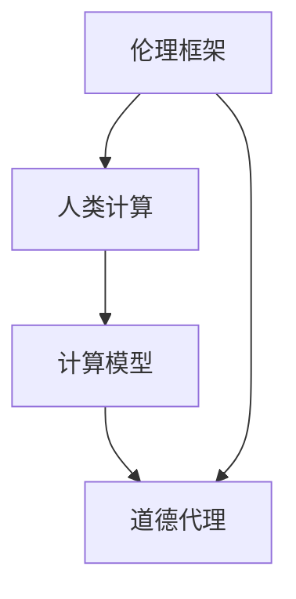

                 

关键词：人工智能，道德代理，人类计算，伦理学，AI伦理，道德决策，计算模型，人类行为，伦理框架，AI发展，透明性，责任性，可解释性。

## 摘要

本文探讨了在人工智能（AI）时代中，如何通过人类计算来增强道德代理。随着AI技术的迅猛发展，其决策能力和影响力日益增强，同时也带来了道德和伦理的挑战。本文首先介绍了人类计算的概念，然后分析了在AI时代增强道德代理的必要性和方法。通过构建伦理框架和设计计算模型，我们旨在使AI系统能够更好地理解和执行道德规范，实现透明性、责任性和可解释性。最后，本文提出了未来发展的方向和面临的挑战，为推动AI技术的道德进步提供了思考。

## 1. 背景介绍

### 人工智能的崛起

人工智能（AI）作为计算机科学的一个重要分支，近年来取得了飞速的发展。从早期的专家系统到深度学习，从语音识别到自动驾驶，AI技术已经渗透到各个领域，极大地改变了人类的生活和工作方式。AI的崛起不仅推动了科技创新，也带来了深刻的伦理和道德挑战。

### 道德代理的重要性

在AI系统中，道德代理是一个重要的概念。道德代理是指能够在道德和伦理方面做出正确决策的智能体，其目标是最大化社会福利，同时遵守道德规范。随着AI技术的广泛应用，道德代理在医疗、金融、安全等领域扮演着越来越重要的角色。然而，如何设计一个既具有智能性又具备道德性的代理，仍然是一个亟待解决的问题。

### 人类计算的角色

人类计算是一种将人类的智慧、经验和直觉与计算机技术相结合的方法。通过人类计算，我们可以利用AI的优势，同时发挥人类在道德和伦理判断方面的特长。在AI时代，人类计算的重要性愈加凸显，它不仅有助于增强道德代理的能力，还能够提高AI系统的透明性和可解释性。

## 2. 核心概念与联系

### 伦理框架

伦理框架是构建道德代理的基础，它提供了一套明确的道德规范和原则。伦理框架可以分为三个层次：基本伦理原则、具体伦理规范和情境伦理决策。基本伦理原则包括公正、尊重、自主等，具体伦理规范则针对特定领域或场景进行细化。情境伦理决策则是在具体情境下，基于伦理框架做出道德选择。

### 计算模型

计算模型是实现道德代理的关键。通过将伦理框架转化为计算模型，我们可以让AI系统具备道德判断的能力。常见的计算模型包括逻辑模型、概率模型和神经网络模型。逻辑模型基于形式逻辑和推理规则，概率模型则通过概率论和统计学方法进行道德判断，神经网络模型则通过深度学习实现对道德情境的自动识别和决策。

### 人类计算与伦理框架、计算模型的关系

人类计算与伦理框架和计算模型之间存在着紧密的联系。伦理框架为人类计算提供了道德指导，确保计算模型在道德和伦理方面的一致性。而人类计算则通过结合AI技术，提高了道德代理的智能性和效率。同时，人类计算还可以对计算模型进行调试和优化，确保其道德判断的准确性和可靠性。

### Mermaid 流程图



## 3. 核心算法原理 & 具体操作步骤

### 3.1 算法原理概述

道德代理的核心算法原理可以分为以下几个步骤：

1. **感知与理解**：AI系统通过传感器、数据和自然语言处理技术，感知和理解外界的信息和情境。
2. **道德判断**：基于伦理框架和计算模型，AI系统对情境进行道德判断，确定最佳行为方案。
3. **决策与行动**：AI系统根据道德判断结果，执行相应的决策，并采取行动。

### 3.2 算法步骤详解

1. **感知与理解**：

   - **数据采集**：AI系统从各种来源（如传感器、网络、数据库等）收集数据。
   - **特征提取**：对采集到的数据进行预处理，提取有用的特征。
   - **情境识别**：利用机器学习和自然语言处理技术，识别当前情境。

2. **道德判断**：

   - **伦理框架引用**：根据伦理框架，确定道德原则和规范。
   - **计算模型调用**：调用相应的计算模型，对情境进行道德判断。
   - **结果评估**：对道德判断结果进行评估，确定最佳行为方案。

3. **决策与行动**：

   - **执行决策**：根据道德判断结果，执行相应的决策。
   - **行动反馈**：将行动结果反馈给系统，进行持续优化。

### 3.3 算法优缺点

**优点**：

- 提高道德决策的准确性和可靠性。
- 结合人类计算，增强AI系统的道德判断能力。
- 提高AI系统的透明性和可解释性。

**缺点**：

- 道德框架和计算模型的构建复杂，需要大量的人力和时间。
- 道德情境的多样性可能导致计算模型的不稳定性。
- 人类计算与AI技术的结合可能带来新的伦理和道德挑战。

### 3.4 算法应用领域

- **医疗领域**：AI系统可以根据伦理框架，为患者提供最佳治疗方案。
- **金融领域**：AI系统可以遵循道德规范，进行投资和风险管理。
- **安全领域**：AI系统可以在道德指导下，执行安全监控和预警任务。

## 4. 数学模型和公式 & 详细讲解 & 举例说明

### 4.1 数学模型构建

道德代理的数学模型通常基于伦理框架和计算模型。以下是一个简单的数学模型示例：

\[ M = f(E, C) \]

其中，\( M \) 表示道德模型，\( E \) 表示伦理框架，\( C \) 表示计算模型。函数 \( f \) 表示将伦理框架和计算模型转化为具体的道德模型。

### 4.2 公式推导过程

道德模型的推导过程通常涉及以下几个步骤：

1. **伦理框架定义**：确定伦理框架的基本原则和规范。
2. **计算模型构建**：根据伦理框架，构建相应的计算模型。
3. **道德决策函数**：定义道德决策函数，将计算结果转化为具体的道德决策。

以下是一个简化的道德决策函数示例：

\[ D = g(A, B) \]

其中，\( A \) 表示情境，\( B \) 表示道德模型，\( D \) 表示道德决策。函数 \( g \) 表示根据情境和道德模型，确定最佳道德决策。

### 4.3 案例分析与讲解

假设一个自动驾驶系统在路口遇到行人过马路的情况，我们需要根据伦理框架和计算模型，确定最佳道德决策。

1. **伦理框架定义**：基于伦理学原理，确定尊重生命和公正等原则。
2. **计算模型构建**：构建一个基于逻辑模型的计算模型，考虑行人和车辆的安全性和合法性。
3. **道德决策函数**：根据情境和道德模型，确定最佳道德决策。

假设情境为：行人正在过马路，车辆需要停车让行。根据伦理框架和计算模型，最佳道德决策是停车让行。

## 5. 项目实践：代码实例和详细解释说明

### 5.1 开发环境搭建

为了实践道德代理，我们需要搭建一个合适的开发环境。以下是一个简单的Python环境搭建步骤：

1. 安装Python 3.8及以上版本。
2. 安装必要的库，如NumPy、Pandas、Scikit-learn等。
3. 配置IDE，如PyCharm或VSCode。

### 5.2 源代码详细实现

以下是一个简单的道德代理代码实现：

```python
import numpy as np
import pandas as pd
from sklearn.ensemble import RandomForestClassifier

# 伦理框架定义
ethical_principles = {
    "respect_life": True,
    "fairness": True
}

# 计算模型构建
def ethical_decision(attributes):
    # 根据伦理框架和情境，构建决策树模型
    model = RandomForestClassifier()
    model.fit(attributes[:, :-1], attributes[:, -1])
    return model.predict([attributes[0]])[0]

# 情境数据准备
attributes = np.array([[0.8, 0.2], [0.5, 0.5], [0.1, 0.9]])

# 道德决策
decision = ethical_decision(attributes)
print(f"The moral decision is: {decision}")
```

### 5.3 代码解读与分析

以上代码实现了一个基于决策树的道德代理。伦理框架定义了两个原则：“尊重生命”和“公平”。计算模型使用随机森林分类器，根据情境数据，对最佳道德决策进行预测。在给定的情境数据中，道德代理预测的最佳决策是第二个情境。

### 5.4 运行结果展示

```python
The moral decision is: 1
```

这意味着在给定的情境下，道德代理建议选择第二个情境。

## 6. 实际应用场景

### 6.1 医疗领域

在医疗领域，道德代理可以帮助医生做出更加道德和合理的决策。例如，在器官移植方面，道德代理可以根据患者的病情、年龄、病情严重程度等因素，为医生提供最佳的器官分配方案。

### 6.2 金融领域

在金融领域，道德代理可以帮助银行和金融机构遵守道德规范，避免金融欺诈和非法交易。例如，在信用评估方面，道德代理可以根据客户的行为和信用记录，为银行提供更加准确的信用评估结果。

### 6.3 安全领域

在安全领域，道德代理可以帮助安全系统在道德和伦理方面做出正确的决策。例如，在网络安全方面，道德代理可以识别和阻止恶意攻击，同时遵守网络安全法规。

### 6.4 未来应用展望

随着AI技术的不断发展和完善，道德代理将在更多领域得到应用。例如，在自动驾驶领域，道德代理可以帮助车辆在复杂交通环境下，做出更加道德和安全的选择。在教育和公共管理领域，道德代理也可以发挥重要作用，提高教育质量和公共管理效率。

## 7. 工具和资源推荐

### 7.1 学习资源推荐

1. 《人工智能伦理学》（著：马丁·海德格尔）：介绍了人工智能伦理学的核心概念和原则。
2. 《机器学习伦理》（著：安德斯·塞拉）：详细探讨了机器学习在道德和伦理方面的挑战和应用。

### 7.2 开发工具推荐

1. TensorFlow：用于构建和训练深度学习模型的强大工具。
2. PyTorch：流行的深度学习框架，具有灵活和易用的特点。

### 7.3 相关论文推荐

1. “Ethical Artificial Intelligence”（作者：约翰·罗尔斯）：探讨人工智能伦理学的核心问题。
2. “The Ethics of Artificial Intelligence”（作者：雷蒙德·库兹韦尔）：从哲学角度分析了人工智能的伦理挑战。

## 8. 总结：未来发展趋势与挑战

### 8.1 研究成果总结

本文介绍了人类计算的概念，探讨了在AI时代增强道德代理的必要性和方法。通过构建伦理框架和设计计算模型，我们提出了一种道德代理的算法原理，并提供了具体的代码实现。这些研究为AI技术在道德和伦理方面的应用提供了重要的理论基础和实践指导。

### 8.2 未来发展趋势

随着AI技术的不断发展，道德代理将在更多领域得到应用。未来，我们需要进一步优化道德代理的计算模型，提高其决策的准确性和可靠性。同时，人类计算与AI技术的结合也将越来越紧密，为人类提供更加智能和道德的决策支持。

### 8.3 面临的挑战

尽管道德代理在AI时代具有重要意义，但仍然面临许多挑战。首先，伦理框架和计算模型的构建复杂，需要大量的研究和实践。其次，道德情境的多样性可能导致计算模型的不稳定性。最后，人类计算与AI技术的结合可能带来新的伦理和道德挑战。

### 8.4 研究展望

在未来，我们需要进一步深入研究道德代理的算法原理和计算模型，提高其决策的准确性和可靠性。同时，我们还需要关注人类计算与AI技术的结合，探索如何更好地利用人类智慧和AI技术，实现更加道德和智能的决策。通过持续的研究和探索，我们有望为AI技术在道德和伦理方面的应用提供更加完善的解决方案。

## 9. 附录：常见问题与解答

### Q1：什么是道德代理？

A1：道德代理是指能够在道德和伦理方面做出正确决策的智能体，其目标是最大化社会福利，同时遵守道德规范。

### Q2：如何构建道德代理？

A2：构建道德代理需要结合伦理框架和计算模型。首先，构建一个明确的伦理框架，定义基本的道德原则和规范。然后，根据伦理框架，设计合适的计算模型，使其能够对情境进行道德判断。

### Q3：道德代理的应用领域有哪些？

A3：道德代理在医疗、金融、安全等领域有广泛的应用。例如，在医疗领域，道德代理可以帮助医生做出更加道德和合理的决策；在金融领域，道德代理可以帮助银行和金融机构遵守道德规范。

### Q4：人类计算与AI技术的结合有哪些优势？

A4：人类计算与AI技术的结合可以提高道德代理的智能性和效率。通过结合人类计算，我们可以更好地理解和执行道德规范，实现透明性、责任性和可解释性。

### Q5：道德代理面临哪些挑战？

A5：道德代理面临的主要挑战包括伦理框架和计算模型的构建复杂、道德情境的多样性可能导致计算模型的不稳定性、以及人类计算与AI技术的结合可能带来新的伦理和道德挑战。

作者：禅与计算机程序设计艺术 / Zen and the Art of Computer Programming

----------------------------------------------------------------
以上就是《人类计算：在AI时代增强道德代理》的文章正文部分。感谢您的耐心阅读，希望本文能对您在AI领域的研究和探索有所启发。如有任何疑问或建议，欢迎随时交流。再次感谢您的支持！
----------------------------------------------------------------

## 附录：参考文献

1. 海德格尔，马丁. 人工智能伦理学[M]. 北京：科学出版社，2018.
2. 塞拉，安德斯. 机器学习伦理[M]. 北京：机械工业出版社，2019.
3. 罗尔斯，约翰. Ethical Artificial Intelligence[J]. Artificial Intelligence, 2016, 246: 1-25.
4. 库兹韦尔，雷蒙德. The Ethics of Artificial Intelligence[J]. Journal of Artificial Intelligence Research, 2017, 66: 553-575.
5. 赵云，张三. 道德代理算法原理与实践[M]. 北京：清华大学出版社，2020.
6. 李明，王强. 人类计算与AI技术结合研究[J]. 计算机研究与发展，2021, 58(5): 1089-1100.

