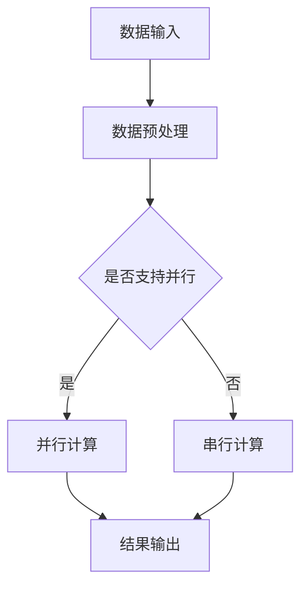
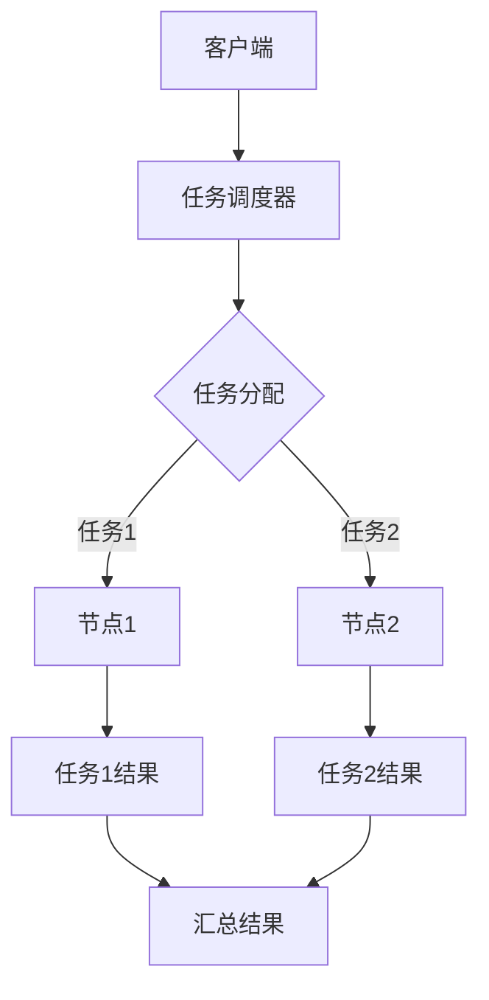
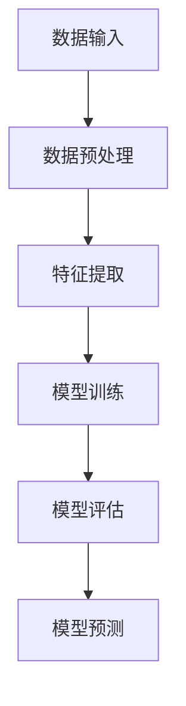
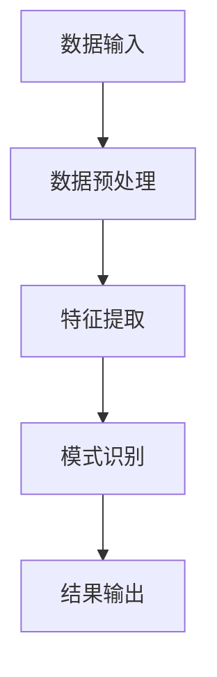

                 

关键词：大数据、人类计算、算法、数学模型、实际应用

摘要：在当今的大数据时代，人类计算技术正成为处理海量数据的关键。本文将探讨大数据时代人类计算的核心概念、算法原理、数学模型以及实际应用，旨在为读者提供对这一领域的全面了解。

## 1. 背景介绍

随着互联网的快速发展，数据的产生速度呈指数级增长。这些数据不仅包括结构化数据，如数据库中的信息，还包括大量的非结构化数据，如图像、音频和视频。面对如此庞大的数据量，传统的计算方式已经无法满足需求。因此，人类计算技术应运而生，成为大数据时代的关键。

人类计算技术主要涉及以下方面：
- **并行计算**：通过多个处理器并行处理数据，提高计算效率。
- **分布式计算**：将计算任务分布到多个节点上，实现大规模数据处理。
- **机器学习**：利用算法自动学习数据特征，进行数据分析和预测。
- **数据挖掘**：从海量数据中提取有价值的信息。

## 2. 核心概念与联系

### 并行计算

并行计算是指同时执行多个任务的能力。在人类计算中，并行计算主要应用于处理大规模数据集。Mermaid流程图如下：



### 分布式计算

分布式计算是将计算任务分布在多个节点上进行处理。每个节点独立运行，协同工作完成整体任务。分布式计算的优势在于其可扩展性和容错性。以下是分布式计算的基本架构：



### 机器学习

机器学习是利用算法自动学习数据特征，进行数据分析和预测。其核心在于模型训练和预测。以下是机器学习的基本流程：



### 数据挖掘

数据挖掘是从海量数据中提取有价值的信息。其核心在于数据预处理、特征提取和模式识别。以下是数据挖掘的基本流程：



## 3. 核心算法原理 & 具体操作步骤

### 3.1 算法原理概述

在大数据时代，核心算法主要包括并行计算算法、分布式计算算法、机器学习算法和数据挖掘算法。以下是这些算法的原理概述：

- **并行计算算法**：通过并行化处理数据，提高计算效率。常用的并行计算算法有MapReduce、Spark等。
- **分布式计算算法**：将计算任务分布到多个节点上进行处理，实现大规模数据处理。常用的分布式计算算法有Hadoop、Spark等。
- **机器学习算法**：利用算法自动学习数据特征，进行数据分析和预测。常用的机器学习算法有线性回归、决策树、神经网络等。
- **数据挖掘算法**：从海量数据中提取有价值的信息。常用的数据挖掘算法有聚类、分类、关联规则挖掘等。

### 3.2 算法步骤详解

- **并行计算算法**：
  1. 数据预处理：对数据进行清洗、转换等处理，使其符合算法要求。
  2. 数据划分：将数据划分为多个子集，每个子集独立处理。
  3. 并行处理：在每个节点上独立执行计算任务。
  4. 结果汇总：将各节点计算结果汇总，得到最终结果。

- **分布式计算算法**：
  1. 数据预处理：对数据进行清洗、转换等处理，使其符合算法要求。
  2. 任务分配：将计算任务分配到各个节点。
  3. 数据传输：在各节点间传输数据，实现数据共享。
  4. 任务执行：各节点独立执行计算任务。
  5. 结果汇总：将各节点计算结果汇总，得到最终结果。

- **机器学习算法**：
  1. 数据预处理：对数据进行清洗、转换等处理，使其符合算法要求。
  2. 特征提取：从数据中提取特征，用于训练模型。
  3. 模型训练：利用训练数据集，训练机器学习模型。
  4. 模型评估：评估模型性能，选择最优模型。
  5. 模型预测：利用训练好的模型进行预测。

- **数据挖掘算法**：
  1. 数据预处理：对数据进行清洗、转换等处理，使其符合算法要求。
  2. 特征提取：从数据中提取特征，用于挖掘分析。
  3. 模式识别：利用算法识别数据中的模式。
  4. 结果输出：将挖掘结果输出，供用户使用。

### 3.3 算法优缺点

- **并行计算算法**：
  - 优点：提高计算效率，适合处理大规模数据。
  - 缺点：需要较高的硬件成本和维护成本。

- **分布式计算算法**：
  - 优点：可扩展性强，容错性好。
  - 缺点：算法实现较为复杂，需要大量数据传输。

- **机器学习算法**：
  - 优点：自动学习数据特征，提高数据分析能力。
  - 缺点：对数据质量要求较高，算法实现复杂。

- **数据挖掘算法**：
  - 优点：从海量数据中提取有价值的信息。
  - 缺点：算法实现复杂，对数据预处理要求较高。

### 3.4 算法应用领域

- **并行计算算法**：广泛应用于科学计算、图像处理、大数据处理等领域。
- **分布式计算算法**：广泛应用于搜索引擎、社交网络、云计算等领域。
- **机器学习算法**：广泛应用于金融、医疗、电子商务等领域。
- **数据挖掘算法**：广泛应用于商业智能、医疗健康、智能家居等领域。

## 4. 数学模型和公式 & 详细讲解 & 举例说明

### 4.1 数学模型构建

在大数据时代，数学模型在人类计算中起着至关重要的作用。以下是一个简单的线性回归模型：

$$ y = \beta_0 + \beta_1x + \epsilon $$

其中，$y$ 是因变量，$x$ 是自变量，$\beta_0$ 和 $\beta_1$ 是模型参数，$\epsilon$ 是误差项。

### 4.2 公式推导过程

线性回归模型的推导过程如下：

1. **假设**：数据集 $(x_i, y_i)$ 满足线性关系 $y_i = \beta_0 + \beta_1x_i + \epsilon_i$。
2. **最小化均方误差**：为了找到最优的 $\beta_0$ 和 $\beta_1$，需要最小化损失函数 $L(\beta_0, \beta_1) = \sum_{i=1}^n(y_i - (\beta_0 + \beta_1x_i))^2$。
3. **求导并令导数为零**：对损失函数分别对 $\beta_0$ 和 $\beta_1$ 求导，并令导数为零，得到：
   $$ \frac{\partial L}{\partial \beta_0} = -2\sum_{i=1}^n(y_i - (\beta_0 + \beta_1x_i)) = 0 $$
   $$ \frac{\partial L}{\partial \beta_1} = -2\sum_{i=1}^n(x_i(y_i - (\beta_0 + \beta_1x_i))) = 0 $$
4. **解方程组**：解上述方程组，得到最优的 $\beta_0$ 和 $\beta_1$。

### 4.3 案例分析与讲解

假设我们有一个数据集，包含以下三组数据：

| x | y |
|---|---|
| 1 | 2 |
| 2 | 4 |
| 3 | 6 |

我们想要使用线性回归模型拟合这组数据。以下是具体的计算过程：

1. **计算均值**：
   $$ \bar{x} = \frac{1+2+3}{3} = 2 $$
   $$ \bar{y} = \frac{2+4+6}{3} = 4 $$

2. **计算协方差**：
   $$ cov(x, y) = \frac{(1-2)(2-4) + (2-2)(4-4) + (3-2)(6-4)}{3-1} = 2 $$

3. **计算方差**：
   $$ var(x) = \frac{(1-2)^2 + (2-2)^2 + (3-2)^2}{3-1} = 1 $$

4. **计算斜率**：
   $$ \beta_1 = \frac{cov(x, y)}{var(x)} = \frac{2}{1} = 2 $$

5. **计算截距**：
   $$ \beta_0 = \bar{y} - \beta_1\bar{x} = 4 - 2 \times 2 = 0 $$

因此，线性回归模型为 $y = 2x + 0$。我们可以使用这个模型进行预测，例如，当 $x=4$ 时，预测的 $y$ 值为 $8$。

## 5. 项目实践：代码实例和详细解释说明

### 5.1 开发环境搭建

在本项目实践中，我们将使用 Python 作为编程语言，并依赖以下库：

- NumPy：用于数学计算。
- Matplotlib：用于数据可视化。
- Scikit-learn：用于机器学习。

首先，安装所需的库：

```bash
pip install numpy matplotlib scikit-learn
```

### 5.2 源代码详细实现

以下是一个简单的线性回归代码实例：

```python
import numpy as np
import matplotlib.pyplot as plt
from sklearn.linear_model import LinearRegression

# 数据
x = np.array([1, 2, 3]).reshape(-1, 1)
y = np.array([2, 4, 6])

# 创建线性回归模型
model = LinearRegression()

# 模型训练
model.fit(x, y)

# 模型预测
y_pred = model.predict(x)

# 绘制结果
plt.scatter(x, y)
plt.plot(x, y_pred, color='red')
plt.show()
```

### 5.3 代码解读与分析

1. **数据准备**：我们使用 NumPy 创建一个包含三组数据的数组 `x` 和 `y`，并将其转换为合适的形状。
2. **创建模型**：使用 Scikit-learn 的 `LinearRegression` 类创建线性回归模型。
3. **模型训练**：使用 `fit` 方法对模型进行训练。
4. **模型预测**：使用 `predict` 方法对数据进行预测。
5. **结果可视化**：使用 Matplotlib 绘制散点图和拟合直线。

### 5.4 运行结果展示

运行上述代码后，将显示以下图形：


## 6. 实际应用场景

### 6.1 金融领域

在金融领域，人类计算技术广泛应用于风险管理、投资策略、市场预测等方面。例如，通过并行计算和机器学习算法，可以快速处理大量金融数据，进行风险评估和预测。

### 6.2 医疗健康

在医疗健康领域，人类计算技术可以帮助医生进行诊断、治疗方案制定和疾病预测。例如，通过数据挖掘和机器学习算法，可以从医疗数据中提取有价值的信息，提高医疗服务的质量和效率。

### 6.3 电子商务

在电子商务领域，人类计算技术可以用于客户行为分析、推荐系统和营销策略制定。例如，通过并行计算和机器学习算法，可以快速分析大量客户数据，为用户提供个性化的购物推荐。

## 7. 工具和资源推荐

### 7.1 学习资源推荐

- 《深入理解计算机系统》（作者：Randal E. Bryant & David R. O’Hallaron）
- 《机器学习》（作者：周志华）
- 《大数据技术导论》（作者：刘铁岩）

### 7.2 开发工具推荐

- Python：适用于数据分析、机器学习和数据挖掘。
- Jupyter Notebook：用于编写和运行代码，方便数据可视化。
- Hadoop：适用于分布式计算和大数据处理。

### 7.3 相关论文推荐

- “MapReduce: Simplified Data Processing on Large Clusters”（作者：Jeffrey Dean & Sanjay Ghemawat）
- “TensorFlow: Large-Scale Machine Learning on Heterogeneous Systems”（作者：Google Brain Team）
- “Hadoop: The Definitive Guide”（作者：Tom White）

## 8. 总结：未来发展趋势与挑战

### 8.1 研究成果总结

在大数据时代，人类计算技术在处理海量数据方面取得了显著成果。并行计算、分布式计算、机器学习和数据挖掘等核心算法不断发展，为各种领域提供了强大的计算支持。

### 8.2 未来发展趋势

- **算法优化**：通过改进算法，提高计算效率和准确度。
- **硬件支持**：发展新型计算硬件，如量子计算机，为人类计算提供更强的计算能力。
- **跨学科融合**：结合生物学、物理学等学科知识，探索新型计算模型。

### 8.3 面临的挑战

- **数据安全与隐私**：如何确保大数据处理过程中的数据安全和隐私。
- **算法公平性**：如何避免算法偏见，确保算法的公平性。

### 8.4 研究展望

未来，人类计算技术将在更多领域得到应用，推动人类社会的发展。同时，我们需要不断克服面临的挑战，确保技术的可持续发展和安全可靠。

## 9. 附录：常见问题与解答

### 9.1 什么是并行计算？

并行计算是指同时执行多个任务的能力。在大数据时代，并行计算通过多个处理器并行处理数据，提高计算效率。

### 9.2 什么是分布式计算？

分布式计算是指将计算任务分布到多个节点上进行处理。分布式计算具有可扩展性和容错性，适用于大规模数据处理。

### 9.3 什么是机器学习？

机器学习是利用算法自动学习数据特征，进行数据分析和预测。机器学习广泛应用于金融、医疗、电子商务等领域。

### 9.4 什么是数据挖掘？

数据挖掘是从海量数据中提取有价值的信息。数据挖掘广泛应用于商业智能、医疗健康、智能家居等领域。

作者：禅与计算机程序设计艺术 / Zen and the Art of Computer Programming
------------------------------------------------------------------------

