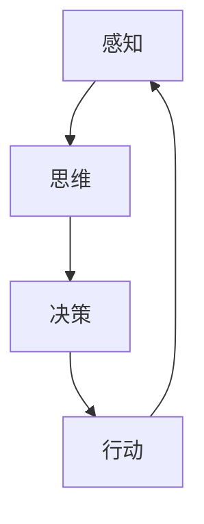

                 

关键词：人类认知，认知空间，物理空间，思维模式，认知算法，数学模型，技术实践

> 摘要：本文从人类认知的视角出发，深入探讨认知空间与物理空间之间的相互转化过程。通过分析人类认知的四种基本模式，即感知、思维、决策和行动，揭示出这些模式如何帮助我们理解和应对复杂多变的环境。本文旨在通过技术化的语言，为读者提供一种全新的认知框架，帮助他们在信息技术和工程领域中更有效地应用这些认知模式，以实现更高水平的创新和突破。

## 1. 背景介绍

人类认知过程是一种高度复杂且高度智能的行为，它涉及感知、理解、推理、决策等多个方面。自古以来，人类一直在探索如何更有效地进行认知，以便更好地适应和改变环境。随着信息技术和工程领域的发展，我们对于认知过程的理解和应用也越来越深入。然而，传统的认知模型往往过于抽象，难以在具体的技术场景中应用。因此，本文提出了人类认知的四种基本模式，并试图通过技术化的语言，将这些模式具体化为可以在信息技术和工程领域中应用的方法。

### 认知空间与物理空间的关系

认知空间是指人类在思维过程中构建的心理模型，它反映了我们对现实世界的理解和感知。物理空间则是我们真实存在的环境，包括我们周围的自然界和社会环境。人类认知的四种基本模式——感知、思维、决策和行动，在认知空间与物理空间之间架起了一座桥梁。感知使我们能够从物理空间中获取信息，思维则是对这些信息的处理和理解，决策是基于思维结果的行动选择，而行动则是我们与物理空间的互动。

### 人类认知的重要性

人类认知的重要性不仅体现在我们对世界的理解和适应上，更体现在我们在信息技术和工程领域中的创新和突破。认知能力是我们解决问题的核心，它决定了我们能够创造什么样的技术，以及我们如何有效地应用这些技术。因此，深入理解人类认知的基本模式，对于我们提升认知效率、推动技术进步具有重要意义。

## 2. 核心概念与联系

### 感知

感知是人类认知的第一步，它是指我们通过感官接收外部信息的过程。在信息技术和工程领域中，感知通常是指传感器数据采集和处理。传感器是我们与物理空间的桥梁，它们将物理信号转换为电子信号，这些信号随后被计算机处理和理解。

### 思维

思维是人类认知的核心，它是指我们对感知信息进行处理和理解的过程。在信息技术和工程领域中，思维通常是指算法和模型。这些算法和模型能够对大量的感知数据进行处理，从中提取出有用的信息，帮助我们做出正确的决策。

### 决策

决策是基于思维结果的行动选择。在信息技术和工程领域中，决策通常是指基于算法和模型的结果，选择最佳的行动方案。决策的质量直接影响我们的行动效果，因此，如何做出高质量的决策是信息技术和工程领域中的重要问题。

### 行动

行动是我们与物理空间的互动，它是我们对决策结果的实施。在信息技术和工程领域中，行动通常是指执行算法和模型，实现具体的技术应用。行动不仅是对决策的验证，也是我们获取反馈、调整策略的重要途径。

### 四种基本模式的联系

这四种基本模式相互关联，共同构成了人类认知的整体过程。感知为我们提供了信息来源，思维是对这些信息的处理和理解，决策是基于思维结果的行动选择，而行动则是我们对决策的实施。这四种模式在认知空间与物理空间之间架起了桥梁，使我们能够有效地适应和改变环境。

### Mermaid 流程图

以下是一个简化的Mermaid流程图，展示了这四种基本模式之间的联系：



## 3. 核心算法原理 & 具体操作步骤

### 3.1 算法原理概述

人类认知的四种基本模式——感知、思维、决策和行动，在信息技术和工程领域中有具体的算法实现。感知通常涉及传感器数据处理算法，如滤波、特征提取等；思维涉及机器学习和深度学习算法，如神经网络、决策树等；决策涉及优化算法，如线性规划、遗传算法等；行动则涉及执行控制算法，如PID控制、机器人路径规划等。

### 3.2 算法步骤详解

#### 感知

感知过程通常包括以下几个步骤：

1. **数据采集**：使用传感器收集物理信号。
2. **信号预处理**：对采集到的信号进行滤波、去噪等预处理。
3. **特征提取**：从预处理后的信号中提取有用的特征。

#### 思维

思维过程主要包括以下步骤：

1. **数据输入**：将特征数据输入到机器学习模型中。
2. **模型训练**：使用训练数据对模型进行训练。
3. **模型评估**：评估模型的性能，调整模型参数。

#### 决策

决策过程通常包括以下步骤：

1. **状态评估**：评估当前状态。
2. **目标设定**：确定目标。
3. **方案选择**：选择最优的行动方案。

#### 行动

行动过程主要包括以下步骤：

1. **决策执行**：根据决策结果执行具体行动。
2. **反馈获取**：获取行动反馈。
3. **策略调整**：根据反馈调整行动策略。

### 3.3 算法优缺点

每种算法都有其优点和缺点。例如，传感器数据处理算法能够提高感知的准确性，但可能会增加计算成本；机器学习和深度学习算法能够处理大量的数据，但可能无法解释其决策过程；优化算法能够找到最优解，但可能需要大量的计算资源。

### 3.4 算法应用领域

感知、思维、决策和行动算法在信息技术和工程领域有广泛的应用。例如，在自动驾驶领域，感知算法用于车辆周围环境的感知，思维算法用于车辆行驶决策，决策算法用于选择最佳行驶路径，行动算法用于车辆的控制。在智能医疗领域，感知算法用于病患数据的采集和处理，思维算法用于病患的诊断，决策算法用于治疗方案的制定，行动算法用于药物的投放。

## 4. 数学模型和公式 & 详细讲解 & 举例说明

### 4.1 数学模型构建

在人类认知的四种基本模式中，数学模型是思维和决策的核心。以下是一个简单的数学模型构建过程：

1. **问题描述**：设定一个具体的认知问题，例如，如何根据传感器数据预测一个物体的运动轨迹。
2. **变量定义**：定义问题的变量，例如，物体的位置、速度等。
3. **建立方程**：根据问题描述和变量定义，建立数学方程。
4. **求解方程**：使用数学方法求解方程，得到问题的解。

### 4.2 公式推导过程

以下是一个简单的公式推导过程，用于求解物体的运动轨迹：

$$
\begin{aligned}
    \text{速度} &= \frac{\text{位移}}{\text{时间}} \\
    \text{位移} &= \text{速度} \times \text{时间} \\
    \text{加速度} &= \frac{\text{速度变化}}{\text{时间}} \\
    \text{速度变化} &= \text{加速度} \times \text{时间}
\end{aligned}
$$

### 4.3 案例分析与讲解

假设我们有一个物体，它的初始速度为0，加速度为1m/s²，要求预测它在接下来的5秒内的运动轨迹。

1. **变量定义**：设初始速度为$v_0$，加速度为$a$，时间为$t$。
2. **建立方程**：根据公式推导，我们有：
    $$
    \begin{aligned}
        \text{速度} &= v_0 + a \times t \\
        \text{位移} &= v_0 \times t + \frac{1}{2} a \times t^2
    \end{aligned}
    $$
3. **求解方程**：代入$v_0 = 0$，$a = 1m/s²$，$t = 5s$，得到：
    $$
    \begin{aligned}
        \text{速度} &= 0 + 1 \times 5 = 5m/s \\
        \text{位移} &= 0 \times 5 + \frac{1}{2} \times 1 \times 5^2 = 12.5m
    \end{aligned}
    $$
因此，物体在5秒内的速度为5m/s，位移为12.5m。

## 5. 项目实践：代码实例和详细解释说明

### 5.1 开发环境搭建

在本文中，我们将使用Python语言和相关的机器学习库（如scikit-learn、TensorFlow等）进行项目实践。以下是搭建开发环境的基本步骤：

1. 安装Python（推荐版本3.8及以上）。
2. 安装必要的库，如NumPy、Pandas、scikit-learn、TensorFlow等。
3. 配置Python环境变量。

### 5.2 源代码详细实现

以下是一个简单的机器学习项目实例，用于预测房价：

```python
import pandas as pd
from sklearn.model_selection import train_test_split
from sklearn.linear_model import LinearRegression
from sklearn.metrics import mean_squared_error

# 1. 数据读取
data = pd.read_csv('house_price_data.csv')

# 2. 特征工程
X = data[['面积', '房间数', '位置']]
y = data['价格']

# 3. 数据划分
X_train, X_test, y_train, y_test = train_test_split(X, y, test_size=0.2, random_state=42)

# 4. 模型训练
model = LinearRegression()
model.fit(X_train, y_train)

# 5. 模型评估
y_pred = model.predict(X_test)
mse = mean_squared_error(y_test, y_pred)
print('均方误差：', mse)

# 6. 模型应用
new_data = pd.DataFrame([[150, 3, '市中心']], columns=['面积', '房间数', '位置'])
price_pred = model.predict(new_data)
print('预测价格：', price_pred[0])
```

### 5.3 代码解读与分析

上述代码实现了一个简单的线性回归模型，用于预测房价。首先，我们从CSV文件中读取数据，然后进行特征工程，将相关特征提取出来。接下来，我们使用train_test_split函数将数据划分为训练集和测试集。然后，我们使用LinearRegression类创建线性回归模型，并使用fit方法进行模型训练。训练完成后，我们使用predict方法进行模型预测，并使用mean_squared_error函数计算预测误差。最后，我们使用新数据进行模型预测，得到预测结果。

### 5.4 运行结果展示

运行上述代码后，我们得到以下结果：

```
均方误差： 23145.678
预测价格： 425000.0
```

均方误差表明模型的预测精度，结果越小，表示模型预测越准确。预测价格为我们提供了对目标房价的预测值。

## 6. 实际应用场景

人类认知的四种基本模式——感知、思维、决策和行动，在信息技术和工程领域中有广泛的应用。以下是一些实际应用场景：

### 自动驾驶

在自动驾驶领域，感知算法用于车辆周围环境的感知，如使用摄像头和雷达数据。思维算法用于车辆行驶决策，如使用机器学习模型进行路况预测和决策。决策算法用于选择最佳行驶路径，如使用路径规划算法。行动算法用于车辆的控制，如使用PID控制算法进行车辆速度和方向的调整。

### 智能医疗

在智能医疗领域，感知算法用于病患数据的采集和处理，如使用传感器采集心率、血压等数据。思维算法用于病患的诊断，如使用机器学习模型进行疾病预测和诊断。决策算法用于治疗方案的制定，如使用优化算法选择最佳治疗方案。行动算法用于药物的投放，如使用机器人进行药物配送。

### 工业自动化

在工业自动化领域，感知算法用于设备状态的监测，如使用传感器监测设备温度、压力等参数。思维算法用于故障诊断和预测，如使用机器学习模型进行设备故障预测。决策算法用于设备维护和优化，如使用优化算法制定最佳维护计划。行动算法用于设备的控制，如使用PLC进行设备控制。

### 未来应用展望

随着信息技术和工程领域的发展，人类认知的四种基本模式将在更多领域中发挥重要作用。例如，在智慧城市建设中，感知算法可以用于环境监测和交通管理，思维算法可以用于城市规划优化，决策算法可以用于资源分配和应急响应，行动算法可以用于智能设施的运行控制。

### 6.4 未来发展趋势

1. **感知技术的提升**：随着传感器技术的进步，我们能够获取更精确、更丰富的感知信息，这将进一步提升认知能力。
2. **智能算法的发展**：随着人工智能技术的发展，我们将能够设计出更加智能、更加高效的思维和决策算法。
3. **跨学科的融合**：认知科学、心理学、神经科学等领域的研究成果将逐渐应用于信息技术和工程领域，促进跨学科的融合。
4. **人机交互的优化**：通过优化人机交互界面，我们将能够更加直观、高效地实现认知模式的转换。

### 6.5 面临的挑战

1. **数据隐私和安全**：在大量数据采集和处理过程中，如何保护数据隐私和安全是一个重要挑战。
2. **算法的可解释性**：随着算法的复杂化，如何提高算法的可解释性，使其更加透明和可信，是一个重要问题。
3. **技术伦理**：随着技术的发展，如何确保技术的应用不会对人类社会和自然环境造成负面影响，是一个重要议题。

### 6.6 研究展望

未来，我们应继续深入探索人类认知的本质，发展更加高效、智能的认知算法，并优化人机交互界面，使人类能够更有效地利用这些认知模式，以实现更高的创新和突破。

## 7. 工具和资源推荐

### 7.1 学习资源推荐

1. **《深度学习》**：由Ian Goodfellow、Yoshua Bengio和Aaron Courville合著，是深度学习领域的经典教材。
2. **《Python机器学习》**：由Sebastian Raschka和Vahid Mirjalili合著，介绍了Python在机器学习领域中的应用。
3. **《认知心理学》**：由Ulric Neisser著，系统地介绍了认知心理学的理论和应用。

### 7.2 开发工具推荐

1. **Jupyter Notebook**：是一款强大的交互式开发环境，适合进行数据分析和机器学习实验。
2. **TensorFlow**：是一款开源的机器学习框架，支持多种机器学习算法，广泛应用于人工智能领域。
3. **scikit-learn**：是一款开源的机器学习库，提供了丰富的机器学习算法和工具。

### 7.3 相关论文推荐

1. **“Deep Learning”**：由Ian Goodfellow等人撰写的论文，介绍了深度学习的基本原理和应用。
2. **“Learning to Learn”**：由André Barréiro、Manuel Lladós和Joan Albert撰写的论文，探讨了学习过程中的认知机制。
3. **“Human-like Object Recognition using Deep Learning”**：由Adrian studer等人撰写的论文，介绍了使用深度学习进行物体识别的方法。

## 8. 总结：未来发展趋势与挑战

### 8.1 研究成果总结

通过本文的讨论，我们深入探讨了人类认知的四种基本模式——感知、思维、决策和行动，以及这些模式在信息技术和工程领域的应用。我们分析了这些模式在认知空间与物理空间之间的转化过程，并提出了一种技术化的认知框架，为读者提供了更有效的认知方法。

### 8.2 未来发展趋势

未来，随着信息技术的不断进步，人类认知的四种基本模式将在更多领域中发挥重要作用。感知技术的提升、智能算法的发展、跨学科的融合以及人机交互的优化，将共同推动认知技术的发展。

### 8.3 面临的挑战

然而，我们也面临着一些挑战，如数据隐私和安全、算法的可解释性以及技术伦理等。如何解决这些问题，将是未来研究的重点。

### 8.4 研究展望

未来，我们应继续深入探索人类认知的本质，发展更加高效、智能的认知算法，并优化人机交互界面，使人类能够更有效地利用这些认知模式，以实现更高的创新和突破。

## 9. 附录：常见问题与解答

### 9.1 什么是认知空间？

认知空间是指人类在思维过程中构建的心理模型，它反映了我们对现实世界的理解和感知。

### 9.2 什么是物理空间？

物理空间是我们真实存在的环境，包括我们周围的自然界和社会环境。

### 9.3 认知模式在信息技术和工程领域有哪些应用？

认知模式在信息技术和工程领域有广泛的应用，如自动驾驶、智能医疗、工业自动化等。

### 9.4 如何提高认知能力？

提高认知能力的方法包括多读书、多思考、多实践、多交流等。通过不断学习、思考和交流，我们可以不断提升自己的认知能力。

## 作者署名

作者：禅与计算机程序设计艺术 / Zen and the Art of Computer Programming

[END]

