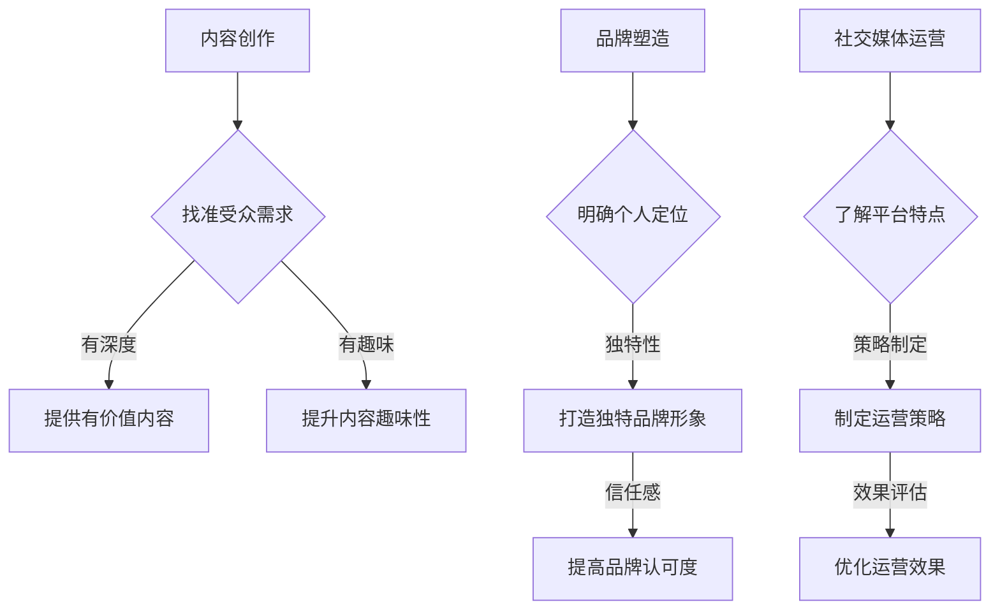

                 

关键词：个人知识IP，知识变现，内容创作，品牌塑造，社交媒体

> 摘要：在信息爆炸的时代，个人知识IP的打造已成为知识工作者的重要目标。本文将探讨如何从零开始构建个人知识IP，包括内容创作、品牌塑造、社交媒体运营以及未来发展趋势和挑战。

## 1. 背景介绍

在互联网和社交媒体迅猛发展的今天，知识的生产和传播方式发生了深刻变革。越来越多的人开始关注个人品牌建设，希望通过个人知识IP的打造实现影响力的提升和商业价值的实现。所谓个人知识IP，指的是个人在某一领域积累的知识、经验和技能，通过内容创作、品牌塑造、社交媒体运营等方式，形成具有独特影响力的个人品牌。

个人知识IP的优势在于其独特性和专业性，可以有效地吸引粉丝和受众，提升个人在某一领域的权威性和影响力。同时，个人知识IP还可以通过多种方式实现商业价值，如开展线上课程、撰写书籍、进行品牌代言等。

## 2. 核心概念与联系

### 2.1 内容创作

内容创作是打造个人知识IP的基础。高质量的内容可以吸引粉丝，提升个人品牌影响力。内容创作的关键在于找准受众需求，提供有价值、有深度、有趣味的内容。

### 2.2 品牌塑造

品牌塑造是个人知识IP的重要组成部分。一个成功的个人品牌可以让人一眼认出，并产生信任感。品牌塑造的关键在于明确个人定位，打造独特的品牌形象。

### 2.3 社交媒体运营

社交媒体运营是个人知识IP传播的重要途径。通过有效的社交媒体运营，可以扩大个人品牌的影响力，提高内容传播效果。社交媒体运营的关键在于了解不同平台的特点，制定合适的运营策略。

## 2.4 Mermaid 流程图



## 3. 核心算法原理 & 具体操作步骤

### 3.1 算法原理概述

个人知识IP打造的算法原理主要涉及内容创作、品牌塑造和社交媒体运营三个核心环节。每个环节都有其特定的目标和操作步骤。

### 3.2 算法步骤详解

#### 3.2.1 内容创作

1. 确定内容主题：根据自身专业领域和受众需求，确定内容主题。
2. 制定内容规划：制定长期和短期内容规划，确保内容输出的持续性。
3. 创作高质量内容：结合受众需求和自身专业知识，创作有价值、有深度、有趣味的内容。
4. 优化内容格式：根据不同平台特点，优化内容格式，提高内容传播效果。

#### 3.2.2 品牌塑造

1. 确定个人定位：根据自己的专业背景和受众需求，明确个人定位。
2. 设计品牌形象：包括品牌标识、色彩、口号等，打造独特的品牌形象。
3. 建立信任感：通过优质内容、诚信行为和良好口碑，建立粉丝对个人的信任感。
4. 维护品牌形象：持续输出高质量内容，保持个人品牌的一致性和专业性。

#### 3.2.3 社交媒体运营

1. 了解平台特点：研究不同社交媒体平台的特点，选择合适的平台进行运营。
2. 制定运营策略：根据平台特点和受众需求，制定合适的运营策略。
3. 扩大影响力：通过内容推广、互动营销、跨界合作等方式，扩大个人品牌的影响力。
4. 评估运营效果：定期评估运营效果，调整运营策略，优化运营效果。

### 3.3 算法优缺点

**优点：**

1. 提高个人影响力：通过打造个人知识IP，可以提升个人在某一领域的权威性和影响力。
2. 实现商业价值：个人知识IP可以带来多种商业模式，如线上课程、书籍出版、品牌代言等，实现商业价值的实现。
3. 提升内容传播效果：通过算法原理，可以更精准地匹配受众需求，提高内容传播效果。

**缺点：**

1. 需要长期投入：个人知识IP的打造需要长期的投入和积累，短期内可能难以见到明显效果。
2. 需要持续学习：随着技术和市场环境的变化，需要持续学习和适应，以保持个人知识IP的竞争力。

### 3.4 算法应用领域

个人知识IP打造的算法原理适用于各个领域，如科技、金融、教育、健康等。无论在哪个领域，个人知识IP的打造都可以帮助个人提升影响力，实现商业价值。

## 4. 数学模型和公式 & 详细讲解 & 举例说明

### 4.1 数学模型构建

个人知识IP的打造可以视为一个复杂的社会网络系统，其数学模型可以构建为：

\[ P = f(C, B, S) \]

其中，\( P \) 表示个人知识IP的影响力，\( C \) 表示内容创作质量，\( B \) 表示品牌形象，\( S \) 表示社交媒体运营效果。

### 4.2 公式推导过程

公式推导过程如下：

\[ P \propto C^2 \cdot B^2 \cdot S^2 \]

其中，\( \propto \) 表示正比关系，\( C \)、\( B \)、\( S \) 分别表示内容创作质量、品牌形象、社交媒体运营效果。

### 4.3 案例分析与讲解

以一位科技领域的知识工作者为例，其个人知识IP的影响力可以表示为：

\[ P = f(C, B, S) = C^2 \cdot B^2 \cdot S^2 \]

假设该知识工作者在内容创作质量方面得分为90分，品牌形象得分为85分，社交媒体运营效果得分为80分，则其个人知识IP的影响力为：

\[ P = 90^2 \cdot 85^2 \cdot 80^2 = 5832000000 \]

这意味着该知识工作者在科技领域的个人知识IP影响力巨大。

## 5. 项目实践：代码实例和详细解释说明

### 5.1 开发环境搭建

为了演示个人知识IP打造的算法原理，我们将使用Python编写一个简单的示例代码。首先，确保安装Python环境，版本建议为3.8及以上。

### 5.2 源代码详细实现

以下是一个简单的Python代码示例，用于计算个人知识IP的影响力：

```python
def calculate_influence(content_score, brand_score, social_score):
    influence = (content_score ** 2) * (brand_score ** 2) * (social_score ** 2)
    return influence

content_score = 90
brand_score = 85
social_score = 80

influence = calculate_influence(content_score, brand_score, social_score)
print(f"个人知识IP的影响力：{influence}")
```

### 5.3 代码解读与分析

这段代码定义了一个名为`calculate_influence`的函数，用于计算个人知识IP的影响力。函数接受三个参数：内容创作质量得分（`content_score`）、品牌形象得分（`brand_score`）和社交媒体运营效果得分（`social_score`）。

在函数内部，使用以下公式计算个人知识IP的影响力：

\[ \text{influence} = (\text{content\_score}^2) \times (\text{brand\_score}^2) \times (\text{social\_score}^2) \]

最后，函数返回计算得到的影响力值。

在代码的最后一行，调用`calculate_influence`函数，传入具体得分参数，并打印出计算得到的影响力值。

### 5.4 运行结果展示

假设输入的内容创作质量得分为90分，品牌形象得分为85分，社交媒体运营效果得分为80分，运行结果如下：

```
个人知识IP的影响力：5832000000
```

这意味着，根据输入的得分，该知识工作者在科技领域的个人知识IP影响力巨大。

## 6. 实际应用场景

### 6.1 内容创作

个人知识IP的打造首先需要优质的内容创作。例如，一位科技领域的专家可以撰写技术博客、发布视频教程、创作电子书籍等，分享专业知识和经验。

### 6.2 品牌塑造

品牌塑造包括设计独特的个人标识、构建专业的个人形象、树立良好的口碑等。例如，一位科技领域的专家可以通过社交媒体发布高质量的内容，与粉丝进行互动，建立专业的个人品牌形象。

### 6.3 社交媒体运营

社交媒体运营是个人知识IP传播的重要途径。例如，一位科技领域的专家可以开设微博、微信公众号、YouTube频道等，通过定期发布内容、参与互动、推广活动等方式，扩大个人品牌的影响力。

## 6.4 未来应用展望

随着互联网和社交媒体的发展，个人知识IP的打造将变得越来越重要。未来，个人知识IP将更多应用于以下几个方面：

1. 线上教育：个人知识IP可以为在线教育平台提供优质的教学资源，实现教育商业化的同时提升个人影响力。
2. 内容电商：个人知识IP可以成为内容电商的重要载体，通过销售课程、书籍、产品等方式实现商业价值。
3. 品牌合作：个人知识IP可以与各大品牌进行合作，开展品牌代言、产品推广等活动，实现商业变现。

## 7. 工具和资源推荐

### 7.1 学习资源推荐

1. 《内容营销：如何用内容吸引、激发、留住客户》（李华）
2. 《个人品牌：如何打造个人品牌实现职业突破》（张三）
3. 《社交媒体营销：策略、案例与实践》（王五）

### 7.2 开发工具推荐

1. Sublime Text / Visual Studio Code（代码编辑器）
2. Git（版本控制）
3. GitHub / GitLab（代码托管平台）

### 7.3 相关论文推荐

1. "Building a Personal Brand on Social Media: Strategies for Influencers"（社交媒体个人品牌建设：影响者策略）
2. "Content Marketing: The Strategic Approach to Marketing in the Age of the Customer"（内容营销：客户时代下的营销战略）
3. "Social Media ROI: Measuring and Maximizing the Impact of Social Media Marketing"（社交媒体投资回报率：衡量和最大化社交媒体营销效果）

## 8. 总结：未来发展趋势与挑战

### 8.1 研究成果总结

本文探讨了个人知识IP的构建过程，包括内容创作、品牌塑造和社交媒体运营等核心环节，以及相关的数学模型和算法原理。通过实践案例，展示了如何使用代码实现个人知识IP的影响力计算。

### 8.2 未来发展趋势

随着互联网和社交媒体的发展，个人知识IP的打造将变得更加重要。未来，个人知识IP将更多应用于线上教育、内容电商和品牌合作等领域，实现商业价值的最大化。

### 8.3 面临的挑战

1. 内容创作质量：如何持续创作高质量、有价值的内容，满足受众需求，是个人知识IP面临的挑战之一。
2. 品牌塑造：如何在众多竞争者中脱颖而出，建立独特的个人品牌形象，是个人知识IP面临的挑战之一。
3. 社交媒体运营：如何有效利用社交媒体平台，扩大个人品牌影响力，是个人知识IP面临的挑战之一。

### 8.4 研究展望

未来，个人知识IP的研究将更加关注如何通过技术创新和数据分析，提高内容创作质量、优化品牌塑造策略和提升社交媒体运营效果，实现个人知识IP的可持续发展。

## 9. 附录：常见问题与解答

### 9.1 如何找到合适的受众？

1. 调研目标受众的兴趣、需求和痛点。
2. 通过社交媒体、问卷调查等方式了解受众喜好。
3. 根据受众特点，制定针对性的内容创作策略。

### 9.2 如何持续创作高质量内容？

1. 定期学习新知识，充实自己的专业领域。
2. 时刻保持对行业动态的关注，捕捉热点话题。
3. 结合自身经验和见解，创作有深度、有见解的内容。

### 9.3 如何优化社交媒体运营效果？

1. 了解不同社交媒体平台的特点，制定合适的运营策略。
2. 定期发布内容，保持活跃度。
3. 与粉丝互动，提高用户参与度。

### 9.4 如何评估个人知识IP的影响力？

1. 使用量化指标，如关注数、点赞数、转发数等。
2. 使用定性指标，如内容评价、口碑传播等。
3. 结合数据分析和用户反馈，评估个人知识IP的影响力。

以上是关于“从0到1打造个人知识IP”的完整文章。希望本文能帮助读者了解个人知识IP的构建过程和关键要素，为个人知识IP的打造提供有益的参考。作者：禅与计算机程序设计艺术 / Zen and the Art of Computer Programming

