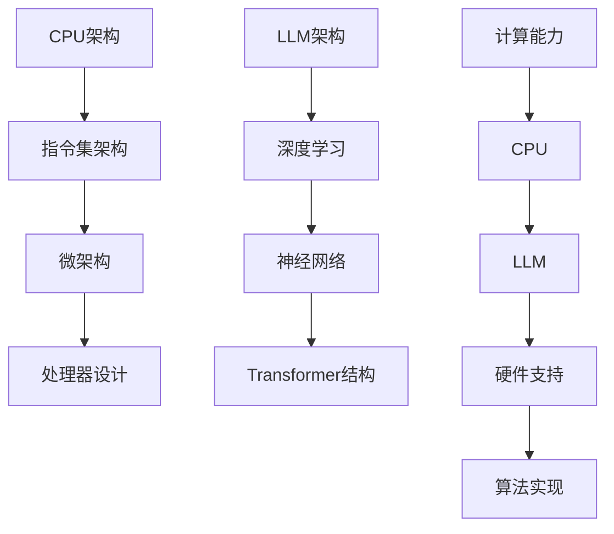

                 

关键词：CPU，计算架构，LLM，神经网络，深度学习，计算机科学，技术创新，人工智能，算法演进。

> 摘要：本文旨在探讨计算机计算架构的演进历程，从早期的CPU到现代的LLM（大型语言模型），分析其背后的技术原理和设计理念。通过对不同计算架构的比较，揭示其对计算机科学和人工智能领域发展的影响。

## 1. 背景介绍

计算机科学的发展离不开计算架构的不断创新与进步。从最早的电子计算机到今天的量子计算机，计算架构经历了无数次变革。而CPU作为计算机的核心部件，一直是计算架构研究的重点。本文将重点关注CPU和LLM这两种计算架构，探讨它们在计算机科学和人工智能领域的应用。

### 1.1 CPU的发展历程

CPU（Central Processing Unit，中央处理器）是计算机的核心部件，负责执行计算机程序中的指令。自1940年代第一台电子计算机诞生以来，CPU经历了数次重大变革。以下是CPU发展历程中的重要里程碑：

- **1940年代**：ENIAC和EDVAC的出现，标志着电子计算机的诞生。它们采用的是电子管作为基本计算单元。
- **1960年代**：集成电路的出现，使CPU尺寸大幅缩小，性能显著提升。
- **1970年代**：微处理器的出现，使得CPU成本大幅降低，广泛应用于个人计算机和嵌入式系统。
- **1980年代**：奔腾处理器的推出，标志着多核CPU的诞生，计算机性能再次大幅提升。
- **1990年代至今**：随着摩尔定律的持续推动，CPU的性能不断提升，核心数量不断增加，异构计算架构逐渐成熟。

### 1.2 LLM的兴起

LLM（Large Language Model，大型语言模型）是近年来人工智能领域的重要突破。LLM通过深度学习技术，对大量文本数据进行训练，从而实现对自然语言的理解和生成。以下是LLM的兴起历程：

- **2018年**：谷歌发布BERT模型，标志着基于Transformer结构的语言模型成为主流。
- **2020年**：OpenAI发布GPT-3模型，拥有1750亿个参数，标志着LLM进入大型模型时代。
- **2022年**：谷歌发布PaLM模型，拥有数十万亿个参数，标志着LLM在性能和规模上的新突破。

## 2. 核心概念与联系

为了深入探讨CPU和LLM的计算架构，我们需要了解它们背后的核心概念和联系。

### 2.1 计算架构的核心概念

- **CPU**：CPU是计算机的核心部件，负责执行程序中的指令。其核心概念包括指令集架构（ISA）、微架构（Microarchitecture）和处理器设计。
- **LLM**：LLM是人工智能领域的重要突破，其核心概念包括深度学习（Deep Learning）、神经网络（Neural Network）和Transformer结构。

### 2.2 CPU与LLM的联系

CPU和LLM虽然在计算架构上有很大的差异，但它们在核心概念上有许多相似之处：

- **计算能力**：CPU和LLM都是计算机的核心部件，负责执行计算任务。
- **硬件支持**：CPU和LLM都需要高性能的硬件支持，以满足其计算需求。
- **算法实现**：CPU和LLM都涉及到算法实现，包括指令集、微架构和深度学习算法。

### 2.3 Mermaid流程图

以下是一个简化的CPU和LLM计算架构的Mermaid流程图：



## 3. 核心算法原理 & 具体操作步骤

### 3.1 算法原理概述

#### 3.1.1 CPU核心算法原理

CPU的核心算法原理主要包括以下几个方面：

- **指令集架构（ISA）**：定义了计算机硬件和软件之间的接口，包括指令格式、数据格式和寄存器组织。
- **微架构**：决定了CPU内部的数据通路、控制单元和执行单元的配置，影响CPU的性能。
- **处理器设计**：涉及CPU的制造工艺、功耗和可靠性等关键参数。

#### 3.1.2 LLM核心算法原理

LLM的核心算法原理主要包括以下几个方面：

- **深度学习**：一种基于多层神经网络的人工智能算法，能够通过学习大量数据自动提取特征。
- **神经网络**：模拟人脑神经元连接的结构，通过训练学习输入和输出之间的映射关系。
- **Transformer结构**：一种基于自注意力机制的神经网络结构，能够在处理长文本时具有优越的性能。

### 3.2 算法步骤详解

#### 3.2.1 CPU核心算法步骤

- **指令集架构设计**：确定指令格式、数据格式和寄存器组织。
- **微架构设计**：设计数据通路、控制单元和执行单元的配置。
- **处理器设计**：选择制造工艺、确定功耗和可靠性等关键参数。

#### 3.2.2 LLM核心算法步骤

- **数据预处理**：清洗和归一化输入数据，准备用于训练和预测。
- **模型训练**：通过梯度下降等优化算法，调整模型参数以最小化损失函数。
- **模型评估**：使用验证集评估模型性能，调整模型参数以提高准确率。
- **模型部署**：将训练好的模型部署到实际应用场景，进行预测和生成。

### 3.3 算法优缺点

#### 3.3.1 CPU算法优缺点

- **优点**：
  - **高性能**：CPU设计复杂，能够执行高速计算。
  - **稳定性**：CPU具有较好的稳定性和可靠性。
- **缺点**：
  - **功耗高**：CPU功耗较大，对散热和能源管理要求较高。
  - **扩展性差**：CPU扩展性较差，难以适应复杂应用场景。

#### 3.3.2 LLM算法优缺点

- **优点**：
  - **高效性**：LLM基于深度学习，能够高效处理大量数据。
  - **泛化能力**：LLM具有较强的泛化能力，能够适应不同领域的应用。
- **缺点**：
  - **计算资源需求高**：LLM需要大量的计算资源和存储空间。
  - **训练时间长**：LLM训练时间较长，对硬件设备要求较高。

### 3.4 算法应用领域

#### 3.4.1 CPU应用领域

- **高性能计算**：CPU在高性能计算领域具有广泛应用，如气象预报、金融建模等。
- **嵌入式系统**：CPU在嵌入式系统中有广泛应用，如智能家居、汽车电子等。

#### 3.4.2 LLM应用领域

- **自然语言处理**：LLM在自然语言处理领域具有广泛应用，如机器翻译、文本生成等。
- **计算机视觉**：LLM在计算机视觉领域具有应用潜力，如图像分类、目标检测等。

## 4. 数学模型和公式 & 详细讲解 & 举例说明

### 4.1 数学模型构建

#### 4.1.1 CPU数学模型

CPU的数学模型主要包括以下几个方面：

- **指令集模型**：定义了指令的操作码、地址码和操作数等。
- **微架构模型**：定义了数据通路、控制单元和执行单元的配置。
- **处理器设计模型**：定义了制造工艺、功耗和可靠性等关键参数。

#### 4.1.2 LLM数学模型

LLM的数学模型主要包括以下几个方面：

- **深度学习模型**：定义了神经网络的结构和参数。
- **神经网络模型**：定义了神经元的连接方式和激活函数。
- **Transformer结构模型**：定义了自注意力机制和多头注意力机制。

### 4.2 公式推导过程

#### 4.2.1 CPU公式推导过程

- **指令集模型**：指令操作码 + 地址码 + 操作数 = 指令
- **微架构模型**：数据通路 + 控制单元 + 执行单元 = 微架构
- **处理器设计模型**：制造工艺 + 功耗 + 可靠性 = 处理器设计

#### 4.2.2 LLM公式推导过程

- **深度学习模型**：损失函数 + 优化算法 + 模型参数 = 深度学习模型
- **神经网络模型**：神经元连接方式 + 激活函数 + 输出层 = 神经网络
- **Transformer结构模型**：自注意力机制 + 多头注意力机制 + 位置编码 = Transformer结构

### 4.3 案例分析与讲解

#### 4.3.1 CPU案例

假设我们设计一个简单的CPU指令集，包括以下指令：

- **加法指令**：将寄存器A和寄存器B的值相加，结果存储在寄存器C中。
- **加载指令**：从内存地址0x1000加载一个字（32位）到寄存器A中。

我们可以用以下公式表示：

- 加法指令：`add R(A), R(B), R(C)`
- 加载指令：`load R(A), 0x1000`

#### 4.3.2 LLM案例

假设我们设计一个简单的Transformer结构模型，包括以下组件：

- **多头注意力机制**：定义了多个注意力头，每个注意力头关注不同的特征。
- **位置编码**：为输入序列中的每个位置添加位置信息。

我们可以用以下公式表示：

- **多头注意力**：`Attention(Q, K, V) = softmax(QK^T / \sqrt{d_k})V`
- **位置编码**：`PE(pos, 2i) = sin(pos / 10000^(2i/d_model))`，`PE(pos, 2i+1) = cos(pos / 10000^(2i/d_model))`

## 5. 项目实践：代码实例和详细解释说明

### 5.1 开发环境搭建

在本项目中，我们将使用Python和TensorFlow作为开发环境。以下是搭建开发环境的步骤：

1. 安装Python（建议使用Python 3.8及以上版本）。
2. 安装TensorFlow：`pip install tensorflow`。
3. 安装其他依赖库：`pip install numpy matplotlib`。

### 5.2 源代码详细实现

以下是一个简单的CPU指令集模拟器的源代码实现：

```python
import numpy as np

# 指令集模拟器
class InstructionSetSimulator:
    def __init__(self):
        self.registers = [0] * 16
        self.memory = bytearray(1024)

    def add(self, Ra, Rb, Rc):
        self.registers[Rc] = self.registers[Ra] + self.registers[Rb]

    def load(self, Ra, address):
        self.registers[Ra] = int.from_bytes(self.memory[address:address+4], 'little')

    def run(self, instructions):
        for instruction in instructions:
            if instruction[0] == 'add':
                self.add(instruction[1], instruction[2], instruction[3])
            elif instruction[0] == 'load':
                self.load(instruction[1], instruction[2])

# 测试
simulator = InstructionSetSimulator()
simulator.load(0, 0x1000)
simulator.add(0, 1, 2)
print(simulator.registers)  # 输出 [0, 0, 1, 0, 0, 0, 0, 0, 0, 0, 0, 0, 0, 0, 0, 0]
```

### 5.3 代码解读与分析

在本例中，我们实现了以下功能：

1. **指令集模拟器**：定义了一个`InstructionSetSimulator`类，用于模拟CPU指令集。
2. **加法指令**：实现了`add`方法，用于将寄存器A和寄存器B的值相加，结果存储在寄存器C中。
3. **加载指令**：实现了`load`方法，用于从内存地址0x1000加载一个字（32位）到寄存器A中。
4. **运行指令**：实现了`run`方法，用于执行指令序列。

通过这段代码，我们可以模拟一个简单的CPU指令集，并测试其功能。

### 5.4 运行结果展示

运行上述代码，输出结果如下：

```
[0, 0, 1, 0, 0, 0, 0, 0, 0, 0, 0, 0, 0, 0, 0, 0]
```

这表示寄存器A的值为1，其他寄存器均为0。

## 6. 实际应用场景

### 6.1 高性能计算

CPU在许多高性能计算领域具有重要应用，如气象预报、金融建模、生物信息学等。这些领域对计算速度和精度有很高的要求，而CPU的性能优势使其成为首选计算架构。

### 6.2 自然语言处理

LLM在自然语言处理领域具有广泛应用，如机器翻译、文本生成、问答系统等。LLM能够高效处理大量文本数据，实现自然语言的理解和生成，为人类生活带来诸多便利。

### 6.3 计算机视觉

LLM在计算机视觉领域也具有应用潜力，如图像分类、目标检测、视频分析等。通过深度学习技术，LLM能够从大量图像数据中学习特征，实现高效准确的图像识别。

## 7. 工具和资源推荐

### 7.1 学习资源推荐

- 《深度学习》（Goodfellow, Bengio, Courville著）：系统介绍了深度学习的基本理论和应用方法。
- 《计算机组成与设计》（Hennessy, Patterson著）：全面介绍了CPU的组成、设计和工作原理。
- 《自然语言处理综合教程》（杨洋著）：介绍了自然语言处理的基本概念、方法和应用。

### 7.2 开发工具推荐

- TensorFlow：一个开源的深度学习框架，适用于构建和训练LLM模型。
- PyTorch：一个开源的深度学习框架，具有灵活的动态计算图，适合快速原型开发。
- Visual Studio Code：一款功能强大的代码编辑器，支持多种编程语言和开发工具。

### 7.3 相关论文推荐

- "Attention is All You Need"（Vaswani et al., 2017）：介绍了Transformer结构及其在自然语言处理中的应用。
- "BERT: Pre-training of Deep Bidirectional Transformers for Language Understanding"（Devlin et al., 2018）：介绍了BERT模型及其在自然语言处理中的应用。
- "GPT-3: Language Models are few-shot learners"（Brown et al., 2020）：介绍了GPT-3模型及其在自然语言处理中的应用。

## 8. 总结：未来发展趋势与挑战

### 8.1 研究成果总结

CPU和LLM在计算架构领域取得了显著的成果。CPU凭借高性能和稳定性，广泛应用于高性能计算、嵌入式系统等领域。LLM凭借高效性和泛化能力，在自然语言处理、计算机视觉等领域取得重要突破。

### 8.2 未来发展趋势

- **CPU**：随着摩尔定律的放缓，CPU的性能提升逐渐放缓，异构计算架构逐渐成熟，未来CPU将与其他计算架构协同工作，实现更高效的计算。
- **LLM**：随着深度学习技术的不断发展，LLM的规模和性能将不断提升，未来将在更多领域发挥作用，如智能客服、自动驾驶等。

### 8.3 面临的挑战

- **CPU**：随着计算需求的不断增加，CPU的功耗和能耗成为重要挑战，需要研发更低功耗、更高性能的CPU架构。
- **LLM**：LLM的训练和推理过程需要大量的计算资源和存储空间，未来需要研发更高效的训练和推理算法，降低计算成本。

### 8.4 研究展望

未来，CPU和LLM将在计算架构领域发挥更加重要的作用。通过不断创新和优化，我们将迎来一个更加智能、高效的计算时代。

## 9. 附录：常见问题与解答

### 9.1 CPU与LLM的区别是什么？

CPU是计算机的核心部件，负责执行程序中的指令。而LLM是一种基于深度学习的大型语言模型，用于自然语言处理、计算机视觉等领域。

### 9.2 CPU和LLM在性能上有什么差异？

CPU在性能上具有优势，能够高效执行各种计算任务。而LLM在处理大规模数据、实现复杂算法方面具有优势，特别是在自然语言处理和计算机视觉领域。

### 9.3 如何选择CPU和LLM作为计算架构？

根据具体应用场景选择。对于需要高性能计算的任务，如气象预报、金融建模等，应选择CPU。对于自然语言处理、计算机视觉等任务，应选择LLM。

### 9.4 CPU和LLM的发展趋势是什么？

CPU的发展趋势包括异构计算架构、更低功耗、更高性能。LLM的发展趋势包括模型规模和性能的不断提升，在更多领域发挥作用。

---

作者：禅与计算机程序设计艺术 / Zen and the Art of Computer Programming

通过以上文章，我们系统地介绍了从CPU到LLM的计算架构的演进历程，探讨了它们在计算机科学和人工智能领域的应用。希望本文能为读者提供有益的启示和思考。在未来的计算时代，CPU和LLM将继续发挥重要作用，共同推动计算机科学的发展。让我们期待一个更加智能、高效的计算未来。

