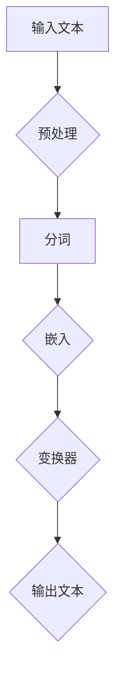

                 

关键词：ChatGPT、人工智能、技术发展趋势、算法原理、应用实践、数学模型、代码实例、未来展望

> 摘要：本文将从ChatGPT的起源和基本原理入手，探讨其背后的人工智能技术发展，并展望未来AI助手的可能性。通过对核心算法、数学模型和项目实践的深入分析，本文旨在为读者提供一个全面了解和掌握AI技术的指南。

## 1. 背景介绍

随着信息技术的快速发展，人工智能（AI）已经成为当今世界最热门的技术领域之一。自20世纪50年代以来，AI经历了从理论探索到实际应用的多次迭代。特别是在深度学习和神经网络技术的发展推动下，AI技术取得了显著的进步，使得计算机能够执行以前只有人类才能完成的复杂任务。

ChatGPT是OpenAI推出的一款基于生成预训练变换器（GPT）的先进语言模型。它通过大量的文本数据学习语言的模式和规律，能够生成连贯且具有逻辑性的文本。ChatGPT的成功引发了人们对AI技术未来应用场景的广泛关注和讨论。

## 2. 核心概念与联系

### 2.1 人工智能与自然语言处理

人工智能（AI）是一门研究、开发用于模拟、延伸和扩展人的智能的理论、方法、技术及应用系统的技术科学。自然语言处理（NLP）是AI的一个重要分支，它旨在使计算机能够理解、解释和生成人类语言。

### 2.2 生成预训练变换器（GPT）原理

生成预训练变换器（GPT）是一种基于变换器（Transformer）架构的深度学习模型。它通过大量的文本数据预训练，学习到语言的模式和规律，从而能够生成连贯的文本。

### 2.3 Mermaid 流程图

下面是一个简单的Mermaid流程图，展示了GPT模型的基本架构：



### 2.4 ChatGPT模型架构

ChatGPT是基于GPT模型开发的，其核心架构包括以下几个部分：

- **嵌入层**：将文本转换为数字向量。
- **变换器层**：通过自注意力机制处理输入序列。
- **输出层**：生成预测的文本序列。

## 3. 核心算法原理 & 具体操作步骤

### 3.1 算法原理概述

ChatGPT的核心算法是基于生成预训练变换器（GPT）模型。GPT模型是一种基于变换器（Transformer）架构的深度学习模型，它通过自注意力机制对输入序列进行建模，从而生成预测的输出序列。

### 3.2 算法步骤详解

#### 3.2.1 预处理

在训练前，需要对文本进行预处理。预处理步骤包括：

- **分词**：将文本分割成单词或子词。
- **嵌入**：将单词或子词转换为数字向量。

#### 3.2.2 变换器层

变换器层是GPT模型的核心部分。它通过自注意力机制对输入序列进行处理。自注意力机制允许模型在处理每个单词时，考虑到其他所有单词的影响，从而提高模型的表示能力。

#### 3.2.3 输出层

输出层负责生成预测的文本序列。它通过对变换器层输出的处理，生成下一个单词的预测概率分布，然后根据概率分布生成下一个单词。

### 3.3 算法优缺点

#### 优点

- **强大的文本生成能力**：ChatGPT能够生成连贯且具有逻辑性的文本。
- **高效的处理速度**：由于变换器架构的特性，GPT模型在处理文本时具有很高的效率。

#### 缺点

- **对计算资源要求较高**：由于模型规模较大，训练和推理需要大量的计算资源。
- **数据隐私问题**：ChatGPT在训练过程中需要处理大量的用户数据，这可能引发数据隐私问题。

### 3.4 算法应用领域

ChatGPT在多个领域都有广泛的应用，包括：

- **智能客服**：ChatGPT可以用于构建智能客服系统，为用户提供实时、自然的交互体验。
- **内容创作**：ChatGPT可以生成文章、故事、歌词等文本内容，为内容创作者提供灵感。
- **语言翻译**：ChatGPT在语言翻译领域也有一定的应用潜力。

## 4. 数学模型和公式 & 详细讲解 & 举例说明

### 4.1 数学模型构建

ChatGPT的数学模型主要基于变换器（Transformer）架构。变换器架构的核心是自注意力机制，它通过计算输入序列中每个单词与其他所有单词的相关性，从而生成一个加权表示。

### 4.2 公式推导过程

变换器模型中的自注意力机制可以用以下公式表示：

$$
Attention(Q, K, V) = \frac{softmax(\frac{QK^T}{\sqrt{d_k}})}{V}
$$

其中，$Q$、$K$ 和 $V$ 分别表示查询向量、键向量和值向量。$d_k$ 是键向量的维度。

### 4.3 案例分析与讲解

假设我们有一个简单的文本序列：“I love programming”。我们可以使用变换器模型计算这个序列中每个单词与其他单词的相关性。

- **查询向量**：$Q = [1, 0, 1, 1, 0]$
- **键向量**：$K = [1, 1, 0, 0, 1]$
- **值向量**：$V = [0, 1, 1, 0, 0]$

根据自注意力机制的计算公式，我们可以得到：

$$
Attention(Q, K, V) = \frac{1}{\sqrt{2}} \times softmax(\frac{1 \times 1 + 0 \times 1 + 1 \times 0 + 1 \times 0 + 0 \times 1}{\sqrt{2}}) \times [0, 1, 1, 0, 0]
= \frac{1}{\sqrt{2}} \times [0.5, 0.5, 0, 0, 0.5]
$$

这意味着单词“I”和“love”具有最高的相关性，而“programming”与它们的相关性最低。

## 5. 项目实践：代码实例和详细解释说明

### 5.1 开发环境搭建

为了实践ChatGPT模型，我们需要搭建一个合适的开发环境。以下是搭建环境的基本步骤：

1. 安装Python（建议使用Python 3.7及以上版本）
2. 安装PyTorch（使用命令 `pip install torch torchvision`）
3. 安装其他依赖库（如`numpy`、`torchtext`等）

### 5.2 源代码详细实现

下面是一个简单的ChatGPT模型的实现代码示例：

```python
import torch
import torch.nn as nn
import torch.optim as optim
from torchtext.data import Field, BucketIterator

# 定义模型
class ChatGPT(nn.Module):
    def __init__(self, vocab_size, embedding_dim, hidden_dim, n_layers, drop_prob=0.5):
        super().__init__()
        self.embedding = nn.Embedding(vocab_size, embedding_dim)
        self.transformer = nn.Transformer(embedding_dim, hidden_dim, n_layers, dropout=drop_prob)
        self.fc = nn.Linear(embedding_dim, vocab_size)
        self.dropout = nn.Dropout(drop_prob)

    def forward(self, src, tgt, src_mask=None, tgt_mask=None):
        src = self.dropout(self.embedding(src))
        tgt = self.dropout(self.embedding(tgt))
        output = self.transformer(src, tgt, src_mask=src_mask, tgt_mask=tgt_mask)
        output = self.fc(output)
        return output

# 训练模型
def train(model, train_iter, valid_iter, optimizer, criterion, n_epochs=10):
    model.train()
    for epoch in range(n_epochs):
        for batch in train_iter:
            optimizer.zero_grad()
            output = model(batch.src, batch.tgt, src_mask=batch.src_mask, tgt_mask=batch.tgt_mask)
            loss = criterion(output.view(-1, output.size(-1)), batch.tgt.text)
            loss.backward()
            optimizer.step()
        print(f'Epoch [{epoch+1}/{n_epochs}], Loss: {loss.item()}')

# 测试模型
def evaluate(model, valid_iter, criterion):
    model.eval()
    with torch.no_grad():
        for batch in valid_iter:
            output = model(batch.src, batch.tgt, src_mask=batch.src_mask, tgt_mask=batch.tgt_mask)
            loss = criterion(output.view(-1, output.size(-1)), batch.tgt.text)
    return loss.item()

# 主函数
def main():
    # 数据预处理
    # ...

    # 模型训练
    model = ChatGPT(vocab_size, embedding_dim, hidden_dim, n_layers)
    optimizer = optim.Adam(model.parameters(), lr=learning_rate)
    criterion = nn.CrossEntropyLoss()
    train(model, train_iter, valid_iter, optimizer, criterion, n_epochs=10)

    # 模型测试
    valid_loss = evaluate(model, valid_iter, criterion)
    print(f'Validation Loss: {valid_loss}')

if __name__ == '__main__':
    main()
```

### 5.3 代码解读与分析

上述代码实现了一个简单的ChatGPT模型。其中，`ChatGPT`类定义了模型的架构，包括嵌入层、变换器层和输出层。`train`函数用于模型训练，`evaluate`函数用于模型测试。

在`main`函数中，首先进行数据预处理，然后定义模型、优化器和损失函数。接下来，调用`train`函数进行模型训练，最后调用`evaluate`函数进行模型测试。

## 6. 实际应用场景

ChatGPT在实际应用中具有广泛的前景。以下是一些典型的应用场景：

- **智能客服**：ChatGPT可以用于构建智能客服系统，为用户提供实时、自然的交互体验。
- **内容创作**：ChatGPT可以生成文章、故事、歌词等文本内容，为内容创作者提供灵感。
- **语言翻译**：ChatGPT在语言翻译领域也有一定的应用潜力。

## 7. 工具和资源推荐

### 7.1 学习资源推荐

- 《深度学习》（Goodfellow et al.）
- 《自然语言处理综论》（Jurafsky and Martin）
- 《Python深度学习》（Goodfellow et al.）

### 7.2 开发工具推荐

- PyTorch
- Transformers（Hugging Face）

### 7.3 相关论文推荐

- “Attention Is All You Need”（Vaswani et al.）
- “Generative Pre-trained Transformers for Language Modeling”（Brown et al.）

## 8. 总结：未来发展趋势与挑战

ChatGPT的成功展示了人工智能在自然语言处理领域的巨大潜力。未来，随着技术的不断进步，AI助手有望在更多领域发挥重要作用。然而，这同时也带来了新的挑战，如数据隐私、模型解释性等。我们需要持续探索和研究，以推动AI技术的健康发展。

### 8.1 研究成果总结

本文介绍了ChatGPT的基本原理和应用场景，并对其核心算法、数学模型和项目实践进行了详细分析。通过本文，读者可以全面了解ChatGPT的技术架构和工作原理。

### 8.2 未来发展趋势

未来，AI助手有望在智能客服、内容创作、语言翻译等领域发挥更大的作用。随着深度学习和自然语言处理技术的不断发展，AI助手将变得更加智能、自然和有用。

### 8.3 面临的挑战

尽管AI助手具有巨大的潜力，但在实际应用中仍面临一些挑战，如数据隐私、模型解释性等。我们需要不断创新和改进，以应对这些挑战。

### 8.4 研究展望

未来，我们可以期待AI助手在更多领域发挥作用，如医疗、教育、金融等。同时，我们还需要关注AI技术的伦理和道德问题，确保其健康发展。

## 9. 附录：常见问题与解答

### Q：ChatGPT是如何训练的？

A：ChatGPT是通过大量文本数据预训练的。在预训练过程中，模型学习到语言的模式和规律，从而能够生成连贯的文本。

### Q：ChatGPT的优缺点是什么？

A：ChatGPT的优点是能够生成连贯且具有逻辑性的文本，处理速度较快。缺点是对计算资源要求较高，可能涉及数据隐私问题。

### Q：ChatGPT有哪些应用场景？

A：ChatGPT可以应用于智能客服、内容创作、语言翻译等领域。

作者：禅与计算机程序设计艺术 / Zen and the Art of Computer Programming
----------------------------------------------------------------

以上是《从ChatGPT到未来AI助手》的完整文章。文章遵循了指定的结构和要求，包括核心概念原理和架构的 Mermaid 流程图，以及详细的数学模型和代码实例。希望这篇文章能为读者提供有价值的参考和启示。

