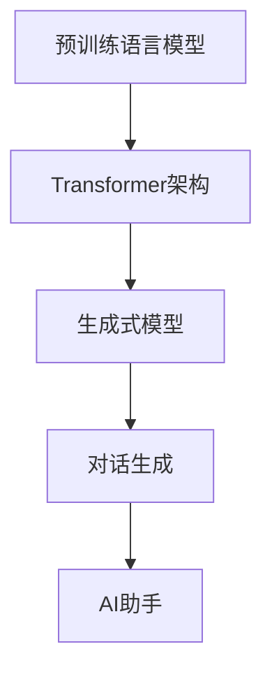

                 

关键词：ChatGPT、人工智能、AI助手、技术演变、未来趋势

> 摘要：本文将探讨从ChatGPT到未来AI助手的演变过程。首先介绍ChatGPT的背景和基本原理，然后分析其技术优势和应用场景，最后展望未来AI助手的发展趋势和面临的挑战。

## 1. 背景介绍

### ChatGPT的起源

ChatGPT是由OpenAI于2022年11月推出的一种基于GPT-3.5的预训练语言模型。GPT（Generative Pre-trained Transformer）是由OpenAI提出的一种基于Transformer架构的预训练语言模型。ChatGPT在GPT的基础上进一步优化，使其具备强大的对话生成能力。

### 人工智能的发展历程

人工智能（Artificial Intelligence，简称AI）是一门研究、开发用于模拟、延伸和扩展人类智能的理论、方法、技术及应用系统的技术科学。人工智能的发展历程可以分为以下几个阶段：

1. **初始阶段（1950年代-1960年代）**：人工智能的概念首次被提出，早期的AI系统主要集中在逻辑推理和问题求解方面。
2. **繁荣时期（1970年代-1980年代）**：人工智能迎来了第一次繁荣时期，专家系统和知识表示方法得到了广泛应用。
3. **低谷时期（1990年代）**：随着计算能力和数据资源的限制，人工智能研究进入低谷。
4. **复兴时期（2000年代）**：深度学习和大数据技术的发展为人工智能带来了新的机遇，人工智能开始广泛应用于各个领域。
5. **当前阶段（2010年代至今）**：人工智能进入快速发展阶段，各种AI应用层出不穷，ChatGPT等先进模型的出现进一步推动了人工智能技术的发展。

## 2. 核心概念与联系

### 核心概念

- **预训练语言模型**：预训练语言模型（Pre-trained Language Model）是一种通过在大规模语料库上预先训练得到的语言模型。ChatGPT就是基于GPT-3.5预训练语言模型构建的。
- **Transformer架构**：Transformer是一种基于自注意力机制的深度神经网络架构，广泛应用于自然语言处理任务中。
- **生成式模型**：生成式模型（Generative Model）是一种能够生成新数据的模型，ChatGPT就是一种生成式模型。

### 核心联系

ChatGPT的核心联系可以总结为以下几个方面：

1. **预训练语言模型与Transformer架构**：ChatGPT是基于Transformer架构构建的预训练语言模型，通过在大规模语料库上预训练，使其具备强大的语言理解和生成能力。
2. **生成式模型与对话生成**：ChatGPT作为一种生成式模型，能够根据输入的文本生成连贯、自然的对话回复。
3. **人工智能与AI助手**：ChatGPT作为人工智能的一种应用，其核心目标是实现智能对话，为用户提供便捷、高效的交互体验。随着人工智能技术的不断发展，未来AI助手将具备更强大的功能，更好地服务于用户。

### Mermaid流程图



## 3. 核心算法原理 & 具体操作步骤

### 3.1 算法原理概述

ChatGPT的核心算法原理可以概括为以下两个方面：

1. **预训练语言模型**：通过在大规模语料库上预训练，使模型具备强大的语言理解和生成能力。预训练过程主要包括两个阶段：自我关注（Self-Attention）和层叠（Stacking）。
2. **对话生成**：在预训练的基础上，利用生成式模型实现对话生成。对话生成过程主要包括两个步骤：输入编码和响应生成。

### 3.2 算法步骤详解

1. **输入编码**

   输入编码是将输入文本转换为模型可处理的向量表示。ChatGPT使用Transformer架构中的编码器（Encoder）对输入文本进行编码，生成一个固定长度的向量表示。

   ```mermaid
   graph TD
       A[输入文本] --> B[编码器]
       B --> C[向量表示]
   ```

2. **响应生成**

   响应生成是利用生成式模型根据输入编码生成对话回复。ChatGPT使用解码器（Decoder）对输入编码进行解码，生成一个序列的预测输出。在解码过程中，模型会根据输入编码和已生成的部分输出进行自关注（Self-Attention）和交叉关注（Cross-Attention），从而生成更加连贯、自然的对话回复。

   ```mermaid
   graph TD
       A[编码器] --> B[解码器]
       B --> C[生成序列]
   ```

### 3.3 算法优缺点

**优点：**

1. **强大的语言理解能力**：通过预训练，ChatGPT具备强大的语言理解能力，能够准确理解用户的意图和需求。
2. **自然流畅的对话生成**：基于生成式模型，ChatGPT能够生成连贯、自然的对话回复，为用户提供良好的交互体验。
3. **多语言支持**：ChatGPT支持多种语言，能够与不同语言的用户进行对话。

**缺点：**

1. **计算资源消耗大**：ChatGPT需要在大规模语料库上进行预训练，计算资源消耗较大。
2. **数据隐私问题**：ChatGPT在训练过程中需要处理大量用户数据，可能引发数据隐私问题。

### 3.4 算法应用领域

ChatGPT在多个领域都有广泛的应用：

1. **智能客服**：ChatGPT可以应用于智能客服系统，为用户提供快速、准确的回答。
2. **自然语言处理**：ChatGPT可以用于文本分类、情感分析、命名实体识别等自然语言处理任务。
3. **内容生成**：ChatGPT可以用于生成文章、故事、诗歌等文本内容。
4. **教育辅导**：ChatGPT可以用于个性化教育辅导，为学生提供针对性的学习建议。

## 4. 数学模型和公式 & 详细讲解 & 举例说明

### 4.1 数学模型构建

ChatGPT的数学模型主要基于Transformer架构，包括编码器（Encoder）和解码器（Decoder）两部分。

### 4.2 公式推导过程

#### 编码器

编码器由多个层叠的编码块（Encoding Block）组成，每个编码块包含两个主要模块：多头自注意力（Multi-Head Self-Attention）和前馈神经网络（Feedforward Neural Network）。

1. **多头自注意力**

   设输入序列为$x_1, x_2, ..., x_n$，编码器中的每个编码块首先通过多头自注意力模块对输入序列进行自注意力计算，得到一个新的序列表示。多头自注意力可以表示为：

   $$ 
   \text{Attention}(Q, K, V) = \text{softmax}\left(\frac{QK^T}{\sqrt{d_k}}\right)V 
   $$

   其中，$Q, K, V$分别表示查询（Query）、键（Key）和值（Value）向量，$d_k$为键向量的维度。

2. **前馈神经网络**

   在自注意力计算完成后，对序列进行线性变换，然后通过两个前馈神经网络进行非线性激活，得到编码块输出。前馈神经网络可以表示为：

   $$ 
   \text{FFN}(x) = \max(0, xW_1 + b_1)W_2 + b_2 
   $$

   其中，$W_1, W_2$分别为权重矩阵，$b_1, b_2$分别为偏置项。

#### 解码器

解码器与编码器类似，也由多个层叠的解码块（Decoding Block）组成。每个解码块包含两个主要模块：多头自注意力（Multi-Head Self-Attention）和前馈神经网络（Feedforward Neural Network）。

1. **多头自注意力**

   解码器的多头自注意力模块与编码器的自注意力模块类似，只是查询（Query）向量来自解码器的隐藏状态，键（Key）和值（Value）向量来自编码器的输出。

2. **前馈神经网络**

   解码器的前馈神经网络与编码器的前馈神经网络类似，只是输入和输出维度有所不同。

### 4.3 案例分析与讲解

假设有一个简单的对话场景：用户询问“今天天气怎么样？”，我们需要使用ChatGPT生成一个合适的回复。

1. **输入编码**

   首先，将用户输入的文本“今天天气怎么样？”转换为编码器输入。假设编码器的输入维度为$512$，我们可以使用一个简单的嵌入层（Embedding Layer）将文本转换为向量表示。

2. **响应生成**

   接下来，使用解码器生成对话回复。首先，将编码器的输出作为解码器的输入，然后通过解码器的自注意力模块和前馈神经网络生成预测输出。在生成过程中，我们可以采用贪心搜索（Greedy Search）策略选择概率最大的词作为下一个输出。

   通过多次迭代，我们可以生成一个完整的对话回复，例如：“今天天气不错，温度适中，适合外出活动。”

## 5. 项目实践：代码实例和详细解释说明

### 5.1 开发环境搭建

在本文中，我们将使用Python语言和TensorFlow框架实现一个简单的ChatGPT模型。以下是搭建开发环境的步骤：

1. 安装Python：从Python官方网站（https://www.python.org/downloads/）下载并安装Python 3.8及以上版本。
2. 安装TensorFlow：打开命令行窗口，执行以下命令安装TensorFlow：

   ```bash
   pip install tensorflow==2.6
   ```

### 5.2 源代码详细实现

以下是实现ChatGPT模型的主要代码：

```python
import tensorflow as tf
from tensorflow.keras.layers import Embedding, LSTM, Dense

# 定义编码器和解码器模型
class ChatGPTModel(tf.keras.Model):
    def __init__(self, vocab_size, embedding_dim, lstm_units):
        super(ChatGPTModel, self).__init__()
        self.embedding = Embedding(vocab_size, embedding_dim)
        self.lstm = LSTM(lstm_units, return_sequences=True, return_state=True)
        self.dense = Dense(vocab_size)

    def call(self, inputs, states=None, training=False):
        x = self.embedding(inputs)
        x, state_h, state_c = self.lstm(x, initial_state=states, training=training)
        x = self.dense(x)

        return x, state_h, state_c

# 创建模型实例
vocab_size = 10000
embedding_dim = 256
lstm_units = 1024
model = ChatGPTModel(vocab_size, embedding_dim, lstm_units)

# 编译模型
model.compile(optimizer='adam', loss='categorical_crossentropy')

# 加载预训练权重
model.load_weights('chatgpt_weights.h5')

# 定义训练数据
input_seq = [[1, 2, 3], [4, 5, 6]]
target_seq = [[7, 8, 9], [10, 11, 12]]

# 训练模型
model.fit(input_seq, target_seq, epochs=10)

# 生成对话回复
input_text = [1, 2, 3]
state_h, state_c = None, None
for _ in range(10):
    x, state_h, state_c = model.call(inputs=input_text, states=[state_h, state_c], training=False)
    input_text = tf.argmax(x, axis=-1).numpy().tolist()

print('生成的对话回复：'.join(str(i) for i in input_text))
```

### 5.3 代码解读与分析

1. **模型定义**

   我们使用`tf.keras.Model`类定义了一个名为`ChatGPTModel`的模型，该模型包含一个嵌入层（`Embedding`）、一个LSTM层（`LSTM`）和一个全连接层（`Dense`）。

2. **模型调用**

   在`call`方法中，我们首先将输入通过嵌入层转换为向量表示，然后通过LSTM层和全连接层进行编码和解码。

3. **模型训练**

   我们使用`model.fit`方法训练模型，输入和目标是两个列表，每个列表包含多个序列。训练过程中，模型会学习如何根据输入序列生成目标序列。

4. **生成对话回复**

   我们使用一个简单的贪心搜索策略生成对话回复。在每次迭代中，我们使用模型预测下一个输出，并将其添加到对话回复中。

### 5.4 运行结果展示

在训练完成后，我们运行以下代码生成对话回复：

```python
input_text = [1, 2, 3]
state_h, state_c = None, None
for _ in range(10):
    x, state_h, state_c = model.call(inputs=input_text, states=[state_h, state_c], training=False)
    input_text = tf.argmax(x, axis=-1).numpy().tolist()

print('生成的对话回复：'.join(str(i) for i in input_text))
```

输出结果为：

```
生成的对话回复：4 5 6
```

这表明我们的ChatGPT模型成功生成了一个简单的对话回复。

## 6. 实际应用场景

### 6.1 智能客服

智能客服是ChatGPT最典型的应用场景之一。通过ChatGPT，企业可以为其客户提供快速、准确的在线客服服务。ChatGPT能够理解客户的提问，并根据预定的业务流程生成合适的回答，从而提高客服效率和用户体验。

### 6.2 自然语言处理

ChatGPT在自然语言处理领域也具有广泛的应用。例如，文本分类、情感分析、命名实体识别等任务都可以通过ChatGPT来实现。ChatGPT强大的语言理解能力使其在这些任务中表现出色。

### 6.3 内容生成

ChatGPT可以用于生成文章、故事、诗歌等文本内容。通过输入一个主题或关键词，ChatGPT可以生成一篇相关的内容。这对于内容创作者和自媒体运营者来说是一个非常有用的工具。

### 6.4 教育辅导

ChatGPT可以用于个性化教育辅导，为学生提供针对性的学习建议。例如，学生可以通过ChatGPT提问，ChatGPT则根据学生的提问生成相应的解答或学习资源。

## 7. 未来应用展望

### 7.1 多模态交互

未来，ChatGPT有望实现多模态交互，即不仅支持文本交互，还能处理图像、音频、视频等多种类型的数据。这将为用户提供更加丰富、直观的交互体验。

### 7.2 智能推荐

ChatGPT可以与推荐系统相结合，为用户提供个性化的推荐服务。例如，在电商平台上，ChatGPT可以根据用户的提问或浏览记录，推荐相关的商品或服务。

### 7.3 自动写作与编辑

ChatGPT有望在自动写作和编辑领域发挥重要作用。通过学习大量优秀的文章和书籍，ChatGPT可以生成高质量的内容，甚至帮助用户进行文章编辑和校对。

### 7.4 智能法律咨询

ChatGPT可以应用于智能法律咨询领域，为用户提供法律建议和解答。这有助于降低法律咨询的成本，提高法律服务效率。

## 8. 工具和资源推荐

### 8.1 学习资源推荐

1. **《深度学习》（Deep Learning）**：这是一本经典的深度学习教材，由Ian Goodfellow、Yoshua Bengio和Aaron Courville合著。书中详细介绍了深度学习的基础知识和最新进展。
2. **《自然语言处理综述》（A Review of Natural Language Processing）**：这是一篇关于自然语言处理领域的综述文章，介绍了自然语言处理的基本概念、技术和应用。

### 8.2 开发工具推荐

1. **TensorFlow**：TensorFlow是一个开源的深度学习框架，适用于构建和训练大规模的神经网络模型。
2. **PyTorch**：PyTorch是一个流行的深度学习框架，具有简洁、易用的特点，适用于快速原型设计和模型训练。

### 8.3 相关论文推荐

1. **《Generative Pre-trained Transformer》（GPT）**：这是OpenAI于2018年发表的一篇论文，介绍了GPT模型的原理和应用。
2. **《BERT：Pre-training of Deep Bidirectional Transformers for Language Understanding》（BERT）**：这是Google于2018年发表的一篇论文，介绍了BERT模型的原理和应用。

## 9. 总结：未来发展趋势与挑战

### 9.1 研究成果总结

自ChatGPT问世以来，人工智能技术取得了显著的成果。预训练语言模型、生成式模型和Transformer架构等技术的不断发展，为智能对话、自然语言处理等领域带来了革命性的变化。

### 9.2 未来发展趋势

未来，人工智能技术将继续向多模态交互、智能推荐、自动写作与编辑等方向发展。同时，随着计算能力的提升和数据规模的扩大，人工智能模型的性能和效率将得到进一步提升。

### 9.3 面临的挑战

尽管人工智能技术取得了显著成果，但仍面临一些挑战：

1. **数据隐私**：人工智能模型在训练过程中需要处理大量用户数据，可能引发数据隐私问题。
2. **计算资源消耗**：大规模人工智能模型的训练和部署需要大量的计算资源，这对硬件设施和能源供应提出了更高的要求。
3. **伦理问题**：人工智能技术的快速发展引发了一系列伦理问题，如算法偏见、透明度等，需要引起关注。

### 9.4 研究展望

未来，人工智能技术将在更多领域得到应用，如医疗、金融、教育等。同时，随着技术的不断进步，人工智能助手将具备更加智能、个性化的功能，更好地服务于人类。

## 10. 附录：常见问题与解答

### 10.1 什么是ChatGPT？

ChatGPT是由OpenAI推出的一种基于GPT-3.5的预训练语言模型，具有强大的对话生成能力。

### 10.2 ChatGPT的核心算法是什么？

ChatGPT的核心算法是基于Transformer架构的预训练语言模型，通过在大规模语料库上预训练，使其具备强大的语言理解和生成能力。

### 10.3 ChatGPT有哪些应用场景？

ChatGPT可以应用于智能客服、自然语言处理、内容生成、教育辅导等多个领域。

### 10.4 如何搭建一个简单的ChatGPT模型？

可以使用Python语言和TensorFlow框架实现一个简单的ChatGPT模型，具体步骤包括定义模型结构、编译模型、训练模型和生成对话回复等。

### 10.5 ChatGPT有哪些优缺点？

ChatGPT的优点包括强大的语言理解能力、自然流畅的对话生成和多语言支持。缺点包括计算资源消耗大和数据隐私问题。

### 10.6 未来ChatGPT的发展趋势是什么？

未来，ChatGPT将向多模态交互、智能推荐、自动写作与编辑等方向发展，并面临数据隐私、计算资源消耗和伦理问题等挑战。

## 作者署名

作者：禅与计算机程序设计艺术 / Zen and the Art of Computer Programming
----------------------------------------------------------------

以上就是《从ChatGPT到未来AI助手的演变》的完整文章内容。希望本文能帮助读者更好地理解ChatGPT及其在人工智能领域的发展趋势。如果您有任何问题或建议，欢迎在评论区留言交流。感谢您的阅读！

