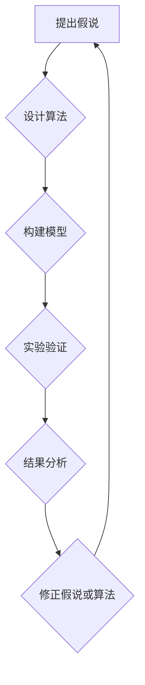

                 

关键词：科学方法论，假说-演绎法，迭代思维，算法，代码实例，应用场景，未来展望

> 摘要：本文深入探讨了科学方法论在信息技术领域的应用，从假说到真理的转化过程。通过分析科学方法论的核心概念、算法原理、数学模型和实际应用，本文旨在为读者提供一个逻辑清晰、结构紧凑的科技观察视角，探讨信息技术领域的未来发展趋势与挑战。

## 1. 背景介绍

科学方法论是科学研究的基本框架，它指导我们如何提出假说、设计实验、分析数据和得出结论。在信息技术领域，科学方法论的应用尤为重要。从计算机科学到人工智能，科学方法论为技术创新提供了强大的驱动力。本文将围绕以下核心问题展开讨论：

- 信息技术领域中的科学方法论是如何运作的？
- 什么样的假说在信息技术领域中被证明是有效的？
- 科学方法论在算法设计、数学建模和实际应用中发挥了什么作用？
- 信息技术领域的未来发展将面临什么样的挑战和机遇？

## 2. 核心概念与联系

在探讨科学方法论在信息技术领域的应用之前，我们需要了解几个核心概念：假说、算法、模型和验证。

### 2.1 假说

假说是科学探究的起点。在信息技术领域，假说通常是对某一现象或问题的初步猜想。例如，在机器学习中，我们可能会假设计算机可以通过大量数据训练来预测未知数据。

### 2.2 算法

算法是解决特定问题的系统步骤。在信息技术领域，算法用于实现各种功能，如排序、搜索、加密和机器学习。算法的设计和优化是科学方法论的重要组成部分。

### 2.3 模型

模型是对现实世界的抽象表示。在信息技术领域，模型可以用于模拟复杂系统，如神经网络模型用于模拟人类思维过程，或模拟经济模型预测市场趋势。

### 2.4 验证

验证是通过实验和数据分析来检验假说和算法的有效性。在信息技术领域，验证通常涉及测试代码的效率和准确性，以及通过实验验证模型的预测能力。

下面是科学方法论在信息技术领域应用的Mermaid流程图：



## 3. 核心算法原理 & 具体操作步骤

### 3.1 算法原理概述

在信息技术领域，常见的算法有排序算法、搜索算法和机器学习算法等。每种算法都有其特定的原理和应用场景。

#### 3.1.1 排序算法

排序算法用于将一组数据按照特定的顺序排列。常见的排序算法有冒泡排序、选择排序和快速排序等。

#### 3.1.2 搜索算法

搜索算法用于在数据结构中查找特定元素。常见的搜索算法有线性搜索、二分搜索等。

#### 3.1.3 机器学习算法

机器学习算法用于从数据中学习规律并做出预测。常见的算法有线性回归、支持向量机、神经网络等。

### 3.2 算法步骤详解

以下是机器学习算法的步骤详解：

#### 3.2.1 数据准备

收集和准备数据集，包括训练数据和测试数据。

#### 3.2.2 特征工程

将原始数据转换为适合机器学习算法的特征向量。

#### 3.2.3 选择模型

根据问题类型和数据特征选择合适的机器学习模型。

#### 3.2.4 训练模型

使用训练数据对模型进行训练，优化模型参数。

#### 3.2.5 验证模型

使用测试数据验证模型的效果，评估模型的准确性。

#### 3.2.6 优化模型

根据验证结果调整模型参数，提高模型性能。

### 3.3 算法优缺点

每种算法都有其优缺点。例如，冒泡排序简单但效率低，快速排序高效但复杂。在选择算法时，我们需要根据具体问题选择合适的算法。

### 3.4 算法应用领域

算法在信息技术领域有广泛的应用，如数据科学、人工智能、网络技术等。

## 4. 数学模型和公式 & 详细讲解 & 举例说明

### 4.1 数学模型构建

在信息技术领域，常见的数学模型有线性回归模型、神经网络模型等。下面以线性回归模型为例进行说明。

#### 4.1.1 模型构建

线性回归模型假设输出 \( y \) 是输入 \( x \) 的线性组合，加上一个随机误差 \( \epsilon \)：

$$
y = \beta_0 + \beta_1x + \epsilon
$$

其中，\( \beta_0 \) 和 \( \beta_1 \) 是模型参数，\( \epsilon \) 是误差项。

#### 4.1.2 公式推导

最小二乘法是一种常用的求解线性回归模型参数的方法。假设我们有一个训练数据集 \( (x_1, y_1), (x_2, y_2), \ldots, (x_n, y_n) \)，则最小二乘法的目标是找到 \( \beta_0 \) 和 \( \beta_1 \) 使得预测值与真实值之间的误差平方和最小：

$$
\min \sum_{i=1}^{n} (y_i - (\beta_0 + \beta_1x_i))^2
$$

#### 4.1.3 案例分析与讲解

假设我们有一组数据：

| x | y |
|---|---|
| 1 | 2 |
| 2 | 4 |
| 3 | 5 |
| 4 | 6 |

使用最小二乘法求解线性回归模型，我们得到模型如下：

$$
y = 1.5 + 1.0x
$$

预测 \( x = 5 \) 时的 \( y \) 值为 6.5。

## 5. 项目实践：代码实例和详细解释说明

### 5.1 开发环境搭建

在Python中实现线性回归模型，我们需要安装以下库：NumPy、Matplotlib和Scikit-learn。

```bash
pip install numpy matplotlib scikit-learn
```

### 5.2 源代码详细实现

```python
import numpy as np
import matplotlib.pyplot as plt
from sklearn.linear_model import LinearRegression

# 数据准备
x = np.array([[1], [2], [3], [4]])
y = np.array([2, 4, 5, 6])

# 选择模型
model = LinearRegression()

# 训练模型
model.fit(x, y)

# 预测
x_new = np.array([[5]])
y_pred = model.predict(x_new)

print("Predicted y:", y_pred)

# 可视化
plt.scatter(x, y, color='blue')
plt.plot(x, model.predict(x), color='red')
plt.xlabel('x')
plt.ylabel('y')
plt.show()
```

### 5.3 代码解读与分析

代码首先导入了必要的库，然后准备了一个数据集，选择了线性回归模型并进行了训练。最后，使用训练好的模型进行了预测并可视化展示了结果。

### 5.4 运行结果展示

运行代码后，我们得到预测值为 6.5，并通过可视化展示了模型的拟合效果。

## 6. 实际应用场景

线性回归模型在多个领域有广泛应用，如金融预测、医学诊断、交通流量预测等。以下是几个实际应用场景的例子：

- **金融预测**：利用线性回归模型预测股票价格。
- **医学诊断**：利用线性回归模型预测疾病的风险。
- **交通流量预测**：利用线性回归模型预测交通流量。

## 7. 工具和资源推荐

### 7.1 学习资源推荐

- **书籍**：《机器学习》、《统计学习方法》
- **在线课程**：Coursera、edX上的机器学习课程
- **博客和论坛**：GitHub、Stack Overflow

### 7.2 开发工具推荐

- **编程语言**：Python、R
- **库和框架**：NumPy、Pandas、Scikit-learn、TensorFlow

### 7.3 相关论文推荐

- “Linear Regression: A Self-Study Course”
- “A Brief Introduction to Machine Learning”
- “Neural Networks and Deep Learning”

## 8. 总结：未来发展趋势与挑战

### 8.1 研究成果总结

科学方法论在信息技术领域的应用取得了显著成果。从算法设计到数学建模，再到实际应用，科学方法论为信息技术的发展提供了强大支持。

### 8.2 未来发展趋势

未来，科学方法论将继续推动信息技术的发展。随着人工智能和大数据技术的进步，我们有望在更广泛的应用领域实现自动化和智能化。

### 8.3 面临的挑战

然而，科学方法论在信息技术领域也面临一些挑战。数据隐私、算法公平性、模型解释性等问题需要我们深入探讨和解决。

### 8.4 研究展望

展望未来，我们期待科学方法论能够为信息技术领域带来更多突破，推动人类社会的发展。

## 9. 附录：常见问题与解答

### 9.1 什么是科学方法论？

科学方法论是一种系统化的研究方法，用于指导科学探究过程。它包括提出假说、设计实验、收集数据和分析结果等步骤。

### 9.2 科学方法论在信息技术领域有哪些应用？

科学方法论在信息技术领域有广泛的应用，包括算法设计、数学建模、人工智能和网络安全等。

### 9.3 如何评估机器学习模型的性能？

评估机器学习模型的性能通常通过准确率、召回率、F1分数等指标。这些指标可以帮助我们衡量模型在测试数据上的表现。

---

本文从科学方法论的角度探讨了信息技术领域的发展。通过分析核心概念、算法原理、数学模型和实际应用，我们为读者提供了一个全面的技术视角。未来，随着科学方法论的不断进步，信息技术领域将继续迎来更多创新和突破。让我们期待这一天的到来。作者：禅与计算机程序设计艺术 / Zen and the Art of Computer Programming。

