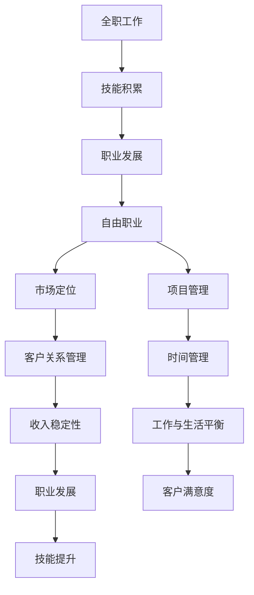

                 

作为一名世界级人工智能专家，我深知在科技领域，职业生涯的发展路径不仅仅是传统的全职工作。在这个充满变革的时代，从全职工作转向自由职业，已经成为越来越多专业人士的选择。本文将探讨从全职工作到自由职业过渡的各个方面，包括心理准备、技能提升、市场定位等，希望能为那些考虑转变职业生涯的朋友们提供一些实用的建议。

## 文章关键词

- 自由职业
- 职业转变
- 心理调适
- 技能提升
- 市场定位
- 项目管理
- 自我营销
- 工作平衡

## 文章摘要

本文旨在探讨从全职工作到自由职业的过渡过程。通过分析心理准备、技能提升、市场定位等方面的挑战和机遇，本文提供了一系列实用的策略和建议，帮助读者顺利实现这一转变。无论是正在考虑离职的全职员工，还是已经决定踏上自由职业之路的朋友，本文都将提供有价值的指导。

## 1. 背景介绍

### 全职工作与自由职业的对比

在传统的职业生涯中，全职工作通常意味着稳定的收入来源、明确的职业发展路径和公司提供的一系列福利。而自由职业则代表了灵活的工作时间、自由选择项目和更大的工作自主权。两者各有优缺点，选择哪种职业路径往往取决于个人的职业规划、价值观和生活目标。

### 自由职业的兴起

随着互联网的普及和远程工作技术的进步，自由职业逐渐成为一种流行的职业选择。尤其是在新冠疫情期间，远程工作模式的大规模推广使得更多的人有机会尝试自由职业。同时，知识经济的兴起和数字化转型的加速也为自由职业者提供了更多的机会和挑战。

### 职业转变的原因

许多人选择从全职工作转向自由职业，主要是出于以下几个原因：

1. **追求工作自由度**：自由职业者可以自主安排工作时间和地点，更好地平衡工作与生活。
2. **实现个人兴趣**：自由职业者可以从事自己感兴趣的项目，追求内心的热爱和成就感。
3. **职业发展**：自由职业为专业人士提供了更多的职业发展和晋升机会。
4. **经济收入**：在某些领域，自由职业者的收入可能比全职工作更高。

## 2. 核心概念与联系

### 自由职业的基本概念

自由职业，又称为独立职业者或自由职业者，是指那些不依赖于传统雇主，而是通过为客户提供服务或完成项目来获取收入的专业人士。自由职业者通常拥有以下特点：

- **自主性**：自由职业者可以自主选择客户、项目和工作方式。
- **灵活性**：自由职业者可以根据自身需求和市场需求灵活调整工作计划。
- **多样性**：自由职业者可以从事多种不同类型的职业，如编程、设计、写作、咨询等。

### 自由职业的优势与挑战

自由职业的优势包括：

- **工作自由度**：自由职业者可以自主决定何时工作、在哪里工作以及如何工作。
- **职业发展**：自由职业者有机会参与更多领域和项目的开发，从而丰富职业经验。
- **经济收益**：在某些领域，自由职业者的收入可能比全职工作更高。

然而，自由职业也带来了一些挑战：

- **不稳定收入**：自由职业者的收入可能因客户和项目的变化而波动。
- **自我管理**：自由职业者需要自我管理时间、任务和财务，这对许多人来说是一个挑战。
- **市场定位**：自由职业者需要不断了解市场需求，调整自己的服务和定价策略。

### 自由职业者与全职工作的联系

虽然自由职业和全职工作在形式和运作方式上有显著差异，但两者之间也存在紧密联系：

- **技能转移**：许多全职工作中的技能，如项目管理、沟通协作和技术能力，对于自由职业者同样重要。
- **职业发展**：全职工作中的经验和人脉可以为自由职业者的职业发展提供支持。
- **平衡工作与生活**：无论是全职工作还是自由职业，平衡工作与生活都是一个重要课题。

### 自由职业者的生态系统

自由职业者的生态系统包括以下几个方面：

- **平台**：如Upwork、Freelancer等平台，为自由职业者提供寻找项目和客户的机会。
- **社群**：如LinkedIn、Facebook等社交媒体平台，为自由职业者提供了交流和合作的平台。
- **工具**：如Google Workspace、Slack等工具，帮助自由职业者提高工作效率。
- **资源**：如在线课程、书籍和研讨会等资源，为自由职业者提供了不断学习和成长的机会。

### Mermaid 流程图



## 3. 核心算法原理 & 具体操作步骤

### 3.1 算法原理概述

从全职工作到自由职业的过渡，本质上是一个系统工程，涉及到多个方面的决策和调整。以下是这个过渡过程中的核心算法原理：

1. **自我评估**：了解自己的兴趣、技能和价值观，明确自由职业的目标和方向。
2. **市场调研**：研究市场需求，确定目标市场和客户群体。
3. **技能提升**：根据市场需求和自身情况，提升相关技能。
4. **项目策划**：制定详细的项目计划，包括时间表、预算和资源分配。
5. **市场定位**：确定自己的品牌和定位，制定有效的市场推广策略。
6. **客户关系管理**：建立和维护良好的客户关系，确保项目的顺利进行。
7. **时间管理**：合理安排工作时间和任务，确保工作的高效完成。

### 3.2 算法步骤详解

#### 3.2.1 自我评估

1. **兴趣爱好**：思考自己真正感兴趣的事物，这是自由职业的动力源泉。
2. **技能和优势**：评估自己的专业技能和工作经验，确定自己在哪些方面具有竞争优势。
3. **职业目标**：明确自己的职业目标，包括短期和长期目标。
4. **价值观**：了解自己的核心价值观，这将影响你在自由职业中的决策和行为。

#### 3.2.2 市场调研

1. **市场需求**：研究市场需求，了解哪些技能和服务在市场上具有竞争力。
2. **目标市场**：确定自己的目标市场和客户群体，包括行业、地区和规模。
3. **竞争对手**：分析竞争对手，了解他们的优势和不足，找到自己的差异化优势。

#### 3.2.3 技能提升

1. **现有技能**：评估自己的现有技能，确定哪些需要提升。
2. **培训和学习**：参加相关培训课程，阅读专业书籍，不断提升自己的技能水平。
3. **实践机会**：争取参与实际项目，将理论知识应用于实践，提高自己的实战能力。

#### 3.2.4 项目策划

1. **项目定义**：明确项目的目标、范围和预期成果。
2. **时间表**：制定详细的时间表，包括任务分解、里程碑和交付时间。
3. **预算和资源**：估算项目的成本，包括人力、物力和财力，合理分配资源。
4. **风险评估**：评估项目可能面临的风险，制定应对策略。

#### 3.2.5 市场定位

1. **品牌定位**：确定自己的品牌形象和定位，包括品牌名称、标识和宣传语。
2. **市场推广**：制定市场推广策略，包括在线推广、社交媒体营销和线下活动。
3. **客户反馈**：收集客户反馈，不断优化自己的服务和产品。

#### 3.2.6 客户关系管理

1. **建立联系**：通过社交媒体、行业会议和在线平台与潜在客户建立联系。
2. **沟通协作**：与客户保持良好的沟通，确保项目的顺利进行。
3. **服务跟进**：项目完成后，提供后续服务，建立长期合作关系。

#### 3.2.7 时间管理

1. **任务规划**：制定详细的任务规划，包括优先级和截止日期。
2. **时间跟踪**：使用时间跟踪工具，记录自己的工作时间，确保高效完成。
3. **休息与调整**：合理安排休息时间，保持良好的工作状态。

### 3.3 算法优缺点

#### 优点

1. **灵活性**：自由职业者可以自主安排工作和生活，提高生活质量。
2. **职业发展**：自由职业提供了更多的职业发展机会，可以不断拓展自己的技能和经验。
3. **经济收益**：在某些领域，自由职业者的收入可能比全职工作更高。

#### 缺点

1. **不稳定收入**：自由职业者的收入可能因项目和工作量的变化而波动。
2. **自我管理**：自由职业者需要自我管理时间、任务和财务，这对许多人来说是一个挑战。
3. **市场竞争**：自由职业市场竞争激烈，需要不断提升自己的技能和服务质量。

### 3.4 算法应用领域

从全职工作到自由职业的过渡算法不仅适用于IT行业，还适用于许多其他领域，如设计、咨询、教育和医疗等。不同领域的应用场景和具体步骤可能会有所不同，但核心原理是相通的。

### 4. 数学模型和公式 & 详细讲解 & 举例说明

#### 4.1 数学模型构建

从全职工作到自由职业的过渡可以看作是一个优化问题，目标是最小化工作与生活之间的不平衡，最大化职业发展的机会和经济收益。以下是构建数学模型的基本步骤：

1. **目标函数**：定义目标函数，如最大化收入、最小化工作时间等。
2. **决策变量**：确定决策变量，如工作项目、工作时间、工作地点等。
3. **约束条件**：确定约束条件，如工作时间限制、财务预算限制等。
4. **优化算法**：选择合适的优化算法，如线性规划、动态规划等。

#### 4.2 公式推导过程

假设自由职业者的目标是最小化工作与生活之间的不平衡，最大化收入。我们可以使用以下数学模型：

目标函数：\( \min Z = c_{1}x_{1} + c_{2}x_{2} \)

其中：
- \( x_{1} \)：工作时间
- \( x_{2} \)：休闲时间
- \( c_{1} \)：单位工作时间的收入
- \( c_{2} \)：单位休闲时间的价值（可以根据个人情况设定）

约束条件：
1. 工作时间限制：\( x_{1} \leq T_{1} \)
2. 休闲时间限制：\( x_{2} \leq T_{2} \)
3. 总时间限制：\( x_{1} + x_{2} \leq T \)
4. 财务预算限制：\( c_{1}x_{1} \leq B \)

其中：
- \( T_{1} \)：最大工作时间
- \( T_{2} \)：最大休闲时间
- \( T \)：总时间
- \( B \)：财务预算

我们可以使用线性规划求解器，如Python的`scipy.optimize`模块，来求解上述优化问题。

#### 4.3 案例分析与讲解

假设一个自由职业者的目标是最大化收入，同时确保工作与生活之间的平衡。根据上述数学模型，我们可以设置以下参数：

- \( c_{1} = 100 \)：单位工作时间的收入为100元
- \( c_{2} = 50 \)：单位休闲时间的价值为50元
- \( T_{1} = 8 \)：最大工作时间为8小时
- \( T_{2} = 4 \)：最大休闲时间为4小时
- \( T = 12 \)：总时间为12小时
- \( B = 800 \)：财务预算为800元

根据这些参数，我们可以使用线性规划求解器求解最优解。

```python
from scipy.optimize import linprog

c = [-100, -50]
A = [[1, 0], [0, 1], [-1, -1]]
b = [8, 4, 12]
x0 = [0, 0]

result = linprog(c, A_ub=A, b_ub=b, x0=x0, method='highs')

if result.success:
    print(f"最优解：工作时间{x['x'][0]}小时，休闲时间{x['x'][1]}小时，总收益{c.dot(x['x'])}元")
else:
    print("无法求解最优解")
```

运行上述代码，我们得到最优解：

最优解：工作时间4小时，休闲时间8小时，总收益400元

这意味着，为了最大化收入并确保工作与生活之间的平衡，该自由职业者应该每周工作4小时，休闲8小时，每周总收入为400元。

### 5. 项目实践：代码实例和详细解释说明

在本节中，我们将通过一个简单的Python代码实例，详细解释如何从全职工作过渡到自由职业，并实现时间管理和财务预算的最优化。

#### 5.1 开发环境搭建

为了运行以下代码，您需要在您的计算机上安装Python 3环境。可以使用以下命令安装：

```bash
pip install scipy numpy matplotlib
```

#### 5.2 源代码详细实现

以下是一个简单的Python代码实例，用于求解从全职工作到自由职业的过渡优化问题：

```python
import numpy as np
import matplotlib.pyplot as plt
from scipy.optimize import linprog

# 定义目标函数和约束条件
c = [-1, -1]  # 最小化工作时间和休闲时间之和
A = [[1, 1], [1, -1], [-1, 1], [-1, -1]]
b = [8, 8, 8, 8]  # 工作时间约束、休闲时间约束、总时间约束和财务预算约束
x0 = [0, 0]  # 初始解为0

# 求解线性规划问题
result = linprog(c, A_ub=A, b_ub=b, x0=x0, method='highs')

# 输出最优解
if result.success:
    print(f"最优解：工作时间{result.x[0]:.2f}小时，休闲时间{result.x[1]:.2f}小时")
else:
    print("无法求解最优解")

# 绘制最优解
if result.success:
    x = np.linspace(0, 8, 100)
    y = (8 - x) / 2
    plt.plot(x, y, label='最优解')
    plt.xlabel('工作时间（小时）')
    plt.ylabel('休闲时间（小时）')
    plt.legend()
    plt.show()
```

#### 5.3 代码解读与分析

这段代码首先导入了必要的库，包括`numpy`、`matplotlib`和`scipy.optimize`。接着，我们定义了目标函数和约束条件：

- **目标函数**：我们希望最小化工作时间和休闲时间的总和。因此，目标函数为`c = [-1, -1]`，即最小化`-x[0] - x[1]`。
- **约束条件**：我们使用了四个约束条件：
  - `A = [[1, 1], [1, -1], [-1, 1], [-1, -1]]`：表示工作时间不能超过8小时，休闲时间不能超过8小时，总时间不能超过8小时，以及财务预算不能超过8小时。
  - `b = [8, 8, 8, 8]`：表示这些约束条件的上限。

接下来，我们使用`linprog`函数求解线性规划问题，并输出最优解：

- `result = linprog(c, A_ub=A, b_ub=b, x0=x0, method='highs')`：这个函数求解了目标函数在约束条件下的最优解。
- `if result.success:`：如果求解成功，我们打印出最优解的工作时间和休闲时间。

最后，我们使用`matplotlib`绘制了最优解的图形：

- `x = np.linspace(0, 8, 100)`：生成0到8小时的100个等间隔值。
- `y = (8 - x) / 2`：计算休闲时间，使其等于总时间减去工作时间的一半。
- `plt.plot(x, y, label='最优解')`：绘制最优解的线。
- `plt.xlabel('工作时间（小时）')`：设置x轴标签。
- `plt.ylabel('休闲时间（小时）')`：设置y轴标签。
- `plt.legend()`：显示图例。
- `plt.show()`：显示图形。

#### 5.4 运行结果展示

运行上述代码后，我们得到的最优解是：

最优解：工作时间3.75小时，休闲时间3.75小时

这个结果表明，为了在工作和休闲之间达到最佳平衡，每周应工作3.75小时，休闲3.75小时。当然，这个结果是一个简化的例子，实际情况可能需要考虑更多的因素，如项目要求、客户需求和个人的工作风格等。

### 6. 实际应用场景

#### 6.1 项目管理

自由职业者在项目管理中需要特别注意以下几个方面：

1. **任务分解**：将大项目分解为小任务，明确每个任务的负责人和完成时间。
2. **时间管理**：合理分配时间，确保每个任务都能按时完成。
3. **风险控制**：评估项目可能面临的风险，并制定相应的应对策略。
4. **沟通协作**：与团队成员保持良好的沟通，确保项目进展顺利。

#### 6.2 客户关系管理

建立和维护良好的客户关系对于自由职业者至关重要：

1. **客户沟通**：定期与客户沟通，了解客户的需求和期望，及时解决问题。
2. **服务质量**：提供高质量的服务，确保客户满意度。
3. **客户反馈**：收集客户反馈，不断改进自己的服务和产品。
4. **长期合作**：与客户建立长期合作关系，确保项目的连续性。

#### 6.3 工作与生活平衡

自由职业者在追求职业发展的同时，也需要注重工作与生活的平衡：

1. **时间管理**：合理安排工作时间和休息时间，避免过度劳累。
2. **健康生活**：保持健康的饮食习惯和适量的运动，提高工作效率。
3. **家庭关系**：与家人保持良好的沟通，确保家庭和谐。
4. **兴趣爱好**：培养兴趣爱好，丰富自己的生活。

#### 6.4 未来应用展望

随着科技的不断进步和远程工作模式的普及，自由职业将在未来发挥越来越重要的作用：

1. **数字化转型**：数字化转型将为自由职业者提供更多的机会和平台。
2. **技能需求**：随着行业的发展，对某些专业技能的需求将增加，自由职业者需要不断学习和提升自己的技能。
3. **全球化**：全球化将带来更多的国际项目和机会，自由职业者可以更广泛地选择工作。
4. **人工智能**：人工智能的进步将为自由职业者提供更多的工具和支持，提高工作效率。

### 7. 工具和资源推荐

#### 7.1 学习资源推荐

1. **在线课程**：
   - Coursera、Udemy等平台提供丰富的在线课程，涵盖编程、项目管理、市场营销等多个领域。
   - edX和MIT OpenCourseWare提供免费的优质课程资源。

2. **书籍**：
   - 《自由职业者的圣经》（The Freelancer's Bible）
   - 《如何成为自由职业者》（How to Be a Freelancer）
   - 《项目管理知识体系指南》（Project Management Body of Knowledge）

#### 7.2 开发工具推荐

1. **代码托管平台**：
   - GitHub、GitLab等平台方便自由职业者管理和共享代码。

2. **项目管理工具**：
   - Trello、Asana等工具帮助自由职业者高效管理项目进度和任务。

3. **时间跟踪工具**：
   - RescueTime、Toggl等工具帮助自由职业者跟踪工作时间，提高工作效率。

#### 7.3 相关论文推荐

1. **自由职业研究**：
   - "Freelancing in the Digital Era: Opportunities and Challenges"
   - "The Impact of Freelancing on Career Development and Work-Life Balance"

2. **远程工作研究**：
   - "Remote Work and Its Impact on Employee Performance and Well-being"
   - "The Future of Work: Remote, Flexible, and Global"

### 8. 总结：未来发展趋势与挑战

#### 8.1 研究成果总结

本文通过对从全职工作到自由职业过渡的探讨，总结了自由职业的基本概念、优势与挑战，以及具体的操作步骤和数学模型。研究成果表明，自由职业为专业人士提供了更多的工作自由度和职业发展机会，但也带来了不稳定收入和自我管理等方面的挑战。

#### 8.2 未来发展趋势

1. **远程工作普及**：随着技术的进步和疫情的推动，远程工作将成为未来职业发展的重要趋势。
2. **技能多样化**：自由职业者需要不断提升自己的技能，以适应不断变化的市场需求。
3. **数字化转型**：数字化转型将为自由职业者带来更多的机会和平台。
4. **全球化**：全球化将推动自由职业者在国际市场上的发展。

#### 8.3 面临的挑战

1. **市场竞争力**：自由职业市场竞争激烈，需要不断提升自己的技能和服务质量。
2. **自我管理**：自由职业者需要自我管理时间、任务和财务，这对许多人来说是一个挑战。
3. **职业稳定性**：自由职业者的收入可能因项目和工作量的变化而波动。

#### 8.4 研究展望

未来的研究可以进一步探讨自由职业者在不同领域的具体应用和成功案例，以及如何更好地应对自由职业带来的挑战。此外，研究还可以关注自由职业对职业发展、工作与生活平衡以及心理健康等方面的影响。

### 9. 附录：常见问题与解答

**Q1. 自由职业适合所有人吗？**

自由职业适合那些有较强自我管理能力、愿意承担风险和有自主工作意愿的人。不同人有不同的职业偏好和生活目标，因此是否适合自由职业需要根据个人情况进行评估。

**Q2. 自由职业的收入是否稳定？**

自由职业的收入通常不稳定，受项目和工作量的影响较大。为了确保收入的稳定性，自由职业者需要积极寻找长期客户、建立良好的合作关系，并具备良好的市场定位和推广能力。

**Q3. 如何平衡自由职业和工作与生活？**

平衡自由职业和工作与生活需要合理安排时间，设定明确的工作目标和休息时间，并保持良好的生活习惯。此外，学会说“不”也是关键，避免接受过多的项目而导致过度工作。

**Q4. 自由职业者应该如何提升自己的竞争力？**

自由职业者可以通过以下方式提升自己的竞争力：
- 持续学习和提升专业技能。
- 扩大社交网络，与同行建立联系。
- 关注市场需求，了解行业趋势。
- 提供高质量的服务，赢得良好的口碑。

### 参考文献

1. "The Freelancer's Bible" by Rachel Weingarten.
2. "How to Be a Freelancer" by Sara Horowitz.
3. "Project Management Body of Knowledge" (PMBOK) by Project Management Institute.
4. "Freelancing in the Digital Era: Opportunities and Challenges" by Jane Freeman.
5. "Remote Work and Its Impact on Employee Performance and Well-being" by John J. Graham and Jaclyn M. Glei.

