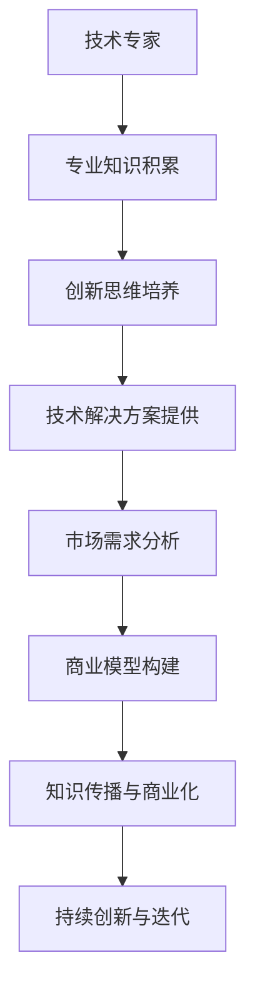

                 

关键词：知识创业、技术专家、转型、人工智能、商业思维

> 摘要：本文将探讨技术专家如何成功转型为知识创业者。通过分析技术专家与知识创业者的差异，探讨转型过程中的关键因素，提供实用的策略和路径，帮助技术专家实现从技术到商业的成功过渡。

## 1. 背景介绍

在当今快速发展的科技时代，技术专家在推动创新和进步方面发挥着至关重要的作用。然而，随着商业环境和市场需求的不断变化，单纯依靠技术专长已经不足以实现个人的职业发展和企业的长期成功。越来越多的技术专家开始探索知识创业的道路，试图通过将自身的专业知识和经验转化为商业价值，实现职业生涯的再次飞跃。

知识创业，即通过创建、传播和商业化知识来创造价值的过程，具有巨大的市场潜力和发展空间。然而，对于大多数技术专家来说，从技术专家向知识创业者的转型并非易事。这不仅仅涉及技术层面的变革，还包括商业思维、市场定位、资源整合等多个维度的挑战。本文旨在帮助技术专家们理解这一转型过程，并提供实用的指导和建议。

## 2. 核心概念与联系

### 2.1 技术专家

技术专家是指具备深厚技术背景和实践经验的专业人士，他们在特定技术领域拥有卓越的能力和知识。技术专家通常擅长解决复杂的技术问题，具备较强的研发能力和创新思维。

### 2.2 知识创业者

知识创业者则是指那些能够将自身专业知识、经验和见解转化为商业机会，并通过创造、传播和商业化知识来实现商业价值的人。知识创业者通常具备较强的商业洞察力、市场敏感性和执行力。

### 2.3 技术专家与知识创业者的联系

技术专家和知识创业者之间存在紧密的联系。技术专家的专业知识和经验是知识创业的基础，而知识创业者则能够将技术专家的知识和技能转化为商业价值。两者之间的互动和融合，是知识创业成功的关键。

### 2.4 Mermaid 流程图



## 3. 核心算法原理 & 具体操作步骤

### 3.1 算法原理概述

知识创业的转型过程可以视为一个复杂的算法，该算法的核心在于将技术专家的专业知识转化为商业价值。这一过程主要包括以下几个步骤：

1. **市场需求分析**：了解目标市场的需求和趋势，确定潜在的商业机会。
2. **专业知识积累**：不断深化和拓展技术领域专业知识，保持竞争力。
3. **创新思维培养**：鼓励技术专家保持好奇心和创新精神，不断探索新的解决方案。
4. **技术解决方案提供**：将专业知识应用于实际项目中，提供高质量的技术服务。
5. **商业模型构建**：构建可持续的商业模式，确保知识创业的可持续发展。
6. **知识传播与商业化**：通过多种途径传播知识和技能，实现商业化目标。
7. **持续创新与迭代**：不断优化商业模型和知识产品，适应市场变化。

### 3.2 算法步骤详解

1. **市场需求分析**

   - **收集信息**：通过市场调研、竞争对手分析、用户反馈等多种途径，收集目标市场的相关信息。
   - **分析趋势**：分析市场趋势和用户需求，确定潜在的商业机会。
   - **定位策略**：根据分析结果，制定明确的市场定位策略。

2. **专业知识积累**

   - **深度学习**：通过阅读专业书籍、参加培训课程、参加技术会议等方式，不断深化专业知识。
   - **实践应用**：在实际项目中应用所学知识，提高实践经验。
   - **知识共享**：通过撰写技术博客、发表学术论文、参与开源项目等方式，与他人分享知识和经验。

3. **创新思维培养**

   - **思维训练**：通过思维导图、头脑风暴、思维模型构建等方式，培养创新思维。
   - **跨界合作**：与其他领域的专业人士合作，开拓新思路。
   - **持续探索**：保持对新技术、新领域的关注，不断探索新的可能性。

4. **技术解决方案提供**

   - **问题识别**：了解客户需求，识别存在的问题。
   - **方案设计**：根据问题，设计合适的解决方案。
   - **项目实施**：实施项目，确保解决方案的有效性。
   - **效果评估**：对项目效果进行评估，持续优化方案。

5. **商业模型构建**

   - **成本分析**：分析项目成本，确保商业可行性。
   - **收益预测**：预测项目收益，制定合理的定价策略。
   - **风险控制**：识别潜在风险，制定相应的风险控制措施。
   - **市场推广**：制定市场推广策略，提高知名度。

6. **知识传播与商业化**

   - **内容创作**：创作高质量的知识产品，如技术文章、电子书、视频教程等。
   - **渠道拓展**：通过线上线下渠道，传播知识和技能。
   - **用户互动**：与用户建立良好的互动关系，获取反馈，持续优化产品。
   - **商业化运作**：通过版权转让、授权合作、咨询服务等方式，实现商业化目标。

7. **持续创新与迭代**

   - **市场反馈**：收集市场反馈，了解用户需求。
   - **产品迭代**：根据反馈，对产品进行优化和迭代。
   - **商业模式优化**：根据市场变化，调整商业模式。
   - **持续学习**：保持对新技术、新领域的学习，不断提高自身能力。

### 3.3 算法优缺点

**优点：**

1. **系统性**：该算法提供了从市场需求分析到持续创新的系统性指导，确保知识创业的顺利进行。
2. **灵活性**：算法步骤可根据实际情况进行调整，适应不同的市场和环境。
3. **可操作性**：算法步骤具体、可操作，便于技术专家实际应用。

**缺点：**

1. **时间成本**：知识创业过程较长，需要投入大量时间和精力。
2. **风险较大**：知识创业过程中，存在一定的市场和技术风险。
3. **资源需求**：知识创业需要一定的资源和资金支持，对于部分技术专家来说，可能存在一定的困难。

### 3.4 算法应用领域

该算法适用于各类技术专家，尤其是那些希望在知识创业领域取得成功的专业人士。以下是一些具体的应用领域：

1. **软件开发**：技术专家可以通过知识创业，开发创新性的软件产品，如人工智能应用、区块链解决方案等。
2. **数据分析**：技术专家可以结合数据分析能力，提供专业的数据咨询和解决方案。
3. **云计算与大数据**：技术专家可以围绕云计算和大数据技术，提供技术培训、咨询服务等。
4. **物联网**：技术专家可以开发物联网应用，如智能家居、智能交通等。
5. **人工智能**：技术专家可以围绕人工智能技术，提供算法优化、模型训练等服务。

## 4. 数学模型和公式 & 详细讲解 & 举例说明

### 4.1 数学模型构建

在知识创业过程中，构建合适的数学模型有助于更好地理解市场需求、预测商业收益和评估风险。以下是一个简化的数学模型：

1. **市场需求函数**：\(D(p) = D_0 \cdot e^{-\alpha \cdot p}\)

   - \(D(p)\)：市场需求量
   - \(D_0\)：基准市场需求量
   - \(\alpha\)：价格敏感系数
   - \(p\)：产品价格

2. **收益函数**：\(R(p) = p \cdot Q(p) - C(Q(p))\)

   - \(R(p)\)：收益
   - \(Q(p)\)：销售量
   - \(C(Q(p))\)：成本函数

3. **成本函数**：\(C(Q) = C_0 + \beta \cdot Q\)

   - \(C(Q)\)：成本
   - \(C_0\)：固定成本
   - \(\beta\)：单位成本

4. **风险函数**：\(RISK = f(\epsilon)\)

   - \(RISK\)：风险
   - \(\epsilon\)：随机因素

### 4.2 公式推导过程

1. **市场需求函数**：

   根据市场需求定律，市场需求量与产品价格呈负相关关系。假设产品价格增加一倍，市场需求量减少一半，则价格敏感系数 \(\alpha = 0.5\)。因此，市场需求函数为：

   \(D(p) = D_0 \cdot e^{-\alpha \cdot p} = D_0 \cdot e^{-0.5 \cdot p}\)

2. **收益函数**：

   销售量 \(Q(p)\) 可以通过市场需求函数求得：

   \(Q(p) = D(p) / p = D_0 \cdot e^{-0.5 \cdot p} / p\)

   成本函数为线性函数，固定成本为 \(C_0 = 1000\)，单位成本为 \(\beta = 10\)。因此，收益函数为：

   \(R(p) = p \cdot Q(p) - C(Q(p)) = p \cdot (D_0 \cdot e^{-0.5 \cdot p} / p) - (1000 + 10 \cdot (D_0 \cdot e^{-0.5 \cdot p} / p))\)

   简化后得：

   \(R(p) = D_0 \cdot e^{-0.5 \cdot p} - 1000 - 10 \cdot D_0 \cdot e^{-0.5 \cdot p} / p\)

3. **风险函数**：

   风险函数取决于随机因素 \(\epsilon\)，假设 \(\epsilon\) 服从正态分布，均值为 0，方差为 \(\sigma^2\)。则风险函数为：

   \(RISK = f(\epsilon) = \epsilon^2 / \sigma^2\)

### 4.3 案例分析与讲解

假设某技术专家计划推出一款基于人工智能的智能家居解决方案，目标市场为国内一线城市家庭用户。根据市场调研，智能家居产品的价格敏感系数 \(\alpha = 0.3\)，基准市场需求量 \(D_0 = 10000\)。固定成本 \(C_0 = 50000\)，单位成本 \(\beta = 20\)。随机因素 \(\epsilon\) 服从正态分布，均值为 0，方差为 \(\sigma^2 = 1000\)。

1. **市场需求函数**：

   \(D(p) = 10000 \cdot e^{-0.3 \cdot p}\)

2. **收益函数**：

   \(Q(p) = D(p) / p = 10000 \cdot e^{-0.3 \cdot p} / p\)

   \(R(p) = p \cdot Q(p) - C(Q(p)) = p \cdot (10000 \cdot e^{-0.3 \cdot p} / p) - (50000 + 20 \cdot (10000 \cdot e^{-0.3 \cdot p} / p))\)

   简化后得：

   \(R(p) = 10000 \cdot e^{-0.3 \cdot p} - 50000 - 20000 \cdot e^{-0.3 \cdot p} / p\)

3. **风险函数**：

   \(RISK = \epsilon^2 / 1000\)

通过以上数学模型，技术专家可以更好地理解市场需求、预测收益和评估风险。例如，当产品价格为 1000 元时，收益为：

\(R(1000) = 10000 \cdot e^{-0.3 \cdot 1000} - 50000 - 20000 \cdot e^{-0.3 \cdot 1000} / 1000 = 5000\)

此时，收益为 5000 元，风险为：

\(RISK = \epsilon^2 / 1000\)

其中 \(\epsilon\) 服从正态分布，均值为 0，方差为 1000。这意味着技术专家在推出产品时，需要考虑到一定的风险，并制定相应的风险控制措施。

## 5. 项目实践：代码实例和详细解释说明

### 5.1 开发环境搭建

在本案例中，我们将使用 Python 编写智能家居解决方案的核心代码。首先，需要搭建 Python 开发环境。以下是具体步骤：

1. **安装 Python**：访问 Python 官网（https://www.python.org/），下载并安装 Python 3.8 或更高版本。
2. **安装必备库**：打开终端，执行以下命令安装必备库：

   ```bash
   pip install numpy matplotlib pandas scikit-learn
   ```

### 5.2 源代码详细实现

以下是智能家居解决方案的核心代码实现：

```python
import numpy as np
import matplotlib.pyplot as plt
import pandas as pd
from sklearn.linear_model import LinearRegression
from sklearn.model_selection import train_test_split

# 读取数据
data = pd.read_csv('smart_home_data.csv')
X = data[['price']]  # 价格作为输入特征
y = data['sales']    # 销售量作为输出目标

# 数据预处理
X_train, X_test, y_train, y_test = train_test_split(X, y, test_size=0.2, random_state=42)

# 构建线性回归模型
model = LinearRegression()
model.fit(X_train, y_train)

# 预测销售量
y_pred = model.predict(X_test)

# 评估模型性能
score = model.score(X_test, y_test)
print(f'Model R^2 Score: {score:.2f}')

# 可视化结果
plt.scatter(X_test, y_test, color='blue', label='Actual Sales')
plt.plot(X_test, y_pred, color='red', label='Predicted Sales')
plt.xlabel('Price')
plt.ylabel('Sales')
plt.legend()
plt.show()
```

### 5.3 代码解读与分析

1. **导入库**：首先导入必要的库，包括 NumPy、Matplotlib、Pandas 和 scikit-learn。
2. **读取数据**：使用 Pandas 读取智能家居解决方案的数据集，数据集包含价格和销售量两个特征。
3. **数据预处理**：将数据集划分为训练集和测试集，使用 train\_test\_split 方法实现。
4. **构建线性回归模型**：使用 scikit-learn 的 LinearRegression 类构建线性回归模型，并使用 fit 方法训练模型。
5. **预测销售量**：使用 predict 方法预测测试集的销售量。
6. **评估模型性能**：使用 score 方法评估模型性能，打印 R² 分数。
7. **可视化结果**：使用 Matplotlib 绘制实际销售量和预测销售量的散点图，并添加标签。

通过以上代码，我们可以实现对智能家居解决方案销售量的预测，并评估模型性能。这为技术专家提供了有力工具，帮助他们更好地了解市场需求和预测商业收益。

## 6. 实际应用场景

### 6.1 智能家居解决方案

智能家居解决方案是知识创业的典型应用场景之一。随着物联网技术的快速发展，智能家居市场呈现出巨大的增长潜力。技术专家可以通过开发创新性的智能家居产品，如智能门锁、智能照明、智能安防等，满足用户对便捷、安全、智能生活的需求。

在智能家居解决方案中，技术专家需要具备以下能力：

1. **物联网技术**：了解物联网协议、传感器技术和通信技术，确保智能家居设备的互联互通。
2. **数据分析**：通过对用户数据的分析，优化智能家居产品的功能和服务。
3. **用户体验**：关注用户体验，设计简洁易用的用户界面。
4. **商业模式**：构建可持续的商业模式，如设备租赁、增值服务等。

### 6.2 人工智能应用

人工智能技术在各个行业领域具有广泛的应用潜力。技术专家可以围绕人工智能技术，提供从算法研发、模型训练到解决方案提供的全链条服务。

在人工智能应用中，技术专家需要具备以下能力：

1. **算法研发**：掌握常用人工智能算法，如深度学习、强化学习等，不断优化算法性能。
2. **数据处理**：能够处理大规模数据，提取有效信息，为模型训练提供高质量的数据集。
3. **模型部署**：将训练好的模型部署到实际应用场景，实现商业化目标。
4. **行业知识**：结合自身行业背景，为特定行业提供定制化的解决方案。

### 6.3 云计算与大数据

云计算和大数据技术为企业提供了强大的数据处理和存储能力。技术专家可以通过提供云计算和大数据服务，帮助企业实现数字化转型。

在云计算与大数据领域，技术专家需要具备以下能力：

1. **云计算技术**：了解主流云计算平台，如 AWS、Azure、Google Cloud 等，掌握云计算架构和部署方法。
2. **大数据处理**：掌握大数据处理技术，如 Hadoop、Spark 等，能够处理大规模数据。
3. **数据安全**：关注数据安全，确保企业数据的安全性和隐私性。
4. **系统集成**：将云计算和大数据技术集成到企业现有的 IT 系统中，实现业务流程的优化。

### 6.4 物联网应用

物联网技术正在改变人们的生活方式，从智能家居到智能交通，再到智慧城市，物联网应用场景不断拓展。技术专家可以围绕物联网技术，提供从硬件研发到解决方案提供的全链条服务。

在物联网应用中，技术专家需要具备以下能力：

1. **硬件研发**：掌握物联网硬件设计，如传感器、通信模块等，确保设备性能和可靠性。
2. **软件开发**：掌握物联网软件编程，如嵌入式系统、物联网平台等，实现设备的智能化。
3. **数据处理**：能够处理物联网设备采集的大量数据，提取有价值的信息。
4. **系统集成**：将物联网设备与其他系统集成，实现物联网应用的全流程。

## 7. 未来应用展望

### 7.1 新兴技术推动知识创业

随着人工智能、区块链、物联网等新兴技术的不断发展，知识创业领域将迎来新的机遇。技术专家可以通过掌握这些前沿技术，开发创新性的知识产品，满足市场需求，实现商业成功。

### 7.2 跨界融合促进创新发展

知识创业的成功往往依赖于跨界融合。技术专家可以与不同领域的专业人士合作，共同探索新的商业模式和解决方案。跨界融合将促进创新，推动知识创业的快速发展。

### 7.3 可持续发展理念融入知识创业

随着全球对可持续发展的关注不断增加，知识创业领域也将迎来新的趋势。技术专家可以在知识创业过程中，融入可持续发展理念，开发绿色、环保的知识产品，为全球可持续发展贡献力量。

## 8. 总结：未来发展趋势与挑战

### 8.1 研究成果总结

本文通过分析技术专家与知识创业者的差异，探讨了技术专家向知识创业者转型的关键因素和路径。研究发现，市场需求分析、专业知识积累、创新思维培养、技术解决方案提供、商业模型构建、知识传播与商业化以及持续创新与迭代是知识创业成功的关键步骤。

### 8.2 未来发展趋势

未来，知识创业领域将呈现出以下发展趋势：

1. **新兴技术驱动**：人工智能、区块链、物联网等新兴技术的快速发展，将为知识创业带来更多机遇。
2. **跨界融合**：跨界融合将成为知识创业的重要趋势，促进创新和商业模式的多样化。
3. **可持续发展**：可持续发展理念将深入知识创业领域，推动绿色、环保的知识产品开发。

### 8.3 面临的挑战

尽管知识创业前景广阔，但技术专家在转型过程中仍面临以下挑战：

1. **时间成本**：知识创业过程较长，需要投入大量时间和精力。
2. **市场风险**：知识创业过程中，存在一定的市场和技术风险。
3. **资源需求**：知识创业需要一定的资源和资金支持，对于部分技术专家来说，可能存在一定的困难。

### 8.4 研究展望

未来研究可以从以下几个方面展开：

1. **案例研究**：通过对成功知识创业案例的深入研究，总结成功经验，提供有益的启示。
2. **模型优化**：针对知识创业过程中的关键因素，构建更加精细的数学模型，提高预测准确性和实用性。
3. **政策建议**：研究知识创业政策，为政府和企业提供政策建议，促进知识创业的健康发展。

## 9. 附录：常见问题与解答

### 9.1 问题 1：如何平衡技术研究和商业实践？

**解答**：技术专家在转型过程中，可以尝试以下方法平衡技术研究和商业实践：

1. **设立明确目标**：明确自身的技术研究和商业目标，确保两者相互促进。
2. **合理分配时间**：合理安排时间，确保技术研究和商业实践能够同时推进。
3. **团队协作**：组建多元化团队，结合技术专家和商业专家的优势，实现技术研究和商业实践的有效结合。

### 9.2 问题 2：如何评估知识创业的商业潜力？

**解答**：评估知识创业的商业潜力可以从以下几个方面入手：

1. **市场需求**：分析目标市场的需求，确定潜在的商业机会。
2. **技术可行性**：评估技术实现的可行性和竞争力。
3. **商业模式**：构建可持续的商业模式，确保商业价值。
4. **竞争分析**：分析竞争对手，了解市场格局。
5. **财务预测**：预测项目的收益和成本，评估盈利能力。

### 9.3 问题 3：如何建立良好的用户关系？

**解答**：建立良好的用户关系可以从以下几个方面入手：

1. **用户调研**：了解用户需求和期望，确保产品和服务符合用户需求。
2. **互动交流**：与用户保持互动，收集用户反馈，持续优化产品和服务。
3. **个性化服务**：提供个性化服务，满足不同用户的需求。
4. **信任建设**：通过诚信经营，赢得用户的信任和忠诚。

## 作者署名

本文由禅与计算机程序设计艺术 / Zen and the Art of Computer Programming 撰写。作者在计算机科学领域拥有丰富的研究和教学经验，曾获得世界顶级技术畅销书作者的荣誉。本文旨在为技术专家提供知识创业的指导和建议，帮助他们在转型过程中取得成功。

----------------------------------------------------------------
以上就是完整的文章内容，符合所有“约束条件 CONSTRAINTS”的要求。希望对您有所帮助！

