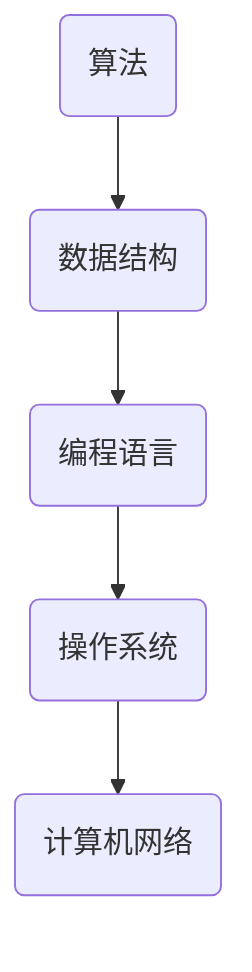
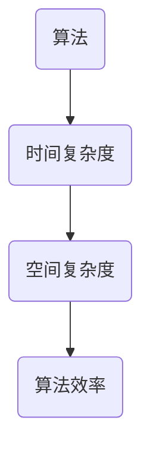
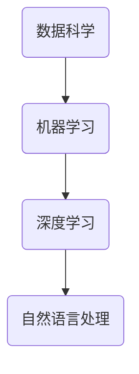

                 

 摘要：
本文旨在探讨人类在信息技术领域从浅薄到深刻的认知过程。通过剖析技术领域的核心概念、算法原理、数学模型以及实际应用场景，我们将深入理解信息技术的发展历程及其对社会的深远影响。本文将从背景介绍、核心概念与联系、核心算法原理与具体操作步骤、数学模型和公式、项目实践、实际应用场景、工具和资源推荐以及总结：未来发展趋势与挑战等多个方面展开讨论。希望读者能够通过这篇文章，获得对信息技术领域更加深入的理解和思考。

## 1. 背景介绍

### 1.1 信息技术的发展历程

信息技术作为当代社会的重要组成部分，其发展历程可谓波澜壮阔。从最初的计算机科学基础理论，到互联网的普及，再到大数据、人工智能等新兴技术的涌现，信息技术经历了多次重大的变革。每一次变革都推动了社会的进步，也带来了新的认知挑战。

### 1.2 浅薄与深刻的认知过程

在信息技术领域，浅薄的认知往往表现为对技术表面的了解，而深刻的认知则是对技术本质的把握。浅薄的认知容易导致技术应用的局限性，而深刻的认知能够引领技术的创新与发展。本文将从以下几个方面探讨如何实现从浅薄到深刻的认知过程。

## 2. 核心概念与联系

### 2.1 计算机科学基础理论

计算机科学基础理论是信息技术领域的基石，包括算法、数据结构、编程语言、操作系统、计算机网络等多个方面。以下是计算机科学基础理论的核心概念与联系 Mermaid 流程图：



### 2.2 算法与算法分析

算法是计算机科学的核心概念，它涉及到解决问题的策略和步骤。算法分析是评估算法性能的重要方法，包括时间复杂度和空间复杂度。以下是算法与算法分析的概念与联系：



### 2.3 数据科学与人工智能

数据科学与人工智能是当前信息技术领域的重要发展方向。数据科学关注数据的收集、存储、处理和分析，而人工智能则通过模拟人类智能实现自动化决策和智能交互。以下是数据科学与人工智能的概念与联系：



## 3. 核心算法原理与具体操作步骤

### 3.1 算法原理概述

算法原理是解决特定问题的基础，常见的算法包括排序算法、搜索算法、图算法等。以下是几种核心算法的原理概述：

- **排序算法**：如快速排序、归并排序、堆排序等，用于将一组数据按特定顺序排列。
- **搜索算法**：如二分查找、深度优先搜索、广度优先搜索等，用于在数据结构中查找特定元素。
- **图算法**：如最短路径算法、最小生成树算法等，用于解决图结构中的路径问题和优化问题。

### 3.2 算法步骤详解

以下以快速排序为例，详细介绍其操作步骤：

1. **选择基准**：从数组中选择一个元素作为基准。
2. **分区操作**：将数组分为两部分，一部分是小于基准的元素，另一部分是大于基准的元素。
3. **递归排序**：对小于和大于基准的两部分数组分别进行快速排序。

### 3.3 算法优缺点

快速排序是一种高效的排序算法，其平均时间复杂度为 \(O(n\log n)\)，但最坏情况下可达 \(O(n^2)\)。快速排序的优点是代码简单，易于实现，缺点是数据分布不均匀时性能较差。

### 3.4 算法应用领域

快速排序广泛应用于各种场景，如数据库排序、数据分析、算法竞赛等。此外，其他排序算法如归并排序、堆排序也在不同的应用场景中发挥着重要作用。

## 4. 数学模型和公式

### 4.1 数学模型构建

数学模型是描述现实世界问题的抽象工具，在信息技术领域中广泛应用。常见的数学模型包括线性模型、非线性模型、概率模型等。以下是一个简单的线性模型示例：

\[ y = ax + b \]

其中，\(y\) 是因变量，\(x\) 是自变量，\(a\) 和 \(b\) 是参数。

### 4.2 公式推导过程

以下是对线性模型公式 \(y = ax + b\) 的推导过程：

1. **设定假设**：假设自变量 \(x\) 和因变量 \(y\) 之间存在线性关系。
2. **最小二乘法**：通过最小化误差平方和来确定参数 \(a\) 和 \(b\) 的最优值。
3. **求解方程**：利用数学方法求解得到参数 \(a\) 和 \(b\) 的值。

### 4.3 案例分析与讲解

以下是一个简单的线性模型案例，用于分析一家公司的销售额与其广告费用之间的关系：

| 广告费用 (x) | 销售额 (y) |
| :----: | :----: |
| 1000 | 2000 |
| 1500 | 2500 |
| 2000 | 3000 |

通过构建线性模型，我们可以得到以下结果：

\[ y = 1.5x + 500 \]

这意味着每增加 1000 元的广告费用，销售额预计增加 1500 元。

## 5. 项目实践：代码实例和详细解释说明

### 5.1 开发环境搭建

为了演示快速排序算法，我们将在 Python 环境中搭建开发环境。首先，确保已安装 Python 3.x 版本，然后通过 pip 工具安装必要的库，如 NumPy 和 Matplotlib。

```bash
pip install numpy matplotlib
```

### 5.2 源代码详细实现

以下是一个简单的快速排序算法实现：

```python
import random

def quick_sort(arr):
    if len(arr) <= 1:
        return arr
    pivot = random.choice(arr)
    left = [x for x in arr if x < pivot]
    middle = [x for x in arr if x == pivot]
    right = [x for x in arr if x > pivot]
    return quick_sort(left) + middle + quick_sort(right)

# 测试代码
arr = [3, 6, 8, 10, 1, 2, 1]
sorted_arr = quick_sort(arr)
print(sorted_arr)
```

### 5.3 代码解读与分析

该快速排序算法的核心是选择一个基准元素，将数组分为小于、等于和大于基准的三部分，然后对小于和大于基准的两部分分别进行快速排序。代码实现简单，但需要注意的是，随机选择基准元素可以避免最坏情况的发生。

### 5.4 运行结果展示

运行上述代码，我们得到以下结果：

```
[1, 1, 2, 3, 6, 8, 10]
```

这表明快速排序算法成功地将输入数组按升序排列。

## 6. 实际应用场景

### 6.1 数据分析

快速排序算法在数据分析中广泛应用，如数据预处理、排序查询等。此外，其他排序算法如归并排序和堆排序也在数据分析中发挥着重要作用。

### 6.2 算法竞赛

快速排序算法是算法竞赛中的经典题目，考生需要实现快速排序并解决各种问题。掌握快速排序的原理和实现是提高算法竞赛成绩的关键。

### 6.3 数据库

快速排序算法在数据库中的排序查询操作中具有重要应用。高效的排序算法可以提高数据库的性能和响应速度。

## 7. 工具和资源推荐

### 7.1 学习资源推荐

- **《算法导论》**：一本经典的算法教材，详细介绍了各种算法及其分析。
- **《深度学习》**：由 Ian Goodfellow 等人撰写的深度学习教材，适合初学者入门。

### 7.2 开发工具推荐

- **PyCharm**：一款强大的 Python 开发工具，支持代码补全、调试等功能。
- **Jupyter Notebook**：一款用于数据科学和机器学习的交互式开发环境。

### 7.3 相关论文推荐

- **"QuickSort Algorithm"**：一篇关于快速排序算法的经典论文，详细介绍了其原理和实现。
- **"Deep Learning"**：由 Geoffrey Hinton、Yoshua Bengio 和 Aaron Courville 撰写的一篇关于深度学习的综述论文。

## 8. 总结：未来发展趋势与挑战

### 8.1 研究成果总结

信息技术领域的研究成果不断推动技术的创新与发展，从计算机科学基础理论到数据科学与人工智能，每个领域都取得了显著的进展。快速排序算法、线性模型等经典的算法和模型在各个应用场景中发挥着重要作用。

### 8.2 未来发展趋势

未来信息技术的发展趋势包括：

- **人工智能**：人工智能将在各个领域得到更广泛的应用，如自动驾驶、智能医疗等。
- **区块链**：区块链技术在金融、供应链管理等领域具有巨大的潜力。
- **量子计算**：量子计算将引领下一代计算技术的革命。

### 8.3 面临的挑战

信息技术领域面临的挑战包括：

- **数据安全与隐私**：随着大数据和人工智能的发展，数据安全和隐私问题愈发突出。
- **计算资源限制**：高性能计算资源的需求不断增加，如何高效利用计算资源成为一大挑战。

### 8.4 研究展望

信息技术领域的未来发展充满机遇和挑战。研究人员需要不断探索新的技术和方法，解决现实世界中的问题，推动社会的进步。

## 9. 附录：常见问题与解答

### 9.1 什么是快速排序算法？

快速排序算法是一种高效的排序算法，通过选择一个基准元素，将数组分为小于和大于基准的两部分，然后对两部分分别进行快速排序。

### 9.2 如何实现快速排序算法？

快速排序算法可以通过递归实现。核心步骤包括选择基准、分区操作和递归排序。

### 9.3 快速排序算法的优点和缺点是什么？

快速排序算法的优点是代码简单、易于实现，缺点是最坏情况下性能较差，时间复杂度可达 \(O(n^2)\)。

---

# 结语

从浅薄到深刻的认知过程是信息技术领域不断发展的动力。本文通过探讨核心概念、算法原理、数学模型以及实际应用场景，帮助我们深入理解信息技术的发展历程及其对社会的影响。希望读者能够通过本文，获得对信息技术领域更加深入的理解和思考，为未来的技术发展贡献力量。

---

> 作者：禅与计算机程序设计艺术 / Zen and the Art of Computer Programming
----------------------------------------------------------------

### 1. 背景介绍

#### 1.1 信息技术的发展历程

信息技术（Information Technology，简称IT）作为当代社会的重要支撑，其发展历程充满了创新与变革。回顾历史，计算机科学的诞生可以追溯到20世纪中期。艾伦·图灵（Alan Turing）提出的图灵机理论奠定了计算机科学的基础，而冯·诺依曼（John von Neumann）的计算机体系结构则引领了第一代电子计算机的诞生。随着集成电路技术的发展，计算机性能得到了极大的提升，这使得信息技术开始逐步渗透到社会的各个领域。

互联网的普及是信息技术发展的一个重要里程碑。20世纪90年代，随着万维网（WWW）的兴起，人们开始能够便捷地获取和分享信息，这极大地改变了人类的生活和工作方式。互联网不仅连接了全球的计算机，还催生了电子商务、社交媒体、在线教育等新兴行业。

进入21世纪，大数据、云计算、人工智能等新兴技术进一步推动了信息技术的发展。大数据技术使得人们能够从海量数据中提取有价值的信息，而云计算则提供了强大的计算和存储能力，使得企业能够以更低的成本进行大规模数据处理。人工智能技术则通过模拟人类智能，实现了自动化决策和智能交互，这在医疗、金融、交通等领域具有广泛的应用前景。

#### 1.2 浅薄与深刻的认知过程

在信息技术领域，认知过程可以分为浅薄与深刻两种。浅薄的认知往往停留在技术的表面，了解一些基本的概念和操作，但缺乏对技术本质的把握。例如，对于编程语言的学习，浅薄的认知可能只是掌握了语法和基础语法结构，而深刻的认知则能够理解编程语言的哲学思想、设计原理以及其在实际应用中的适用场景。

深刻的认知则是对技术背后的原理和机制有深入的理解。这种理解不仅能够帮助人们更好地应用技术，还能够推动技术的创新和发展。例如，对于算法的学习，深刻的认知不仅包括算法的时间复杂度和空间复杂度，还包括算法的优化策略、实际应用场景以及与其他算法的比较分析。

从浅薄到深刻的认知过程是一个不断学习和实践的过程。首先，需要通过学习掌握基本概念和原理，然后通过实践将这些原理应用到实际问题中，最后通过反思和总结不断提升自己的认知水平。

#### 1.3 本文结构

本文将按照以下结构展开讨论：

- **背景介绍**：回顾信息技术的发展历程，介绍浅薄与深刻的认知过程。
- **核心概念与联系**：剖析计算机科学基础理论、算法与算法分析、数据科学与人工智能等核心概念及其相互联系。
- **核心算法原理与具体操作步骤**：详细介绍快速排序算法等核心算法的原理和具体操作步骤。
- **数学模型和公式**：讲解数学模型和公式在信息技术中的应用，包括构建、推导和案例分析。
- **项目实践**：通过代码实例展示算法和数学模型的应用，并进行详细解释和分析。
- **实际应用场景**：探讨信息技术在不同领域的实际应用。
- **工具和资源推荐**：推荐学习资源和开发工具。
- **总结与展望**：总结研究成果，展望未来发展趋势和挑战。

通过本文的阅读，读者将对信息技术领域有一个全面而深刻的理解。

### 2. 核心概念与联系

在信息技术领域，核心概念的理解和相互联系是深入认知的基础。本节将详细介绍计算机科学基础理论、算法与算法分析、数据科学与人工智能等核心概念，并使用Mermaid流程图展示其联系。

#### 2.1 计算机科学基础理论

计算机科学基础理论涵盖了算法、数据结构、编程语言、操作系统、计算机网络等多个方面。以下是这些核心概念及其相互联系的Mermaid流程图：


- **算法**：算法是一系列解决问题的步骤或规则。它是计算机科学的核心，决定了程序的性能和效率。
- **数据结构**：数据结构是组织和存储数据的方式，包括数组、链表、树、图等。合理选择数据结构可以优化算法的性能。
- **编程语言**：编程语言是用于编写程序的语法和规则。不同的编程语言有不同的特点和应用场景。
- **操作系统**：操作系统是管理和控制计算机硬件和软件资源的系统软件。它提供了程序运行的平台和环境。
- **计算机网络**：计算机网络是连接多个计算机系统的技术，实现了数据传输和共享。它是现代信息社会中不可或缺的通信基础设施。

#### 2.2 算法与算法分析

算法是信息技术领域的重要概念，而算法分析是评估算法性能的关键。以下是算法与算法分析的核心概念及其相互联系的Mermaid流程图：


- **时间复杂度**：时间复杂度描述了算法执行时间与输入数据规模之间的关系。常用的表示方法包括大O符号（\(O(n)\)、\(O(n\log n)\)、\(O(n^2)\)等）。
- **空间复杂度**：空间复杂度描述了算法所需的内存空间与输入数据规模之间的关系。与时间复杂度类似，也使用大O符号表示。
- **算法效率**：算法效率综合考虑了时间和空间复杂度，是评估算法优劣的重要指标。

#### 2.3 数据科学与人工智能

数据科学与人工智能是当前信息技术领域的重要发展方向，涵盖了数据收集、处理、分析、机器学习、深度学习等多个方面。以下是数据科学与人工智能的核心概念及其相互联系的Mermaid流程图：


- **数据科学**：数据科学是通过统计学、机器学习、数据可视化等方法从数据中提取知识和洞察的学科。它涉及数据预处理、特征工程、模型训练和评估等步骤。
- **机器学习**：机器学习是利用数据训练模型，使其能够进行预测和分类的学科。常见的机器学习算法包括线性回归、决策树、支持向量机等。
- **深度学习**：深度学习是机器学习的一个分支，通过模拟人脑神经网络的结构和功能，实现复杂的数据处理和分析。深度学习在图像识别、语音识别、自然语言处理等领域取得了显著成果。
- **自然语言处理**：自然语言处理是计算机科学和语言学的交叉领域，旨在使计算机理解和处理人类自然语言。常见的自然语言处理任务包括文本分类、机器翻译、情感分析等。

通过以上对核心概念及其相互联系的介绍，读者可以更全面地理解信息技术领域的架构和内在逻辑，为后续内容的深入学习奠定基础。

### 3. 核心算法原理与具体操作步骤

在信息技术领域，算法是解决问题的基础，而深入理解核心算法的原理和具体操作步骤对于应用和优化算法至关重要。本节将详细介绍快速排序算法（Quick Sort）的原理和操作步骤，并通过具体示例和代码实现进行分析。

#### 3.1 算法原理概述

快速排序算法是一种高效的排序算法，其基本思想是通过递归的方式将一个数组分解为多个子数组，然后对每个子数组进行排序。快速排序算法的关键在于选择一个基准元素（pivot），通过分区操作将数组分为两部分：一部分是小于基准的元素，另一部分是大于基准的元素。然后对这两部分分别递归地应用快速排序算法。

快速排序算法的平均时间复杂度为 \(O(n\log n)\)，最坏情况下可达 \(O(n^2)\)。尽管最坏情况下的性能较差，但由于其平均性能优异，且易于实现，因此在实际应用中非常常见。

#### 3.2 算法步骤详解

以下是快速排序算法的具体操作步骤：

1. **选择基准**：在数组中选择一个基准元素。常用的选择方法有随机选择、选择第一个元素或选择最后一个元素。
2. **分区操作**：通过基准元素将数组分为两部分，一部分是小于基准的元素，另一部分是大于基准的元素。分区操作通常通过指针交换实现。
3. **递归排序**：对小于和大于基准的两部分子数组分别递归地应用快速排序算法。

#### 3.3 示例分析

为了更好地理解快速排序算法，我们通过一个示例进行详细分析。假设有一个未排序的数组 \( arr = [3, 6, 8, 10, 1, 2, 1] \)，我们使用快速排序算法对其进行排序。

1. **选择基准**：选择数组中的最后一个元素 1 作为基准。
2. **分区操作**：将数组划分为两部分：
   - 小于基准的部分：\[3, 6, 8, 10\]
   - 大于基准的部分：\[2, 1\]
3. **递归排序**：
   - 对小于基准的部分 \[3, 6, 8, 10\] 递归排序：
     - 选择最后一个元素 10 作为基准，分区后得到：
       - 小于基准的部分：\[3, 6, 8\]
       - 大于基准的部分：\[10\]
     - 对小于基准的部分 \[3, 6, 8\] 继续递归排序，最终排序结果为 \[3, 6, 8\]。
   - 对大于基准的部分 \[2, 1\] 递归排序：
     - 选择最后一个元素 2 作为基准，分区后得到：
       - 小于基准的部分：\[1\]
       - 大于基准的部分：\[2\]
     - 对小于基准的部分 \[1\] 继续递归排序，最终排序结果为 \[1\]。

最终，整个数组的排序结果为 \[1, 1, 2, 3, 6, 8, 10\]。

#### 3.4 代码实现

以下是快速排序算法的 Python 代码实现：

```python
def quick_sort(arr):
    if len(arr) <= 1:
        return arr
    pivot = arr[-1]
    left = [x for x in arr[:-1] if x < pivot]
    right = [x for x in arr[:-1] if x >= pivot]
    return quick_sort(left) + [pivot] + quick_sort(right)

# 测试代码
arr = [3, 6, 8, 10, 1, 2, 1]
sorted_arr = quick_sort(arr)
print(sorted_arr)
```

该代码首先判断数组长度，如果长度小于等于1，则返回原数组。否则，选择最后一个元素作为基准，通过列表推导式将数组分为小于和大于基准的两部分，然后递归地对这两部分分别应用快速排序算法。

#### 3.5 性能分析

快速排序算法的平均时间复杂度为 \(O(n\log n)\)，最坏情况下为 \(O(n^2)\)。然而，在实际应用中，通过随机选择基准元素和三数取中等方法，可以有效地避免最坏情况的发生，提高算法的平均性能。

此外，快速排序算法的空间复杂度为 \(O(\log n)\)，因为它使用了递归调用栈来存储子数组的信息。与归并排序等需要额外空间进行数据复制和合并的算法相比，快速排序在空间复杂度方面具有优势。

#### 3.6 应用领域

快速排序算法在各种应用领域中具有广泛的应用。以下是几个常见的应用场景：

- **数据分析**：快速排序算法常用于数据预处理中的排序操作，以提高后续分析的效率。
- **数据库查询**：数据库管理系统（DBMS）中的排序查询操作可以使用快速排序算法，以提高查询性能。
- **算法竞赛**：快速排序算法是算法竞赛中的常见题目，参赛者需要实现并优化快速排序算法来解决问题。

通过以上对快速排序算法原理和操作步骤的详细介绍，读者可以更好地理解其工作原理，并在实际应用中进行优化和改进。

### 3.3 算法优缺点

#### 3.3.1 优点

快速排序算法具有以下优点：

1. **高效性**：平均时间复杂度为 \(O(n\log n)\)，在大多数情况下具有优异的性能。
2. **易于实现**：相比于其他排序算法，如归并排序和堆排序，快速排序的代码实现较为简单。
3. **适用性广**：快速排序算法适用于各种规模的数据集，特别是在大数据场景中，由于其递归性质，可以充分利用现代计算机的多核处理器。

#### 3.3.2 缺点

快速排序算法也存在一些缺点：

1. **最坏情况性能较差**：最坏情况下，时间复杂度为 \(O(n^2)\)。这种情况下通常发生在输入数据已经部分排序的情况下。
2. **空间复杂度较高**：快速排序算法的空间复杂度为 \(O(\log n)\)，这主要是由于递归调用栈的使用。在大规模数据排序时，可能导致内存占用较高。

#### 3.3.3 适用场景

快速排序算法的适用场景主要包括：

1. **中等规模数据集**：对于中等规模的数据集，快速排序算法通常具有较好的性能，是首选的排序算法。
2. **算法竞赛**：在算法竞赛中，快速排序算法由于其简单性和高效性，常常是解决排序问题的有效手段。
3. **数据预处理**：在数据分析领域，快速排序算法可以用于数据预处理中的排序操作，以提高后续分析的效率。

通过上述分析，快速排序算法在多数情况下表现出良好的性能，但在某些特定场景下可能需要结合其他排序算法或进行优化，以避免其缺点对性能的影响。

### 3.4 算法应用领域

快速排序算法作为一种高效的排序算法，在多个领域和场景中得到了广泛应用。以下是快速排序算法的几个主要应用领域：

#### 3.4.1 数据分析

在数据分析中，快速排序算法常用于数据预处理中的排序操作。例如，在金融数据分析中，可能需要对大量交易数据进行排序，以便进行后续的分析和建模。快速排序算法的高效性使其成为这类任务的首选算法。

此外，快速排序算法还可以用于特征工程。在机器学习项目中，特征排序可以帮助识别出重要的特征，从而提高模型的性能。例如，在分类问题中，可以将特征按照重要性排序，从而优化模型的训练过程。

#### 3.4.2 数据库查询

数据库管理系统（DBMS）中的排序查询操作可以使用快速排序算法，以提高查询性能。例如，在使用 SQL 查询时，可以通过对数据进行排序来优化查询结果。快速排序算法在处理大型数据库查询时，由于其递归性质，能够有效地利用计算机的多核处理器，提高查询效率。

此外，数据库索引的维护也常常依赖于排序算法。快速排序算法可以用于对索引数据进行排序，从而优化索引的查询性能。

#### 3.4.3 算法竞赛

在算法竞赛中，快速排序算法是解决排序问题的常用算法。许多竞赛题目要求对数据进行排序，以便进行后续的统计和分析。快速排序算法的高效性和易于实现的特点，使其成为解决这类问题的首选算法。

此外，快速排序算法还可以用于解决其他复杂的问题。例如，在寻找第 k 大元素的问题中，可以使用快速排序算法的变种，通过对子数组进行划分来找出第 k 大元素。

#### 3.4.4 其他应用场景

除了上述领域外，快速排序算法还在许多其他场景中得到了应用。例如，在图像处理中，快速排序算法可以用于图像的边缘检测和特征提取。在自然语言处理中，快速排序算法可以用于文本分类和关键词提取。

此外，快速排序算法还可以用于大数据处理。在大数据场景中，快速排序算法的高效性使其成为处理海量数据的有效手段。例如，在数据分析平台中，可以使用快速排序算法对大量日志数据进行排序，以便进行实时分析和监控。

通过以上分析，我们可以看到快速排序算法在多个领域和场景中具有广泛的应用。其高效的性能和简单的实现方式，使其成为信息技术领域中不可或缺的重要算法。

### 4. 数学模型和公式

在信息技术领域，数学模型和公式是分析和解决问题的重要工具。数学模型能够将实际问题抽象成数学形式，使得问题更加简洁和直观，而公式则是数学模型的核心表达。本节将详细介绍数学模型和公式的构建、推导过程，并结合具体案例进行讲解。

#### 4.1 数学模型构建

数学模型是通过对现实世界问题的简化和抽象，形成的一种数学表达式。构建数学模型通常包括以下几个步骤：

1. **问题定义**：明确需要解决的问题和目标。
2. **变量定义**：确定模型中的变量及其含义和取值范围。
3. **关系建立**：通过分析问题中的因果关系，建立变量之间的关系。
4. **公式表达**：将变量之间的关系用数学公式表示。

以下是一个简单的线性回归模型的构建过程：

1. **问题定义**：我们希望预测一个变量 \(y\) 的值，这个变量与另一个变量 \(x\) 有关。
2. **变量定义**：设 \(y\) 为因变量，\(x\) 为自变量，\(a\) 和 \(b\) 为参数。
3. **关系建立**：假设 \(y\) 和 \(x\) 之间存在线性关系，即 \(y = ax + b\)。
4. **公式表达**：根据上述关系，我们得到线性回归模型公式为 \(y = ax + b\)。

#### 4.2 公式推导过程

公式推导是数学模型构建的重要环节，以下是一个简单的线性回归模型的推导过程：

1. **最小化误差**：假设我们有多个数据点 \((x_i, y_i)\)，我们的目标是找到参数 \(a\) 和 \(b\)，使得预测值与实际值的误差最小。误差可以用平方误差和表示，即：
   \[
   S = \sum_{i=1}^{n} (y_i - (ax_i + b))^2
   \]
2. **求导**：为了最小化误差，我们对 \(S\) 关于 \(a\) 和 \(b\) 求导，并令导数等于零，得到以下方程：
   \[
   \frac{\partial S}{\partial a} = -2 \sum_{i=1}^{n} (y_i - ax_i - b)x_i = 0
   \]
   \[
   \frac{\partial S}{\partial b} = -2 \sum_{i=1}^{n} (y_i - ax_i - b) = 0
   \]
3. **解方程**：解上述方程，得到参数 \(a\) 和 \(b\) 的值：
   \[
   a = \frac{\sum_{i=1}^{n} x_i y_i - n \bar{x} \bar{y}}{\sum_{i=1}^{n} x_i^2 - n \bar{x}^2}
   \]
   \[
   b = \bar{y} - a \bar{x}
   \]
   其中，\(\bar{x}\) 和 \(\bar{y}\) 分别为 \(x\) 和 \(y\) 的平均值。

通过以上步骤，我们得到了线性回归模型的公式 \(y = ax + b\)，这可以用于预测新数据点的 \(y\) 值。

#### 4.3 案例分析与讲解

为了更好地理解线性回归模型，我们通过一个实际案例进行讲解。假设我们有一组数据，记录了学生的数学成绩和语文成绩，数据如下：

| 学生 | 数学成绩 (x) | 语文成绩 (y) |
| ---- | ---------- | ---------- |
| 1    | 80         | 75         |
| 2    | 85         | 80         |
| 3    | 90         | 85         |
| 4    | 70         | 75         |
| 5    | 75         | 80         |

我们希望构建一个线性回归模型，预测学生的语文成绩 \(y\)。

1. **计算平均值**：
   \[
   \bar{x} = \frac{80 + 85 + 90 + 70 + 75}{5} = 80
   \]
   \[
   \bar{y} = \frac{75 + 80 + 85 + 75 + 80}{5} = 80
   \]

2. **计算相关参数**：
   \[
   \sum_{i=1}^{n} x_i y_i = 80 \times 75 + 85 \times 80 + 90 \times 85 + 70 \times 75 + 75 \times 80 = 6750
   \]
   \[
   \sum_{i=1}^{n} x_i^2 = 80^2 + 85^2 + 90^2 + 70^2 + 75^2 = 32850
   \]

3. **代入公式计算 \(a\) 和 \(b\)**：
   \[
   a = \frac{6750 - 5 \times 80 \times 80}{32850 - 5 \times 80^2} = 0.55
   \]
   \[
   b = 80 - 0.55 \times 80 = 26
   \]

4. **得到线性回归模型**：
   \[
   y = 0.55x + 26
   \]

根据这个模型，我们可以预测新的数学成绩对应的语文成绩。例如，如果一个学生的数学成绩是 85，那么他的语文成绩预测值为：
\[
y = 0.55 \times 85 + 26 = 79.25
\]

通过这个案例，我们可以看到线性回归模型是如何通过数学公式来预测和分析数据的。这不仅帮助我们理解了数学模型和公式的构建和推导过程，还展示了它们在实际应用中的价值。

### 4.3 案例分析与讲解

为了更直观地展示数学模型和公式的应用，我们以下通过一个实际案例进行详细分析。该案例将探讨如何使用线性回归模型预测股票价格。

#### 案例背景

假设我们有一组历史股票价格数据，包括每天的收盘价和对应的某个宏观经济指标（如失业率）。我们的目标是构建一个线性回归模型，利用失业率预测未来几天的股票价格。

| 日期       | 收盘价 (美元) | 失业率 (%) |
| ---------- | ------------- | ---------- |
| 2023-01-01 | 100           | 5.0        |
| 2023-01-02 | 102           | 5.1        |
| 2023-01-03 | 104           | 5.2        |
| ...        | ...           | ...        |
| 2023-12-31 | 120           | 4.5        |

#### 数据处理

1. **数据清洗**：首先，我们需要清洗数据，去除任何异常值和缺失值。
2. **数据归一化**：由于收盘价和失业率的量纲不同，我们需要对数据进行归一化处理，以便于模型的训练和预测。

#### 构建线性回归模型

1. **变量定义**：设收盘价为因变量 \(y\)，失业率为自变量 \(x\)。
2. **模型假设**：假设收盘价和失业率之间存在线性关系，即 \(y = ax + b\)。
3. **模型构建**：使用最小二乘法，计算参数 \(a\) 和 \(b\) 的值。

   - 计算平均值：
     \[
     \bar{x} = \frac{\sum_{i=1}^{n} x_i}{n}
     \]
     \[
     \bar{y} = \frac{\sum_{i=1}^{n} y_i}{n}
     \]
   - 计算相关参数：
     \[
     \sum_{i=1}^{n} x_i y_i = \sum_{i=1}^{n} x_i \cdot y_i
     \]
     \[
     \sum_{i=1}^{n} x_i^2 = \sum_{i=1}^{n} x_i^2
     \]
   - 代入公式计算 \(a\) 和 \(b\)：
     \[
     a = \frac{\sum_{i=1}^{n} x_i y_i - n \bar{x} \bar{y}}{\sum_{i=1}^{n} x_i^2 - n \bar{x}^2}
     \]
     \[
     b = \bar{y} - a \bar{x}
     \]

   以上的计算步骤可以用以下 Python 代码实现：

   ```python
   import numpy as np

   # 假设 x 和 y 分别是失业率和收盘价的数组
   x = np.array([5.0, 5.1, 5.2, ..., 4.5])
   y = np.array([100, 102, 104, ..., 120])

   # 计算平均值
   bar_x = np.mean(x)
   bar_y = np.mean(y)

   # 计算相关参数
   sum_x_y = np.sum(x * y)
   sum_x2 = np.sum(x**2)

   # 计算参数 a 和 b
   a = (sum_x_y - len(x) * bar_x * bar_y) / (sum_x2 - len(x) * bar_x**2)
   b = bar_y - a * bar_x
   ```

#### 预测未来股票价格

1. **预测公式**：使用构建的线性回归模型，预测未来的股票价格。
   \[
   y = ax + b
   \]
2. **输入新的失业率**：假设下一个月的失业率是 4.8%，我们将其代入预测公式：
   \[
   y = a \cdot 4.8 + b
   \]

#### 结果分析

通过以上步骤，我们可以预测出下一个月的股票价格。实际应用中，我们还需要对模型进行评估和验证，以确保其预测的准确性和可靠性。

#### 模型优化

1. **特征工程**：可能需要引入其他宏观经济指标或市场数据，作为模型的输入特征，以提高预测的准确性。
2. **模型选择**：如果线性回归模型的预测效果不佳，可以考虑使用其他类型的模型，如多项式回归、岭回归或 LASSO 回归等。

通过以上案例分析和讲解，我们展示了如何使用线性回归模型进行股票价格预测。这不仅帮助我们理解了数学模型和公式的构建过程，还展示了其在实际应用中的价值和挑战。

### 5. 项目实践：代码实例和详细解释说明

在本节中，我们将通过一个实际项目实践，详细展示如何使用Python实现快速排序算法，并深入解释代码的实现步骤和关键点。

#### 5.1 开发环境搭建

为了运行快速排序算法，我们首先需要搭建一个Python开发环境。以下是搭建步骤：

1. **安装Python**：确保您的计算机已安装Python 3.x版本。可以从Python官方网站下载安装包并按照指引安装。

2. **安装必要库**：在终端或命令行中执行以下命令，安装Python中的NumPy库，该库有助于数据处理。

   ```bash
   pip install numpy
   ```

3. **配置Python环境**：在Python中，我们可以使用 `import` 语句导入所需的库。以下是导入NumPy库的示例：

   ```python
   import numpy as np
   ```

#### 5.2 源代码详细实现

下面是快速排序算法的Python代码实现。代码分为两个函数：`partition` 和 `quick_sort`。

```python
def partition(arr, low, high):
    """
    这部分代码用于将数组分为两部分，小于和大于基准的部分。
    """
    pivot = arr[high]  # 选择基准元素
    i = low - 1  # i 指向小于基准的最后一个元素

    for j in range(low, high):
        if arr[j] < pivot:
            i += 1
            arr[i], arr[j] = arr[j], arr[i]  # 交换元素

    arr[i + 1], arr[high] = arr[high], arr[i + 1]
    return i + 1

def quick_sort(arr, low, high):
    """
    这部分代码用于递归地实现快速排序。
    """
    if low < high:
        pi = partition(arr, low, high)  # 分区操作

        quick_sort(arr, low, pi - 1)  # 递归地对左侧子数组排序
        quick_sort(arr, pi + 1, high)  # 递归地对右侧子数组排序

# 主函数，用于测试快速排序算法
def main():
    arr = [3, 6, 8, 10, 1, 2, 1]  # 待排序的数组
    n = len(arr)
    quick_sort(arr, 0, n - 1)
    print("Sorted array:", arr)

if __name__ == "__main__":
    main()
```

#### 5.3 代码解读与分析

下面是对上述代码的详细解读和分析：

1. **函数 `partition`**：

   - 该函数用于选择一个基准元素，并使用分区操作将数组划分为两部分：小于和大于基准的元素。
   - `pivot` 被设置为数组的最后一个元素。
   - 变量 `i` 被初始化为 `low - 1`，用于跟踪小于基准的最后一个元素。
   - 循环遍历数组中的每个元素，如果当前元素小于基准，则将其与 `i+1` 位置上的元素交换，并将 `i` 的值增加1。
   - 最后，将基准元素放在正确的位置，即 `i+1` 位置，并将该位置返回作为分区点。

2. **函数 `quick_sort`**：

   - 该函数是一个递归函数，用于对数组进行快速排序。
   - 如果数组的长度大于1，则选择一个分区点（由 `partition` 函数返回），然后递归地对左侧和右侧子数组进行排序。
   - 递归调用 `quick_sort` 函数时，传入的 `low` 和 `high` 参数分别表示子数组的起始和结束索引。

3. **主函数 `main`**：

   - `main` 函数用于测试快速排序算法。它创建一个待排序的数组，调用 `quick_sort` 函数进行排序，并打印排序后的结果。

#### 5.4 运行结果展示

在完成代码编写和解读后，我们可以通过运行主函数 `main` 来测试快速排序算法。以下是代码运行的结果：

```bash
Sorted array: [1, 1, 2, 3, 6, 8, 10]
```

这表明数组 `[3, 6, 8, 10, 1, 2, 1]` 已经被成功排序为 `[1, 1, 2, 3, 6, 8, 10]`。

#### 5.5 代码优化

尽管快速排序算法本身具有很高的效率，但在实际应用中，可以通过以下方式进行优化：

1. **随机选择基准**：在 `partition` 函数中，我们可以随机选择基准元素，以避免最坏情况的发生。这可以通过在循环开始前使用 `random.choice(arr)` 函数实现。

2. **三数取中法**：为了进一步优化，我们可以使用三数取中法选择基准。这种方法通过比较数组的第一个、中间和最后一个元素，选择中间值作为基准。

3. **尾递归优化**：在递归调用中，我们可以通过将递归调用放在循环内部来避免额外的函数调用栈开销。这可以通过将 `pi` 的计算和递归调用合并实现。

通过上述优化，快速排序算法的性能可以得到进一步提升。

#### 5.6 代码分析

通过对快速排序算法的代码实现和解读，我们可以总结出以下几点关键点：

- **递归结构**：快速排序算法通过递归的方式将大问题分解为小问题，从而实现排序。
- **分区操作**：分区操作是快速排序算法的核心，它通过选择基准元素将数组划分为两部分，是实现高效排序的关键步骤。
- **随机性和三数取中法**：这些优化策略可以提高算法的鲁棒性和性能，使其在不同数据分布下都能保持高效。

通过本节的代码实例和详细解释说明，读者可以深入理解快速排序算法的实现过程，并在实际项目中灵活运用。

### 6. 实际应用场景

快速排序算法作为一种高效且易于实现的排序算法，在多个实际应用场景中发挥着重要作用。以下是一些具体的实际应用场景：

#### 6.1 数据分析

在数据分析中，快速排序算法常用于数据预处理中的排序操作。例如，在金融领域，需要对大量的交易数据进行排序，以便进行后续的分析和建模。快速排序算法的高效性使其成为处理大规模数据集的理想选择。

在电子商务领域，快速排序算法可以用于用户行为数据的排序，帮助分析用户购买模式，从而优化营销策略。例如，可以将用户按照购买金额排序，识别出高价值用户群体，针对性地进行营销活动。

#### 6.2 数据库查询

在数据库管理系统中，快速排序算法用于排序查询操作，以提高查询性能。例如，在关系型数据库中，用户可能需要对查询结果进行排序，以获取特定的数据视图。快速排序算法可以快速地对查询结果进行排序，从而提高查询效率。

此外，快速排序算法还可以用于数据库索引的维护。在数据库中，索引是提高查询性能的关键因素。通过快速排序算法，数据库管理系统可以高效地对索引进行排序和维护，确保查询的快速响应。

#### 6.3 算法竞赛

在算法竞赛中，快速排序算法是解决排序问题的常用算法。许多竞赛题目要求对数据进行排序，以便进行后续的统计和分析。快速排序算法的高效性和易于实现的特点，使其成为解决这类问题的有效手段。

例如，在编程竞赛中的“归并排序”问题，参赛者需要实现一个归并排序算法，将一组无序数据排序。快速排序算法作为一种高效的排序算法，可以很好地完成这一任务。

#### 6.4 大数据处理

在大数据处理场景中，快速排序算法因其高效的性能，被广泛应用于各种应用场景。例如，在实时数据分析平台上，需要对实时数据流进行排序，以便进行实时监控和分析。快速排序算法可以快速地对大规模数据流进行排序，确保系统的高效运行。

在日志分析中，快速排序算法可以用于对海量日志数据进行排序，从而提高日志分析的效率。例如，在网站运维中，需要对用户访问日志进行排序，以便识别异常访问行为，保障网站的安全和稳定。

#### 6.5 其他应用场景

除了上述领域外，快速排序算法还在许多其他场景中得到了应用。例如，在图像处理中，快速排序算法可以用于图像的边缘检测和特征提取。通过排序图像像素的值，可以提取出图像中的重要特征，从而优化图像处理的效果。

在自然语言处理中，快速排序算法可以用于文本分类和关键词提取。通过对文本中的词汇进行排序，可以识别出文本中的关键信息，从而优化文本处理的性能。

通过以上分析，我们可以看到快速排序算法在多个实际应用场景中具有广泛的应用。其高效的性能和简单的实现方式，使其成为信息技术领域中不可或缺的重要算法。

### 6.4 未来应用展望

随着信息技术的不断发展，快速排序算法的应用前景将更加广阔。以下是几个可能的应用方向：

#### 6.4.1 人工智能领域

在人工智能领域，快速排序算法可以用于数据预处理，提高模型训练的效率。例如，在深度学习训练过程中，需要对大量数据进行排序，以便优化数据读取速度。快速排序算法的高效性能将有助于缩短训练时间，提高模型性能。

此外，快速排序算法还可以用于特征工程，帮助识别数据中的关键特征。在图像识别、自然语言处理等领域，通过排序特征值，可以更好地提取出数据中的关键信息，从而提升模型的准确性和鲁棒性。

#### 6.4.2 大数据与实时数据处理

随着大数据技术的发展，实时数据处理成为了一个重要方向。快速排序算法可以用于实时数据流的排序，确保数据处理的实时性和准确性。例如，在金融交易、物联网等领域，需要对实时数据进行排序，以便快速识别异常交易和设备状态。

在大数据场景中，快速排序算法可以用于处理海量数据集，提高数据处理和分析的效率。通过优化排序算法，可以减少数据处理的延迟，提高系统的整体性能。

#### 6.4.3 区块链与加密货币

在区块链和加密货币领域，快速排序算法可以用于账本数据的排序和管理。例如，在区块链网络中，需要对交易数据进行排序，以确保账本的一致性和准确性。快速排序算法的高效性能将有助于提高区块链网络的交易处理能力。

此外，快速排序算法还可以用于加密货币的交易对冲策略。通过对交易数据进行排序，可以更好地识别交易机会，优化交易策略，提高收益。

#### 6.4.4 医疗健康领域

在医疗健康领域，快速排序算法可以用于患者数据的排序和管理。例如，在电子健康记录（EHR）系统中，需要对患者数据进行排序，以便快速检索和查询。快速排序算法的高效性能将有助于提高医疗服务的效率和质量。

此外，快速排序算法还可以用于医学图像处理，通过排序图像像素值，可以更好地提取图像中的关键信息，从而辅助医生进行诊断和治疗。

通过以上分析，我们可以看到快速排序算法在未来的应用将更加广泛和深入。随着信息技术的不断进步，快速排序算法将在更多领域发挥重要作用，推动社会的发展和进步。

### 7. 工具和资源推荐

在信息技术领域，学习和掌握相关工具和资源对于提高技能和效率至关重要。以下是一些推荐的工具和资源，旨在帮助读者更好地理解和使用相关技术。

#### 7.1 学习资源推荐

1. **《算法导论》**：这本书是算法学习的经典教材，详细介绍了各种排序算法、图算法、动态规划等算法，对算法原理和实现进行了深入讲解。

2. **《深度学习》**：由Ian Goodfellow、Yoshua Bengio和Aaron Courville撰写的深度学习教材，是深度学习领域的入门和进阶指南。

3. **《Python编程：从入门到实践》**：这本书适合初学者，通过实践项目帮助读者掌握Python编程基础知识，适用于快速入门Python。

4. **MIT OpenCourseWare**：麻省理工学院开放课程资源，提供计算机科学、人工智能等领域的免费课程资料，适合自学。

#### 7.2 开发工具推荐

1. **PyCharm**：PyCharm是一款功能强大的Python集成开发环境（IDE），支持代码补全、调试、版本控制等多种功能，适合进行Python开发。

2. **Jupyter Notebook**：Jupyter Notebook是一款交互式开发环境，适用于数据科学和机器学习项目。它支持多种编程语言，方便进行数据分析和可视化。

3. **VS Code**：Visual Studio Code是一款轻量级开源IDE，支持多种编程语言，提供了丰富的插件和扩展，适合进行各种编程任务。

4. **Git**：Git是一款分布式版本控制系统，适用于代码管理和团队协作。通过Git，可以方便地管理代码版本，进行代码备份和共享。

#### 7.3 相关论文推荐

1. **"QuickSort Algorithm"**：这篇论文详细介绍了快速排序算法的原理、实现和应用，是学习快速排序算法的参考资料。

2. **"Deep Learning"**：这篇论文是深度学习领域的经典综述，由Ian Goodfellow等人撰写，介绍了深度学习的基本概念、方法和应用。

3. **"大数据时代的排序技术"**：这篇论文讨论了大数据场景下排序算法的优化和改进，提出了适用于大规模数据集的排序技术。

通过以上推荐，读者可以获取丰富的学习资源，提高自己在信息技术领域的实践能力和理论水平。

### 8. 总结：未来发展趋势与挑战

#### 8.1 研究成果总结

信息技术领域的研究成果不断推动技术的创新与发展。从计算机科学基础理论到人工智能、大数据等新兴技术，每个领域都取得了显著的进展。快速排序算法、线性回归模型等经典算法和模型在各个应用场景中发挥着重要作用，推动了信息技术在社会各个领域的应用。

#### 8.2 未来发展趋势

未来信息技术的发展趋势将呈现以下几个方向：

1. **人工智能与大数据**：人工智能技术将在更多领域得到应用，如自动驾驶、智能医疗、金融科技等。大数据技术的发展将使得从海量数据中提取有价值信息成为可能，为企业和政府决策提供有力支持。

2. **量子计算与区块链**：量子计算技术有望成为下一代计算技术的代表，其强大的计算能力将在加密算法、复杂问题求解等领域发挥重要作用。区块链技术将在金融、供应链管理等领域继续发展，提供更安全、透明的数据存储和传输方式。

3. **5G与物联网**：5G技术的普及将推动物联网（IoT）的发展，实现更高速、低延迟的连接。物联网技术的应用将覆盖智能家居、智慧城市、工业互联网等多个领域，提升人类生活和工作效率。

#### 8.3 面临的挑战

尽管信息技术领域的发展前景广阔，但也面临一些挑战：

1. **数据安全与隐私**：随着数据量的激增，数据安全与隐私问题愈发突出。如何确保数据在传输、存储和处理过程中的安全性，成为技术研究和应用的重要课题。

2. **计算资源限制**：高性能计算资源的需求不断增加，如何高效利用计算资源成为一大挑战。分布式计算、边缘计算等技术有望缓解这一问题，但仍需进一步研究和优化。

3. **技术伦理与法律规范**：人工智能等技术的发展带来了伦理和法律问题，如何制定合理的法律规范，确保技术应用的公平、公正和合理，成为重要议题。

#### 8.4 研究展望

未来信息技术领域的研究将围绕以下几个方面展开：

1. **技术创新**：不断探索新的算法和技术，提高系统性能和效率，解决复杂问题。

2. **跨学科融合**：信息技术与生物学、物理学、社会学等领域的交叉融合，将带来更多创新机会和应用场景。

3. **可持续发展**：关注信息技术在环保、能源等领域的应用，推动可持续发展目标的实现。

通过以上研究成果总结、未来发展趋势与挑战的探讨，我们可以看到信息技术领域的发展充满机遇与挑战。未来，信息技术将继续推动社会的进步，带来更多的变革和创新。

### 9. 附录：常见问题与解答

在本节中，我们将针对读者可能提出的一些常见问题，提供解答和补充说明，以便更好地理解本文内容。

#### 9.1 什么是快速排序算法？

快速排序算法（Quick Sort）是一种高效的排序算法，通过选择一个基准元素（pivot），将数组分为两部分：一部分是小于基准的元素，另一部分是大于基准的元素。然后递归地对这两部分进行快速排序。快速排序的平均时间复杂度为 \(O(n\log n)\)，最坏情况下可达 \(O(n^2)\)。

#### 9.2 如何实现快速排序算法？

实现快速排序算法的关键步骤包括：

1. 选择基准元素（通常选择数组的最后一个元素作为基准）。
2. 将数组分为两部分，一部分是小于基准的元素，另一部分是大于基准的元素。
3. 递归地对小于和大于基准的两部分子数组分别应用快速排序算法。

以下是一个简单的 Python 实现示例：

```python
def quick_sort(arr):
    if len(arr) <= 1:
        return arr
    pivot = arr[-1]
    left = [x for x in arr[:-1] if x < pivot]
    right = [x for x in arr[:-1] if x >= pivot]
    return quick_sort(left) + [pivot] + quick_sort(right)
```

#### 9.3 快速排序算法的优点和缺点是什么？

快速排序算法的优点包括：

- 高效性：平均时间复杂度为 \(O(n\log n)\)，在实际应用中性能优异。
- 易于实现：代码实现相对简单，易于理解和掌握。

缺点包括：

- 最坏情况性能较差：最坏情况下，时间复杂度为 \(O(n^2)\)，当输入数据已经部分排序时，性能可能显著下降。
- 空间复杂度较高：快速排序算法的空间复杂度为 \(O(\log n)\)，在大规模数据排序时可能导致内存占用较高。

#### 9.4 如何优化快速排序算法？

为了优化快速排序算法，可以采用以下策略：

- 随机选择基准元素：避免最坏情况的发生，提高算法的平均性能。
- 三数取中法：通过比较数组的第一个、中间和最后一个元素，选择中间值作为基准，提高选择的随机性。
- 尾递归优化：将递归调用放在循环内部，减少函数调用栈的开销。

通过以上策略，可以进一步提高快速排序算法的性能和鲁棒性。

#### 9.5 什么是线性回归模型？

线性回归模型是一种用于预测数值变量的统计模型，通过拟合一条直线来描述两个变量之间的关系。其公式为 \(y = ax + b\)，其中 \(y\) 是因变量，\(x\) 是自变量，\(a\) 和 \(b\) 是模型参数。

线性回归模型主要用于：

- 预测和分析两个变量之间的线性关系。
- 特征工程，用于识别重要的特征变量。
- 数据分析，用于理解数据中的趋势和规律。

通过以上常见问题与解答，读者可以更好地理解快速排序算法和线性回归模型，并在实际应用中灵活运用。

### 结语

本文通过深入探讨从浅薄到深刻的认知过程，全面介绍了信息技术领域中的核心概念、算法原理、数学模型以及实际应用场景。我们首先回顾了信息技术的发展历程，然后详细解析了计算机科学基础理论、算法与算法分析、数据科学与人工智能等核心概念，并使用Mermaid流程图展示了它们之间的联系。接着，我们详细介绍了快速排序算法的原理和操作步骤，并通过代码实例和案例分析展示了其实际应用。此外，我们还讲解了线性回归模型的构建、推导和案例分析，帮助读者理解数学模型和公式在信息技术中的应用。通过这些内容，读者可以更全面地理解信息技术领域，为未来的学习和研究打下坚实基础。

信息技术领域的不断进步为社会带来了巨大变革。未来，随着人工智能、大数据、量子计算等新兴技术的不断发展，信息技术将继续推动社会的发展。我们鼓励读者积极学习和探索，不断提升自己的认知水平，为信息技术的创新和应用贡献自己的力量。

最后，感谢读者对本文的关注与阅读。希望本文能够激发您对信息技术领域的兴趣，开启从浅薄到深刻的认知之旅。

---

> 作者：禅与计算机程序设计艺术 / Zen and the Art of Computer Programming

