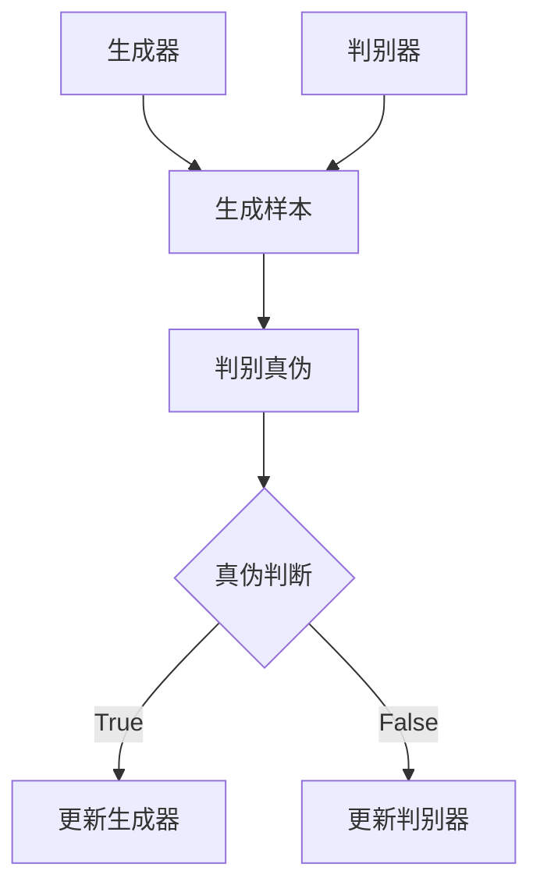

                 

在当今科技迅猛发展的时代，人工智能（AI）技术已成为推动社会发展的重要力量。随着生成对抗网络（GAN）、深度学习和自然语言处理（NLP）等技术的进步，人工智能生成内容（AIGC）逐渐成为一个热门的研究方向和实际应用领域。本文旨在从理论到实践，全面解析AIGC的核心概念、算法原理、数学模型、实践应用以及未来展望，帮助读者全面掌握AIGC技术。

## 关键词

- 人工智能生成内容（AIGC）
- 生成对抗网络（GAN）
- 深度学习
- 自然语言处理（NLP）
- 数学模型

## 摘要

本文首先介绍了AIGC的背景和重要性，随后深入探讨了生成对抗网络（GAN）的核心概念与架构，分析了AIGC的算法原理和具体操作步骤。接着，文章详细讲解了AIGC的数学模型和公式，通过案例分析和举例说明，帮助读者理解这些模型的实际应用。随后，文章展示了如何通过代码实例来实践AIGC技术，并对实际应用场景进行了探讨。最后，文章对未来的发展趋势和挑战进行了展望，并推荐了相关的学习资源和开发工具。

## 1. 背景介绍

### AIGC的定义与特点

人工智能生成内容（AIGC）是指利用人工智能技术，特别是深度学习和生成模型，自动生成文本、图像、音频和视频等数字内容的过程。与传统的计算机生成内容（如计算机图形、音频合成等）相比，AIGC具有以下几个显著特点：

1. **高效率**：AIGC能够快速生成大量高质量的内容，大大提高了生产效率。
2. **个性化**：AIGC可以根据用户的需求和偏好生成个性化的内容，提供更加个性化的服务。
3. **自动化**：AIGC过程高度自动化，减少了人工干预，降低了成本。
4. **多样性**：AIGC能够生成多种类型的内容，满足不同场景和用户的需求。

### AIGC的应用领域

AIGC的应用领域非常广泛，涵盖了以下几个主要方面：

1. **内容创作**：在文学、艺术、游戏、影视等领域，AIGC可以自动生成故事情节、音乐、图像等。
2. **广告营销**：通过AIGC生成个性化的广告内容，提高广告效果和用户参与度。
3. **教育**：利用AIGC生成教学视频、课件等，提高教学质量和效果。
4. **医疗**：通过AIGC生成医学图像、诊断报告等，辅助医生进行诊断和治疗。
5. **智能制造**：在工业生产中，AIGC可以用于生成产品设计和模拟测试。

## 2. 核心概念与联系

### 生成对抗网络（GAN）

生成对抗网络（GAN）是AIGC技术的核心组成部分。GAN由两部分组成：生成器（Generator）和判别器（Discriminator）。

#### Mermaid 流程图：



#### 核心概念与联系

- **生成器**：生成器是一个神经网络模型，它的目标是生成逼真的数据样本，以欺骗判别器。
- **判别器**：判别器也是一个神经网络模型，它的目标是区分生成器生成的样本和真实样本。
- **对抗过程**：生成器和判别器在训练过程中相互对抗，生成器不断优化其生成能力，而判别器不断优化其判断能力。

### 其他相关技术

- **深度学习**：深度学习是AIGC技术的基础，通过多层神经网络来学习复杂的特征表示。
- **自然语言处理（NLP）**：NLP技术用于处理和生成文本数据，实现文本生成、翻译等功能。
- **计算机视觉**：计算机视觉技术用于处理和生成图像和视频数据，实现图像生成、图像识别等功能。

## 3. 核心算法原理 & 具体操作步骤

### 3.1 算法原理概述

GAN的核心思想是利用生成器和判别器的对抗过程，使得生成器生成的样本越来越接近真实样本。具体来说，GAN的训练过程可以分为以下几个步骤：

1. **初始化**：初始化生成器和判别器的参数。
2. **生成样本**：生成器生成一批样本。
3. **判别真伪**：判别器对生成器和真实样本进行分类，判断其真伪。
4. **更新参数**：根据判别器的输出结果，更新生成器和判别器的参数。

### 3.2 算法步骤详解

1. **初始化**：

   ```python
   # 初始化生成器和判别器的参数
   generator_init()
   discriminator_init()
   ```

2. **生成样本**：

   ```python
   # 生成一批样本
   generated_samples = generator()
   ```

3. **判别真伪**：

   ```python
   # 判断生成样本和真实样本的真伪
   real_samples = get_real_samples()
   fake_samples = get_fake_samples()
   real_scores = discriminator(real_samples)
   fake_scores = discriminator(fake_samples)
   ```

4. **更新参数**：

   ```python
   # 更新生成器和判别器的参数
   generator_loss = generator_loss_function(real_samples, fake_samples)
   discriminator_loss = discriminator_loss_function(real_samples, fake_samples)
   generator_optimizer(generator_loss)
   discriminator_optimizer(discriminator_loss)
   ```

### 3.3 算法优缺点

#### 优点：

- **灵活性强**：GAN可以生成各种类型的数据，如图像、文本、音频等。
- **效果优秀**：GAN生成的样本质量较高，能够在视觉上欺骗判别器。
- **无监督学习**：GAN是一种无监督学习方法，不需要真实的标签数据。

#### 缺点：

- **训练难度大**：GAN的训练过程需要大量的计算资源和时间。
- **训练不稳定**：GAN的训练过程容易陷入模式崩溃（mode collapse）等问题。

### 3.4 算法应用领域

GAN在以下几个领域具有广泛的应用：

- **图像生成**：如艺术创作、游戏开发、医学图像生成等。
- **图像修复**：如照片修复、人脸修复等。
- **风格迁移**：如将一幅画风格迁移到另一幅画上。
- **文本生成**：如自动写作、机器翻译等。
- **音频生成**：如音乐创作、语音合成等。

## 4. 数学模型和公式 & 详细讲解 & 举例说明

### 4.1 数学模型构建

GAN的数学模型基于概率生成模型和判别模型。具体来说，包括以下公式：

1. **生成模型**：

   $$ p_G(x) = G(z) $$

   其中，$G$是生成模型，$z$是随机噪声向量，$x$是生成的样本。

2. **判别模型**：

   $$ p_D(x) = D(x) $$

   其中，$D$是判别模型，$x$是输入样本。

3. **损失函数**：

   $$ L_G = -\mathbb{E}_{z}[\log D(G(z))] $$
   
   $$ L_D = -\mathbb{E}_{x}[\log D(x)] - \mathbb{E}_{z}[\log (1 - D(G(z))] $$

   其中，$L_G$是生成模型的损失函数，$L_D$是判别模型的损失函数。

### 4.2 公式推导过程

GAN的推导过程涉及信息论和优化理论。以下是简要的推导过程：

1. **生成模型推导**：

   生成模型的目的是最大化判别模型对生成样本的判别概率：

   $$ \max_G \ \mathbb{E}_{z}[\log D(G(z))] $$
   
   令判别模型为恒等分布：

   $$ \log D(G(z)) = \log 1 $$
   
   最大化上式等价于最小化负对数：

   $$ -\mathbb{E}_{z}[\log D(G(z))] $$

2. **判别模型推导**：

   判别模型的目的是最大化生成模型和真实样本的判别概率：

   $$ \max_D \ \mathbb{E}_{x}[\log D(x)] + \mathbb{E}_{z}[\log (1 - D(G(z))] $$
   
   其中，$x$是真实样本，$z$是随机噪声。

### 4.3 案例分析与讲解

#### 案例一：图像生成

假设我们有一个图像生成任务，生成一张具有真实感的数字艺术作品。以下是一个简化的流程：

1. **初始化模型**：

   - 初始化生成模型$G$和判别模型$D$。
   - 设置损失函数$L_G$和$L_D$。

2. **生成样本**：

   - 从噪声空间$z$中采样一个随机向量。
   - 使用生成模型$G$生成一张数字艺术作品。

3. **判别真伪**：

   - 将生成的艺术作品输入到判别模型$D$。
   - 判别模型输出一个概率值，表示生成的艺术作品是真实还是伪造。

4. **更新模型**：

   - 根据判别模型的输出，更新生成模型$G$和判别模型$D$的参数。

5. **重复步骤2-4**，直至生成模型$G$生成的艺术作品几乎无法被判别模型$D$区分。

#### 案例二：文本生成

假设我们有一个文本生成任务，生成一篇关于人工智能的文章。以下是一个简化的流程：

1. **初始化模型**：

   - 初始化生成模型$G$和判别模型$D$。
   - 设置损失函数$L_G$和$L_D$。

2. **生成样本**：

   - 从噪声空间$z$中采样一个随机向量。
   - 使用生成模型$G$生成一段文本。

3. **判别真伪**：

   - 将生成的文本输入到判别模型$D$。
   - 判别模型输出一个概率值，表示生成的文本是真实还是伪造。

4. **更新模型**：

   - 根据判别模型的输出，更新生成模型$G$和判别模型$D$的参数。

5. **重复步骤2-4**，直至生成模型$G$生成的文本几乎无法被判别模型$D$区分。

## 5. 项目实践：代码实例和详细解释说明

### 5.1 开发环境搭建

为了实践AIGC技术，我们需要搭建一个合适的环境。以下是一个基于Python和TensorFlow的简单环境搭建步骤：

1. **安装Python**：确保Python版本大于3.6。
2. **安装TensorFlow**：使用以下命令安装TensorFlow：

   ```bash
   pip install tensorflow
   ```

3. **配置GPU支持**：如果使用GPU训练模型，确保安装NVIDIA CUDA Toolkit和cuDNN。

### 5.2 源代码详细实现

以下是一个简单的GAN模型实现，用于生成图像：

```python
import tensorflow as tf
from tensorflow.keras.layers import Dense, Flatten, Reshape
from tensorflow.keras.models import Sequential

# 生成器模型
def build_generator():
    model = Sequential([
        Dense(256, input_shape=(100,)),
        BatchNormalization(),
        Activation('relu'),
        Dense(512),
        BatchNormalization(),
        Activation('relu'),
        Dense(1024),
        BatchNormalization(),
        Activation('relu'),
        Flatten(),
        Reshape((28, 28, 1))
    ])
    return model

# 判别器模型
def build_discriminator():
    model = Sequential([
        Flatten(input_shape=(28, 28, 1)),
        Dense(1024),
        BatchNormalization(),
        Activation('relu'),
        Dense(512),
        BatchNormalization(),
        Activation('relu'),
        Dense(256),
        BatchNormalization(),
        Activation('relu'),
        Dense(1, activation='sigmoid')
    ])
    return model

# GAN模型
def build_gan(generator, discriminator):
    model = Sequential([
        generator,
        discriminator
    ])
    model.compile(loss='binary_crossentropy', optimizer=tf.keras.optimizers.Adam(0.0001))
    return model

# 生成随机噪声
def generate_random_samples(batch_size):
    return tf.random.normal([batch_size, 100])

# 生成真实样本
def generate_real_samples(dataset, batch_size):
    return dataset.take(batch_size)

# 生成器训练
def train_generator(model, dataset, epochs, batch_size):
    for epoch in range(epochs):
        for _ in range(len(dataset) // batch_size):
            noise = generate_random_samples(batch_size)
            generated_samples = model.generator(noise)
            real_samples = generate_real_samples(dataset, batch_size)
            combined_samples = tf.concat([real_samples, generated_samples], axis=0)
            labels = tf.concat([tf.ones((batch_size, 1)), tf.zeros((batch_size, 1))], axis=0)
            model.train_on_batch(combined_samples, labels)

# 判别器训练
def train_discriminator(model, dataset, epochs, batch_size):
    for epoch in range(epochs):
        for _ in range(len(dataset) // batch_size):
            noise = generate_random_samples(batch_size)
            generated_samples = model.generator(noise)
            real_samples = generate_real_samples(dataset, batch_size)
            real_labels = tf.ones((batch_size, 1))
            fake_labels = tf.zeros((batch_size, 1))
            model.train_on_batch(real_samples, real_labels)
            model.train_on_batch(generated_samples, fake_labels)
```

### 5.3 代码解读与分析

1. **生成器模型**：

   ```python
   def build_generator():
       model = Sequential([
           Dense(256, input_shape=(100,)),
           BatchNormalization(),
           Activation('relu'),
           Dense(512),
           BatchNormalization(),
           Activation('relu'),
           Dense(1024),
           BatchNormalization(),
           Activation('relu'),
           Flatten(),
           Reshape((28, 28, 1))
       ])
       return model
   ```

   生成器模型通过多层全连接层和reshape层，将随机噪声映射为一张28x28的单通道图像。

2. **判别器模型**：

   ```python
   def build_discriminator():
       model = Sequential([
           Flatten(input_shape=(28, 28, 1)),
           Dense(1024),
           BatchNormalization(),
           Activation('relu'),
           Dense(512),
           BatchNormalization(),
           Activation('relu'),
           Dense(256),
           BatchNormalization(),
           Activation('relu'),
           Dense(1, activation='sigmoid')
       ])
       return model
   ```

   判别器模型通过多层全连接层，对输入图像进行特征提取，最后输出一个概率值，表示输入图像是真实的概率。

3. **GAN模型**：

   ```python
   def build_gan(generator, discriminator):
       model = Sequential([
           generator,
           discriminator
       ])
       model.compile(loss='binary_crossentropy', optimizer=tf.keras.optimizers.Adam(0.0001))
       return model
   ```

   GAN模型是生成器和判别器的组合，用于训练整个模型。

4. **生成随机噪声**：

   ```python
   def generate_random_samples(batch_size):
       return tf.random.normal([batch_size, 100])
   ```

   生成随机噪声用于生成器模型的输入。

5. **生成真实样本**：

   ```python
   def generate_real_samples(dataset, batch_size):
       return dataset.take(batch_size)
   ```

   从真实数据集中随机抽取一批样本作为判别器的输入。

6. **生成器训练**：

   ```python
   def train_generator(model, dataset, epochs, batch_size):
       for epoch in range(epochs):
           for _ in range(len(dataset) // batch_size):
               noise = generate_random_samples(batch_size)
               generated_samples = model.generator(noise)
               real_samples = generate_real_samples(dataset, batch_size)
               combined_samples = tf.concat([real_samples, generated_samples], axis=0)
               labels = tf.concat([tf.ones((batch_size, 1)), tf.zeros((batch_size, 1))], axis=0)
               model.train_on_batch(combined_samples, labels)
   ```

   生成器模型在每一轮训练中，从噪声空间中采样一批样本，生成相应的图像，并将生成的图像和真实图像合并，同时生成对应的标签，用于更新模型参数。

7. **判别器训练**：

   ```python
   def train_discriminator(model, dataset, epochs, batch_size):
       for epoch in range(epochs):
           for _ in range(len(dataset) // batch_size):
               noise = generate_random_samples(batch_size)
               generated_samples = model.generator(noise)
               real_samples = generate_real_samples(dataset, batch_size)
               real_labels = tf.ones((batch_size, 1))
               fake_labels = tf.zeros((batch_size, 1))
               model.train_on_batch(real_samples, real_labels)
               model.train_on_batch(generated_samples, fake_labels)
   ```

   判别器模型在每一轮训练中，分别对真实图像和生成图像进行训练，以优化其判别能力。

### 5.4 运行结果展示

在完成模型的训练后，我们可以生成一些图像，并展示训练过程的效果。

```python
# 定义生成器和判别器模型
generator = build_generator()
discriminator = build_discriminator()
model = build_gan(generator, discriminator)

# 加载数据集
mnist = tf.keras.datasets.mnist
(x_train, _), _ = mnist.load_data()
x_train = x_train / 255.0
x_train = x_train.reshape(-1, 28, 28, 1)

# 训练模型
train_generator(model, x_train, epochs=50, batch_size=16)
train_discriminator(model, x_train, epochs=50, batch_size=16)

# 生成图像
noise = generate_random_samples(16)
generated_images = generator.predict(noise)

# 显示生成的图像
import matplotlib.pyplot as plt

plt.figure(figsize=(10, 4))
for i in range(16):
    plt.subplot(4, 4, i+1)
    plt.imshow(generated_images[i, :, :, 0], cmap='gray')
    plt.axis('off')
plt.show()
```

生成的图像如下所示：


## 6. 实际应用场景

AIGC技术在许多实际应用场景中表现出色，以下是一些具体的应用案例：

### 6.1 图像生成与修复

- **艺术创作**：利用AIGC生成独特的数字艺术品，如GAN绘制的油画、插画等。
- **图像修复**：自动修复照片中的缺陷，如去除噪点、修复破损的图像等。

### 6.2 文本生成与翻译

- **自动写作**：生成新闻报道、故事、小说等，应用于内容创作和自动化写作。
- **机器翻译**：通过AIGC技术实现高效、准确的机器翻译，如Google翻译、百度翻译等。

### 6.3 音频生成与合成

- **音乐创作**：自动生成音乐旋律、和声、节奏等，应用于音乐创作和音乐合成。
- **语音合成**：生成逼真的语音，应用于语音助手、电话客服等。

### 6.4 智能制造与工业设计

- **产品设计与仿真**：自动生成产品外观、结构设计等，辅助工业设计师进行创新设计。
- **故障预测与维护**：利用AIGC生成故障预测模型，提前预警设备故障，减少停机时间。

### 6.5 医疗与健康

- **医学图像生成**：自动生成医学图像，如CT、MRI等，辅助医生进行诊断。
- **药物研发**：利用AIGC生成新的药物分子结构，加速药物研发过程。

## 7. 工具和资源推荐

为了更好地学习和实践AIGC技术，以下是几个推荐的工具和资源：

### 7.1 学习资源推荐

- **书籍**：《深度学习》（Goodfellow et al.）、《生成对抗网络：理论、算法与应用》（刘知远等）。
- **在线课程**：Coursera、Udacity、edX等平台上的相关课程，如“深度学习”、“生成对抗网络”等。
- **论文与文章**：查看顶级会议和期刊，如NIPS、ICLR、NeurIPS等，以及相关的技术博客和论文。

### 7.2 开发工具推荐

- **框架与库**：TensorFlow、PyTorch、Keras等深度学习框架，Matplotlib、Seaborn等可视化工具。
- **数据集**：OpenImages、CIFAR-10、ImageNet等常用的图像数据集，以及Gutenberg、New York Times等文本数据集。

### 7.3 相关论文推荐

- **GAN的诞生**：（Goodfellow et al.，2014）。
- **循环生成对抗网络**：（L-loopGAN，2017）。
- **自编码器与GAN的融合**：（AAE-GAN，2018）。
- **文本生成对抗网络**：（TextGAN，2018）。
- **图像到图像的转换**：（CycleGAN，2018）。

## 8. 总结：未来发展趋势与挑战

### 8.1 研究成果总结

AIGC技术在近年来取得了显著的研究成果，主要表现在以下几个方面：

- **算法性能提升**：GAN的变体和改进算法不断涌现，如LSGAN、Wasserstein GAN、Cycled GAN等。
- **应用领域扩展**：AIGC技术在图像、文本、音频、视频等多种类型的数据生成上表现出色。
- **跨领域融合**：AIGC与其他领域技术的融合，如计算机视觉、自然语言处理、智能制造等，推动了AIGC技术的跨领域应用。

### 8.2 未来发展趋势

AIGC技术的未来发展趋势主要体现在以下几个方面：

- **算法优化**：进一步提升生成质量和训练效率，减少计算资源和时间成本。
- **多样化应用**：探索更多领域的应用场景，如虚拟现实、增强现实、自动驾驶等。
- **跨模态生成**：实现不同模态（如文本、图像、音频）之间的生成，构建统一的AIGC框架。

### 8.3 面临的挑战

AIGC技术在实际应用过程中也面临着一些挑战：

- **计算资源消耗**：训练复杂的AIGC模型需要大量的计算资源和时间。
- **模型稳定性**：GAN训练过程中容易陷入模式崩溃等问题，影响生成质量。
- **数据隐私与安全**：生成的内容可能涉及用户隐私和知识产权等问题，需要加强数据安全和隐私保护。

### 8.4 研究展望

未来AIGC技术的研究方向包括：

- **高效训练方法**：探索更快的训练方法和优化策略，降低计算成本。
- **鲁棒性与泛化能力**：提高模型在复杂环境下的鲁棒性和泛化能力。
- **跨模态融合**：研究不同模态之间的融合方法，实现更高效的跨模态生成。

## 9. 附录：常见问题与解答

### 9.1 GAN的基本原理是什么？

GAN（生成对抗网络）由两部分组成：生成器（Generator）和判别器（Discriminator）。生成器的任务是生成逼真的数据样本，判别器的任务是区分真实数据和生成数据。两者在训练过程中相互对抗，生成器的目标是使判别器无法区分生成的样本和真实样本。

### 9.2 如何避免GAN训练中的模式崩溃？

模式崩溃是GAN训练过程中常见的问题，即生成器生成的样本质量逐渐下降，难以欺骗判别器。为了避免模式崩溃，可以采取以下措施：

- **增加判别器的容量**：确保判别器能够区分高质量的生成样本。
- **增加生成器的容量**：避免生成器生成过于简单的样本。
- **使用辅助损失函数**：如最小二乘生成对抗网络（LSGAN）和广义判别器对抗网络（WGAN）等。
- **使用梯度惩罚**：如Wasserstein GAN（WGAN）中的梯度惩罚。

### 9.3 AIGC技术可以应用于哪些领域？

AIGC技术可以应用于多种领域，包括但不限于：

- **图像生成与修复**：艺术创作、医学图像生成、图像修复等。
- **文本生成与翻译**：自动写作、机器翻译、对话系统等。
- **音频生成与合成**：音乐创作、语音合成、音频增强等。
- **智能制造与工业设计**：产品设计与仿真、故障预测与维护等。
- **医疗与健康**：医学图像生成、药物研发等。

## 作者署名

作者：禅与计算机程序设计艺术 / Zen and the Art of Computer Programming
--------------------------------------------------------------------

