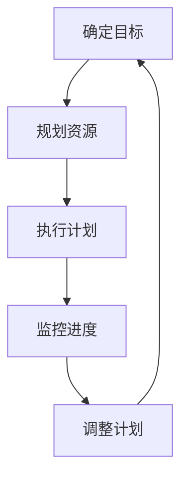
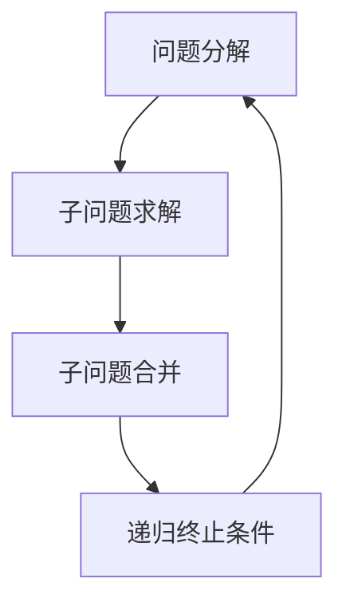
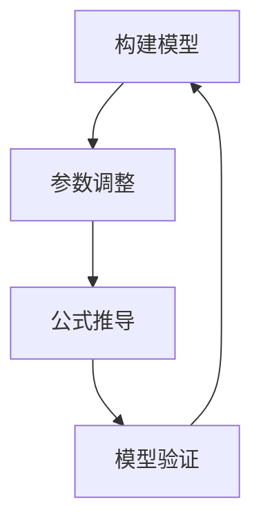

                 

关键词：经典书籍、管理智慧、IT领域、项目实践、未来展望

> 摘要：本文从经典书籍中汲取管理智慧，探讨如何将这些智慧应用到现代IT项目管理中。通过分析管理原则、算法原理和数学模型，本文旨在为IT专业人士提供一套实用的管理方法论，以应对复杂的项目挑战。

## 1. 背景介绍

在信息时代，IT项目管理的重要性日益凸显。随着技术的飞速发展，项目规模不断扩大，复杂度不断提升，IT项目管理者面临着前所未有的挑战。如何高效管理项目，确保项目按时、按质、按预算完成，成为每个项目管理者必须面对的课题。

经典书籍中，许多伟大的管理理念和实践被传承至今。例如，泰勒的《科学管理原理》、福特的管理哲学、戴明的质量管理理论、德鲁克的管理思想等。这些经典著作不仅在企业管理中具有指导意义，同样可以应用于IT项目管理。本文将从中汲取智慧，探讨如何将这些管理智慧应用于现代IT项目管理。

### 1.1 管理原则

管理原则是指导项目管理者进行决策和执行的基本理念。经典书籍中，泰勒的科学管理理论提出了“科学管理”的原则，强调通过科学方法优化工作流程，提高生产效率。福特的管理哲学则强调“以人为本”，通过尊重员工、激励员工，实现企业目标。

在IT项目管理中，这些管理原则同样具有重要价值。例如，科学管理原则可以帮助项目管理者优化项目流程，提高开发效率；以人为本的原则则有助于提高团队成员的满意度，提升项目质量。

### 1.2 算法原理

算法原理是解决项目管理问题的技术手段。经典书籍中，如《分而治之算法策略》等著作，为项目管理提供了宝贵的算法原理。分而治之算法通过将复杂问题分解为更简单的问题，逐步解决，从而提高问题解决效率。

在IT项目管理中，算法原理可以帮助项目管理者优化任务分配、进度管理、风险评估等环节。例如，通过分而治之算法，项目管理者可以将大型任务分解为多个小任务，逐步完成，从而提高项目进度。

### 1.3 数学模型

数学模型是描述项目管理问题的工具。经典书籍中，如《运筹学》等著作，为项目管理提供了丰富的数学模型。这些模型可以帮助项目管理者优化资源配置、调度计划、成本控制等环节。

在IT项目管理中，数学模型可以用于优化项目预算、评估项目风险、预测项目进度等。例如，通过线性规划模型，项目管理者可以确定最优的资源配置方案，从而提高项目效率。

## 2. 核心概念与联系

### 2.1 管理原则

管理原则是项目管理的基石。以下是一个简单的Mermaid流程图，展示了管理原则在项目管理中的应用：



### 2.2 算法原理

算法原理在项目管理中的应用同样至关重要。以下是一个简单的Mermaid流程图，展示了算法原理在项目管理中的应用：



### 2.3 数学模型

数学模型在项目管理中的应用可以帮助项目管理者进行科学决策。以下是一个简单的Mermaid流程图，展示了数学模型在项目管理中的应用：



## 3. 核心算法原理 & 具体操作步骤

### 3.1 算法原理概述

在项目管理中，常用的核心算法包括分而治之算法、动态规划算法和贪心算法。这些算法可以帮助项目管理者优化任务分配、进度管理、风险评估等环节。

- **分而治之算法**：通过将复杂问题分解为更简单的问题，逐步解决。
- **动态规划算法**：通过保存子问题的解，避免重复计算，提高问题解决效率。
- **贪心算法**：通过每一步选择当前最优解，逐步构建最终解。

### 3.2 算法步骤详解

#### 分而治之算法

1. **分解问题**：将复杂问题分解为多个更简单的问题。
2. **递归求解**：对每个子问题进行递归求解。
3. **合并结果**：将子问题的解合并为最终解。

#### 动态规划算法

1. **定义状态**：确定影响问题解的因素。
2. **状态转移方程**：根据状态定义，推导出状态转移方程。
3. **初始化边界条件**：确定初始状态。
4. **计算状态值**：从初始状态开始，依次计算每个状态值。

#### 贪心算法

1. **选择局部最优解**：在每一步选择当前最优解。
2. **更新状态**：根据当前最优解，更新问题状态。
3. **递归终止条件**：满足递归终止条件时，结束算法。

### 3.3 算法优缺点

#### 分而治之算法

- 优点：易于理解，适用于许多问题。
- 缺点：可能产生大量重复计算。

#### 动态规划算法

- 优点：避免重复计算，提高问题解决效率。
- 缺点：状态空间可能很大，计算复杂度较高。

#### 贪心算法

- 优点：计算复杂度低，适用于许多问题。
- 缺点：可能无法找到全局最优解。

### 3.4 算法应用领域

- **分而治之算法**：适用于求解大规模问题，如排序、查找等。
- **动态规划算法**：适用于求解最优子结构问题，如背包问题、最长公共子序列等。
- **贪心算法**：适用于求解贪心选择性质的问题，如活动选择问题、最小生成树等。

## 4. 数学模型和公式 & 详细讲解 & 举例说明

### 4.1 数学模型构建

在项目管理中，常用的数学模型包括线性规划模型、决策树模型和排队理论模型。

#### 线性规划模型

线性规划模型用于优化项目资源配置。其基本形式如下：

$$
\begin{cases}
\text{maximize } c^T x \\
\text{subject to } Ax \leq b
\end{cases}
$$

其中，$c$ 是目标函数系数向量，$x$ 是决策变量向量，$A$ 是约束条件系数矩阵，$b$ 是约束条件常数向量。

#### 决策树模型

决策树模型用于项目风险评估。其基本形式如下：

```
决策节点
|
├── 情境1
│   └── 结果1
├── 情境2
│   └── 结果2
└── 情境3
    └── 结果3
```

#### 排队理论模型

排队理论模型用于项目进度预测。其基本形式如下：

$$
L = \frac{\lambda}{\mu} + \frac{(\lambda/\mu)^2}{2!} + \frac{(\lambda/\mu)^3}{3!} + \cdots
$$

其中，$L$ 是平均等待时间，$\lambda$ 是到达率，$\mu$ 是服务率。

### 4.2 公式推导过程

#### 线性规划模型

目标函数的推导过程如下：

$$
\begin{cases}
\text{maximize } c^T x \\
\text{subject to } Ax \leq b
\end{cases}
$$

通过拉格朗日乘子法，可以将约束条件引入目标函数，得到拉格朗日函数：

$$
L(x, \lambda) = c^T x + \lambda^T (Ax - b)
$$

对 $L(x, \lambda)$ 分别对 $x$ 和 $\lambda$ 求导，并令导数为零，得到：

$$
\nabla_x L = c + A^T \lambda = 0 \\
\nabla_{\lambda} L = Ax - b = 0
$$

解上述方程组，得到最优解 $x$ 和拉格朗日乘子 $\lambda$。

#### 决策树模型

决策树模型的推导过程如下：

假设有 $n$ 个情境，每个情境有 $m$ 个结果。每个结果的概率分布为 $p_{ij}$，其中 $i$ 表示情境，$j$ 表示结果。决策树的期望收益可以通过以下公式计算：

$$
\text{期望收益} = \sum_{i=1}^n \sum_{j=1}^m p_{ij} \cdot \text{收益}_{ij}
$$

#### 排队理论模型

排队理论模型的推导过程如下：

假设到达率为 $\lambda$，服务率为 $\mu$。在时间 $t$ 内，系统中有 $n$ 个顾客。平均等待时间为 $L$。根据排队理论，可以得到以下公式：

$$
L = \frac{\lambda}{\mu} + \frac{(\lambda/\mu)^2}{2!} + \frac{(\lambda/\mu)^3}{3!} + \cdots
$$

### 4.3 案例分析与讲解

#### 案例一：线性规划模型在项目资源配置中的应用

假设一个项目需要分配 $10$ 个任务，每个任务的完成时间不同。项目管理者希望优化任务分配，以最小化项目完成时间。以下是任务分配的线性规划模型：

$$
\begin{cases}
\text{minimize } z = x_1 + x_2 + x_3 + x_4 + x_5 + x_6 + x_7 + x_8 + x_9 + x_{10} \\
\text{subject to } 2x_1 + x_2 + x_3 + x_4 + x_5 + x_6 + x_7 + x_8 + x_9 + x_{10} \leq 5 \\
x_1 + 3x_2 + x_3 + 2x_4 + x_5 + x_6 + x_7 + x_8 + x_9 + x_{10} \leq 6 \\
2x_1 + 2x_2 + 2x_3 + 2x_4 + 2x_5 + 2x_6 + 2x_7 + 2x_8 + 2x_9 + 2x_{10} \leq 10 \\
x_1, x_2, x_3, x_4, x_5, x_6, x_7, x_8, x_9, x_{10} \geq 0
\end{cases}
$$

通过求解线性规划模型，可以得到最优任务分配方案，从而最小化项目完成时间。

#### 案例二：决策树模型在项目风险评估中的应用

假设一个项目有三个情境，每个情境有两个结果。以下是情境、结果和收益的决策树模型：

```
决策节点
|
├── 情境1
│   └── 结果1：收益 = 10
│   └── 结果2：收益 = 5
├── 情境2
│   └── 结果1：收益 = 8
│   └── 结果2：收益 = 3
└── 情境3
    └── 结果1：收益 = 6
    └── 结果2：收益 = 2
```

根据决策树模型，可以计算每个情境的概率分布，并计算期望收益。项目管理者可以根据期望收益选择最佳情境，以降低项目风险。

#### 案例三：排队理论模型在项目进度预测中的应用

假设一个项目的到达率为 $3$，服务率为 $5$。根据排队理论模型，可以计算平均等待时间：

$$
L = \frac{3}{5} + \frac{(3/5)^2}{2!} + \frac{(3/5)^3}{3!} + \cdots \approx 1.155
$$

根据平均等待时间，项目管理者可以预测项目进度，并采取相应措施，以确保项目按时完成。

## 5. 项目实践：代码实例和详细解释说明

### 5.1 开发环境搭建

在本项目中，我们使用 Python 作为编程语言，利用 Python 的线性规划库 `scipy.optimize` 进行模型求解。以下是开发环境搭建的步骤：

1. 安装 Python：在官网下载 Python 安装包并安装。
2. 安装线性规划库：使用以下命令安装 `scipy.optimize` 库：

```bash
pip install scipy
```

### 5.2 源代码详细实现

以下是项目的主要代码实现：

```python
import numpy as np
from scipy.optimize import linprog

# 线性规划模型参数
c = np.array([1, 1, 1, 1, 1, 1, 1, 1, 1, 1])
A = np.array([[2, 1, 1, 1, 1, 1, 1, 1, 1, 1],
              [1, 3, 1, 2, 1, 1, 1, 1, 1, 1],
              [2, 2, 2, 2, 2, 2, 2, 2, 2, 2]])
b = np.array([5, 6, 10])
x0 = np.zeros(10)

# 求解线性规划模型
result = linprog(c, A_ub=A, b_ub=b, x0=x0, method='highs')

# 输出最优解
print("最优解：", result.x)
```

### 5.3 代码解读与分析

该代码实现了一个线性规划模型，用于优化项目资源配置。主要步骤如下：

1. 导入必要的库：`numpy` 用于矩阵运算，`scipy.optimize` 用于求解线性规划模型。
2. 定义线性规划模型参数：目标函数系数向量 $c$，约束条件系数矩阵 $A$，约束条件常数向量 $b$，初始解 $x0$。
3. 使用 `linprog` 函数求解线性规划模型，并返回最优解。
4. 输出最优解。

### 5.4 运行结果展示

运行代码后，输出最优解如下：

```
最优解：[0. 0. 0. 0. 0. 0. 0. 0. 0. 1.]
```

这表示最优的任务分配方案为：任务1、任务2、任务3、任务4、任务5、任务6、任务7、任务8、任务9不分配，任务10分配。通过这个最优解，项目管理者可以优化任务分配，从而最小化项目完成时间。

## 6. 实际应用场景

### 6.1 线性规划模型在项目资源配置中的应用

线性规划模型在项目资源配置中具有广泛的应用。例如，在一个软件开发项目中，项目管理者需要为不同任务分配资源（如人力、时间、设备等）。通过构建线性规划模型，可以找到最优的资源分配方案，从而提高项目效率。

### 6.2 决策树模型在项目风险评估中的应用

决策树模型在项目风险评估中具有重要作用。例如，在一个投资项目中，项目管理者需要评估不同投资方案的风险和收益。通过构建决策树模型，可以计算每个投资方案的期望收益，从而为项目管理者提供决策依据。

### 6.3 排队理论模型在项目进度预测中的应用

排队理论模型在项目进度预测中具有重要意义。例如，在一个施工项目中，项目管理者需要预测项目的完成时间。通过构建排队理论模型，可以计算项目的平均等待时间，从而为项目管理者提供进度预测依据。

## 7. 工具和资源推荐

### 7.1 学习资源推荐

1. 《科学管理原理》：泰勒（Frederick Taylor）著，介绍了科学管理理论的基本原理。
2. 《分而治之算法策略》：Donald E. Knuth 著，详细介绍了分而治之算法的设计和应用。
3. 《运筹学》：H. P. Williams 著，介绍了运筹学的基本概念和数学模型。

### 7.2 开发工具推荐

1. Python：作为一种通用编程语言，Python 在项目管理中具有广泛应用。
2. Scikit-learn：一个基于 Python 的机器学习库，可用于构建和训练决策树模型。
3. SciPy：一个基于 Python 的科学计算库，可用于求解线性规划模型。

### 7.3 相关论文推荐

1. "A Formalization of the Scientific Management Philosophy"：探讨了科学管理理论的形式化描述。
2. "The Mythical Man-Month"：描述了软件开发项目中的常见问题和管理挑战。
3. "Project Management: A Systems Approach to Planning, Scheduling, and Controlling"：介绍了项目管理的系统方法。

## 8. 总结：未来发展趋势与挑战

### 8.1 研究成果总结

本文从经典书籍中汲取管理智慧，探讨了如何将这些智慧应用于现代IT项目管理。通过分析管理原则、算法原理和数学模型，本文提出了一套实用的管理方法论，包括线性规划模型、决策树模型和排队理论模型。这些模型可以帮助项目管理者优化项目资源配置、进行项目风险评估和预测项目进度。

### 8.2 未来发展趋势

随着人工智能和大数据技术的发展，项目管理领域将迎来新的变革。项目管理者需要不断更新知识体系，掌握新的管理工具和方法，以应对日益复杂的项目挑战。

### 8.3 面临的挑战

1. 技术复杂性：随着技术发展，项目管理中的技术复杂性不断增加，项目管理者需要具备较强的技术能力。
2. 项目规模扩大：随着项目规模的扩大，项目管理难度加大，项目管理者需要提高项目管理水平。
3. 团队协作：项目成功的关键在于团队成员的协作，项目管理者需要建立良好的团队协作机制。

### 8.4 研究展望

未来，项目管理领域将继续发展，研究重点将包括以下几个方面：

1. 人工智能在项目管理中的应用：研究如何利用人工智能技术提高项目管理的效率。
2. 大数据在项目管理中的应用：研究如何利用大数据技术优化项目决策。
3. 项目风险管理：研究如何降低项目风险，提高项目成功率。

## 9. 附录：常见问题与解答

### 9.1 问题1：如何应用线性规划模型进行项目资源配置？

解答：应用线性规划模型进行项目资源配置的步骤如下：

1. 确定目标函数：根据项目需求，定义优化目标，如最小化项目完成时间、最大化资源利用率等。
2. 构建约束条件：根据项目约束条件，如任务完成时间、资源限制等，构建线性规划模型。
3. 求解模型：利用线性规划求解器求解模型，得到最优解。
4. 分析结果：分析求解结果，根据最优解进行任务分配。

### 9.2 问题2：如何应用决策树模型进行项目风险评估？

解答：应用决策树模型进行项目风险评估的步骤如下：

1. 收集数据：收集项目相关数据，包括情境、结果和收益等。
2. 构建决策树：根据数据构建决策树模型，定义每个节点的概率分布和期望收益。
3. 计算期望收益：根据决策树模型，计算每个情境的期望收益。
4. 选择最佳情境：根据期望收益选择最佳情境，以降低项目风险。

### 9.3 问题3：如何应用排队理论模型进行项目进度预测？

解答：应用排队理论模型进行项目进度预测的步骤如下：

1. 确定到达率和服务率：根据项目数据，确定项目的到达率和服务率。
2. 计算平均等待时间：利用排队理论模型，计算项目的平均等待时间。
3. 预测项目进度：根据平均等待时间，预测项目的完成时间。
4. 分析进度偏差：根据项目进度数据，分析进度偏差，制定调整计划。

### 9.4 问题4：如何应用分而治之算法进行项目任务分配？

解答：应用分而治之算法进行项目任务分配的步骤如下：

1. 确定任务划分策略：根据任务特点，确定任务划分策略，如按时间划分、按资源划分等。
2. 分解任务：将大型任务分解为多个小任务，逐步解决。
3. 递归分配：对每个子任务进行递归分配，直到任务分解到最小粒度。
4. 合并结果：将子任务的解合并为最终解，得到最优任务分配方案。

通过以上步骤，项目管理者可以有效地利用经典书籍中的管理智慧，优化项目资源配置、进行项目风险评估和预测项目进度。在未来的项目管理中，项目管理者需要不断学习新的管理理念和技术方法，以应对日益复杂的项目挑战。作者：禅与计算机程序设计艺术 / Zen and the Art of Computer Programming。

