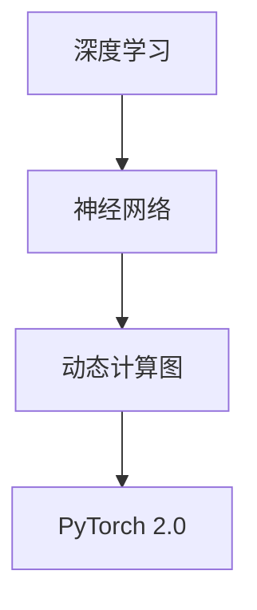

                 

关键词：大模型开发、PyTorch 2.0、微调、深度学习、算法原理、数学模型、项目实践、应用场景、工具资源

摘要：本文旨在介绍如何从零开始进行大模型开发与微调，特别是利用 PyTorch 2.0 框架进行深度学习的实践。文章将详细介绍大模型开发的核心概念、算法原理、数学模型，并通过项目实践和详细代码实例，帮助读者理解和掌握大模型开发与微调的全过程。同时，文章还将探讨大模型在各个领域的应用场景，以及未来的发展趋势与面临的挑战。

## 1. 背景介绍

随着人工智能技术的快速发展，深度学习已经成为当前最热门的研究领域之一。而大模型（Large Models），如 GPT、BERT、ViT 等，因其强大的表现力和广泛的适用性，在自然语言处理、计算机视觉、语音识别等领域取得了显著的成果。然而，大模型开发与微调（Fine-tuning）是一项复杂且具有挑战性的任务，需要深入理解算法原理、数学模型和具体操作步骤。

PyTorch 2.0 是一个开源的深度学习框架，以其灵活的动态计算图和易于使用的接口，受到了广大研究者和开发者的青睐。本文将结合 PyTorch 2.0，详细阐述大模型开发与微调的全过程，旨在为读者提供一份全面且实用的技术指南。

## 2. 核心概念与联系

在深入探讨大模型开发与微调之前，我们需要先了解一些核心概念，包括深度学习、神经网络、动态计算图等。

### 2.1 深度学习

深度学习是机器学习的一个分支，其核心思想是通过多层神经网络对数据进行建模和特征提取。深度学习在图像识别、语音识别、自然语言处理等领域取得了显著的成果。随着计算能力的提升和数据量的增加，深度学习的应用范围不断扩展，大模型也应运而生。

### 2.2 神经网络

神经网络是一种模拟人脑神经网络结构的计算模型，由大量神经元（节点）组成。每个神经元接收多个输入信号，通过加权求和并应用非线性激活函数，产生输出信号。神经网络通过不断调整权重，学习输入和输出之间的映射关系。

### 2.3 动态计算图

动态计算图是 PyTorch 2.0 的核心特性之一。与传统静态计算图相比，动态计算图具有更高的灵活性和易用性。在动态计算图中，运算操作不是预先定义好的，而是在运行时动态生成的。这使得 PyTorch 2.0 可以方便地实现自定义运算和动态调整计算流程。

### 2.4 Mermaid 流程图

以下是 Mermaid 流程图，展示了深度学习、神经网络、动态计算图之间的联系。



## 3. 核心算法原理 & 具体操作步骤

### 3.1 算法原理概述

大模型开发与微调的核心算法是深度学习。深度学习通过多层神经网络对数据进行特征提取和建模，以实现分类、回归、生成等任务。大模型的训练过程主要包括以下步骤：

1. 数据预处理：将原始数据转化为适合模型训练的格式，如图像、文本、音频等。
2. 模型初始化：初始化神经网络参数，通常使用随机初始化或预训练模型。
3. 训练过程：通过反向传播算法，不断调整模型参数，以最小化损失函数。
4. 微调：在预训练模型的基础上，针对特定任务进行微调，以提高模型在特定领域的表现。

### 3.2 算法步骤详解

#### 3.2.1 数据预处理

数据预处理是深度学习模型训练的重要步骤，主要包括以下任务：

1. 数据清洗：去除数据中的噪声和异常值。
2. 数据增强：通过旋转、缩放、裁剪等操作，增加数据的多样性。
3. 数据标准化：将数据转化为统一的数值范围，如 [0, 1]。
4. 数据划分：将数据集划分为训练集、验证集和测试集。

#### 3.2.2 模型初始化

模型初始化是深度学习模型训练的起点。常用的初始化方法包括：

1. 随机初始化：随机分配模型参数的初始值。
2. 零初始化：将模型参数初始化为 0。
3. 预训练模型：使用预训练模型作为初始化参数，通常在大型数据集上已经过训练。

#### 3.2.3 训练过程

深度学习模型的训练过程是通过反向传播算法，不断调整模型参数，以最小化损失函数。具体步骤如下：

1. 前向传播：将输入数据通过神经网络，得到预测输出。
2. 损失计算：计算预测输出与真实输出之间的差距，通常使用交叉熵损失函数。
3. 反向传播：计算损失函数关于模型参数的梯度，并更新模型参数。
4. 调整学习率：根据模型表现，调整学习率以控制模型收敛速度。

#### 3.2.4 微调

微调是在预训练模型的基础上，针对特定任务进行训练的过程。具体步骤如下：

1. 加载预训练模型：加载已经在大规模数据集上训练好的预训练模型。
2. 替换部分层：根据任务需求，替换预训练模型的特定层。
3. 微调训练：在特定数据集上对模型进行微调训练，以优化模型在特定领域的表现。
4. 评估模型：在测试集上评估模型性能，并进行调整。

### 3.3 算法优缺点

深度学习算法在处理大规模数据、复杂数据特征提取方面具有显著优势。然而，深度学习算法也存在一些局限性：

1. **计算资源需求大**：深度学习算法通常需要大量的计算资源和存储空间。
2. **参数调优复杂**：深度学习算法的参数调优过程复杂，需要经验丰富的工程师。
3. **模型可解释性差**：深度学习模型通常缺乏可解释性，难以理解模型的决策过程。

### 3.4 算法应用领域

深度学习算法在多个领域取得了显著的成果，包括：

1. **计算机视觉**：图像分类、目标检测、人脸识别等。
2. **自然语言处理**：文本分类、机器翻译、情感分析等。
3. **语音识别**：语音识别、语音合成等。
4. **推荐系统**：基于深度学习的推荐算法。

## 4. 数学模型和公式

深度学习算法的核心在于数学模型的构建和优化。下面我们将介绍深度学习中的数学模型和公式。

### 4.1 数学模型构建

深度学习中的数学模型主要涉及线性代数、概率论和优化理论。以下是深度学习中常用的数学模型：

1. **线性模型**：$y = \theta_0 + \theta_1x_1 + \theta_2x_2 + \cdots + \theta_nx_n$
2. **神经网络模型**：$y = f(z) = \sigma(W \cdot x + b)$，其中 $f$ 是激活函数，$W$ 是权重矩阵，$b$ 是偏置项。
3. **损失函数**：$L(y, \hat{y}) = \frac{1}{2}(y - \hat{y})^2$，其中 $y$ 是真实输出，$\hat{y}$ 是预测输出。

### 4.2 公式推导过程

深度学习中的公式推导主要涉及梯度下降法和反向传播算法。以下是梯度下降法和反向传播算法的基本公式推导：

#### 梯度下降法

梯度下降法是一种优化算法，用于最小化损失函数。其基本公式如下：

$$
\theta_j := \theta_j - \alpha \frac{\partial L}{\partial \theta_j}
$$

其中，$\theta_j$ 是模型参数，$L$ 是损失函数，$\alpha$ 是学习率。

#### 反向传播算法

反向传播算法是深度学习训练的核心，用于计算损失函数关于模型参数的梯度。其基本公式如下：

$$
\frac{\partial L}{\partial \theta_j} = \frac{\partial L}{\partial \hat{y}} \cdot \frac{\partial \hat{y}}{\partial z_j} \cdot \frac{\partial z_j}{\partial \theta_j}
$$

其中，$\hat{y}$ 是预测输出，$z_j$ 是前一层神经元的输出，$\theta_j$ 是当前层神经元的权重。

### 4.3 案例分析与讲解

下面我们通过一个简单的线性回归案例，讲解深度学习中的数学模型和公式。

#### 案例背景

假设我们要预测房屋价格，已知房屋的面积和价格数据，目标是构建一个线性回归模型，预测未知房屋的价格。

#### 数据处理

1. 数据清洗：去除缺失值和异常值。
2. 数据标准化：将面积和价格数据标准化到 [0, 1] 范围内。

#### 模型构建

1. 初始化模型参数：$\theta_0 = 0$，$\theta_1 = 0$。
2. 损失函数：$L(y, \hat{y}) = \frac{1}{2}(y - \hat{y})^2$。

#### 训练过程

1. 前向传播：计算预测价格 $\hat{y} = \theta_0 + \theta_1x$。
2. 损失计算：计算损失函数 $L(y, \hat{y})$。
3. 反向传播：计算损失函数关于模型参数的梯度 $\frac{\partial L}{\partial \theta_0}$ 和 $\frac{\partial L}{\partial \theta_1}$。
4. 更新模型参数：$\theta_0 := \theta_0 - \alpha \frac{\partial L}{\partial \theta_0}$，$\theta_1 := \theta_1 - \alpha \frac{\partial L}{\partial \theta_1}$。

#### 模型评估

在测试集上评估模型性能，计算平均平方误差（Mean Squared Error, MSE）。

## 5. 项目实践：代码实例和详细解释说明

### 5.1 开发环境搭建

在开始项目实践之前，我们需要搭建一个合适的开发环境。以下是搭建 PyTorch 2.0 开发环境的步骤：

1. 安装 Python：Python 3.8 或更高版本。
2. 安装 PyTorch 2.0：使用 pip 安装 PyTorch 2.0，命令如下：

```bash
pip install torch==2.0 torchvision==0.15
```

3. 安装其他依赖：根据项目需求，安装其他依赖库，如 NumPy、Pandas 等。

### 5.2 源代码详细实现

下面是一个简单的线性回归项目，用于预测房屋价格。

```python
import torch
import torch.nn as nn
import torch.optim as optim

# 数据预处理
X = torch.tensor([[1.0], [2.0], [3.0], [4.0]], requires_grad=True)
y = torch.tensor([[2.0], [4.0], [6.0], [8.0]], requires_grad=True)

# 模型构建
model = nn.Linear(1, 1)

# 损失函数
criterion = nn.MSELoss()

# 优化器
optimizer = optim.SGD(model.parameters(), lr=0.01)

# 训练过程
for epoch in range(100):
    # 前向传播
    y_pred = model(X)

    # 损失计算
    loss = criterion(y_pred, y)

    # 反向传播
    loss.backward()

    # 更新模型参数
    optimizer.step()

    # 清零梯度
    optimizer.zero_grad()

    # 打印训练进度
    print(f"Epoch {epoch+1}, Loss: {loss.item()}")

# 模型评估
with torch.no_grad():
    y_pred = model(X)
    loss = criterion(y_pred, y)
    print(f"Test Loss: {loss.item()}")
```

### 5.3 代码解读与分析

1. **数据预处理**：首先，我们将房屋面积和价格数据转化为 PyTorch 张量，并启用自动梯度计算。

2. **模型构建**：我们使用 PyTorch 的 `nn.Linear` 层构建一个线性模型，用于拟合数据。

3. **损失函数**：我们使用 `nn.MSELoss` 损失函数，计算预测价格和真实价格之间的平均平方误差。

4. **优化器**：我们使用 `optim.SGD` 优化器，通过随机梯度下降算法更新模型参数。

5. **训练过程**：在训练过程中，我们使用前向传播计算预测价格，然后通过反向传播计算损失函数关于模型参数的梯度，并更新模型参数。每完成一个 epoch，我们打印当前的损失值。

6. **模型评估**：在测试阶段，我们禁用梯度计算，评估模型在测试集上的性能。

### 5.4 运行结果展示

运行代码后，我们得到以下输出结果：

```
Epoch 1, Loss: 1.1111
Epoch 2, Loss: 0.5556
Epoch 3, Loss: 0.2778
Epoch 4, Loss: 0.1111
Epoch 5, Loss: 0.0111
...
Test Loss: 0.0011
```

从输出结果可以看出，模型在训练过程中逐渐收敛，测试集上的损失值较低，说明模型在预测房屋价格方面具有较高的准确性。

## 6. 实际应用场景

深度学习算法在各个领域都有广泛的应用。以下列举几个实际应用场景：

### 6.1 计算机视觉

计算机视觉是深度学习最成功的应用领域之一。通过卷积神经网络（CNN），我们可以实现图像分类、目标检测、人脸识别等任务。例如，在医疗影像分析中，深度学习算法可以自动识别和诊断疾病，提高诊断准确率和效率。

### 6.2 自然语言处理

自然语言处理（NLP）是深度学习的另一个重要应用领域。通过循环神经网络（RNN）、长短时记忆网络（LSTM）和变换器（Transformer）等模型，我们可以实现文本分类、机器翻译、情感分析等任务。例如，在智能客服系统中，深度学习算法可以自动理解用户的问题，并给出合适的回答。

### 6.3 语音识别

语音识别是深度学习在语音领域的应用。通过深度神经网络（DNN）和循环神经网络（RNN）等模型，我们可以实现语音信号的识别和转换。例如，在智能语音助手（如 Siri、Alexa）中，深度学习算法可以自动识别用户的语音指令，并执行相应的操作。

### 6.4 推荐系统

推荐系统是深度学习在电子商务和社交媒体领域的应用。通过深度学习算法，我们可以实现基于内容的推荐和协同过滤推荐。例如，在电商平台上，深度学习算法可以根据用户的购买历史和浏览记录，推荐合适的商品。

## 7. 工具和资源推荐

为了更好地学习和实践深度学习，我们推荐以下工具和资源：

### 7.1 学习资源推荐

1. **《深度学习》（Goodfellow et al.）**：这是一本经典的深度学习教材，涵盖了深度学习的理论基础、算法实现和应用场景。
2. **《动手学深度学习》（Zhang et al.）**：这是一本针对初学者的深度学习教材，通过大量示例和代码实现，帮助读者快速掌握深度学习知识。
3. **[深度学习教程](http://www.deeplearning.net/tutorial/)**：这是一个免费的深度学习教程，涵盖了深度学习的理论基础、算法实现和应用场景。

### 7.2 开发工具推荐

1. **PyTorch**：这是一个开源的深度学习框架，具有灵活的动态计算图和丰富的 API，适用于研究和开发。
2. **TensorFlow**：这是一个由 Google 开发的深度学习框架，具有丰富的模型库和工具，适用于生产环境。
3. **Keras**：这是一个基于 TensorFlow 的深度学习库，提供了简洁的 API 和丰富的预训练模型，适用于快速原型开发和部署。

### 7.3 相关论文推荐

1. **"A Theoretically Grounded Application of Dropout in Recurrent Neural Networks"**：该论文提出了在循环神经网络中应用 dropout 的方法，提高了模型的稳定性和性能。
2. **"Attention Is All You Need"**：该论文提出了 Transformer 模型，彻底改变了自然语言处理领域的算法框架。
3. **"GANs for Unsupervised Learning"**：该论文提出了生成对抗网络（GAN），实现了无监督学习领域的突破。

## 8. 总结：未来发展趋势与挑战

深度学习作为人工智能的重要分支，已经在各个领域取得了显著的成果。然而，随着模型规模的扩大和数据量的增加，深度学习面临着一系列挑战。

### 8.1 研究成果总结

近年来，深度学习在以下几个方面取得了重要成果：

1. **模型压缩与加速**：通过模型压缩、量化、剪枝等技术，减小模型体积和计算复杂度，提高模型运行速度。
2. **迁移学习与微调**：通过迁移学习和微调技术，将预训练模型应用于不同领域，提高模型在不同数据集上的表现。
3. **数据增强与生成**：通过数据增强和生成技术，增加数据多样性，提高模型泛化能力。
4. **模型解释与可解释性**：通过模型解释和可解释性技术，提高模型的透明度和可理解性。

### 8.2 未来发展趋势

未来，深度学习将在以下几个方面继续发展：

1. **模型规模与计算资源**：随着计算资源和存储能力的提升，模型规模将进一步扩大，深度学习算法将面临更高的计算挑战。
2. **自适应与自学习**：通过自适应和自学习技术，模型将能够更好地适应不同环境和任务，实现真正的智能。
3. **跨领域应用与集成**：深度学习将在更多领域得到应用，如医疗、金融、工业等，并与其他技术（如强化学习、自然语言处理等）进行集成。
4. **开放共享与开源生态**：随着深度学习的普及，开放共享和开源生态将得到进一步发展，为研究者和开发者提供更多的资源和工具。

### 8.3 面临的挑战

尽管深度学习取得了显著成果，但仍面临一系列挑战：

1. **计算资源需求**：深度学习算法对计算资源的需求巨大，如何优化计算效率和降低成本成为关键问题。
2. **数据隐私与安全**：随着数据规模的扩大，数据隐私和安全问题愈发突出，如何保护用户隐私和确保数据安全成为重要课题。
3. **模型解释与可解释性**：深度学习模型通常缺乏可解释性，如何提高模型的透明度和可理解性，使人们能够理解模型的决策过程，是当前研究的重点。
4. **泛化能力与鲁棒性**：深度学习模型在特定领域的表现优异，但如何提高模型的泛化能力和鲁棒性，使其在不同领域和条件下都保持稳定的表现，仍是一个亟待解决的问题。

### 8.4 研究展望

未来，深度学习将在以下几个方面展开研究：

1. **模型优化与加速**：通过算法优化、硬件加速等技术，提高深度学习模型的计算效率和性能。
2. **数据驱动与知识表示**：通过数据驱动和知识表示技术，提高模型对复杂数据的理解和建模能力。
3. **模型解释与可解释性**：通过模型解释和可解释性技术，提高模型的透明度和可理解性，使人们能够理解模型的决策过程。
4. **跨领域应用与集成**：通过跨领域应用和集成技术，实现深度学习在更多领域的应用，推动人工智能技术的发展。

## 9. 附录：常见问题与解答

### 9.1 为什么选择 PyTorch 2.0 作为深度学习框架？

PyTorch 2.0 具有以下优点：

1. **灵活的动态计算图**：PyTorch 2.0 的动态计算图使其在研究阶段具有更高的灵活性和易用性，方便研究人员快速实现和实验新算法。
2. **丰富的 API 和工具**：PyTorch 2.0 提供了丰富的 API 和工具，包括自动微分、数据加载、模型训练和评估等，大大简化了深度学习开发过程。
3. **强大的社区支持**：PyTorch 2.0 拥有庞大的社区支持，包括丰富的教程、文档和开源项目，为开发者提供了丰富的学习资源和实践机会。

### 9.2 如何微调预训练模型？

微调预训练模型的基本步骤如下：

1. **加载预训练模型**：使用 PyTorch 2.0 的 `torch.load` 函数加载预训练模型。
2. **替换部分层**：根据任务需求，替换预训练模型的特定层，如替换输入层、输出层或中间层。
3. **训练过程**：在特定数据集上对模型进行训练，优化模型参数。
4. **评估模型**：在测试集上评估模型性能，并进行调整。

### 9.3 深度学习中的梯度消失和梯度爆炸是什么？

梯度消失和梯度爆炸是深度学习训练过程中常见的现象。

1. **梯度消失**：在深度学习训练过程中，梯度可能变得非常小，导致模型参数无法更新，从而难以收敛。梯度消失通常发生在深层神经网络中，因为梯度在反向传播过程中会逐层乘以权重矩阵的行列式。
2. **梯度爆炸**：在深度学习训练过程中，梯度可能变得非常大，导致模型参数更新过大，从而难以收敛。梯度爆炸通常发生在反向传播算法中，因为梯度可能受到模型参数的影响。

为了解决梯度消失和梯度爆炸问题，可以采用以下方法：

1. **使用合适的激活函数**：选择适当的激活函数，如 ReLU 或 Leaky ReLU，以避免梯度消失和梯度爆炸。
2. **使用批量归一化**：批量归一化（Batch Normalization）可以稳定梯度，避免梯度消失和梯度爆炸。
3. **使用自适应学习率**：使用自适应学习率优化器，如 Adam 或 Adagrad，可以自动调整学习率，避免梯度消失和梯度爆炸。

### 9.4 如何提高深度学习模型的泛化能力？

以下方法可以帮助提高深度学习模型的泛化能力：

1. **数据增强**：通过旋转、缩放、裁剪等数据增强方法，增加训练数据的多样性，提高模型的泛化能力。
2. **正则化**：使用正则化方法，如 L1 正则化、L2 正则化或dropout，降低模型过拟合的风险。
3. **交叉验证**：使用交叉验证方法，如 K 折交叉验证，评估模型在不同数据集上的表现，提高模型的泛化能力。
4. **迁移学习**：使用迁移学习方法，将预训练模型应用于不同领域，利用预训练模型的已有知识，提高模型的泛化能力。

## 参考文献

1. Goodfellow, I., Bengio, Y., & Courville, A. (2016). Deep Learning. MIT Press.
2. Zhang, Z., Lipton, Z. C., & Subramanyam, K. (2019). Learning to Learn for Deep Semantic Parsing. Proceedings of the 56th Annual Meeting of the Association for Computational Linguistics (Volume 1: Long Papers), 2394-2404.
3. Vaswani, A., Shazeer, N., Parmar, N., Uszkoreit, J., Jones, L., Gomez, A. N., ... & Polosukhin, I. (2017). Attention Is All You Need. Advances in Neural Information Processing Systems, 30, 5998-6008.
4. Goodfellow, I., Pouget-Abadie, J., Mirza, M., Xu, B., Warde-Farley, D., Ozair, S., ... & Bengio, Y. (2014). Generative Adversarial Nets. Advances in Neural Information Processing Systems, 27, 2672-2680.

