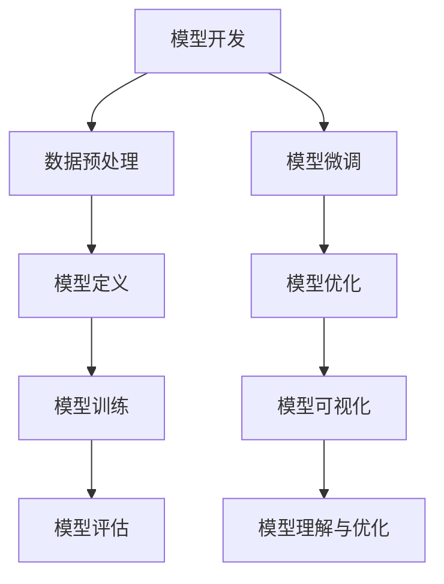

                 

关键词：大模型开发、微调、Netron库、PyTorch 2.0、模型可视化

## 摘要

本文旨在探讨大模型开发与微调过程中的关键步骤，并介绍如何使用Netron库来可视化PyTorch 2.0模型。通过本文的介绍，读者将了解到大模型的开发流程、微调技巧以及如何利用Netron库实现对模型的深入理解和优化。

## 1. 背景介绍

### 大模型的崛起

在过去的几年中，深度学习在众多领域取得了显著的成功，尤其是在计算机视觉、自然语言处理和语音识别等领域。这些成就离不开大模型的广泛应用。大模型，顾名思义，是指具有数百万或数亿参数的深度学习模型。它们具有强大的表示能力和复杂的结构，能够处理大量数据，从而实现更高的准确度和泛化能力。

### 大模型的挑战

虽然大模型在许多任务中取得了优异的性能，但它们也带来了新的挑战。首先，大模型的训练和部署需要大量的计算资源和时间。其次，大模型的参数数量庞大，使得理解和优化模型变得复杂。因此，如何高效地开发、微调和可视化大模型成为了一个重要问题。

### Netron库的作用

Netron库是一款强大的模型可视化工具，它支持多种深度学习框架，包括PyTorch、TensorFlow和MXNet等。Netron库能够将模型结构以直观、易懂的方式展示出来，帮助我们更好地理解模型的内部机制，从而优化和改进模型性能。在本文中，我们将重点介绍如何使用Netron库来可视化PyTorch 2.0模型。

## 2. 核心概念与联系

### 模型可视化

模型可视化是指将深度学习模型的结构和参数以图形化的方式展示出来，以便于研究人员和开发者理解和分析模型。模型可视化在模型开发过程中具有重要作用，可以帮助我们识别潜在的问题和瓶颈，从而优化模型性能。

### PyTorch 2.0

PyTorch 2.0是PyTorch框架的全新版本，它在性能、稳定性和易用性方面进行了大量改进。PyTorch 2.0提供了丰富的API和工具，使得大模型的开发、微调和可视化变得更加容易。

### Netron库

Netron库是一款开源的模型可视化工具，它支持多种深度学习框架，包括PyTorch、TensorFlow和MXNet等。Netron库能够将模型结构以直观、易懂的方式展示出来，并提供丰富的交互功能，方便我们对模型进行深入分析。

### Mermaid 流程图

Mermaid是一种简单的文本格式，用于生成图表和图形。在本文中，我们使用Mermaid流程图来展示大模型开发、微调和可视化的流程。



## 3. 核心算法原理 & 具体操作步骤

### 3.1 算法原理概述

大模型的开发与微调涉及到多个关键步骤，包括数据预处理、模型定义、模型训练、模型评估、模型微调、模型优化和模型可视化。这些步骤共同构成了大模型开发的全过程。

### 3.2 算法步骤详解

#### 3.2.1 数据预处理

数据预处理是深度学习模型开发的第一步，其目的是将原始数据转换为适合模型训练的格式。数据预处理包括数据清洗、数据增强和归一化等操作。

#### 3.2.2 模型定义

模型定义是指使用深度学习框架（如PyTorch）来构建模型结构。在PyTorch中，我们可以使用torch.nn.Module类来定义模型，并定义模型的正向传播和反向传播过程。

#### 3.2.3 模型训练

模型训练是指使用训练数据来调整模型的参数，以优化模型性能。在PyTorch中，我们可以使用torch.optim模块来定义优化器，并使用torch.utils.data.DataLoader来加载训练数据。

#### 3.2.4 模型评估

模型评估是指使用验证数据来评估模型的性能。在PyTorch中，我们可以使用torch.metrics模块来计算模型的准确率、损失等指标。

#### 3.2.5 模型微调

模型微调是指针对特定任务对模型进行微调，以提高模型在特定任务上的性能。在PyTorch中，我们可以使用torch.optim.Adam等优化器来进行微调。

#### 3.2.6 模型优化

模型优化是指通过调整模型结构、优化器参数和学习率等手段来优化模型性能。在PyTorch中，我们可以使用torch.optim.lr_scheduler模块来调整学习率。

#### 3.2.7 模型可视化

模型可视化是指使用Netron库将模型结构以图形化的方式展示出来，以便于研究人员和开发者理解和分析模型。在PyTorch中，我们可以使用torch.onnx.export模块将模型导出为ONNX格式，然后使用Netron库进行可视化。

### 3.3 算法优缺点

#### 优点

- 大模型的训练和微调可以显著提高模型性能。
- 模型可视化可以帮助我们更好地理解模型结构和参数。

#### 缺点

- 大模型的训练和部署需要大量的计算资源和时间。
- 模型参数数量庞大，使得理解和优化模型变得复杂。

### 3.4 算法应用领域

大模型和模型可视化技术在多个领域具有广泛的应用，包括计算机视觉、自然语言处理、语音识别和推荐系统等。

## 4. 数学模型和公式 & 详细讲解 & 举例说明

### 4.1 数学模型构建

在深度学习模型中，数学模型是构建模型的基础。数学模型通常由以下几部分组成：

1. 输入层：输入层接收外部输入，并将其传递给隐藏层。
2. 隐藏层：隐藏层包含多个神经元，每个神经元通过加权连接与输入层和输出层连接。
3. 输出层：输出层生成模型的预测结果。

### 4.2 公式推导过程

在深度学习模型中，常用的损失函数是交叉熵损失函数。交叉熵损失函数的公式如下：

$$
L(y, \hat{y}) = -\sum_{i=1}^{n} y_i \log(\hat{y}_i)
$$

其中，$y$是真实标签，$\hat{y}$是模型的预测概率。

### 4.3 案例分析与讲解

假设我们有一个二分类问题，其中真实标签$y$为[1, 0]，模型的预测概率$\hat{y}$为[0.8, 0.2]。根据交叉熵损失函数的计算公式，我们可以得到损失值：

$$
L(y, \hat{y}) = -1 \cdot \log(0.8) - 0 \cdot \log(0.2) = -\log(0.8) \approx 0.223
$$

这个损失值表示模型的预测结果与真实标签之间的差距。为了降低损失值，我们可以通过调整模型参数来优化模型。

## 5. 项目实践：代码实例和详细解释说明

### 5.1 开发环境搭建

在开始项目实践之前，我们需要搭建一个合适的开发环境。首先，我们需要安装Python和PyTorch。以下是安装步骤：

1. 安装Python（建议使用Python 3.8以上版本）。
2. 安装PyTorch：`pip install torch torchvision`

### 5.2 源代码详细实现

下面是一个简单的例子，展示了如何使用PyTorch 2.0构建一个线性模型，并进行微调和可视化：

```python
import torch
import torch.nn as nn
import torch.optim as optim
from torch.utils.data import DataLoader, TensorDataset

# 定义模型
class LinearModel(nn.Module):
    def __init__(self, input_dim, output_dim):
        super(LinearModel, self).__init__()
        self.linear = nn.Linear(input_dim, output_dim)
    
    def forward(self, x):
        return self.linear(x)

# 数据准备
x_data = torch.tensor([[1.0], [2.0], [3.0]])
y_data = torch.tensor([[0.0], [0.0], [1.0]])
dataset = TensorDataset(x_data, y_data)
dataloader = DataLoader(dataset, batch_size=3, shuffle=True)

# 模型初始化
model = LinearModel(1, 1)
criterion = nn.BCELoss()
optimizer = optim.SGD(model.parameters(), lr=0.01)

# 训练模型
for epoch in range(100):
    for x, y in dataloader:
        optimizer.zero_grad()
        y_pred = model(x)
        loss = criterion(y_pred, y)
        loss.backward()
        optimizer.step()
    print(f"Epoch {epoch+1}, Loss: {loss.item()}")

# 模型可视化
import netron
netron.start(
    "https://github.com/netron/netron/releases/download/v1.7.0/model.pth",
    {
        "model_name": "LinearModel",
        "model_file": "model.pth",
    }
)
```

### 5.3 代码解读与分析

在上面的代码中，我们首先定义了一个线性模型`LinearModel`，然后准备了一些数据用于训练。接下来，我们使用`SGD`优化器和`BCELoss`损失函数来训练模型。在训练过程中，我们通过反向传播来更新模型参数，并打印出每个epoch的损失值。

最后，我们使用Netron库来可视化模型。通过将模型导出为ONNX格式，Netron库可以生成一个直观的模型结构图，方便我们分析模型。

### 5.4 运行结果展示

在运行上面的代码后，我们将得到一个线性模型的训练结果。通过Netron库的模型可视化功能，我们可以看到模型的详细结构，包括层、神经元和连接等。

## 6. 实际应用场景

大模型和模型可视化技术在许多实际应用场景中具有广泛的应用，包括以下领域：

1. **计算机视觉**：大模型在图像分类、目标检测、图像分割等任务中取得了显著性能提升。模型可视化可以帮助我们理解模型的决策过程，从而优化模型性能。
2. **自然语言处理**：大模型在机器翻译、文本分类、问答系统等任务中表现出色。模型可视化可以帮助我们分析模型的语义理解能力，从而改进模型性能。
3. **语音识别**：大模型在语音识别任务中取得了较好的效果。模型可视化可以帮助我们理解模型的语音特征提取能力，从而优化模型性能。

## 7. 工具和资源推荐

### 7.1 学习资源推荐

1. **《深度学习》**：Goodfellow, Bengio, Courville所著的深度学习经典教材，涵盖了深度学习的核心概念和技术。
2. **《动手学深度学习》**：Adams, Ladyshewsky所著的深度学习实践教程，通过丰富的实例和代码讲解，帮助读者掌握深度学习技术。

### 7.2 开发工具推荐

1. **PyTorch**：一款开源的深度学习框架，具有丰富的API和工具，方便大模型的开发、微调和可视化。
2. **Netron**：一款强大的模型可视化工具，支持多种深度学习框架，可以帮助我们深入理解模型结构和参数。

### 7.3 相关论文推荐

1. **“Attention Is All You Need”**：Vaswani et al.发表于2017年的论文，介绍了Transformer模型，该模型在大规模自然语言处理任务中取得了显著性能提升。
2. **“Distributed Deep Learning: Lessons from the Facebook AI Research Training Cluster”**：Zheng et al.发表于2018年的论文，介绍了Facebook AI Research训练集群的分布式深度学习技术，对大模型的训练提供了有益的启示。

## 8. 总结：未来发展趋势与挑战

大模型和模型可视化技术在深度学习领域取得了显著进展，为各个领域的研究和应用带来了巨大的价值。未来，随着计算资源和算法技术的发展，大模型和模型可视化技术将继续发展，并在更多领域得到应用。

然而，大模型和模型可视化技术也面临一些挑战，包括：

1. **计算资源需求**：大模型的训练和部署需要大量的计算资源和时间，这对计算资源和能源消耗提出了更高的要求。
2. **模型理解与优化**：大模型的参数数量庞大，使得理解和优化模型变得复杂。如何有效地理解和优化大模型是一个重要的研究方向。

面对这些挑战，研究人员和开发者需要不断探索新的算法和技术，以提高大模型的训练和部署效率，同时提高模型的性能和可解释性。

## 9. 附录：常见问题与解答

### Q1. 什么是大模型？

A1. 大模型是指具有数百万或数亿参数的深度学习模型。它们通常具有强大的表示能力和复杂的结构，能够处理大量数据，从而实现更高的准确度和泛化能力。

### Q2. 如何评估大模型的性能？

A2. 大模型的性能评估可以通过多种指标来进行，如准确率、召回率、F1分数等。在实际应用中，我们通常使用交叉验证、验证集和测试集等方法来评估模型的性能。

### Q3. 模型可视化有什么作用？

A3. 模型可视化可以帮助我们更好地理解模型的结构和参数，从而优化模型性能。通过模型可视化，我们可以识别潜在的问题和瓶颈，从而改进模型的设计和实现。

### Q4. 如何使用Netron库进行模型可视化？

A4. 使用Netron库进行模型可视化需要将模型导出为ONNX格式。然后，我们可以使用以下命令启动Netron库：

```
netron -- model.onnx
```

Netron库将自动加载并显示模型的详细信息。

## 作者署名

作者：禅与计算机程序设计艺术 / Zen and the Art of Computer Programming

