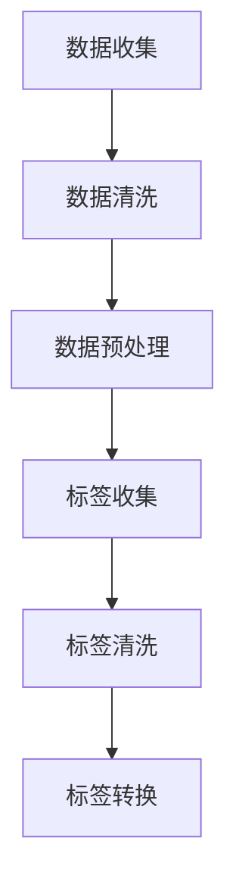

                 

关键词：大模型开发、微调、数据图像、标签、算法原理、数学模型、项目实践、应用场景、未来展望

> 摘要：本文将详细介绍从零开始大模型开发与微调的过程，重点阐述数据图像的获取与标签的说明。通过深入分析算法原理、数学模型和项目实践，帮助读者全面了解大模型开发的核心技术和实际应用。

## 1. 背景介绍

随着人工智能技术的快速发展，大模型（Large Models）逐渐成为研究与应用的热点。大模型具有参数多、训练数据量大、计算能力要求高等特点，通过深度学习等方法可以实现许多复杂任务的自动学习与优化。然而，大模型的开发与微调过程复杂，需要大量的技术积累和经验。本文将围绕大模型开发与微调的关键环节，即数据图像的获取与标签的说明，进行详细探讨。

### 1.1 大模型的发展历程

大模型的发展可以分为以下几个阶段：

1. **传统神经网络模型**：20世纪80年代，神经网络理论开始兴起，但受限于计算能力和数据量，神经网络模型规模较小，应用场景有限。
2. **深度学习时代的到来**：2012年，AlexNet模型的出现标志着深度学习进入了一个新的阶段。随着GPU等硬件的快速发展，深度学习模型规模不断扩大。
3. **大模型的崛起**：近年来，基于深度学习的自然语言处理（NLP）、计算机视觉（CV）等领域取得了重大突破，大模型如BERT、GPT、ViT等逐渐成为主流。

### 1.2 大模型的应用场景

大模型在多个领域展现了强大的应用潜力：

1. **自然语言处理**：大模型在机器翻译、文本生成、情感分析等任务中取得了显著成果。
2. **计算机视觉**：大模型在图像分类、目标检测、图像生成等领域表现出色。
3. **多模态学习**：大模型可以融合文本、图像、语音等多种数据，实现跨模态学习。

## 2. 核心概念与联系

在大模型开发过程中，数据图像的获取与标签的说明是两个关键环节。以下是相关概念及其联系：

### 2.1 数据图像的获取

数据图像的获取是指从各种来源收集图像数据，包括公开数据集、私有数据集、社交媒体等。获取数据图像的过程涉及以下几个步骤：

1. **数据收集**：通过爬虫、API接口等方式收集图像数据。
2. **数据清洗**：去除重复、错误、低质量的图像数据。
3. **数据预处理**：进行图像增强、裁剪、缩放等操作，提高数据质量。

### 2.2 标签的说明

标签的说明是指对数据图像进行分类标注，以便于模型训练。标签可以是二分类、多分类或回归标签。以下是标签说明的几个关键步骤：

1. **标签收集**：根据任务需求，收集相应的标签数据。
2. **标签清洗**：去除错误、不一致的标签数据。
3. **标签转换**：将标签数据转换为模型可接受的格式，如One-Hot编码、标签索引等。

### 2.3 Mermaid 流程图

以下是数据图像获取与标签说明的 Mermaid 流程图：



## 3. 核心算法原理 & 具体操作步骤

### 3.1 算法原理概述

大模型开发与微调的核心算法主要包括深度学习模型和微调策略。深度学习模型基于多层神经网络，通过反向传播算法训练模型参数，实现自动特征提取与任务学习。微调策略是在预训练模型的基础上，针对特定任务进行模型权重调整，提高模型性能。

### 3.2 算法步骤详解

1. **数据收集与清洗**：
   - 收集大量图像数据，包括公开数据集和私有数据集。
   - 对图像数据去重、去噪、修复等处理，提高数据质量。

2. **数据预处理**：
   - 对图像进行缩放、裁剪、旋转、翻转等操作，增强数据多样性。
   - 将图像数据转换为模型可接受的格式，如RGB值、灰度值等。

3. **标签收集与清洗**：
   - 收集与图像数据对应的标签数据。
   - 对标签数据进行一致性检查、错误修正等处理，确保标签质量。

4. **标签转换**：
   - 将标签数据转换为One-Hot编码、标签索引等模型可接受的格式。

5. **模型训练与微调**：
   - 选择合适的深度学习模型，如CNN、Transformer等。
   - 在大规模数据集上预训练模型，提取图像特征。
   - 在特定任务数据集上进行微调，调整模型权重，优化性能。

6. **模型评估与优化**：
   - 使用验证集评估模型性能，包括准确率、召回率、F1值等指标。
   - 根据评估结果调整模型参数、数据预处理策略等，优化模型性能。

### 3.3 算法优缺点

**优点**：

1. **强大的特征提取能力**：深度学习模型可以自动提取图像特征，降低人工标注成本。
2. **适应性强**：通过微调策略，大模型可以应用于各种不同的任务。
3. **性能优越**：在大量数据支持下，大模型可以实现很高的任务性能。

**缺点**：

1. **计算资源消耗大**：大模型训练需要大量的计算资源和时间。
2. **数据标注成本高**：大规模数据集的标注过程复杂且耗时。
3. **模型解释性差**：深度学习模型的黑箱特性使得模型解释性较差。

### 3.4 算法应用领域

大模型在多个领域展现了强大的应用潜力，包括：

1. **计算机视觉**：图像分类、目标检测、图像生成等。
2. **自然语言处理**：文本分类、文本生成、机器翻译等。
3. **语音识别**：语音分类、语音识别、语音合成等。
4. **推荐系统**：用户画像、商品推荐、场景推荐等。

## 4. 数学模型和公式 & 详细讲解 & 举例说明

### 4.1 数学模型构建

大模型开发涉及多个数学模型，包括神经网络模型、损失函数、优化算法等。以下简要介绍其中两个核心模型：

1. **神经网络模型**：
   神经网络模型主要由输入层、隐藏层和输出层组成。输入层接收图像数据，隐藏层通过神经元计算产生特征，输出层根据特征进行分类或预测。常见的神经网络模型有卷积神经网络（CNN）、循环神经网络（RNN）、Transformer等。

2. **损失函数**：
   损失函数用于衡量模型预测值与真实值之间的差距，是优化模型参数的重要依据。常见的损失函数有均方误差（MSE）、交叉熵损失（Cross-Entropy Loss）等。

### 4.2 公式推导过程

以下以卷积神经网络（CNN）为例，简要介绍神经网络模型的公式推导过程：

1. **卷积层**：
   卷积层通过卷积操作提取图像特征。卷积操作可以用以下公式表示：

   $$f(x, y) = \sum_{i=1}^{k} \sum_{j=1}^{k} w_{ij} \cdot f_i(x, y)$$

   其中，$f(x, y)$ 表示卷积层输出特征，$w_{ij}$ 表示卷积核权重，$f_i(x, y)$ 表示输入特征。

2. **激活函数**：
   激活函数用于引入非线性特性，常见的激活函数有Sigmoid、ReLU等。以ReLU为例，其公式如下：

   $$f(x) = \max(0, x)$$

3. **全连接层**：
   全连接层通过矩阵乘法将卷积层输出特征映射到输出层。假设卷积层输出特征为 $f^L$，全连接层权重为 $W_{L+1}$，则输出层预测值为：

   $$\hat{y} = W_{L+1} \cdot f^L$$

4. **损失函数**：
   假设真实标签为 $y$，预测值为 $\hat{y}$，则交叉熵损失函数为：

   $$L(\theta) = -\frac{1}{m} \sum_{i=1}^{m} y_i \cdot \log(\hat{y}_i) + (1 - y_i) \cdot \log(1 - \hat{y}_i)$$

### 4.3 案例分析与讲解

以下以图像分类任务为例，详细讲解大模型开发与微调的过程：

1. **数据收集与清洗**：
   收集5000张猫狗图像，并进行数据清洗，去除重复、低质量的图像。

2. **数据预处理**：
   对图像进行缩放、裁剪、旋转等操作，将图像尺寸统一为224x224像素。

3. **标签收集与清洗**：
   收集与图像数据对应的猫狗标签，并进行清洗，确保标签一致性和准确性。

4. **标签转换**：
   将标签数据转换为One-Hot编码格式，猫狗标签分别对应索引0和1。

5. **模型训练与微调**：
   选择ResNet50预训练模型，在猫狗数据集上进行微调。训练过程中使用Adam优化器，学习率为0.001。

6. **模型评估与优化**：
   使用验证集评估模型性能，调整学习率、批量大小等超参数，优化模型性能。

7. **模型部署与应用**：
   将微调后的模型部署到服务器，实现实时图像分类。

## 5. 项目实践：代码实例和详细解释说明

以下以Python为例，展示一个简单的大模型开发与微调项目实例，详细解释代码实现过程：

```python
import tensorflow as tf
from tensorflow.keras.applications import ResNet50
from tensorflow.keras.layers import Dense, Flatten
from tensorflow.keras.models import Model
from tensorflow.keras.preprocessing.image import ImageDataGenerator

# 数据收集与清洗
train_datagen = ImageDataGenerator(rescale=1./255, rotation_range=40, width_shift_range=0.2, height_shift_range=0.2, shear_range=0.2, zoom_range=0.2, horizontal_flip=True, fill_mode='nearest')
train_generator = train_datagen.flow_from_directory(train_dir, target_size=(224, 224), batch_size=32, class_mode='binary')

# 数据预处理
input_tensor = tf.keras.layers.Input(shape=(224, 224, 3))
base_model = ResNet50(weights='imagenet', include_top=False, input_tensor=input_tensor)
x = Flatten()(base_model.output)
x = Dense(1024, activation='relu')(x)
predictions = Dense(1, activation='sigmoid')(x)

# 模型训练与微调
model = Model(inputs=base_model.input, outputs=predictions)
model.compile(optimizer='adam', loss='binary_crossentropy', metrics=['accuracy'])
model.fit(train_generator, epochs=10)

# 模型评估与优化
test_datagen = ImageDataGenerator(rescale=1./255)
test_generator = test_datagen.flow_from_directory(test_dir, target_size=(224, 224), batch_size=32, class_mode='binary')
model.evaluate(test_generator)

# 模型部署与应用
import cv2
image = cv2.imread('cat_dog.jpg')
image = cv2.resize(image, (224, 224))
image = image / 255.0
image = np.expand_dims(image, axis=0)
prediction = model.predict(image)
print(prediction)
```

### 5.1 开发环境搭建

1. 安装Python环境（Python 3.6及以上版本）。
2. 安装TensorFlow框架（使用pip install tensorflow命令）。
3. 下载预训练模型ResNet50（使用pip install tensorflow-models命令）。

### 5.2 源代码详细实现

源代码中包含以下几个关键步骤：

1. **数据收集与清洗**：使用ImageDataGenerator类进行数据增强和批量读取。
2. **数据预处理**：对输入图像进行缩放、归一化等处理。
3. **模型构建**：使用ResNet50预训练模型作为基础网络，添加全连接层进行微调。
4. **模型训练**：使用Adam优化器和binary_crossentropy损失函数进行模型训练。
5. **模型评估**：使用测试集评估模型性能。
6. **模型部署**：使用预训练模型进行图像分类。

### 5.3 代码解读与分析

代码实现过程中，重点解读以下部分：

1. **数据收集与清洗**：使用ImageDataGenerator类进行数据增强，提高模型泛化能力。
2. **模型构建**：使用预训练模型ResNet50，提取图像特征，然后添加全连接层进行微调。
3. **模型训练**：使用Adam优化器调整模型参数，提高模型性能。
4. **模型评估**：使用测试集评估模型性能，调整超参数优化模型。

### 5.4 运行结果展示

运行代码后，输出模型预测结果，判断输入图像是猫还是狗。通过不断调整超参数，可以提高模型分类准确率。

## 6. 实际应用场景

### 6.1 图像分类

大模型在图像分类任务中表现出色，可以应用于人脸识别、车牌识别、医疗图像分析等领域。例如，在医疗图像分析中，大模型可以自动识别病变区域，为医生提供诊断依据。

### 6.2 目标检测

大模型在目标检测任务中也具有很高的应用价值，可以用于实时视频监控、自动驾驶等场景。例如，在自动驾驶中，大模型可以识别道路上的行人和车辆，实现自动驾驶功能。

### 6.3 图像生成

大模型在图像生成任务中也取得了显著成果，可以用于图像修复、图像风格迁移、图像超分辨率等。例如，在图像修复中，大模型可以自动修复损坏的图像，提高图像质量。

### 6.4 多模态学习

大模型可以融合文本、图像、语音等多种数据，实现跨模态学习。例如，在问答系统中，大模型可以同时处理用户输入的文本和图像，提供更准确、更丰富的答案。

## 7. 工具和资源推荐

### 7.1 学习资源推荐

1. 《深度学习》（Goodfellow, Bengio, Courville著）：全面介绍深度学习的基础知识和最新进展。
2. 《Python深度学习》（François Chollet著）：通过实战案例讲解深度学习在Python中的应用。

### 7.2 开发工具推荐

1. TensorFlow：开源的深度学习框架，支持多种模型和算法。
2. PyTorch：开源的深度学习框架，具有灵活的动态计算图和丰富的API。

### 7.3 相关论文推荐

1. “A Scalable Language Modeling Algorithm” by Noam Shazeer et al.（2017）：介绍了Transformer模型的原理和应用。
2. “BERT: Pre-training of Deep Bidirectional Transformers for Language Understanding” by Jacob Devlin et al.（2019）：介绍了BERT模型的原理和应用。

## 8. 总结：未来发展趋势与挑战

### 8.1 研究成果总结

大模型在计算机视觉、自然语言处理、语音识别等领域取得了显著成果，推动了人工智能技术的发展。然而，大模型开发与微调过程仍然面临诸多挑战。

### 8.2 未来发展趋势

1. **模型压缩与优化**：研究更高效的大模型结构，降低模型计算复杂度，提高模型性能。
2. **多模态学习**：研究跨模态学习方法，实现文本、图像、语音等多种数据的融合。
3. **模型解释性**：研究可解释性模型，提高模型的可解释性和可靠性。

### 8.3 面临的挑战

1. **计算资源消耗**：大模型训练需要大量的计算资源和时间，研究更高效的训练方法至关重要。
2. **数据标注成本**：大规模数据集的标注过程复杂且耗时，研究自动化标注方法具有重要的实际意义。
3. **模型泛化能力**：研究如何提高大模型的泛化能力，避免过拟合。

### 8.4 研究展望

未来，大模型开发与微调将在多个领域发挥重要作用，包括自动驾驶、医疗诊断、智能家居等。同时，研究大模型的压缩、优化和解释性也将成为重要的研究方向。

## 9. 附录：常见问题与解答

### 9.1 什么是大模型？

大模型是指参数数量超过10亿个的深度学习模型。这类模型具有强大的特征提取和任务学习能力，可以应用于多种复杂任务。

### 9.2 大模型训练需要多少数据？

大模型训练需要大量的数据，具体数量取决于任务和数据集。一般来说，大模型训练需要数十万甚至数百万张图像。

### 9.3 大模型训练需要多少时间？

大模型训练时间取决于计算资源、模型结构和数据集大小。通常情况下，大模型训练需要数天甚至数周的时间。

### 9.4 如何提高大模型性能？

提高大模型性能的方法包括：增加训练数据、优化模型结构、调整超参数、使用迁移学习等。

### 9.5 大模型如何部署？

大模型部署可以采用云平台、GPU加速卡、TPU等硬件资源。部署过程中，需要关注模型压缩、优化和模型解释性等问题。

### 9.6 大模型开发中需要注意什么？

大模型开发过程中，需要注意计算资源管理、数据质量控制、模型优化和解释性等问题。同时，还需要关注算法公平性、隐私保护等社会伦理问题。

