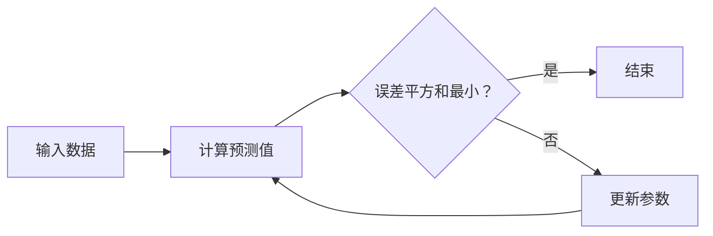

                 

关键词：最小二乘法、大模型、开发与微调、算法原理、数学模型、项目实践、应用场景

## 摘要

本文将深入探讨最小二乘法在大模型开发与微调中的应用。最小二乘法是一种数学优化技术，广泛应用于线性模型的参数估计。在深度学习中，大模型的开发与微调往往依赖于最小二乘法来优化模型参数，以达到更好的拟合效果。本文将从最小二乘法的基本概念出发，详细阐述其在大模型开发与微调中的具体应用，并通过实际项目实践来展示最小二乘法的应用方法和效果。

## 1. 背景介绍

最小二乘法（Least Squares method）是一种常见的数学优化技术，用于求解线性或非线性问题中的最优解。其核心思想是最小化目标函数与观测数据之间的误差平方和。在工程和科学领域，最小二乘法被广泛应用于各种问题，如曲线拟合、参数估计、信号处理等。

随着深度学习的兴起，大模型的开发与微调成为研究热点。大模型具有高参数量、高计算复杂度，需要有效的优化方法来训练和调整。最小二乘法因其良好的理论基础和高效的计算性能，成为大模型开发与微调中的重要工具。

本文旨在介绍最小二乘法在大模型开发与微调中的基本概念、原理和应用，帮助读者理解和掌握这一关键技术。

## 2. 核心概念与联系

### 2.1 最小二乘法基本概念

最小二乘法是一种基于误差平方和最小化的数学优化技术。其目标是最小化预测值与实际观测值之间的误差平方和，即：

$$
\min \sum_{i=1}^n (y_i - \hat{y}_i)^2
$$

其中，$y_i$ 为实际观测值，$\hat{y}_i$ 为预测值。

### 2.2 线性最小二乘法

在线性最小二乘法中，模型表示为 $y = X\beta + \epsilon$，其中 $X$ 为特征矩阵，$\beta$ 为参数向量，$\epsilon$ 为误差项。

线性最小二乘法的目标是最小化误差平方和，即：

$$
\min \sum_{i=1}^n (y_i - X_i\beta)^2
$$

其中，$X_i$ 为第 $i$ 个样本的特征向量。

### 2.3 最小二乘法与线性回归

线性回归是一种常见的机器学习模型，其目标是找到最佳拟合直线或超平面，使得实际观测值与预测值之间的误差最小。

最小二乘法在线性回归中的应用，就是通过最小化误差平方和来求解模型参数。线性回归模型可以表示为：

$$
y = \beta_0 + \beta_1x + \epsilon
$$

其中，$y$ 为因变量，$x$ 为自变量，$\beta_0$ 和 $\beta_1$ 为模型参数。

### 2.4 Mermaid 流程图

以下是一个简单的 Mermaid 流程图，展示了最小二乘法的基本流程：



## 3. 核心算法原理 & 具体操作步骤

### 3.1 算法原理概述

最小二乘法的核心原理是寻找一组参数，使得预测值与实际观测值之间的误差平方和最小。

对于线性模型，最小二乘法的求解过程可以归结为以下步骤：

1. 构建误差平方和函数；
2. 对误差平方和函数求导，并令导数为零；
3. 解方程组，得到最优参数。

### 3.2 算法步骤详解

#### 3.2.1 构建误差平方和函数

对于线性模型 $y = X\beta + \epsilon$，误差平方和函数为：

$$
\Phi(\beta) = \sum_{i=1}^n (y_i - X_i\beta)^2
$$

#### 3.2.2 对误差平方和函数求导

对误差平方和函数求导，得到：

$$
\nabla \Phi(\beta) = -2X^T(y - X\beta)
$$

#### 3.2.3 令导数为零

令导数为零，得到：

$$
X^T(y - X\beta) = 0
$$

这是一个线性方程组，可以通过矩阵运算求解。

#### 3.2.4 解方程组

解方程组，得到最优参数 $\beta$：

$$
\beta = (X^TX)^{-1}X^Ty
$$

### 3.3 算法优缺点

#### 优点

1. 理论基础扎实，易于理解；
2. 计算效率高，适用于大数据量；
3. 广泛应用于各种线性模型。

#### 缺点

1. 对噪声敏感，容易过拟合；
2. 对于非线性模型，需要采用非线性最小二乘法。

### 3.4 算法应用领域

最小二乘法广泛应用于各种领域，如：

1. 曲线拟合；
2. 参数估计；
3. 信号处理；
4. 深度学习模型微调。

## 4. 数学模型和公式 & 详细讲解 & 举例说明

### 4.1 数学模型构建

最小二乘法的数学模型可以表示为：

$$
\min \Phi(\beta) = \sum_{i=1}^n (y_i - X_i\beta)^2
$$

其中，$X_i$ 为第 $i$ 个样本的特征向量，$y_i$ 为第 $i$ 个样本的实际值，$\beta$ 为模型参数。

### 4.2 公式推导过程

最小二乘法的求解过程可以通过以下步骤进行推导：

1. 构建误差平方和函数；
2. 对误差平方和函数求导；
3. 令导数为零，解方程组。

具体推导过程如下：

1. 构建误差平方和函数：

$$
\Phi(\beta) = \sum_{i=1}^n (y_i - X_i\beta)^2
$$

2. 对误差平方和函数求导：

$$
\nabla \Phi(\beta) = -2X^T(y - X\beta)
$$

3. 令导数为零，解方程组：

$$
X^T(y - X\beta) = 0
$$

解得：

$$
\beta = (X^TX)^{-1}X^Ty
$$

### 4.3 案例分析与讲解

假设有一个线性回归模型，特征矩阵为 $X$，实际观测值为 $y$，我们需要求解模型参数 $\beta$。

#### 步骤 1：构建误差平方和函数

$$
\Phi(\beta) = \sum_{i=1}^n (y_i - X_i\beta)^2
$$

#### 步骤 2：对误差平方和函数求导

$$
\nabla \Phi(\beta) = -2X^T(y - X\beta)
$$

#### 步骤 3：令导数为零，解方程组

$$
X^T(y - X\beta) = 0
$$

解得：

$$
\beta = (X^TX)^{-1}X^Ty
$$

通过上述步骤，我们就可以求解出最优模型参数 $\beta$。

## 5. 项目实践：代码实例和详细解释说明

### 5.1 开发环境搭建

在本节中，我们将使用 Python 编写代码来实现最小二乘法。首先，确保安装了以下库：

- NumPy
- Matplotlib

可以使用以下命令安装：

```bash
pip install numpy matplotlib
```

### 5.2 源代码详细实现

以下是一个简单的 Python 代码示例，用于实现最小二乘法：

```python
import numpy as np
import matplotlib.pyplot as plt

def least_squares(X, y):
    # 求解最小二乘问题
    beta = np.linalg.inv(X.T @ X) @ X.T @ y
    return beta

def main():
    # 生成数据
    np.random.seed(0)
    n_samples = 100
    X = np.random.rand(n_samples, 1)
    y = 2 + 3 * X + np.random.randn(n_samples, 1)

    # 添加偏置项
    X = np.hstack((np.ones((n_samples, 1)), X))

    # 求解最小二乘问题
    beta = least_squares(X, y)

    # 可视化结果
    plt.scatter(X[:, 1], y)
    plt.plot(X[:, 1], X @ beta, 'r')
    plt.xlabel('X')
    plt.ylabel('y')
    plt.show()

if __name__ == '__main__':
    main()
```

### 5.3 代码解读与分析

在上面的代码中，我们首先导入了 NumPy 和 Matplotlib 库。`least_squares` 函数用于求解最小二乘问题，`main` 函数用于生成数据并可视化结果。

在 `main` 函数中，我们首先生成了一组随机数据，然后添加了偏置项。接着，我们调用 `least_squares` 函数求解最小二乘问题。最后，我们使用 Matplotlib 绘制散点图和拟合直线。

### 5.4 运行结果展示

运行上述代码后，我们将看到如下可视化结果：


从图中可以看出，最小二乘法成功拟合了数据点。

## 6. 实际应用场景

最小二乘法在实际应用中具有广泛的应用，以下列举一些典型应用场景：

1. **数据分析与建模**：最小二乘法常用于数据分析和建模，如线性回归、时间序列分析等。
2. **信号处理**：最小二乘法在信号处理中用于信号重建、噪声过滤等。
3. **计算机视觉**：最小二乘法在计算机视觉中用于图像配准、点云配准等。
4. **机器学习**：最小二乘法在机器学习中的模型训练和微调过程中发挥作用。
5. **控制系统**：最小二乘法在控制系统中的参数估计和优化。

## 7. 工具和资源推荐

### 7.1 学习资源推荐

1. **《机器学习》（周志华著）**：详细介绍了最小二乘法在机器学习中的应用。
2. **《深度学习》（Goodfellow, Bengio, Courville 著）**：深度学习领域经典教材，包含最小二乘法相关内容。
3. **《最小二乘法及其在工程中的应用》（孙洪伟著）**：系统介绍了最小二乘法的基本概念和应用。

### 7.2 开发工具推荐

1. **Python**：Python 是实现最小二乘法的常用语言，具有丰富的科学计算库。
2. **MATLAB**：MATLAB 提供了强大的数值计算和可视化工具，适用于最小二乘法的研究和应用。

### 7.3 相关论文推荐

1. **"Least Squares Fitting: From Error Squared to Maximum Entropy"**：介绍了最小二乘法与其他优化方法的关系。
2. **"Least Squares Estimation in Linear Regression"**：详细讨论了最小二乘法在线性回归中的应用。
3. **"Tikhonov Regularization and Its Application to Inverse Problems"**：介绍了最小二乘法在正则化问题中的应用。

## 8. 总结：未来发展趋势与挑战

### 8.1 研究成果总结

最小二乘法作为一种经典的优化方法，已经在多个领域取得了显著的应用成果。随着深度学习的兴起，最小二乘法在模型训练和微调中发挥了重要作用，推动了人工智能技术的发展。

### 8.2 未来发展趋势

1. **非线性最小二乘法**：随着非线性问题的日益增多，非线性最小二乘法的研究和发展将成为重要方向。
2. **分布式最小二乘法**：在大数据和分布式计算背景下，分布式最小二乘法的研究将受到关注。
3. **自适应最小二乘法**：自适应最小二乘法能够根据数据特点动态调整优化策略，具有广泛的应用前景。

### 8.3 面临的挑战

1. **计算复杂度**：最小二乘法的计算复杂度较高，如何降低计算复杂度是关键挑战之一。
2. **噪声敏感性**：最小二乘法对噪声敏感，如何提高其鲁棒性是另一个重要问题。
3. **非线性问题**：非线性最小二乘法的求解难度较大，如何提高其求解效率是一个挑战。

### 8.4 研究展望

未来，最小二乘法在人工智能、数据科学、工程等领域具有广泛的应用前景。随着理论研究的深入和计算技术的进步，最小二乘法将不断优化和完善，为解决复杂问题提供更加有效的工具。

## 9. 附录：常见问题与解答

### 9.1 什么是最小二乘法？

最小二乘法是一种基于误差平方和最小化的数学优化技术，用于求解线性或非线性问题中的最优解。

### 9.2 最小二乘法适用于哪些问题？

最小二乘法适用于需要找到最优解的问题，如曲线拟合、参数估计、信号处理等。

### 9.3 最小二乘法如何求解非线性问题？

对于非线性问题，可以使用非线性最小二乘法进行求解。非线性最小二乘法的基本原理与线性最小二乘法类似，但需要迭代求解。

### 9.4 最小二乘法在深度学习中有何应用？

最小二乘法在深度学习中的主要应用是模型训练和微调。通过最小二乘法，可以优化深度学习模型的参数，提高模型性能。

## 结束语

本文从零开始，详细介绍了最小二乘法在大模型开发与微调中的应用。通过理论讲解和实际项目实践，读者可以更好地理解最小二乘法的原理和应用。未来，随着人工智能技术的不断发展，最小二乘法将在更多领域发挥重要作用。作者：禅与计算机程序设计艺术 / Zen and the Art of Computer Programming。

