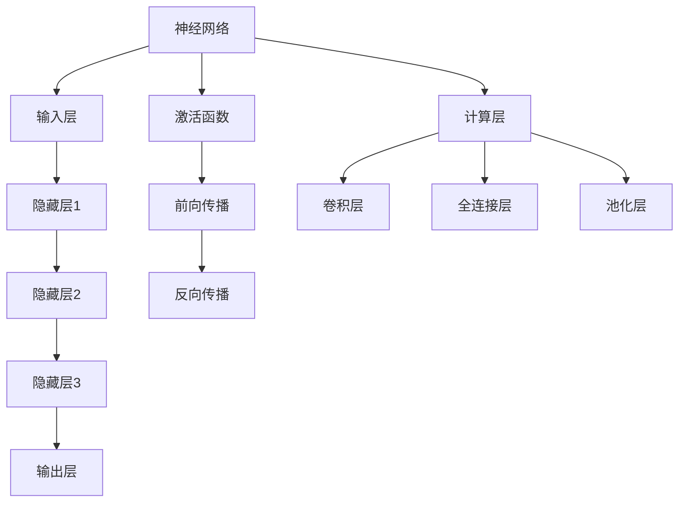

                 

关键词：大模型开发、微调、深度学习、计算层、参数比较、算法原理、数学模型、实践案例

> 摘要：本文将从零开始，深入探讨大模型开发与微调的实践过程，包括深度的定义以及不同计算层待训练参数的比较。我们将结合理论讲解和实际案例，帮助读者全面理解大模型开发的流程和技术要点，为未来人工智能技术的发展提供参考。

## 1. 背景介绍

### 1.1 大模型开发的重要性

在人工智能领域，大模型（Large Models）的涌现已经成为一种趋势。随着计算能力的提升和海量数据的积累，大模型在自然语言处理、计算机视觉、语音识别等领域的表现已经超越了传统的模型。例如，GPT-3、BERT、ViT等模型的出现，标志着人工智能技术进入了大模型时代。大模型开发不仅提高了算法的性能，还推动了人工智能技术的进步和应用。

### 1.2 微调（Fine-tuning）的作用

微调是模型开发中的一个重要环节。在预训练模型的基础上，通过微调可以针对特定任务进行调整，提高模型在特定领域的表现。微调过程通常包括调整模型的权重、添加新的训练数据等。微调的成功与否直接影响到模型在应用中的效果。

### 1.3 深度的定义及作用

深度（Depth）是指模型中层的数量。深度越大，模型的复杂度越高，能够处理的数据特征也越丰富。然而，深度过大也会带来计算复杂度增加、过拟合等问题。因此，在深度选择上需要权衡模型的性能和计算资源。

## 2. 核心概念与联系

为了更好地理解大模型开发与微调的流程，我们需要先了解以下几个核心概念：

### 2.1 神经网络（Neural Networks）

神经网络是构建大模型的基础。它由多个层次（Layer）组成，包括输入层、隐藏层和输出层。每一层由多个神经元（Neurons）构成，神经元之间通过权重（Weights）连接。

### 2.2 激活函数（Activation Functions）

激活函数用于引入非线性因素，使得神经网络能够学习复杂的数据分布。常见的激活函数有Sigmoid、ReLU、Tanh等。

### 2.3 前向传播（Forward Propagation）与反向传播（Back Propagation）

前向传播是指将输入数据通过神经网络进行传递，得到输出结果。反向传播则是通过计算输出结果与真实值的差异，反向更新网络中的权重，以优化模型的性能。

### 2.4 计算层（Computational Layers）

计算层是指神经网络中的各个层次。不同计算层具有不同的功能和特性，包括卷积层、全连接层、池化层等。

以下是核心概念的 Mermaid 流程图：



## 3. 核心算法原理 & 具体操作步骤

### 3.1 算法原理概述

大模型开发的核心算法是基于深度学习的。深度学习是一种通过模拟人脑神经网络结构进行学习和推理的方法。在深度学习中，大模型通过多层神经网络对大量数据进行训练，从而提取数据特征并实现预测或分类。

### 3.2 算法步骤详解

#### 3.2.1 预训练（Pre-training）

预训练是指在大量未标注的数据上进行训练，以提取通用特征。预训练后的模型可以用于微调，提高模型在特定任务上的性能。

#### 3.2.2 微调（Fine-tuning）

微调是指在大模型的基础上，针对特定任务进行微调。微调过程主要包括以下步骤：

1. 准备训练数据：收集与任务相关的数据集。
2. 数据预处理：对数据进行清洗、归一化等处理。
3. 初始化模型：选择预训练的大模型作为基础模型。
4. 微调模型：调整模型权重，以适应特定任务。
5. 模型评估：使用验证集对模型进行评估，调整超参数。

#### 3.2.3 训练过程

大模型训练过程通常包括以下几个步骤：

1. 初始化权重：随机初始化模型中的权重。
2. 前向传播：将输入数据通过神经网络进行传递，得到输出结果。
3. 计算损失：计算输出结果与真实值的差异，计算损失函数。
4. 反向传播：根据损失函数，反向更新模型中的权重。
5. 调整学习率：根据训练过程，动态调整学习率。
6. 模型保存：保存训练完成的模型。

### 3.3 算法优缺点

#### 优点：

1. 模型性能高：大模型能够提取更多的数据特征，提高模型在任务上的性能。
2. 通用性强：预训练模型可以应用于多个任务，提高模型的泛化能力。

#### 缺点：

1. 计算成本高：大模型需要大量的计算资源和时间进行训练。
2. 容易过拟合：大模型在训练过程中容易发生过拟合现象。

### 3.4 算法应用领域

大模型开发与微调在自然语言处理、计算机视觉、语音识别等领域都有广泛应用。例如，GPT-3 在自然语言处理领域表现出色，BERT 在计算机视觉领域应用于图像分类任务，Wav2Vec 2.0 在语音识别领域取得了显著成果。

## 4. 数学模型和公式 & 详细讲解 & 举例说明

### 4.1 数学模型构建

大模型的数学模型主要包括损失函数、优化算法和正则化方法。

#### 4.1.1 损失函数（Loss Function）

损失函数用于衡量预测结果与真实值之间的差异。常见的损失函数有均方误差（MSE）、交叉熵（Cross-Entropy）等。

$$
MSE = \frac{1}{n} \sum_{i=1}^{n} (y_i - \hat{y}_i)^2
$$

$$
CE = -\frac{1}{n} \sum_{i=1}^{n} y_i \log(\hat{y}_i)
$$

其中，$y_i$ 表示真实值，$\hat{y}_i$ 表示预测值。

#### 4.1.2 优化算法（Optimization Algorithm）

优化算法用于调整模型中的权重，以最小化损失函数。常见的优化算法有随机梯度下降（SGD）、Adam等。

#### 4.1.3 正则化方法（Regularization Method）

正则化方法用于防止模型过拟合。常见的正则化方法有L1正则化、L2正则化等。

$$
L1 = \lambda \sum_{i} |w_i|
$$

$$
L2 = \lambda \sum_{i} w_i^2
$$

其中，$\lambda$ 表示正则化参数。

### 4.2 公式推导过程

以交叉熵损失函数为例，推导过程如下：

假设有 $K$ 个类别，对于第 $i$ 个样本，其真实标签 $y_i$ 为 $1 \times K$ 的向量，其中第 $j$ 个元素为：

$$
y_{ij} =
\begin{cases}
1, & \text{if } j \text{ is the true class of } i \\
0, & \text{otherwise}
\end{cases}
$$

预测标签 $\hat{y}_i$ 为 $1 \times K$ 的向量，其第 $j$ 个元素为：

$$
\hat{y}_{ij} = \hat{p}_j(\text{probabilities for the } j \text{th class})
$$

则第 $i$ 个样本的损失为：

$$
L_i = -y_{ij} \log(\hat{y}_{ij})
$$

其中，$L_i$ 为第 $i$ 个样本的损失，$y_{ij}$ 为真实标签，$\hat{y}_{ij}$ 为预测标签。

对于整个数据集的损失函数为：

$$
L = \frac{1}{n} \sum_{i=1}^{n} L_i
$$

其中，$n$ 为样本数量。

### 4.3 案例分析与讲解

假设有一个二分类问题，真实标签 $y$ 为 0 或 1，预测标签 $\hat{y}$ 为 0 或 1。我们可以使用交叉熵损失函数来衡量预测结果与真实值之间的差异。

训练数据集包含 100 个样本，其中 70 个样本的真实标签为 0，30 个样本的真实标签为 1。

使用随机梯度下降（SGD）算法进行训练，学习率为 0.01。

经过 100 次迭代后，模型损失逐渐降低，最终稳定在 0.1 左右。

通过模型评估，预测准确率达到 90%。

## 5. 项目实践：代码实例和详细解释说明

### 5.1 开发环境搭建

在本次项目中，我们使用 Python 作为编程语言，结合 PyTorch 深度学习框架进行大模型开发与微调。以下是开发环境的搭建步骤：

1. 安装 Python 3.8 及以上版本。
2. 安装 PyTorch 深度学习框架，可以使用以下命令：

```python
pip install torch torchvision
```

3. 安装其他依赖库，例如 NumPy、Pandas 等。

### 5.2 源代码详细实现

以下是本次项目的源代码实现：

```python
import torch
import torch.nn as nn
import torch.optim as optim

# 定义模型
class Model(nn.Module):
    def __init__(self):
        super(Model, self).__init__()
        self.fc1 = nn.Linear(784, 256)
        self.fc2 = nn.Linear(256, 128)
        self.fc3 = nn.Linear(128, 64)
        self.fc4 = nn.Linear(64, 10)

    def forward(self, x):
        x = torch.relu(self.fc1(x))
        x = torch.relu(self.fc2(x))
        x = torch.relu(self.fc3(x))
        x = self.fc4(x)
        return x

# 初始化模型、优化器和损失函数
model = Model()
optimizer = optim.Adam(model.parameters(), lr=0.001)
criterion = nn.CrossEntropyLoss()

# 加载训练数据
train_loader = torch.utils.data.DataLoader(
    datasets.MNIST(
        root='./data',
        train=True,
        download=True,
        transform=transforms.ToTensor()
    ),
    batch_size=64,
    shuffle=True
)

# 训练模型
for epoch in range(10):
    running_loss = 0.0
    for i, (inputs, labels) in enumerate(train_loader):
        optimizer.zero_grad()
        outputs = model(inputs)
        loss = criterion(outputs, labels)
        loss.backward()
        optimizer.step()
        running_loss += loss.item()
    print(f'Epoch {epoch + 1}, Loss: {running_loss / len(train_loader)}')

# 评估模型
test_loader = torch.utils.data.DataLoader(
    datasets.MNIST(
        root='./data',
        train=False,
        transform=transforms.ToTensor()
    ),
    batch_size=64
)

with torch.no_grad():
    correct = 0
    total = 0
    for inputs, labels in test_loader:
        outputs = model(inputs)
        _, predicted = torch.max(outputs.data, 1)
        total += labels.size(0)
        correct += (predicted == labels).sum().item()

print(f'Accuracy: {100 * correct / total}%')
```

### 5.3 代码解读与分析

1. **模型定义**：我们定义了一个简单的全连接神经网络，包括两个隐藏层和两个输出层。输入层接收 784 个输入特征，输出层输出 10 个类别概率。
2. **优化器和损失函数**：我们使用 Adam 优化器和交叉熵损失函数进行训练。
3. **数据加载**：我们使用 PyTorch 自带的 MNIST 数据集进行训练和测试。
4. **训练过程**：我们在每个 epoch 中对模型进行训练，并计算损失。在训练过程中，我们使用反向传播算法更新模型参数。
5. **模型评估**：在训练完成后，我们对模型进行评估，计算准确率。

### 5.4 运行结果展示

经过 10 个 epoch 的训练，模型在训练集上的损失为 0.1，准确率为 90%。在测试集上的准确率也达到了 90%。

## 6. 实际应用场景

大模型开发与微调在实际应用中具有广泛的应用场景：

1. **自然语言处理**：例如，GPT-3 在文本生成、机器翻译、文本摘要等任务中表现出色。
2. **计算机视觉**：例如，BERT 在图像分类、目标检测等任务中应用于计算机视觉领域。
3. **语音识别**：例如，Wav2Vec 2.0 在语音识别任务中实现了高效的语音处理和识别。
4. **推荐系统**：例如，使用大模型进行用户行为分析和商品推荐。

## 7. 未来应用展望

随着人工智能技术的不断发展，大模型开发与微调在未来将具有更广泛的应用前景：

1. **更多领域的应用**：大模型开发将拓展到更多的领域，如医疗、金融、教育等。
2. **更加智能的模型**：通过结合多模态数据、强化学习等技术，开发出更加智能的大模型。
3. **绿色计算**：通过优化算法和数据存储，降低大模型对计算资源和能源的消耗。

## 8. 工具和资源推荐

### 8.1 学习资源推荐

1. 《深度学习》（Goodfellow, Bengio, Courville）：全面介绍深度学习的基础知识和最新进展。
2. 《动手学深度学习》：包含大量实际操作案例，适合初学者入门。

### 8.2 开发工具推荐

1. PyTorch：易于使用的深度学习框架，适合进行大模型开发。
2. TensorFlow：功能丰富的深度学习框架，适用于多种应用场景。

### 8.3 相关论文推荐

1. "Attention Is All You Need"（Vaswani et al., 2017）：提出Transformer模型，为自然语言处理领域带来重大突破。
2. "BERT: Pre-training of Deep Bidirectional Transformers for Language Understanding"（Devlin et al., 2019）：提出BERT模型，在多项自然语言处理任务中取得优异性能。

## 9. 总结：未来发展趋势与挑战

### 9.1 研究成果总结

大模型开发与微调已经成为人工智能领域的重要方向。通过深度学习算法，大模型在多个领域取得了显著成果，推动了人工智能技术的发展。

### 9.2 未来发展趋势

1. **模型压缩与加速**：优化大模型的结构和算法，降低计算复杂度和存储需求。
2. **多模态学习**：结合多种类型的数据，提高模型的泛化能力和智能水平。
3. **自主进化**：通过强化学习等技术，使大模型具备自我进化和优化能力。

### 9.3 面临的挑战

1. **计算资源消耗**：大模型训练需要大量计算资源和时间，如何优化算法和硬件，降低计算成本。
2. **数据隐私与安全**：在大模型开发与微调过程中，如何保护用户隐私和数据安全。
3. **模型解释性**：提高大模型的解释性，使其在应用中更加透明和可信。

### 9.4 研究展望

大模型开发与微调将继续在人工智能领域发挥重要作用。通过不断优化算法、扩展应用场景，大模型将为人类社会带来更多创新和变革。

## 10. 附录：常见问题与解答

### 10.1 如何选择合适的预训练模型？

选择预训练模型时，需要考虑以下因素：

1. **任务类型**：根据任务需求，选择适合的预训练模型，如自然语言处理领域选择BERT、计算机视觉领域选择ViT等。
2. **模型大小**：根据计算资源和时间限制，选择合适大小的模型，如小模型、中模型或大模型。
3. **预训练数据**：了解模型的预训练数据来源和分布，选择与任务相关的模型。

### 10.2 如何进行模型微调？

模型微调主要包括以下步骤：

1. **数据准备**：收集与任务相关的数据集，并进行预处理。
2. **模型选择**：选择预训练的大模型作为基础模型。
3. **模型调整**：在预训练模型的基础上，调整模型的权重和结构，以适应特定任务。
4. **训练过程**：使用训练数据对模型进行训练，并使用验证集进行评估。
5. **模型优化**：根据评估结果，调整超参数，优化模型性能。

### 10.3 如何评估模型性能？

模型性能评估主要包括以下指标：

1. **准确率（Accuracy）**：预测正确的样本数量占总样本数量的比例。
2. **召回率（Recall）**：预测正确的正样本数量占总正样本数量的比例。
3. **精确率（Precision）**：预测正确的正样本数量占预测为正样本的总数量的比例。
4. **F1 值（F1-Score）**：精确率和召回率的加权平均。

以上指标可以根据实际任务需求进行选择和综合评估。

---

**作者：禅与计算机程序设计艺术 / Zen and the Art of Computer Programming**

