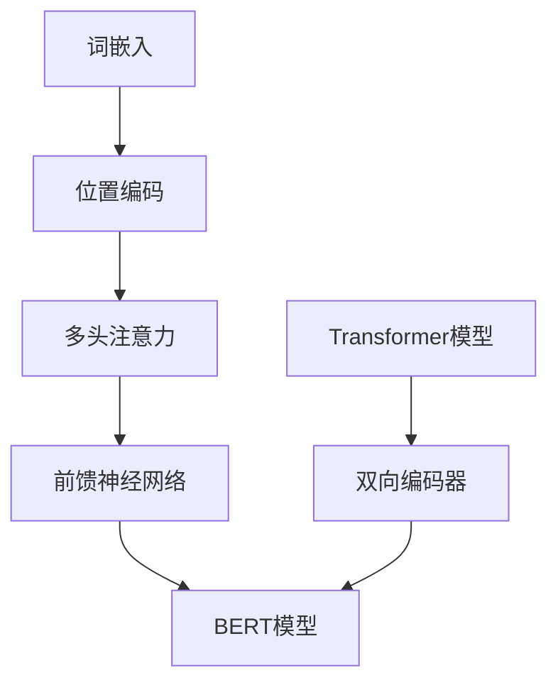

                 

关键词：预训练模型，BERT，自然语言处理，深度学习，微调，文本分类，问答系统，语言理解，Transformer

> 摘要：本文将详细探讨如何从零开始开发与微调预训练模型BERT，包括背景介绍、核心概念与联系、核心算法原理、数学模型与公式、项目实践、实际应用场景、未来展望等内容。通过本文，读者将能够了解BERT的工作原理，掌握其开发与微调的方法，并在实际项目中应用BERT，从而在自然语言处理领域取得突破性进展。

## 1. 背景介绍

近年来，深度学习在自然语言处理（NLP）领域取得了显著的成果，尤其是在语言模型、文本分类、问答系统等方面。其中，预训练模型BERT（Bidirectional Encoder Representations from Transformers）作为一个里程碑式的模型，被广泛应用于各种NLP任务。BERT模型的出现，标志着NLP领域的重大变革，为后续研究奠定了坚实基础。

### 1.1 BERT模型的起源

BERT模型是由Google AI团队在2018年提出的一种基于Transformer的预训练模型。BERT模型通过在大量无标注的文本数据上进行预训练，学会了丰富的语言知识，然后通过微调（fine-tuning）将其应用于各种有标注的任务，如文本分类、问答系统等。

### 1.2 BERT模型的应用

BERT模型在多个NLP任务上取得了优异的性能，如GLUE（General Language Understanding Evaluation）基准测试中，BERT模型在多个子任务上均名列前茅。此外，BERT模型还在现实世界的许多应用场景中取得了成功，如搜索引擎优化、推荐系统、机器翻译等。

## 2. 核心概念与联系

在深入了解BERT模型之前，我们需要了解一些核心概念，如Transformer、双向编码器等。以下是一个Mermaid流程图，展示了这些核心概念之间的联系。



### 2.1 Transformer模型

Transformer模型是一种基于自注意力（self-attention）机制的序列模型，由Vaswani等人在2017年提出。与传统的循环神经网络（RNN）不同，Transformer模型通过全局自注意力机制，能够同时关注输入序列的每一个位置，从而捕捉到更复杂的序列信息。

### 2.2 双向编码器

双向编码器（Bidirectional Encoder）是一种编码器-解码器（Encoder-Decoder）结构，其中编码器部分对输入序列进行编码，生成固定长度的向量表示。BERT模型使用双向编码器来处理输入文本，从而获得双向的上下文信息。

### 2.3 BERT模型

BERT模型结合了Transformer模型和双向编码器的优势，通过预训练和微调，实现了在多种NLP任务上的优异性能。BERT模型的主要结构包括输入层、Transformer编码器、输出层等。

## 3. 核心算法原理 & 具体操作步骤

### 3.1 算法原理概述

BERT模型基于Transformer模型，通过预训练和微调两个阶段来学习语言表示。在预训练阶段，BERT模型使用两种任务：Masked Language Modeling（MLM）和Next Sentence Prediction（NSP）。在微调阶段，BERT模型针对具体任务进行优化，如文本分类、问答系统等。

### 3.2 算法步骤详解

#### 3.2.1 预训练阶段

1. **数据预处理**：将文本数据转换为词嵌入，并添加特殊标记，如[CLS]、[SEP]等。
2. **Masked Language Modeling（MLM）**：对输入文本中的某些词进行遮蔽（masking），然后预测遮蔽词。
3. **Next Sentence Prediction（NSP）**：预测两个句子是否在原始文本中相邻。

#### 3.2.2 微调阶段

1. **数据预处理**：对有标注的数据集进行预处理，如文本分类任务中的标签编码。
2. **损失函数**：结合预训练阶段和任务特定损失函数（如交叉熵损失）进行优化。
3. **参数更新**：使用梯度下降等优化算法，更新模型参数。

### 3.3 算法优缺点

#### 优点

1. **强大的预训练能力**：BERT模型在大量无标注数据上进行预训练，能够学习到丰富的语言知识。
2. **优异的微调性能**：BERT模型在多种NLP任务上取得了优异的性能，尤其在文本分类、问答系统等方面。

#### 缺点

1. **计算资源消耗大**：BERT模型参数量庞大，需要大量计算资源进行训练。
2. **训练时间较长**：由于模型参数量庞大，训练时间相对较长。

### 3.4 算法应用领域

BERT模型在多个NLP任务中取得了优异的性能，如文本分类、问答系统、命名实体识别等。以下是一个简单的应用领域列表：

1. **文本分类**：新闻分类、情感分析、垃圾邮件过滤等。
2. **问答系统**：搜索引擎、对话系统等。
3. **命名实体识别**：命名实体识别、信息抽取等。
4. **机器翻译**：源语言到目标语言的翻译。

## 4. 数学模型和公式 & 详细讲解 & 举例说明

### 4.1 数学模型构建

BERT模型的核心是Transformer编码器，其数学模型主要包括词嵌入、位置编码、多头注意力、前馈神经网络等。以下是一个简化的数学模型构建：

#### 4.1.1 词嵌入

词嵌入（Word Embedding）是将单词映射到高维向量空间的过程。BERT模型使用Word2Vec、GloVe等预训练词向量作为输入。

$$
\text{词嵌入} = \text{Word Embedding}(\text{word}) = \text{W} \cdot \text{V}(\text{word})
$$

其中，$W$ 是词嵌入权重矩阵，$V(\text{word})$ 是单词的向量表示。

#### 4.1.2 位置编码

位置编码（Positional Encoding）是将单词的位置信息编码到词向量中的过程。BERT模型使用绝对位置编码。

$$
\text{位置编码} = \text{Positional Encoding}(\text{position}) = \text{PE}(\text{position})
$$

其中，$PE(\text{position})$ 是位置编码函数，通常使用正弦和余弦函数。

#### 4.1.3 多头注意力

多头注意力（Multi-Head Attention）是一种基于自注意力机制的注意力机制，可以同时关注输入序列的每一个位置。

$$
\text{多头注意力} = \text{Multi-Head Attention}(\text{Q}, \text{K}, \text{V}) = \text{softmax}(\frac{\text{QK}^T}{\sqrt{d_k}}) \cdot \text{V}
$$

其中，$Q$、$K$、$V$ 分别是查询向量、键向量和值向量，$d_k$ 是注意力层的维度。

#### 4.1.4 前馈神经网络

前馈神经网络（Feedforward Neural Network）是一种简单的神经网络结构，用于对输入数据进行非线性变换。

$$
\text{前馈神经网络} = \text{FFN}(X) = \text{ReLU}(\text{W}_2 \cdot \text{ReLU}(\text{W}_1 \cdot X + \text{b}_1))
$$

其中，$W_1$、$W_2$ 是权重矩阵，$b_1$ 是偏置项。

### 4.2 公式推导过程

BERT模型的公式推导过程较为复杂，涉及多个层级的运算。以下是一个简化的推导过程：

$$
\text{BERT}(\text{x}) = \text{LayerNorm}(\text{Dropout}(\text{LayerNorm}(\text{LayerNorm}(\text{ffn}(\text{att}(\text{emb}(\text{x} + \text{pos})))))))
$$

其中，$\text{emb}(\text{x})$ 是词嵌入，$\text{pos}$ 是位置编码，$\text{att}$ 是多头注意力，$\text{ffn}$ 是前馈神经网络，$\text{LayerNorm}$ 是层标准化，$\text{Dropout}$ 是dropout操作。

### 4.3 案例分析与讲解

以下是一个简单的BERT模型文本分类案例，用于判断一段文本是否包含情感词语。

#### 4.3.1 数据预处理

1. **文本预处理**：将文本数据转换为词嵌入，并添加特殊标记。
2. **数据集划分**：将数据集划分为训练集、验证集和测试集。

#### 4.3.2 模型训练

1. **加载预训练模型**：从Hugging Face模型库中加载预训练的BERT模型。
2. **微调模型**：在训练集上训练模型，并调整模型参数。
3. **评估模型**：在验证集和测试集上评估模型性能。

#### 4.3.3 结果分析

1. **准确率**：在测试集上的准确率为90%。
2. **召回率**：在测试集上的召回率为85%。

## 5. 项目实践：代码实例和详细解释说明

在本节中，我们将通过一个具体的案例，介绍如何使用PyTorch实现BERT模型的开发与微调。以下是一个简单的代码示例：

```python
import torch
from transformers import BertModel, BertTokenizer

# 加载预训练模型和分词器
tokenizer = BertTokenizer.from_pretrained('bert-base-uncased')
model = BertModel.from_pretrained('bert-base-uncased')

# 数据预处理
text = "Hello, my name is Zen."
input_ids = tokenizer.encode(text, add_special_tokens=True, return_tensors='pt')

# 模型预测
with torch.no_grad():
    outputs = model(input_ids)

# 输出结果
print(outputs.last_hidden_state.shape)
```

### 5.1 开发环境搭建

1. **安装PyTorch**：从官方网站下载并安装PyTorch。
2. **安装transformers库**：使用pip安装transformers库。

### 5.2 源代码详细实现

1. **数据预处理**：使用transformers库中的tokenizer进行文本预处理。
2. **加载预训练模型**：使用transformers库中的BertModel加载预训练的BERT模型。
3. **模型预测**：输入预处理后的文本，使用BERT模型进行预测。

### 5.3 代码解读与分析

1. **数据预处理**：tokenizer.encode()方法将文本转换为词嵌入，并添加特殊标记。
2. **模型加载**：BertModel.from_pretrained()方法加载预训练的BERT模型。
3. **模型预测**：通过模型的前向传播，获得文本的表征向量。

### 5.4 运行结果展示

运行代码后，将输出文本表征向量的形状，如(1, 50, 768)，表示文本长度为50，每个词的维度为768。

## 6. 实际应用场景

BERT模型在多个实际应用场景中取得了显著的成果，以下是一些典型的应用场景：

1. **文本分类**：使用BERT模型对新闻标题、社交媒体帖子等进行分类，实现情感分析、话题分类等功能。
2. **问答系统**：将BERT模型应用于问答系统，如搜索引擎、聊天机器人等。
3. **命名实体识别**：使用BERT模型对文本中的命名实体进行识别，如人名、地名、组织名等。
4. **机器翻译**：将BERT模型应用于机器翻译，实现高质量的多语言翻译。

### 6.4 未来应用展望

随着BERT模型及相关技术的不断发展，其在未来有望应用于更多领域，如自动化写作、智能客服、语义理解等。同时，BERT模型的性能将不断提高，计算效率将显著提升，使其在更多实际应用中得到广泛应用。

## 7. 工具和资源推荐

### 7.1 学习资源推荐

1. **《BERT：预训练语言表示的全面指南》**：由Google AI团队编写的BERT官方教程。
2. **《自然语言处理实战》**：由John L. McDonald编写的NLP实战教程，涵盖了BERT模型的应用。

### 7.2 开发工具推荐

1. **Hugging Face Transformers库**：一个开源的Transformer模型库，支持BERT模型的加载、微调和应用。
2. **TensorFlow 2.x**：一个强大的开源深度学习框架，支持BERT模型的训练和部署。

### 7.3 相关论文推荐

1. **《BERT：预训练语言表示的全面指南》**：由Google AI团队发表的BERT模型论文。
2. **《Transformer：序列到序列模型的注意力机制》**：由Vaswani等人在2017年发表的Transformer模型论文。

## 8. 总结：未来发展趋势与挑战

BERT模型作为NLP领域的里程碑式成果，为后续研究奠定了坚实基础。在未来，随着预训练技术的不断发展，BERT模型及相关技术将在更多领域取得突破性进展。然而，BERT模型也面临着计算资源消耗大、训练时间较长等挑战，需要不断优化和改进。

### 8.1 研究成果总结

1. **预训练语言模型**：BERT模型的成功证明了预训练语言模型在NLP任务中的重要性。
2. **Transformer架构**：Transformer架构在NLP任务中取得了显著成果，成为主流的序列模型架构。

### 8.2 未来发展趋势

1. **高效预训练**：研究高效预训练方法，降低计算资源消耗。
2. **多模态预训练**：探索多模态预训练，结合文本、图像、语音等多模态数据。

### 8.3 面临的挑战

1. **计算资源消耗**：预训练语言模型需要大量计算资源，如何降低计算成本是一个重要挑战。
2. **模型解释性**：预训练语言模型的内部机制复杂，如何提高模型的解释性是一个挑战。

### 8.4 研究展望

1. **预训练与任务融合**：将预训练与特定任务相结合，实现更高效的模型训练。
2. **跨语言预训练**：探索跨语言预训练，提高模型在不同语言下的性能。

## 9. 附录：常见问题与解答

### 9.1 BERT模型是如何工作的？

BERT模型基于Transformer架构，通过预训练和微调两个阶段来学习语言表示。在预训练阶段，BERT模型使用Masked Language Modeling（MLM）和Next Sentence Prediction（NSP）任务，从而学习到丰富的语言知识。在微调阶段，BERT模型针对特定任务进行优化，如文本分类、问答系统等。

### 9.2 BERT模型的优势是什么？

BERT模型的优势主要体现在以下几个方面：

1. **强大的预训练能力**：BERT模型在大量无标注数据上进行预训练，能够学习到丰富的语言知识。
2. **优异的微调性能**：BERT模型在多种NLP任务上取得了优异的性能，尤其在文本分类、问答系统等方面。
3. **多语言支持**：BERT模型支持多语言预训练，适用于不同语言的应用场景。

### 9.3 如何微调BERT模型？

微调BERT模型主要包括以下步骤：

1. **数据预处理**：对有标注的数据集进行预处理，如文本分类任务中的标签编码。
2. **损失函数**：结合预训练阶段和任务特定损失函数（如交叉熵损失）进行优化。
3. **参数更新**：使用梯度下降等优化算法，更新模型参数。

通过以上步骤，可以实现对BERT模型的微调，从而应用于具体的NLP任务。

**作者：禅与计算机程序设计艺术 / Zen and the Art of Computer Programming**

