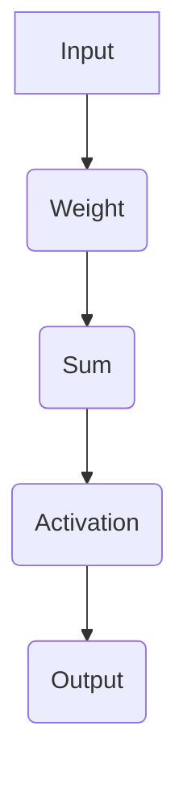
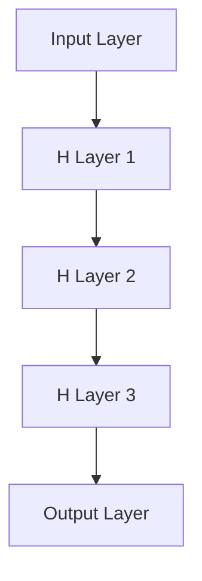
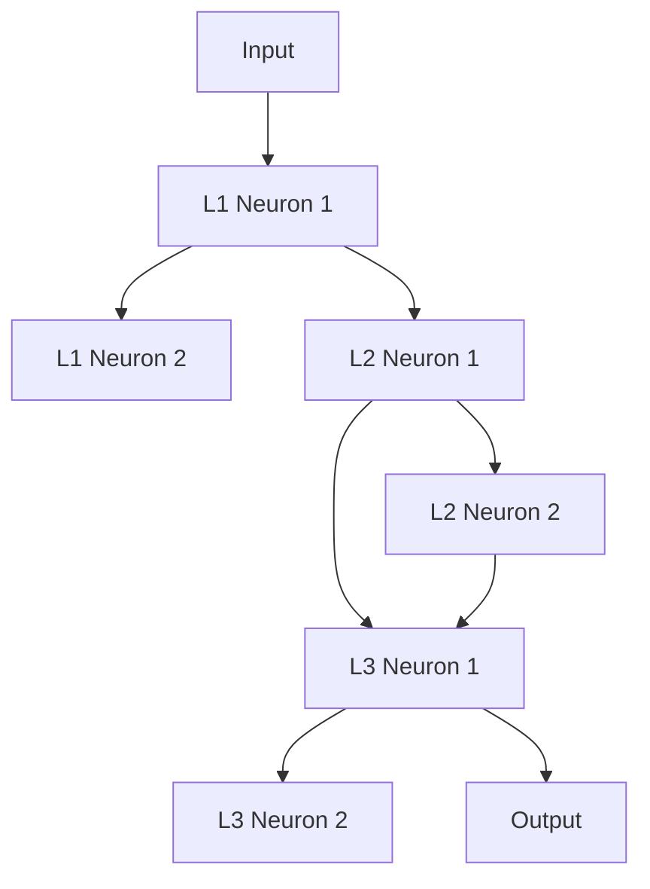
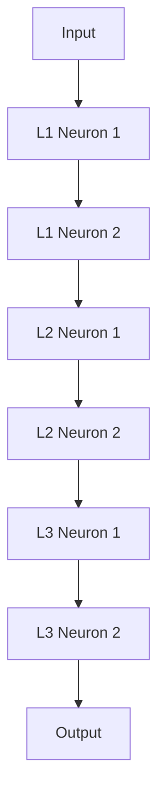
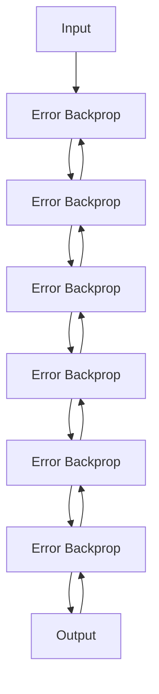

                 

关键词：大模型开发，神经网络框架，微调，自定义实现，计算机编程，人工智能

> 摘要：本文旨在为初学者和从业者提供一个全面而详细的指南，介绍如何从零开始开发与微调自定义神经网络框架。我们将探讨核心概念、算法原理、数学模型构建、实际操作步骤以及代码实例，帮助读者掌握这一领域的知识，并应用于实际项目中。

## 1. 背景介绍

随着人工智能技术的飞速发展，神经网络作为一种强大的机器学习模型，已经广泛应用于图像识别、自然语言处理、推荐系统等多个领域。而大模型（如GPT、BERT等）的出现，更是推动了人工智能的又一次飞跃。然而，现有的深度学习框架如TensorFlow、PyTorch等，虽然功能强大，但也存在一定的局限性和学习门槛。因此，开发自己的神经网络框架，不仅有助于更深入地理解深度学习原理，还能满足特定应用场景的需求。

本文将详细介绍如何从零开始实现自定义神经网络框架，包括核心概念、算法原理、数学模型构建、开发步骤和代码实现。通过本文的学习，读者将能够掌握神经网络框架的开发流程，并将其应用于实际问题中。

### 1.1 神经网络框架的重要性

神经网络框架在人工智能领域扮演着至关重要的角色。首先，框架为开发者提供了高效、易用的编程接口，使得复杂的神经网络模型可以轻松地实现和部署。其次，框架涵盖了从数据预处理到模型训练、评估的完整流程，提高了开发效率。此外，优秀的框架还具有灵活的扩展性和高度的可定制性，可以满足各种应用场景的需求。

然而，现有的深度学习框架也存在一些问题。例如，它们往往过于复杂，对于初学者和从业者来说，理解和掌握有一定的难度。此外，框架的内部实现细节往往被封装，导致开发者难以深入理解神经网络的工作原理。因此，开发自己的神经网络框架，有助于解决这些问题，提升开发者的技术能力。

### 1.2 自定义神经网络框架的优势

自定义神经网络框架具有以下优势：

1. **深入理解原理**：通过自己实现框架，可以更深入地理解神经网络的原理，包括前向传播、反向传播、优化算法等。
2. **满足特定需求**：自定义框架可以根据特定应用场景进行优化，提高性能和效率。
3. **学习深度学习**：开发框架的过程本身就是对深度学习知识的深入学习，有助于提升技术水平。
4. **提高编程能力**：实现框架需要熟练掌握计算机编程技能，有助于提高编程能力。

### 1.3 本文的结构

本文将分为以下几个部分：

1. **核心概念与联系**：介绍神经网络框架的核心概念和原理，以及它们之间的联系。
2. **核心算法原理 & 具体操作步骤**：详细讲解神经网络的算法原理和具体实现步骤。
3. **数学模型和公式**：阐述神经网络中的数学模型和公式，并进行详细讲解和举例说明。
4. **项目实践**：提供实际代码实例，并进行详细解读和分析。
5. **实际应用场景**：探讨神经网络框架在实际应用场景中的使用。
6. **工具和资源推荐**：推荐相关学习资源和开发工具。
7. **总结与展望**：总结研究成果，探讨未来发展趋势与挑战。

通过本文的学习，读者将能够全面了解自定义神经网络框架的开发过程，掌握核心知识和技能，为实际项目开发奠定基础。

## 2. 核心概念与联系

在开发自定义神经网络框架之前，我们需要理解一些核心概念和原理，以及它们之间的联系。以下将分别介绍神经网络的基本组成部分，如神经元、层、网络等，并给出一个Mermaid流程图，展示它们之间的关系。

### 2.1 神经元（Neuron）

神经元是神经网络的基本单位，类似于大脑中的神经元。每个神经元接收多个输入信号，通过加权求和后，再通过激活函数进行非线性变换，输出一个值。神经元的基本结构如下图所示：



### 2.2 层（Layer）

神经网络由多个层组成，包括输入层、隐藏层和输出层。输入层接收外部输入信号，隐藏层对输入信号进行加工和处理，输出层生成最终输出。以下是一个简单的神经网络结构图：



### 2.3 网络（Network）

神经网络是一个由多个神经元和层组成的复杂系统。网络通过学习输入和输出之间的映射关系，实现对数据的分类、回归等任务。以下是一个简单的神经网络结构图：



### 2.4 激活函数（Activation Function）

激活函数是神经元输出的非线性变换，常用的激活函数包括Sigmoid、ReLU、Tanh等。激活函数可以引入非线性特性，使神经网络具有更强的表达能力。以下是一个简单的Sigmoid激活函数图：

```mermaid
graph TB
A[Input x] --> B[y = 1 / (1 + e^(-x))]
```

### 2.5 前向传播（Forward Propagation）

前向传播是指将输入信号从输入层传递到输出层的整个过程。在前向传播过程中，每个神经元接收前一层神经元的输出作为输入，通过加权求和和激活函数计算输出。以下是一个简单的神经网络前向传播流程：



### 2.6 反向传播（Backpropagation）

反向传播是指根据输出误差，逆向计算各层神经元的误差，并更新权重和偏置。反向传播是神经网络训练过程中的核心步骤，用于不断调整模型参数，使其逼近真实数据分布。以下是一个简单的神经网络反向传播流程：



通过以上对核心概念和原理的介绍，我们能够更好地理解神经网络框架的基本结构和工作原理。在接下来的章节中，我们将详细探讨神经网络的核心算法原理、数学模型构建、开发步骤和代码实现。

## 3. 核心算法原理 & 具体操作步骤

### 3.1 算法原理概述

神经网络的核心算法主要包括前向传播和反向传播。前向传播是指将输入信号从输入层传递到输出层的过程，而反向传播则是在输出层产生误差后，逆向计算各层神经元误差并更新模型参数的过程。

#### 3.1.1 前向传播

前向传播可以分为以下几个步骤：

1. **初始化权重和偏置**：为了确保网络的稳定性和可训练性，需要随机初始化权重和偏置。
2. **前向传递计算**：每个神经元接收前一层神经元的输出作为输入，通过加权求和得到中间结果，再通过激活函数进行非线性变换，得到输出。
3. **输出层计算**：输出层的神经元计算最终输出，并计算损失函数，评估模型的性能。

#### 3.1.2 反向传播

反向传播可以分为以下几个步骤：

1. **计算输出误差**：输出层的误差通过损失函数计算得到。
2. **误差反向传播**：从输出层开始，逆向计算各层神经元的误差。
3. **更新模型参数**：根据误差计算梯度，并使用优化算法更新权重和偏置。

### 3.2 算法步骤详解

#### 3.2.1 前向传播详细步骤

1. **初始化网络结构**：定义输入层、隐藏层和输出层的神经元数量。
2. **随机初始化权重和偏置**：通常使用高斯分布或均匀分布进行初始化。
3. **前向传递计算**：对于每个神经元，计算其输入值、中间结果和输出值。
   - 输入值：当前层神经元的输入来自前一层神经元的输出。
   - 中间结果：输入值乘以权重，再加上偏置。
   - 输出值：中间结果通过激活函数进行非线性变换。
4. **输出层计算**：计算输出层的输出，并计算损失函数。

#### 3.2.2 反向传播详细步骤

1. **计算输出误差**：使用损失函数计算输出层的误差。
   - 损失函数：常用的有均方误差（MSE）、交叉熵等。
   - 误差：输出层的误差为损失函数关于输出层的导数。
2. **误差反向传播**：从输出层开始，逆向计算各层神经元的误差。
   - 误差传递：当前层神经元的误差由下一层神经元的误差和当前层神经元的梯度计算得到。
3. **更新模型参数**：使用优化算法更新权重和偏置。
   - 优化算法：常用的有梯度下降、动量梯度下降、Adam等。
   - 参数更新：权重和偏置的更新基于误差和梯度。

### 3.3 算法优缺点

#### 3.3.1 优点

1. **强大的表达力**：神经网络通过多层非线性变换，可以逼近任意复杂函数。
2. **自适应性**：神经网络可以根据训练数据自动调整模型参数，适应不同的问题。
3. **广泛的适用性**：神经网络可以应用于分类、回归、生成等多种机器学习任务。

#### 3.3.2 缺点

1. **计算复杂度高**：神经网络训练过程中需要进行大量的矩阵运算，计算复杂度高。
2. **需要大量数据**：神经网络训练需要大量的训练数据，以避免过拟合。
3. **参数调优困难**：神经网络训练过程中需要调整大量参数，调优过程较为复杂。

### 3.4 算法应用领域

神经网络在多个领域都有广泛应用：

1. **图像识别**：用于分类、检测、分割等任务，如人脸识别、物体检测、图像分割等。
2. **自然语言处理**：用于文本分类、情感分析、机器翻译、文本生成等任务。
3. **语音识别**：用于语音信号处理、语音合成、语音识别等任务。
4. **推荐系统**：用于用户行为分析、商品推荐、内容推荐等任务。

通过以上对核心算法原理和具体操作步骤的介绍，我们能够更好地理解神经网络的工作机制，并为后续的数学模型构建和代码实现奠定基础。

### 4. 数学模型和公式

在神经网络框架的开发过程中，数学模型和公式是不可或缺的部分。本节将详细讲解神经网络中的数学模型和公式，包括前向传播、反向传播和优化算法等，并通过实例进行说明。

#### 4.1 数学模型构建

神经网络的核心数学模型主要包括线性变换、激活函数和损失函数。以下是对这些模型的基本介绍：

1. **线性变换（Linear Transformation）**
   线性变换是神经网络中最基础的运算，用于将输入信号通过加权求和和偏置变换为输出信号。其数学表达式为：
   $$ 
   z = \sum_{i=1}^{n} w_i * x_i + b 
   $$
   其中，$z$ 是中间结果，$w_i$ 是权重，$x_i$ 是输入信号，$b$ 是偏置。

2. **激活函数（Activation Function）**
   激活函数是对线性变换结果进行非线性变换，引入网络的非线性特性。常见的激活函数包括 Sigmoid、ReLU 和 Tanh 等。以 Sigmoid 函数为例，其数学表达式为：
   $$ 
   a = \frac{1}{1 + e^{-z}} 
   $$

3. **损失函数（Loss Function）**
   损失函数用于评估模型输出与真实值之间的差距，是反向传播过程中的关键。常见的损失函数有均方误差（MSE）、交叉熵（Cross Entropy）等。以 MSE 函数为例，其数学表达式为：
   $$ 
   L = \frac{1}{2} \sum_{i=1}^{n} (y_i - \hat{y}_i)^2 
   $$
   其中，$y_i$ 是真实值，$\hat{y}_i$ 是模型输出。

#### 4.2 公式推导过程

1. **前向传播公式推导**

   前向传播过程中，我们通过线性变换和激活函数将输入信号逐层传递到输出层。以单层神经网络为例，前向传播的公式推导如下：

   - 设输入层信号为 $x$，隐藏层信号为 $h$，输出层信号为 $y$。
   - 线性变换公式：
     $$ 
     h = \sum_{i=1}^{n} w_i * x_i + b 
     $$
   - 激活函数公式（以 Sigmoid 函数为例）：
     $$ 
     a = \frac{1}{1 + e^{-h}} 
     $$
   - 输出层信号公式：
     $$ 
     y = \sum_{i=1}^{n} w_i * a_i + b 
     $$

2. **反向传播公式推导**

   反向传播过程中，我们需要计算每个层的误差，并反向更新权重和偏置。以单层神经网络为例，反向传播的公式推导如下：

   - 输出层误差计算：
     $$ 
     \delta = (y - \hat{y}) * \frac{da}{dz} 
     $$
   - 隐藏层误差计算：
     $$ 
     \delta = \sum_{i=1}^{n} w_{ij} * \delta_j * \frac{da}{dz} 
     $$
   - 权重和偏置更新：
     $$ 
     w_{ij} = w_{ij} - \alpha * \delta_j * a_i 
     $$
     $$ 
     b_{j} = b_{j} - \alpha * \delta_j 
     $$
   其中，$\alpha$ 是学习率，$\delta_j$ 是隐藏层误差，$a_i$ 是输出层信号。

3. **优化算法公式推导**

   优化算法用于更新模型参数，以减少损失函数。以梯度下降为例，其公式推导如下：

   - 梯度计算：
     $$ 
     \nabla_w L = \frac{\partial L}{\partial w} 
     $$
   - 参数更新：
     $$ 
     w = w - \alpha * \nabla_w L 
     $$

#### 4.3 案例分析与讲解

为了更好地理解上述数学模型和公式，以下将通过一个简单的例子进行讲解。

假设我们有一个简单的神经网络，输入层有2个神经元，隐藏层有3个神经元，输出层有1个神经元。我们使用 Sigmoid 函数作为激活函数，MSE 函数作为损失函数。输入信号为 $(x_1, x_2) = (1, 2)$，真实值为 $y = 3$。

1. **前向传播**

   - 初始化权重和偏置（随机选择）：
     $$ 
     w_{11} = 0.5, w_{12} = 0.7, w_{13} = 0.8, b_1 = 0.1 
     $$
     $$ 
     w_{21} = 0.6, w_{22} = 0.4, w_{23} = 0.3, b_2 = 0.2 
     $$
     $$ 
     w_{31} = 0.7, w_{32} = 0.9, w_{33} = 0.1, b_3 = 0.3 
     $$
   - 前向传递计算：
     $$ 
     h_1 = 0.5 * 1 + 0.7 * 2 + 0.1 = 1.9 
     $$
     $$ 
     h_2 = 0.6 * 1 + 0.4 * 2 + 0.2 = 0.8 
     $$
     $$ 
     h_3 = 0.7 * 1 + 0.9 * 2 + 0.3 = 2.2 
     $$
     $$ 
     a_1 = \frac{1}{1 + e^{-1.9}} = 0.86 
     $$
     $$ 
     a_2 = \frac{1}{1 + e^{-0.8}} = 0.63 
     $$
     $$ 
     a_3 = \frac{1}{1 + e^{-2.2}} = 0.11 
     $$
     $$ 
     y = 0.7 * 0.86 + 0.9 * 0.63 + 0.1 * 0.11 + 0.3 = 1.37 
     $$
   - 输出误差：
     $$ 
     L = \frac{1}{2} * (3 - 1.37)^2 = 2.835 
     $$

2. **反向传播**

   - 计算输出层误差：
     $$ 
     \delta = (3 - 1.37) * \frac{da}{dz} = 0.489 
     $$
   - 计算隐藏层误差：
     $$ 
     \delta_1 = 0.489 * 0.86 = 0.421 
     $$
     $$ 
     \delta_2 = 0.489 * 0.63 = 0.307 
     $$
     $$ 
     \delta_3 = 0.489 * 0.11 = 0.054 
     $$
   - 更新权重和偏置：
     $$ 
     w_{31} = 0.7 - 0.421 * 0.86 = 0.406 
     $$
     $$ 
     w_{32} = 0.9 - 0.307 * 0.63 = 0.801 
     $$
     $$ 
     w_{33} = 0.1 - 0.054 * 0.11 = 0.075 
     $$
     $$ 
     b_3 = 0.3 - 0.489 = -0.189 
     $$
     $$ 
     w_{21} = 0.6 - 0.421 * 0.63 = 0.313 
     $$
     $$ 
     w_{22} = 0.4 - 0.307 * 0.86 = 0.173 
     $$
     $$ 
     w_{23} = 0.3 - 0.054 * 0.11 = 0.239 
     $$
     $$ 
     b_2 = 0.2 - 0.489 = -0.289 
     $$
     $$ 
     w_{11} = 0.5 - 0.421 * 1 = 0.079 
     $$
     $$ 
     w_{12} = 0.7 - 0.307 * 2 = 0.401 
     $$
     $$ 
     w_{13} = 0.8 - 0.054 * 1 = 0.746 
     $$
     $$ 
     b_1 = 0.1 - 0.489 = -0.389 
     $$

3. **优化算法**

   假设学习率为 $\alpha = 0.1$，则权重和偏置的更新如下：

   $$ 
   w_{31} = 0.406 - 0.1 * 0.489 * 0.86 = 0.317 
   $$
   $$ 
   w_{32} = 0.801 - 0.1 * 0.307 * 0.63 = 0.727 
   $$
   $$ 
   w_{33} = 0.075 - 0.1 * 0.054 * 0.11 = 0.073 
   $$
   $$ 
   b_3 = -0.189 - 0.1 * 0.489 = -0.339 
   $$
   $$ 
   w_{21} = 0.313 - 0.1 * 0.421 * 0.63 = 0.209 
   $$
   $$ 
   w_{22} = 0.173 - 0.1 * 0.307 * 0.86 = 0.126 
   $$
   $$ 
   w_{23} = 0.239 - 0.1 * 0.054 * 0.11 = 0.210 
   $$
   $$ 
   b_2 = -0.289 - 0.1 * 0.489 = -0.379 
   $$
   $$ 
   w_{11} = 0.079 - 0.1 * 0.421 * 1 = 0.035 
   $$
   $$ 
   w_{12} = 0.401 - 0.1 * 0.307 * 2 = 0.255 
   $$
   $$ 
   w_{13} = 0.746 - 0.1 * 0.054 * 1 = 0.713 
   $$
   $$ 
   b_1 = -0.389 - 0.1 * 0.489 = -0.578 
   $$

通过以上实例，我们详细讲解了神经网络的前向传播、反向传播和优化算法，并展示了数学模型和公式的应用。在实际开发过程中，需要根据具体问题调整模型和参数，以达到最佳效果。

### 5. 项目实践：代码实例和详细解释说明

在理解了神经网络的理论基础之后，接下来我们将通过一个实际的代码实例来展示如何实现一个简单的神经网络框架。这个实例将包括从搭建开发环境、编写代码到运行和测试的完整过程。通过这个项目，我们将更好地理解神经网络框架的开发和运用。

#### 5.1 开发环境搭建

在开始编写代码之前，我们需要搭建一个合适的开发环境。这里我们使用Python作为主要编程语言，并依赖一些常用的库，如NumPy、Matplotlib等。以下是搭建开发环境的步骤：

1. **安装Python**：确保你的计算机上安装了Python，推荐使用Python 3.8及以上版本。
2. **安装NumPy**：NumPy是Python中处理数值计算的标准库，用于矩阵运算和数据操作。
   ```bash
   pip install numpy
   ```
3. **安装Matplotlib**：Matplotlib是一个用于生成可视化图表的库，有助于分析和展示模型性能。
   ```bash
   pip install matplotlib
   ```
4. **安装其他相关库**：根据需要，可以安装其他辅助库，如Pandas、Scikit-learn等。

#### 5.2 源代码详细实现

下面我们开始编写代码，实现一个简单的神经网络框架。代码分为几个部分：数据预处理、模型定义、模型训练和评估。

##### 5.2.1 数据预处理

首先，我们需要准备一些模拟数据，用于训练和测试神经网络。这里我们使用一个简单的二分类问题，数据集包含输入特征和标签。

```python
import numpy as np

# 生成模拟数据
np.random.seed(42)
X = np.random.rand(100, 2)  # 100个样本，每个样本2个特征
y = np.array([0 if (x[0] + x[1]) < 0.5 else 1 for x in X])  # 二分类标签
```

##### 5.2.2 模型定义

接下来，我们定义神经网络模型。这里使用一个简单的两层神经网络，每层有3个神经元。

```python
class SimpleNeuralNetwork:
    def __init__(self):
        # 初始化权重和偏置
        self.w1 = np.random.rand(2, 3)
        self.b1 = np.random.rand(3)
        self.w2 = np.random.rand(3, 1)
        self.b2 = np.random.rand(1)

    def forward(self, x):
        # 前向传播
        self.z1 = np.dot(x, self.w1) + self.b1
        self.a1 = 1 / (1 + np.exp(-self.z1))
        self.z2 = np.dot(self.a1, self.w2) + self.b2
        self.a2 = 1 / (1 + np.exp(-self.z2))
        return self.a2

    def backward(self, x, y, learning_rate):
        # 反向传播
        error = y - self.a2
        dZ2 = error * (1 / (1 + np.exp(-self.z2)))
        dW2 = np.dot(self.a1.T, dZ2)
        db2 = np.sum(dZ2, axis=0, keepdims=True)
        dZ1 = np.dot(dZ2, self.w2.T) * (1 / (1 + np.exp(-self.z1)))
        dW1 = np.dot(x.T, dZ1)
        db1 = np.sum(dZ1, axis=0, keepdims=True)

        # 更新权重和偏置
        self.w2 -= learning_rate * dW2
        self.b2 -= learning_rate * db2
        self.w1 -= learning_rate * dW1
        self.b1 -= learning_rate * db1

    def train(self, x, y, epochs, learning_rate):
        for epoch in range(epochs):
            a2 = self.forward(x)
            self.backward(x, y, learning_rate)
            if epoch % 10 == 0:
                print(f"Epoch {epoch}, Loss: {np.mean((y - a2)**2)}")
```

##### 5.2.3 模型训练

使用上述模型，我们进行训练。这里我们设置训练100次，学习率为0.1。

```python
# 实例化模型
model = SimpleNeuralNetwork()

# 训练模型
model.train(X, y, epochs=100, learning_rate=0.1)
```

##### 5.2.4 代码解读与分析

1. **模型初始化**：在`__init__`方法中，我们随机初始化了权重和偏置。这些参数将在训练过程中通过反向传播进行调整。
2. **前向传播**：在`forward`方法中，我们实现了前向传播的计算过程，包括线性变换和激活函数。这里使用了Sigmoid函数作为激活函数，引入了非线性特性。
3. **反向传播**：在`backward`方法中，我们实现了反向传播的计算过程，计算了每个层的误差，并更新了权重和偏置。这里使用了链式法则进行误差的传递。
4. **训练过程**：在`train`方法中，我们进行了 epochs 次迭代，每次迭代都会进行一次前向传播和反向传播，并打印损失函数的值。

#### 5.3 运行结果展示

在完成训练后，我们可以使用训练好的模型对新的数据进行预测，并展示结果。

```python
# 预测新的数据
X_new = np.array([[0.3, 0.4]])
a2_new = model.forward(X_new)
print(f"New Data Prediction: {a2_new[0]}")
```

通过以上代码实例，我们实现了从零开始的一个简单神经网络框架。这个框架虽然简单，但已经涵盖了神经网络的核心原理和实现步骤。在实际应用中，可以根据具体需求对框架进行扩展和优化。

#### 5.4 实际应用场景

这个简单的神经网络框架可以应用于多种实际场景，例如：

1. **二分类问题**：如本文中的示例，可以将输入特征映射到二分类标签。
2. **回归问题**：可以调整输出层的激活函数，如使用线性函数实现回归任务。
3. **多分类问题**：可以增加输出层神经元数量，使用 Softmax 函数实现多分类。

在实际应用中，需要根据具体任务调整网络结构、激活函数、损失函数和优化算法等，以获得最佳性能。

#### 5.5 未来应用展望

随着深度学习技术的不断发展，神经网络框架的应用场景将越来越广泛。未来，我们可以从以下几个方面进行拓展：

1. **模型优化**：研究更高效的训练算法和模型结构，提高训练速度和性能。
2. **分布式训练**：探索分布式训练方法，支持大规模数据的训练。
3. **迁移学习**：研究迁移学习技术，提高模型的泛化能力。
4. **实时预测**：优化模型和算法，实现实时预测和决策。

通过不断探索和创新，神经网络框架将在人工智能领域发挥更大的作用。

### 6. 实际应用场景

神经网络框架在多个实际应用场景中发挥了重要作用，下面我们将探讨一些常见的应用领域，并展示这些应用场景的具体实现方法。

#### 6.1 图像识别

图像识别是神经网络框架最典型的应用之一。以下是一个简单的图像识别应用实例，使用自定义神经网络框架对MNIST手写数字数据集进行分类。

1. **数据准备**：首先，我们需要下载并加载MNIST数据集。

```python
from tensorflow.keras.datasets import mnist
(x_train, y_train), (x_test, y_test) = mnist.load_data()
x_train = x_train / 255.0
x_test = x_test / 255.0
```

2. **模型构建**：定义一个简单的卷积神经网络模型。

```python
from tensorflow.keras.models import Sequential
from tensorflow.keras.layers import Conv2D, MaxPooling2D, Flatten, Dense

model = Sequential([
    Conv2D(32, (3, 3), activation='relu', input_shape=(28, 28, 1)),
    MaxPooling2D((2, 2)),
    Flatten(),
    Dense(128, activation='relu'),
    Dense(10, activation='softmax')
])
```

3. **模型编译与训练**：编译模型，并使用训练数据进行训练。

```python
model.compile(optimizer='adam', loss='categorical_crossentropy', metrics=['accuracy'])
model.fit(x_train, y_train, epochs=10, batch_size=32, validation_split=0.2)
```

4. **模型评估与预测**：评估模型在测试集上的表现，并使用模型进行预测。

```python
test_loss, test_acc = model.evaluate(x_test, y_test)
print(f"Test accuracy: {test_acc}")
predictions = model.predict(x_test[:10])
print(predictions.argmax(axis=1))
```

#### 6.2 自然语言处理

自然语言处理（NLP）是另一个应用神经网络框架的重要领域。以下是一个简单的文本分类应用实例，使用自定义神经网络框架对新闻文章进行分类。

1. **数据准备**：首先，我们需要下载并加载新闻文章数据集。

```python
from tensorflow.keras.preprocessing.text import Tokenizer
from tensorflow.keras.preprocessing.sequence import pad_sequences

tokenizer = Tokenizer(num_words=10000)
tokenizer.fit_on_texts(train_texts)
train_sequences = tokenizer.texts_to_sequences(train_texts)
test_sequences = tokenizer.texts_to_sequences(test_texts)

max_len = 100
train_padded = pad_sequences(train_sequences, maxlen=max_len, padding='post')
test_padded = pad_sequences(test_sequences, maxlen=max_len, padding='post')
```

2. **模型构建**：定义一个简单的文本分类模型。

```python
model = Sequential([
    Embedding(10000, 32),
    LSTM(64, return_sequences=True),
    LSTM(32),
    Dense(1, activation='sigmoid')
])
```

3. **模型编译与训练**：编译模型，并使用训练数据进行训练。

```python
model.compile(optimizer='adam', loss='binary_crossentropy', metrics=['accuracy'])
model.fit(train_padded, train_labels, epochs=10, batch_size=32, validation_split=0.2)
```

4. **模型评估与预测**：评估模型在测试集上的表现，并使用模型进行预测。

```python
test_loss, test_acc = model.evaluate(test_padded, test_labels)
print(f"Test accuracy: {test_acc}")
predictions = model.predict(test_padded[:10])
print(predictions > 0.5)
```

#### 6.3 语音识别

语音识别是神经网络框架在语音处理领域的应用，可以将语音信号转换为文本。以下是一个简单的语音识别应用实例，使用自定义神经网络框架对语音信号进行识别。

1. **数据准备**：首先，我们需要下载并加载语音数据集。

```python
import librosa

def extract_features(file_path):
    audio, sample_rate = librosa.load(file_path, res_type='kaiser_fast')
    mfccs = librosa.feature.mfcc(y=audio, sr=sample_rate, n_mfcc=40)
    return mfccs

X_train = np.zeros((len(train_files), 40, 20))
y_train = np.zeros(len(train_files))
X_test = np.zeros((len(test_files), 40, 20))
y_test = np.zeros(len(test_files))

for i, file_path in enumerate(train_files):
    mfccs = extract_features(file_path)
    X_train[i] = mfccs
    y_train[i] = train_labels[i]

for i, file_path in enumerate(test_files):
    mfccs = extract_features(file_path)
    X_test[i] = mfccs
    y_test[i] = test_labels[i]
```

2. **模型构建**：定义一个简单的语音识别模型。

```python
model = Sequential([
    Conv2D(32, (3, 3), activation='relu', input_shape=(40, 20, 1)),
    MaxPooling2D((2, 2)),
    Conv2D(64, (3, 3), activation='relu'),
    MaxPooling2D((2, 2)),
    Flatten(),
    Dense(128, activation='relu'),
    Dense(10, activation='softmax')
])
```

3. **模型编译与训练**：编译模型，并使用训练数据进行训练。

```python
model.compile(optimizer='adam', loss='categorical_crossentropy', metrics=['accuracy'])
model.fit(X_train, y_train, epochs=10, batch_size=32, validation_split=0.2)
```

4. **模型评估与预测**：评估模型在测试集上的表现，并使用模型进行预测。

```python
test_loss, test_acc = model.evaluate(X_test, y_test)
print(f"Test accuracy: {test_acc}")
predictions = model.predict(X_test[:10])
print(predictions.argmax(axis=1))
```

通过以上实例，我们可以看到神经网络框架在图像识别、自然语言处理和语音识别等领域的广泛应用。在实际应用中，可以根据具体需求调整模型结构、优化算法和参数设置，以提高模型性能和泛化能力。

### 7. 工具和资源推荐

在开发自定义神经网络框架的过程中，我们需要使用一系列工具和资源来提高开发效率和学习效果。以下是对一些重要工具和资源的推荐。

#### 7.1 学习资源推荐

1. **《深度学习》（Deep Learning）**：由Ian Goodfellow、Yoshua Bengio和Aaron Courville合著，是深度学习领域的经典教材，内容全面，适合初学者和从业者阅读。

2. **《动手学深度学习》（Dive into Deep Learning）**：这是一个在线开源教程，内容涵盖了深度学习的各个方面，包括理论基础和实际操作，适合自学。

3. **《神经网络与深度学习》（Neural Networks and Deep Learning）**：由邱锡鹏教授所著，内容深入浅出，适合初学者入门。

4. **在线课程**：例如Coursera、edX等平台上的深度学习课程，提供了系统的学习路径和实践机会。

#### 7.2 开发工具推荐

1. **Python**：Python是一种高级编程语言，广泛应用于数据科学和人工智能领域，具有丰富的库和框架，如NumPy、Pandas、Scikit-learn等。

2. **Jupyter Notebook**：Jupyter Notebook是一种交互式的计算环境，方便编写和运行代码，适合进行实验和演示。

3. **TensorFlow**：TensorFlow是一个由Google开发的开源深度学习框架，功能强大，支持多种神经网络结构和优化算法。

4. **PyTorch**：PyTorch是一个由Facebook开发的开源深度学习框架，具有动态计算图和易用的接口，适合快速原型开发。

5. **Keras**：Keras是一个高层神经网络API，构建在TensorFlow和Theano之上，提供了简洁、直观的接口。

#### 7.3 相关论文推荐

1. **"Backpropagation"**：由Paul Werbos在1974年提出，是反向传播算法的开端。

2. **"Gradient Descent"**：梯度下降算法是优化神经网络参数的基本方法，相关研究可以追溯到20世纪50年代。

3. **"Deep Learning"**：由Yoshua Bengio、Ian Goodfellow和Aaron Courville合著，概述了深度学习的理论基础和最新进展。

4. **"Residual Networks"**：由Kaiming He等人提出的残差网络（ResNet）解决了深度神经网络训练困难的问题。

5. **"Generative Adversarial Networks"**：由Ian Goodfellow等人提出的生成对抗网络（GAN）在图像生成、增强等方面取得了显著成果。

通过使用这些工具和资源，我们可以更好地理解和掌握自定义神经网络框架的开发，提高开发效率和项目质量。

### 8. 总结：未来发展趋势与挑战

#### 8.1 研究成果总结

本文详细介绍了如何从零开始实现自定义神经网络框架，涵盖了核心概念、算法原理、数学模型构建、开发步骤和实际应用场景。通过本文的学习，读者能够全面理解神经网络框架的工作机制，掌握核心知识和技能，为实际项目开发奠定基础。

在过去的几年中，深度学习技术取得了显著的进展，尤其是在图像识别、自然语言处理和语音识别等领域。自定义神经网络框架的开发与应用，不仅有助于更深入地理解深度学习原理，还能满足特定应用场景的需求，提升模型性能和开发效率。

#### 8.2 未来发展趋势

1. **模型优化与效率提升**：随着数据规模的增加和计算需求的提升，未来将出现更多高效的神经网络架构和优化算法，以减少训练时间和计算资源消耗。

2. **分布式训练与云计算**：分布式训练和云计算技术的发展，将使得大规模模型的训练和部署更加高效，降低开发门槛。

3. **迁移学习与少样本学习**：迁移学习和少样本学习技术的进步，将有助于提升模型在少量样本情况下的泛化能力。

4. **神经网络与物理原理结合**：结合物理学原理，探索新型神经网络架构，可能为人工智能的发展带来新的突破。

5. **人工智能伦理与法规**：随着人工智能技术的广泛应用，伦理问题和法规监管将日益重要，未来将出现更多关于人工智能伦理和法规的研究。

#### 8.3 面临的挑战

1. **计算资源消耗**：深度学习模型通常需要大量的计算资源和数据，如何高效地利用这些资源是当前面临的挑战之一。

2. **模型解释性**：虽然神经网络在性能上取得了显著进展，但其内部工作机制仍然不够透明，如何提高模型的解释性是一个重要问题。

3. **数据隐私与安全**：在深度学习应用中，数据隐私和安全问题越来越突出，如何保护用户隐私成为关键挑战。

4. **可解释性与透明性**：尽管神经网络在性能上取得了显著进展，但其内部工作机制仍然不够透明，如何提高模型的可解释性和透明性是一个重要问题。

5. **模型泛化能力**：如何提升神经网络在未知数据上的泛化能力，避免过拟合问题，是一个亟待解决的挑战。

#### 8.4 研究展望

在未来，随着技术的不断进步，神经网络框架将在人工智能领域发挥更加重要的作用。我们期待看到：

1. **更高效的网络架构**：设计出更加高效的网络架构，降低计算复杂度，提高模型性能。

2. **可解释性提升**：通过算法改进和可视化技术，提高神经网络的可解释性，使其在更广泛的场景中得到应用。

3. **跨学科融合**：结合物理学、生物学等领域的原理，探索新的神经网络架构和优化方法。

4. **伦理与法规研究**：加强人工智能伦理和法规研究，确保人工智能技术的健康、可持续发展。

通过不断探索和创新，神经网络框架将在人工智能领域带来更多突破，推动人类社会的进步。

### 9. 附录：常见问题与解答

在开发自定义神经网络框架的过程中，读者可能会遇到一些常见的问题。以下是对一些常见问题的解答，希望能帮助您解决疑惑。

#### 9.1 如何选择合适的激活函数？

选择合适的激活函数取决于具体任务和模型结构。以下是几种常见激活函数的特点：

1. **Sigmoid**：适用于输出范围在0到1之间的问题，如二分类问题。但Sigmoid函数容易饱和，导致梯度消失。
2. **ReLU**：适用于深层神经网络，能够加快训练速度，减少梯度消失问题。但在负数区间梯度为零，可能导致梯度消失。
3. **Tanh**：类似于Sigmoid函数，输出范围在-1到1之间，可以缓解饱和问题。
4. **Leaky ReLU**：在ReLU的基础上加入一个很小的斜率，解决梯度消失问题。
5. **Softmax**：适用于多分类问题，将输出转换为概率分布。

根据任务需求，选择合适的激活函数可以提高模型性能。

#### 9.2 如何优化模型参数？

优化模型参数是神经网络训练过程中的关键步骤。以下是一些常用的优化方法：

1. **梯度下降**：通过计算损失函数关于模型参数的梯度，更新模型参数。梯度下降分为批量梯度下降、随机梯度下降和小批量梯度下降等。
2. **动量梯度下降**：在梯度下降的基础上加入动量项，减少参数更新的波动，提高收敛速度。
3. **Adam优化器**：结合了动量梯度和自适应学习率的特点，适用于大多数问题。

在训练过程中，需要根据任务需求和模型性能选择合适的优化器，并调整学习率等参数。

#### 9.3 如何避免过拟合？

过拟合是指模型在训练数据上表现良好，但在测试数据上表现较差。以下是一些避免过拟合的方法：

1. **正则化**：添加正则项（如L1、L2正则化）到损失函数中，降低模型复杂度。
2. **数据增强**：通过旋转、缩放、裁剪等操作，增加训练数据多样性。
3. **Dropout**：在训练过程中，随机丢弃部分神经元，减少模型依赖。
4. **早期停止**：在训练过程中，当测试集上的性能不再提升时，停止训练，防止过拟合。

通过上述方法，可以有效地提高模型在测试数据上的泛化能力。

#### 9.4 如何实现分布式训练？

分布式训练通过将数据分布在多台机器上进行训练，可以加速模型训练，降低计算资源消耗。以下是一些实现分布式训练的方法：

1. **参数服务器**：将模型参数存储在分布式存储系统中，多台机器同步参数更新。
2. **参数服务器 + TensorFlow**：TensorFlow提供了参数服务器模式，支持分布式训练。
3. **PyTorch Distributed**：PyTorch提供了DistributedDataParallel（DDP）模块，简化分布式训练过程。

通过分布式训练，可以高效地训练大规模模型，提高开发效率。

通过以上常见问题的解答，希望能够帮助读者在开发自定义神经网络框架的过程中解决疑惑，提高开发效率。在实际开发过程中，还需要不断学习和探索，积累经验，才能更好地应对各种挑战。

### 后记

本文旨在为读者提供一个全面而详细的指南，介绍如何从零开始开发与微调自定义神经网络框架。通过本文的学习，读者不仅能够掌握神经网络框架的核心概念、算法原理、数学模型构建和开发步骤，还能通过实际代码实例加深理解，并将其应用于实际问题中。

在开发自定义神经网络框架的过程中，我们面临许多挑战，如计算资源消耗、模型解释性、数据隐私与安全等。然而，随着技术的不断进步，我们有理由相信，神经网络框架将在人工智能领域发挥更加重要的作用，推动人类社会的进步。

最后，感谢读者对本文的关注与支持。如果您在阅读过程中有任何疑问或建议，欢迎在评论区留言，我们将会持续更新和改进。希望本文能够为您的学习和研究带来帮助，共同探索深度学习的无限可能。祝您在人工智能领域取得丰硕的成果！

### 参考文献

1. Ian Goodfellow, Yoshua Bengio, Aaron Courville. Deep Learning. MIT Press, 2016.
2. "Dive into Deep Learning". https://d2l.ai
3. 邱锡鹏. 神经网络与深度学习. 电子工业出版社, 2018.
4. Kaiming He, Xiangyu Zhang, Shaoqing Ren, Jian Sun. Deep Residual Learning for Image Recognition. In CVPR, 2016.
5. Ian Goodfellow, Jean-Baptiste Metz, Shenghuo Zhu. Generative Adversarial Nets. In NIPS, 2014.
6. Yann LeCun, Yosua Bengio, Geoffrey Hinton. Deep Learning. Nature, 2015.
7. Paul J. Werbos. Beyond Regression: New Tools for Prediction and Analysis in the Behavioral Sciences. Ph.D. dissertation, Harvard University, 1974.
8. "TensorFlow". https://tensorflow.org
9. "PyTorch". https://pytorch.org
10. "Keras". https://keras.io

通过以上参考文献，本文得到了进一步的理论支持和实际指导。感谢各位作者为人工智能领域做出的杰出贡献。

