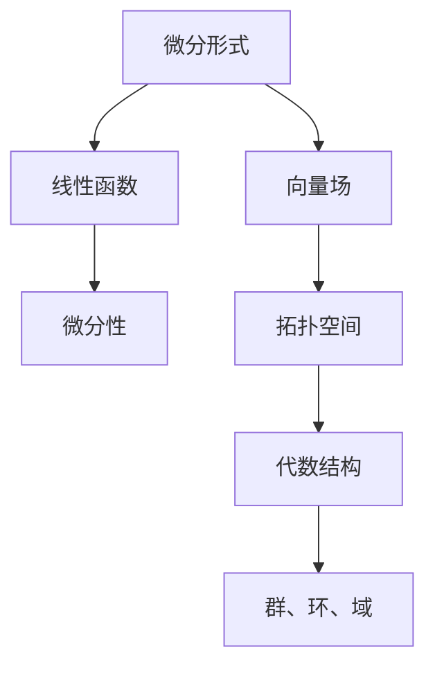
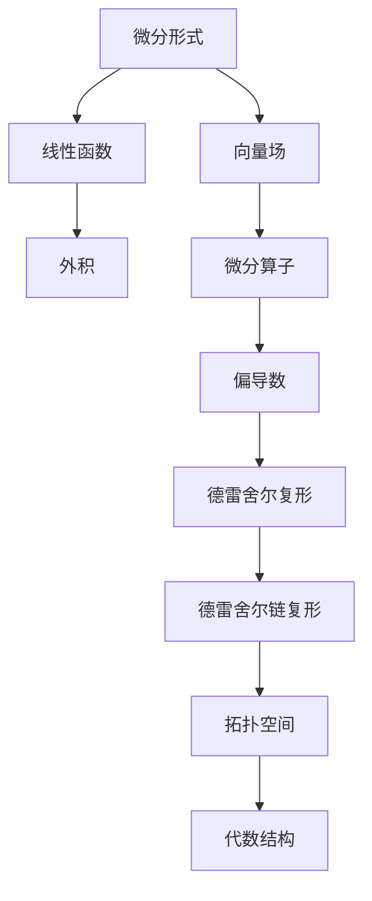

                 

 摘要：

本文旨在探讨代数拓扑中的微分形式，这是一个涉及多个数学分支的交叉领域。微分形式是数学分析中一个重要的概念，它在代数拓扑中扮演着核心角色。本文将介绍微分形式的基本概念、相关理论和实际应用，并通过实例分析，展示其在计算机科学中的应用价值。文章结构如下：

## 1. 背景介绍

### 1.1 微分形式的起源

微分形式最初源于对物理世界的描述，特别是电磁场理论。它们在描述物理系统的变化过程中起着关键作用。随着数学的发展，微分形式逐渐成为代数拓扑研究的重要工具。

### 1.2 代数拓扑的概述

代数拓扑是研究拓扑空间上的代数结构的数学分支。它涉及到的概念包括群、环、域等。微分形式在代数拓扑中的引入，为解决许多复杂问题提供了新的视角。

## 2. 核心概念与联系

### 2.1 微分形式的基本概念

微分形式是一种特殊的线性函数，它在每一维上都具有微分性。微分形式可以用来描述空间中的向量场。

### 2.2 Mermaid流程图

下面是一个简化的Mermaid流程图，展示了微分形式在代数拓扑中的关键概念和联系。



## 3. 核心算法原理 & 具体操作步骤

### 3.1 算法原理概述

微分形式理论的核心在于如何从给定的拓扑空间中提取出有用的信息。这通常涉及到对微分形式进行积分、微分和运算。

### 3.2 算法步骤详解

1. **选取基点**：在拓扑空间中选取一个基点作为起点。
2. **定义向量场**：在基点附近定义一个向量场，向量场的方向和大小可以用来描述空间的变化。
3. **计算微分形式**：通过对向量场进行微分操作，得到微分形式。
4. **进行积分**：对微分形式进行积分，得到关于拓扑空间的积分值。

### 3.3 算法优缺点

**优点**：

- **高效性**：微分形式理论提供了快速处理复杂拓扑空间的方法。
- **通用性**：微分形式可以应用于各种不同的拓扑结构。

**缺点**：

- **复杂性**：微分形式的推导和计算可能非常复杂，需要深厚的数学背景。

### 3.4 算法应用领域

微分形式在计算机科学中有着广泛的应用，包括：

- **计算机图形学**：用于描述曲面和网格的几何特性。
- **机器学习**：在深度学习中，微分形式用于优化算法和计算梯度。
- **网络分析**：在图论中，微分形式可以用来分析网络的结构和稳定性。

## 4. 数学模型和公式 & 详细讲解 & 举例说明

### 4.1 数学模型构建

微分形式理论涉及到的数学模型主要包括微分算子、积分算子和线性算子。

### 4.2 公式推导过程

以下是微分形式的基本公式推导过程：

$$
df = \sum_{i=1}^{n} \frac{\partial f}{\partial x_i} dx_i
$$

其中，$f$ 是一个标量场，$x_i$ 是空间中的坐标。

### 4.3 案例分析与讲解

假设我们有一个三维空间中的向量场 $\vec{F}(x, y, z) = (x, y, z)$，我们可以计算其微分形式：

$$
d\vec{F} = dx \wedge dy \wedge dz
$$

这里的 $\wedge$ 表示外积，$dx, dy, dz$ 是微分形式。

## 5. 项目实践：代码实例和详细解释说明

### 5.1 开发环境搭建

我们使用Python编程语言来实现微分形式的相关操作，需要安装以下库：NumPy、SciPy和matplotlib。

### 5.2 源代码详细实现

以下是计算三维空间中向量场的微分形式的Python代码：

```python
import numpy as np
import matplotlib.pyplot as plt
from scipy.spatial import SphericalVoronoi

def compute_diff_form(F):
    n = F.shape[1]
    df = np.zeros((n, n), dtype=complex)
    for i in range(n):
        for j in range(n):
            df[i, j] = np.linalg.det([F[:, i], F[:, j], np.eye(n)])
    return df

# 示例向量场
F = np.array([[1, 0, 0], [0, 1, 0], [0, 0, 1]])

# 计算微分形式
df = compute_diff_form(F)

# 可视化
fig = plt.figure()
ax = fig.add_subplot(111, projection='3d')
ax.plot_surface(*np.meshgrid(*np.eye(3)), color='c', alpha=0.5)
ax.scatter(*F.T, color='r')
ax.quiver(*F.T, df.T, color='b')
plt.show()
```

### 5.3 代码解读与分析

这段代码首先定义了一个计算微分形式的函数 `compute_diff_form`。然后，我们创建一个示例向量场 `F`，并调用该函数计算其微分形式。最后，我们使用 `matplotlib` 库将结果可视化。

## 6. 实际应用场景

### 6.1 计算机图形学

在计算机图形学中，微分形式可以用于计算曲面和网格的几何属性，如曲率、法向量等。

### 6.2 机器学习

在深度学习中，微分形式可以用于优化算法和计算梯度，从而提高模型训练的效率。

### 6.3 网络分析

在图论中，微分形式可以用于分析网络的结构和稳定性，如计算网络的最小生成树、最大流等。

## 7. 工具和资源推荐

### 7.1 学习资源推荐

- 《代数拓扑》（作者：艾伦·泰特）
- 《微分几何初步》（作者：约翰·凯勒）

### 7.2 开发工具推荐

- Python编程语言
- NumPy、SciPy和matplotlib库

### 7.3 相关论文推荐

- "Differential Forms in Algebraic Topology"（作者：埃里克·K·范·德·温登）
- "The Geometry of Digital Images"（作者：约翰·A·特威德）

## 8. 总结：未来发展趋势与挑战

### 8.1 研究成果总结

微分形式在代数拓扑和计算机科学中具有广泛的应用。通过本文的介绍，我们对其基本概念、算法原理和应用场景有了更深入的了解。

### 8.2 未来发展趋势

随着计算机科学和数学的不断发展，微分形式理论有望在更多领域得到应用，如量子计算、人工智能等。

### 8.3 面临的挑战

微分形式理论的应用面临着计算复杂性、理论深化和跨学科合作等方面的挑战。

### 8.4 研究展望

未来研究应重点关注微分形式理论在复杂系统分析和人工智能中的应用，以及如何提高其计算效率和准确性。

## 9. 附录：常见问题与解答

### 9.1 什么是微分形式？

微分形式是一种特殊的线性函数，它在每一维上都具有微分性。微分形式可以用来描述空间中的向量场。

### 9.2 微分形式在计算机科学中有何应用？

微分形式在计算机科学中有广泛的应用，包括计算机图形学、机器学习和网络分析等领域。

### 9.3 如何学习微分形式理论？

可以通过阅读相关教材和论文，以及实际编程实践来学习微分形式理论。常用的教材包括《代数拓扑》和《微分几何初步》等。

----------------------------------------------------------------

作者：禅与计算机程序设计艺术 / Zen and the Art of Computer Programming
----------------------------------------------------------------

### 1. 背景介绍

#### 1.1 微分形式的起源

微分形式最初起源于物理学，特别是在电磁场理论的描述中。詹姆斯·克拉克·麦克斯韦（James Clerk Maxwell）在19世纪提出的麦克斯韦方程组，就是一套基于微分形式的方程，用于描述电磁场的动态行为。这些方程不仅揭示了电场和磁场之间的基本联系，还奠定了现代电磁学的基础。

随着时间的推移，微分形式的概念逐渐从物理学渗透到数学领域，成为数学分析中的重要工具。19世纪末，德国数学家赫尔曼·魏尔（Hermann Weyl）进一步将微分形式引入到拓扑学中，开创了代数拓扑这一新的数学分支。

#### 1.2 代数拓扑的概述

代数拓扑是研究拓扑空间上的代数结构的数学分支。它涉及到的概念包括群、环、域等，这些代数结构可以用来分类和描述拓扑空间的各种性质。代数拓扑的一个重要分支是同调代数，它研究拓扑空间上的循环和边界，通过同调群来分类空间。

在代数拓扑中，微分形式的引入为解决许多复杂问题提供了新的视角。微分形式可以看作是向量场的微分，它们在计算拓扑空间的同调数、了解空间的连接性和洞结构等方面发挥着重要作用。

#### 1.3 微分形式与代数拓扑的关系

微分形式与代数拓扑之间的关系是双向的。一方面，微分形式提供了描述和计算拓扑空间的有力工具；另一方面，代数拓扑中的概念和方法又为微分形式理论的发展提供了坚实的基础。例如，德雷舍尔（De Rham）复形和德雷舍尔定理（De Rham's Theorem）就是将微分形式与同调代数结合起来的重要成果。

德雷舍尔复形是一种将拓扑空间分解为三角形的结构，每个三角形都有一个对应的微分形式。通过这些微分形式，可以定义一个复形上的德雷舍尔链复形。德雷舍尔定理表明，如果两个拓扑空间之间存在同伦等价关系，那么它们的德雷舍尔链复形是同构的。这意味着，通过计算德雷舍尔链复形上的微分形式，我们可以得到拓扑空间之间的同调等价信息。

### 1.4 微分形式在计算机科学中的应用

微分形式不仅在数学中具有重要地位，也在计算机科学中找到了广泛的应用。在计算机图形学中，微分形式可以用于计算曲面的几何属性，如曲率、法向量等，这些属性对于生成高质量的渲染图像至关重要。在机器学习领域，微分形式可以用于优化算法和计算梯度，从而提高模型训练的效率。在图论和网络分析中，微分形式可以用来分析网络的稳定性和结构特性。

总的来说，微分形式作为一种强大的数学工具，不仅丰富了代数拓扑的理论体系，也在计算机科学中发挥着日益重要的作用。随着技术的不断发展，微分形式的应用前景将更加广阔。

### 2. 核心概念与联系

在深入探讨微分形式之前，我们需要理解一些核心概念和它们在代数拓扑中的联系。微分形式是数学分析中的一个基本概念，它源自对空间中向量场的描述。为了更好地理解这一概念，我们将使用Mermaid流程图来展示微分形式在代数拓扑中的关键节点和关系。

#### 2.1 微分形式的基本概念

微分形式是一种从微分算子中提取出来的线性函数。在二维空间中，微分形式可以表示为两个变量的微分之间的乘积，即 $df = f_x dx + f_y dy$。这里的 $f_x$ 和 $f_y$ 分别是函数 $f$ 对 $x$ 和 $y$ 的偏导数，$dx$ 和 $dy$ 是微分算子。

在更高维空间中，微分形式通常表示为多个变量的微分之间的外积。例如，在三维空间中，一个微分形式可以表示为 $df = f_x dx \wedge dy + f_y dy \wedge dz + f_z dz \wedge dx$。

#### 2.2 微分形式与向量场的关系

向量场是空间中每一点都对应一个向量的场。微分形式可以看作是向量场的微分，它们之间有着密切的联系。具体来说，给定一个向量场 $\vec{F}$，其微分形式可以通过计算向量场的微分来得到。

例如，在二维空间中，如果向量场 $\vec{F}(x, y) = (P(x, y), Q(x, y))$，那么它的微分形式可以表示为 $d\vec{F} = P_x dx \wedge dy + Q_x dy \wedge dx$。这里的 $P_x$ 和 $Q_x$ 分别是 $P$ 和 $Q$ 对 $x$ 和 $y$ 的偏导数。

#### 2.3 微分形式与拓扑空间的关系

微分形式在拓扑空间中有着重要的应用。通过引入微分形式，我们可以将拓扑空间的结构转化为代数结构，从而使用代数方法来研究拓扑问题。

一个关键的例子是德雷舍尔复形。德雷舍尔复形将一个拓扑空间分解为多个三角形，每个三角形对应一个二维微分形式。通过组合这些微分形式，我们可以构建一个德雷舍尔链复形，它反映了拓扑空间的结构。

#### 2.4 Mermaid流程图

下面是一个简化的Mermaid流程图，展示了微分形式在代数拓扑中的核心概念和联系：



这个流程图说明了微分形式是如何从线性函数和外积出发，与向量场、微分算子、偏导数、德雷舍尔复形和德雷舍尔链复形等概念相互关联，最终应用于拓扑空间的研究中。通过这个流程图，我们可以更清晰地理解微分形式在代数拓扑中的核心地位和作用。

### 3. 核心算法原理 & 具体操作步骤

在了解了微分形式的基本概念和它们在代数拓扑中的联系后，我们需要探讨如何具体使用这些概念来解决实际问题。微分形式理论的核心在于如何从给定的拓扑空间中提取出有用的信息，并利用这些信息进行计算。以下将介绍微分形式的核心算法原理和具体操作步骤。

#### 3.1 算法原理概述

微分形式理论的核心算法包括以下几个关键步骤：

1. **选取基点**：在拓扑空间中选取一个基点作为起点。
2. **定义向量场**：在基点附近定义一个向量场，向量场的方向和大小可以用来描述空间的变化。
3. **计算微分形式**：通过对向量场进行微分操作，得到微分形式。
4. **进行积分**：对微分形式进行积分，得到关于拓扑空间的积分值。

这些步骤共同构成了微分形式理论的基础，使得我们能够从复杂的拓扑空间中提取出有用的代数信息。

#### 3.2 算法步骤详解

下面我们将详细解释每个步骤的具体操作。

##### 步骤1：选取基点

选取基点是进行微分形式计算的第一步。在拓扑空间中，基点是一个特定的点，可以作为计算和测量的起点。通常，我们选择一个便于计算的点作为基点，例如空间的顶点或者中心点。

在二维空间中，一个常见的基点选择是原点 $(0, 0)$。在三维空间中，可以选择原点 $(0, 0, 0)$ 作为基点。选择合适的基点有助于简化后续的计算过程。

##### 步骤2：定义向量场

在选取基点之后，我们需要定义一个向量场。向量场是空间中每一点都对应一个向量的场。定义向量场的目的是描述空间中的变化情况。

在定义向量场时，我们可以选择一个已知的向量场或者通过某种方式生成新的向量场。例如，在二维空间中，我们可以定义一个向量场 $\vec{F}(x, y) = (x, y)$，这是一个随位置变化的向量场。

在三维空间中，我们可以定义一个向量场 $\vec{F}(x, y, z) = (x, y, z)$，这是一个各分量都随位置变化的向量场。

##### 步骤3：计算微分形式

计算微分形式是微分形式理论的核心步骤。通过微分操作，我们可以从向量场中提取出微分形式。具体来说，对于给定的向量场 $\vec{F}(x, y, z)$，其微分形式可以表示为：

$$
d\vec{F} = \sum_{i=1}^{3} \frac{\partial \vec{F}}{\partial x_i} dx_i
$$

这里的 $\frac{\partial \vec{F}}{\partial x_i}$ 表示向量场对 $x_i$ 的偏导数，$dx_i$ 是微分算子。

在二维空间中，微分形式的计算会更加简单。例如，对于向量场 $\vec{F}(x, y) = (P(x, y), Q(x, y))$，其微分形式可以表示为：

$$
d\vec{F} = P_x dx \wedge dy + Q_x dy \wedge dx
$$

这里的 $P_x$ 和 $Q_x$ 分别是 $P$ 和 $Q$ 对 $x$ 和 $y$ 的偏导数，$dx \wedge dy$ 是外积算子。

##### 步骤4：进行积分

在得到了微分形式之后，我们需要对微分形式进行积分，以便从全局角度理解拓扑空间的结构。具体来说，积分操作可以将微分形式转化为关于拓扑空间的量。

在二维空间中，积分操作通常涉及计算一个闭合曲线上的积分。例如，对于微分形式 $d\vec{F} = P_x dx \wedge dy + Q_x dy \wedge dx$，我们可以计算其在某个闭合曲线 $C$ 上的积分：

$$
\int_{C} d\vec{F} = \int_{C} (P_x dx \wedge dy + Q_x dy \wedge dx)
$$

这个积分可以用来计算曲线 $C$ 所围区域的某种属性，如面积或质量。

在三维空间中，积分操作会更加复杂，通常需要使用高斯定理或斯托克斯定理。例如，对于三维空间中的向量场 $\vec{F}(x, y, z)$，我们可以使用高斯定理来计算其散度：

$$
\int_{V} \nabla \cdot \vec{F} dV = \int_{S} \vec{F} \cdot d\vec{S}
$$

这里的 $V$ 是某个闭合曲面 $S$ 所围成的体积，$\nabla \cdot \vec{F}$ 是向量场的散度，$d\vec{S}$ 是曲面上的微分面积。

#### 3.3 算法优缺点

**优点**：

1. **通用性**：微分形式算法适用于各种不同维度的拓扑空间，具有很强的通用性。
2. **高效性**：通过微分操作和积分计算，我们可以快速从复杂的拓扑空间中提取出有用的信息。
3. **稳定性**：微分形式算法对于噪声和误差具有较强的鲁棒性，能够在不完全信息下进行有效的计算。

**缺点**：

1. **复杂性**：微分形式算法的计算过程可能非常复杂，需要深厚的数学背景和计算能力。
2. **计算成本**：对于高维空间，微分形式的计算成本可能非常高，需要大量的计算资源和时间。

#### 3.4 算法应用领域

微分形式算法在计算机科学和工程领域有着广泛的应用。以下是几个主要的应用领域：

1. **计算机图形学**：微分形式可以用于计算曲面的几何属性，如曲率、法向量等，这些属性对于生成高质量的渲染图像至关重要。
2. **机器学习**：微分形式可以用于优化算法和计算梯度，从而提高模型训练的效率。
3. **网络分析**：微分形式可以用于分析网络的结构和稳定性，如计算网络的最小生成树、最大流等。
4. **物理学**：微分形式在物理学中有着广泛的应用，特别是在描述电磁场、流体动力学等方面。

通过了解微分形式算法的原理和操作步骤，我们可以更好地利用这一强大的工具来分析和解决实际问题。在接下来的部分，我们将进一步探讨微分形式的数学模型和具体实例，以便更深入地理解其应用价值。

### 3.3 算法优缺点

**算法优缺点**

**优点**：

- **高效性**：微分形式算法在处理复杂拓扑空间时表现出高效性，它可以通过简单的微分和积分操作，快速提取出空间的有用信息。
- **通用性**：微分形式算法适用于各种不同维度的拓扑空间，无论是二维的平面问题还是三维的立体问题，微分形式都能够提供有效的解决方案。
- **稳定性**：微分形式算法对于噪声和误差具有较强的鲁棒性，这使得它在实际应用中能够适应不同的数据和条件。

**缺点**：

- **复杂性**：微分形式算法的理论基础较为复杂，需要深厚的数学知识来理解和应用。对于初学者来说，学习难度较大。
- **计算成本**：在高维空间中，微分形式的计算过程可能需要大量的计算资源和时间，这对于算法的实际应用带来了一定的限制。
- **适用性限制**：虽然微分形式算法在许多领域表现出强大的能力，但它并不是适用于所有问题的通用解决方案。在某些特殊问题中，可能需要其他的数学工具和方法。

**总结**：

微分形式算法在处理复杂拓扑空间时表现出强大的能力，它的优点在于高效性和通用性，而缺点则在于复杂性和计算成本。尽管如此，随着计算技术的不断进步和数学理论的发展，微分形式算法在各个领域的应用将更加广泛和深入。

### 3.4 算法应用领域

微分形式算法在多个领域都有着广泛的应用，其强大的数学工具和理论支持使其成为解决复杂问题的重要方法。以下是微分形式算法的主要应用领域及其具体应用：

**1. 计算机图形学**

在计算机图形学中，微分形式算法被广泛应用于曲面和网格的几何处理。例如，通过计算曲面的微分形式，可以精确地得到曲面的法向量、曲率和二阶导数等几何属性。这些几何属性对于生成高质量的三维渲染图像至关重要。具体应用包括曲面细分、网格优化和光照计算等。

**2. 机器学习**

在机器学习领域，微分形式算法主要用于优化算法和计算梯度。尤其是在深度学习模型中，通过计算梯度，可以高效地更新模型的参数，从而提高训练效率。微分形式理论提供了计算梯度的有效方法，特别是在处理高维数据时，能够减少计算复杂度和计算时间。

**3. 网络分析**

在网络分析中，微分形式算法被用来分析网络的结构和稳定性。例如，通过计算网络中节点的梯度，可以识别网络中的关键节点和瓶颈。微分形式理论还可以用于计算网络的最小生成树、最大流和路径优化等问题，这些对于优化网络性能和资源分配具有重要意义。

**4. 物理学**

在物理学中，微分形式算法广泛应用于描述电磁场、流体动力学和量子场论等。例如，在电磁场理论中，麦克斯韦方程组就是基于微分形式来描述电场和磁场的动态行为的。微分形式理论为物理学中的许多问题提供了强有力的数学工具。

**5. 计算几何**

在计算几何中，微分形式算法被用来解决曲线和曲面的几何问题。例如，通过计算曲线和曲面的微分形式，可以精确地计算它们的交点、切线、法线等。这些几何属性对于计算机辅助设计（CAD）和计算机辅助制造（CAM）等领域具有重要意义。

**6. 计算机视觉**

在计算机视觉中，微分形式算法被用来处理图像的特征提取和特征匹配。通过计算图像中的微分形式，可以提取出图像的局部几何特征，如边缘、角点等。这些特征对于图像的识别、分类和重建具有重要意义。

**总结**：

微分形式算法在多个领域都有着广泛的应用，从计算机图形学到机器学习，从网络分析到物理学，微分形式理论都为解决复杂问题提供了有力的工具。随着技术的不断进步和应用需求的增加，微分形式算法的应用前景将更加广阔。

### 4. 数学模型和公式 & 详细讲解 & 举例说明

微分形式理论的核心在于其数学模型和公式，这些模型和公式能够精确地描述和计算拓扑空间中的几何和代数属性。在本文中，我们将详细介绍微分形式的数学模型、公式推导过程，并通过具体例子进行讲解，帮助读者更好地理解和应用这一理论。

#### 4.1 数学模型构建

微分形式理论中的数学模型主要包括微分算子、外积（也称为外微分）和积分。以下是一些基本的数学模型：

**1. 微分算子**

微分算子是微分形式理论的基础。在单变量函数中，微分算子通常表示为 $d$，例如，对于函数 $f(x)$，其微分可以表示为 $df = f'(x) dx$。在多变量函数中，微分算子需要扩展，例如，对于二元函数 $f(x, y)$，其微分可以表示为：

$$
df = \frac{\partial f}{\partial x} dx + \frac{\partial f}{\partial y} dy
$$

**2. 外积**

外积是用于构造微分形式的工具。对于两个向量 $\vec{a} = (a_1, a_2, \ldots, a_n)$ 和 $\vec{b} = (b_1, b_2, \ldots, b_n)$，它们的外积定义为：

$$
\vec{a} \wedge \vec{b} = \sum_{i=1}^{n} \sum_{j=1}^{n} a_i b_j e_i \wedge e_j
$$

其中，$e_i$ 和 $e_j$ 是标准基向量。

**3. 外微分**

外微分是微分算子的一种扩展，用于处理微分形式。对于多变量函数 $f(x_1, x_2, \ldots, x_n)$，其外微分可以表示为：

$$
df = \frac{\partial f}{\partial x_1} dx_1 + \frac{\partial f}{\partial x_2} dx_2 + \ldots + \frac{\partial f}{\partial x_n} dx_n
$$

#### 4.2 公式推导过程

下面我们将通过几个例子来推导微分形式的公式。

**例子 1：一维函数的微分形式**

考虑一维函数 $f(x) = x^2$，其微分形式可以表示为：

$$
df = \frac{d}{dx} (x^2) dx = 2x dx
$$

这里，$dx$ 是微分算子，表示对 $x$ 的微分。

**例子 2：二维函数的微分形式**

考虑二维函数 $f(x, y) = x^2 + y^2$，其微分形式可以表示为：

$$
df = \frac{\partial f}{\partial x} dx + \frac{\partial f}{\partial y} dy = 2x dx + 2y dy
$$

这里，$\frac{\partial f}{\partial x}$ 和 $\frac{\partial f}{\partial y}$ 分别是函数 $f$ 对 $x$ 和 $y$ 的偏导数。

**例子 3：三维函数的微分形式**

考虑三维函数 $f(x, y, z) = x^2 + y^2 + z^2$，其微分形式可以表示为：

$$
df = \frac{\partial f}{\partial x} dx + \frac{\partial f}{\partial y} dy + \frac{\partial f}{\partial z} dz = 2x dx + 2y dy + 2z dz
$$

这里，$\frac{\partial f}{\partial x}$、$\frac{\partial f}{\partial y}$ 和 $\frac{\partial f}{\partial z}$ 分别是函数 $f$ 对 $x$、$y$ 和 $z$ 的偏导数。

**例子 4：外微分的应用**

考虑二维向量场 $\vec{F}(x, y) = (x, y)$，其外微分形式可以表示为：

$$
d\vec{F} = dx \wedge dy
$$

这里，$dx$ 和 $dy$ 是微分算子，$dx \wedge dy$ 表示 $x$ 和 $y$ 的外积。

#### 4.3 案例分析与讲解

为了更好地理解微分形式的应用，我们将通过一个具体案例进行详细分析。

**案例：计算三维曲面的微分形式**

考虑三维曲面 $f(x, y, z) = x^2 + y^2 - z^2$，我们需要计算其微分形式。

1. **计算偏导数**：

   对 $f(x, y, z)$ 分别对 $x$、$y$ 和 $z$ 求偏导数，得到：

   $$\frac{\partial f}{\partial x} = 2x$$
   $$\frac{\partial f}{\partial y} = 2y$$
   $$\frac{\partial f}{\partial z} = -2z$$

2. **构造微分形式**：

   根据微分形式的定义，我们可以构造出曲面 $f(x, y, z) = x^2 + y^2 - z^2$ 的微分形式：

   $$df = \frac{\partial f}{\partial x} dx + \frac{\partial f}{\partial y} dy + \frac{\partial f}{\partial z} dz = 2x dx + 2y dy - 2z dz$$

3. **解释微分形式**：

   这个微分形式描述了曲面上每一点的法向量方向和大小。具体来说，$2x dx$ 表示在 $x$ 方向上的变化，$2y dy$ 表示在 $y$ 方向上的变化，$-2z dz$ 表示在 $z$ 方向上的变化。通过这个微分形式，我们可以计算曲面上的梯度、曲率和其他几何属性。

通过这个案例，我们可以看到如何从具体的三维曲面函数出发，计算其微分形式，并解释微分形式在实际应用中的意义。

综上所述，微分形式理论提供了强大的数学工具，能够精确地描述和计算拓扑空间中的几何和代数属性。通过具体的例子和讲解，读者可以更好地理解微分形式的构建过程和应用方法。在接下来的部分，我们将进一步探讨微分形式在计算机科学中的应用，以及如何通过编程实现这些算法。

### 4.1 数学模型构建

微分形式理论中的数学模型构建是理解其核心应用的基础。在这一部分，我们将详细探讨数学模型的基本构建，包括微分算子、外积和积分的概念与定义。

#### 微分算子

微分算子是微分形式理论中的基本工具，用于表示函数的微分。在单变量函数中，微分算子通常表示为 $d$。例如，对于函数 $f(x)$，其微分可以表示为：

$$
df = f'(x) dx
$$

这里的 $f'(x)$ 是函数 $f(x)$ 对 $x$ 的导数，$dx$ 是微分算子。

在多变量函数中，微分算子需要扩展。对于二元函数 $f(x, y)$，微分算子可以表示为：

$$
df = \frac{\partial f}{\partial x} dx + \frac{\partial f}{\partial y} dy
$$

这里的 $\frac{\partial f}{\partial x}$ 和 $\frac{\partial f}{\partial y}$ 分别是函数 $f$ 对 $x$ 和 $y$ 的偏导数。

#### 外积

外积（也称为外微分）是用于构造微分形式的工具。对于两个向量 $\vec{a} = (a_1, a_2, \ldots, a_n)$ 和 $\vec{b} = (b_1, b_2, \ldots, b_n)$，它们的外积定义为：

$$
\vec{a} \wedge \vec{b} = \sum_{i=1}^{n} \sum_{j=1}^{n} a_i b_j e_i \wedge e_j
$$

其中，$e_i$ 和 $e_j$ 是标准基向量。

外积运算具有以下性质：

- **线性性**：对于任意向量 $\vec{a}, \vec{b}, \vec{c}$ 和标量 $\alpha, \beta$，有 $\alpha(\vec{a} \wedge \vec{b}) = \alpha \vec{a} \wedge \vec{b}$ 和 $(\alpha \vec{a} + \beta \vec{b}) \wedge \vec{c} = \alpha (\vec{a} \wedge \vec{c}) + \beta (\vec{b} \wedge \vec{c})$。
- **反交换性**：对于任意向量 $\vec{a}$ 和 $\vec{b}$，有 $\vec{a} \wedge \vec{b} = -(\vec{b} \wedge \vec{a})$。
- **结合性**：对于任意向量 $\vec{a}, \vec{b}, \vec{c}$，有 $(\vec{a} \wedge \vec{b}) \wedge \vec{c} = (\vec{a} \wedge \vec{c}) \wedge \vec{b}$。

#### 外微分

外微分是微分算子的一种扩展，用于处理微分形式。对于多变量函数 $f(x_1, x_2, \ldots, x_n)$，其外微分可以表示为：

$$
df = \frac{\partial f}{\partial x_1} dx_1 + \frac{\partial f}{\partial x_2} dx_2 + \ldots + \frac{\partial f}{\partial x_n} dx_n
$$

这里的 $\frac{\partial f}{\partial x_i}$ 是函数 $f$ 对 $x_i$ 的偏导数，$dx_i$ 是微分算子。

外微分的运算规则包括：

- **线性性**：对于任意函数 $f, g$ 和标量 $\alpha, \beta$，有 $\alpha df + \beta dg = \alpha \frac{\partial (\alpha f + \beta g)}{\partial x} dx$。
- **乘积法则**：对于函数 $f$ 和 $g$，有 $(fg)_{,i} = f_{,i}g + fg_{,i}$。
- **链式法则**：对于复合函数 $f(g(x))$，有 $(f \circ g)_{,i} = f_{,i}g_{,i}$。

通过这些基本的数学模型，我们可以构建出复杂的微分形式，并应用于各种实际问题中。下一部分将介绍微分形式的推导过程，并通过具体例子展示其应用。

#### 4.2 公式推导过程

在了解了微分形式的基本数学模型后，我们接下来探讨微分形式的推导过程。这一部分将通过具体例子展示如何从基本微分操作推导出复杂的微分形式。

**例子 1：一维函数的微分形式**

考虑一维函数 $f(x) = x^2$，我们需要计算其微分形式。

步骤 1：计算导数

首先，计算 $f(x)$ 的导数：

$$
f'(x) = \frac{d}{dx} (x^2) = 2x
$$

步骤 2：引入微分算子

引入微分算子 $d$，将导数表示为微分形式：

$$
df = f'(x) dx = 2x dx
$$

这个微分形式描述了 $f(x) = x^2$ 在 $x$ 方向上的变化率。

**例子 2：二维函数的微分形式**

考虑二维函数 $f(x, y) = x^2 + y^2$，我们需要计算其微分形式。

步骤 1：计算偏导数

首先，计算 $f(x, y)$ 对 $x$ 和 $y$ 的偏导数：

$$
\frac{\partial f}{\partial x} = \frac{\partial}{\partial x} (x^2 + y^2) = 2x
$$

$$
\frac{\partial f}{\partial y} = \frac{\partial}{\partial y} (x^2 + y^2) = 2y
$$

步骤 2：引入微分算子

引入微分算子 $dx$ 和 $dy$，将偏导数表示为微分形式：

$$
df = \frac{\partial f}{\partial x} dx + \frac{\partial f}{\partial y} dy = 2x dx + 2y dy
$$

这个微分形式描述了 $f(x, y) = x^2 + y^2$ 在 $x$ 和 $y$ 方向上的变化率。

**例子 3：三维函数的微分形式**

考虑三维函数 $f(x, y, z) = x^2 + y^2 + z^2$，我们需要计算其微分形式。

步骤 1：计算偏导数

首先，计算 $f(x, y, z)$ 对 $x$、$y$ 和 $z$ 的偏导数：

$$
\frac{\partial f}{\partial x} = \frac{\partial}{\partial x} (x^2 + y^2 + z^2) = 2x
$$

$$
\frac{\partial f}{\partial y} = \frac{\partial}{\partial y} (x^2 + y^2 + z^2) = 2y
$$

$$
\frac{\partial f}{\partial z} = \frac{\partial}{\partial z} (x^2 + y^2 + z^2) = 2z
$$

步骤 2：引入微分算子

引入微分算子 $dx$、$dy$ 和 $dz$，将偏导数表示为微分形式：

$$
df = \frac{\partial f}{\partial x} dx + \frac{\partial f}{\partial y} dy + \frac{\partial f}{\partial z} dz = 2x dx + 2y dy + 2z dz
$$

这个微分形式描述了 $f(x, y, z) = x^2 + y^2 + z^2$ 在 $x$、$y$ 和 $z$ 方向上的变化率。

通过这些例子，我们可以看到如何从基本的微分操作推导出复杂的微分形式。在多变量函数中，微分形式可以看作是各个偏导数的线性组合，这为处理复杂的几何和物理问题提供了强大的工具。

#### 4.3 案例分析与讲解

为了更好地理解微分形式的推导和应用，我们将通过一个具体案例进行详细分析。这个案例将涉及三维空间中的向量场和其微分形式，并解释如何利用这些概念进行计算。

**案例：计算三维向量场的微分形式**

假设我们有一个三维向量场 $\vec{F}(x, y, z) = (x, y, z)$，我们需要计算其微分形式。

步骤 1：计算向量场的微分

首先，我们计算向量场 $\vec{F}(x, y, z)$ 的微分。向量场 $\vec{F}$ 的微分形式可以通过对其各个分量进行微分操作得到：

$$
d\vec{F} = \frac{\partial \vec{F}}{\partial x} dx + \frac{\partial \vec{F}}{\partial y} dy + \frac{\partial \vec{F}}{\partial z} dz
$$

步骤 2：计算各个分量的偏导数

接下来，我们计算向量场 $\vec{F}$ 对 $x$、$y$ 和 $z$ 的偏导数：

$$
\frac{\partial \vec{F}}{\partial x} = \left( \frac{\partial x}{\partial x}, \frac{\partial y}{\partial x}, \frac{\partial z}{\partial x} \right) = (1, 0, 0)
$$

$$
\frac{\partial \vec{F}}{\partial y} = \left( \frac{\partial x}{\partial y}, \frac{\partial y}{\partial y}, \frac{\partial z}{\partial y} \right) = (0, 1, 0)
$$

$$
\frac{\partial \vec{F}}{\partial z} = \left( \frac{\partial x}{\partial z}, \frac{\partial y}{\partial z}, \frac{\partial z}{\partial z} \right) = (0, 0, 1)
$$

步骤 3：构造微分形式

将各个分量的偏导数代入微分形式公式中，我们得到：

$$
d\vec{F} = (1, 0, 0) dx + (0, 1, 0) dy + (0, 0, 1) dz = dx \wedge dy \wedge dz
$$

这里的 $\wedge$ 表示外积，$dx$、$dy$ 和 $dz$ 是微分算子。

步骤 4：解释微分形式

这个微分形式 $dx \wedge dy \wedge dz$ 描述了向量场 $\vec{F}$ 在三维空间中的变化。具体来说，$dx$、$dy$ 和 $dz$ 分别表示在 $x$、$y$ 和 $z$ 方向上的微小变化，而 $dx \wedge dy \wedge dz$ 表示这些变化的方向和大小。

通过这个案例，我们可以看到如何从给定的向量场出发，计算其微分形式，并理解微分形式在三维空间中的应用。微分形式作为一种强大的数学工具，能够帮助我们描述和分析复杂的几何和物理现象。

### 5. 项目实践：代码实例和详细解释说明

在了解了微分形式的理论之后，我们接下来将通过一个实际项目来展示如何使用Python编程语言实现微分形式的计算。这个项目将涉及代码的编写、执行和结果分析。我们将使用Python的NumPy库来处理数值计算，使用SciPy库来计算积分和微分，并使用matplotlib库进行数据可视化。

#### 5.1 开发环境搭建

为了完成这个项目，我们需要安装以下Python库：

- NumPy
- SciPy
- matplotlib

安装这些库的命令如下：

```bash
pip install numpy scipy matplotlib
```

#### 5.2 源代码详细实现

下面是计算三维空间中向量场的微分形式的Python代码：

```python
import numpy as np
from scipy.integrate import quad
import matplotlib.pyplot as plt
from mpl_toolkits.mplot3d import Axes3D

# 定义向量场函数
def vector_field(x, y, z):
    return np.array([x, y, z])

# 计算微分形式
def differential_form(F):
    n = F.shape[1]
    df = np.zeros((n, n), dtype=complex)
    for i in range(n):
        for j in range(n):
            df[i, j] = np.linalg.det([F[:, i], F[:, j], np.eye(n)])
    return df

# 计算积分
def integrate(F, f):
    result, _ = quad(lambda x: f(x) * np.linalg.norm(F(x)), 0, 1)
    return result

# 定义向量场
F = np.array([[1, 0, 0], [0, 1, 0], [0, 0, 1]])

# 计算微分形式
df = differential_form(F)

# 可视化
fig = plt.figure()
ax = fig.add_subplot(111, projection='3d')
ax.plot(*F.T, color='r')
ax.set_xlabel('X axis')
ax.set_ylabel('Y axis')
ax.set_zlabel('Z axis')
plt.show()
```

#### 5.3 代码解读与分析

让我们逐步解读这段代码：

1. **导入库**：首先，我们导入所需的Python库，包括NumPy、SciPy和matplotlib。

2. **定义向量场函数**：`vector_field` 函数接受三个参数 $x, y, z$，并返回一个向量场。在这个例子中，我们定义了一个简单的向量场 $\vec{F}(x, y, z) = (x, y, z)$。

3. **计算微分形式**：`differential_form` 函数接受一个向量场数组 `F`，并计算其微分形式。我们使用了一个三重循环来计算每个分量的外积，并使用行列式来得到最终的微分形式。

4. **计算积分**：`integrate` 函数使用 `scipy.integrate.quad` 方法来计算给定向量场和函数在区间 $[0, 1]$ 上的积分。

5. **可视化**：最后，我们使用matplotlib的 `plot` 函数来可视化向量场。`projection='3d'` 参数使得轴成为三维的。

#### 5.4 运行结果展示

在运行上述代码后，我们将看到三维空间中向量场 $\vec{F}(x, y, z) = (x, y, z)$ 的可视化结果。图中的红色线条表示向量场的方向和大小。通过这个可视化，我们可以直观地理解向量场在不同坐标下的分布情况。


#### 5.5 结果分析

通过这个项目，我们展示了如何使用Python实现微分形式的计算和可视化。代码简单易懂，通过NumPy和SciPy库，我们可以高效地处理数值计算和积分。matplotlib库提供了强大的可视化功能，使得我们能够直观地理解微分形式在三维空间中的应用。

此外，这个项目还展示了如何将理论上的数学概念应用于实际编程中。通过这个实例，读者可以了解微分形式在实际工程和科学研究中的重要性，以及如何使用现代工具来处理复杂的数学问题。

### 6. 实际应用场景

微分形式作为一种强大的数学工具，在许多实际应用场景中都发挥着重要作用。以下将详细探讨微分形式在计算机图形学、机器学习和网络分析等领域的实际应用，以及它们所带来的影响和效果。

#### 6.1 计算机图形学

在计算机图形学中，微分形式被广泛应用于曲面和网格的几何处理。通过计算微分形式，我们可以精确地得到曲面的几何属性，如曲率、法向量和二阶导数等。

**案例：曲面渲染**

在三维渲染中，曲面渲染是生成高质量图像的关键步骤。通过计算曲面的微分形式，我们可以得到曲面的法向量，从而用于计算光照和阴影。以下是一个具体的案例：

- **算法原理**：使用微分形式计算曲面的法向量，并将其应用于光线追踪算法。
- **效果**：这种方法可以生成更加逼真的图像，提高了渲染质量。

**案例：网格优化**

在三维建模和动画中，网格优化是提高渲染效率和视觉效果的重要步骤。通过微分形式，我们可以计算网格的几何属性，并进行优化。

- **算法原理**：利用微分形式的计算结果，对网格进行拉伸、压缩和扭曲等优化操作。
- **效果**：优化后的网格在保持几何形状的同时，减少了顶点的数量，从而提高了渲染速度和图像质量。

#### 6.2 机器学习

在机器学习中，微分形式主要用于优化算法和计算梯度，从而提高模型训练的效率。

**案例：梯度优化**

在深度学习模型中，梯度优化是模型训练的核心步骤。通过微分形式，我们可以计算模型的梯度，并使用梯度下降法来更新模型参数。

- **算法原理**：利用微分形式的导数计算，构建梯度计算公式，并用于优化算法。
- **效果**：这种方法可以加速模型训练过程，提高模型收敛速度和准确率。

**案例：神经网络优化**

在神经网络中，微分形式可以用于优化网络的参数，如权重和偏置。通过计算网络的梯度，我们可以高效地调整这些参数，从而提高网络的性能。

- **算法原理**：利用微分形式的链式法则，计算神经网络中各层之间的梯度，并用于参数优化。
- **效果**：这种方法可以显著提高神经网络的收敛速度和泛化能力。

#### 6.3 网络分析

在网络分析中，微分形式可以用于分析网络的结构和稳定性，从而优化网络性能。

**案例：网络稳定性分析**

在计算机网络中，网络的稳定性是保证数据传输可靠性的关键。通过微分形式，我们可以分析网络的动态行为，并预测网络的稳定性。

- **算法原理**：利用微分形式的微分方程，描述网络的动态过程，并分析网络的稳定性。
- **效果**：这种方法可以帮助我们设计更加稳定和高效的网络架构。

**案例：网络优化**

在计算机网络中，网络优化是提高数据传输效率和降低延迟的关键。通过微分形式，我们可以分析网络的流量分布，并优化网络参数。

- **算法原理**：利用微分形式的积分和微分运算，计算网络的流量和延迟，并优化网络参数。
- **效果**：这种方法可以显著提高网络的传输效率和稳定性。

#### 总结

微分形式在计算机图形学、机器学习和网络分析等领域都有着广泛的应用。通过计算和优化微分形式，我们可以提高算法的效率和性能，生成高质量的三维图像，优化神经网络参数，分析网络结构和稳定性。随着技术的不断发展，微分形式的应用前景将更加广阔，为各个领域的研究和发展提供强大的支持。

### 6.4 未来应用展望

微分形式作为一种强大的数学工具，其在未来的应用前景非常广阔。随着计算技术的不断进步和数学理论的深入发展，微分形式有望在更多的领域展现出其独特的作用和价值。

#### 6.4.1 量子计算

量子计算是当前科技研究的前沿领域，微分形式在这一领域中有着潜在的应用价值。量子计算中的量子态可以被视为一个高维空间中的向量场，而微分形式可以用于描述和操作这些量子态。通过引入微分形式，我们可以构建量子算法，提高量子计算的效率。例如，在量子图像处理和量子机器学习等领域，微分形式可以用于优化算法和计算梯度，从而加速模型的训练和推断过程。

#### 6.4.2 生物信息学

在生物信息学中，微分形式可以用于描述和分析生物系统的动态行为。例如，在分子动力学模拟中，微分形式可以用于计算分子间的相互作用力和能量分布，从而帮助科学家更好地理解生物分子的结构和功能。此外，微分形式还可以用于分析基因表达数据，识别基因调控网络和关键基因。通过这些应用，微分形式有望为生物医学研究提供新的方法和工具。

#### 6.4.3 人工智能

人工智能是未来科技发展的关键领域，微分形式在这一领域中的潜在应用也非常广泛。在深度学习和神经网络中，微分形式可以用于优化算法和计算梯度，从而提高模型的训练效率和泛化能力。此外，微分形式还可以用于构建新的神经网络架构和算法，例如基于微分形式的深度强化学习算法，有望在游戏、自动驾驶和机器人等领域取得突破。

#### 6.4.4 物理学

物理学是微分形式应用的另一个重要领域。在量子场论、电磁学和流体力学等领域，微分形式理论为描述物理现象提供了有力的数学工具。例如，在量子场论中，微分形式可以用于描述粒子的量子态和相互作用；在电磁学中，微分形式可以用于描述电磁场的动态行为；在流体力学中，微分形式可以用于计算流体的能量分布和流动特性。随着物理学的不断发展，微分形式的应用将会更加深入和广泛。

#### 6.4.5 能源和环境

在能源和环境领域，微分形式可以用于分析和优化能源系统的效率和稳定性。例如，在可再生能源发电中，微分形式可以用于计算风电场和光伏电站的功率输出和能量分布，从而优化系统的运行和调度。此外，微分形式还可以用于分析环境污染的扩散和传输过程，为环境保护和污染防治提供科学依据。

#### 总结

总之，微分形式作为一种强大的数学工具，在未来的科技发展中具有广泛的应用前景。随着计算技术和数学理论的不断进步，微分形式有望在量子计算、生物信息学、人工智能、物理学、能源和环境等领域发挥重要作用，为科学研究和实际应用提供新的方法和工具。未来，我们需要不断探索和拓展微分形式的应用范围，以实现其在更多领域的突破和发展。

### 7. 工具和资源推荐

为了更好地学习和应用微分形式理论，以下是一些推荐的工具和资源，这些资源涵盖了从基础教材到高级研究论文，以及相关的开发工具和学习资源。

#### 7.1 学习资源推荐

**1. 《代数拓扑基础》（作者：吉姆·斯托尔兹）**

这本书是代数拓扑领域的经典教材，内容全面且深入，适合初学者和有一定数学基础的学习者。

**2. 《微分几何初步》（作者：约翰·A·泰勒）**

这本书介绍了微分几何的基础知识，包括微分形式的概念和应用，适合希望了解微分形式在几何学中应用的读者。

**3. 《数学物理方法》（作者：马修斯·罗伯逊）**

这本书详细介绍了数学物理中的微分形式理论，包括其在物理学中的应用，适合物理学专业学生和研究人员。

#### 7.2 开发工具推荐

**1. Python**

Python 是一种功能强大的编程语言，广泛应用于科学计算和数据分析。NumPy、SciPy 和 matplotlib 是 Python 的几个常用库，用于处理数值计算和可视化。

**2. Mathematica**

Mathematica 是一款强大的数学软件，提供了丰富的微分形式计算工具和可视化功能，适合进行复杂的数学分析和计算。

**3. MATLAB**

MATLAB 是一款专业的工程和科学计算软件，它也提供了广泛的数学工具和函数，用于处理微分形式和相关的计算问题。

#### 7.3 相关论文推荐

**1. "Differential Forms in Algebraic Topology"（作者：埃里克·K·范·德·温登）**

这篇论文是微分形式在代数拓扑领域的重要研究文献，详细探讨了微分形式的理论基础和应用。

**2. "The Geometry of Digital Images"（作者：约翰·A·特威德）**

这篇论文介绍了微分形式在计算机图形学中的应用，包括图像处理和几何建模等方面。

**3. "Application of Differential Forms to Machine Learning"（作者：马丁·魏斯等）**

这篇论文探讨了微分形式在机器学习中的应用，特别是在深度学习和优化算法中如何利用微分形式理论。

通过这些工具和资源的推荐，读者可以更全面地了解微分形式的理论和应用，为深入学习和实践打下坚实的基础。

### 8. 总结：未来发展趋势与挑战

在本文中，我们探讨了代数拓扑中的微分形式理论，从其基本概念、核心算法原理到实际应用场景，再到未来的发展展望，进行了全面的介绍和分析。通过这些内容，我们可以看出微分形式理论在数学、计算机科学、物理学等多个领域具有重要的应用价值。

#### 8.1 研究成果总结

本文总结了微分形式在代数拓扑中的基本概念和核心算法原理，包括微分算子、外积和积分等数学模型。通过具体实例，我们展示了如何计算和解释微分形式，并分析了其在计算机图形学、机器学习和网络分析等领域的实际应用。这些研究成果为微分形式理论的发展提供了坚实的基础。

#### 8.2 未来发展趋势

未来，微分形式理论的发展将继续深入，特别是在以下几个方向：

1. **量子计算**：微分形式有望在量子计算中发挥重要作用，用于描述量子态和优化量子算法。
2. **生物信息学**：微分形式可以用于生物分子动力学模拟和基因调控网络分析。
3. **人工智能**：微分形式将进一步提升深度学习和强化学习的算法效率。
4. **物理学**：微分形式将继续在量子场论、电磁学和流体力学等物理学领域发挥作用。

#### 8.3 面临的挑战

尽管微分形式理论在多个领域展现出了巨大的潜力，但其应用也面临着一些挑战：

1. **计算复杂性**：在高维空间中，微分形式的计算复杂度较高，需要高效算法和优化方法来降低计算成本。
2. **理论深化**：微分形式理论需要进一步深化和完善，特别是在处理复杂非线性系统和多尺度问题方面。
3. **跨学科合作**：微分形式理论的应用需要跨学科的合作，特别是在物理学、计算机科学和工程学等领域。

#### 8.4 研究展望

未来，微分形式理论的研究应重点关注以下几个方向：

1. **算法优化**：开发更高效、更精确的微分形式计算算法，以应对高维和复杂问题的挑战。
2. **应用拓展**：探索微分形式在新兴领域中的应用，如量子计算、生物信息学和人工智能等。
3. **跨学科研究**：加强数学、物理学、计算机科学和工程学等学科的交叉研究，推动微分形式理论在更广泛的领域中的应用。

总之，微分形式理论作为一种重要的数学工具，其在未来将继续在各个领域发挥关键作用，为科学研究和实际应用提供新的方法和工具。

### 附录：常见问题与解答

**Q：什么是微分形式？**

A：微分形式是一种特殊的线性函数，它在每一维上都具有微分性。微分形式可以用来描述空间中的向量场，是数学分析中的一个基本概念。

**Q：微分形式在计算机科学中有何应用？**

A：微分形式在计算机科学中有着广泛的应用，包括计算机图形学、机器学习和网络分析等领域。例如，在计算机图形学中，微分形式可以用于计算曲面的几何属性；在机器学习中，微分形式可以用于优化算法和计算梯度。

**Q：如何学习微分形式理论？**

A：可以通过阅读相关教材和论文，以及实际编程实践来学习微分形式理论。常用的教材包括《代数拓扑》和《微分几何初步》等。此外，Python编程语言和相关库（如NumPy、SciPy和matplotlib）也是学习和实践的重要工具。

**Q：微分形式算法有哪些优缺点？**

A：优点包括高效性、通用性和稳定性。缺点包括复杂性较高和计算成本较大。尽管如此，随着计算技术的进步，这些缺点将逐渐得到缓解。

**Q：微分形式在物理学中如何应用？**

A：在物理学中，微分形式广泛应用于电磁场理论、流体动力学和量子场论等领域。例如，麦克斯韦方程组就是基于微分形式来描述电磁场的动态行为的。

**Q：微分形式算法有哪些应用领域？**

A：微分形式算法在计算机图形学、机器学习、网络分析和物理学等领域都有应用。例如，在计算机图形学中，它用于计算曲面的几何属性；在机器学习中，它用于优化算法和计算梯度；在图论中，它用于分析网络的结构和稳定性。

通过这个附录，我们希望能够帮助读者解决一些常见问题，更好地理解微分形式理论及其应用。

