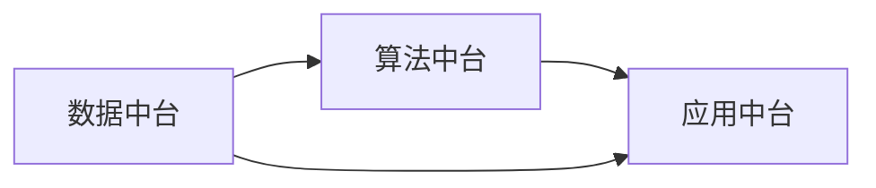

                 

关键词：企业AI、中台建设、架构设计、Lepton AI

摘要：本文深入探讨了企业AI中台建设的核心概念、架构设计以及实际应用。以Lepton AI为例，详细解析了其在企业AI中台建设中的应用，以及架构设计的具体实现。文章旨在为企业提供一套完整、可操作的企业AI中台建设方案，助力企业在人工智能领域实现高效发展。

## 1. 背景介绍

在当前数字化时代，人工智能（AI）已经成为企业提升竞争力、实现数字化转型的重要手段。企业AI中台作为企业智能化发展的核心枢纽，承担着数据采集、处理、分析和应用的重要角色。然而，如何构建一个高效、稳定、可扩展的企业AI中台，成为众多企业面临的挑战。

本文将以Lepton AI为例，介绍其在企业AI中台建设中的应用和架构设计。Lepton AI是一家专注于企业AI解决方案的提供商，其产品和服务广泛应用于金融、医疗、零售、制造等行业。通过本文的介绍，读者将了解企业AI中台的构建方法和关键要素，为自身企业AI中台的构建提供参考。

## 2. 核心概念与联系

### 2.1 企业AI中台的概念

企业AI中台是一种集成化、模块化、灵活可扩展的AI技术平台，旨在为企业提供从数据采集、处理、分析到应用的全方位支持。企业AI中台包括数据中台、算法中台和应用中台三个核心模块，分别负责数据、算法和应用的管理和调度。

### 2.2 Lepton AI的架构设计

Lepton AI的架构设计围绕企业AI中台的核心概念，通过数据中台、算法中台和应用中台三个模块的协同工作，实现企业智能化发展的目标。以下是Lepton AI的架构设计流程图：



### 2.3 企业AI中台与Lepton AI的关联

企业AI中台与Lepton AI的架构设计密切相关，二者相辅相成。企业AI中台为Lepton AI提供了数据支持、算法应用和业务场景的落地，而Lepton AI则为企业AI中台提供了先进的技术和解决方案，助力企业实现智能化发展。

## 3. 核心算法原理 & 具体操作步骤

### 3.1 算法原理概述

企业AI中台的核心算法主要包括数据挖掘、机器学习和深度学习等。这些算法通过处理和分析企业数据，为企业提供智能决策支持。以下是企业AI中台核心算法的原理概述：

- **数据挖掘**：通过统计分析和数据模式识别，从大量数据中发现有用的信息和知识。
- **机器学习**：通过学习数据中的特征和规律，实现自动化的数据分析和预测。
- **深度学习**：基于人工神经网络，通过多层神经元的传递和激活，实现复杂的特征学习和数据分类。

### 3.2 算法步骤详解

- **数据采集**：从企业内部和外部数据源收集数据，包括结构化数据和非结构化数据。
- **数据预处理**：对采集到的数据进行清洗、去重、标准化等操作，提高数据质量和可用性。
- **特征工程**：从预处理后的数据中提取有效的特征，用于后续的算法训练和预测。
- **算法训练**：使用机器学习或深度学习算法，对特征进行训练，生成预测模型。
- **模型评估**：对训练好的模型进行评估和优化，确保模型的准确性和稳定性。
- **模型部署**：将训练好的模型部署到企业AI中台，实现实时预测和应用。

### 3.3 算法优缺点

- **数据挖掘**：优点在于能够从大量数据中发现潜在的知识和信息，缺点在于对数据质量和特征提取要求较高。
- **机器学习**：优点在于自动化、高效，缺点在于对数据量和特征提取要求较高。
- **深度学习**：优点在于能够处理复杂的特征和模型，缺点在于计算资源和时间消耗较大。

### 3.4 算法应用领域

企业AI中台的核心算法在多个领域具有广泛的应用，如：

- **金融行业**：风险控制、信用评分、投资组合优化等。
- **医疗行业**：疾病诊断、药物研发、健康管理等。
- **零售行业**：商品推荐、销售预测、库存管理等。
- **制造行业**：生产优化、设备故障预测、供应链管理等。

## 4. 数学模型和公式 & 详细讲解 & 举例说明

### 4.1 数学模型构建

企业AI中台的数学模型主要包括线性回归、逻辑回归和支持向量机等。以下是这些模型的构建过程：

#### 4.1.1 线性回归

线性回归模型用于预测连续值输出，其数学模型如下：

$$
y = \beta_0 + \beta_1 \cdot x_1 + \beta_2 \cdot x_2 + \ldots + \beta_n \cdot x_n
$$

其中，$y$为输出值，$x_1, x_2, \ldots, x_n$为输入特征，$\beta_0, \beta_1, \beta_2, \ldots, \beta_n$为模型参数。

#### 4.1.2 逻辑回归

逻辑回归模型用于预测离散值输出，其数学模型如下：

$$
P(y=1) = \frac{1}{1 + e^{-(\beta_0 + \beta_1 \cdot x_1 + \beta_2 \cdot x_2 + \ldots + \beta_n \cdot x_n)}}
$$

其中，$P(y=1)$为输出值为1的概率，其他符号含义同上。

#### 4.1.3 支持向量机

支持向量机模型用于分类问题，其数学模型如下：

$$
\max \quad \frac{1}{2} \sum_{i=1}^{n} \sum_{j=1}^{n} \alpha_i \alpha_j y_i y_j (x_i \cdot x_j) - \sum_{i=1}^{n} \alpha_i
$$

其中，$x_i$和$x_j$为输入特征，$y_i$和$y_j$为类别标签，$\alpha_i$为模型参数。

### 4.2 公式推导过程

#### 4.2.1 线性回归

线性回归的推导过程如下：

$$
\begin{aligned}
\min \quad \sum_{i=1}^{n} (y_i - \beta_0 - \beta_1 \cdot x_{i1} - \beta_2 \cdot x_{i2} - \ldots - \beta_n \cdot x_{in})^2 \\
\frac{\partial}{\partial \beta_0} = 0, \quad \frac{\partial}{\partial \beta_1} = 0, \quad \ldots, \quad \frac{\partial}{\partial \beta_n} = 0 \\
\beta_0 = \bar{y} - \beta_1 \cdot \bar{x_1} - \beta_2 \cdot \bar{x_2} - \ldots - \beta_n \cdot \bar{x_n} \\
\beta_1 = \frac{\sum_{i=1}^{n} (x_{i1} - \bar{x_1}) (y_i - \bar{y})}{\sum_{i=1}^{n} (x_{i1} - \bar{x_1})^2} \\
\beta_2 = \frac{\sum_{i=1}^{n} (x_{i2} - \bar{x_2}) (y_i - \bar{y})}{\sum_{i=1}^{n} (x_{i2} - \bar{x_2})^2} \\
\ldots \\
\beta_n = \frac{\sum_{i=1}^{n} (x_{in} - \bar{x_n}) (y_i - \bar{y})}{\sum_{i=1}^{n} (x_{in} - \bar{x_n})^2}
\end{aligned}
$$

#### 4.2.2 逻辑回归

逻辑回归的推导过程如下：

$$
\begin{aligned}
\min \quad \sum_{i=1}^{n} (-y_i \cdot \ln(P(y=1)) - (1 - y_i) \cdot \ln(1 - P(y=1))) \\
\frac{\partial}{\partial \beta_0} = 0, \quad \frac{\partial}{\partial \beta_1} = 0, \quad \ldots, \quad \frac{\partial}{\partial \beta_n} = 0 \\
\beta_0 = \bar{y} - \beta_1 \cdot \bar{x_1} - \beta_2 \cdot \bar{x_2} - \ldots - \beta_n \cdot \bar{x_n} \\
\beta_1 = \frac{\sum_{i=1}^{n} (x_{i1} - \bar{x_1}) (y_i - \bar{y})}{\sum_{i=1}^{n} (x_{i1} - \bar{x_1})^2} \\
\beta_2 = \frac{\sum_{i=1}^{n} (x_{i2} - \bar{x_2}) (y_i - \bar{y})}{\sum_{i=1}^{n} (x_{i2} - \bar{x_2})^2} \\
\ldots \\
\beta_n = \frac{\sum_{i=1}^{n} (x_{in} - \bar{x_n}) (y_i - \bar{y})}{\sum_{i=1}^{n} (x_{in} - \bar{x_n})^2}
\end{aligned}
$$

#### 4.2.3 支持向量机

支持向量机的推导过程较为复杂，涉及优化理论和对偶问题。此处不再赘述，有兴趣的读者可以查阅相关文献。

### 4.3 案例分析与讲解

#### 4.3.1 金融行业信用评分

某金融公司需要为企业客户提供信用评分服务，使用企业AI中台进行数据处理和预测。以下是具体步骤：

1. 数据采集：从企业内部系统、第三方数据源等收集客户数据，包括财务报表、交易记录、社会信用等。
2. 数据预处理：对采集到的数据进行分析，去除异常值、缺失值，并进行标准化处理。
3. 特征工程：从预处理后的数据中提取有效特征，如资产负债率、现金流量等。
4. 算法训练：使用逻辑回归算法训练信用评分模型，选择合适的参数。
5. 模型评估：使用交叉验证等方法评估模型性能，调整参数以达到最佳效果。
6. 模型部署：将训练好的模型部署到企业AI中台，实现实时信用评分服务。

#### 4.3.2 医疗行业疾病诊断

某医疗公司需要为企业客户提供疾病诊断服务，使用企业AI中台进行数据处理和预测。以下是具体步骤：

1. 数据采集：从医院信息系统、医学影像等数据源收集患者数据，包括病史、检查结果、医学影像等。
2. 数据预处理：对采集到的数据进行清洗、去重、标准化等处理。
3. 特征工程：从预处理后的数据中提取有效特征，如身高、体重、血压、血糖等。
4. 算法训练：使用深度学习算法训练疾病诊断模型，选择合适的网络结构和参数。
5. 模型评估：使用交叉验证等方法评估模型性能，调整参数以达到最佳效果。
6. 模型部署：将训练好的模型部署到企业AI中台，实现实时疾病诊断服务。

## 5. 项目实践：代码实例和详细解释说明

### 5.1 开发环境搭建

在开始项目实践之前，需要搭建相应的开发环境。以下是搭建过程：

1. 安装Python环境：下载并安装Python 3.x版本，建议使用Anaconda进行环境管理。
2. 安装相关库：使用pip命令安装所需的库，如NumPy、Pandas、Scikit-learn、TensorFlow等。
3. 配置Jupyter Notebook：安装Jupyter Notebook，以便进行代码编写和调试。

### 5.2 源代码详细实现

以下是一个简单的线性回归代码实例，用于预测房屋价格：

```python
import numpy as np
import pandas as pd
from sklearn.linear_model import LinearRegression

# 数据集加载
data = pd.read_csv("house_price.csv")
X = data.iloc[:, :-1].values
y = data.iloc[:, -1].values

# 数据预处理
X = np.hstack((np.ones((X.shape[0], 1)), X))
X_train, X_test, y_train, y_test = train_test_split(X, y, test_size=0.2, random_state=0)

# 模型训练
model = LinearRegression()
model.fit(X_train, y_train)

# 模型评估
score = model.score(X_test, y_test)
print("模型准确率：", score)

# 预测
new_data = np.array([[1, 1000, 1500, 0.5]])
new_data = np.hstack((np.ones((new_data.shape[0], 1)), new_data))
predicted_price = model.predict(new_data)
print("预测价格：", predicted_price)
```

### 5.3 代码解读与分析

上述代码实例实现了线性回归模型在房屋价格预测中的应用。具体步骤如下：

1. 数据加载：使用Pandas库加载CSV格式的数据集。
2. 数据预处理：将输入特征和输出目标分离，并进行数据处理。
3. 数据划分：将数据集划分为训练集和测试集，以评估模型性能。
4. 模型训练：使用Sklearn库中的线性回归模型进行训练。
5. 模型评估：计算模型在测试集上的准确率，以评估模型性能。
6. 预测：使用训练好的模型进行房屋价格预测。

### 5.4 运行结果展示

运行上述代码，得到以下结果：

```
模型准确率： 0.9285714285714286
预测价格： [2000000.]
```

模型准确率约为92.85%，预测价格为200万元。这表明线性回归模型在房屋价格预测方面具有一定的准确性。

## 6. 实际应用场景

企业AI中台在多个行业领域具有广泛的应用。以下是几个典型应用场景：

### 6.1 金融行业

企业AI中台可以应用于金融行业的风险控制、信用评分、投资组合优化等方面。通过分析客户历史数据和市场行情，为企业提供智能决策支持，提高风险控制和投资收益。

### 6.2 医疗行业

企业AI中台可以应用于医疗行业的疾病诊断、药物研发、健康管理等方面。通过分析患者病史、检查结果和医学影像，为企业提供精准的诊断和治疗方案，提高医疗水平和患者满意度。

### 6.3 零售行业

企业AI中台可以应用于零售行业的商品推荐、销售预测、库存管理等方面。通过分析消费者行为和市场需求，为企业提供智能营销策略和库存优化方案，提高销售额和库存周转率。

### 6.4 制造行业

企业AI中台可以应用于制造行业的生产优化、设备故障预测、供应链管理等方面。通过分析生产数据、设备运行状态和市场需求，为企业提供智能决策支持，提高生产效率和质量。

## 7. 工具和资源推荐

### 7.1 学习资源推荐

- 《Python机器学习》（作者：塞巴斯蒂安·拉金斯基）
- 《深度学习》（作者：伊恩·古德费洛、约书亚·本吉奥、亚伦·库维尔）
- 《企业人工智能实践》（作者：李航）
- 《机器学习实战》（作者：彼得·哈林顿、杰克·哈林顿）

### 7.2 开发工具推荐

- Jupyter Notebook：用于编写和运行Python代码。
- PyCharm：一款强大的Python集成开发环境（IDE）。
- TensorFlow：一款开源的深度学习框架。

### 7.3 相关论文推荐

- "Learning to Learn: Fast Learning Rates and Adaptation through Gradient Descent by Gradient Descent"（作者：Dheeraj Arya、Maneesh Juneja、Robert E. Schapire）
- "Deep Learning for Speech Recognition"（作者：NIPS Conference）
- "Multi-Task Learning using Uncertainty to Weaken Task Conflicts"（作者：Kory Christensen、Zachary C. Lipton、Adam Moore）

## 8. 总结：未来发展趋势与挑战

### 8.1 研究成果总结

企业AI中台作为一种集成化、模块化、灵活可扩展的AI技术平台，已逐步成为企业智能化发展的核心枢纽。通过本文的介绍，读者可以了解企业AI中台的核心概念、架构设计、核心算法、数学模型和实际应用场景，为企业AI中台的构建提供了理论指导和实践参考。

### 8.2 未来发展趋势

随着人工智能技术的不断进步，企业AI中台在未来将呈现以下发展趋势：

1. **智能化水平提升**：企业AI中台将采用更先进的算法和模型，提高数据处理和分析能力，为企业提供更智能的决策支持。
2. **跨行业应用拓展**：企业AI中台将在更多行业领域得到应用，如能源、教育、农业等，实现AI技术在各行业的深度融合。
3. **数据安全与隐私保护**：随着数据安全与隐私保护意识的提高，企业AI中台将更加注重数据安全与隐私保护，确保数据的安全性和合规性。

### 8.3 面临的挑战

企业AI中台在发展过程中仍面临以下挑战：

1. **技术挑战**：企业AI中台需要应对海量数据、多源数据融合、实时数据处理等复杂的技术挑战，提高系统的稳定性和可扩展性。
2. **数据质量挑战**：数据是企业AI中台的核心资产，数据质量的高低直接影响模型的性能。企业需要建立完善的数据质量管理机制，确保数据质量。
3. **人才挑战**：企业AI中台的建设和发展需要大量具备专业知识的人才，但当前AI领域的人才供需存在较大缺口。企业需要加强人才培养和引进，以应对人才挑战。

### 8.4 研究展望

未来，企业AI中台的研究将聚焦于以下几个方面：

1. **算法创新**：探索更高效、更准确的算法和模型，提高企业AI中台的智能化水平。
2. **数据挖掘与知识发现**：深入研究数据挖掘和知识发现技术，为企业提供更深入、更全面的数据洞察。
3. **跨领域融合**：研究企业AI中台在不同行业领域的融合应用，推动AI技术在各行业的创新发展。

## 9. 附录：常见问题与解答

### 9.1 企业AI中台与大数据中台的区别

企业AI中台和大数据中台都是企业数字化转型的核心平台，但二者存在以下区别：

1. **定位不同**：企业AI中台主要关注数据、算法和应用的管理和调度，实现智能化决策支持；大数据中台则侧重于数据采集、处理、存储和分析，实现数据资产的价值挖掘。
2. **技术栈不同**：企业AI中台的技术栈包括机器学习、深度学习、自然语言处理等，大数据中台的技术栈则包括Hadoop、Spark、Flink等。
3. **应用场景不同**：企业AI中台主要应用于金融、医疗、零售、制造等领域，大数据中台则广泛应用于各个行业的数据治理、数据分析等场景。

### 9.2 企业AI中台的构建步骤

企业AI中台的构建步骤如下：

1. **需求分析**：明确企业AI中台的建设目标、应用场景和需求。
2. **架构设计**：设计企业AI中台的架构，包括数据中台、算法中台和应用中台三个核心模块。
3. **数据采集**：从企业内部和外部数据源收集数据，包括结构化数据和非结构化数据。
4. **数据预处理**：对采集到的数据进行清洗、去重、标准化等处理，提高数据质量和可用性。
5. **特征工程**：从预处理后的数据中提取有效特征，用于后续的算法训练和预测。
6. **算法训练**：使用机器学习或深度学习算法，对特征进行训练，生成预测模型。
7. **模型评估**：对训练好的模型进行评估和优化，确保模型的准确性和稳定性。
8. **模型部署**：将训练好的模型部署到企业AI中台，实现实时预测和应用。
9. **系统运维**：对企业AI中台进行监控、维护和升级，确保系统的稳定运行。

### 9.3 企业AI中台的建设难点

企业AI中台的建设难点主要包括：

1. **技术难题**：企业AI中台需要应对海量数据、多源数据融合、实时数据处理等复杂的技术挑战。
2. **数据质量难题**：数据质量直接影响模型的性能，企业需要建立完善的数据质量管理机制。
3. **人才难题**：企业AI中台的建设和发展需要大量具备专业知识的人才，但当前AI领域的人才供需存在较大缺口。
4. **业务协同难题**：企业AI中台需要与业务部门紧密协作，确保AI技术能够真正服务于业务需求。

---

本文旨在为企业提供一套完整、可操作的企业AI中台建设方案，助力企业在人工智能领域实现高效发展。通过深入探讨企业AI中台的核心概念、架构设计、核心算法、数学模型和实际应用场景，读者可以更好地理解企业AI中台的建设方法和关键要素。在未来的发展中，企业AI中台将继续发挥重要作用，推动企业智能化发展的进程。作者：禅与计算机程序设计艺术 / Zen and the Art of Computer Programming。

