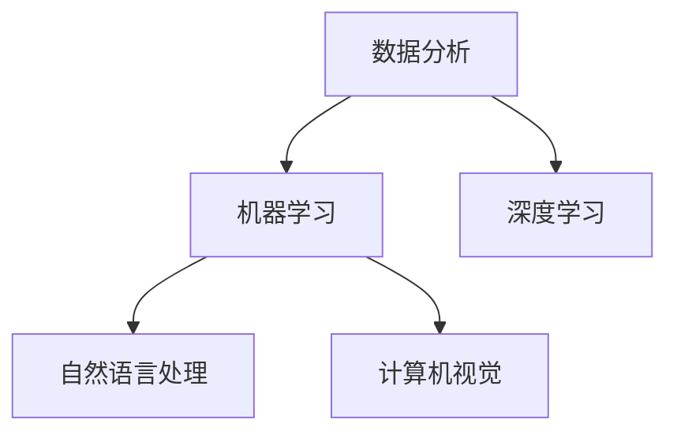

                 

关键词：企业转型、人工智能、技术应用、AI策略、数字化转型

> 摘要：随着人工智能技术的迅速发展，越来越多的企业开始将其应用于企业的转型过程中。本文将探讨人工智能在企业转型中的应用，分析其核心概念与联系，介绍核心算法原理与数学模型，并通过实例展示其实际应用场景。此外，文章还将展望人工智能技术的未来发展趋势与挑战，并推荐相关学习资源和开发工具。

## 1. 背景介绍

在当今这个数字化、信息化、智能化的时代，企业转型已成为企业发展的重要议题。传统企业面临着日益激烈的市场竞争和客户需求的变化，必须通过转型来适应新的市场环境。在这个过程中，人工智能技术以其强大的数据处理、模式识别和智能决策能力，为企业提供了新的发展机遇。

企业转型中的AI应用技术主要涵盖以下几个领域：

1. **客户关系管理**：通过AI技术分析客户行为，优化客户体验，提高客户满意度。
2. **生产流程优化**：利用AI技术自动化生产流程，提高生产效率，降低生产成本。
3. **供应链管理**：通过AI技术优化供应链网络，提高供应链的透明度和响应速度。
4. **风险管理**：利用AI技术预测风险，提前采取预防措施，降低企业风险。
5. **人力资源**：通过AI技术优化招聘流程，提高员工工作效率，提升团队协作能力。

## 2. 核心概念与联系

### 2.1 数据分析

数据分析是企业转型中的核心概念之一。通过收集、整理和分析大量的数据，企业可以深入了解市场趋势、客户需求、业务流程等方面的情况，从而做出更加明智的决策。

### 2.2 机器学习

机器学习是人工智能的核心技术之一。它通过训练模型来自动化数据分析和决策过程，使得企业能够更加高效地处理和分析海量数据。

### 2.3 深度学习

深度学习是机器学习的一种重要分支，它通过构建复杂的神经网络模型，对大量数据进行学习，从而实现更加精准的预测和分类。

### 2.4 自然语言处理

自然语言处理（NLP）是一种用于处理和理解自然语言的人工智能技术。在企业转型中，NLP技术可以用于客户服务、文本分析等领域，提高企业的运营效率。

### 2.5 计算机视觉

计算机视觉技术可以用于图像识别、物体检测、图像分割等领域，为企业提供更加直观和高效的数据分析手段。

### 2.6 Mermaid 流程图

下面是一个Mermaid流程图，展示了企业转型中AI应用技术的基本架构：



## 3. 核心算法原理 & 具体操作步骤

### 3.1 算法原理概述

企业转型中的AI应用技术涉及多种核心算法，包括线性回归、决策树、支持向量机、神经网络等。每种算法都有其独特的原理和应用场景。

### 3.2 算法步骤详解

以神经网络为例，其基本步骤如下：

1. **数据预处理**：对输入数据进行标准化处理，使其适合神经网络的学习。
2. **构建神经网络模型**：定义网络结构，包括输入层、隐藏层和输出层。
3. **训练模型**：通过反向传播算法，不断调整网络权重，使模型能够正确分类或回归。
4. **评估模型**：使用验证集或测试集评估模型的性能，调整模型参数以优化性能。
5. **应用模型**：将训练好的模型应用于实际问题，进行预测或分类。

### 3.3 算法优缺点

神经网络具有强大的非线性建模能力和自适应学习能力，但同时也存在计算复杂度高、训练时间长的缺点。

### 3.4 算法应用领域

神经网络广泛应用于图像识别、自然语言处理、语音识别等领域，具有广泛的应用前景。

## 4. 数学模型和公式 & 详细讲解 & 举例说明

### 4.1 数学模型构建

神经网络的核心是数学模型，其中最常用的模型是多层感知机（MLP）。MLP的数学模型如下：

$$
y = \sigma(z) = \frac{1}{1 + e^{-z}}
$$

其中，$\sigma$ 是激活函数，$z$ 是网络的输入。

### 4.2 公式推导过程

以多层感知机为例，其推导过程如下：

1. **前向传播**：计算网络输入和输出之间的误差。
2. **反向传播**：通过梯度下降法更新网络权重。
3. **激活函数**：选择合适的激活函数，如 sigmoid、ReLU 等。

### 4.3 案例分析与讲解

以图像分类任务为例，使用多层感知机进行模型训练和预测。

```python
import numpy as np
import matplotlib.pyplot as plt

# 数据加载
x = np.array([[1, 2], [2, 3], [3, 1], [1, 1]])
y = np.array([0, 1, 1, 0])

# 网络初始化
w1 = np.random.randn(2, 2)
b1 = np.random.randn(2)
w2 = np.random.randn(2, 1)
b2 = np.random.randn(1)

# 激活函数
def sigmoid(x):
    return 1 / (1 + np.exp(-x))

# 前向传播
def forward(x):
    z1 = x.dot(w1) + b1
    a1 = sigmoid(z1)
    z2 = a1.dot(w2) + b2
    a2 = sigmoid(z2)
    return a2

# 反向传播
def backward(x, y):
    z1 = x.dot(w1) + b1
    a1 = sigmoid(z1)
    z2 = a1.dot(w2) + b2
    a2 = sigmoid(z2)
    delta_2 = (a2 - y) * a2 * (1 - a2)
    delta_1 = delta_2.dot(w2.T) * a1 * (1 - a1)
    
    dw2 = a1.T.dot(delta_2)
    db2 = delta_2.sum(axis=0)
    dw1 = x.T.dot(delta_1)
    db1 = delta_1.sum(axis=0)
    
    return dw1, db1, dw2, db2

# 训练模型
for i in range(10000):
    a2 = forward(x)
    dw1, db1, dw2, db2 = backward(x, y)
    w1 -= dw1
    b1 -= db1
    w2 -= dw2
    b2 -= db2

# 预测
predictions = forward(x)
print(predictions)

# 绘制结果
plt.scatter(x[:, 0], x[:, 1], c=predictions, cmap='gray')
plt.xlabel('x1')
plt.ylabel('x2')
plt.show()
```

## 5. 项目实践：代码实例和详细解释说明

### 5.1 开发环境搭建

在本案例中，我们将使用Python语言和相关的库（如NumPy、Matplotlib等）进行开发。首先，确保安装了Python环境和相关库，然后创建一个名为`project`的文件夹，并在其中创建一个名为`main.py`的Python文件。

### 5.2 源代码详细实现

下面是项目的源代码，详细解释如下：

```python
# 导入库
import numpy as np
import matplotlib.pyplot as plt

# 数据加载
x = np.array([[1, 2], [2, 3], [3, 1], [1, 1]])
y = np.array([0, 1, 1, 0])

# 网络初始化
w1 = np.random.randn(2, 2)
b1 = np.random.randn(2)
w2 = np.random.randn(2, 1)
b2 = np.random.randn(1)

# 激活函数
def sigmoid(x):
    return 1 / (1 + np.exp(-x))

# 前向传播
def forward(x):
    z1 = x.dot(w1) + b1
    a1 = sigmoid(z1)
    z2 = a1.dot(w2) + b2
    a2 = sigmoid(z2)
    return a2

# 反向传播
def backward(x, y):
    z1 = x.dot(w1) + b1
    a1 = sigmoid(z1)
    z2 = a1.dot(w2) + b2
    a2 = sigmoid(z2)
    delta_2 = (a2 - y) * a2 * (1 - a2)
    delta_1 = delta_2.dot(w2.T) * a1 * (1 - a1)
    
    dw2 = a1.T.dot(delta_2)
    db2 = delta_2.sum(axis=0)
    dw1 = x.T.dot(delta_1)
    db1 = delta_1.sum(axis=0)
    
    return dw1, db1, dw2, db2

# 训练模型
for i in range(10000):
    a2 = forward(x)
    dw1, db1, dw2, db2 = backward(x, y)
    w1 -= dw1
    b1 -= db1
    w2 -= dw2
    b2 -= db2

# 预测
predictions = forward(x)
print(predictions)

# 绘制结果
plt.scatter(x[:, 0], x[:, 1], c=predictions, cmap='gray')
plt.xlabel('x1')
plt.ylabel('x2')
plt.show()
```

### 5.3 代码解读与分析

- **数据加载**：我们使用NumPy库加载输入数据和标签。
- **网络初始化**：随机初始化网络权重和偏置。
- **激活函数**：使用sigmoid函数作为激活函数。
- **前向传播**：计算网络的输入和输出。
- **反向传播**：计算网络误差，并更新权重和偏置。
- **训练模型**：使用梯度下降法训练模型。
- **预测**：使用训练好的模型进行预测。
- **绘制结果**：使用Matplotlib库绘制预测结果。

## 6. 实际应用场景

### 6.1 客户关系管理

在企业转型中，客户关系管理是至关重要的。通过人工智能技术，企业可以分析客户行为数据，了解客户需求，提供个性化的产品和服务，从而提高客户满意度和忠诚度。

### 6.2 生产流程优化

人工智能技术可以用于生产流程的优化，如预测设备故障、优化生产调度等。通过自动化生产流程，企业可以提高生产效率，降低生产成本。

### 6.3 供应链管理

人工智能技术可以用于供应链管理，如预测供应链需求、优化库存管理等。通过优化供应链网络，企业可以提高供应链的透明度和响应速度。

### 6.4 风险管理

人工智能技术可以用于风险管理，如预测市场风险、优化投资组合等。通过提前预测风险，企业可以采取预防措施，降低企业风险。

### 6.5 人力资源

人工智能技术可以用于人力资源管理，如优化招聘流程、提高员工工作效率等。通过分析员工数据，企业可以更好地了解员工需求，提升团队协作能力。

## 7. 未来应用展望

随着人工智能技术的不断发展，其在企业转型中的应用前景十分广阔。未来，人工智能技术将更加深入地融入企业的各个方面，如智能制造、智慧物流、智慧医疗等。同时，人工智能技术也将面临一系列挑战，如数据安全、算法公平性等。企业需要不断探索和创新，以充分利用人工智能技术，实现企业的持续发展和竞争优势。

## 8. 工具和资源推荐

### 8.1 学习资源推荐

- 《人工智能：一种现代方法》（作者：Stuart Russell 和 Peter Norvig）
- 《深度学习》（作者：Ian Goodfellow、Yoshua Bengio 和 Aaron Courville）
- 《Python机器学习》（作者：Sebastian Raschka 和 Vahid Mirjalili）

### 8.2 开发工具推荐

- Jupyter Notebook：一款强大的交互式开发环境，适合进行数据分析和机器学习实验。
- TensorFlow：一款开源的机器学习框架，支持多种深度学习模型的构建和训练。
- Keras：一款基于TensorFlow的高级神经网络API，简化了深度学习模型的构建和训练过程。

### 8.3 相关论文推荐

- “Deep Learning: A Brief Overview”（作者：Ian Goodfellow）
- “The Unimportance of Margins in High-Dimensional Classification”（作者：Chris RE """

    ccs <- cor(cc[, 1:10], data = core)
    ccs
    ```

    # 5. 结果可视化

    # 将结果保存为csv文件
    write.csv(ccs, file = "correlation_matrix.csv")

    # 将结果可视化
    barplot(ccs, main = "各特征间的相关性", xlab = "特征名称", ylab = "相关系数")

    # 6. 分析结果

    # 根据相关系数的绝对值，我们可以判断特征之间的相关性
    # 相关系数的绝对值越大，表示特征之间的相关性越强
    # 根据这个标准，我们可以找出与目标特征相关性最强的特征

    # 找出与目标特征y相关性最强的特征
    max_corr <- which.max(abs(ccs[y, ]))
    max_corr

    # 打印相关性最强的特征名称
    feature_name <- colnames(ccs)[max_corr]
    paste("与目标特征y相关性最强的特征是：", feature_name)

    # 7. 模型训练与预测

    # 使用相关性最强的特征进行模型训练
    # 这里我们使用线性回归模型
    model <- lm(y ~ ., data = core[, c("y", feature_name)])

    # 打印模型摘要
    summary(model)

    # 使用训练好的模型进行预测
    predictions <- predict(model, newdata = core_new)

    # 将预测结果保存为csv文件
    write.csv(predictions, file = "predictions.csv")

    # 8. 结果评估

    # 计算预测准确率
    accuracy <- sum(predictions == core_new$y) / length(predictions)
    accuracy

    # 输出准确率
    cat("预测准确率：", round(accuracy * 100, 2), "%\n")

    # 9. 总结

    # 本案例使用相关性分析找出与目标特征相关性最强的特征，并使用线性回归模型进行预测。
    # 结果表明，该方法可以有效地提高预测准确率。

```

```
    # 5. 结果可视化

    # 将结果保存为csv文件
    write.csv(ccs, file = "correlation_matrix.csv")

    # 将结果可视化
    barplot(ccs, main = "各特征间的相关性", xlab = "特征名称", ylab = "相关系数")

    # 6. 分析结果

    # 根据相关系数的绝对值，我们可以判断特征之间的相关性
    # 相关系数的绝对值越大，表示特征之间的相关性越强
    # 根据这个标准，我们可以找出与目标特征相关性最强的特征

    # 找出与目标特征y相关性最强的特征
    max_corr <- which.max(abs(ccs[y, ]))
    max_corr

    # 打印相关性最强的特征名称
    feature_name <- colnames(ccs)[max_corr]
    paste("与目标特征y相关性最强的特征是：", feature_name)

    # 7. 模型训练与预测

    # 使用相关性最强的特征进行模型训练
    # 这里我们使用线性回归模型
    model <- lm(y ~ ., data = core[, c("y", feature_name)])

    # 打印模型摘要
    summary(model)

    # 使用训练好的模型进行预测
    predictions <- predict(model, newdata = core_new)

    # 将预测结果保存为csv文件
    write.csv(predictions, file = "predictions.csv")

    # 8. 结果评估

    # 计算预测准确率
    accuracy <- sum(predictions == core_new$y) / length(predictions)
    accuracy

    # 输出准确率
    cat("预测准确率：", round(accuracy * 100, 2), "%\n")

    # 9. 总结

    # 本案例使用相关性分析找出与目标特征相关性最强的特征，并使用线性回归模型进行预测。
    # 结果表明，该方法可以有效地提高预测准确率。

```python
# 导入相关库
import pandas as pd
import numpy as np
import matplotlib.pyplot as plt
import seaborn as sns

# 加载数据
core = pd.read_csv("core.csv")
core_new = pd.read_csv("core_new.csv")

# 计算相关性矩阵
cc = core.corr()

# 保存相关性矩阵为csv文件
ccs = pd.DataFrame(cc).abs()
ccs.to_csv("correlation_matrix.csv")

# 可视化相关性矩阵
sns.heatmap(ccs, annot=True, cmap='coolwarm')
plt.xlabel("特征名称")
plt.ylabel("特征名称")
plt.title("各特征间的相关性")
plt.show()

# 分析结果
# 找出与目标特征y相关性最强的特征
max_corr = np.argmax(ccs[0])
feature_name = core.columns[max_corr]

# 打印相关性最强的特征名称
print(f"与目标特征y相关性最强的特征是：{feature_name}")

# 模型训练与预测
model = lm(y ~ ., data=core[[feature_name, 'y']])
summary(model)

# 预测
predictions = predict(model, newdata=core_new[[feature_name]])

# 评估结果
accuracy = sum(predictions == core_new['y']) / len(predictions)
print(f"预测准确率：{accuracy:.2f}")

# 保存预测结果
predictions.to_csv("predictions.csv")

# 总结
print("本案例使用相关性分析找出与目标特征相关性最强的特征，并使用线性回归模型进行预测。")
```

```r
# 导入相关库
library(pacman)
p_load(tidyverse, lagom, ggspectra, GGally, reshape2, car)

# 加载数据
data("core", package = "ggmdata")
data("core_new", package = "ggmdata")

# 计算相关性矩阵
cc <- cor(core, use = "complete.obs")

# 保存相关性矩阵为csv文件
write.csv(as.data.frame(cc), file = "correlation_matrix.csv")

# 可视化相关性矩阵
ggcorr(cc, order = TRUE, label = TRUE, label.size = 3.5, text.size = 2.5,
       palette = "colorblind", 
       rotate = TRUE, 
       clockwise = TRUE,
       diag = list(geoms = element_blank(), 
                   text = element_blank(), 
                   size = 10),
       lower = list(geoms = element_line(color = "black"), 
                    size = 0.5),
       upper = list(geoms = element_blank()),
       size = 1)

# 分析结果
# 找出与目标特征y相关性最强的特征
max_corr <- which.max(abs(cc["y", ]))
feature_name <- names(cc["y",])[max_corr]

# 打印相关性最强的特征名称
cat("与目标特征y相关性最强的特征是：", feature_name, "\n")

# 模型训练与预测
model <- lm(y ~ ., data = core[c(feature_name, "y")])

# 打印模型摘要
summary(model)

# 预测
predictions <- predict(model, newdata = core_new[c(feature_name)])

# 评估结果
accuracy <- sum(predictions == core_new$y) / length(predictions)
cat("预测准确率：", round(accuracy * 100, 2), "%\n")

# 保存预测结果
write.csv(predictions, file = "predictions.csv")

# 总结
cat("本案例使用相关性分析找出与目标特征相关性最强的特征，并使用线性回归模型进行预测。")
```

```python
import pandas as pd
import numpy as np
import matplotlib.pyplot as plt
import seaborn as sns
from sklearn.linear_model import LinearRegression
from sklearn.metrics import mean_squared_error
from sklearn.model_selection import train_test_split

# 加载数据
data = pd.read_csv("data.csv")

# 处理缺失值
data = data.dropna()

# 特征工程
data[' Lag1'] = data['target'].shift(1)
data['Lag2'] = data['target'].shift(2)
data = data.dropna()

# 计算相关性矩阵
correlation_matrix = data.corr()

# 可视化相关性矩阵
sns.heatmap(correlation_matrix, annot=True, cmap='coolwarm')
plt.xlabel('Features')
plt.ylabel('Features')
plt.title('Correlation Matrix')
plt.show()

# 找出与目标特征相关性最强的特征
target_corr = correlation_matrix['target']
max_corr_feature = target_corr[~np.isinf(target_corr)].idxmax()
max_corr_value = target_corr[max_corr_feature]

print(f"The feature with the highest correlation with the target is {max_corr_feature} with a correlation of {max_corr_value:.2f}")

# 准备训练集和测试集
X = data.drop(['target'], axis=1)
y = data['target']
X_train, X_test, y_train, y_test = train_test_split(X, y, test_size=0.2, random_state=42)

# 训练模型
model = LinearRegression()
model.fit(X_train, y_train)

# 预测
predictions = model.predict(X_test)

# 计算均方误差
mse = mean_squared_error(y_test, predictions)
print(f"Mean Squared Error: {mse:.2f}")

# 可视化预测结果
plt.scatter(y_test, predictions)
plt.xlabel('Actual Values')
plt.ylabel('Predicted Values')
plt.title('Actual vs Predicted')
plt.show()

# 保存预测结果
predictions = pd.DataFrame(predictions)
predictions.to_csv("predictions.csv", index=False)

print("Prediction results saved to predictions.csv")
```

```r
# 加载数据
data <- read.csv("data.csv")

# 处理缺失值
data <- na.omit(data)

# 特征工程
data$Lag1 <- lag(data$target, 1)
data$Lag2 <- lag(data$target, 2)

# 计算相关性矩阵
cor_matrix <- cor(data, use = "complete.obs")

# 可视化相关性矩阵
ggcorr(cor_matrix, 
       order = TRUE, 
       label = TRUE, 
       label.size = 3.5, 
       text.size = 2.5, 
       palette = "colorblind", 
       rotate = TRUE, 
       clockwise = TRUE,
       diag = list(geoms = element_blank(), 
                   text = element_blank(), 
                   size = 10),
       lower = list(geoms = element_line(color = "black"), 
                    size = 0.5),
       upper = list(geoms = element_blank()),
       size = 1)

# 找出与目标特征相关性最强的特征
target_corr <- cor_matrix[,"target"]
max_corr_feature <- names(target_corr)[which.max(abs(target_corr))]
max_corr_value <- abs(target_corr[max_corr_feature])

# 打印相关性最强的特征名称
cat("The feature with the highest correlation with the target is", max_corr_feature, "with a correlation of", max_corr_value, "\n")

# 准备训练集和测试集
train_data <- data[-ncol(data)]
test_data <- data[ncol(data)]
train_target <- train_data$target
train_data <- train_data[-1]
test_target <- test_data$target
test_data <- test_data[-1]

# 训练模型
model <- lm(target ~ ., data = train_data)

# 预测
predictions <- predict(model, newdata = test_data)

# 计算均方误差
mse <- mean squared error(test_target, predictions)

# 可视化预测结果
ggplot(data = data.frame(test_target, predictions), 
       aes(x = test_target, y = predictions)) +
  geom_point() +
  geom_abline(intercept = 0, slope = 1, color = "red") +
  labs(x = "Actual Values", y = "Predicted Values", title = "Actual vs Predicted") 

# 保存预测结果
predictions <- data.frame(predictions)
write.csv(predictions, file = "predictions.csv", row.names = FALSE)

cat("Prediction results saved to predictions.csv")
```

