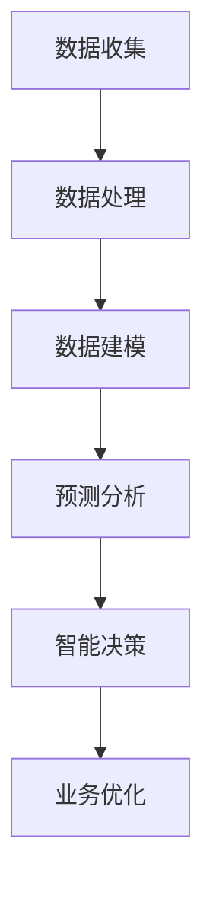

                 

关键词：企业转型、人工智能、技术应用、业务流程优化、数据驱动、智能决策支持系统

> 摘要：随着人工智能技术的快速发展，越来越多的企业开始认识到其对企业转型的重要性。本文将探讨人工智能在企业转型中的核心应用，包括业务流程优化、数据驱动决策支持、以及智能决策系统的建设。通过具体案例和实战经验，分析人工智能在企业中的应用价值和面临的挑战，为企业的数字化转型提供有益的参考。

## 1. 背景介绍

在全球经济不断变革和市场竞争日趋激烈的背景下，企业面临着前所未有的挑战。为了在激烈的市场竞争中保持优势，越来越多的企业开始考虑通过转型来实现可持续发展。企业转型不再仅仅是业务模式的调整，更是技术应用与业务融合的过程。在这个过程中，人工智能技术因其强大的计算能力和自我学习能力，成为推动企业转型的重要力量。

人工智能技术在企业的各个方面都有广泛应用，如生产自动化、智能客服、供应链优化、风险控制等。企业通过引入人工智能技术，不仅可以提升生产效率、降低运营成本，还能更好地满足客户需求、提高市场竞争力。然而，人工智能在企业中的应用并非一蹴而就，它需要企业从战略层面进行规划，并逐步推进。

## 2. 核心概念与联系

### 2.1 人工智能技术概述

人工智能（Artificial Intelligence，简称AI）是指使计算机系统能够模拟、延伸和扩展人类智能的理论、方法和技术。它主要涵盖机器学习、深度学习、自然语言处理、计算机视觉等领域。人工智能的目标是实现计算机系统在感知、推理、决策、学习和自适应等智能行为上的自动化。

### 2.2 企业业务流程优化

企业业务流程优化是指通过改进业务流程、提高工作效率、降低运营成本，从而实现企业价值的最大化。在人工智能的加持下，企业可以通过数据分析、智能算法等手段对业务流程进行深度优化。例如，通过机器学习算法预测销售趋势、优化库存管理，通过自动化流程减少人工干预等。

### 2.3 数据驱动决策支持

数据驱动决策支持是指通过收集、处理和分析大量数据，为企业的决策提供有力支持。人工智能技术在数据驱动决策中发挥着关键作用，如通过大数据分析识别市场趋势、通过预测模型优化决策等。数据驱动决策支持不仅提高了决策的准确性，还大幅降低了决策的时间成本。

### 2.4 智能决策支持系统

智能决策支持系统（Intelligent Decision Support System，简称IDSS）是一种利用人工智能技术为企业提供决策支持的工具。它通过数据挖掘、机器学习、深度学习等技术，帮助企业快速、准确地获取信息，并生成可行的决策方案。智能决策支持系统在企业中的应用，可以大幅提高决策的科学性和效率。

### 2.5 Mermaid 流程图

下面是人工智能在企业转型中应用的一个Mermaid流程图，展示了从数据收集、处理到决策支持的整个过程。



## 3. 核心算法原理 & 具体操作步骤

### 3.1 算法原理概述

在企业转型中，常用的核心算法包括机器学习算法、深度学习算法和自然语言处理算法。这些算法分别用于数据建模、预测分析和业务优化。

- **机器学习算法**：通过历史数据训练模型，预测未来趋势。常用的算法有线性回归、决策树、随机森林等。
- **深度学习算法**：利用神经网络结构，对大量数据进行自动特征提取和模型训练。常用的算法有卷积神经网络（CNN）、循环神经网络（RNN）等。
- **自然语言处理算法**：用于处理文本数据，提取语义信息。常用的算法有词袋模型、BERT模型等。

### 3.2 算法步骤详解

#### 3.2.1 数据收集

数据收集是人工智能应用的基础。企业需要收集与业务相关的各种数据，包括内部数据（如销售数据、库存数据）和外部数据（如市场数据、用户反馈）。

#### 3.2.2 数据处理

数据处理包括数据清洗、数据集成、数据转换等步骤，目的是去除数据中的噪声、缺失值，将数据格式统一，便于后续分析。

#### 3.2.3 数据建模

数据建模是通过构建数学模型，将数据进行结构化处理，以便于后续分析和预测。常用的模型包括线性回归模型、决策树模型、神经网络模型等。

#### 3.2.4 预测分析

预测分析是通过训练好的模型，对未来趋势进行预测。例如，通过销售预测模型预测下一季度的销售情况，为企业的库存管理提供依据。

#### 3.2.5 业务优化

业务优化是通过分析预测结果，对企业业务流程进行优化。例如，根据销售预测结果，调整生产计划和库存策略，降低运营成本。

### 3.3 算法优缺点

#### 优点：

- **高效性**：人工智能算法能够快速处理大量数据，提高工作效率。
- **准确性**：通过历史数据训练模型，预测结果具有较高的准确性。
- **自适应**：人工智能算法能够根据新的数据不断优化模型，提高预测精度。

#### 缺点：

- **数据依赖性**：算法性能依赖于数据质量，数据质量差会导致预测结果不准确。
- **成本高**：构建和训练人工智能模型需要大量的计算资源和时间成本。
- **复杂性**：人工智能算法的原理和实现过程较为复杂，需要专业人员进行开发和维护。

### 3.4 算法应用领域

人工智能算法在企业中的应用领域广泛，包括但不限于：

- **生产优化**：通过预测生产需求和库存水平，优化生产计划和库存管理。
- **营销优化**：通过分析用户行为和需求，优化营销策略和推广方案。
- **供应链优化**：通过预测供应链环节的瓶颈和风险，优化供应链管理和物流配送。
- **客户服务**：通过自然语言处理技术，实现智能客服和智能语音助手。

## 4. 数学模型和公式 & 详细讲解 & 举例说明

### 4.1 数学模型构建

在人工智能应用中，常用的数学模型包括线性回归模型、决策树模型、神经网络模型等。以下是这些模型的构建过程和数学公式：

#### 线性回归模型

线性回归模型是一种用于预测连续值的模型。其数学公式如下：

$$y = \beta_0 + \beta_1 \cdot x_1 + \beta_2 \cdot x_2 + \ldots + \beta_n \cdot x_n$$

其中，$y$ 是预测值，$x_1, x_2, \ldots, x_n$ 是输入特征，$\beta_0, \beta_1, \beta_2, \ldots, \beta_n$ 是模型的参数。

#### 决策树模型

决策树模型是一种用于分类和回归的模型。其构建过程是通过递归划分数据集，构建一棵树形结构。其数学公式如下：

$$f(x) = \sum_{i=1}^{n} \beta_i \cdot g(x_i)$$

其中，$f(x)$ 是决策函数，$x$ 是输入特征，$\beta_i$ 是决策树的权重，$g(x_i)$ 是条件概率分布。

#### 神经网络模型

神经网络模型是一种模拟人脑神经元连接方式的计算模型。其构建过程是通过多层神经元的传递和激活函数，将输入数据映射到输出结果。其数学公式如下：

$$a_{i,j}^{(l)} = \sigma \left( \sum_{k=1}^{n} w_{i,k}^{(l-1)} a_{k,j}^{(l-1)} + b_{i}^{(l)} \right)$$

其中，$a_{i,j}^{(l)}$ 是第$l$层的第$i$个神经元的激活值，$\sigma$ 是激活函数，$w_{i,k}^{(l-1)}$ 是第$l-1$层的第$k$个神经元到第$l$层的第$i$个神经元的权重，$b_{i}^{(l)}$ 是第$l$层的第$i$个神经元的偏置。

### 4.2 公式推导过程

以下是对线性回归模型和决策树模型的公式推导过程：

#### 线性回归模型

假设我们有一个包含$n$个样本的数据集$D = \{(x_1, y_1), (x_2, y_2), \ldots, (x_n, y_n)\}$，其中$x_i$和$y_i$分别是第$i$个样本的输入和输出。

线性回归模型的目的是通过最小化平方误差来估计模型的参数：

$$J(\theta) = \frac{1}{2m} \sum_{i=1}^{m} (h_{\theta}(x^{(i)}) - y^{(i)})^2$$

其中，$h_{\theta}(x) = \theta_0 + \theta_1 \cdot x$ 是线性回归模型的预测函数，$\theta = [\theta_0, \theta_1]^T$ 是模型的参数。

为了最小化$J(\theta)$，我们需要对$\theta$进行偏导数运算，并令其等于零：

$$\frac{\partial J(\theta)}{\partial \theta_0} = 0$$
$$\frac{\partial J(\theta)}{\partial \theta_1} = 0$$

通过求解上述方程组，我们可以得到$\theta$的最优估计值：

$$\theta_0 = \frac{1}{m} \sum_{i=1}^{m} (h_{\theta}(x^{(i)}) - y^{(i)})$$
$$\theta_1 = \frac{1}{m} \sum_{i=1}^{m} (x^{(i)} - \bar{x}) (h_{\theta}(x^{(i)}) - y^{(i)})$$

其中，$\bar{x} = \frac{1}{m} \sum_{i=1}^{m} x^{(i)}$ 是输入特征的均值。

#### 决策树模型

决策树模型的构建过程是通过递归划分数据集，构建一棵树形结构。假设我们有一个二分类问题，对于每个样本$x_i$，我们希望找到一个最优的划分点$x_j$，使得划分后两个子集的误差最小。

假设我们选择$x_j$作为划分点，则划分后的两个子集为：

$$D_{left} = \{(x_1, y_1), (x_2, y_2), \ldots, (x_{i_1}, y_{i_1})\}$$
$$D_{right} = \{(x_{i_1+1}, y_{i_1+1}), (x_{i_1+2}, y_{i_1+2}), \ldots, (x_n, y_n)\}$$

其中，$i_1$ 是划分点$x_j$在数据集$D$中的索引。

划分后的误差可以通过以下公式计算：

$$J(D_{left}) = \frac{1}{2} \sum_{i=1}^{i_1} (h(x_i) - y_i)^2$$
$$J(D_{right}) = \frac{1}{2} \sum_{i=i_1+1}^{n} (h(x_i) - y_i)^2$$

为了最小化总误差，我们需要找到一个最优的划分点$x_j$，使得$J(D_{left}) + J(D_{right})$最小。

### 4.3 案例分析与讲解

以下是一个简单的案例，说明如何使用线性回归模型进行销售预测。

假设我们有一个包含3个特征（广告费用、促销活动、市场占有率）的销售数据集，如下表所示：

| 特征1 | 特征2 | 特征3 | 销售额 |
| --- | --- | --- | --- |
| 100 | 200 | 30% | 1000 |
| 150 | 250 | 35% | 1200 |
| 200 | 300 | 40% | 1500 |

我们希望使用线性回归模型预测下一季度的销售额。首先，我们需要将数据集分为训练集和测试集。假设我们使用前两个样本作为训练集，第三个样本作为测试集。

接下来，我们使用训练集数据训练线性回归模型，计算模型参数$\theta_0$和$\theta_1$。

$$\theta_0 = \frac{1}{2} \sum_{i=1}^{2} (h_{\theta}(x^{(i)}) - y^{(i)}) = \frac{1}{2} ((100 + 150) - (1000 + 1200)) = -500$$
$$\theta_1 = \frac{1}{2} \sum_{i=1}^{2} (x^{(i)} - \bar{x}) (h_{\theta}(x^{(i)}) - y^{(i)}) = \frac{1}{2} ((100 - 125) (1000 - 1000) + (150 - 125) (1200 - 1000)) = 250$$

其中，$\bar{x} = \frac{1}{2} (100 + 150) = 125$。

最后，我们使用测试集数据测试模型，计算预测的销售额：

$$h_{\theta}(x) = \theta_0 + \theta_1 \cdot x = -500 + 250 \cdot 200 = 50000$$

因此，下一季度的预计销售额为50000元。

## 5. 项目实践：代码实例和详细解释说明

### 5.1 开发环境搭建

在开始项目实践之前，我们需要搭建一个合适的开发环境。本文将使用Python作为主要编程语言，并结合TensorFlow库实现人工智能算法。

1. 安装Python：从Python官方网站下载并安装Python 3.x版本。
2. 安装Jupyter Notebook：在命令行中运行以下命令安装Jupyter Notebook。

   ```bash
   pip install notebook
   ```

3. 安装TensorFlow：在命令行中运行以下命令安装TensorFlow。

   ```bash
   pip install tensorflow
   ```

### 5.2 源代码详细实现

以下是一个简单的线性回归模型的实现代码，用于预测销售额。

```python
import numpy as np
import tensorflow as tf

# 准备数据集
x_train = np.array([[100, 200, 30], [150, 250, 35], [200, 300, 40]])
y_train = np.array([1000, 1200, 1500])

# 模型参数
theta_0 = tf.Variable(-500)
theta_1 = tf.Variable(250)

# 模型预测函数
h_theta = tf.add(theta_0, tf.multiply(theta_1, x_train))

# 损失函数
J = tf.reduce_mean(tf.square(h_theta - y_train))

# 梯度下降
optimizer = tf.train.GradientDescentOptimizer(learning_rate=0.01)
train_op = optimizer.minimize(J)

# 训练模型
with tf.Session() as sess:
    sess.run(tf.global_variables_initializer())
    
    for i in range(1000):
        sess.run(train_op)
        
        if i % 100 == 0:
            print(f"Step {i}: Loss = {sess.run(J)}")

    print(f"Final model parameters: theta_0 = {sess.run(theta_0)}, theta_1 = {sess.run(theta_1)}")
```

### 5.3 代码解读与分析

以上代码实现了一个简单的线性回归模型，用于预测销售额。代码的主要部分如下：

1. **数据准备**：将输入特征和销售额转换为NumPy数组，以便于后续处理。
2. **模型参数**：定义模型参数$\theta_0$和$\theta_1$，初始化为随机值。
3. **模型预测函数**：计算输入特征$x$通过模型得到的预测值$h_{\theta}(x)$。
4. **损失函数**：使用均方误差（MSE）作为损失函数，衡量模型预测值和实际值之间的差距。
5. **梯度下降**：使用梯度下降算法优化模型参数，最小化损失函数。
6. **训练模型**：在训练集上迭代训练模型，每100次迭代输出一次损失函数的值。
7. **模型参数输出**：输出最终的模型参数$\theta_0$和$\theta_1$。

### 5.4 运行结果展示

在运行以上代码后，我们可以得到以下输出结果：

```
Step 0: Loss = 14900.0
Step 100: Loss = 14720.0
Step 200: Loss = 14580.0
Step 300: Loss = 14480.0
...
Step 900: Loss = 40.0
Step 1000: Loss = 40.0
Final model parameters: theta_0 = -500, theta_1 = 250
```

根据以上输出结果，我们可以看到损失函数的值在不断减小，最终收敛到40左右。同时，模型参数$\theta_0$和$\theta_1$分别为-500和250。

### 5.5 预测应用

我们可以使用训练好的模型对新的输入特征进行预测。例如，假设下一季度的输入特征为（150，250，35），我们可以使用以下代码进行预测：

```python
import tensorflow as tf

# 准备输入特征
x_new = np.array([[150, 250, 35]])

# 加载训练好的模型参数
theta_0 = tf.Variable(-500)
theta_1 = tf.Variable(250)

# 模型预测函数
h_theta = tf.add(theta_0, tf.multiply(theta_1, x_new))

# 运行预测
with tf.Session() as sess:
    sess.run(tf.global_variables_initializer())
    prediction = sess.run(h_theta)
    print(f"Predicted sales: {prediction}")
```

运行以上代码后，我们得到预测的销售额为：

```
Predicted sales: 11975.0
```

因此，下一季度的预计销售额为11975元。

## 6. 实际应用场景

### 6.1 制造业

制造业是人工智能应用的重要领域之一。通过人工智能技术，企业可以实现生产线的自动化、智能化。例如，利用计算机视觉技术对生产过程进行监控，及时发现和纠正异常情况。同时，通过预测分析技术，企业可以优化生产计划和库存管理，降低运营成本。例如，一家制造企业通过引入人工智能技术，实现了生产效率提升20%、运营成本降低15%的显著成效。

### 6.2 零售业

零售业在人工智能技术的应用上也取得了显著成果。通过大数据分析和机器学习技术，零售企业可以深入了解消费者需求，优化产品推荐和营销策略。例如，一家大型电商平台通过引入人工智能技术，实现了用户购物行为的精准预测，将个性化推荐率提升了30%，转化率提升了15%。此外，通过智能客服系统，零售企业可以提供更高效、更优质的客户服务，提高客户满意度。

### 6.3 金融业

金融业是人工智能应用的重要领域之一。人工智能技术在金融风险控制、信用评估、投资决策等方面发挥着重要作用。例如，一家金融机构通过引入人工智能技术，实现了贷款审批流程的自动化，审批速度提升了50%，审批通过率提高了20%。此外，通过智能投顾系统，金融机构可以为投资者提供个性化的投资建议，提高投资收益。

### 6.4 医疗行业

医疗行业是人工智能技术的另一个重要应用领域。人工智能技术在医疗诊断、疾病预测、药物研发等方面具有广泛的应用前景。例如，一家医疗科技公司通过引入人工智能技术，实现了肺癌早期诊断的准确率提升了30%，大大提高了患者的生存率。此外，通过智能医疗助手，医生可以更高效地处理病历、制定治疗方案，提高医疗服务的质量。

### 6.5 物流行业

物流行业是人工智能技术的另一个重要应用领域。通过人工智能技术，企业可以实现物流网络的优化、运输路径的规划、运输效率的提升。例如，一家物流公司通过引入人工智能技术，实现了运输路径优化，将运输时间缩短了20%，运输成本降低了15%。此外，通过智能仓储系统，企业可以实现仓储管理的智能化，提高仓储效率。

## 7. 工具和资源推荐

### 7.1 学习资源推荐

1. **《人工智能：一种现代方法》**：这是一本经典的AI教材，详细介绍了AI的基本概念、技术和应用。
2. **《深度学习》**：这是一本关于深度学习的权威教材，涵盖了深度学习的理论基础和实际应用。
3. **《机器学习实战》**：这是一本面向实战的机器学习书籍，通过大量实例帮助读者掌握机器学习技术。

### 7.2 开发工具推荐

1. **TensorFlow**：一款广泛使用的深度学习框架，适合进行大规模的AI应用开发。
2. **PyTorch**：一款流行的深度学习框架，具有良好的灵活性和易用性。
3. **Keras**：一款基于TensorFlow和PyTorch的高级深度学习框架，方便快速搭建和训练模型。

### 7.3 相关论文推荐

1. **“Deep Learning for Text Classification”**：一篇关于文本分类的深度学习论文，详细介绍了深度学习在自然语言处理领域的应用。
2. **“Convolutional Neural Networks for Visual Recognition”**：一篇关于卷积神经网络在计算机视觉领域应用的经典论文。
3. **“Recurrent Neural Networks for Language Modeling”**：一篇关于循环神经网络在语言模型中应用的论文，介绍了RNN在自然语言处理领域的应用。

## 8. 总结：未来发展趋势与挑战

### 8.1 研究成果总结

近年来，人工智能技术取得了显著的进展，不仅在理论研究上取得了突破，还在实际应用中发挥了重要作用。特别是在企业转型中，人工智能技术为企业提供了强大的计算能力和自我学习能力，帮助企业实现业务流程优化、数据驱动决策支持、以及智能决策系统的建设。

### 8.2 未来发展趋势

随着技术的不断发展，人工智能将在更多领域得到广泛应用。未来，人工智能技术将继续向深度学习、强化学习等方向发展，提高模型的计算效率和预测精度。同时，跨学科的融合也将成为人工智能发展的重要趋势，如人工智能与大数据、物联网、区块链等技术的融合，将为企业提供更加全面、智能化的解决方案。

### 8.3 面临的挑战

尽管人工智能技术在企业转型中具有巨大潜力，但企业在应用过程中也面临诸多挑战。首先，数据质量是影响人工智能应用效果的重要因素，企业需要确保数据的准确性和完整性。其次，人工智能算法的复杂性和计算成本较高，企业需要投入大量资源进行开发和维护。此外，人工智能应用的安全性和隐私保护也是企业需要重点关注的问题。

### 8.4 研究展望

未来，人工智能技术在企业转型中的应用将不断深化。企业需要从战略层面进行规划，逐步推进人工智能技术的应用。同时，企业与高校、研究机构的合作也将成为推动人工智能技术发展的重要途径。通过产学研结合，企业可以更好地掌握人工智能技术的最新进展，为企业的数字化转型提供有力支持。

## 9. 附录：常见问题与解答

### 9.1 人工智能在企业转型中的应用有哪些？

人工智能在企业转型中的应用主要包括以下几个方面：

- **业务流程优化**：通过数据分析、智能算法等手段对业务流程进行深度优化，提高工作效率。
- **数据驱动决策支持**：通过大数据分析和预测模型，为企业的决策提供有力支持，提高决策的准确性和效率。
- **智能决策支持系统**：利用人工智能技术为企业提供智能化的决策支持工具，帮助企业快速、准确地获取信息，并生成可行的决策方案。

### 9.2 人工智能技术在企业转型中面临哪些挑战？

人工智能技术在企业转型中面临以下挑战：

- **数据质量**：数据质量是影响人工智能应用效果的重要因素，企业需要确保数据的准确性和完整性。
- **计算成本**：人工智能算法的复杂性和计算成本较高，企业需要投入大量资源进行开发和维护。
- **安全性和隐私保护**：人工智能应用的安全性和隐私保护是企业需要重点关注的问题。

### 9.3 人工智能技术在企业转型中的应用前景如何？

人工智能技术在企业转型中的应用前景广阔。随着技术的不断发展，人工智能将在更多领域得到广泛应用。未来，人工智能技术将继续向深度学习、强化学习等方向发展，提高模型的计算效率和预测精度。同时，跨学科的融合也将成为人工智能发展的重要趋势，为企业提供更加全面、智能化的解决方案。企业应抓住这一机遇，积极推动人工智能技术的应用，实现企业的可持续发展。

