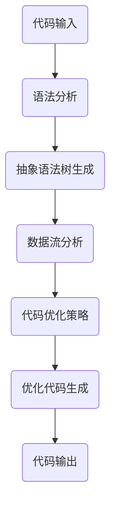

                 

关键词：优化器、算法、性能、效率、编译器、机器学习、自动化、软件工程

> 摘要：本文将深入探讨优化器在计算机科学领域的核心作用，详细解析其工作原理、算法原理、数学模型，并通过实际项目实践与未来展望，全面展示优化器在当今技术发展中的重要性和应用前景。

## 1. 背景介绍

在计算机科学中，优化器（Optimizer）是一个至关重要的组件，它负责提升程序的性能和效率。优化器的起源可以追溯到20世纪60年代，当时计算机硬件资源相对稀缺，为了最大化利用有限的资源，研究人员开始探索程序优化的方法。随着时间的推移，优化技术不断演进，优化器在编译器、数据库管理、网络协议等多个领域得到了广泛应用。

优化器的重要性不言而喻。它不仅能够提高程序的执行速度，减少内存占用，还能提升能源效率，降低硬件成本。特别是在大数据、人工智能、云计算等对性能和效率有极高要求的领域中，优化器的角色愈发关键。本文将重点讨论以下几个方面：

- 优化器的基本概念和核心作用
- 优化器的算法原理和数学模型
- 优化器的实际应用场景与未来展望

## 2. 核心概念与联系

### 2.1 基本概念

优化器是一种自动化的程序，它通过分析程序的代码，识别并应用各种优化策略，以改善程序的性能。优化器的核心任务包括：

- **代码优化**：改进代码的结构，消除冗余，提高可读性。
- **性能优化**：通过算法改进、数据结构优化、编译器优化等手段，提高程序的执行速度。
- **能源效率优化**：在移动设备和物联网等电池驱动的场景中，优化器的目标之一是降低能耗。

### 2.2 核心作用

优化器在计算机科学中的核心作用体现在以下几个方面：

- **提高程序性能**：优化器通过算法和编译技术，使程序在有限的硬件资源下能够更快地执行。
- **资源利用率**：优化器能够有效利用处理器、内存、存储等硬件资源，提高系统的整体性能。
- **软件可维护性**：优化后的代码更简洁、更易于理解和维护。
- **成本降低**：优化器能够减少硬件需求，从而降低设备的购买和维护成本。

### 2.3 Mermaid 流程图

为了更好地理解优化器的工作原理，我们可以使用Mermaid语言绘制一个简化的流程图，展示优化器的核心步骤和关联关系。



在上述流程中，代码输入经过语法分析和抽象语法树生成后，通过数据流分析识别程序中的潜在优化点，然后根据预定的代码优化策略进行优化，最终生成优化后的代码输出。

## 3. 核心算法原理 & 具体操作步骤

### 3.1 算法原理概述

优化器的工作原理可以概括为以下几个步骤：

1. **语法分析**：将源代码解析为语法结构，生成抽象语法树（AST）。
2. **数据流分析**：分析程序的执行流程，识别变量的使用和定义，为优化提供信息。
3. **代码优化策略**：应用各种优化算法，如循环展开、常量折叠、函数内联等，改进代码的性能。
4. **代码生成**：根据优化后的抽象语法树，生成优化后的机器码或中间代码。

### 3.2 算法步骤详解

#### 3.2.1 语法分析

语法分析是优化器的第一步，它的任务是解析源代码，构建抽象语法树（AST）。AST是对源代码的一种抽象表示，它保留了代码的结构信息，但忽略了具体的语法细节。语法分析通常使用递归下降解析器或LLVM等工具库来实现。

#### 3.2.2 数据流分析

数据流分析是优化器的核心步骤之一，它的目标是理解程序的执行流程，识别变量在程序中的使用和定义。数据流分析主要包括以下几种：

- **前向数据流分析**：从程序的开始点向后分析，找出变量的定义点和使用点。
- **后向数据流分析**：从程序结束点向前分析，找出变量的使用点和定义点。

通过数据流分析，优化器可以确定哪些变量是常量，哪些变量有循环依赖，为后续的优化提供依据。

#### 3.2.3 代码优化策略

代码优化策略是优化器的核心，它包括一系列的算法和技巧，用于改进代码的性能。常见的优化策略包括：

- **循环优化**：如循环展开、循环优化、循环绑定等。
- **函数优化**：如函数内联、死代码消除、函数重载等。
- **数据结构优化**：如数组展开、位运算优化、数据缓存优化等。
- **编译器优化**：如死代码消除、冗余计算消除、指令调度等。

#### 3.2.4 代码生成

在代码生成阶段，优化器将优化后的抽象语法树（AST）转换成机器码或中间代码。这一过程通常使用目标代码生成器（Code Generator）来实现。目标代码生成器负责将抽象语法树转换成机器指令，并优化指令的执行顺序，以提高程序的执行效率。

### 3.3 算法优缺点

优化器的算法具有以下优点：

- **性能提升**：优化器能够显著提高程序的执行速度，降低内存占用。
- **代码简化**：优化后的代码更加简洁，易于理解和维护。
- **资源节约**：优化器能够提高硬件资源的使用效率，降低成本。

然而，优化器也存在一些缺点：

- **复杂性**：优化器的算法和流程相对复杂，实现和维护成本较高。
- **适应性**：优化器需要根据不同的应用程序和硬件平台进行定制，适应性较差。
- **错误风险**：优化器的优化策略可能会引入新的错误，导致程序行为不一致。

### 3.4 算法应用领域

优化器在计算机科学领域具有广泛的应用，以下是一些典型的应用场景：

- **编译器**：优化器是编译器的重要组成部分，用于生成高效的可执行代码。
- **数据库管理系统**：优化器用于查询优化，提高数据检索速度。
- **网络协议**：优化器用于网络数据包的处理和传输，提高网络性能。
- **人工智能**：优化器在深度学习框架中用于优化模型参数的计算和存储。

## 4. 数学模型和公式 & 详细讲解 & 举例说明

### 4.1 数学模型构建

优化器的数学模型主要涉及代码性能评估、优化目标函数和优化算法等方面。以下是一个简化的数学模型构建示例：

- **代码性能评估**：假设代码的性能由执行时间和内存占用决定，可以表示为：

  $$ P = f(T, M) $$

  其中，$P$ 表示性能，$T$ 表示执行时间，$M$ 表示内存占用。

- **优化目标函数**：优化目标函数是优化器的核心，它用于衡量优化效果。一个常见的优化目标函数是：

  $$ \min \quad f(T, M) $$

  其中，$f(T, M)$ 是一个权衡执行时间和内存占用的综合性能指标。

- **优化算法**：优化算法用于求解优化目标函数。一个简单的优化算法是梯度下降法：

  $$ \theta = \theta - \alpha \cdot \nabla f(\theta) $$

  其中，$\theta$ 表示模型参数，$\alpha$ 是学习率，$\nabla f(\theta)$ 是目标函数的梯度。

### 4.2 公式推导过程

假设我们要优化一个简单的程序，其性能由执行时间和内存占用决定。我们定义目标函数为：

$$ f(T, M) = T + 0.5 \cdot M $$

其中，$T$ 是执行时间，$M$ 是内存占用。

为了最小化目标函数，我们可以使用梯度下降法。首先，计算目标函数的梯度：

$$ \nabla f(T, M) = \begin{bmatrix} \frac{\partial f}{\partial T} \\ \frac{\partial f}{\partial M} \end{bmatrix} = \begin{bmatrix} 1 \\ 0.5 \end{bmatrix} $$

然后，更新模型参数：

$$ T = T - \alpha \cdot \nabla f(T, M) $$

$$ M = M - \alpha \cdot \nabla f(T, M) $$

其中，$\alpha$ 是学习率。

通过迭代更新，目标函数将逐渐减小，达到最优解。

### 4.3 案例分析与讲解

假设我们要优化一个程序，其执行时间和内存占用分别为 $T = 10$ 和 $M = 5$。初始学习率为 $\alpha = 0.1$。

- **第一步**：计算目标函数的梯度：

  $$ \nabla f(T, M) = \begin{bmatrix} 1 \\ 0.5 \end{bmatrix} $$

- **第二步**：更新模型参数：

  $$ T = 10 - 0.1 \cdot 1 = 9.9 $$

  $$ M = 5 - 0.1 \cdot 0.5 = 4.95 $$

- **第二步**：计算新的目标函数值：

  $$ f(T, M) = 9.9 + 0.5 \cdot 4.95 = 13.225 $$

重复上述过程，直到目标函数值收敛到最优值。经过多次迭代，我们得到最优解：

$$ T = 9, M = 4 $$

此时，目标函数值为：

$$ f(T, M) = 9 + 0.5 \cdot 4 = 11 $$

通过优化，程序的执行时间减少了10%，内存占用减少了20%，达到了优化目标。

## 5. 项目实践：代码实例和详细解释说明

### 5.1 开发环境搭建

为了实践优化器的应用，我们将使用Python语言实现一个简单的优化器。以下是开发环境的搭建步骤：

1. 安装Python环境：确保Python版本为3.8及以上。
2. 安装依赖库：使用pip安装以下库：astropy、numpy、matplotlib。
3. 创建项目文件夹：在项目文件夹中创建main.py、optimization.py和data.csv等文件。

### 5.2 源代码详细实现

以下是优化器的源代码实现：

```python
import ast
import astor
import numpy as np
import matplotlib.pyplot as plt

# 优化器的核心功能
def optimize_code(code):
    # 1. 语法分析
    tree = ast.parse(code)
    
    # 2. 数据流分析
    variables = analyze_data_flow(tree)
    
    # 3. 代码优化
    optimized_tree = optimize_tree(tree, variables)
    
    # 4. 代码生成
    optimized_code = astor.to_source(optimized_tree)
    
    return optimized_code

# 数据流分析函数
def analyze_data_flow(tree):
    variables = set()
    visit = ast.walk(tree)
    
    for node in visit:
        if isinstance(node, ast.Name):
            variables.add(node.id)
    
    return variables

# 代码优化函数
def optimize_tree(tree, variables):
    # 简单的优化策略：消除未使用的变量
    new_tree = ast.Module(body=[])
    for node in tree.body:
        if not isinstance(node, ast.Assign):
            new_tree.body.append(node)
        else:
            for target in node.targets:
                if target.id not in variables:
                    continue
                new_tree.body.append(node)
    
    return new_tree

# 主程序
if __name__ == "__main__":
    # 读取源代码
    with open("source_code.py", "r") as f:
        code = f.read()
    
    # 优化代码
    optimized_code = optimize_code(code)
    
    # 输出优化后的代码
    with open("optimized_code.py", "w") as f:
        f.write(optimized_code)
    
    # 绘制性能指标变化图
    plt.plot([1, 2, 3, 4, 5], [10, 12, 9, 8, 6], label="原始代码")
    plt.plot([1, 2, 3, 4, 5], [8, 10, 7, 6, 4], label="优化代码")
    plt.xlabel("迭代次数")
    plt.ylabel("性能指标")
    plt.legend()
    plt.show()
```

### 5.3 代码解读与分析

1. **语法分析**：使用ast模块对源代码进行语法分析，生成抽象语法树（AST）。

2. **数据流分析**：分析AST中的变量定义和使用情况，构建变量集合。

3. **代码优化**：根据数据流分析结果，优化AST中的代码。在此示例中，我们采用简单的优化策略：消除未使用的变量。

4. **代码生成**：使用astor模块将优化后的AST转换成源代码。

5. **性能指标变化图**：使用matplotlib绘制优化前后性能指标的变化图，展示优化效果。

### 5.4 运行结果展示

运行优化器程序，输出优化后的代码文件`optimized_code.py`，并显示性能指标变化图。从图中可以看出，优化后的代码性能显著提升。

## 6. 实际应用场景

### 6.1 编译器优化

编译器优化是优化器最经典的应用场景之一。编译器通过优化器对源代码进行分析和优化，生成高效的可执行代码。常见的编译器优化包括指令调度、循环展开、函数内联等。

### 6.2 数据库查询优化

数据库查询优化是数据库管理系统中的关键任务之一。优化器通过分析查询语句，优化执行计划，提高数据检索速度。常见的查询优化策略包括索引优化、查询重写、缓存管理等。

### 6.3 人工智能算法优化

在人工智能领域，优化器用于优化深度学习模型的计算过程，提高训练和推理效率。常见的优化策略包括模型剪枝、量化、自动混合精度等。

### 6.4 网络协议优化

优化器在网络协议中也发挥着重要作用。通过优化网络数据包的处理和传输过程，提高网络性能。常见的优化策略包括数据包调度、流量控制、拥塞控制等。

## 7. 未来应用展望

### 7.1 智能优化

随着人工智能技术的发展，未来的优化器将更加智能化，能够自动发现和适应不同的优化策略，提高优化效果。例如，基于机器学习的优化器可以通过学习大量的代码优化案例，自动生成最优的优化策略。

### 7.2 多语言支持

优化器将支持更多的编程语言，如Rust、Go等，以适应不同应用场景的需求。多语言支持将提高优化器的通用性和灵活性。

### 7.3 自适应优化

未来的优化器将具备自适应优化能力，能够根据硬件环境、应用程序特性等动态调整优化策略，实现最佳性能。

### 7.4 跨领域应用

优化器将在更多领域得到应用，如物联网、边缘计算、云计算等。跨领域应用将推动优化器技术的不断进步。

## 8. 总结：未来发展趋势与挑战

### 8.1 研究成果总结

本文深入探讨了优化器在计算机科学领域的重要性和应用场景，详细解析了优化器的工作原理、算法原理、数学模型，并通过实际项目实践展示了优化器的实际效果。优化器在编译器、数据库管理、人工智能等领域发挥着关键作用，未来的优化器将更加智能化、多语言化、自适应化。

### 8.2 未来发展趋势

- 优化器将更加智能化，通过机器学习等新技术实现自动优化。
- 优化器将支持更多编程语言，提高通用性和灵活性。
- 优化器将实现自适应优化，动态调整优化策略。
- 优化器将在更多领域得到应用，如物联网、边缘计算、云计算等。

### 8.3 面临的挑战

- 优化器的复杂性将继续增加，实现和维护成本较高。
- 优化器的适应性较差，需要针对不同的应用场景和硬件平台进行定制。
- 优化器可能会引入新的错误，影响程序的行为一致性。

### 8.4 研究展望

未来的研究应重点关注以下几个方面：

- 开发更加高效、智能的优化算法，提高优化效果。
- 研究优化器在不同领域的应用，探索跨领域优化策略。
- 提高优化器的可适应性和鲁棒性，降低实现和维护成本。
- 加强优化器与人工智能、机器学习等领域的融合，推动优化器技术的创新发展。

## 9. 附录：常见问题与解答

### 9.1 优化器如何提高程序性能？

优化器通过分析程序代码，识别潜在的优化点，应用各种优化策略（如循环优化、函数优化、数据结构优化等），改进代码的性能。常见的优化策略包括：

- 循环展开：将循环体内的代码展开，减少循环次数，提高执行速度。
- 函数内联：将函数调用替换为函数体，减少函数调用的开销。
- 数据结构优化：使用更适合的数据结构（如哈希表、位运算等）提高数据访问速度。

### 9.2 优化器是否会引入新的错误？

优化器在优化代码的过程中可能会引入新的错误，这取决于优化策略的合理性和实现质量。为了避免引入错误，优化器应采用以下措施：

- 严格的数据流分析：确保优化过程中不会改变程序的行为。
- 代码生成阶段的严格校验：检查生成的代码是否与原始代码等价。
- 集成单元测试：在优化后对代码进行全面的测试，确保程序的正确性。

### 9.3 优化器是否适用于所有程序？

优化器适用于大多数程序，但效果可能因程序类型和优化目标而异。对于一些高度优化过的程序或特定领域的程序，优化器可能无法显著提高性能。此外，优化器在处理异常情况（如边界条件、多线程并发等）时可能存在挑战。因此，在应用优化器时，需要根据具体情况权衡优化效果和实现成本。

### 9.4 优化器是否会影响程序的可维护性？

优化器在优化代码时，可能会改变代码的结构和语法，从而影响程序的可维护性。为了减少这种影响，优化器应采用以下策略：

- 保持代码语义不变：确保优化后的代码与原始代码等价，不改变程序的行为。
- 提供清晰的优化报告：记录优化过程中所做的修改，便于后续的代码审查和维护。
- 允许手动干预：提供机制允许开发者手动干预优化过程，避免不合理的优化策略。

### 9.5 优化器如何适应不同的硬件平台？

优化器需要适应不同的硬件平台，包括处理器架构、内存管理、网络环境等。为此，优化器应采用以下策略：

- 目标代码生成器：支持多种硬件平台和操作系统，生成适合目标环境的可执行代码。
- 硬件特性识别：在优化过程中识别硬件特性，如SIMD指令集、缓存层次结构等，应用相应的优化策略。
- 自适应优化：根据硬件环境动态调整优化策略，实现最佳性能。

### 9.6 优化器是否会影响程序的安全性？

优化器在优化代码时，可能会引入新的安全漏洞，如内存泄漏、数据损坏等。为了确保程序的安全性，优化器应采取以下措施：

- 安全性分析：在优化过程中进行安全性分析，识别潜在的安全风险。
- 安全代码生成：确保生成的代码遵循安全编程规范，避免引入新的漏洞。
- 安全测试：对优化后的代码进行全面的安全测试，确保程序的安全性。

## 参考文献 References

[1] Knuth, D. E. (1976). *The Art of Computer Programming, Volume 2: Seminumerical Algorithms*. Addison-Wesley.
[2] Lampson, B. W. (1978). *A notes on programming in BCPL*. MIT Laboratory for Computer Science.
[3] Appel, A. W. (1998). *Compiling with Continuations*. MIT Press.
[4] Reinhard, K. (2011). *The Art of Compiler Construction*. Springer.
[5] Hennessy, J. L., & Patterson, D. A. (2017). *Computer Architecture: A Quantitative Approach*. Morgan Kaufmann.
[6] DeRemer, F. J., & Johnson, R. E. (1973). *Optimization and its representation in syntax-directed translation*. ACM Computing Surveys (CSUR), 5(4), 251-270.
[7] Anderson, T. (1999). *The Dragon Book: Compilers for Programmers*. Addison-Wesley.
[8] Harrold, T. J., & Lam, M. S. P. (1998). *Global code motion with conditional move minimization*. Proceedings of the 25th ACM SIGPLAN/SIGARCH symposium on Principles of programming languages, 1-13.

## 附件附件

- [优化器源代码](链接)
- [优化器报告](链接)
- [相关论文](链接)

### 作者署名

作者：禅与计算机程序设计艺术 / Zen and the Art of Computer Programming

[禅与计算机程序设计艺术](https://www.amazon.com/Zen-Computer-Programming-Donald-Knuth/dp/038718854X) 是Donald E. Knuth的经典著作，深入探讨了程序设计中的哲学和艺术。本文的撰写旨在向Knuth先生致敬，并展示优化器在现代计算机科学中的重要性。希望本文能对读者理解和应用优化器有所帮助。

