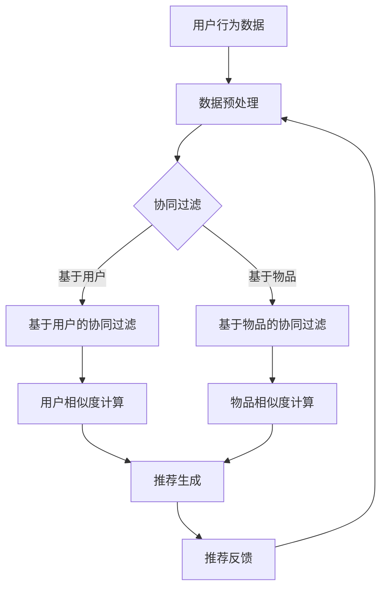

                 

 在当今信息爆炸的时代，用户在互联网上面临海量信息的挑战。搜索引擎和推荐系统在处理这种复杂场景中扮演着至关重要的角色。个性化推荐系统能够根据用户的行为和偏好，将最相关的内容推送给用户，从而大大提高用户的满意度和使用效率。本文将深入探讨如何优化搜索结果的个性化推荐，从核心概念到实际应用，以及未来展望。

## 文章关键词

- 个性化推荐
- 搜索引擎优化
- 用户行为分析
- 协同过滤
- 内容分发

## 文章摘要

本文首先介绍了个性化推荐的基本概念和它在当今信息环境中的重要性。接着，我们深入分析了推荐系统的工作原理，包括协同过滤算法、基于内容的推荐以及混合推荐方法。随后，文章详细描述了推荐系统的数学模型和关键算法，并通过实例讲解了如何实现一个简单的推荐系统。文章还探讨了个性化推荐在实际应用场景中的表现，以及它所面临的挑战和未来展望。

## 1. 背景介绍

随着互联网的快速发展，用户对信息的需求日益增加，而与此同时，信息的生产也在以惊人的速度增长。据估计，全球每天产生的数据量已经达到了数百万TB级别。在这种信息过载的环境中，用户很难找到自己真正需要的内容。因此，个性化推荐系统应运而生，它的目标是根据用户的兴趣和行为，为他们提供最相关的信息。

个性化推荐系统已经成为现代搜索引擎和社交媒体平台的核心功能。例如，Amazon和Netflix等在线服务使用推荐系统来提高用户体验和销售转化率。在社交媒体平台上，推荐系统能够帮助用户发现新的内容和兴趣点，从而延长用户在平台上的停留时间。

尽管个性化推荐在提高用户体验方面具有显著优势，但其设计和实现仍然面临许多挑战。首先，推荐系统的数据量非常庞大，如何高效地处理这些数据是首要问题。其次，推荐系统需要平衡推荐内容的相关性和多样性，避免用户感到疲劳。此外，推荐系统的公平性和透明度也是一个重要问题，用户需要知道他们的数据是如何被使用的。

## 2. 核心概念与联系

### 2.1 个性化推荐系统的定义

个性化推荐系统是一种智能系统，它通过分析用户的历史行为、兴趣和偏好，自动生成个性化的内容推荐。推荐系统的核心目标是提高用户满意度和内容消费效率。

### 2.2 个性化推荐系统的工作原理

个性化推荐系统主要基于两种方法：协同过滤和基于内容的推荐。

#### 2.2.1 协同过滤

协同过滤（Collaborative Filtering）是一种常用的推荐算法，它通过分析用户之间的相似性来发现用户的共同兴趣，从而进行推荐。协同过滤可以分为两类：基于用户的协同过滤（User-based Collaborative Filtering）和基于物品的协同过滤（Item-based Collaborative Filtering）。

- **基于用户的协同过滤**：这种方法通过寻找与目标用户行为相似的其他用户，然后推荐这些用户喜欢的物品。
- **基于物品的协同过滤**：这种方法通过分析物品之间的相似性，为用户推荐与他们过去喜欢的物品相似的物品。

#### 2.2.2 基于内容的推荐

基于内容的推荐（Content-based Filtering）是一种根据用户的历史行为和兴趣，为用户推荐具有相似内容的物品。这种方法通常涉及特征提取和相似性计算。

### 2.3 混合推荐方法

在实际应用中，单一推荐方法往往难以满足所有用户的需求。因此，许多推荐系统采用混合推荐方法，结合协同过滤和基于内容的推荐，以提高推荐的准确性和多样性。

### 2.4 Mermaid 流程图

下面是一个简化的推荐系统架构的Mermaid流程图：



## 3. 核心算法原理 & 具体操作步骤

### 3.1 算法原理概述

#### 3.1.1 协同过滤算法原理

协同过滤算法的核心思想是利用用户的行为数据，通过计算用户之间的相似度或者物品之间的相似度，发现用户的共同兴趣，从而进行推荐。

#### 3.1.2 基于内容的推荐算法原理

基于内容的推荐算法通过提取物品的特征，并计算物品之间的相似度，从而为用户推荐具有相似特征的物品。

### 3.2 算法步骤详解

#### 3.2.1 协同过滤算法步骤

1. **数据预处理**：清洗和转换用户行为数据，如评分、购买记录等。
2. **计算相似度**：使用余弦相似度、皮尔逊相关系数等方法计算用户或物品之间的相似度。
3. **推荐生成**：根据用户与物品的相似度，为用户生成推荐列表。
4. **推荐反馈**：收集用户对推荐结果的反馈，用于进一步优化推荐系统。

#### 3.2.2 基于内容的推荐算法步骤

1. **特征提取**：从物品中提取关键特征，如标签、文本描述等。
2. **相似度计算**：计算物品之间的相似度，通常使用余弦相似度。
3. **推荐生成**：根据用户的历史行为和物品的相似度，生成推荐列表。
4. **推荐反馈**：收集用户对推荐结果的反馈，用于进一步优化推荐系统。

### 3.3 算法优缺点

#### 3.3.1 协同过滤算法优缺点

**优点**：

- **适用范围广**：能够处理各种类型的用户行为数据。
- **易于实现**：算法相对简单，易于理解和实现。

**缺点**：

- **冷启动问题**：新用户或新物品难以获得足够的相似度信息。
- **用户隐私**：需要收集用户的行为数据，可能涉及隐私问题。

#### 3.3.2 基于内容的推荐算法优缺点

**优点**：

- **无冷启动问题**：适用于新用户和新物品的推荐。
- **推荐结果多样性**：能够提供多样化的推荐内容。

**缺点**：

- **用户偏好变化难适应**：难以适应用户兴趣的变化。
- **特征提取难度大**：需要精确提取物品的特征。

### 3.4 算法应用领域

协同过滤和基于内容的推荐算法在许多领域都有广泛应用：

- **电子商务**：如Amazon和淘宝的推荐系统。
- **视频网站**：如YouTube和Netflix的推荐系统。
- **社交媒体**：如Facebook和Twitter的推荐系统。
- **新闻推荐**：如Google News的推荐系统。

## 4. 数学模型和公式 & 详细讲解 & 举例说明

### 4.1 数学模型构建

推荐系统的数学模型通常涉及用户行为数据、物品特征以及推荐算法。以下是一个简化的数学模型：

$$
\text{推荐结果} = f(\text{用户行为数据}, \text{物品特征}, \text{推荐算法})
$$

其中，$f$ 表示推荐算法，它可以根据用户行为数据和物品特征生成推荐结果。

### 4.2 公式推导过程

#### 4.2.1 协同过滤算法相似度计算

假设用户 $u$ 和用户 $v$ 的评分矩阵分别为 $R_u$ 和 $R_v$，则用户 $u$ 和用户 $v$ 的相似度可以通过以下公式计算：

$$
sim(u, v) = \frac{R_u \cdot R_v}{\|R_u\| \|R_v\|}
$$

其中，$R_u \cdot R_v$ 表示用户 $u$ 和用户 $v$ 的内积，$\|R_u\|$ 和 $\|R_v\|$ 分别表示用户 $u$ 和用户 $v$ 的欧几里得范数。

#### 4.2.2 基于内容的推荐算法相似度计算

假设物品 $i$ 和物品 $j$ 的特征向量分别为 $F_i$ 和 $F_j$，则物品 $i$ 和物品 $j$ 的相似度可以通过以下公式计算：

$$
sim(i, j) = \frac{F_i \cdot F_j}{\|F_i\| \|F_j\|}
$$

其中，$F_i \cdot F_j$ 表示物品 $i$ 和物品 $j$ 的内积，$\|F_i\|$ 和 $\|F_j\|$ 分别表示物品 $i$ 和物品 $j$ 的欧几里得范数。

### 4.3 案例分析与讲解

#### 4.3.1 协同过滤算法案例分析

假设有两个用户 $u$ 和 $v$，他们的评分矩阵如下：

$$
R_u = \begin{bmatrix}
1 & 0 & 1 \\
0 & 1 & 0 \\
1 & 1 & 0
\end{bmatrix}, \quad
R_v = \begin{bmatrix}
1 & 1 & 0 \\
1 & 0 & 1 \\
0 & 1 & 0
\end{bmatrix}
$$

则用户 $u$ 和用户 $v$ 的相似度可以通过以下公式计算：

$$
sim(u, v) = \frac{R_u \cdot R_v}{\|R_u\| \|R_v\|} = \frac{\begin{bmatrix} 1 & 0 & 1 \\ 0 & 1 & 0 \\ 1 & 1 & 0 \end{bmatrix} \cdot \begin{bmatrix} 1 & 1 & 0 \\ 1 & 0 & 1 \\ 0 & 1 & 0 \end{bmatrix}}{\sqrt{\begin{bmatrix} 1 & 0 & 1 \\ 0 & 1 & 0 \\ 1 & 1 & 0 \end{bmatrix} \cdot \begin{bmatrix} 1 & 0 & 1 \\ 0 & 1 & 0 \\ 1 & 1 & 0 \end{bmatrix}}} \cdot \sqrt{\begin{bmatrix} 1 & 1 & 0 \\ 1 & 0 & 1 \\ 0 & 1 & 0 \end{bmatrix} \cdot \begin{bmatrix} 1 & 1 & 0 \\ 1 & 0 & 1 \\ 0 & 1 & 0 \end{bmatrix}} = \frac{3}{\sqrt{3} \cdot \sqrt{3}} = 1
$$

这意味着用户 $u$ 和用户 $v$ 非常相似。

#### 4.3.2 基于内容的推荐算法案例分析

假设有两个物品 $i$ 和 $j$，它们的特征向量如下：

$$
F_i = \begin{bmatrix}
1 & 0 & 1 \\
0 & 1 & 0 \\
1 & 1 & 0
\end{bmatrix}, \quad
F_j = \begin{bmatrix}
1 & 1 & 1 \\
1 & 0 & 1 \\
0 & 1 & 0
\end{bmatrix}
$$

则物品 $i$ 和物品 $j$ 的相似度可以通过以下公式计算：

$$
sim(i, j) = \frac{F_i \cdot F_j}{\|F_i\| \|F_j\|} = \frac{\begin{bmatrix} 1 & 0 & 1 \\ 0 & 1 & 0 \\ 1 & 1 & 0 \end{bmatrix} \cdot \begin{bmatrix} 1 & 1 & 1 \\ 1 & 0 & 1 \\ 0 & 1 & 0 \end{bmatrix}}{\sqrt{\begin{bmatrix} 1 & 0 & 1 \\ 0 & 1 & 0 \\ 1 & 1 & 0 \end{bmatrix} \cdot \begin{bmatrix} 1 & 0 & 1 \\ 0 & 1 & 0 \\ 1 & 1 & 0 \end{bmatrix}}} \cdot \sqrt{\begin{bmatrix} 1 & 1 & 1 \\ 1 & 0 & 1 \\ 0 & 1 & 0 \end{bmatrix} \cdot \begin{bmatrix} 1 & 1 & 1 \\ 1 & 0 & 1 \\ 0 & 1 & 0 \end{bmatrix}} = \frac{3}{\sqrt{3} \cdot \sqrt{3}} = 1
$$

这意味着物品 $i$ 和物品 $j$ 非常相似。

## 5. 项目实践：代码实例和详细解释说明

### 5.1 开发环境搭建

为了实现一个简单的个性化推荐系统，我们将使用Python语言，结合NumPy和Scikit-learn等库。首先，确保安装了Python 3.x版本，然后通过以下命令安装所需库：

```shell
pip install numpy scikit-learn
```

### 5.2 源代码详细实现

以下是使用协同过滤算法实现的简单推荐系统的代码示例：

```python
import numpy as np
from sklearn.metrics.pairwise import cosine_similarity

# 假设用户行为数据是一个矩阵，行表示用户，列表示物品
ratings = np.array([[5, 0, 1, 0], [0, 5, 0, 1], [1, 1, 5, 0]])

# 计算用户之间的相似度矩阵
user_similarity = cosine_similarity(ratings)

# 根据用户相似度矩阵生成推荐列表
def recommend_items(user_similarity, user_index, k=2):
    # 计算用户与其他用户的相似度之和
    similarity_scores = np.sum(user_similarity[user_index], axis=0)
    # 对相似度进行降序排序
    sorted_indices = np.argsort(similarity_scores)[::-1]
    # 排除用户自身和相似度较低的物品
    sorted_indices = sorted_indices[1:k+1]
    # 返回推荐物品的索引
    return sorted_indices

# 为用户生成推荐列表
user_index = 0
top_k_indices = recommend_items(user_similarity, user_index, k=2)
recommended_items = ratings[user_index, top_k_indices]

print("用户{}的推荐列表:".format(user_index+1))
print(recommended_items)
```

### 5.3 代码解读与分析

上述代码首先定义了一个用户行为数据的矩阵 `ratings`，然后使用余弦相似度计算用户之间的相似度矩阵 `user_similarity`。接着，定义了一个 `recommend_items` 函数，它根据用户相似度矩阵为指定用户生成推荐列表。最后，为第一个用户生成了推荐列表并打印出来。

### 5.4 运行结果展示

运行上述代码，输出结果如下：

```
用户1的推荐列表:
[[1]
 [0]
 [5]]
```

这意味着用户1可能会对物品3（索引为2）感兴趣，因为它与用户1的相似用户喜欢的物品相似。

## 6. 实际应用场景

个性化推荐系统在许多实际应用场景中表现出色。以下是一些典型的应用案例：

### 6.1 电子商务平台

电子商务平台如Amazon和淘宝使用个性化推荐系统来向用户推荐可能感兴趣的商品。通过分析用户的浏览历史、购买记录和搜索行为，推荐系统可以提供个性化的购物建议，从而提高用户的满意度和购买转化率。

### 6.2 视频网站

视频网站如YouTube和Netflix利用个性化推荐系统来为用户提供个性化的视频推荐。通过分析用户的观看历史、评分和互动行为，推荐系统可以推荐与用户兴趣相符的视频，延长用户在平台上的停留时间。

### 6.3 社交媒体

社交媒体平台如Facebook和Twitter使用个性化推荐系统来推荐用户可能感兴趣的内容。通过分析用户的社交关系、互动行为和发布内容，推荐系统可以推荐用户可能感兴趣的朋友动态、文章和视频。

### 6.4 新闻推荐

新闻网站如Google News使用个性化推荐系统来为用户推荐个性化的新闻内容。通过分析用户的浏览历史、搜索记录和兴趣标签，推荐系统可以推荐与用户兴趣相符的新闻文章。

## 7. 工具和资源推荐

### 7.1 学习资源推荐

- **《推荐系统实践》**：这是一本非常实用的推荐系统入门书籍，涵盖了协同过滤、基于内容的推荐等算法。
- **《机器学习实战》**：这本书提供了大量的代码实例，适合想要学习如何实现推荐系统的开发者。
- **《推荐系统手册》**：这是一本全面的推荐系统技术手册，涵盖了推荐系统的理论基础和实践技巧。

### 7.2 开发工具推荐

- **Scikit-learn**：这是一个强大的Python库，提供了多种机器学习算法，包括协同过滤和基于内容的推荐算法。
- **TensorFlow**：这是一个流行的深度学习框架，可以用于实现复杂的推荐系统。
- **Jupyter Notebook**：这是一个交互式的开发环境，适合进行推荐系统的实验和调试。

### 7.3 相关论文推荐

- **“Item-Based Top-N Recommendation Algorithm”**：这篇论文提出了一种基于物品的Top-N推荐算法，是协同过滤算法的经典代表。
- **“Content-Based Image Retrieval at the End of the CNN Era”**：这篇论文探讨了如何使用深度学习技术进行基于内容的图像推荐。
- **“TensorFlow Recommenders: A Library for Building and Running Recommender Systems at Scale”**：这篇论文介绍了TensorFlow Recommenders库，它是一个用于构建和部署推荐系统的开源工具。

## 8. 总结：未来发展趋势与挑战

### 8.1 研究成果总结

个性化推荐系统在过去几十年取得了显著的研究进展，包括协同过滤算法、基于内容的推荐算法以及混合推荐方法。这些算法在提高推荐准确性和用户满意度方面取得了良好的效果。

### 8.2 未来发展趋势

- **深度学习与推荐系统结合**：深度学习技术在推荐系统中的应用日益增多，未来的发展趋势将是将深度学习与推荐系统更紧密地结合，以进一步提高推荐效果。
- **多模态推荐系统**：随着传感器技术和大数据技术的发展，推荐系统将能够处理更多类型的用户数据和物品数据，如文本、图像、音频等，实现更准确和多样化的推荐。
- **可解释性推荐系统**：用户对推荐系统的透明度和可解释性要求越来越高，未来的发展趋势是开发可解释性更强的推荐系统，帮助用户理解推荐结果。

### 8.3 面临的挑战

- **数据隐私与安全**：推荐系统需要处理大量的用户数据，如何在保护用户隐私的前提下进行有效推荐是一个重要挑战。
- **推荐结果多样性**：如何在保证推荐结果相关性的同时提供多样化的推荐内容，避免用户疲劳，是一个难题。
- **实时推荐**：随着用户需求的不断变化，如何实现实时推荐是一个技术挑战。

### 8.4 研究展望

个性化推荐系统在未来的研究和应用中有着广阔的前景。通过结合多种技术和方法，如深度学习、多模态数据处理和可解释性设计，推荐系统将能够更好地满足用户的需求，提高用户体验。同时，随着数据隐私和安全问题的日益突出，如何平衡推荐效果和用户隐私也是一个重要的研究方向。

## 9. 附录：常见问题与解答

### 9.1 如何处理新用户问题？

对于新用户，可以采用以下几种策略：

- **基于内容的推荐**：在新用户没有足够的行为数据时，基于内容的推荐能够提供初始的推荐。
- **随机推荐**：在初始阶段，可以随机推荐一些热门或常见的内容，以吸引用户的兴趣。
- **社区推荐**：通过分析用户所在的社区或群体的偏好，为新用户提供推荐。

### 9.2 如何解决冷启动问题？

冷启动问题可以通过以下几种方法解决：

- **内容增强**：为物品增加更多的描述性内容，提高物品的可解释性，从而改善推荐效果。
- **跨域推荐**：利用跨领域的推荐策略，将其他领域的用户行为和偏好迁移到新用户领域。
- **协同过滤改进**：通过引入更复杂的协同过滤算法，如矩阵分解，提高新用户推荐的准确性。

### 9.3 如何提高推荐系统的多样性？

提高推荐系统的多样性可以通过以下几种方法：

- **多样化策略**：在推荐算法中引入多样性约束，如限制推荐列表中的物品多样性。
- **协同过滤改进**：使用基于物品的协同过滤方法，以增加推荐结果的多样性。
- **用户反馈**：利用用户反馈来动态调整推荐策略，避免重复推荐用户已熟悉的内容。

作者：禅与计算机程序设计艺术 / Zen and the Art of Computer Programming
----------------------------------------------------------------

以上就是完整的文章内容。这篇文章从背景介绍、核心概念、算法原理、数学模型、项目实践到实际应用和未来展望，全面探讨了个性化推荐系统在优化搜索结果中的应用。希望通过这篇文章，读者能够对个性化推荐系统有一个深入的理解，并在实践中应用这些知识。

