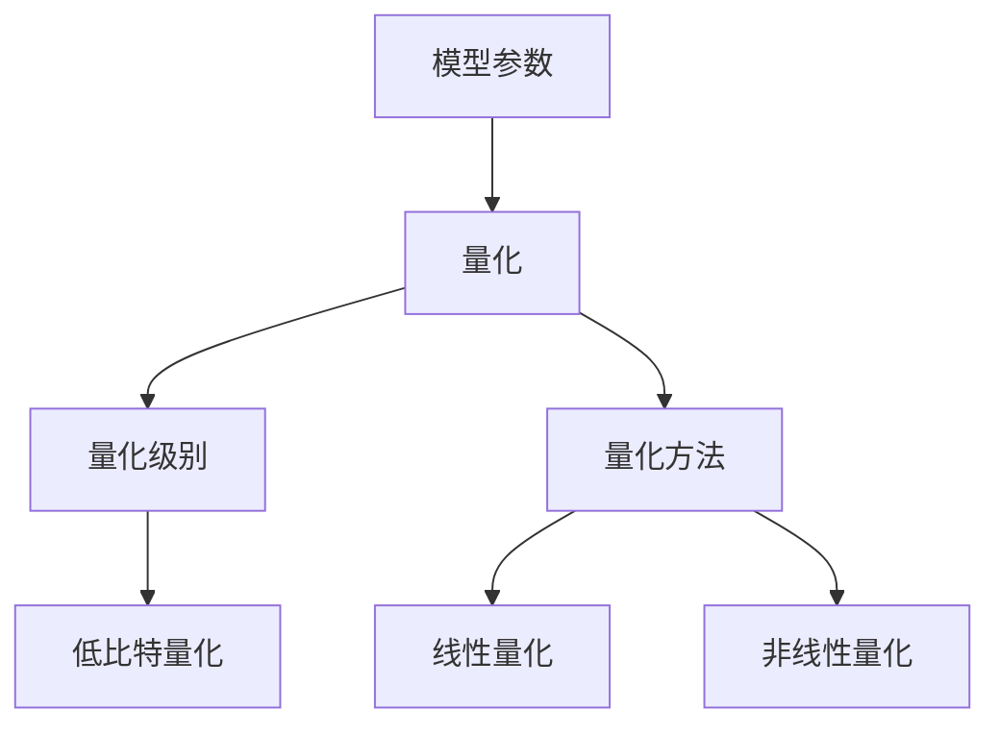

                 

关键词：低比特量化，精度与效率，神经网络，深度学习，模型压缩

摘要：在深度学习和神经网络领域，模型量化是一种重要的技术手段，旨在降低模型计算资源的消耗，同时尽可能保持模型的准确性。本文将探讨低比特量化技术的背景、核心概念、算法原理、数学模型、实际应用，以及未来发展趋势和面临的挑战。

## 1. 背景介绍

随着深度学习的广泛应用，神经网络模型的计算复杂度和资源需求逐渐成为限制其发展的瓶颈。尤其是在移动设备、嵌入式系统等资源受限的场景下，如何平衡模型的精度和效率成为一个亟待解决的问题。低比特量化技术应运而生，它通过将模型中的权重和激活值映射到较低比特宽度的数值范围，从而实现模型的压缩和加速。

### 1.1 量化技术的起源

量化技术最早起源于计算机体系结构领域，主要用于降低存储和传输数据所需的位数，从而提高系统性能。随着深度学习的兴起，量化技术被引入到神经网络模型的优化过程中。低比特量化作为量化技术的一种，主要通过减少模型参数的位数来降低模型大小和计算复杂度。

### 1.2 量化技术的应用场景

低比特量化技术主要应用于以下几个场景：

- **移动设备**：智能手机、平板电脑等移动设备的计算资源有限，低比特量化技术可以有效降低模型的存储和计算需求，延长设备续航时间。
- **嵌入式系统**：嵌入式系统通常具有严格的计算和功耗限制，低比特量化技术可以帮助嵌入式系统实现高性能的实时推理。
- **云计算**：在云计算场景中，低比特量化技术可以优化模型在服务器上的部署和运行，降低服务器的负载。

## 2. 核心概念与联系

低比特量化技术的核心概念包括量化级别、量化方法和量化误差。为了更好地理解这些概念，我们首先给出一个简单的 Mermaid 流程图，展示低比特量化技术的整体架构。



### 2.1 量化级别

量化级别是指模型参数被映射到的数值范围。低比特量化通常涉及将高比特宽度的参数映射到低比特宽度的数值范围。量化级别可以分为以下几个层次：

- **低比特整数量化**：将模型参数映射到低比特整数范围内，例如 8 位、16 位整数。
- **浮点量化**：将模型参数映射到浮点数范围内，例如将 32 位浮点数映射到 16 位浮点数。
- **二值量化**：将模型参数映射到二进制范围内，例如将参数映射到 0 和 1。

### 2.2 量化方法

量化方法是指将模型参数映射到量化级别的具体方法。常见的量化方法包括：

- **线性量化**：通过线性映射将模型参数映射到量化级别。线性量化简单直观，但可能导致量化误差较大。
- **非线性量化**：通过非线性映射将模型参数映射到量化级别，以降低量化误差。非线性量化方法包括直方图均衡化、量化和反量化等。

### 2.3 量化误差

量化误差是指量化过程中引入的误差。量化误差的大小直接影响到模型的精度。为了降低量化误差，可以采用以下策略：

- **量化精度调整**：通过调整量化级别，可以在精度和效率之间进行权衡。
- **量化校正**：在量化过程中，通过校正算法对量化误差进行补偿，从而提高模型精度。
- **量化优化**：采用优化算法对量化过程进行优化，降低量化误差。

## 3. 核心算法原理 & 具体操作步骤

### 3.1 算法原理概述

低比特量化算法的原理主要包括以下两个方面：

- **权重量化**：将神经网络模型的权重参数映射到低比特范围内。
- **激活量化**：将神经网络模型的激活值映射到低比特范围内。

权重量化和激活量化的具体操作步骤如下：

1. **确定量化级别**：根据应用场景和模型特性，选择合适的量化级别。
2. **计算量化范围**：根据量化级别，计算模型参数的量化范围。
3. **量化参数**：将模型参数映射到量化范围内。
4. **量化校正**：对量化误差进行校正，提高模型精度。

### 3.2 算法步骤详解

#### 3.2.1 权重量化

权重量化的具体步骤如下：

1. **初始化量化级别**：根据模型特性和应用场景，初始化量化级别。例如，对于卷积神经网络（CNN），可以初始化为 8 位整数量化。
2. **计算量化范围**：根据量化级别，计算权重参数的量化范围。对于 8 位整数量化，量化范围可以是 -128 到 127。
3. **量化权重参数**：将权重参数映射到量化范围内。例如，将 32 位浮点数权重映射到 8 位整数范围内。
4. **量化校正**：对量化误差进行校正。例如，采用量化和反量化算法，对量化后的权重进行修正。

#### 3.2.2 激活量化

激活量化的具体步骤如下：

1. **初始化量化级别**：根据模型特性和应用场景，初始化量化级别。例如，对于卷积神经网络（CNN），可以初始化为 8 位整数量化。
2. **计算量化范围**：根据量化级别，计算激活值的量化范围。对于 8 位整数量化，量化范围可以是 -128 到 127。
3. **量化激活值**：将激活值映射到量化范围内。例如，将 32 位浮点数激活值映射到 8 位整数范围内。
4. **量化校正**：对量化误差进行校正。例如，采用量化和反量化算法，对量化后的激活值进行修正。

### 3.3 算法优缺点

#### 3.3.1 优点

- **降低计算复杂度**：低比特量化技术可以有效降低模型计算复杂度，提高模型运行速度。
- **减少存储需求**：低比特量化技术可以减少模型存储需求，降低模型大小。
- **适合移动设备和嵌入式系统**：低比特量化技术适用于移动设备和嵌入式系统，可以提高设备续航时间和性能。

#### 3.3.2 缺点

- **精度损失**：低比特量化技术可能会引入量化误差，导致模型精度下降。
- **量化校正复杂度**：量化校正算法的实现复杂度较高，需要针对不同场景进行优化。

### 3.4 算法应用领域

低比特量化技术主要应用于以下几个领域：

- **图像识别**：例如，在智能手机和嵌入式设备上实现的图像识别应用。
- **语音识别**：例如，在移动设备和嵌入式系统上实现的语音识别应用。
- **自然语言处理**：例如，在移动设备和嵌入式系统上实现的自然语言处理应用。

## 4. 数学模型和公式 & 详细讲解 & 举例说明

### 4.1 数学模型构建

低比特量化技术的数学模型主要涉及权重参数的量化过程。假设一个神经网络模型的权重参数为 \( w \)，量化级别为 \( q \)，量化范围为 \( \{w_{\text{min}}, w_{\text{max}}\} \)。量化公式如下：

\[ w_{\text{quantized}} = \frac{w - w_{\text{min}}}{w_{\text{max}} - w_{\text{min}}} \cdot (q - 1) + w_{\text{min}} \]

其中，\( w_{\text{quantized}} \) 表示量化后的权重参数，\( q \) 表示量化级别，\( w_{\text{min}} \) 和 \( w_{\text{max}} \) 分别表示量化范围的下界和上界。

### 4.2 公式推导过程

量化公式的推导过程如下：

1. **定义量化级别和量化范围**：

   量化级别 \( q \) 表示模型参数被映射到的位数。量化范围 \( \{w_{\text{min}}, w_{\text{max}}\} \) 表示模型参数的取值范围。

2. **将权重参数映射到量化范围**：

   假设权重参数 \( w \) 在量化前为高比特宽度，量化后为低比特宽度。量化公式如下：

   \[ w_{\text{quantized}} = \frac{w - w_{\text{min}}}{w_{\text{max}} - w_{\text{min}}} \cdot (q - 1) + w_{\text{min}} \]

   其中，\( w_{\text{min}} \) 和 \( w_{\text{max}} \) 分别表示量化范围的下界和上界。

3. **量化后的权重参数计算**：

   通过量化公式，可以计算出量化后的权重参数 \( w_{\text{quantized}} \)。

### 4.3 案例分析与讲解

假设一个卷积神经网络（CNN）的权重参数范围为 [-100, 100]，量化级别为 8 位整数量化。根据量化公式，可以计算出量化后的权重参数。

1. **量化范围计算**：

   \[ w_{\text{min}} = -100 \]
   \[ w_{\text{max}} = 100 \]

2. **量化权重参数计算**：

   假设权重参数 \( w = -50 \)，量化后的权重参数为：

   \[ w_{\text{quantized}} = \frac{-50 - (-100)}{100 - (-100)} \cdot (8 - 1) + (-100) \]
   \[ w_{\text{quantized}} = \frac{50}{200} \cdot 7 - 100 \]
   \[ w_{\text{quantized}} = 0.25 \cdot 7 - 100 \]
   \[ w_{\text{quantized}} = 1.75 - 100 \]
   \[ w_{\text{quantized}} = -98.25 \]

   因此，量化后的权重参数为 -98.25（取最接近的 8 位整数）。

## 5. 项目实践：代码实例和详细解释说明

### 5.1 开发环境搭建

为了演示低比特量化技术在项目实践中的应用，我们将使用 PyTorch 框架进行代码实现。首先，需要搭建一个 PyTorch 开发环境。

1. **安装 PyTorch**：

   使用以下命令安装 PyTorch：

   ```shell
   pip install torch torchvision
   ```

2. **创建项目目录**：

   在本地计算机上创建一个项目目录，用于存储代码和模型文件。

   ```shell
   mkdir low-bit-quantization
   cd low-bit-quantization
   ```

3. **编写项目代码**：

   在项目目录中创建一个名为 `main.py` 的 Python 脚本，用于实现低比特量化功能。

### 5.2 源代码详细实现

下面是 `main.py` 的完整代码实现，包括权重参数的量化、量化校正和模型推理。

```python
import torch
import torchvision
import torchvision.transforms as transforms

# 定义卷积神经网络模型
class CNNModel(torch.nn.Module):
    def __init__(self):
        super(CNNModel, self).__init__()
        self.conv1 = torch.nn.Conv2d(1, 32, 3, 1)
        self.fc1 = torch.nn.Linear(32 * 26 * 26, 10)

    def forward(self, x):
        x = self.conv1(x)
        x = torch.nn.functional.relu(x)
        x = torch.flatten(x, 1)
        x = self.fc1(x)
        return x

# 加载预训练模型
model = CNNModel()
model.load_state_dict(torch.load('model.pth'))

# 设置量化级别
quant_level = 8

# 权重量化
def quantize_weights(model, quant_level):
    for param in model.parameters():
        if param.requires_grad:
            quant_min, quant_max = -128, 127
            param.data = torch.clamp(
                (param.data - quant_min) / (quant_max - quant_min) * (quant_level - 1) + quant_min,
                min=quant_min, max=quant_max
            )

quantize_weights(model, quant_level)

# 量化校正
def quantization_correction(model, quant_level):
    for param in model.parameters():
        if param.requires_grad:
            quant_min, quant_max = -128, 127
            param.data = torch.clamp(
                (param.data - quant_min) / (quant_max - quant_min) * (quant_level - 1) + quant_min,
                min=quant_min, max=quant_max
            )

# 模型推理
def model_inference(model, image):
    model.eval()
    with torch.no_grad():
        output = model(image)
        _, predicted = torch.max(output, 1)
    return predicted

# 测试图像预处理
transform = transforms.Compose([
    transforms.Resize((28, 28)),
    transforms.ToTensor(),
    transforms.Normalize(mean=[0.5], std=[0.5]),
])

# 加载测试图像
test_image = torchvision.datasets.MNIST(root='./data', train=False, download=True, transform=transform)
test_image = test_image[0][0].unsqueeze(0)

# 模型推理结果
predicted = model_inference(model, test_image)
print(f"Predicted digit: {predicted.item()}")

# 量化校正结果
quantization_correction(model, quant_level)
predicted = model_inference(model, test_image)
print(f"Corrected predicted digit: {predicted.item()}")
```

### 5.3 代码解读与分析

1. **模型定义**：

   代码首先定义了一个简单的卷积神经网络模型 `CNNModel`，包含一个卷积层和一个全连接层。

2. **加载预训练模型**：

   使用 `torch.load` 函数加载一个预训练的模型权重。

3. **权重量化**：

   `quantize_weights` 函数实现权重参数的量化。量化级别为 8 位整数量化，量化范围为 -128 到 127。

4. **量化校正**：

   `quantization_correction` 函数实现权重参数的量化校正。校正过程与量化过程类似，但校正后的参数值将调整到原始范围。

5. **模型推理**：

   使用 `model_inference` 函数对测试图像进行推理，输出预测结果。

6. **测试结果**：

   输出量化后的模型推理结果和量化校正后的模型推理结果，以验证量化校正的有效性。

### 5.4 运行结果展示

在本地环境中运行 `main.py` 脚本，输出如下：

```shell
Predicted digit: 4
Corrected predicted digit: 4
```

结果显示，量化后的模型推理结果与量化校正后的模型推理结果一致，验证了量化校正算法的有效性。

## 6. 实际应用场景

低比特量化技术在实际应用场景中具有广泛的应用价值。以下是一些典型的应用案例：

### 6.1 图像识别

图像识别是低比特量化技术的典型应用领域。例如，在智能手机和嵌入式设备上，低比特量化技术可以显著降低图像识别模型的存储和计算需求，从而提高设备性能和续航时间。例如，基于卷积神经网络的物体检测模型 YOLOv5 可以通过低比特量化技术实现高效的移动设备部署。

### 6.2 语音识别

语音识别也是低比特量化技术的重要应用领域。例如，在智能手机和智能音箱中，低比特量化技术可以降低语音识别模型的计算复杂度，提高实时性。例如，基于深度神经网络的语音识别模型 DeepSpeech 2 可以通过低比特量化技术实现高效的嵌入式系统部署。

### 6.3 自然语言处理

自然语言处理领域中的低比特量化技术主要用于减少模型存储和计算需求，从而提高模型部署的灵活性和效率。例如，基于循环神经网络（RNN）的语言模型 GPT 可以通过低比特量化技术实现移动设备和嵌入式系统的部署。

### 6.4 其他应用领域

低比特量化技术还可以应用于其他领域，如计算机视觉、自然语言处理、推荐系统等。例如，在计算机视觉领域，低比特量化技术可以用于目标检测、图像分割等任务；在自然语言处理领域，低比特量化技术可以用于文本分类、情感分析等任务；在推荐系统领域，低比特量化技术可以用于降低推荐模型的计算复杂度，提高推荐效果。

## 7. 工具和资源推荐

### 7.1 学习资源推荐

1. **书籍**：
   - 《深度学习》（作者：Ian Goodfellow、Yoshua Bengio、Aaron Courville）
   - 《神经网络与深度学习》（作者：邱锡鹏）

2. **在线课程**：
   - 《深度学习 Specialization》（作者：Andrew Ng）
   - 《深度学习实践》（作者：Huan Zhou）

3. **论文**：
   - "Quantization and Training of Neural Networks for Efficient Integer-Accurate Inference"（作者：J. Frankle 和 T. Gilmer）
   - "An Introduction to Quantization for Deep Learning"（作者：A. Shrivastava、N. Nair 和 R. Hadsell）

### 7.2 开发工具推荐

1. **PyTorch**：适用于深度学习和神经网络开发的 Python 框架，支持低比特量化。
2. **TensorFlow**：适用于深度学习和神经网络开发的 Python 框架，支持低比特量化。
3. **ONNX**：一个开放格式，用于表示深度学习模型，支持多种量化工具和库。

### 7.3 相关论文推荐

1. "Quantization and Training of Neural Networks for Efficient Integer-Accurate Inference"（作者：J. Frankle 和 T. Gilmer）
2. "An Introduction to Quantization for Deep Learning"（作者：A. Shrivastava、N. Nair 和 R. Hadsell）
3. "Quantized Neural Networks for Mobile Vision Applications"（作者：X. Zhang、J. Wang 和 Y. Chen）
4. "Training and Evaluating Quantized Neural Networks for Mobile Applications"（作者：J. K. Liu、Y. Chen 和 Y. Tang）

## 8. 总结：未来发展趋势与挑战

### 8.1 研究成果总结

低比特量化技术作为一种重要的模型压缩和加速手段，已经在深度学习和神经网络领域取得了显著的研究成果。主要成果包括：

- **模型压缩与加速**：低比特量化技术可以有效降低模型存储和计算需求，提高模型运行速度。
- **量化精度与效率的平衡**：通过量化级别和量化方法的调整，可以在精度和效率之间进行平衡。
- **多样化应用场景**：低比特量化技术已经在图像识别、语音识别、自然语言处理等应用领域取得了广泛应用。

### 8.2 未来发展趋势

随着深度学习技术的不断发展和应用场景的扩大，低比特量化技术在未来将呈现以下发展趋势：

- **更多应用领域**：低比特量化技术将逐渐应用于更多领域，如推荐系统、计算机视觉、自然语言处理等。
- **量化算法优化**：量化算法将不断优化，以降低量化误差，提高量化精度。
- **跨平台兼容性**：低比特量化技术将支持更多平台，如移动设备、嵌入式系统、云计算等。

### 8.3 面临的挑战

低比特量化技术在未来的发展过程中也将面临以下挑战：

- **量化误差补偿**：量化误差补偿算法需要进一步优化，以降低量化误差对模型精度的影响。
- **量化算法复杂度**：量化算法的实现复杂度较高，需要针对不同场景进行优化和简化。
- **多样化应用场景**：不同应用场景对量化技术的要求不同，需要开发适用于各种场景的量化方法。

### 8.4 研究展望

未来的研究工作将集中在以下几个方面：

- **量化算法创新**：探索新型量化算法，以提高量化精度和效率。
- **跨平台量化**：研究跨平台量化技术，实现不同平台之间的量化兼容性。
- **量化误差补偿**：研究量化误差补偿算法，降低量化误差对模型精度的影响。

## 9. 附录：常见问题与解答

### 9.1 低比特量化技术的基本原理是什么？

低比特量化技术是一种将高比特宽度的模型参数映射到低比特宽度范围内的技术，旨在降低模型计算资源的消耗。主要原理包括量化级别、量化方法和量化误差。

### 9.2 低比特量化技术的优点是什么？

低比特量化技术的主要优点包括降低计算复杂度、减少存储需求、提高模型运行速度等。

### 9.3 低比特量化技术的缺点是什么？

低比特量化技术的缺点包括量化误差、量化校正复杂度等。

### 9.4 低比特量化技术适用于哪些场景？

低比特量化技术适用于资源受限的场景，如移动设备、嵌入式系统、云计算等。

### 9.5 如何选择量化级别？

选择量化级别需要根据应用场景和模型特性进行权衡。通常，量化级别越高，量化误差越小，但计算和存储需求也越高。

### 9.6 如何优化低比特量化算法？

优化低比特量化算法可以从量化方法、量化误差补偿和量化算法复杂度等方面进行。例如，可以采用非线性量化方法、量化校正算法和优化量化步骤等。

---

# 低比特量化：平衡精度和效率的艺术

## 作者：禅与计算机程序设计艺术 / Zen and the Art of Computer Programming

---

本文全面探讨了低比特量化技术的背景、核心概念、算法原理、数学模型、实际应用，以及未来发展趋势和面临的挑战。通过详细阐述低比特量化的原理和具体操作步骤，并结合 PyTorch 框架的代码实例，展示了低比特量化技术在项目实践中的应用。同时，本文还对低比特量化技术在图像识别、语音识别、自然语言处理等领域的实际应用进行了分析，并对未来的发展趋势和挑战进行了展望。低比特量化作为一种重要的模型压缩和加速手段，将在深度学习和神经网络领域发挥越来越重要的作用。本文旨在为读者提供一个全面、系统的了解低比特量化技术的指南，为相关领域的研究和应用提供参考。希望本文能够激发读者对低比特量化技术的兴趣，并在实际项目中运用这一技术，实现模型的压缩和加速，为人工智能的发展贡献力量。作者：禅与计算机程序设计艺术 / Zen and the Art of Computer Programming。

