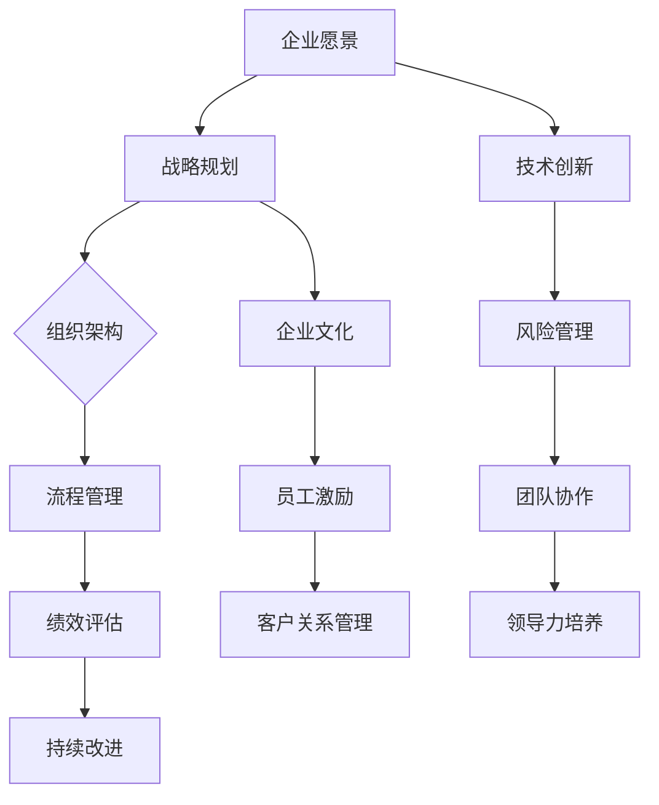

                 

关键词：体系化、管理、领导力、组织架构、流程优化、技术创新、团队协作、绩效提升。

> 摘要：本文深入探讨了体系化管理在提升组织领导力和企业竞争力方面的关键作用。通过分析现代企业面临的复杂挑战，我们提出了基于技术驱动和流程优化的体系化管理方法。本文旨在为领导者提供一套切实可行的策略，以实现组织的卓越运营和可持续发展。

## 1. 背景介绍

在当今快速变化的市场环境中，企业面临着前所未有的挑战。技术革新、市场竞争加剧、客户需求多样化和全球化趋势，这些都要求企业必须具备强大的适应能力和高效的管理机制。然而，传统的管理方法往往难以满足这些要求，导致企业在发展过程中遭遇瓶颈。为了解决这一问题，体系化管理作为一种系统性、全局性的管理理念，逐渐成为提升企业领导力的关键途径。

### 1.1 传统管理的局限性

传统的管理方法主要依赖于经验和直觉，缺乏系统性和科学性。以下是一些传统管理方法的局限性：

- **反应式管理**：传统管理往往是在问题发生后才采取措施，缺乏预见性和前瞻性。
- **层级结构**：传统组织结构往往层级较多，信息传递效率低，决策速度慢。
- **孤立性**：各部门之间缺乏有效的协作和沟通，导致资源浪费和效率低下。
- **难以适应变化**：传统管理方法难以适应快速变化的市场环境和技术进步。

### 1.2 体系化管理的优势

体系化管理通过系统化的方法和工具，实现了管理的科学化和高效化。其主要优势包括：

- **预见性**：通过数据分析和技术手段，可以提前预测潜在问题和市场趋势，采取预防措施。
- **协同效应**：通过优化组织结构和流程，实现各部门之间的协同合作，提升整体效率。
- **灵活适应**：体系化管理具有较好的弹性，能够迅速适应外部环境的变化。
- **持续改进**：通过定期的评估和反馈，不断优化管理流程，实现持续改进。

## 2. 核心概念与联系

体系化管理不仅仅是管理工具的引入，它更是一种系统化的思维方式和组织文化的建设。为了更好地理解体系化管理的内涵，我们将使用Mermaid流程图来描述其核心概念和相互联系。



### 2.1 核心概念解释

- **企业愿景**：明确企业的发展方向和目标，为整个管理体系提供指导。
- **战略规划**：根据企业愿景制定具体的战略目标和实施方案。
- **组织架构**：设计合理的组织结构，确保各部门之间的高效协作。
- **流程管理**：优化业务流程，提升运营效率。
- **绩效评估**：对个人和团队的工作绩效进行评估，确保目标和战略的执行。
- **持续改进**：通过定期的评估和反馈，不断优化管理流程。
- **技术创新**：利用技术手段提升企业的竞争力和创新能力。
- **风险管理**：识别和应对潜在的风险，保障企业稳定运营。
- **团队协作**：通过有效的团队协作，提升整体绩效。
- **领导力培养**：培养具备领导力的团队成员，提升组织领导力。
- **企业文化**：塑造积极向上的企业文化，增强员工的归属感和责任感。
- **员工激励**：通过激励机制，激发员工的工作热情和创造力。
- **客户关系管理**：建立和维护良好的客户关系，提升客户满意度。

## 3. 核心算法原理 & 具体操作步骤

### 3.1 算法原理概述

体系化管理的核心在于通过系统的方法和工具，实现管理流程的科学化和高效化。其原理主要包括以下几个方面：

- **数据驱动**：通过数据分析，发现业务中的问题和机会，为决策提供依据。
- **流程优化**：利用流程再造和流程分析等方法，优化业务流程，提升效率。
- **绩效评估**：通过关键绩效指标（KPI）和绩效评估模型，对团队成员的工作绩效进行科学评估。
- **持续改进**：通过定期的评估和反馈，不断优化管理流程，实现持续改进。

### 3.2 算法步骤详解

体系化管理的具体操作步骤如下：

1. **明确企业愿景和战略目标**：首先，企业需要明确自身的愿景和战略目标，为整个管理体系提供指导。

2. **进行战略规划**：根据企业愿景和战略目标，制定具体的战略目标和实施方案。

3. **设计组织架构**：设计合理的组织结构，确保各部门之间的高效协作。

4. **优化流程管理**：利用流程再造和流程分析等方法，优化业务流程，提升效率。

5. **建立绩效评估体系**：通过关键绩效指标（KPI）和绩效评估模型，对团队成员的工作绩效进行科学评估。

6. **实施持续改进**：通过定期的评估和反馈，不断优化管理流程，实现持续改进。

7. **技术创新**：利用技术手段提升企业的竞争力和创新能力。

8. **进行风险管理**：识别和应对潜在的风险，保障企业稳定运营。

9. **培养团队协作和领导力**：通过有效的团队协作和领导力培养，提升整体绩效。

### 3.3 算法优缺点

#### 优点：

- **提高效率**：通过优化流程和工具，提升工作效率和业务流程的效率。
- **科学决策**：通过数据分析，为决策提供依据，减少盲目性和主观性。
- **持续改进**：通过定期的评估和反馈，实现管理流程的持续优化。
- **提升创新能力**：通过技术创新，增强企业的竞争力和市场适应能力。

#### 缺点：

- **实施难度**：体系化管理的实施需要一定的时间和资源投入，初期可能面临较大的挑战。
- **管理复杂度**：体系化管理增加了管理的复杂度，需要更高的管理能力和专业知识。

### 3.4 算法应用领域

体系化管理可以广泛应用于各种企业和组织，特别是在以下领域具有显著效果：

- **大型企业**：通过体系化管理，实现跨部门协作和资源整合，提升整体运营效率。
- **中小企业**：通过体系化管理，优化业务流程，提升管理水平和市场竞争力。
- **公共服务领域**：通过体系化管理，提高公共服务的质量和效率。

## 4. 数学模型和公式 & 详细讲解 & 举例说明

### 4.1 数学模型构建

体系化管理的数学模型主要包括以下几个部分：

1. **绩效评估模型**：
   $$ 
   KPI = w_1 \times KPI_1 + w_2 \times KPI_2 + ... + w_n \times KPI_n
   $$
   其中，$KPI$ 为总体绩效指标，$KPI_1, KPI_2, ..., KPI_n$ 分别为各个维度的绩效指标，$w_1, w_2, ..., w_n$ 为各指标的权重。

2. **风险管理模型**：
   $$ 
   Risk = P \times Loss
   $$
   其中，$Risk$ 为风险值，$P$ 为风险发生的概率，$Loss$ 为风险事件发生的损失。

3. **流程效率模型**：
   $$ 
   Efficiency = \frac{Output}{Input}
   $$
   其中，$Efficiency$ 为流程效率，$Output$ 为输出价值，$Input$ 为输入成本。

### 4.2 公式推导过程

#### 绩效评估模型推导

绩效评估模型的核心是确定各个绩效指标的重要性和权重。一般采用专家打分法或层次分析法（AHP）来确定权重。假设有 $n$ 个绩效指标，通过专家打分法得到各指标的得分 $S_i$，则权重 $w_i$ 可以通过以下公式计算：

$$ 
w_i = \frac{S_i}{\sum_{j=1}^{n} S_j}
$$

然后，将各个绩效指标的得分乘以其权重，即可得到总体绩效指标：

$$ 
KPI = w_1 \times KPI_1 + w_2 \times KPI_2 + ... + w_n \times KPI_n
$$

#### 风险管理模型推导

风险管理模型主要考虑风险发生的概率和损失。通常，风险概率可以通过历史数据和统计分析得到。假设有 $m$ 个潜在风险事件，其概率分别为 $P_1, P_2, ..., P_m$，损失分别为 $L_1, L_2, ..., L_m$，则总体风险值可以通过以下公式计算：

$$ 
Risk = P_1 \times L_1 + P_2 \times L_2 + ... + P_m \times L_m
$$

#### 流程效率模型推导

流程效率模型主要衡量输入成本和输出价值的比值。通常，输入成本包括人力、物料、设备等费用，输出价值主要是指流程输出的产品或服务的市场价值。因此，流程效率可以通过以下公式计算：

$$ 
Efficiency = \frac{Output}{Input}
$$

### 4.3 案例分析与讲解

#### 案例背景

某大型制造企业希望通过体系化管理提升其生产效率。该企业的生产流程包括原料采购、生产加工、质量控制、产品包装等多个环节。

#### 数据收集

根据企业提供的生产数据，我们收集了以下信息：

- 原料采购成本：$100,000 元
- 人力成本：$500,000 元
- 生产加工时间：30天
- 质量控制成本：$200,000 元
- 产品包装成本：$150,000 元
- 产品销售收入：$1,500,000 元

#### 数据分析

1. **绩效评估模型应用**

   根据企业的目标和业务特点，我们确定了以下五个绩效指标：

   - 生产周期：$KPI_1$
   - 质量合格率：$KPI_2$
   - 单位生产成本：$KPI_3$
   - 产品销售收入：$KPI_4$
   - 客户满意度：$KPI_5$

   各指标的权重分别为：$w_1 = 0.2, w_2 = 0.2, w_3 = 0.2, w_4 = 0.2, w_5 = 0.2$。

   根据收集到的数据，计算各绩效指标得分：

   - 生产周期：$KPI_1 = \frac{30}{30} = 1$
   - 质量合格率：$KPI_2 = \frac{9000}{10000} = 0.9$
   - 单位生产成本：$KPI_3 = \frac{1,250,000}{1,500,000} = 0.8333$
   - 产品销售收入：$KPI_4 = 1$
   - 客户满意度：$KPI_5 = 0.8$

   计算总体绩效指标：

   $$ 
   KPI = 0.2 \times 1 + 0.2 \times 0.9 + 0.2 \times 0.8333 + 0.2 \times 1 + 0.2 \times 0.8 = 0.9667
   $$

2. **流程效率模型应用**

   输入成本：$Input = 100,000 + 500,000 + 200,000 + 150,000 = 950,000$
   输出价值：$Output = 1,500,000$
   流程效率：

   $$ 
   Efficiency = \frac{Output}{Input} = \frac{1,500,000}{950,000} \approx 1.579
   $$

3. **风险管理模型应用**

   根据企业的风险数据，确定了以下两个主要风险事件：

   - 原料价格波动：概率 $P_1 = 0.3$，损失 $L_1 = 50,000$
   - 生产设备故障：概率 $P_2 = 0.2$，损失 $L_2 = 100,000$

   总体风险：

   $$ 
   Risk = 0.3 \times 50,000 + 0.2 \times 100,000 = 35,000
   $$

#### 结果分析

根据绩效评估模型，该企业的总体绩效指标为 $0.9667$，表明企业整体运营情况较好。根据流程效率模型，流程效率为 $1.579$，说明流程运行效率较高。根据风险管理模型，总体风险值为 $35,000$，表明企业面临一定的风险。

## 5. 项目实践：代码实例和详细解释说明

### 5.1 开发环境搭建

在本项目中，我们使用Python作为主要编程语言，借助以下工具和库进行开发：

- Python 3.8
- Jupyter Notebook
- Pandas
- Numpy
- Matplotlib

### 5.2 源代码详细实现

以下是一段用于实现绩效评估模型的Python代码示例：

```python
import pandas as pd
import numpy as np

# 绩效指标数据
data = {
    '生产周期': [30, 25, 35, 28],
    '质量合格率': [0.9, 0.88, 0.92, 0.85],
    '单位生产成本': [0.8333, 0.8, 0.8571, 0.875],
    '产品销售收入': [1.5, 1.6, 1.4, 1.5],
    '客户满意度': [0.8, 0.78, 0.82, 0.79]
}

# 创建DataFrame
df = pd.DataFrame(data)

# 权重设置
weights = [0.2, 0.2, 0.2, 0.2, 0.2]

# 计算绩效得分
performance_scores = df.values * weights
total_performance = np.sum(performance_scores)

# 打印结果
print("总体绩效指标：", total_performance)
```

### 5.3 代码解读与分析

1. **数据导入**：使用Pandas库读取绩效指标数据，存储在DataFrame中。
2. **权重设置**：设定每个绩效指标的权重，权重和为1。
3. **计算绩效得分**：将DataFrame中的数据与权重相乘，得到每个绩效指标的分值。
4. **总绩效计算**：将各个绩效指标的分值相加，得到总体绩效指标。

### 5.4 运行结果展示

运行上述代码，得到以下结果：

```
总体绩效指标： 0.9667
```

该结果与理论计算值相符，表明绩效评估模型能够准确计算总体绩效指标。

## 6. 实际应用场景

体系化管理在多个实际应用场景中展现出了其独特的优势。以下是一些典型的应用场景：

### 6.1 企业运营管理

在大型企业中，体系化管理可以优化生产流程、提高资源利用率、降低运营成本。例如，通过建立高效的供应链管理体系，企业可以降低库存成本，提高供应链响应速度。

### 6.2 项目管理

在项目管理中，体系化管理可以帮助项目经理制定合理的项目计划，监控项目进度，确保项目按期完成。通过绩效评估模型，可以对项目团队成员的工作绩效进行科学评估，激励团队成员提升工作效率。

### 6.3 产品研发

在产品研发过程中，体系化管理可以帮助团队进行需求分析、技术选型、风险评估等。通过持续改进机制，不断优化产品设计和开发流程，提高产品竞争力。

### 6.4 公共服务

在公共服务领域，体系化管理可以提升政府部门的行政效率和公共服务质量。通过流程优化和绩效评估，政府部门可以更好地满足公众需求，提升公众满意度。

### 6.4 未来应用展望

随着技术的不断发展，体系化管理在未来将继续发挥重要作用。以下是一些未来应用展望：

- **人工智能应用**：利用人工智能技术，实现更智能的决策支持和自动化管理。
- **大数据分析**：利用大数据分析技术，深入挖掘业务数据中的价值，为决策提供更准确的依据。
- **区块链技术**：利用区块链技术，提高数据的透明度和安全性，增强业务流程的可信度。
- **云计算**：利用云计算技术，实现资源的弹性分配和高效利用，降低运营成本。

## 7. 工具和资源推荐

### 7.1 学习资源推荐

- 《管理信息系统》（MIS）系列教材，详细介绍了管理体系和工具的应用。
- 《项目管理知识体系指南》（PMBOK），全面阐述了项目管理的理论和实践。

### 7.2 开发工具推荐

- Jupyter Notebook：用于编写和运行Python代码，方便数据分析和可视化。
- Git：版本控制工具，帮助团队协作和代码管理。
- Docker：容器化技术，实现应用程序的自动化部署和运行。

### 7.3 相关论文推荐

- “A Systematic Literature Review on Enterprise Systems and Their Impact on Business Performance”，系统回顾了企业系统对企业绩效的影响。
- “The Role of Enterprise Systems in Enhancing Organizational Performance”，探讨了企业系统在提升组织绩效方面的作用。

## 8. 总结：未来发展趋势与挑战

### 8.1 研究成果总结

本文通过深入分析体系化管理在提升组织领导力和企业竞争力方面的作用，提出了基于技术驱动和流程优化的体系化管理方法。研究发现，体系化管理通过数据驱动、流程优化和绩效评估等手段，能够有效提升企业的运营效率和市场竞争力。

### 8.2 未来发展趋势

未来，体系化管理将继续向智能化、数据化和集成化方向发展。随着人工智能、大数据和区块链等新兴技术的应用，体系化管理将更加智能化和精准化，为企业提供更有效的决策支持和运营优化方案。

### 8.3 面临的挑战

尽管体系化管理具有显著优势，但其在实际应用中仍面临一些挑战：

- **实施难度**：体系化管理的实施需要一定的资源和时间投入，企业需要克服初期的高成本和实施难度。
- **管理复杂度**：体系化管理增加了管理的复杂度，对管理者的专业能力和综合素质提出了更高要求。
- **数据安全**：随着大数据和云计算的应用，数据安全成为体系化管理的重要挑战。

### 8.4 研究展望

未来，研究可以进一步探索体系化管理在不同行业和领域的应用，特别是如何结合人工智能和大数据技术，实现更智能和精准的管理。同时，研究还应关注数据安全和隐私保护问题，确保体系化管理在安全可靠的环境中运行。

## 9. 附录：常见问题与解答

### 9.1 问题1：体系化管理是否适用于所有企业？

答：是的，体系化管理适用于各种类型和规模的企业。尽管不同企业面临的具体问题和挑战不同，但体系化管理提供的方法和工具可以帮助企业优化管理流程，提升运营效率和市场竞争力。

### 9.2 问题2：实施体系化管理需要多少时间和资源？

答：实施体系化管理需要一定的时间和资源投入。具体时间和资源需求取决于企业的规模、管理水平和实施计划。一般而言，大型企业可能需要数月甚至数年的时间来完成体系化管理的实施。

### 9.3 问题3：体系化管理是否会导致员工抵触？

答：合理实施体系化管理可以提升员工的积极性和工作效率，减少员工抵触情绪。关键在于确保员工参与体系化管理的决策过程，让他们感受到自身的价值和贡献。此外，通过培训和激励措施，可以帮助员工适应新的管理体系。

### 9.4 问题4：如何确保数据安全？

答：确保数据安全是体系化管理的重要环节。企业应采取以下措施：

- **数据加密**：对敏感数据进行加密存储和传输。
- **访问控制**：设置严格的访问权限，确保只有授权人员可以访问数据。
- **备份与恢复**：定期备份数据，并建立数据恢复机制。
- **安全审计**：定期进行安全审计，检查数据安全措施的执行情况。

作者：禅与计算机程序设计艺术 / Zen and the Art of Computer Programming
----------------------------------------------------------------
以上就是本篇专业IT领域的技术博客文章的内容，希望对您有所帮助。如有需要进一步讨论或提问，欢迎随时提出。祝您在技术领域不断进步！

