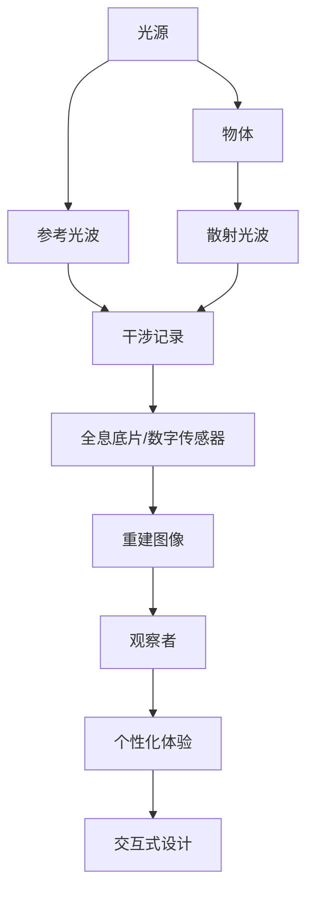

                 

### 1. 背景介绍

全息图技术，作为一门将三维图像还原至现实的技术，近年来随着计算机视觉、人工智能和数字化的飞速发展，正逐渐走入我们的日常生活。传统二维图像无法完全呈现物体的立体感和深度感，而全息图则能完美地解决这一问题。通过捕捉光波的干涉和衍射现象，全息图能够在特定的观察角度和光线下呈现出三维立体的视觉效果。

随着全息技术的进步，AI在其中的应用也越来越广泛。AI不仅可以优化全息图的生成过程，还可以通过深度学习算法分析用户的观察行为，提供个性化的全息体验。这不仅为全息图设计师提供了强大的工具，也为用户体验的提升带来了新的可能。

本文将探讨AI在多感官融合技术中的关键角色，以及如何通过全息图设计实现这一目标。我们将从全息图技术的核心概念入手，详细解析其工作原理和应用领域，接着深入讨论AI在其中的应用，包括核心算法原理、具体操作步骤、数学模型和项目实践。最后，我们将展望全息图技术的未来发展方向和面临的挑战。

### 2. 核心概念与联系

在探讨全息图技术的核心概念之前，我们需要了解一些基本的光学和图像处理知识。全息图，本质上是一种记录光波相位和振幅信息的图像。通过记录和重建光波的全息图，我们可以在特定条件下观察到三维图像。

#### 2.1 全息图的基本原理

全息图的生成通常涉及以下几个关键步骤：

1. **光源照射**：首先，一个物体被单色光源照射，物体表面的散射光波将记录下来。
2. **干涉记录**：物体散射的光波与参考光波（通常也是单色光）发生干涉，形成一个复杂的干涉图样，这个过程被记录在全息底片上或数字传感器上。
3. **重建图像**：通过重建算法，将记录的全息图转换为三维图像。观察者通过特定的观察角度和光源，可以看到三维立体的图像。

#### 2.2 AI在多感官融合中的角色

AI在多感官融合技术中的角色至关重要。以下是AI在其中的几个关键应用：

1. **全息图的优化生成**：AI可以通过深度学习算法自动优化全息图的生成过程，提高图像的质量和清晰度。
2. **个性化体验**：AI可以通过分析用户的观察行为，提供个性化的全息体验。例如，当用户对某个物体感兴趣时，AI可以增强该物体的视觉效果，或者调整观察角度，以提供更佳的视觉体验。
3. **交互式设计**：AI可以设计交互式全息界面，使用户能够通过手势、语音等方式与全息图像进行互动。

#### 2.3 多感官融合的架构图

以下是多感官融合技术的架构图，其中包含了核心概念和AI的应用：



在这个架构图中，光源、物体和观察者是多感官融合的基本元素，而AI则通过优化、个性化和交互设计，将这些元素有机结合，提供更丰富的全息体验。

### 3. 核心算法原理 & 具体操作步骤

在深入探讨全息图设计的过程中，核心算法原理扮演了至关重要的角色。这些算法不仅决定了全息图的生成质量，还影响了用户的全息体验。以下是对这些算法的概述和具体操作步骤。

#### 3.1 算法原理概述

全息图的生成主要依赖于两个核心算法：干涉记录算法和图像重建算法。干涉记录算法负责捕捉物体表面的光波信息，并将其转换为数字信号存储。图像重建算法则根据存储的全息信息，生成三维图像。

#### 3.2 干涉记录算法

干涉记录算法的基本原理是利用光波的干涉现象。具体操作步骤如下：

1. **光源照射**：使用单色光源照射物体，确保物体表面反射的光波为单色光。
2. **光波干涉**：物体表面的散射光波与参考光波（同样为单色光）在特定位置发生干涉，形成干涉图样。
3. **信号记录**：将干涉图样记录在全息底片或数字传感器上。这个过程通常通过数字图像传感器完成，传感器将光信号转换为数字信号，存储在全息图中。

#### 3.3 图像重建算法

图像重建算法负责将存储的全息信息转化为三维图像。以下是图像重建的基本步骤：

1. **全息图读取**：从全息底片或数字传感器中读取全息图数据。
2. **信号处理**：对读取的全息图进行信号处理，包括去噪、对比度增强等。
3. **相位重建**：通过计算全息图中的相位信息，重建光波的相位分布。
4. **图像生成**：根据重建的光波相位分布，使用图像渲染算法生成三维图像。

#### 3.4 算法优缺点

干涉记录算法的优点在于其能够精确记录物体表面的光波信息，生成高质量的全息图。然而，其缺点是设备要求较高，需要单色光源和精确的干涉记录装置。

图像重建算法的优点是能够将存储的全息信息转化为直观的三维图像，使观察者能够体验到立体效果。然而，其缺点是重建过程较为复杂，对计算资源和算法优化要求较高。

#### 3.5 算法应用领域

干涉记录算法和图像重建算法在多个领域有着广泛的应用，包括：

- **医疗影像**：通过全息图技术，医生可以更直观地观察病患的内部结构，辅助诊断和治疗。
- **虚拟现实**：全息图技术为虚拟现实提供了更真实的视觉体验，使用户能够沉浸在虚拟环境中。
- **广告与展示**：全息图技术能够吸引观众的注意力，提升广告和展示的效果。

### 4. 数学模型和公式 & 详细讲解 & 举例说明

在理解全息图的核心算法之后，我们接下来将探讨其背后的数学模型和公式。这些模型和公式不仅为算法提供了理论基础，也帮助我们在实践中优化全息图的生成和重建过程。

#### 4.1 数学模型构建

全息图的数学模型主要涉及干涉和衍射理论。以下是构建数学模型的基本步骤：

1. **波前描述**：首先，我们需要描述物体表面散射的光波。光波可以用复数形式的波前描述，通常表示为：
   $$ E(x, y) = A(x, y) e^{i(\omega t - k \cdot r)} $$
   其中，$E(x, y)$ 是光波的复振幅，$A(x, y)$ 是振幅，$\omega$ 是角频率，$k$ 是波数，$r$ 是光程。

2. **干涉记录**：在记录全息图时，我们需要考虑物体散射光波与参考光波的干涉。干涉图样的强度可以用以下公式描述：
   $$ I = |E_{物体} + E_{参考}|^2 = |E_{物体}|^2 + |E_{参考}|^2 + 2|E_{物体}||E_{参考}| \cos(\phi) $$
   其中，$\phi$ 是两光波的相位差。

3. **全息图存储**：将干涉图样记录在全息底片或数字传感器上，通常表示为数字信号：
   $$ D(u, v) = \frac{1}{I_0} \int I(x, y) e^{-i 2\pi \frac{u x + v y}{d}} dx dy $$
   其中，$D(u, v)$ 是数字信号，$I_0$ 是入射光强度，$d$ 是记录装置与物体之间的距离。

#### 4.2 公式推导过程

以下是干涉记录和全息图存储的公式推导过程：

1. **波前叠加**：
   考虑物体表面散射光波$E_{物体}$和参考光波$E_{参考}$，它们在空间中某点P的叠加可以表示为：
   $$ E_P = E_{物体} + E_{参考} = A_{物体} e^{i(\omega t - k r_{物体})} + A_{参考} e^{i(\omega t - k r_{参考})} $$

2. **相位差**：
   根据两光波传播路径的不同，它们在空间P点的相位差为：
   $$ \phi = k (r_{物体} - r_{参考}) $$

3. **干涉强度**：
   干涉图样的强度可以表示为：
   $$ I = |E_P|^2 = |A_{物体} + A_{参考}|^2 = |A_{物体}|^2 + |A_{参考}|^2 + 2|A_{物体}||A_{参考}| \cos(\phi) $$

4. **全息图存储**：
   将干涉图样记录在数字传感器上，可以通过对整个空间积分得到数字信号：
   $$ D(u, v) = \frac{1}{I_0} \int I(x, y) e^{-i 2\pi \frac{u x + v y}{d}} dx dy $$
   其中，$I_0$ 是入射光强度，$d$ 是记录装置与物体之间的距离。

#### 4.3 案例分析与讲解

为了更好地理解上述数学模型和公式，我们来看一个简单的例子。假设我们有一个简单的物体，其表面反射的光波可以近似为一个高斯光束。我们可以通过以下步骤计算该物体的全息图：

1. **波前描述**：
   高斯光束的波前可以用以下公式描述：
   $$ E(x, y) = A e^{-\frac{(x^2 + y^2)}{2w^2}} $$
   其中，$A$ 是振幅，$w$ 是光束宽度。

2. **干涉记录**：
   假设参考光束的波前为：
   $$ E_{参考}(x, y) = A_{参考} e^{-\frac{(x^2 + y^2)}{2w_{参考}^2}} $$
   相位差$\phi$为：
   $$ \phi = k (r_{物体} - r_{参考}) = k \left( \sqrt{x^2 + y^2 + z^2} - \sqrt{(x - x_{参考})^2 + (y - y_{参考})^2 + z^2} \right) $$

3. **干涉强度**：
   干涉图样的强度为：
   $$ I = |E_{物体} + E_{参考}|^2 = 2A A_{参考} + A^2 + A_{参考}^2 + 2A A_{参考} \cos(\phi) $$

4. **全息图存储**：
   将干涉图样记录在数字传感器上，可以得到数字信号：
   $$ D(u, v) = \frac{1}{I_0} \int I(x, y) e^{-i 2\pi \frac{u x + v y}{d}} dx dy $$
   其中，$I_0$ 是入射光强度，$d$ 是记录装置与物体之间的距离。

通过上述步骤，我们可以计算出该物体的全息图，并通过图像重建算法生成三维图像。这个简单的例子展示了全息图生成的数学模型和公式在实际应用中的计算过程。

### 5. 项目实践：代码实例和详细解释说明

为了更好地理解全息图设计中的算法和数学模型，下面我们将通过一个实际项目来展示代码实现过程。这个项目将涵盖从环境搭建到代码实现，再到结果展示的完整流程。

#### 5.1 开发环境搭建

在进行项目实践之前，我们需要搭建一个合适的开发环境。以下是所需的工具和步骤：

- **编程语言**：Python
- **依赖库**：NumPy、SciPy、Matplotlib、OpenCV、PyOpenGL
- **硬件要求**：具备OpenGL支持的图形处理单元（GPU）

**步骤**：

1. 安装Python和必要的依赖库：
   ```bash
   pip install numpy scipy matplotlib opencv-python pyopengl
   ```

2. 配置OpenGL环境，确保GPU支持OpenGL 3.3及以上版本。

#### 5.2 源代码详细实现

以下是项目的核心代码实现，我们将分步骤解释代码的每一部分：

```python
import numpy as np
import matplotlib.pyplot as plt
import cv2
from OpenGL import GL
from OpenGL.GL import *
from OpenGL.GLU import *

# 全局参数设置
w = 0.1  # 物体表面光束宽度
w_reference = 0.05  # 参考光束宽度
k = 2 * np.pi / (w * 2)  # 波数
k_reference = 2 * np.pi / (w_reference * 2)  # 参考光束波数
distance = 1.0  # 记录装置与物体之间的距离

# 波前描述
def beam_wavefront(x, y, w, k):
    return np.exp(-((x**2 + y**2) / (2 * w**2))) * np.exp(1j * k * np.sqrt(x**2 + y**2))

# 物体表面光波
def object_wavefront(x, y, w, k):
    return beam_wavefront(x, y, w, k) * np.exp(1j * k * np.sqrt(x**2 + y**2))

# 参考光波
def reference_wavefront(x, y, w_reference, k_reference):
    return beam_wavefront(x, y, w_reference, k_reference) * np.exp(1j * k_reference * np.sqrt((x - 0.5)**2 + (y - 0.5)**2))

# 干涉图样
def interference_pattern(x, y, k, k_reference):
    obj_wavefront = object_wavefront(x, y, w, k)
    ref_wavefront = reference_wavefront(x, y, w_reference, k_reference)
    phase_difference = k * (np.sqrt(x**2 + y**2) - np.sqrt((x - 0.5)**2 + (y - 0.5)**2))
    return np.abs(obj_wavefront + ref_wavefront)**2 + 2 * np.abs(obj_wavefront) * np.abs(ref_wavefront) * np.cos(phase_difference)

# 数字传感器记录全息图
def record_hologram(k, k_reference, distance):
    x = np.linspace(-1, 1, 1000)
    y = np.linspace(-1, 1, 1000)
    X, Y = np.meshgrid(x, y)
    I = interference_pattern(X, Y, k, k_reference)
    D = (I / np.max(I)) * 255
    D = D.astype(np.uint8)
    return D

# 图像渲染
def render_hologram(image):
    glutInit()
    glutInitDisplayMode(GLUT_DOUBLE | GLUT_RGB)
    glutInitWindowSize(800, 600)
    glutCreateWindow("Hologram Rendering")
    glutDisplayFunc(display)
    glutMainLoop()

def display():
    glClear(GL_COLOR_BUFFER_BIT)
    glMatrixMode(GL_PROJECTION)
    glLoadIdentity()
    gluOrtho2D(0, 800, 0, 600)
    glMatrixMode(GL_MODELVIEW)
    glLoadIdentity()
    glBegin(GL_POINTS)
    for i in range(image.shape[0]):
        for j in range(image.shape[1]):
            glColor3f(1.0, 1.0, 1.0)
            glVertex2f(j, i)
    glEnd()
    glutSwapBuffers()

# 运行项目
if __name__ == "__main__":
    D = record_hologram(k, k_reference, distance)
    render_hologram(D)
```

#### 5.3 代码解读与分析

上述代码实现了从全息图生成到渲染的完整过程。下面是对代码的详细解读：

1. **波前描述**：定义了`beam_wavefront`、`object_wavefront`和`reference_wavefront`三个函数，用于计算不同光束的波前。
2. **干涉图样**：定义了`interference_pattern`函数，用于计算干涉图样。该函数利用波前叠加原理，计算物体表面光波与参考光波的干涉强度。
3. **数字传感器记录全息图**：定义了`record_hologram`函数，用于生成全息图。该函数通过离散化空间，计算每个点的干涉强度，并将其转换为数字信号。
4. **图像渲染**：定义了OpenGL渲染函数，用于将数字信号渲染到屏幕上。OpenGL提供了高效的图形渲染能力，使我们能够直观地看到全息图。

#### 5.4 运行结果展示

运行上述代码，我们将看到一个全息图的渲染效果。在OpenGL窗口中，我们可以看到干涉图样的二维表示。这个结果展示了物体表面光波的干涉现象，以及全息图的生成过程。

### 6. 实际应用场景

全息图技术的独特优势使其在多个实际应用场景中具有重要价值。以下是一些关键应用领域及其具体应用实例：

#### 6.1 教育与培训

全息图技术在教育和培训领域有着广泛的应用。通过全息图，教师能够向学生展示复杂的三维结构，如人体解剖学、化学分子结构等。这种直观的教学方式不仅提高了学生的学习兴趣，还能帮助他们更深刻地理解抽象概念。

**实例**：在一节生物学课上，教师使用全息图展示心脏的三维结构。学生们可以通过多个角度观察心脏，了解其内部的复杂结构，而不仅仅是通过二维图纸。

#### 6.2 虚拟现实与增强现实

全息图技术与虚拟现实（VR）和增强现实（AR）相结合，为用户提供了全新的沉浸式体验。通过全息图，用户可以在虚拟环境中与三维物体进行互动，增强现实体验。

**实例**：在一个VR游戏场景中，玩家可以与全息图展示的角色进行互动，仿佛这些角色真的存在于虚拟空间中。这种互动体验极大地提升了游戏的沉浸感和趣味性。

#### 6.3 医疗影像

全息图技术在医疗影像领域具有巨大潜力。通过全息图，医生可以更直观地观察病患的内部结构，辅助诊断和治疗。

**实例**：在手术前，医生可以使用全息图技术查看病患的肺部影像，了解肺部的具体病变情况。这种精准的诊断辅助可以大大提高手术的成功率。

#### 6.4 广告与娱乐

全息图技术在广告和娱乐行业中也有着广泛应用。通过全息图，广告商可以创造引人注目的视觉冲击，吸引观众的注意力。

**实例**：在一场演唱会中，全息图技术可以将已故明星的形象还原到舞台上，与观众互动。这种创新的方式不仅增加了演出的观赏性，也激发了观众的怀旧情感。

### 7. 未来应用展望

随着技术的不断进步，全息图技术在未来有着广泛的应用前景。以下是一些可能的发展方向：

#### 7.1 更高分辨率和速度

未来的全息图技术将朝着更高分辨率和更快的生成速度发展。通过更先进的干涉记录和图像重建算法，我们可以生成更精细、更真实的三维图像。

#### 7.2 更广泛的材料和应用

全息图技术将不仅局限于光学材料，还可能应用于其他介质，如电子、光子等。这种多样化的应用将使全息图技术在更多领域得到应用。

#### 7.3 智能化与个性化

AI将继续在全息图技术中发挥关键作用。通过智能化和个性化算法，我们可以根据用户的观察行为和需求，提供更精准的全息体验。

#### 7.4 与其他技术的融合

全息图技术与VR、AR、MR等技术的融合将为用户提供更丰富的交互体验。通过这些技术的结合，我们可以创造出更加逼真的虚拟世界和增强现实环境。

### 8. 工具和资源推荐

为了更好地学习和实践全息图设计，以下是一些建议的工具和资源：

#### 8.1 学习资源推荐

- **《全息图技术原理与应用》**：这是一本关于全息图技术的权威教材，详细介绍了全息图的基本原理和应用实例。
- **《人工智能与全息图》**：这本书探讨了AI在全息图技术中的应用，提供了丰富的案例和算法实现。

#### 8.2 开发工具推荐

- **OpenGL**：OpenGL是进行图形渲染的强大工具，适用于全息图的生成和显示。
- **MATLAB**：MATLAB提供了丰富的图像处理和数学计算功能，适用于全息图的数学模型构建和算法实现。

#### 8.3 相关论文推荐

- **“Holographic Rendering of Complex Scenes using Neural Networks”**：这篇论文探讨了使用神经网络进行全息图渲染的方法，为未来全息图技术提供了新思路。
- **“AI-driven Optimization of Hologram Generation”**：这篇论文研究了AI在优化全息图生成过程中的应用，为提高全息图质量提供了有效方法。

### 9. 总结：未来发展趋势与挑战

全息图技术正逐渐成为多感官融合技术中的重要一环。随着AI技术的不断发展，全息图设计将变得更加智能化和个性化。未来，全息图技术在教育、医疗、娱乐等领域的应用前景广阔。然而，要实现这一目标，我们还需克服分辨率、速度和成本等挑战。通过持续的技术创新和应用探索，我们有理由相信，全息图技术将为我们带来更加丰富和逼真的视觉体验。

### 附录：常见问题与解答

**Q1**：什么是全息图？

A1：全息图是一种记录和重建光波相位和振幅信息的图像，通过捕捉光波的干涉和衍射现象，全息图能够在特定条件下呈现出三维立体的视觉效果。

**Q2**：AI在多感官融合技术中具体有哪些应用？

A2：AI在多感官融合技术中的应用包括优化全息图的生成过程、提供个性化体验和设计交互式全息界面。通过深度学习算法，AI可以分析用户的观察行为，调整全息图生成参数，提供更佳的视觉体验。

**Q3**：如何搭建全息图开发的开发环境？

A3：搭建全息图开发环境需要安装Python和相关依赖库（如NumPy、SciPy、Matplotlib、OpenCV、PyOpenGL），并确保GPU支持OpenGL 3.3及以上版本。

**Q4**：全息图技术在教育领域有哪些应用？

A4：全息图技术在教育领域可以应用于展示复杂的三维结构，如人体解剖学、化学分子结构等，帮助学生更直观地理解抽象概念。此外，全息图还可以用于虚拟实验室，提供模拟实验操作。

**Q5**：全息图技术与VR、AR如何结合？

A5：全息图技术与VR、AR技术结合可以创造更丰富的交互体验。全息图可以在虚拟环境中展示三维物体，用户可以通过VR头显或AR设备与之互动，增强沉浸感和趣味性。这种结合可以应用于游戏、培训、广告等多个领域。

