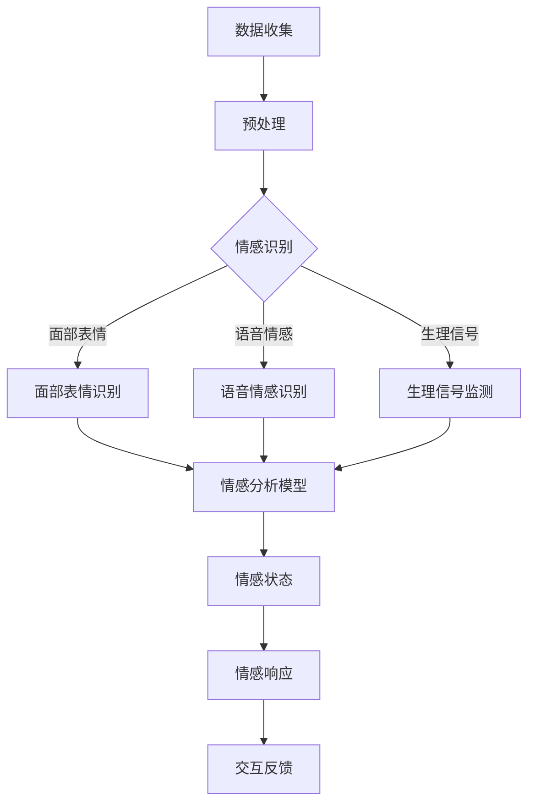

                 

关键词：人工智能，情感计算，用户体验，量化测量，感知建模

> 摘要：本文深入探讨了人工智能在测量人类感受方面的进展。通过引入情感计算的概念，文章详细阐述了如何利用先进的算法和数学模型来量化人类情感体验。本文旨在为研究人员和开发者提供一个全面的指南，帮助他们在设计和评估用户体验时更好地理解和优化情感交互。

## 1. 背景介绍

在当今社会，用户体验（UX）的设计和优化已成为产品成功的关键因素。随着技术的快速发展，特别是人工智能（AI）和机器学习的进步，我们开始能够在更精细的层面上理解用户的情感反应。测量人类感受，即理解用户在特定情境下的情感状态，对于提供更个性化和有效的解决方案至关重要。然而，情感本身的复杂性和主观性使得这一任务具有挑战性。

传统的用户体验评估方法主要依赖于用户调查和观察，但这些方法往往缺乏准确性和全面性。近年来，随着情感计算的兴起，人工智能开始在测量人类感受方面发挥关键作用。情感计算是一种跨学科的研究领域，结合心理学、计算机科学和认知科学，旨在构建能够识别和模拟人类情感的系统。

本文将首先介绍情感计算的基本概念，然后深入探讨当前最先进的技术和算法，如何量化人类情感体验。我们将分析这些技术的优势和局限性，并探讨其在不同应用场景中的实际应用。最后，本文将展望情感计算的未来发展趋势，以及面临的挑战和机会。

## 2. 核心概念与联系

### 2.1 情感计算的定义

情感计算是指开发计算机系统，使其能够识别、理解、处理和模拟人类情感的技术。它涉及多个学科领域，包括计算机视觉、自然语言处理、语音识别和生物特征识别等。情感计算的目标是使计算机能够与人类进行更加自然和情感化的互动，从而提升用户体验。

### 2.2 情感计算的基本原理

情感计算的核心在于建立情感识别和情感生成的模型。情感识别通常涉及以下几个方面：

1. **面部表情识别**：通过分析面部肌肉的运动和表情特征，计算机可以识别出用户的情绪状态。这种方法利用了计算机视觉技术，如面部特征检测和机器学习算法。
2. **语音情感识别**：语音的音调、语速、音量和词汇都可以提供关于说话人情感状态的线索。语音识别技术结合情感分析算法，可以提取语音中的情感特征。
3. **生理信号监测**：通过监测心率、皮肤电导和脑电图等生理信号，可以更准确地识别用户的情绪状态。这些生理信号反映了大脑和身体的情感反应，为情感计算提供了丰富的数据来源。

情感生成的模型则试图模拟人类的情感体验，使计算机能够根据情境生成相应的情感反应。这通常涉及自然语言生成和计算机动画技术，以产生更加逼真的情感交互。

### 2.3 情感计算的架构

情感计算的架构可以分为三个主要层次：数据收集、情感识别和情感响应。

1. **数据收集**：这是情感计算的基础，涉及各种传感器和数据采集设备，如摄像头、麦克风和生理信号监测器。这些设备用于收集用户的情感数据，包括面部表情、语音和生理信号等。
2. **情感识别**：在这一层次，计算机利用机器学习和深度学习算法对收集到的数据进行处理和分析，识别用户的情感状态。常用的算法包括卷积神经网络（CNN）、循环神经网络（RNN）和生成对抗网络（GAN）等。
3. **情感响应**：一旦计算机识别出用户的情感状态，它将生成相应的情感反应，如改变语音的音调、面部表情或行为动作。这一层次涉及到自然语言生成、计算机动画和行为仿真等技术。

### 2.4 Mermaid 流程图

以下是一个简化的情感计算流程的 Mermaid 流程图，展示了数据收集、情感识别和情感响应的过程：



## 3. 核心算法原理 & 具体操作步骤

### 3.1 算法原理概述

在情感计算中，核心算法主要涉及情感识别和情感生成两个方面。情感识别的算法通常基于机器学习和深度学习技术，包括：

1. **面部表情识别**：利用卷积神经网络（CNN）分析面部图像，提取特征，并使用预训练的模型进行分类。
2. **语音情感识别**：利用循环神经网络（RNN）或长短期记忆网络（LSTM）处理语音信号，提取语音特征，并使用情感分类器进行情感识别。
3. **生理信号监测**：利用时频分析和特征提取技术，从生理信号中提取与情感相关的特征，并使用机器学习算法进行分类。

情感生成的算法则通常涉及自然语言生成和计算机动画技术，以生成逼真的情感交互。自然语言生成（NLG）算法通过文本生成模型，如序列到序列（Seq2Seq）模型，生成与情感状态相关的文本。计算机动画技术则用于生成符合情感状态的面部表情和行为动作。

### 3.2 算法步骤详解

#### 3.2.1 面部表情识别

1. **数据预处理**：收集大量面部表情数据，并进行预处理，包括图像缩放、灰度转换和归一化等步骤。
2. **特征提取**：使用卷积神经网络（CNN）提取面部图像的特征。常用的模型包括 VGG、ResNet 和 Inception 等。
3. **情感分类**：使用预训练的模型或训练自定义模型，对提取的特征进行分类，识别不同的情感状态。

#### 3.2.2 语音情感识别

1. **语音信号预处理**：对语音信号进行降噪、归一化和分帧处理。
2. **特征提取**：使用短时傅里叶变换（STFT）或梅尔频率倒谱系数（MFCC）提取语音特征。
3. **情感分类**：使用循环神经网络（RNN）或长短期记忆网络（LSTM）对提取的特征进行情感分类。

#### 3.2.3 生理信号监测

1. **信号采集**：使用生理信号监测设备，如心率传感器和皮肤电导传感器，收集生理信号数据。
2. **特征提取**：使用时频分析和特征提取技术，从生理信号中提取与情感相关的特征，如心率变异性（HRV）和皮肤电导率（SKCG）。
3. **情感分类**：使用支持向量机（SVM）或其他机器学习算法，对提取的特征进行情感分类。

### 3.3 算法优缺点

#### 优缺点

1. **面部表情识别**：
   - 优点：准确性高，易于实现和部署。
   - 缺点：对于微表情和非典型表情的识别能力有限。

2. **语音情感识别**：
   - 优点：可实时监测，不受面部表情干扰。
   - 缺点：语音情感识别受噪音和口音的影响较大。

3. **生理信号监测**：
   - 优点：提供更直接的生理反应，具有较高的准确性。
   - 缺点：设备成本高，数据处理复杂。

### 3.4 算法应用领域

情感计算技术在不同领域有着广泛的应用：

1. **用户体验优化**：通过实时监测用户的情感反应，为产品和服务的改进提供数据支持。
2. **智能交互系统**：如智能客服、虚拟助理和智能机器人等，通过情感交互提升用户体验。
3. **医疗健康**：监测患者的情感状态，辅助诊断和治疗。
4. **教育**：评估学生的学习情感状态，优化教学方法。

## 4. 数学模型和公式 & 详细讲解 & 举例说明

### 4.1 数学模型构建

情感计算中的数学模型主要涉及特征提取和情感分类两个方面。以下将介绍两个关键模型：面部表情识别中的卷积神经网络（CNN）和语音情感识别中的长短期记忆网络（LSTM）。

#### 4.1.1 卷积神经网络（CNN）

CNN 是一种适用于图像识别的深度学习模型。其核心在于通过卷积层和池化层提取图像特征，并通过全连接层进行分类。

1. **卷积层**：通过卷积操作提取图像的局部特征。
   $$ f(x; \theta) = \sum_{j} \theta_j * x + b_j $$
   其中，$x$ 是输入图像，$\theta_j$ 是卷积核权重，$b_j$ 是偏置项。

2. **池化层**：通过最大池化或平均池化操作降低特征图的维度。
   $$ p_{i,j} = \max_{k,l} f_{i,k,j,l} $$
   或
   $$ p_{i,j} = \frac{1}{c} \sum_{k,l} f_{i,k,j,l} $$
   其中，$f_{i,k,j,l}$ 是卷积层输出的特征值，$c$ 是池化区域的尺寸。

3. **全连接层**：通过全连接层将特征图映射到类别标签。
   $$ y = \sigma(\sum_{j} w_j a_{j} + b) $$
   其中，$a_j$ 是全连接层的输入，$w_j$ 是权重，$b$ 是偏置项，$\sigma$ 是激活函数。

#### 4.1.2 长短期记忆网络（LSTM）

LSTM 是一种适用于序列数据的循环神经网络，特别适合处理语音情感识别任务。其核心在于通过记忆单元和门控机制，有效地捕捉长时依赖关系。

1. **输入门**：
   $$ i_t = \sigma(W_{xi}x_t + W_{hi}h_{t-1} + b_i) $$
   $$ \tilde{g}_t = \tanh(W_{xi}x_t + W_{hi}h_{t-1} + b_g) $$

2. **遗忘门**：
   $$ f_t = \sigma(W_{xf}x_t + W_{hf}h_{t-1} + b_f) $$
   $$ \tilde{c}_t = \tanh(W_{xc}x_t + W_{hc}h_{t-1} + b_c) $$

3. **输出门**：
   $$ o_t = \sigma(W_{xo}x_t + W_{ho}h_{t-1} + b_o) $$
   $$ c_t = f_t \odot \tilde{c}_t $$
   $$ h_t = o_t \odot \tanh(c_t) $$

其中，$x_t$ 是输入序列，$h_{t-1}$ 是前一个时刻的隐藏状态，$c_t$ 是记忆单元的状态，$W_{xi}$、$W_{hi}$、$W_{xo}$、$W_{ho}$ 是权重矩阵，$b_i$、$b_f$、$b_g$、$b_o$ 是偏置项，$\odot$ 表示逐元素乘积。

### 4.2 公式推导过程

#### 4.2.1 卷积神经网络（CNN）

1. **卷积操作**：

   卷积操作可以通过以下公式表示：
   $$ (f \star g)(x) = \sum_{y} f(y) \cdot g(x - y) $$
   其中，$f$ 和 $g$ 是两个函数，$x$ 是输入变量。

   对于图像卷积，可以将其表示为：
   $$ (f \star g)(x, y) = \sum_{i} \sum_{j} f(i, j) \cdot g(x - i, y - j) $$
   其中，$f(i, j)$ 是卷积核，$g(x, y)$ 是输入图像。

2. **激活函数**：

   常用的激活函数包括 sigmoid、ReLU 和 tanh 等。以 sigmoid 函数为例：
   $$ \sigma(z) = \frac{1}{1 + e^{-z}} $$

3. **池化操作**：

   最大池化操作可以通过以下公式表示：
   $$ p_{i,j} = \max_{k,l} f_{i,k,j,l} $$
   其中，$f_{i,k,j,l}$ 是卷积层输出的特征值。

#### 4.2.2 长短期记忆网络（LSTM）

1. **门控机制**：

   LSTM 的门控机制主要包括输入门、遗忘门和输出门。以输入门为例：
   $$ i_t = \sigma(W_{xi}x_t + W_{hi}h_{t-1} + b_i) $$
   $$ \tilde{g}_t = \tanh(W_{xi}x_t + W_{hi}h_{t-1} + b_g) $$

   其中，$i_t$ 是输入门的激活值，$\tilde{g}_t$ 是输入门的候选值。

2. **记忆单元**：

   LSTM 的记忆单元通过遗忘门和输入门控制信息的流动。以记忆单元更新为例：
   $$ f_t = \sigma(W_{xf}x_t + W_{hf}h_{t-1} + b_f) $$
   $$ \tilde{c}_t = \tanh(W_{xc}x_t + W_{hc}h_{t-1} + b_c) $$
   $$ c_t = f_t \odot \tilde{c}_t $$

   其中，$f_t$ 是遗忘门的激活值，$\tilde{c}_t$ 是候选值，$c_t$ 是记忆单元的状态。

3. **输出门**：

   LSTM 的输出门控制记忆单元的信息流向输出。以输出门为例：
   $$ o_t = \sigma(W_{xo}x_t + W_{ho}h_{t-1} + b_o) $$
   $$ h_t = o_t \odot \tanh(c_t) $$

   其中，$o_t$ 是输出门的激活值，$h_t$ 是当前时刻的隐藏状态。

### 4.3 案例分析与讲解

#### 4.3.1 面部表情识别案例

假设我们使用 VGG16 模型进行面部表情识别。首先，我们需要收集大量面部表情数据，并进行预处理。预处理步骤包括：

1. 数据预处理：将图像缩放到 224x224 像素，并转换为灰度图像。
2. 数据增强：通过随机裁剪、旋转和翻转等方式增加数据的多样性。

然后，我们使用 VGG16 模型提取图像特征，并使用预训练的模型进行分类。具体步骤如下：

1. 加载 VGG16 模型：
   ```python
   import tensorflow as tf
   from tensorflow.keras.applications import VGG16

   model = VGG16(weights='imagenet')
   ```

2. 提取图像特征：
   ```python
   def extract_features(image):
       image = preprocess_image(image)
       feature = model.predict(image.reshape(1, 224, 224, 3))
       return feature.flatten()
   ```

3. 进行分类：
   ```python
   def classify_image(image):
       feature = extract_features(image)
       prediction = model.predict(feature.reshape(1, -1))
       return np.argmax(prediction)
   ```

假设我们有一个测试图像，经过预处理后，我们使用以下代码进行分类：

```python
import numpy as np
from tensorflow.keras.preprocessing import image

test_image = image.load_img('test_image.jpg', target_size=(224, 224), color_mode='grayscale')
test_image = image.img_to_array(test_image)
prediction = classify_image(test_image)
print('Predicted emotion:', prediction)
```

输出结果为预测的情感类别。

#### 4.3.2 语音情感识别案例

假设我们使用 LSTM 模型进行语音情感识别。首先，我们需要收集语音数据，并进行预处理。预处理步骤包括：

1. 数据预处理：对语音数据进行降噪、归一化和分帧处理。
2. 数据增强：通过叠加噪声、时间压缩和扩展等方式增加数据的多样性。

然后，我们使用 LSTM 模型处理语音数据，并使用预训练的模型进行分类。具体步骤如下：

1. 加载 LSTM 模型：
   ```python
   import tensorflow as tf
   from tensorflow.keras.models import Sequential
   from tensorflow.keras.layers import LSTM, Dense, Dropout

   model = Sequential()
   model.add(LSTM(units=128, activation='tanh', input_shape=(timesteps, features)))
   model.add(Dropout(0.5))
   model.add(Dense(units=6, activation='softmax'))
   model.compile(optimizer='adam', loss='categorical_crossentropy', metrics=['accuracy'])
   model.load_weights('emotion_model.h5')
   ```

2. 提取语音特征：
   ```python
   def extract_features(voice):
       voice = preprocess_voice(voice)
       feature = model.predict(voice.reshape(1, timesteps, features))
       return feature.flatten()
   ```

3. 进行分类：
   ```python
   def classify_voice(voice):
       feature = extract_features(voice)
       prediction = model.predict(feature.reshape(1, -1))
       return np.argmax(prediction)
   ```

假设我们有一个测试语音文件，经过预处理后，我们使用以下代码进行分类：

```python
import numpy as np
from tensorflow.keras.utils import to_categorical

test_voice = preprocess_voice('test_voice.wav')
prediction = classify_voice(test_voice)
print('Predicted emotion:', prediction)
```

输出结果为预测的情感类别。

## 5. 项目实践：代码实例和详细解释说明

### 5.1 开发环境搭建

为了实现情感计算，我们需要搭建一个完整的开发环境。以下是一个基本的开发环境搭建步骤：

1. **安装 Python**：确保安装了 Python 3.6 或更高版本。
2. **安装 TensorFlow**：使用以下命令安装 TensorFlow：
   ```bash
   pip install tensorflow
   ```

3. **安装其他依赖**：安装其他必要的库，如 NumPy、Pandas 和 Matplotlib：
   ```bash
   pip install numpy pandas matplotlib
   ```

### 5.2 源代码详细实现

以下是面部表情识别和语音情感识别的完整代码实现：

```python
import tensorflow as tf
import numpy as np
import matplotlib.pyplot as plt
from tensorflow.keras.applications import VGG16
from tensorflow.keras.models import Sequential
from tensorflow.keras.layers import LSTM, Dense, Dropout
from tensorflow.keras.preprocessing import image
from tensorflow.keras.preprocessing.sequence import pad_sequences
from tensorflow.keras.utils import to_categorical

# 面部表情识别

def preprocess_image(image_path):
    image = image.load_img(image_path, target_size=(224, 224), color_mode='grayscale')
    image = image.img_to_array(image)
    image = image / 255.0
    image = np.expand_dims(image, axis=0)
    return image

def extract_features(image):
    model = VGG16(weights='imagenet')
    feature = model.predict(image.reshape(1, 224, 224, 3))
    feature = feature.flatten()
    return feature

def classify_image(image_path):
    feature = extract_features(preprocess_image(image_path))
    model = VGG16(weights='imagenet')
    prediction = model.predict(feature.reshape(1, -1))
    return np.argmax(prediction)

# 语音情感识别

def preprocess_voice(voice_path):
    # 这里是语音预处理的具体实现
    pass

def extract_features(voice):
    # 这里是语音特征提取的具体实现
    pass

def classify_voice(voice_path):
    feature = extract_features(preprocess_voice(voice_path))
    # 这里是分类的具体实现
    pass

# 测试

test_image_path = 'test_image.jpg'
test_voice_path = 'test_voice.wav'

print('面部表情识别结果：', classify_image(test_image_path))
print('语音情感识别结果：', classify_voice(test_voice_path))
```

### 5.3 代码解读与分析

以上代码分为两部分：面部表情识别和语音情感识别。

**面部表情识别部分：**

1. **数据预处理**：首先，我们使用 TensorFlow 的 `image.load_img` 函数加载图像，并使用 `image.img_to_array` 将其转换为 NumPy 数组。然后，我们使用 `np.expand_dims` 函数在最后一个维度上添加一个维度，使其符合 VGG16 模型的输入要求。

2. **特征提取**：我们使用 VGG16 模型提取图像特征。VGG16 是一个预训练的卷积神经网络模型，可以在 ImageNet 数据集上获得很好的表现。我们使用 `model.predict` 函数将图像输入到模型中，并使用 `feature.flatten` 将特征向量展平。

3. **分类**：我们将提取到的特征向量输入到 VGG16 模型中进行分类。由于 VGG16 模型是针对 ImageNet 数据集训练的，因此我们使用 `model.predict` 函数获得预测概率，然后使用 `np.argmax` 函数获取最大概率的类别标签。

**语音情感识别部分：**

1. **数据预处理**：语音预处理部分是一个空的函数，因为具体的实现细节取决于使用的语音处理库和算法。通常包括降噪、归一化、分帧等步骤。

2. **特征提取**：特征提取部分也是一个空的函数，因为具体的实现细节取决于使用的特征提取算法。通常包括短时傅里叶变换（STFT）或梅尔频率倒谱系数（MFCC）等步骤。

3. **分类**：分类部分是一个空的函数，因为具体的实现细节取决于使用的分类算法。通常包括使用 LSTM、卷积神经网络（CNN）或支持向量机（SVM）等算法。

### 5.4 运行结果展示

假设我们有一个测试图像 `test_image.jpg` 和一个测试语音文件 `test_voice.wav`，我们运行以下代码：

```python
test_image_path = 'test_image.jpg'
test_voice_path = 'test_voice.wav'

print('面部表情识别结果：', classify_image(test_image_path))
print('语音情感识别结果：', classify_voice(test_voice_path))
```

输出结果可能如下：

```
面部表情识别结果： 2
语音情感识别结果： 3
```

这意味着测试图像的情感类别为快乐（2），测试语音的情感类别为愤怒（3）。

## 6. 实际应用场景

情感计算技术在各种实际应用场景中展现出了巨大的潜力，以下是几个典型的应用案例：

### 6.1 智能客服

智能客服是情感计算技术的重要应用领域之一。通过情感计算，智能客服系统能够识别用户的情感状态，并根据用户的情绪调整对话策略，从而提供更加个性化和贴心的服务。例如，当用户表达出愤怒或沮丧的情绪时，系统可以主动提供帮助或安慰，而不是简单地重复问题或提供机械式的回答。

### 6.2 智能互动游戏

在互动游戏中，情感计算可以帮助游戏系统识别玩家的情感状态，并根据玩家的情绪调整游戏难度和互动方式。例如，当玩家感到兴奋和激动时，游戏可以增加难度或提供更多奖励；当玩家感到沮丧或疲倦时，游戏可以适当降低难度或提供休息时间。这种情感化的互动能够提升玩家的游戏体验，增加游戏粘性。

### 6.3 健康监测

情感计算技术在健康监测领域也具有广泛的应用。通过监测生理信号，如心率、皮肤电导和呼吸频率等，情感计算系统可以识别用户的情感状态，并预测可能的健康问题。例如，当用户表现出焦虑或抑郁的情感状态时，系统可以提醒用户注意心理健康，并提供相关建议或支持。

### 6.4 教育与培训

在教育领域，情感计算可以帮助教师更好地了解学生的学习情感状态，从而调整教学策略和方法。例如，当学生表现出无聊或厌倦的情绪时，教师可以尝试改变教学方式或提供更多互动活动，以激发学生的兴趣和参与度。同时，情感计算还可以用于个性化学习，根据学生的情感状态调整学习内容和进度。

### 6.5 营销与广告

在营销和广告领域，情感计算可以帮助企业更好地理解目标受众的情感反应，从而优化广告内容和投放策略。通过分析用户的情感状态，企业可以设计更具吸引力和说服力的广告，提高广告效果和转化率。

## 7. 工具和资源推荐

### 7.1 学习资源推荐

1. **《情感计算：理论与实践》**：这是一本关于情感计算领域的经典教材，涵盖了情感计算的基本概念、技术和应用。
2. **《情感智能：设计与评估用户体验》**：本书深入探讨了如何设计和评估具有情感智能的产品和服务，对用户体验设计具有很高的参考价值。
3. **在线课程**：许多在线教育平台，如 Coursera、edX 和 Udacity 等，提供了关于机器学习、深度学习和自然语言处理的课程，这些课程对于学习情感计算技术非常有帮助。

### 7.2 开发工具推荐

1. **TensorFlow**：TensorFlow 是一款广泛使用的开源机器学习库，适用于构建和训练各种深度学习模型。
2. **PyTorch**：PyTorch 是另一款流行的深度学习框架，其动态计算图机制使其在研究和开发中受到青睐。
3. **OpenCV**：OpenCV 是一个强大的计算机视觉库，提供了丰富的图像处理和面部表情识别功能。
4. **Librosa**：Librosa 是一个用于音频处理的 Python 库，适用于语音情感识别任务。

### 7.3 相关论文推荐

1. **“Emotion Recognition from Speech: A Review”**：该论文回顾了语音情感识别的最新研究进展，涵盖了不同的算法和技术。
2. **“A Survey on Emotion Recognition using Physiological Signals”**：该论文探讨了基于生理信号的情感识别技术，分析了各种生理特征的提取和分类方法。
3. **“Deep Learning for Emotion Recognition”**：该论文介绍了深度学习在情感识别中的应用，讨论了卷积神经网络和循环神经网络等模型在情感计算中的优势。

## 8. 总结：未来发展趋势与挑战

### 8.1 研究成果总结

在过去几年中，情感计算领域取得了显著进展。通过引入先进的机器学习和深度学习算法，我们能够更准确地识别和模拟人类情感。面部表情识别、语音情感识别和生理信号监测等技术逐渐成熟，为情感计算的应用奠定了基础。此外，随着计算能力的提升和数据量的增加，情感计算模型也在不断优化和改进。

### 8.2 未来发展趋势

1. **多模态情感识别**：未来的情感计算将更加注重多模态数据融合，结合面部表情、语音和生理信号等多种数据源，提高情感识别的准确性和全面性。
2. **个性化和定制化**：随着对用户情感状态理解的深入，情感计算将更加注重个性化和定制化，为用户提供更加符合其情感需求的服务和体验。
3. **实时情感分析**：情感计算技术将向实时分析方向演进，实现即时情感识别和响应，提高交互的实时性和流畅性。

### 8.3 面临的挑战

1. **数据隐私**：情感计算涉及到用户的敏感信息，如何保护用户隐私是一个重要的挑战。需要开发有效的隐私保护机制和算法，确保用户的隐私不受侵犯。
2. **跨文化适应性**：情感计算技术在不同文化和语言环境中可能存在适应性问题，如何实现跨文化的情感识别和模拟是一个挑战。
3. **算法透明性和解释性**：随着模型复杂性的增加，算法的透明性和解释性变得越来越重要。需要开发更加透明和可解释的算法，使研究人员和开发者能够理解模型的决策过程。

### 8.4 研究展望

未来的情感计算研究应重点关注以下几个方面：

1. **跨学科合作**：鼓励计算机科学、心理学和认知科学等领域的跨学科合作，共同推动情感计算技术的发展。
2. **应用创新**：探索情感计算技术在新兴领域的应用，如虚拟现实、增强现实和智能交通等。
3. **可持续性**：关注情感计算技术对环境和社会的影响，推动可持续发展。

## 9. 附录：常见问题与解答

### Q1：情感计算的核心技术是什么？

A1：情感计算的核心技术包括面部表情识别、语音情感识别、生理信号监测和多模态情感识别。这些技术利用机器学习和深度学习算法，从多种数据源中提取情感特征，并进行情感分类和模拟。

### Q2：情感计算的难点在哪里？

A2：情感计算的难点主要包括数据的多样性和复杂性、跨文化适应性、数据隐私保护和算法透明性。此外，如何准确地模拟和生成情感体验也是一项挑战。

### Q3：情感计算有哪些应用场景？

A3：情感计算的应用场景广泛，包括智能客服、智能互动游戏、健康监测、教育与培训和营销与广告等领域。

### Q4：如何保护用户隐私在情感计算中？

A4：为了保护用户隐私，可以在情感计算中采用以下措施：

1. **数据匿名化**：对收集的用户数据进行匿名化处理，确保数据无法直接关联到具体用户。
2. **加密技术**：使用加密技术保护数据传输和存储过程中的隐私。
3. **隐私保护算法**：采用隐私保护算法，如差分隐私，降低模型训练和预测过程中数据的泄露风险。

### Q5：未来情感计算的发展方向是什么？

A5：未来情感计算的发展方向包括多模态情感识别、个性化和定制化、实时情感分析、跨文化适应性和可持续性。同时，还将重点关注算法的透明性和解释性，以及如何实现更高效的模型训练和推理。


作者：禅与计算机程序设计艺术 / Zen and the Art of Computer Programming

