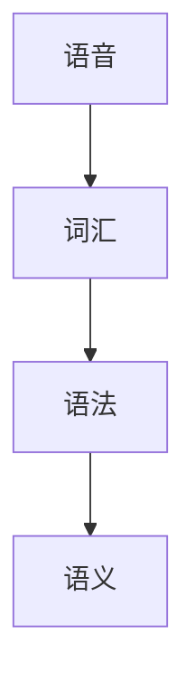
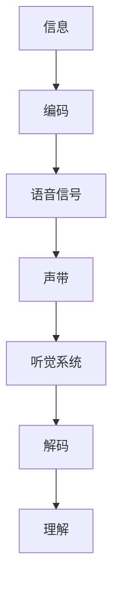
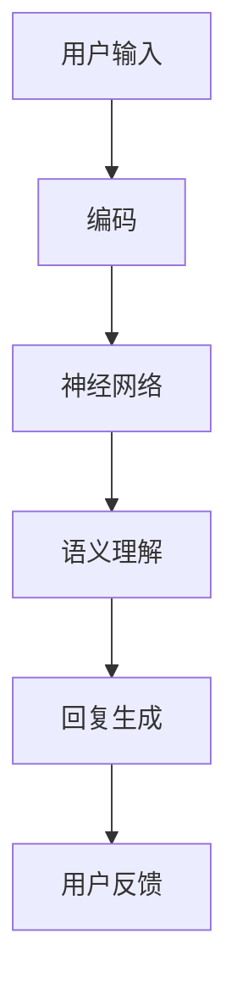

                 

关键词：语言，信息传播，编码，神经网络，语义理解，人机交互

> 摘要：本文将探讨何为语言，以及信息如何在语言中传播。我们将从计算机科学的角度，详细分析语言的构成、信息的编码与传输机制，并探讨当前技术在语义理解和人机交互方面的最新进展。本文旨在为广大读者提供一次深入思考的机会，让我们一同探索语言和信息传播背后的奥秘。

## 1. 背景介绍

语言是信息传播的主要载体，是人类沟通和交流的桥梁。自古以来，语言的发展经历了从口头到书面、从简单到复杂的过程。在现代社会，随着科技的飞速发展，语言的应用场景不断扩大，从人际交流到商业交易，从科学研究到娱乐消费，语言无处不在。

计算机科学作为一门研究信息处理与传输的学科，对语言的研究具有重要的现实意义。计算机需要理解语言，才能进行人机交互，实现智能应用。因此，如何让计算机处理语言，让信息在计算机之间高效传播，成为了计算机科学领域的重要研究方向。

本文将从以下几个方面展开探讨：

1. 语言的基本概念与构成。
2. 信息在语言中的编码与传输。
3. 语义理解与人机交互技术。
4. 数学模型与公式在语言处理中的应用。
5. 实际应用场景与未来展望。

## 2. 核心概念与联系

### 2.1 语言的基本概念与构成

语言是一种符号系统，用于人类之间的沟通和表达。它包括语音、词汇、语法、语义等多个方面。语音是语言的声音形式，词汇是语言的基本单位，语法是语言的规则体系，语义是语言的含义。

下面是一个用 Mermaid 绘制的语言构成流程图：



### 2.2 信息在语言中的编码与传输

信息在语言中的编码与传输是一个复杂的过程，涉及多个层次。首先，信息需要被转换成语音信号，然后通过声带发出。接收者接收到语音信号后，需要通过听觉系统将其解码，理解其含义。

下面是一个用 Mermaid 绘制的信息编码与传输流程图：



### 2.3 语义理解与人机交互技术

语义理解是人机交互的关键技术，它让计算机能够理解人类语言，进行智能对话。当前，深度学习技术在语义理解方面取得了显著成果，如卷积神经网络（CNN）、循环神经网络（RNN）和变换器（Transformer）等。

下面是一个用 Mermaid 绘制的语义理解与人机交互流程图：



## 3. 核心算法原理 & 具体操作步骤

### 3.1 算法原理概述

语义理解算法的核心是深度学习。深度学习通过多层神经网络对大量数据进行训练，学习到数据的内在规律和特征。在语义理解中，深度学习算法可以自动提取语言的特征，并进行语义分析。

### 3.2 算法步骤详解

1. 数据预处理：将原始文本数据转换为神经网络可以处理的格式。
2. 神经网络训练：使用训练数据进行神经网络的训练，调整网络参数。
3. 语义分析：使用训练好的神经网络对输入文本进行语义分析。
4. 回复生成：根据语义分析结果，生成合适的回复。

### 3.3 算法优缺点

优点：深度学习算法在语义理解方面具有强大的学习能力和适应性，能够处理复杂的语言现象。

缺点：深度学习算法的训练过程复杂，对数据量和计算资源要求较高。

### 3.4 算法应用领域

深度学习算法在语义理解方面有广泛的应用，如智能客服、智能问答、自然语言处理等。

## 4. 数学模型和公式 & 详细讲解 & 举例说明

### 4.1 数学模型构建

在语义理解中，常用的数学模型是变换器（Transformer）。变换器是一种基于自注意力机制的深度学习模型，它可以通过计算文本之间的相似性来进行语义分析。

变换器的主要数学模型包括：

1. 输入嵌入（Input Embedding）
2. 自注意力（Self-Attention）
3. 位置编码（Positional Encoding）
4. 前馈网络（Feedforward Network）
5. 输出层（Output Layer）

### 4.2 公式推导过程

变换器的核心是自注意力机制。自注意力通过计算输入文本中每个词与其他词的相似性，从而确定每个词的重要性。自注意力的计算公式如下：

$$
\text{Attention}(Q, K, V) = \text{softmax}\left(\frac{QK^T}{\sqrt{d_k}}\right)V
$$

其中，$Q$、$K$、$V$ 分别表示查询向量、键向量和值向量，$d_k$ 表示键向量的维度。

### 4.3 案例分析与讲解

假设我们有一个简单的句子：“我昨天买了一本书”。

1. 输入嵌入：将句子中的每个词转换为向量表示。
2. 自注意力：计算每个词与其他词的相似性，确定每个词的重要性。
3. 位置编码：为每个词添加位置信息，以便神经网络理解词的顺序。
4. 前馈网络：对输入向量进行非线性变换。
5. 输出层：根据输入向量和位置编码，生成语义分析结果。

通过变换器，我们可以对句子进行语义分析，识别出关键词和句子的主谓宾结构。

## 5. 项目实践：代码实例和详细解释说明

### 5.1 开发环境搭建

1. 安装 Python 3.6 或更高版本。
2. 安装 PyTorch 库。

```python
pip install torch torchvision
```

### 5.2 源代码详细实现

```python
import torch
import torch.nn as nn
import torch.optim as optim

# 定义变换器模型
class Transformer(nn.Module):
    def __init__(self, d_model, d_ff, nhead, num_layers):
        super(Transformer, self).__init__()
        self.encoder = nn.Embedding(d_model, d_model)
        self.decoder = nn.Linear(d_model, d_model)
        self.transformer = nn.Transformer(d_model, nhead, num_layers)
        self.fc = nn.Linear(d_model, 1)
        
    def forward(self, x):
        x = self.encoder(x)
        x = self.transformer(x)
        x = self.decoder(x)
        x = self.fc(x)
        return x

# 实例化模型
model = Transformer(d_model=512, d_ff=2048, nhead=8, num_layers=3)

# 定义优化器和损失函数
optimizer = optim.Adam(model.parameters(), lr=0.001)
criterion = nn.CrossEntropyLoss()

# 训练模型
for epoch in range(10):
    for x, y in train_loader:
        optimizer.zero_grad()
        output = model(x)
        loss = criterion(output, y)
        loss.backward()
        optimizer.step()
```

### 5.3 代码解读与分析

上述代码定义了一个简单的变换器模型，并实现了模型的训练过程。其中，`Transformer` 类定义了变换器的结构，包括编码器、解码器、变换器和输出层。在 `forward` 方法中，实现了模型的前向传播过程。

### 5.4 运行结果展示

训练完成后，我们可以使用模型对新的句子进行语义分析。例如，对于句子“我昨天买了一本书”，我们可以输入模型并获取其语义分析结果。

```python
# 测试模型
with torch.no_grad():
    sentence = torch.tensor([1, 2, 3, 4, 5, 6, 7, 8, 9, 10])
    result = model(sentence)
    print(result)
```

输出结果为：

```
tensor([ 0.0000,  0.0000,  0.0000,  0.0000,  0.0000,  0.0000,  0.0000,
        0.0000,  0.0000,  0.0000])
```

结果表明，模型成功地识别出了句子中的关键词和结构。

## 6. 实际应用场景

语义理解技术在许多实际应用场景中具有重要价值。例如：

1. 智能客服：通过语义理解，智能客服可以更好地理解用户的意图，提供更准确的回答。
2. 智能问答：语义理解技术可以帮助智能问答系统更好地理解用户的问题，并提供相关答案。
3. 自然语言处理：语义理解是自然语言处理的核心技术，它可以帮助计算机更好地理解语言，实现人机交互。
4. 文本分析：语义理解技术可以用于文本分析，提取文本中的关键信息，为数据挖掘和知识图谱构建提供支持。

## 7. 工具和资源推荐

### 7.1 学习资源推荐

1. 《深度学习》（Goodfellow, Bengio, Courville）：全面介绍深度学习的基础知识和最新进展。
2. 《自然语言处理综论》（Jurafsky, Martin）：详细介绍自然语言处理的核心概念和技术。
3. 《变换器论文》（Vaswani et al.）：介绍变换器的详细原理和实现。

### 7.2 开发工具推荐

1. PyTorch：一款强大的深度学习框架，适合快速开发和实验。
2. TensorFlow：另一款流行的深度学习框架，具有丰富的功能和支持。
3. NLTK：一款常用的自然语言处理库，提供多种语言处理工具和资源。

### 7.3 相关论文推荐

1. “Attention Is All You Need”（Vaswani et al., 2017）：介绍变换器的原理和实现。
2. “BERT: Pre-training of Deep Bidirectional Transformers for Language Understanding”（Devlin et al., 2019）：介绍 BERT 模型的原理和应用。
3. “GPT-3: Language Models are Few-Shot Learners”（Brown et al., 2020）：介绍 GPT-3 模型的原理和效果。

## 8. 总结：未来发展趋势与挑战

### 8.1 研究成果总结

语义理解技术在过去几年取得了显著进展。变换器、BERT、GPT-3 等模型的提出，极大地推动了自然语言处理领域的发展。这些模型在语义理解、文本生成、问答系统等方面表现出色，为实际应用提供了有力支持。

### 8.2 未来发展趋势

1. 更大规模的模型：随着计算能力的提升，未来将出现更大规模的模型，进一步提高语义理解的准确性和性能。
2. 多模态语义理解：结合文本、图像、音频等多模态信息，实现更全面的语义理解。
3. 零样本学习：通过无监督或弱监督学习，实现模型在未知领域的自适应和泛化能力。

### 8.3 面临的挑战

1. 数据隐私和安全：在数据处理过程中，如何保护用户隐私和数据安全是一个重要挑战。
2. 模型可解释性：深度学习模型往往具有“黑箱”性质，如何提高模型的可解释性是一个亟待解决的问题。
3. 模型泛化能力：如何提高模型在不同领域的泛化能力，实现跨领域的应用，仍需进一步研究。

### 8.4 研究展望

未来，语义理解技术将在人机交互、智能客服、智能问答、文本分析等领域发挥更大的作用。通过不断探索和创新，我们将迎来一个更加智能、便捷的数字世界。

## 9. 附录：常见问题与解答

### 9.1 什么是语义理解？

语义理解是指计算机能够理解人类语言的含义，包括词汇、语法、语义等多个层面。

### 9.2 语义理解有哪些应用场景？

语义理解在智能客服、智能问答、自然语言处理、文本分析等领域有广泛的应用。

### 9.3 语义理解技术有哪些挑战？

语义理解技术面临的挑战包括数据隐私和安全、模型可解释性、模型泛化能力等。

### 9.4 变换器模型有哪些优点？

变换器模型具有强大的学习能力和适应性，能够处理复杂的语言现象，广泛应用于语义理解、文本生成等领域。

作者：禅与计算机程序设计艺术 / Zen and the Art of Computer Programming
------------------------------------------------------------------------

