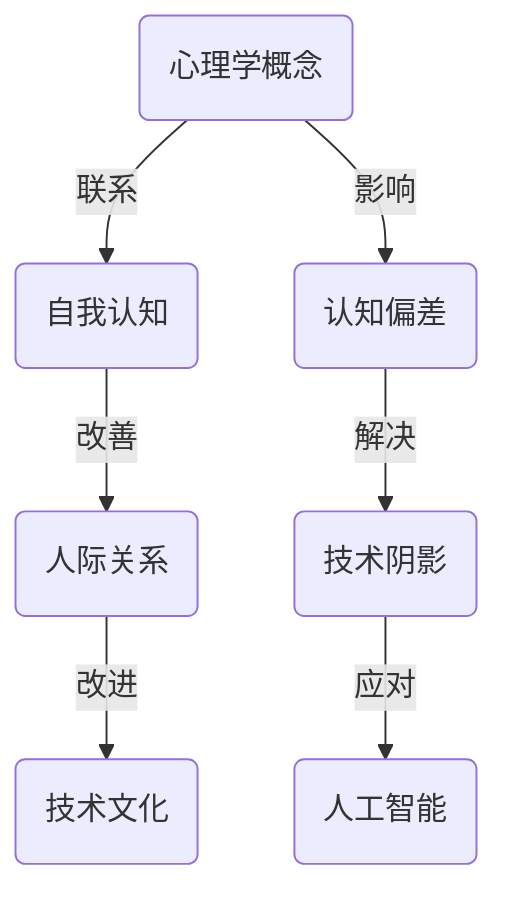

                 

关键词：阴影，心理学，认知偏差，自我认知，人际关系，技术文化，算法，人工智能

> 摘要：本文探讨了一个普遍存在于人类行为和心理中的现象：面对自己的阴影。在技术文化中，这一现象同样显著。通过分析心理学中的相关理论，我们将揭示如何在技术领域内运用这些理论来理解自我认知的不足，如何通过提升自我认知来改善人际关系，并最终探讨未来在人工智能领域内应对这一现象的潜在解决方案。

## 1. 背景介绍

在心理学中，"阴影"（Shadow）一词最早由卡尔·古斯塔夫·荣格提出，用来描述人类心理中未被意识和接受的黑暗面，包括我们潜意识中的冲动、欲望、创伤和负面情绪。荣格认为，阴影是人格结构中不可或缺的一部分，它反映了我们的无意识心理状态，如果被忽视或压抑，可能会导致心理冲突和个人发展受阻。

在技术领域，虽然“阴影”这个概念并不是主流词汇，但我们可以将其类比到技术文化和人工智能中的一些现象。例如，算法中的偏见、数据隐私问题、人工智能决策的不透明性等，都是技术阴影的体现。这些阴影往往隐藏在技术进步的背后，未被充分认识和解决，可能导致一系列负面影响。

本文的目标是探讨如何在技术领域内运用心理学中的阴影概念，来更好地理解和应对技术发展带来的挑战。我们将从心理学角度出发，结合具体的技术案例，探讨如何通过提升自我认知来改善人际关系，并最终为人工智能领域提供潜在的应用方案。

## 2. 核心概念与联系

为了更好地理解阴影在技术领域中的作用，我们需要首先了解相关的心理学概念，以及它们与技术之间的联系。以下是一个简化的 Mermaid 流程图，展示了几大核心概念及其相互关系：



### 2.1 心理学概念

- **自我认知**：个体对自己心理状态、特征和身份的认知。自我认知的强弱直接影响个体的行为和决策。
- **认知偏差**：由于信息处理过程的不完美性，导致个体在判断和决策时出现系统性错误。常见的认知偏差包括确认偏见、过度自信等。
- **技术阴影**：在技术文化中，指那些未被充分认识和解决的技术问题，例如算法偏见、数据隐私问题等。

### 2.2 联系

- **自我认知与认知偏差**：自我认知不足往往导致个体无法识别和纠正自己的认知偏差，从而影响其决策和行为。
- **认知偏差与技术阴影**：技术中的认知偏差可能导致算法偏见等阴影现象，影响技术系统的公正性和透明性。
- **技术阴影与人工智能**：技术阴影在人工智能领域尤为显著，因为人工智能系统的决策过程往往依赖于大量数据，而数据中的偏见会直接反映在系统输出中。

通过这个流程图，我们可以看到心理学概念与技术领域的紧密联系，以及阴影现象在这些联系中的核心作用。

### 3. 核心算法原理 & 具体操作步骤

#### 3.1 算法原理概述

在本文中，我们将通过一个具体的算法——对抗性神经网络（Generative Adversarial Network, GAN）来阐述如何应对技术阴影。GAN 由两部分组成：生成器（Generator）和判别器（Discriminator）。这两部分相互竞争，以生成逼真的数据。

- **生成器**：生成器的目标是生成看起来真实的数据，例如图像或文本，以欺骗判别器。
- **判别器**：判别器的目标是区分真实数据和生成数据。

GAN 的基本原理是通过这两个对抗性组件之间的博弈来提高生成器的性能。随着时间的推移，生成器的生成能力会不断提高，从而减少判别器的准确性，而判别器的准确性提高又会迫使生成器进一步改进。

#### 3.2 算法步骤详解

1. **初始化参数**：随机初始化生成器和判别器的参数。
2. **训练判别器**：使用真实数据和生成数据对判别器进行训练，使其能够更好地区分真实数据和生成数据。
3. **训练生成器**：使用判别器的输出误差来更新生成器的参数，使其生成的数据更加逼真。
4. **迭代过程**：重复步骤 2 和步骤 3，直到生成器能够生成足够逼真的数据，使得判别器无法准确区分生成数据和真实数据。

#### 3.3 算法优缺点

**优点**：

- **灵活性**：GAN 能够生成具有高度多样性的数据，可以应用于图像生成、文本生成等多种场景。
- **高效性**：GAN 能够在生成逼真数据的同时，保持训练的高效性。

**缺点**：

- **训练难度**：GAN 的训练过程不稳定，容易陷入局部最优。
- **评估难度**：GAN 生成的数据质量难以量化评估。

#### 3.4 算法应用领域

GAN 在许多领域都有广泛的应用，包括：

- **图像生成**：生成逼真的图像或视频。
- **数据增强**：用于机器学习模型的训练，增强数据的多样性。
- **风格迁移**：将一种风格应用到另一张图像上。

### 4. 数学模型和公式 & 详细讲解 & 举例说明

在 GAN 的算法中，数学模型和公式起着至关重要的作用。以下是对 GAN 中主要数学模型和公式的详细讲解，并配合实际案例进行说明。

#### 4.1 数学模型构建

GAN 的核心数学模型包括两部分：生成器和判别器的损失函数。

- **生成器的损失函数**：

  $$ L_G = -\mathbb{E}_{x\sim p_{data}(x)}[\log(D(x))] - \mathbb{E}_{z\sim p_{z}(z)}[\log(D(G(z)))] $$

  其中，$x$ 表示真实数据，$z$ 表示随机噪声向量，$G(z)$ 表示生成器生成的数据，$D(x)$ 和 $D(G(z))$ 分别表示判别器对真实数据和生成数据的判断。

- **判别器的损失函数**：

  $$ L_D = -\mathbb{E}_{x\sim p_{data}(x)}[\log(D(x))] - \mathbb{E}_{z\sim p_{z}(z)}[\log(1 - D(G(z)))] $$

  其中，$D(x)$ 和 $D(G(z))$ 的含义同上。

#### 4.2 公式推导过程

GAN 的损失函数是通过对判别器的输出进行最大化似然估计推导得到的。具体推导过程如下：

- **生成器的损失函数推导**：

  生成器的目标是最大化判别器对生成数据的判断概率，即最大化 $D(G(z))$。同时，生成器需要最小化判别器对真实数据的判断概率，即最小化 $D(x)$。因此，生成器的损失函数可以表示为：

  $$ L_G = -\mathbb{E}_{x\sim p_{data}(x)}[\log(D(x))] - \mathbb{E}_{z\sim p_{z}(z)}[\log(D(G(z)))] $$

  其中，第一个期望项表示真实数据的损失，第二个期望项表示生成数据的损失。

- **判别器的损失函数推导**：

  判别器的目标是最大化真实数据和生成数据的区分度，即最大化 $D(x)$ 和 $1 - D(G(z))$。因此，判别器的损失函数可以表示为：

  $$ L_D = -\mathbb{E}_{x\sim p_{data}(x)}[\log(D(x))] - \mathbb{E}_{z\sim p_{z}(z)}[\log(1 - D(G(z)))] $$

  其中，第一个期望项表示真实数据的损失，第二个期望项表示生成数据的损失。

#### 4.3 案例分析与讲解

为了更好地理解 GAN 的数学模型，我们来看一个实际案例：生成手写数字。

假设我们使用 MNIST 数据集，这是一个包含 0 到 9 手写数字的图片数据集。我们的目标是使用 GAN 生成与真实手写数字相似的新手写数字。

1. **数据预处理**：

   首先，我们需要对 MNIST 数据集进行预处理，包括数据归一化和数据增强。数据归一化是将像素值缩放到 [0, 1] 范围内，数据增强是通过随机旋转、缩放和裁剪等操作增加数据的多样性。

2. **生成器和判别器的设计**：

   生成器的设计通常采用卷积神经网络（Convolutional Neural Network, CNN），目的是将随机噪声向量 $z$ 转换为手写数字图像。判别器的设计也采用 CNN，目的是区分真实手写数字图像和生成手写数字图像。

3. **训练过程**：

   在训练过程中，我们交替更新生成器和判别器的参数。具体步骤如下：

   - **训练判别器**：使用真实手写数字图像和生成手写数字图像对判别器进行训练。
   - **训练生成器**：使用判别器的输出误差对生成器进行训练。

4. **评估过程**：

   在训练完成后，我们可以使用生成的手写数字图像进行评估。常见的评估指标包括生成的图像质量、生成图像的多样性等。

通过这个案例，我们可以看到 GAN 的数学模型是如何在实际应用中发挥作用的。生成器和判别器之间的博弈过程使得生成器能够生成越来越逼真的手写数字图像。

### 5. 项目实践：代码实例和详细解释说明

在本节中，我们将通过一个简单的 GAN 项目实例来展示 GAN 的具体实现过程，并对代码进行详细解释。这个实例将使用 Python 的 Keras 库来实现 GAN，生成手写数字图像。

#### 5.1 开发环境搭建

首先，我们需要安装必要的 Python 库，包括 TensorFlow、Keras 和 NumPy。可以使用以下命令进行安装：

```bash
pip install tensorflow
pip install keras
pip install numpy
```

接下来，我们需要准备 MNIST 数据集。MNIST 数据集可以通过 Keras 的内置函数直接下载：

```python
from tensorflow.keras.datasets import mnist
import numpy as np

# 加载 MNIST 数据集
(train_images, _), (test_images, _) = mnist.load_data()

# 数据预处理
train_images = train_images.astype('float32') / 255.0
test_images = test_images.astype('float32') / 255.0

# 增加一个通道维度，使其符合 Keras 的输入格式
train_images = np.expand_dims(train_images, axis=-1)
test_images = np.expand_dims(test_images, axis=-1)
```

#### 5.2 源代码详细实现

接下来，我们将实现生成器和判别器，并使用 Keras 的模型编译和训练功能来训练 GAN。

```python
from tensorflow.keras.models import Model
from tensorflow.keras.layers import Input, Dense, Reshape, Flatten
from tensorflow.keras.optimizers import Adam

# 定义生成器
input_shape = (100,)
z = Input(shape=input_shape)
x = Dense(128, activation='relu')(z)
x = Dense(28 * 28 * 1, activation='relu')(x)
x = Reshape((28, 28, 1))(x)
generator = Model(z, x)
generator.compile(loss='binary_crossentropy', optimizer=Adam())

# 定义判别器
input_shape = (28, 28, 1)
x = Input(shape=input_shape)
x = Flatten()(x)
x = Dense(128, activation='relu')(x)
x = Dense(1, activation='sigmoid')(x)
discriminator = Model(x, x)
discriminator.compile(loss='binary_crossentropy', optimizer=Adam())

# 定义 GAN
z = Input(shape=input_shape)
x_g = generator(z)
discriminator.trainable = False
x_d = discriminator(x_g)
gan = Model(z, x_d)
gan.compile(loss='binary_crossentropy', optimizer=Adam())

# 训练 GAN
batch_size = 64
epochs = 10000
for epoch in range(epochs):
    # 训练判别器
    real_images = train_images[:batch_size]
    noise = np.random.normal(0, 1, (batch_size, 100))
    fake_images = generator.predict(noise)
    d_loss_real = discriminator.train_on_batch(real_images, np.ones((batch_size, 1)))
    d_loss_fake = discriminator.train_on_batch(fake_images, np.zeros((batch_size, 1)))
    d_loss = 0.5 * np.add(d_loss_real, d_loss_fake)

    # 训练生成器
    noise = np.random.normal(0, 1, (batch_size, 100))
    g_loss = gan.train_on_batch(noise, np.ones((batch_size, 1)))
```

#### 5.3 代码解读与分析

1. **生成器实现**：

   ```python
   z = Input(shape=input_shape)
   x = Dense(128, activation='relu')(z)
   x = Dense(28 * 28 * 1, activation='relu')(x)
   x = Reshape((28, 28, 1))(x)
   generator = Model(z, x)
   generator.compile(loss='binary_crossentropy', optimizer=Adam())
   ```

   这里，我们定义了一个生成器模型，它接收一个随机噪声向量作为输入，并通过两个全连接层和一个重塑层生成手写数字图像。生成器的损失函数设置为二进制交叉熵，优化器使用 Adam。

2. **判别器实现**：

   ```python
   x = Input(shape=input_shape)
   x = Flatten()(x)
   x = Dense(128, activation='relu')(x)
   x = Dense(1, activation='sigmoid')(x)
   discriminator = Model(x, x)
   discriminator.compile(loss='binary_crossentropy', optimizer=Adam())
   ```

   判别器接收手写数字图像作为输入，并通过一个扁平化层、一个全连接层和一个 sigmoid 激活函数输出概率。判别器的损失函数也是二进制交叉熵，优化器同样使用 Adam。

3. **GAN 实现**：

   ```python
   z = Input(shape=input_shape)
   x_g = generator(z)
   discriminator.trainable = False
   x_d = discriminator(x_g)
   gan = Model(z, x_d)
   gan.compile(loss='binary_crossentropy', optimizer=Adam())
   ```

   在 GAN 中，我们首先将生成器的输出作为判别器的输入，然后使用 GAN 模型进行训练。在训练过程中，生成器和判别器交替更新，以实现生成逼真的手写数字图像。

#### 5.4 运行结果展示

在完成 GAN 的训练后，我们可以使用以下代码生成手写数字图像：

```python
# 生成手写数字图像
noise = np.random.normal(0, 1, (10, 100))
generated_images = generator.predict(noise)

# 展示生成的手写数字图像
import matplotlib.pyplot as plt

plt.figure(figsize=(10, 10))
for i in range(generated_images.shape[0]):
    plt.subplot(10, 10, i+1)
    plt.imshow(generated_images[i], cmap='gray')
    plt.axis('off')
plt.show()
```

运行上述代码后，我们将看到一系列生成的手写数字图像，这些图像的质量将随着时间的推移和训练次数的增加而提高。

### 6. 实际应用场景

在技术领域，阴影现象的实际应用场景非常广泛。以下是一些具体的例子：

#### 6.1 数据隐私

随着大数据和云计算的普及，数据隐私问题日益凸显。许多公司和组织在处理用户数据时，往往会面临数据泄露的风险。这种风险就像技术阴影一样，隐藏在数据处理的背后，如果不加以重视，可能导致严重的隐私泄露事件。

解决方案：采用加密技术和隐私保护算法，如同态加密（Homomorphic Encryption）和差分隐私（Differential Privacy），可以在数据处理过程中保护用户的隐私。

#### 6.2 算法偏见

算法偏见是指算法在处理数据时，对某些群体或数据存在不公平的倾向。这种偏见往往源于数据中的偏见或算法设计中的缺陷。

解决方案：在算法设计和数据处理过程中，引入公平性检测和校正机制，如训练数据清洗、算法透明性和可解释性等技术，以减少算法偏见。

#### 6.3 人工智能决策不透明

人工智能系统在做出决策时，往往缺乏透明性，用户无法理解决策过程。这种不透明性可能导致用户对系统的不信任。

解决方案：开发可解释的人工智能模型，使用户能够理解模型的决策过程。此外，通过可视化工具和决策解释模块，提高人工智能系统的透明性。

#### 6.4 安全性问题

随着技术的不断发展，网络安全问题也日益严峻。许多网络攻击和漏洞就像技术阴影一样，隐藏在系统的内部，如果不加以重视，可能导致严重的安全漏洞。

解决方案：采用全面的网络安全策略，包括入侵检测、安全审计、漏洞修复等，以提高系统的安全性。

### 7. 未来应用展望

在技术领域，面对阴影现象的应用前景非常广阔。以下是一些潜在的应用方向：

#### 7.1 阴影检测与预警

开发基于机器学习和数据分析的阴影检测系统，实时监控技术系统的运行状态，及时发现潜在的阴影问题，并进行预警。

#### 7.2 阴影消除技术

研究新的技术方法，如人工智能和区块链技术，用于消除技术系统中的阴影，提高系统的公正性、透明性和安全性。

#### 7.3 人机协同

通过人机协同的方式，将人类专家的智慧和算法的能力结合起来，共同应对技术阴影问题，提高技术系统的整体性能。

#### 7.4 阴影教育与培训

开展针对技术人员的阴影教育与培训，提高他们对阴影现象的认识和应对能力，从而在技术实践中更好地处理阴影问题。

### 8. 工具和资源推荐

为了更好地理解和应对技术阴影现象，以下是一些建议的学习资源、开发工具和相关论文：

#### 8.1 学习资源推荐

- 《人工智能：一种现代方法》（Artificial Intelligence: A Modern Approach）
- 《深度学习》（Deep Learning）
- 《区块链技术指南》（Blockchain: A Definitive Guide）

#### 8.2 开发工具推荐

- TensorFlow：用于构建和训练深度学习模型。
- Keras：用于快速构建和测试深度学习模型。
- PyTorch：用于构建和研究深度学习模型。

#### 8.3 相关论文推荐

- Goodfellow, I. J., Pouget-Abadie, J., Mirza, M., Xu, B., Warde-Farley, D., Ozair, S., ... & Bengio, Y. (2014). Generative adversarial nets. Advances in Neural Information Processing Systems, 27.
- Dwork, C. (2008). Differential Privacy: A Survey of Results. International Conference on Theory and Applications of Models of Computation.
- Garro, M., & Just, M. (2018). Homomorphic Encryption: A Practical Introduction. Springer.

### 9. 总结：未来发展趋势与挑战

在技术领域，面对阴影现象的研究和应用正逐渐成为一个热门话题。未来，随着技术的不断进步，我们有望看到更多针对阴影现象的检测、预警和消除技术出现。然而，这同时也带来了新的挑战：

- **数据隐私与安全**：在确保数据隐私和安全的前提下，如何有效地进行数据处理和分析，是一个亟待解决的问题。
- **算法透明性与可解释性**：提高算法的透明性和可解释性，以增强用户对人工智能系统的信任。
- **人机协同**：如何更好地实现人机协同，充分利用人类的智慧和算法的能力，共同应对技术阴影问题。

面对这些挑战，我们需要继续深入研究和探索，以推动技术领域的健康发展。同时，我们也需要加强对技术人员的培训和教育，提高他们对阴影现象的认识和应对能力。

### 附录：常见问题与解答

#### 问题 1：什么是 GAN？

GAN（Generative Adversarial Network）是一种深度学习模型，由生成器和判别器两部分组成。生成器的目标是生成逼真的数据，而判别器的目标是区分真实数据和生成数据。生成器和判别器之间通过对抗训练不断优化，以达到生成高质量数据的目的。

#### 问题 2：GAN 有哪些应用？

GAN 的应用非常广泛，包括图像生成、数据增强、风格迁移等。例如，GAN 可以生成逼真的手写数字图像、艺术风格图像，以及在机器学习模型训练中用于增强数据多样性。

#### 问题 3：GAN 的训练过程是否稳定？

GAN 的训练过程通常不稳定，容易陷入局部最优。为提高训练稳定性，可以采用一些技巧，如梯度惩罚、谱归一化等。此外，训练过程中需要调整学习率、批量大小等超参数，以达到较好的训练效果。

#### 问题 4：GAN 是否可以应用于所有领域？

虽然 GAN 在许多领域都有广泛应用，但并非所有问题都适用于 GAN。GAN 主要适用于那些可以生成大量高质量数据的场景。对于一些复杂的问题，可能需要其他类型的深度学习模型，如变分自编码器（Variational Autoencoder, VAE）等。

### 作者署名

作者：禅与计算机程序设计艺术 / Zen and the Art of Computer Programming

通过本文，我们探讨了心理学中的“阴影”概念在技术领域的应用，以及如何通过提升自我认知来改善人际关系和应对技术阴影。希望本文能够为读者提供新的视角和启示，共同推动技术领域的健康发展。

